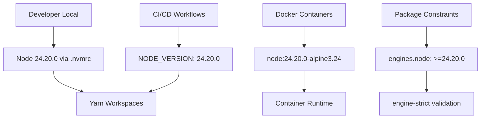

# Design Document

## Revision Note
This design was re-targeted from Node.js 24.21.0 to 24.20.0 because `node:24.21.0-alpine` was not yet available on Docker Hub; 24.20.0 is the newest runtime with a published image. The approach aligns with reference PR #232, and selected modernisation items (npm alignment, `@types/node` bump, `v8` cleanup, and the `runtimeEnvVars` refactor) were folded into the core upgrade rather than deferred. The spec folder name keeps the original ticket slug (`...-24.21.0`); only the referenced target version changed.

## Overview

This design outlines the approach for upgrading Node.js from 22.23.2 to 24.20.0 across the Premier Inn front-end monorepo. The upgrade addresses security vulnerabilities in Node 22 and enables modernisation opportunities. The approach prioritises safety through incremental updates, comprehensive validation, and clear rollback procedures.

## Architecture

### Current State


### Target State


### Update Sequence
1. **Local Development**: Update `.nvmrc` and `engines.node` constraint
2. **CI/CD Infrastructure**: Update front-end workflow environment variables
3. **Docker Infrastructure**: Update base image, npm alignment, and HEALTHCHECK modernisation
4. **Validation**: Run comprehensive test suite
5. **Deployment**: Staged rollout with monitoring

## Components and Interfaces

### File Inventory - Version References

| Location | Current Value | Target Value | Update Method |
|----------|---------------|--------------|---------------|
| `frontend/pi-front-end-applications/.nvmrc` | `22.23.2` | `24.20.0` | Direct replacement |
| `frontend/pi-front-end-applications/package.json` | `engines.node: ">=22.23.2"` | `engines.node: ">=24.20.0"` | JSON field update |
| `frontend/pi-front-end-applications/Dockerfile` | `FROM node:22.23.2-alpine3.24` | `FROM node:24.20.0-alpine3.24` | Base image update |
| `frontend/pi-front-end-applications/Dockerfile` | `npm install --global npm@10.9.9` | `npm install --global npm@11.19.0` | npm version alignment |
| `frontend/pi-front-end-applications/Dockerfile` | legacy HEALTHCHECK / no HOSTNAME | `fetch` + `AbortSignal.timeout(5000)` HEALTHCHECK, add `ENV HOSTNAME="0.0.0.0"` | HEALTHCHECK modernisation |
| `.github/workflows/ci-fe-deploy.yaml` | `NODE_VERSION: "22.23.2"` | `NODE_VERSION: "24.20.0"` | Environment variable |
| `.github/workflows/ci-fe.yaml` | `NODE_VERSION: "22.23.2"` | `NODE_VERSION: "24.20.0"` | Environment variable |
| `.github/workflows/build-graphql.yaml` | `node-version: '22.22.2'` | `node-version: '22.22.2'` (unchanged) | Out of scope — GraphQL stays on Node 22 |
| `frontend/pi-front-end-applications/.github/tests.yaml` | `node-version: [14.x]` | Removed (obsolete legacy file) | Delete file |
| `tools/opera-ohip-app/Dockerfile` | `FROM node:22-alpine` | `FROM node:24-alpine` (floating tag resolves to 24.20.x) | Base image update |

### Docker HEALTHCHECK and HOSTNAME

The primary Dockerfile's HEALTHCHECK was modernised to use the built-in global `fetch` API with `AbortSignal.timeout(5000)` instead of an external HTTP client. A new `ENV HOSTNAME="0.0.0.0"` was added so the Next.js standalone server binds to all interfaces (rather than only loopback), which allows the `/api/liveness` liveness probe to reach the server. This resolves the previously-blocked container health check.

### Package Architecture

```
pi-front-end-applications/
├── apps/next-apps/
│   ├── premier-inn/          # Next.js app
│   ├── business-booker/      # Next.js app  
│   └── ccui/                 # Next.js app
├── pi-components-catalog/    # @whitbread-eos/* packages
│   ├── atoms/               # Basic components
│   ├── molecules/           # Composed components
│   ├── organisms/           # Complex components
│   ├── layout/              # Layout components
│   ├── utils/               # Shared utilities
│   ├── api/                 # GraphQL types/client
│   └── config/              # Build configs
├── scripts/runtimeEnvVars/   # Runtime env-var tool (refactored onto Node built-ins)
└── package.json             # Root workspace config
```

### Native Dependencies Risk Assessment

| Dependency | Risk Level | Mitigation |
|------------|------------|------------|
| `sharp` | High | Version check, build verification, fallback plan |
| `node-gyp` dependencies | Medium | Pre-upgrade audit, build validation |
| `@next/swc-*` | Medium | Next.js 15.5 compatibility verified |
| `fsevents` (macOS) | Low | Platform-specific, usually auto-resolves |

## Data Models

### Version Constraint Strategy
```typescript
// Current
engines: {
  node: ">=22.23.2"
}

// Target - minimum-only constraint (matches reference PR #232, no upper bound)
engines: {
  node: ">=24.20.0"
}
```

### Docker Image Strategy
```dockerfile
# Current
FROM node:22.23.2-alpine3.24 AS base
RUN npm install --global npm@10.9.9

# Target - Node 24.20.0 with aligned npm and modernised health check
FROM node:24.20.0-alpine3.24 AS base
RUN npm install --global npm@11.19.0

# Standalone server binding + modern fetch-based health check
ENV HOSTNAME="0.0.0.0"
HEALTHCHECK CMD node -e "fetch('http://localhost:3000/api/liveness', { signal: AbortSignal.timeout(5000) }).then(r => process.exit(r.ok ? 0 : 1)).catch(() => process.exit(1))"
```

## API Contracts

### CI/CD Interface Changes

```yaml
# Front-end workflow environment variables
env:
  NODE_VERSION: "24.20.0"  # Updated from 22.23.2
  
# Action Inputs
- uses: actions/setup-node@v7
  with:
    node-version: ${{ env.NODE_VERSION }}
    node-version-file: frontend/pi-front-end-applications/.nvmrc
```

Note: `.github/workflows/build-graphql.yaml` is intentionally left on Node `22.22.2` and is not modified by this upgrade.

### Package Manager Integration

```json
{
  "engines": {
    "node": ">=24.20.0"
  },
  "os": ["darwin", "linux"]
}
```

With `engine-strict=true`, Yarn will enforce this constraint at install time.

## Error Handling

### Native Dependency Failures
1. **Pre-compilation check**: Run `yarn install` and capture any native build failures
2. **Fallback strategy**: Identify alternative packages or version pins
3. **Sharp-specific**: Verify image processing functionality with test images

### CI/CD Failures  
1. **Workflow validation**: Test CI changes in a feature branch first
2. **Matrix strategy**: Consider testing multiple Node versions during transition
3. **Build cache invalidation**: Clear Nx cache after Node version changes

### Runtime Compatibility Issues
1. **Health check validation**: Ensure `/api/liveness` endpoints remain functional (modern `fetch`-based HEALTHCHECK + `HOSTNAME="0.0.0.0"` binding)
2. **Memory/performance monitoring**: Watch for Node 24 behaviour differences
3. **Dependency conflict resolution**: Update lockfiles and resolve peer dependency warnings

## Testing Strategy

### Validation Gate Sequence
```bash
# Phase 1: Installation and Build
yarn install                    # Must complete without errors
yarn build                      # All packages must build
yarn build:atomic:components    # Shared packages must build

# Phase 2: Code Quality
yarn type-check                 # TypeScript validation
yarn lint                       # ESLint validation
yarn test:ci                    # Jest test suite

# Phase 3: Integration
yarn check-integrity:all        # Full validation pipeline
docker build -t test-image .    # Container build
docker run --health-cmd=...     # Container health check
```

### Rollback Testing
1. **Version reversion**: Test rolling back `.nvmrc` and rebuilding
2. **CI rollback**: Verify workflow rollback procedures
3. **Container rollback**: Test Docker image tag reversion

### Performance Baseline
- Capture build times on Node 22.23.2 before upgrade
- Compare build times on Node 24.20.0 after upgrade
- Monitor runtime memory usage and response times

## Risk Analysis and Mitigations

| Risk | Probability | Impact | Mitigation |
|------|-------------|--------|------------|
| Sharp compilation failure | Medium | High | Test in isolated environment first, version pin fallback |
| CI/CD pipeline breaks | Low | Medium | Feature branch testing, gradual rollout |
| Production runtime issues | Low | High | Staged deployment, monitoring, quick rollback plan |
| npm version incompatibility | Medium | Medium | Pin npm to `11.19.0` to match Node 24.20.0's bundled npm |
| Dependencies require updates | Medium | Medium | Audit dependencies pre-upgrade, plan updates |

## Deployment Strategy

### Phased Rollout
1. **Development**: Local developer environments first
2. **CI/CD**: Update build pipelines with feature branch validation
3. **Staging**: Deploy to staging environment with monitoring
4. **Production**: Staged rollout with immediate rollback capability

### Monitoring and Validation
- Application startup times
- Memory usage patterns
- Build pipeline success rates
- Error rate monitoring for native dependencies
- Health check success rates

## Modernisation

### Items Folded Into the Core Upgrade (reference PR #232)
1. **npm version alignment**: Docker npm pin updated to `npm@11.19.0` to match Node 24.20.0's bundled npm
2. **`@types/node` bump**: Updated `22.10.2 → 24.13.3` across all three apps (premier-inn, business-booker, ccui)
3. **`v8` dependency cleanup**: Removed the unused `v8` npm dependency from premier-inn and changed `import v8 from 'v8'` to `import v8 from 'node:v8'` in `memory.js` and `memory.test.js`
4. **`scripts/runtimeEnvVars` refactor**: Refactored onto Node built-ins (`node:util` `parseArgs` + `styleText`), dropping the `glob` and `yargs` dependencies. Marked `type: module` with `engines.node >=24.20.0`. This also removed the `npm install` layer from the Dockerfile and from `.github/frontend/actions/build/pre-build.sh`.

### Remaining Optional Enhancements (Post-Core Upgrade)
1. **Tooling updates**: Review ESLint, Prettier, Jest for Node 24 optimisations
2. **Performance features**: Assess new Node.js 24 APIs for build performance
3. **CI matrix optimisation**: Consider testing against multiple Node versions

These items may be implemented as separate, optional tasks after the core security upgrade is stable.
