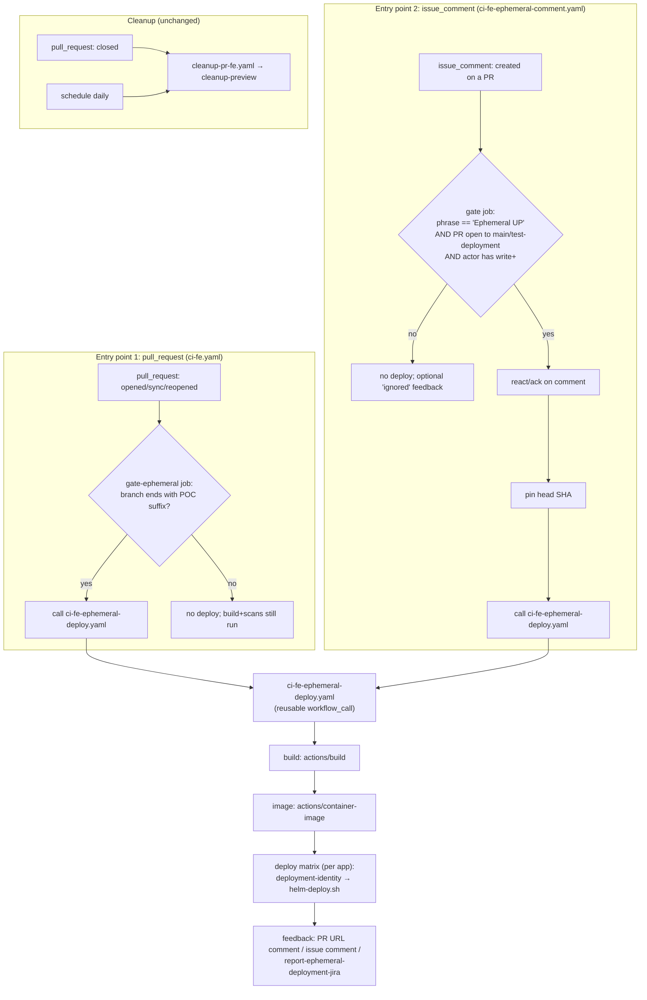

# Design Document

## Overview

Today `deploy-frontend-ephemeral` in `.github/workflows/ci-fe.yaml` deploys a preview for
**every** pull request against `main`/`test-deployment`, for all three Next.js apps
(`premier-inn`, `business-booker`, `ccui`). Its only guard is:

```yaml
if: |
  always() &&
  needs.image-build.result == 'success' &&
  github.event_name == 'pull_request' &&
  (github.base_ref == 'main' || github.base_ref == 'test-deployment')
```

This design makes that deployment **on demand**. A preview is created only when one of two
explicit signals is present:

1. **POC branch suffix** — the PR source branch ends with `-JIRA-XX`, `-Issues-XX`, or
   `-TEAMS-XX`. These deploy automatically as part of the normal `pull_request` pipeline (as
   they effectively do today).
2. **Comment trigger** — for any other PR, an authorised user comments the exact phrase
   `Ephemeral UP`. This runs the same deployment out of band, building and deploying the immutable PR head commit pinned by SHA (not the mutable merge ref).

PRs with neither signal run all the non-deployment checks (build, scans) but produce **no**
Helm release, GitHub deployment environment, or preview-URL comment.

Two design decisions frame everything below:

- **Reuse, don't rebuild.** The deploy mechanics (`deployment-identity`, `container-image`,
  `helm-deploy.sh`, `cleanup-preview`, the notification scripts) are unchanged. Only the
  **gating** in front of them changes, plus a new comment-driven entry point that funnels
  into the same reusable deploy path.
- **One deploy path, two entry points.** The actual deploy steps are factored into a
  reusable workflow (`ci-fe-ephemeral-deploy.yaml`) so both entry points (the `pull_request`
  pipeline for POC branches, and an `issue_comment` workflow for the trigger phrase) call the
  same job. This keeps the "same result as current per-PR deployment" guarantee
  (Requirements 3.2, 4.x) structurally true rather than by duplication.

### Research summary

Key findings from reading the current workflows/actions that shape the design:

- **`deployment-identity/identity.sh`** derives `release-name`, `environment-name`, host name,
  values path, and image repo. For an ephemeral preview with a PR number the release is keyed
  on the **PR number** and lowercased — `release-name = <app>-pr-<pr-number>` — with
  `host-name` derived from it. The long-lived `dev` variant (and any no-PR context, i.e.
  `pr-number=0`) stays branch-based: `release-name = <app>-<sanitized-branch>`. The GitHub
  environment display name is always `environment-name = <app>-PR-<pr-number>` (uppercase
  `PR`). This is the single source of naming for deploy *and* cleanup, so both trigger paths
  converge on identical names automatically as long as they pass the same `branch-name` +
  `pr-number` (Requirements 4.1, 4.5, 5.3).
- **`cleanup-preview`** and `cleanup-pr-fe.yaml` tear down by PR number: they uninstall the
  lowercase `<app>-pr-<n>` release (with the uppercase and legacy branch-based
  `<app>-<sanitized-branch>` names as idempotent fallbacks) and delete the `<app>-PR-<pr-number>`
  environment, on PR close and on a daily stale sweep. Because naming is identical regardless of
  how the deploy was triggered, **cleanup needs no changes** (Requirement 5). Helm
  `uninstall --ignore-not-found` and the environment-delete 404 handling make cleanup a safe
  no-op when nothing was deployed (Requirement 5.4).
- **Current POC handling.** POC-suffixed branches (`-Issues-XX`, `-JIRA-XX`) already skip
  dependency-review, code-analysis, quality-scans, and prisma-scans via `endsWith(...)`
  guards, but still build (`build` job has no such guard) and still deploy (the deploy job only
  checks `event_name == 'pull_request'`). `-JIRA-XX` also suppresses the preview-URL PR comment
  (`if: ${{ !endsWith(github.head_ref, '-JIRA-XX') }}`) and instead reports to Jira via
  `report-ephemeral-deployment-jira`. All of this must be preserved (Requirements 2.2, 2.4,
  7.1, 7.2). Note: the current code only recognises `-Issues-XX`/`-JIRA-XX`; `-TEAMS-XX` is a
  **new** suffix this spec adds to the deploy-gate set.
- **`image-build` job** already builds PR images from `github.head_ref` and is the upstream of
  the deploy job. For the comment path we cannot depend on that job (different event), so the
  comment workflow must run build + image itself before deploying.
- **`pull_request` builds use the merge ref, but the comment path pins the head SHA.** A normal
  `pull_request` event checks out `refs/pull/<n>/merge` (head merged with base). The comment path
  instead always checks out the **immutable PR head SHA**: the merge ref is mutable and can be
  recomputed by GitHub after the authorisation check, so building it is a time-of-check/time-of-use
  (TOCTOU) risk (CodeQL #541-#545). The comment path therefore deploys the PR head as-is;
  mergeability is used only to flag `base-out-of-sync` and warn the user (Requirements 3.7, 3.8).
- **Security.** `issue_comment` fires with the base-branch workflow definition and a
  `GITHUB_TOKEN`, and — critically — is available to anyone who can comment, including outside
  contributors. So the comment path **must** verify the commenter's permission before doing any
  build/deploy work (Requirement 6).

## Architecture

### Component map



### Workflow inventory

| Workflow / file | Trigger | Change | Purpose |
|---|---|---|---|
| `ci-fe.yaml` | `pull_request`, `merge_group` | **Modified** | Replace the unconditional deploy job with a gate that only proceeds for POC-suffixed branches, delegating deploy to the reusable workflow. |
| `ci-fe-ephemeral-deploy.yaml` | `workflow_call` | **New** | The single, reusable deploy path (build → image → per-app Helm deploy → feedback). Called by both entry points. |
| `ci-fe-ephemeral-comment.yaml` | `issue_comment` (created) | **New** | Comment-trigger entry point: match phrase, authorise actor, resolve ref, then call the reusable deploy workflow. |
| `cleanup-pr-fe.yaml` | `pull_request` closed, `schedule`, `workflow_dispatch` | **Unchanged** | Already tears down by app+branch+PR naming; covers both trigger paths. |
| `.github/frontend/actions/*` | — | **Unchanged** | `deployment-identity`, `container-image`, `build`, `cleanup-preview` reused as-is. |
| `.github/frontend/scripts/*` | — | **Unchanged** | `helm-deploy.sh`, `clear-stale-helm-op.sh`, notification scripts reused as-is. |

### Why a reusable workflow (not two copies of the deploy job)

Requirement 3.2/3.5 demand the comment path produce *the same result* as the PR path and never
create duplicate/conflicting releases. Factoring the deploy matrix into one
`workflow_call` workflow means:

- There is exactly one definition of "how a frontend ephemeral deploy works".
- Both entry points pass the same identity inputs (`branch-name`, `pr-number`, per-app image
  tags), so `deployment-identity` yields the same release/environment names — a re-deploy is a
  Helm `upgrade --install` over the same release, i.e. idempotent, not a duplicate
  (Requirement 3.5).

## Components and Interfaces

### 1. POC gate in `ci-fe.yaml`

The existing `deploy-frontend-ephemeral` job is replaced by a small **gate** job plus a call
to the reusable deploy workflow. The gate encapsulates the "is this a POC branch" decision.

```yaml
  gate-ephemeral:
    name: Decide ephemeral deploy (POC suffix)
    if: github.event_name == 'pull_request'
    runs-on: ubuntu-slim
    outputs:
      should-deploy: ${{ steps.decide.outputs.should-deploy }}
    steps:
      - id: decide
        env:
          HEAD_REF: ${{ github.head_ref }}
          BASE_REF: ${{ github.base_ref }}
        run: |
          set -euo pipefail
          should=false
          if [[ "$BASE_REF" == "main" || "$BASE_REF" == "test-deployment" ]]; then
            case "$HEAD_REF" in
              *-JIRA-XX|*-Issues-XX|*-TEAMS-XX) should=true ;;
            esac
          fi
          echo "should-deploy=$should" >> "$GITHUB_OUTPUT"

  deploy-frontend-ephemeral:
    needs: [image-build, gate-ephemeral]
    if: |
      always() &&
      needs.image-build.result == 'success' &&
      needs.gate-ephemeral.outputs.should-deploy == 'true'
    uses: ./.github/workflows/ci-fe-ephemeral-deploy.yaml
    with:
      pr-number: ${{ github.event.pull_request.number }}
      branch-name: ${{ github.head_ref }}
      business-booker-image-tag: ${{ needs.image-build.outputs.business-booker-image-tag }}
      ccui-image-tag: ${{ needs.image-build.outputs.ccui-image-tag }}
      premier-inn-image-tag: ${{ needs.image-build.outputs.premier-inn-image-tag }}
      trigger-source: pull_request
    secrets: inherit
```

Notes:
- The gate matches the suffix set `{-JIRA-XX, -Issues-XX, -TEAMS-XX}`. The existing
  `endsWith(..., '-Issues-XX')` / `endsWith(..., '-JIRA-XX')` guards on the *other* jobs
  (dependency-review, code-analysis, quality-scans, prisma-scans) are left exactly as they are,
  so POC branches keep skipping those (Requirement 2.2). `-TEAMS-XX` only affects the deploy
  gate; it is not added to those skip guards.
- `build` and `image-build` are unchanged and still run for POC branches, so the deploy job has
  its image tags (Requirement 2.3, 2.5 — a new push re-runs the whole `pull_request` pipeline
  and re-deploys).

### 2. Reusable deploy workflow `ci-fe-ephemeral-deploy.yaml`

`workflow_call` interface:

```yaml
on:
  workflow_call:
    inputs:
      pr-number:      { required: true,  type: string }
      branch-name:    { required: true,  type: string }   # PR head branch, drives naming
      trigger-source: { required: true,  type: string }   # "pull_request" | "comment"
      # image tags are optional: when the caller already built (pull_request path) it passes
      # them and the build/image jobs are skipped; when absent (comment path) this workflow
      # builds them itself.
      business-booker-image-tag: { required: false, type: string, default: "" }
      ccui-image-tag:            { required: false, type: string, default: "" }
      premier-inn-image-tag:     { required: false, type: string, default: "" }
      checkout-ref:   { required: false, type: string, default: "" }  # PR head SHA (comment path); empty on POC path
      base-out-of-sync: { required: false, type: boolean, default: false }
```

Jobs:

1. **`build`** (`if: inputs.premier-inn-image-tag == ''`) — runs `actions/build` +
   `actions/container-image` (push to DockerHub+ECR) from `checkout-ref`. Only used by the
   comment path; skipped when the caller already supplied tags.
2. **`resolve-tags`** — a tiny job that outputs the effective image tags: the passed-in inputs
   when present, else the `build` job outputs. Downstream deploy reads from here so the matrix
   is identical for both entry points.
3. **`deploy`** — the current per-app matrix, moved here verbatim:
   `deployment-identity` → `setup-helm` → `clear-stale-helm-op.sh` → `helm-deploy.sh` →
   PR URL comment (suppressed for `-JIRA-XX`) → linked-issue comment.
4. **`report-ephemeral-deployment-jira`** — moved here verbatim; still gated on
   `endsWith(head, '-JIRA-XX')`. Because the comment path passes `branch-name`, this still
   fires for a `-JIRA-XX` branch deployed via comment.

The `environment:` block (`name: <app>-PR-<n>`, `url: https://<host>`) moves with the deploy
job so environments remain registered on the Environments page (Requirement 4.5).

### 3. Comment-trigger workflow `ci-fe-ephemeral-comment.yaml`

```yaml
name: Frontend Ephemeral Comment Trigger
on:
  issue_comment:
    types: [created]

permissions:
  contents: read
  pull-requests: write
  issues: write

concurrency:
  # Serialise per PR so two quick comments don't race on the same releases.
  group: fe-ephemeral-comment-${{ github.event.issue.number }}
  cancel-in-progress: false

jobs:
  authorize:
    name: Validate trigger phrase and permission
    # Cheap pre-filter before spinning a runner up: must be a PR comment whose body,
    # trimmed, equals the phrase.
    if: |
      github.event.issue.pull_request != null &&
      trim(github.event.comment.body) == 'Ephemeral UP'
    runs-on: ubuntu-slim
    outputs:
      authorized:       ${{ steps.check.outputs.authorized }}
      pr-number:        ${{ steps.pr.outputs.number }}
      head-ref:         ${{ steps.pr.outputs.head-ref }}
      base-ref:         ${{ steps.pr.outputs.base-ref }}
      checkout-ref:     ${{ steps.pr.outputs.checkout-ref }}
      base-out-of-sync: ${{ steps.pr.outputs.out-of-sync }}
    steps:
      - name: Check commenter permission
        id: check
        uses: actions/github-script@v9
        with:
          script: |
            const { data } = await github.rest.repos.getCollaboratorPermissionLevel({
              owner: context.repo.owner,
              repo: context.repo.repo,
              username: context.payload.comment.user.login,
            });
            const ok = ['write', 'admin', 'maintain'].includes(data.permission);
            core.setOutput('authorized', ok ? 'true' : 'false');
      - name: Resolve PR head/base and mergeability
        id: pr
        if: steps.check.outputs.authorized == 'true'
        uses: actions/github-script@v9
        with:
          script: |
            const number = context.payload.issue.number;
            const { data: pr } = await github.rest.pulls.get({
              owner: context.repo.owner, repo: context.repo.repo, pull_number: number,
            });
            const supported = ['main', 'test-deployment'].includes(pr.base.ref);
            const open = pr.state === 'open';
            if (!supported || !open) { core.setFailed('PR is not open against a supported base'); return; }
            // Always check out the immutable pr.head.sha, never the mutable
            // refs/pull/<n>/merge ref, to close the TOCTOU gap (CodeQL #541-#545).
            // mergeable is used only to flag out-of-sync (informational).
            const mergeable = pr.mergeable === true;
            core.setOutput('number', String(number));
            core.setOutput('head-ref', pr.head.ref);
            core.setOutput('base-ref', pr.base.ref);
            core.setOutput('checkout-ref', pr.head.sha);
            core.setOutput('out-of-sync', mergeable ? 'false' : 'true');

  acknowledge:
    needs: authorize
    if: needs.authorize.outputs.authorized == 'true'
    runs-on: ubuntu-slim
    steps:
      - name: React to the trigger comment
        uses: actions/github-script@v9
        with:
          script: |
            await github.rest.reactions.createForIssueComment({
              owner: context.repo.owner, repo: context.repo.repo,
              comment_id: context.payload.comment.id, content: 'rocket',
            });

  ignored:
    needs: authorize
    if: needs.authorize.outputs.authorized == 'false'
    runs-on: ubuntu-slim
    steps:
      - name: Note that the request was ignored
        uses: actions/github-script@v9
        with:
          script: |
            await github.rest.reactions.createForIssueComment({
              owner: context.repo.owner, repo: context.repo.repo,
              comment_id: context.payload.comment.id, content: 'confused',
            });
            core.warning('Ephemeral deploy request ignored: commenter lacks write access.');

  notify-out-of-sync:
    needs: authorize
    if: needs.authorize.outputs.authorized == 'true' && needs.authorize.outputs.base-out-of-sync == 'true'
    runs-on: ubuntu-slim
    steps:
      - name: Warn that the branch is not in sync with base
        uses: actions/github-script@v9
        with:
          script: |
            await github.rest.issues.createComment({
              owner: context.repo.owner, repo: context.repo.repo,
              issue_number: Number('${{ needs.authorize.outputs.pr-number }}'),
              body: 'This branch is not in sync with `main` and has unresolved conflicts. Deploying the branch head as-is — please update the branch.',
            });

  deploy:
    needs: [authorize, acknowledge]
    if: needs.authorize.outputs.authorized == 'true'
    uses: ./.github/workflows/ci-fe-ephemeral-deploy.yaml
    with:
      pr-number: ${{ needs.authorize.outputs.pr-number }}
      branch-name: ${{ needs.authorize.outputs.head-ref }}
      checkout-ref: ${{ needs.authorize.outputs.checkout-ref }}
      base-out-of-sync: ${{ needs.authorize.outputs.base-out-of-sync == 'true' }}
      trigger-source: comment
    secrets: inherit
```

Notes:
- **Authorisation is first and blocking** (Requirement 6.1/6.2). Nothing builds or deploys
  until `getCollaboratorPermissionLevel` returns `write`/`maintain`/`admin`. Because
  `issue_comment` runs the *base* workflow definition with only the declared permissions, and
  never with a production-scoped environment, the comment path cannot reach production
  namespaces or override protected environments (Requirement 6.4) — it funnels into the same
  `opera-fe` deploy path as everything else.
- **Open + supported-base check** (Requirement 6.3, 3.1): `pulls.get` confirms the PR is open
  and targets `main`/`test-deployment`; otherwise the job fails fast without deploying.
- **Always pin the head SHA** (Requirements 3.7, 3.8): the comment path checks out the immutable
  PR head SHA, never the mutable `refs/pull/<n>/merge` ref, closing the TOCTOU gap (CodeQL
  #541-#545). It deploys the head as-is with no merge/rebase; when the branch is out of sync an
  out-of-sync PR comment warns the user.
- **Dedup with POC path** (Requirement 3.5): the deploy passes the same `pr-number` (and
  `branch-name`), so `deployment-identity` produces the same `<app>-pr-<n>` release and
  `<app>-PR-<n>` environment a POC `pull_request` run would. A comment on a POC branch
  therefore `helm upgrade --install`s the *same* release rather than a parallel one.

### Trigger-phrase matching rule

`Ephemeral UP` is matched against the comment body **trimmed of leading/trailing whitespace**,
**case-sensitively**, requiring an **exact equality** (not substring). This keeps the rule
unambiguous and prevents accidental triggers from quoted text or longer sentences
(Requirement 3.4). The decision is expressed as a pure predicate (see Correctness Properties).
In the shipped change this predicate is implemented **inline** in the `authorize`
github-script job of `ci-fe-ephemeral-comment.yaml` (the pseudo-code below remains its
reference specification); it is not extracted into a standalone module.

## Data Models

These are the logical inputs/outputs of the **gating decision** — the one piece of pure logic
this feature adds. Everything else is orchestration over existing actions.

### `TriggerEvent` (normalised input to the gate)

| Field | Type | Source |
|---|---|---|
| `eventType` | enum `pull_request` \| `issue_comment` | `github.event_name` |
| `baseRef` | string | `github.base_ref` / `pr.base.ref` |
| `headRef` | string | `github.head_ref` / `pr.head.ref` |
| `prState` | enum `open` \| `closed` | `pr.state` |
| `commentBody` | string \| null | `github.event.comment.body` |
| `actorPermission` | enum `none`\|`read`\|`triage`\|`write`\|`maintain`\|`admin` | `getCollaboratorPermissionLevel` |
| `mergeable` | boolean \| null | `pr.mergeable` |

### `GateDecision` (output of the gate)

| Field | Type | Meaning |
|---|---|---|
| `shouldDeploy` | boolean | Whether to run the reusable deploy workflow. |
| `reason` | enum `poc-suffix` \| `authorised-comment` \| `not-triggered` \| `unauthorised` \| `unsupported-base` \| `pr-not-open` | Why. |
| `checkoutRef` | string | Always the immutable PR head SHA (pinned to avoid the mutable merge-ref TOCTOU). |
| `baseOutOfSync` | boolean | True when not mergeable (drives the out-of-sync PR comment). |

### Gate decision logic (pseudo-code, the single source of truth for the properties)

```
POC_SUFFIXES = ["-JIRA-XX", "-Issues-XX", "-TEAMS-XX"]
TRIGGER_PHRASE = "Ephemeral UP"
SUPPORTED_BASES = ["main", "test-deployment"]
WRITE_LEVELS = ["write", "maintain", "admin"]

function decide(e):
  if e.eventType == "pull_request":
    if e.baseRef in SUPPORTED_BASES and any(e.headRef endsWith s for s in POC_SUFFIXES):
      return { shouldDeploy: true, reason: "poc-suffix" }
    return { shouldDeploy: false, reason: "not-triggered" }

  if e.eventType == "issue_comment":
    if trim(e.commentBody) != TRIGGER_PHRASE:
      return { shouldDeploy: false, reason: "not-triggered" }
    if e.actorPermission not in WRITE_LEVELS:
      return { shouldDeploy: false, reason: "unauthorised" }
    if e.prState != "open":
      return { shouldDeploy: false, reason: "pr-not-open" }
    if e.baseRef not in SUPPORTED_BASES:
      return { shouldDeploy: false, reason: "unsupported-base" }
    return {
      shouldDeploy: true, reason: "authorised-comment",
      checkoutRef: headSha,  // always pin the immutable head SHA (TOCTOU); never the merge ref
      baseOutOfSync: e.mergeable != true,
    }

  return { shouldDeploy: false, reason: "not-triggered" }
```

The naming/identity model (`release-name`, `environment-name`, `host-name`, `values-path`,
`image-repo`) is **unchanged** and owned by `deployment-identity/identity.sh`; this feature
does not add or alter any field there.

## Correctness Properties

*A property is a characteristic or behavior that should hold true across all valid executions of a system — essentially, a formal statement about what the system should do. Properties serve as the bridge between human-readable specifications and machine-verifiable correctness guarantees.*

Most of this feature is CI orchestration and side-effectful deploy/cleanup over existing,
unchanged actions — those are covered by integration and example tests (see Testing Strategy).
The one piece of genuinely pure, input-varying logic is the **gate decision**
`decide(TriggerEvent) -> GateDecision` and the deterministic **naming derivation**. The
properties below target exactly those. They are written against the pseudo-code in *Data
Models* as the single source of truth, so the decision can be validated independently of
GitHub.

> **Note:** the pure `decide()` gate module (`.github/frontend/scripts/ephemeral-gate.js`) was
> removed from this change, and the `fast-check` property tests that targeted `decide()` were
> not shipped with it. The gate decision logic now lives inline in the two entry-point
> workflows — the `gate-ephemeral` bash step in `ci-fe.yaml` and the `authorize`
> github-script job in `ci-fe-ephemeral-comment.yaml`. The properties below are retained as
> **specification-level** statements of intended behaviour, not as descriptions of shipped
> executable tests.

### Property 1: Pull-request POC gate

*For any* `pull_request` event, `decide(e).shouldDeploy` is `true` **if and only if**
`e.baseRef` is a supported base (`main` or `test-deployment`) **and** `e.headRef` ends with
one of the POC suffixes (`-JIRA-XX`, `-Issues-XX`, `-TEAMS-XX`); otherwise it is `false`.

**Validates: Requirements 1.1, 1.4, 2.1**

### Property 2: Comment-path gate

*For any* `issue_comment` event, `decide(e).shouldDeploy` is `true` **if and only if** the
comment body trimmed of leading/trailing whitespace equals exactly `Ephemeral UP`
(case-sensitive) **and** `e.actorPermission` is one of `write`, `maintain`, `admin` **and**
`e.prState` is `open` **and** `e.baseRef` is a supported base. Any string that is not an exact
trimmed match (different casing, a substring, or extra words), any actor below write access,
any closed PR, or any unsupported base yields `false`.

**Validates: Requirements 3.1, 3.4, 6.1, 6.2, 6.3**

### Property 3: Head-SHA pinning and out-of-sync flag

*For any* `issue_comment` event that authorises a deploy (Property 2 holds), `decide(e)`
returns `checkoutRef` equal to the immutable PR head SHA — never the mutable
`refs/pull/<n>/merge` ref — regardless of `e.mergeable`, and never produces a merged/rebased ref
of its own making. `baseOutOfSync` is `false` **if and only if** `e.mergeable` is exactly `true`;
when `e.mergeable` is `false` or `null`, `baseOutOfSync` is `true` (driving the out-of-sync
warning only — it does not change the checkout).

**Validates: Requirements 3.7, 3.8**

### Property 4: Naming determinism independent of trigger source

*For any* frontend app in {`premier-inn`, `business-booker`, `ccui`}, branch name, and PR
number, the derived `release-name`, `environment-name`, and `host-name` depend only on
(`app`, `branch`, `pr-number`) and are identical whether the deploy was reached via the
`pull_request` (POC) path or the comment path. Consequently deploying the same app for the
same PR twice targets the same Helm release and GitHub environment rather than a second one.

**Validates: Requirements 3.5, 4.5, 5.3**

## Error Handling

| Failure | Handling | Requirement |
|---|---|---|
| Commenter lacks write access | `authorize` sets `authorized=false`; `deploy` is skipped; `ignored` job adds a `confused` reaction and logs a warning. No build/deploy runs. | 6.1, 6.2 |
| Comment on a closed PR or unsupported base | `authorize` fails fast (`core.setFailed`) before any deploy; run is red so the state is visible. | 3.1, 6.3 |
| Branch out of sync / mergeability still computing (`null`) | The comment path always deploys the immutable head SHA (never the merge ref), so there is no merge/rebase. When mergeable is not `true`, post an out-of-sync PR comment to warn the user. | 3.7, 3.8 |
| Build or image step fails (either path) | The downstream `deploy` matrix does not run (job dependency). Failure is surfaced in the workflow run; `report-*`/Teams status still report. | 7.3 |
| A single app's Helm deploy fails | `clear-stale-helm-op.sh` first clears a stuck release; `helm upgrade --install ... --wait --timeout 5m` then fails that matrix leg. `fail-fast: false` on the matrix lets the other apps continue; the failed leg reddens the run. | 7.3 |
| Concurrent trigger comments on the same PR | `concurrency: fe-ephemeral-comment-<pr>` with `cancel-in-progress: false` serialises them, so two comments cannot race on the same releases. | 3.5 |
| PR closed while nothing was deployed | Cleanup (`cleanup-preview`) uses `helm uninstall --ignore-not-found` and treats environment 404s as "not found"; it is a safe no-op. | 5.4 |
| GitHub App / token lacks a permission during cleanup | Existing cleanup action degrades 403/404 to warnings and continues; unchanged. | 5.1, 5.4 |

Guard-rail notes:
- The comment path deploys **only** to `opera-fe` via the shared chart and declares no
  production environment, so it cannot reach production namespaces or override protected
  environment configuration (Requirement 6.4).
- Authorisation runs **before** any checkout/build, so an unauthorised comment consumes only a
  cheap `ubuntu-slim` permission check.

## Testing Strategy

Because this feature is primarily GitHub Actions orchestration over existing, unchanged
actions, the strategy is layered: a focused property/unit suite for the pure gate logic, plus
static-lint and integration checks for the wiring and side effects.

### Property-based tests (pure gate logic only)

The gate decision (`decide`) and naming derivation are the only PBT-suitable surfaces. The
original plan extracted `decide()` into a small, pure Node module under
`.github/frontend/scripts/` (mirroring how `identity.sh` is a standalone script) so the
properties could run in CI without GitHub. **That module (`ephemeral-gate.js`) was dropped
from the shipped change**, so the `decide()`-targeted property tests below were not
implemented; the gate logic now lives inline in the entry-point workflows. The naming-derivation
property (P4) is still exercisable against `identity.sh`. The subsections below are retained as
the intended test specification.

- Library: a JavaScript property-based testing library (`fast-check`) run under the repo's
  Node toolchain — do **not** hand-roll generators.
- Minimum **100 iterations** per property.
- Each test tags its design property. Tag format:
  **Feature: CTECH-13440-ephemeral-environment-on-demand, Property {number}: {property_text}**

Property → generator sketch:

| Property | Generators |
|---|---|
| P1 Pull-request POC gate | random base refs (supported + unsupported) × random branch names (with and without each POC suffix, including suffix-as-substring-not-ending). Assert the iff. |
| P2 Comment-path gate | random comment bodies (exact phrase with random surrounding whitespace, case variants, substrings, extra tokens) × permission levels × PR states × base refs. Assert the iff. |
| P3 Head-SHA pinning | authorised comment events × `mergeable ∈ {true, false, null}`. Assert `checkoutRef` is always the head SHA and `baseOutOfSync` mirrors `mergeable != true`. |
| P4 Naming determinism | random app ∈ {3 apps} × random branch × random pr-number × trigger-source ∈ {pull_request, comment}. Assert identical `(release-name, environment-name, host-name)` across trigger sources. Ideally exercised against `identity.sh` output to bind the property to the real deriver. |

### Unit / example tests

- P2 anchor examples: `Ephemeral UP` (deploys), `ephemeral up`, ` Ephemeral UP ` (trims →
  deploys), `Please Ephemeral UP now` (no deploy), `Ephemeral UPGRADE` (no deploy).
- POC-suffix examples: `feature/x-JIRA-XX`, `feature/x-Issues-XX`, `feature/x-TEAMS-XX` deploy;
  `feature/x` does not (Requirements 2.1, 1.1).
- `-JIRA-XX` branch: PR-URL comment step skipped and `report-ephemeral-deployment-jira` runs
  (Requirements 2.4, 7.1, 7.2).
- Deploy matrix contains all three apps (Requirement 1.4).

### Static / lint checks (workflow wiring)

- `actionlint` over the new/modified workflows.
- Assertions that both entry points reference `ci-fe-ephemeral-deploy.yaml` (Requirements 2.3,
  3.2), that the comment workflow declares only `contents: read` + PR/issue write and no
  production environment (Requirement 6.4), and that the other jobs' POC skip guards are
  unchanged (Requirement 2.2).

### Integration tests (side effects, external services — NOT PBT)

Per the "when NOT to use PBT" guidance, these use 1–3 representative runs rather than
randomised iterations:

- Non-POC PR, no comment → no Helm release, no environment, no preview comment
  (Requirements 1.3, 1.2 build/scan still run).
- POC branch push → redeploy (Requirement 2.5).
- Authorised `Ephemeral UP` comment on a mergeable PR → deploy from the pinned head SHA, reaction added,
  preview URL posted (Requirements 3.1, 3.3, 3.6, 3.7).
- Authorised comment on a conflicted PR → deploy head as-is + out-of-sync comment
  (Requirement 3.8).
- Unauthorised comment → no deploy, `confused` reaction (Requirements 6.1, 6.2).
- Comment on a POC-suffixed PR → same release upgraded, no duplicate environment
  (Requirement 3.5).
- PR close after each trigger path → release + environment removed (Requirements 5.1, 5.3);
  PR that never deployed → cleanup no-op (Requirement 5.4).
- Teams status reporting still fires (Requirement 7.5).
