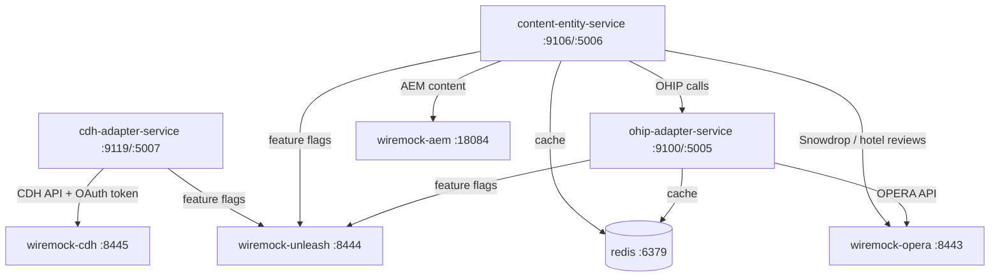

# Design Document

## Overview

This design adds the CDH Adapter Service and its mock CDH dependency (WireMock) to the existing Docker Compose integration environment. The approach replicates the exact patterns established by `ohip-adapter-service` and `content-entity-service` — a WireMock container simulating the external API, a Dockerfile packaging the pre-built JAR, an environment file wiring internal container networking, and build script updates to orchestrate the full stack.

The key design decision is that `wiremock-cdh` serves dual duty: it mocks both the CDH REST API endpoints and the Azure OAuth token endpoint. This avoids needing a separate container for token management.

## Architecture

All services share the `integration-net` bridge network. The CDH adapter service does not require Redis (no caching configured for the integration environment).

## Components and Interfaces

### 1. WireMock CDH Container (`wiremock-cdh`)

| Attribute | Value |
|-----------|-------|
| Image | `wiremock/wiremock:3.12.1` |
| Internal port | 8080 |
| Host port | 8445 |
| Memory limit | 750m |
| Network | `integration-net` |
| Healthcheck | `curl -fsS http://localhost:8080/__admin/mappings` |

Follows the same pattern as `wiremock-opera`, `wiremock-aem`, and `wiremock-unleash`. No volume mounts initially — stubs can be added later via the `/__admin` API or a mounted directory.

### 2. CDH Adapter Service Dockerfile (`dockerfiles/cdh-adapter-service.Dockerfile`)

| Layer | Details |
|-------|---------|
| Base image | `eclipse-temurin:25-jre` |
| System deps | `curl` (for healthcheck) |
| User | `appuser:appuser` (non-root) |
| JAR source | `backend/identity/services/cdh-adapter-service/target/cdh-adapter-service-1.0.0.jar` |
| JAR dest | `/app/app.jar` |
| Exposed ports | 9119 (HTTP), 5007 (debug) |
| Entrypoint | `sh -c "java $JAVA_OPTS -jar /app/app.jar"` |

Identical structure to `ohip-adapter-service.Dockerfile` — only the JAR path and exposed ports differ.

### 3. Environment File (`cdh-adapter-service.env`)

Environment variables configure the service to talk to WireMock containers instead of real Azure/CDH endpoints:

| Variable Group | Routing Target |
|---------------|---------------|
| `CDH_API_HOST` | `http://wiremock-cdh:8080` |
| `AZURE_OAUTH_CLIENT_TOKEN_URL` | `http://wiremock-cdh:8080/oauth2/token` |
| OAuth credentials | Mock placeholder values |
| Unleash | `http://wiremock-unleash:8080` |
| Debug | Remote debug agent on port 5007 |

### 4. Docker Compose Service (`cdh-adapter-service`)

| Attribute | Value |
|-----------|-------|
| Image | `cdh-adapter-service:local` |
| Build context | `../../` (monorepo root) |
| Dockerfile | `backend/integration-env/dockerfiles/cdh-adapter-service.Dockerfile` |
| Host ports | 9119 (app), 5007 (debug) |
| Env file | `./cdh-adapter-service.env` |
| Depends on | `wiremock-cdh` (healthy), `wiremock-unleash` (healthy) |
| Healthcheck | `curl -fsS http://localhost:9119/v1/cdh/actuator/health` |
| Network | `integration-net` |

### 5. Build Script Updates

The build script (`build.sh`) requires three additions:
1. `docker build` command for `cdh-adapter-service:local`
2. `wait_for_healthy "cdh-adapter-service"` call after compose up
3. CDH health URL in the final summary output

**Design decision:** The build script assumes all JARs are pre-built. The existing Maven build step already builds specific modules — CDH is in a different squad, so the Maven `-pl` flag must be updated to include `identity/services/cdh-adapter-service`.

### 6. Services Diagram

Update `services.md` to include `cdh-adapter-service` and `wiremock-cdh` nodes with their connections.

## Data Models

No new data models are introduced. This feature is entirely infrastructure configuration. The CDH Adapter Service's existing domain models are unchanged.

**Artifact mapping:**

| File | Location |
|------|----------|
| `cdh-adapter-service.Dockerfile` | `backend/integration-env/dockerfiles/` |
| `cdh-adapter-service.env` | `backend/integration-env/` |
| `docker-compose.yml` (updated) | `backend/integration-env/` |
| `build.sh` (updated) | `backend/integration-env/` |
| `services.md` (updated) | `backend/integration-env/` |

## Error Handling

### Container Startup Failures

- **JAR not found**: Docker build fails with `COPY` error. The build script will exit with an error message indicating the Dockerfile build failed.
- **Port conflict**: If host ports 8445, 9119, or 5007 are already in use, Docker Compose will fail with a bind error. The developer must free the port or adjust mappings.
- **Health check timeout**: The `wait_for_healthy` function times out after 120 seconds (24 retries × 5s). On timeout, it dumps the last 120 lines of container logs and exits non-zero.
- **WireMock dependency not healthy**: The `cdh-adapter-service` container won't start until `wiremock-cdh` and `wiremock-unleash` pass their healthchecks, preventing race conditions.

### Missing OAuth Stubs

If no WireMock stubs are configured for the OAuth token endpoint, the CDH adapter service will fail its healthcheck because it cannot obtain a token on startup. This is expected — developers need to either:
1. Mount WireMock stub files for the token endpoint, or
2. POST stubs to `http://localhost:8445/__admin/mappings` before the service starts

## Testing Strategy

**Property-based testing is NOT applicable** for this feature. The deliverables are purely infrastructure configuration (Dockerfiles, YAML, shell scripts, environment files). There are no pure functions, data transformations, or algorithmic logic to validate with PBT.

### Validation Approach

| Validation | Method |
|-----------|--------|
| Docker Compose syntax | `docker compose config` (validated in build script) |
| Dockerfile build | `docker build` command in build script |
| Service startup | Healthcheck passes within 120s |
| Dependency ordering | `depends_on` with `condition: service_healthy` |
| Network connectivity | Services communicate over `integration-net` |

### Manual Smoke Tests

1. Run `build.sh` — all images build, compose starts, all healthchecks pass
2. Verify `http://localhost:9119/v1/cdh/actuator/health` returns 200
3. Verify `http://localhost:8445/__admin/mappings` returns WireMock admin response
4. Verify CDH adapter service logs show connection to WireMock endpoints

### Integration Verification

- The `build.sh` script itself serves as an integration test: it builds images, starts the stack, and verifies health. If any step fails, the script exits non-zero with diagnostic output.
- No separate test framework is needed for configuration files.
