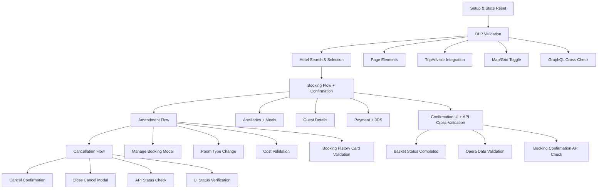
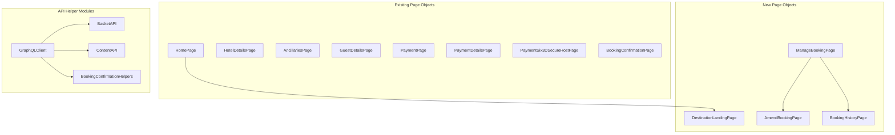

# Design Document

## Overview
This design defines the migration architecture for converting the comprehensive baseline test from the old WebDriverIO + JavaScript framework (`qa/reference/`) to the new Playwright + TypeScript framework (`qa/`) while maintaining 100% functional parity. The new implementation leverages Playwright's Page Object Model, TypeScript safety, and GraphQL API integration to create maintainable, reliable test automation.

### Migration Philosophy
The goal is functional parity, not a line-by-line clone. The new test must perform the same actions and validations as the original, but it should not replicate the old test's implementation patterns where Playwright or TypeScript offer a better, more idiomatic, or more reliable approach. Concretely:

- **Prefer Playwright idioms** — web-first auto-waiting assertions (`expect(locator).toBeVisible()`), `FrameLocator` for iframes, `APIRequestContext` for API calls, and role/testid-based locators instead of manual waits and imperative WebDriverIO patterns.
- **Reuse over duplication** — any page interaction, helper, or utility created during this migration must be written for reuse across other tests and grouped according to the Page Object Model (one page object per screen under `src/pages/pi/`, reusable API helpers under `src/api/`, typed test data under `src/constants/`).
- **Readability** — the test body must clearly delimit each test step with comments so the journey is easy to follow and to map back to the original baseline (see Testing Strategy → Test Step Readability).

### Dependencies
The GraphQL client and all API query/validation helpers used below are **delivered by a separate spec** — **GraphQL API Client & Validation Helpers** (`.kiro/specs/QA/SharedLibraries/GraphQLApiClient/`). This design consumes their interfaces; it does not implement them. The API Helper Modules described in Components and Interfaces are therefore documented here only to show what BL001 consumes — their construction, query definitions, and unit-level validation belong to that library spec.

## Architecture

### Test Flow Architecture


> **Important sequencing note:** In the original test, the booking confirmation UI validation AND the API cross-validation happen TOGETHER immediately after the confirmation page loads — they are NOT a separate phase. The test flow is: confirmation page loads → validate the four UI sections (intro/reference, room details + dates + meals, hotel directions, total cost) → immediately validate via API (`validateBasketStatus(COMPLETED)` + all `operaData.validate*()` calls) → then amendment → then cancellation.
>
> **Basket status is checked twice, in two different places:** `OPEN` is validated at the **ancillaries page** (right after Book Now, using the `basketReferenceId` extracted from the URL), and `COMPLETED` is validated at the **confirmation page** after payment. Do not defer the `OPEN` check to the confirmation step.

### Booking Confirmation Page — Sections Validated
The original test validates four distinct sections on the confirmation page, each against API data:

| Section | Validates |
|---------|-----------|
| Booking details intro | Booker details, expected booking reference ID, hotel information (from `getHotelInformation`), hotel type |
| Room details | Room detail headers, room dates, and meals for all rooms (requires `basketReferenceId`) |
| Hotel directions | The `directions` field from `getHotelInformation` |
| Total cost | `bookingConfirmation.totalCost`, `currencyCode`, and the Pay On Arrival payment label |

### Page Object Architecture


## Components and Interfaces

### Reuse and Grouping Principles
- **Extend before creating.** Existing page objects (Home, HotelDetails, Ancillaries, GuestDetails, Payment, PaymentDetails, ThreeDSecure, BookingConfirmation) are extended with the additional methods this journey needs rather than duplicated.
- **One page object per screen.** New screens get their own page object under `qa/src/pages/pi/`, exported from `qa/src/pages/pi/index.ts`.
- **Reusable API layer (external).** All GraphQL/REST client and validation logic lives in the shared GraphQL API Client library (`.kiro/specs/QA/SharedLibraries/GraphQLApiClient/`), consumed from `qa/src/api/`; BL001 adds no inline API calls and defines no new query wrappers of its own.
- **Typed test data.** All test data lives in `qa/src/constants/` as typed constants; specs never inline literals.

### Extensions to Existing Page Objects
- **HotelDetailsPage**: Add `closePremierPlusRoomUpgradeModalIfPresent()` — dismisses the Premier Plus room upgrade modal that may appear after clicking Book Now, before the bathroom interstitial.
- **AncillariesPage / BookingSummarySection**: Add `expandSectionOnMobile()` — handles responsive viewport differences by expanding the booking summary section on mobile viewports.
- **PaymentSixCardSolution3dSecureHostPage**: The 3D Secure confirmation uses the Worldline/SIX hosted payment page (`paymentSixCardSolution3dSecureHostPage.confirmPayment()`). The Playwright equivalent handles this via `FrameLocator` or new-page event as appropriate.
- **Frame context handling**: The payment flow enters the Worldline iframe (`switchToPaymentDetailsIFrame()`), completes 3DS, then returns to the top-level document (`switchToDefaultContent()`). In Playwright this is handled by scoping locators to a `FrameLocator` for the payment steps and then using page-level locators again for the confirmation page — no explicit "switch back" call is needed, but the page objects must not leak frame-scoped locators into the confirmation validation.

### New Page Objects

#### DestinationLandingPage
- **Purpose**: Handle DLP navigation, hotel listing, map/grid views, TripAdvisor integration
- **Key Methods**:
  - `validatePage()`, `validateDlpPageElements()`
  - `validateTripAdvisorSection()`, `clickMapView()`, `clickGridView()`
  - `validateMapViewCards()`, `validateHotelListElements()`
- **Selectors**: Grid/map toggle, hotel cards, TripAdvisor reviews, show more button

#### ManageBookingPage
- **Purpose**: Handle booking search modal and booking information display
- **Key Methods**:
  - `openModal()`, `searchBooking()`, `validateBookingReference()`
  - `clickAmendBookingButton()`, `clickCancelBookingButton()`
- **Selectors**: Modal overlay, search form, booking information card

#### AmendBookingPage
- **Purpose**: Handle booking amendment flow including room/guest changes
- **Key Methods**:
  - `validatePage()`, `clickRoomAndGuestsSection()`
  - `editSpecificRoom()`, `selectNumberOfChildren()`, `clickUpdateRoom()`
  - `validateRoomInfoCard()`, `clickConfirmChanges()`
- **Selectors**: Room section, guest selector, availability check, confirm button

#### BookingHistoryPage
- **Purpose**: Display booking history cards with guest and payment information
- **Key Methods**:
  - `validateBookingReferenceId()`, `validateLeadGuestName()`
  - `validateAdultsAndChildrenNumbers()`, `validatePayOnArrivalTotalCost()`
  - `validateCanceledBIC()`
- **Selectors**: Booking history cards, guest names, payment totals, status indicators

### API Helper Modules (consumed from the GraphQL API Client library)
> These modules are built and tested in the GraphQL API Client spec (`.kiro/specs/QA/SharedLibraries/GraphQLApiClient/`). They are shown here to document the interfaces BL001 depends on, not as work to be done in BL001.

#### GraphQLClient (`qa/src/api/graphqlClient.ts`)
- **Purpose**: Centralized GraphQL client using Playwright's APIRequestContext
- **Interface**:
  ```typescript
  class GraphQLClient {
    constructor(request: APIRequestContext, baseURL: string)
    async query<T>(query: string, variables?: object): Promise<T>
  }
  ```

#### BasketAPI (`qa/src/api/basketApi.ts`)
- **Purpose**: Basket status validation and retrieval
- **Methods**:
  - `validateBasketStatus(status: string, basketId: string)`
  - `getBasketByReference(reference: string)`
  - `validateBasketTransition(from: string, to: string, basketId: string)`

> **Cancellation validation:** The old TC uses `ApiHelpers.validateReservationIsCancelled(hotelId, basketDetails)` which calls the entity API to verify the reservation status. The library provides `BasketAPI.validateBasketStatus('CANCELLED', basketRef)` for the basket-level check. For the full entity-level cancellation validation that the old TC performs, BL001 should either extend the library or call the entity API directly.

#### ContentAPI (`qa/src/api/contentApi.ts`)
- **Purpose**: DLP content, hotel information, and content validation
- **Methods**:
  - `getDlpContent(dlpPath: string)`
  - `getHotelInformation(hotelId: string)`
  - `getHotelTitle(slug: string): Promise<{ title: string; brand: string }>`
  - `validateDlpContentConsistency(dlpData: any, apiData: any)`

> **AEM Dictionary for DLP cross-validation:** The old TC fetches DLP content from TWO sources: an AEM content-service dictionary endpoint (`ApiDictionary.fetchDlpContentServiceDictionary`) and the GraphQL DLP content API (`graphqlGetDlpContentService`). It then cross-validates them with `validateAemDlpContentServiceDictionaryAgainstDlpInformationAPIResponse()`. The AEM dictionary endpoint is a direct REST call OUTSIDE the GraphQL API Client library. BL001 is responsible for making this direct REST call itself (a simple `GET` against the AEM content-service URL with the `dlpPath`) since the library only covers GraphQL queries. The expected DLP content used for page-element validation comes from this AEM dictionary response, not the GraphQL response.

#### BookingConfirmationHelpers (`qa/src/api/bookingConfirmationHelpers.ts`)
- **Purpose**: Cross-check the booking-confirmation data (returned by the `getBookingConfirmation` GraphQL query) against the values entered/selected in the UI. This mirrors the original test's `BookingConfirmationHelpers`/`operaData` checks — the data reflects what was persisted for the reservation; the helper validates it, it does not call a separate Opera system directly.
- **Methods**:
  - `validateHotel(booking, hotel)`
  - `validateStayingDates(booking, criteria)`
  - `validateRoomsOccupancy(booking, criteria)`
  - `validateRoomTypes(booking, selectedRoomName, hotelType)`
  - `validateRatePlan(booking, ratePlanCode)`
  - `validateRatesPerNight(booking, expectedPricesPerNight)`
  - `validateRoomPrice(booking, roomPricesPerNight)`
  - `validateCurrency(booking, currencyCode)`
  - `validateBookingFlowId(booking, bookingFlowId)`
  - `validateMealPackagesPerRoom(booking, mealsPackage, criteria)`
  - `validateDepositPoliciesForAllRooms(booking, policyCode)`
  - `validateTotalCostNoDiscountsNoAmendment(booking, totalCost, paymentType)`
  - `validatePaymentCard(booking, paymentType, cardNumber)`
  - `validateCityTax(booking, hasCityTax)`
  - `validateGuestDetailsAgainstBookingConfirmation(booking, guestDetails, stayingGuestsAndRoomDetails)`

## Data Models

### Test Data Extensions
- **Extended Hotel Data**: Add DLP-specific properties (map coordinates, distance toggles)
- **Search Criteria**: Include room configurations for DOUBLE and FAMILY availability
- **Guest Data**: Support multiple room guest configurations
- **Amendment Data**: Room change scenarios (Double → Family with child)
- **Key Test Data Constants**:
  - `hasCityTax = true` — the test hotel has city tax
  - Deposit policy code: `D1A` (`Constants.POLICY_CODE_D1A`) for POA
  - Primary DLP URL: `hotels/england/west-midlands/birmingham.html`
  - Distance-hidden DLP URL: `hotels/england/bedfordshire/luton.html`
  - Hotel: `DEFAULT_HOTEL` (the standard test hotel), including its `type` (used by `validateRoomTypes` and the confirmation intro-section validation) and `slug` (used for HDP navigation and `getHotelTitle`)
  - Rate: `PI_FLEX`
  - Payment: `DEFAULT_PIBA` card, `PAY_ON_ARRIVAL` option
  - Donation: £3 option
  - Meal-title matching uses `exactMatch: false` — breakfast titles vary by locale and hotel

### API Response Models

> API response types (`DlpContentResponse`, `BookingConfirmationResponse`, `BasketResponse`, etc.) are defined in the GraphQL API Client library at `qa/src/api/types/`. See the library spec for full type definitions.

## API Contracts

### GraphQL Endpoints
- **DLP Content Service**: `query getDlpContent($dlpPath: String!, $language: String!, $country: String!)` — response field is `dlpInformation`; uses `coordinates` (mapped to `map`); images use `picture` field
- **Hotel Information**: `query getHotelInformation($hotelId: String!)`
- **Basket Operations**: `query getBasketByReference($reference: String!)`
- **Booking Confirmation**: `query getBookingConfirmation($basketReference: String!)`
- **Hotel TripAdvisor Reviews**: `query getHotelTripAdvisorReview($params: HotelReviewParams!)`

### Backend Validation (via GraphQL)
- **Reservation/Confirmation Validation**: The persisted reservation is validated through the `getBookingConfirmation` query response (the same source the original test treats as "Opera data"); there is no separate direct Opera REST call in this test.
- **Content Validation**: Cross-reference AEM/DLP content with the content-service API responses.
- **Basket Status**: Monitor basket state transitions (Open → Completed, and Cancelled) throughout the flow.

## Error Handling

### Graceful Degradation
- **Optional Elements**: TripAdvisor integration, notification popups, bathroom selection
- **Timeout Handling**: Extended waits for booking confirmation (120s), payment processing
- **Retry Logic**: Network calls with exponential backoff
- **State Recovery**: Ability to resume from known booking reference

### Error Scenarios
- **Payment Failures**: 3D Secure timeout, card decline, iframe loading issues
- **Amendment Failures**: Room unavailability, pricing changes, system errors
- **API Validation Failures**: Mismatched data between UI and backend systems
- **Cancellation Failures**: Already cancelled, system maintenance, temporal issues

## Testing Strategy

### Test Structure
The original test case is a single continuous journey in one `it()` block. The migrated Playwright test preserves this as a **single `test()` block** with **`test.step()`** for logical grouping — no separate `describe` blocks for phases, which would require state-sharing fixtures.

```typescript
test('End-to-End: Guest UK Hotel 1-night 1-room Flex POA PIBA + Amendment', async ({ page, request }) => {
  await test.step('Setup: Reset state and check availability', async () => { ... });
  await test.step('DLP: Validate destination landing page', async () => { ... });
  await test.step('Search: Find and select hotel from HDP', async () => { ... });
  await test.step('Booking: Complete with meals, guest details, and payment', async () => { ... });
  await test.step('Confirmation + API Validation: Validate UI and cross-check booking data', async () => { ... });
  await test.step('Amendment: Change room type Double→Family', async () => { ... });
  await test.step('Cancellation: Cancel and verify', async () => { ... });
});
```

### Test Step Readability
To satisfy Requirement 8, the test body must make each step obvious and traceable back to the original baseline:

- **Delimit each step with a comment.** Every logical test step is preceded by a step comment, e.g. `// Step 4: Select Flex rate and validate the booking summary updates`.
- **Describe action and expected outcome.** Each step comment states what the step does and what it verifies, mirroring the Given/When/Then narration used by the original WebDriverIO test.
- **Keep numbering consistent.** Step numbering follows the journey order so a reviewer can line the Playwright test up against the original baseline steps.
- **Comment intent, not mechanics.** Comments explain the business action; they do not restate what a well-named page object method already makes clear.

```typescript
// Step 5: Add breakfast for 2 adults and confirm the meal cost is added to the booking summary
await ancillariesPage.addBreakfastForAdults(2);
await expect(ancillariesPage.bookingSummaryTotal).toContainText(expectedTotal);
```

### Hotel Search Navigation Sequence
The old TC navigates to the Hotel Details Page (HDP) by slug FIRST, then uses the search console FROM that page — it does not navigate to a standalone search page. The sequence is:
1. `openHotelDetailsBySlug(hotel.slug)` — navigate directly to the HDP
2. `searchConsole.clearLocationInputField()` — clear the pre-filled location
3. `searchConsole.searchHotels({ searchCriteria, useSuggestedHotelName: true })` — perform the search from the HDP search console

The migrated test must replicate this: navigate to HDP first, then search from there. This is important because the search console context (pre-filled location, auto-suggest behaviour) differs between HDP and the home page.

### Booking Flow ID Timing
The `bookingFlowId` is retrieved AFTER the booking is confirmed (during the confirmation + API validation step), not during preconditions. The sequence is:
1. Booking confirmation page loads → extract `basketReferenceId` and `bookingReference`
2. Then: `const bookingFlowId = await ApiCalls.getBookingFlowIdBasedOnHotelAndRate({ hotelId: hotel.id })`
3. The `bookingFlowId` is then used for meals package validation and Opera data cross-check

### Meals Validation Logic
The old TC fetches meals from the API using the real `bookingFlowId` and `basketReferenceId` (both only available AFTER booking confirmation), then builds the expected data:
1. Call `graphqlGetMealsPackages({ hotelId, nightsNumber, startDate, endDate, adultsNumber: 2, childrenNumber: 0, bookingFlowId, basketReferenceId })`
2. Extract `adultMeals[0]` → `{ name → description, price → unitPrice, id → packageCode }`
3. Build expected array: `[{ description, totalQuantity: 2, unitPrice, packageCode }]`
4. Pass to `operaData.validateMealPackagesPerRoom(mealsPackageBe, searchCriteria)`

The expected meals data comes from the API response, not from hardcoded constants.

### Responsive Handling
The old TC explicitly handles mobile viewport for certain interactions:
```typescript
if (!Constants.BROWSER_RESOLUTIONS.isDesktop()) {
  await pages.ancillariesPage.bookingSummarySection.expandSectionOnMobile();
}
```
Page objects should internally detect viewport size and adapt (e.g. expand collapsed sections on mobile), or the test should detect and branch. This applies to the ancillaries page booking summary and the guest details booking summary toggle.

### Amendment Flow Details
After confirming the room type change, the old TC validates:
- Total cost remains unchanged: `validateTotalCostIsUpdated(totalCostWithDonations, false)` — the `false` flag means "not changed"
- Exact amount and currency: `validateTotalCostAmountAndCurrency(totalCostWithDonations, UK_CURRENCY_CODE)`
- After amendment confirmation, validates the **booking history card**:
  - Booking reference ID
  - Lead guest name
  - Room guests: "2 Adults, 1 Child" (the amended configuration)
  - Pay On Arrival total cost

This booking history card validation happens AFTER amendment confirmation but BEFORE cancellation.

### Cancellation Flow Details
After the cancellation success message is displayed, the old TC explicitly calls `closeCancelModal()` to dismiss the modal before proceeding with the post-cancellation verification (re-searching the booking to confirm cancelled status).

### Test Setup & Preconditions
Before the journey starts, the test performs an idempotent setup that mirrors the baseline's `resetApplicationState`, feature-toggle override, and dynamic availability check:

- **Reset application state** so each run starts clean.
- **Availability pre-check (API):** confirm the chosen hotel has both a DOUBLE (2 adults) and a FAMILY (2 adults, 1 child) room available for the chosen dates. The FAMILY availability is a hard precondition — the Phase 5 amendment (Double → Family) cannot pass without it.
  The actual booking uses only the DOUBLE room from the search criteria. The FAMILY room is checked to ensure the amendment will succeed, but it is not booked.
- **Feature-toggle override:** set `release_pi_web_push_notifications: true` — this enables the custom notification prompt that the DLP step dismisses.
- **Dynamic dates:** compute arrival as today + N days (the original uses 3), then let the availability helper advance dates until rooms are found. This mirrors the original test's approach — dates are derived from live availability, not hardcoded.

### Test Data Strategy
- **Deterministic Hotels**: Use hotels with guaranteed DOUBLE and FAMILY room availability
- **Dynamic Dates**: Relative offset from today (arrival = today + 3 days, 1 night), advanced by the availability helper if no rooms are found
- **Stable Payment**: PIBA test cards that consistently pass 3D Secure
- **Locale Awareness**: The original test gates the £3 donation selection behind `locale === GB_EN` and picks the breakfast title by locale. Since BL001 runs in UK locale only, these always resolve to the UK branch — but page objects should accept the string from constants (not hardcode it) so future locale variants are possible.

### Parallel Execution Considerations
- **Sequential Phases**: Each phase depends on previous phase state
- **Shared State**: Booking reference and guest details passed between phases
- **Resource Isolation**: Each test run uses unique email and booking identifiers
- **Environment Stability**: UAT environment required for initial runs; the test must be DIT-compatible (no UAT-specific hardcoding) so it can run against DIT via `ENV=dit` without code changes in the future
- **No Early Exit**: The test always runs the complete booking → amendment → cancellation journey; the baseline's optional `validateOnlyBookingFlow` short-circuit is not carried over.
- **Single Test Block**: The entire journey is a single `test()` with `test.step()` sub-divisions — NOT separate `describe` blocks. This avoids the need for state-sharing fixtures and matches the original test's single-`it()` structure.
