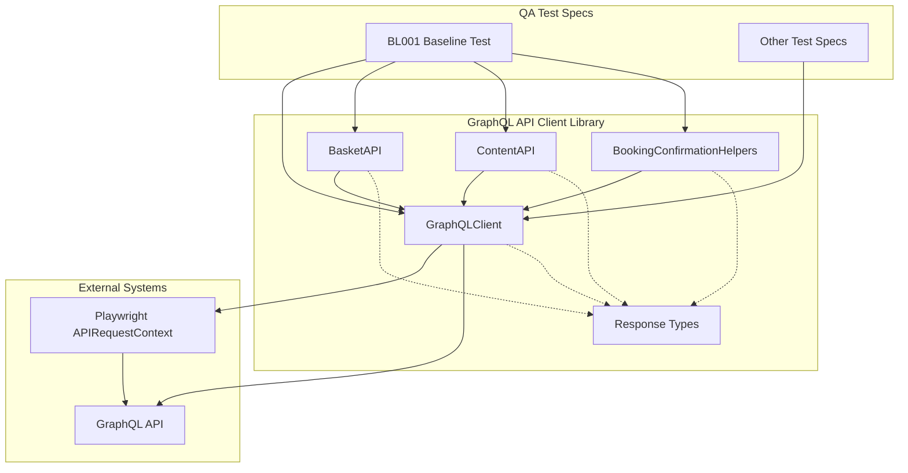
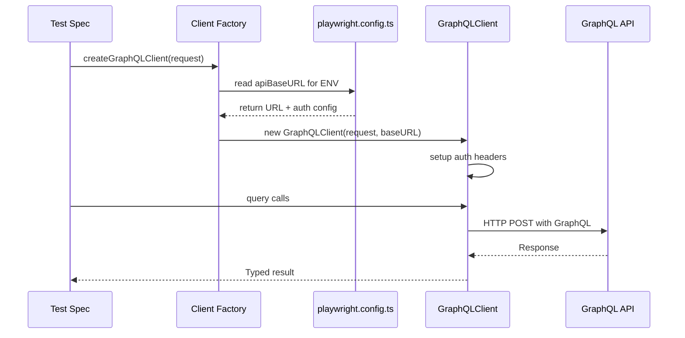
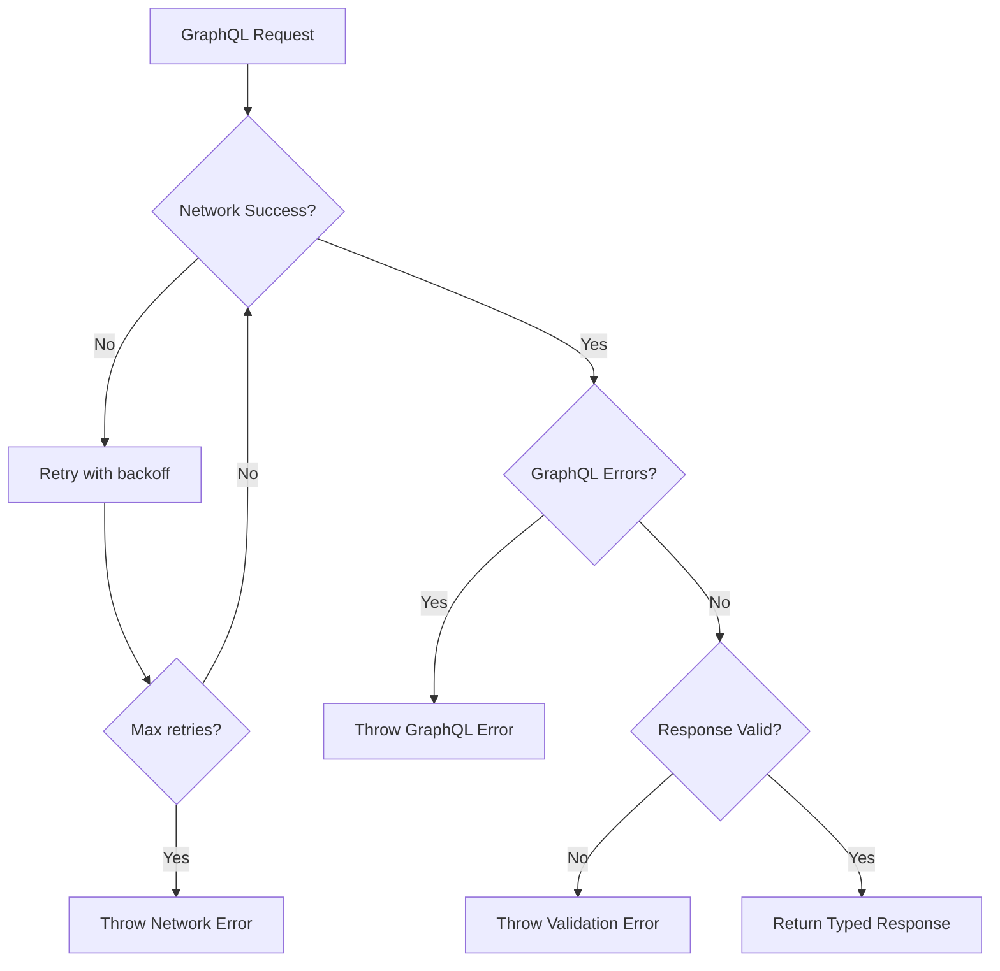

# Design Document

## Overview
The GraphQL API Client library provides a centralized, typed, and tested GraphQL communication layer for the Playwright + TypeScript QA framework. Built on top of Playwright's APIRequestContext, it delivers query wrappers, validation helpers, and response models that eliminate code duplication across test specifications while ensuring consistent error handling and type safety.

The library follows separation-of-concerns principles, keeping API access out of UI page objects and test bodies, and providing a clean abstraction over the underlying GraphQL schema complexity. It enables tests to focus on business logic verification rather than low-level API communication details.

## Architecture

### Library Architecture


### Client Configuration Flow


### Error Handling Flow


## Components and Interfaces

### Core GraphQL Client
**File**: `qa/src/api/graphqlClient.ts`

```typescript
export class GraphQLClient {
  constructor(
    private request: APIRequestContext,
    private baseURL: string,
    private options?: GraphQLClientOptions
  )

  async query<T>(query: string, variables?: Record<string, any>): Promise<T>
  // Queries-only: no mutation() method is exposed (no consumer needs writes; avoids unsafe non-idempotent retries)
  
  private async makeRequest<T>(operation: string, variables?: Record<string, any>): Promise<T>
  private buildHeaders(): Record<string, string>
  private handleErrors(response: any): void
}

interface GraphQLClientOptions {
  timeout?: number;
  retries?: number;
  retryDelay?: number;
  headers?: Record<string, string>;
}
```

### Basket API Module
**File**: `qa/src/api/basketApi.ts`

```typescript
export class BasketAPI {
  constructor(private client: GraphQLClient)

  async getBasketByReference(reference: string): Promise<BasketResponse>
  async validateBasketStatus(expectedStatus: BasketStatus, basketId: string): Promise<void>
  async validateBasketTransition(fromStatus: BasketStatus, toStatus: BasketStatus, basketId: string): Promise<void>
  async waitForBasketStatus(basketId: string, expectedStatus: BasketStatus, timeoutMs: number = 30000): Promise<void>
}

type BasketStatus = 'OPEN' | 'COMPLETED' | 'CANCELLED' | 'PROCESSING' | 'PAY_PENDING';
```

> **Cancellation validation:** The old TC uses `ApiHelpers.validateReservationIsCancelled(hotelId, basketDetails)` which calls the entity API to verify the reservation status. The library provides `BasketAPI.validateBasketStatus('CANCELLED', basketRef)` for the basket-level check. For the full entity-level cancellation validation that the old TC performs, BL001 should either extend the library or call the entity API directly.

### Content API Module
**File**: `qa/src/api/contentApi.ts`

```typescript
export class ContentAPI {
  constructor(private client: GraphQLClient)

  async getDlpContent(dlpPath: string): Promise<DlpContentResponse>
  async getHotelInformation(hotelId: string): Promise<HotelInformationResponse>
  async getHotelTitle(hotelId: string): Promise<string>
  async getHotelTripAdvisorReview(params: TripAdvisorParams): Promise<TripAdvisorResponse>
  async getHotelsInformationForDLPMapView(params: MapViewParams): Promise<HotelMapViewResponse[]>
  async validateDlpContentConsistency(expected: any, apiData: DlpContentResponse): Promise<void>
}
```

### Booking Confirmation Helpers
**File**: `qa/src/api/bookingConfirmationHelpers.ts`

> **Construction pattern:** The new library uses `new BookingConfirmationHelpers(client)` with validators that take `(booking, expected)` — both the booking data and the expected values are explicit arguments. This differs from the old framework's `new BookingConfirmationHelpers(bookingConfirmation)` data-wrapper pattern where validators only took expected values. The new pattern is cleaner for Playwright since the client is needed to fetch the data.

```typescript
export class BookingConfirmationHelpers {
  constructor(private client: GraphQLClient)

  async getBookingConfirmation(basketReference: string): Promise<BookingConfirmationResponse>
  
  // Validation methods
  async validateHotel(booking: BookingConfirmationResponse, expectedHotel: Hotel): Promise<void>
  async validateStayingDates(booking: BookingConfirmationResponse, criteria: DateCriteria): Promise<void>
  async validateRoomsOccupancy(booking: BookingConfirmationResponse, criteria: OccupancyCriteria): Promise<void>
  async validateRoomTypes(booking: BookingConfirmationResponse, selectedRoomName: string, hotelType: string): Promise<void>
  async validateRatePlan(booking: BookingConfirmationResponse, ratePlanCode: string): Promise<void>
  async validateRatesPerNight(booking: BookingConfirmationResponse, expectedPricesPerNight: number[]): Promise<void>
  async validateRoomPrice(booking: BookingConfirmationResponse, roomPricesPerNight: RoomPrice[]): Promise<void>
  async validateCurrency(booking: BookingConfirmationResponse, currencyCode: string): Promise<void>
  async validateBookingFlowId(booking: BookingConfirmationResponse, bookingFlowId: string): Promise<void>
  async validateMealPackagesPerRoom(booking: BookingConfirmationResponse, mealsPackage: MealPackage, criteria: any): Promise<void>
  async validateDepositPoliciesForAllRooms(booking: BookingConfirmationResponse, policyCode: string): Promise<void>
  async validateTotalCostNoDiscountsNoAmendment(booking: BookingConfirmationResponse, totalCost: number, paymentType: string): Promise<void>
  async validatePaymentCard(booking: BookingConfirmationResponse, paymentType: string, cardNumber: string): Promise<void>
  async validateCityTax(booking: BookingConfirmationResponse, hasCityTax: boolean): Promise<void>
  async validateGuestDetailsAgainstBookingConfirmation(booking: BookingConfirmationResponse, guestDetails: GuestDetails, roomDetails: RoomDetails[]): Promise<void>
}
```

### Additional Helpers
**File**: `qa/src/api/availabilityHelpers.ts`

Fail-fast model, mirroring the existing `getHotelAvailability` in the business-booker Playwright framework: the helper advances arrival/departure by a day and retries across a forward date range, retries transient 5xx service errors, returns the availability data when the required room configuration is found, and — if it exhausts retries — logs the hotel inventory and throws a descriptive error. It does NOT return a boolean.

```typescript
export class AvailabilityHelpers {
  constructor(private client: GraphQLClient)

  // Returns availability on success; advances dates + retries (incl. 5xx); logs inventory and throws if unavailable
  async ensureHotelAvailability(hotelId: string, criteria: AvailabilityCriteria): Promise<AvailabilityResponse>
  async getMealsPackages(params: MealPackageParams): Promise<MealPackageResponse>
  async getBookingFlowIdBasedOnHotelAndRate(params: BookingFlowParams): Promise<string>
}
```

### Client Factory
**File**: `qa/src/api/clientFactory.ts`

```typescript
export function createGraphQLClient(request: APIRequestContext): GraphQLClient {
  const config = getPlaywrightConfig();
  const baseURL = getApiBaseURL();
  
  return new GraphQLClient(request, baseURL, {
    timeout: 30000,
    retries: 3,
    retryDelay: 1000,
    headers: buildDefaultHeaders()
  });
}

export function createBasketAPI(client: GraphQLClient): BasketAPI {
  return new BasketAPI(client);
}

export function createContentAPI(client: GraphQLClient): ContentAPI {
  return new ContentAPI(client);
}

export function createBookingConfirmationHelpers(client: GraphQLClient): BookingConfirmationHelpers {
  return new BookingConfirmationHelpers(client);
}
```

## Data Models

### Core Response Types
**File**: `qa/src/api/types/responses.ts`

```typescript
export interface DlpContentResponse {
  hotels: HotelSummary[];
  map: {
    latitude: number;
    longitude: number;
    hideHotelDistance: boolean;
  };
  tripAdvisorDataRequired: boolean;
  title: string;
  description?: string;
  breadcrumbs: Breadcrumb[];
  seo: SeoData;
}

export interface BookingConfirmationResponse {
  bookingReference: string;
  basketReference: string;
  totalCost: number;
  currencyCode: string;
  bookingFlowId: string;
  hotelId: string;
  hotelName: string;
  rooms: BookingRoom[];
  guestDetails: BookingGuestDetails;
  paymentDetails: PaymentDetails;
  stayDetails: StayDetails;
  mealPackages?: MealPackage[];
  cityTax?: CityTaxDetails;
  depositPolicy?: DepositPolicy;
}

export interface BasketResponse {
  status: BasketStatus;
  basketReference: string;
  bookingReference?: string;
  items: BasketItem[];
  paymentStatus?: string;
  totalCost: number;
  currency: string;
}

export interface HotelInformationResponse {
  hotelId: string;
  name: string;
  brand: string;
  address: Address;
  contactDetails: ContactDetails;
  facilities: Facility[];
  description: string;
  images: Image[];
  announcement?: Announcement;
}

export interface AvailabilityResponse {
  hotelId: string;
  available: boolean;
  arrival: string;
  departure: string;
  ratePlanCode: string;
  roomRates: RoomRate[]; // room types, rooms, and prices per rate plan
}
```

### Input Parameter Types
**File**: `qa/src/api/types/inputs.ts`

```typescript
export interface AvailabilityCriteria {
  arrival: string;
  departure: string;
  rooms: RoomCriteria[];
  adults: number;
  children: number;
}

export interface TripAdvisorParams {
  country: string;
  language: string;
  hotelIds: string[];
  longitudeRef: number;
  latitudeRef: number;
}

export interface MapViewParams {
  country: string;
  language: string;
  hotelIds: string[];
  longitudeRef: number;
  latitudeRef: number;
}

export interface DateCriteria {
  arrivalDate: string;
  departureDate: string;
}

export interface OccupancyCriteria {
  rooms: {
    adults: number;
    children: number;
  }[];
}
```

## API Contracts

### GraphQL Query Definitions
The library encapsulates the following core GraphQL operations:

#### Content Operations
- **getDlpContent**: `query getDlpContent($dlpPath: String!, $language: String!, $country: String!)` — response field is `dlpInformation`; coordinates are in `coordinates` (mapped to `map` on the response type); images use the `picture` field (not `image`)
- **getHotelInformation**: `query getHotelInformation($hotelId: String!, $language: String!, $country: String!)`
- **getHotelTitle**: `query getHotelInformation($hotelId: String!, $language: String!, $country: String!)` — returns the `name` field from `hotelInformation`
- **getHotelTripAdvisorReview**: `query getHotelTripAdvisorReview($params: HotelReviewParams!)`
- **getHotelsInformationForDLPMapView**: `query getHotelsInformationForDLPMapView($params: MapViewParams!)`

#### Basket Operations  
- **getBasketByReference**: `query getBasketByReference($basketReference: String!)`

#### Booking Operations
- **getBookingConfirmation**: `query getBookingConfirmation($basketReference: String!, $language: String!, $country: String!, $bookingChannel: String!)`
- **getMealsPackages**: Uses the `packages(packagesCriteria: {...})` query (operation name `GetAncillariesPackages`); takes `hotelId`, `startDate`, `endDate`, `adultsNumber`, `childrenNumber`, `nightsNumber`, `language`, `country`, `bookingFlowId`

#### Availability & Booking-Flow Operations
- **getSingleHotelAvailability**: `query getHotelAvailability($input: HotelAvailabilityInput!)` — uses `availabilitySearchCriteria` with `arrival`/`departure` fields (not `startDate`/`endDate`) and `BookingChannelCriteria`
- **getBookingFlowIdBasedOnHotelAndRate**: NOT a dedicated GraphQL query — calls `getHotelInformation`, reads `bookingFlow.bookingFlowItems`, and filters by `rateCode` to return the matching `bookingId`

### Environment Configuration
The GraphQL client reads configuration from the existing playwright.config.ts structure:

```typescript
// playwright.config.ts structure the client depends on
const envConfig = {
  uat: {
    apiBaseURL: 'https://api.uat.premierinn.digital/graphql',
  },
  dit: {
    apiBaseURL: 'https://api.dit.premierinn.digital/graphql',
  },
};
```

### Request Headers
The UAT GraphQL endpoint does not require API key authentication. All requests include:
- `Accept`: `*/*`
- `Content-Type`: `application/json`

For future logged-in flows (not needed by the current guest consumer, BL001), an optional `Authorization: Bearer <Auth0 token>` header can be added. The client design accommodates this via the `headers` option.

## Error Handling

### Error Categories and Responses

#### Network Errors
- **Idempotency**: only queries are retried — the client exposes no mutations, so retries are always safe
- **Connection failures**: Retry up to 3 times with exponential backoff
- **Timeouts**: Default 30s timeout, configurable per client
- **HTTP 5xx**: Retryable, includes server error details
- **HTTP 4xx**: Non-retryable, includes client error details

#### GraphQL Errors
- **Schema validation errors**: Non-retryable, indicates query/variable issues
- **Business logic errors**: Non-retryable, indicates API-level business rule violations
- **Data not found errors**: Non-retryable, returned as null with descriptive message

#### Validation Errors
- **Type validation**: Response data doesn't match expected TypeScript interface
- **Business validation**: Data validation in helper methods (e.g., validateBasketStatus)
- **Parameter validation**: Required parameters missing or invalid format

### Error Response Format
```typescript
export class GraphQLError extends Error {
  constructor(
    message: string,
    public readonly operation: string,
    public readonly variables: any,
    public readonly errors?: any[],
    public readonly response?: any
  ) {
    super(message);
    this.name = 'GraphQLError';
  }
}

export class ValidationError extends Error {
  constructor(
    message: string,
    public readonly expected: any,
    public readonly actual: any,
    public readonly field?: string
  ) {
    super(message);
    this.name = 'ValidationError';
  }
}
```

## Testing Strategy

The library is verified with the framework's own runner — **Playwright Test (`@playwright/test`)**. No Jest or other runner is introduced.

### Approach: integration-first
Because the library is a thin wrapper over a live GraphQL API, the highest-value verification is exercising the real read-only queries against UAT; mock-heavy unit tests of the wrappers would mostly test the mock.

- **Read-only query integration tests (UAT):** verify each read query wrapper returns well-formed, typed data using deterministic inputs (known hotel IDs such as `GATGAT`/`LONEUS`, fixed future dates): `getDlpContent`, `getHotelInformation`, `getHotelTitle`, `getHotelTripAdvisorReview`, `getHotelsInformationForDLPMapView`, the availability helper, `getMealsPackages`, `getBookingFlowIdBasedOnHotelAndRate`. These are safe to run repeatedly because they do not change state.
- **Booking-confirmation / basket / meals-per-booking helpers — fixture-based logic tests:** these need a real basket/booking reference, which does not exist in isolation (the booking is created by BL001's UI journey). Their comparison logic is verified against captured representative JSON fixtures. Their true end-to-end correctness is exercised when BL001 runs the full journey and calls them with a live booking reference. This is the agreed approach — the library does not create bookings itself.
- **Client behaviour tests:** verify custom headers (Accept, optional Bearer token) are passed through to requests, 5xx responses are retried, 4xx and GraphQL schema errors are not retried, timeouts are honoured, and required-parameter validation throws clear errors. These can use a stub `APIRequestContext` or a local mock server.

### Test data & isolation
- Deterministic UAT hotel IDs and fixed future dates.
- All library tests are read-only — none mutate UAT state, so runs never interfere with each other or with BL001.
- Booking-confirmation fixtures are captured JSON committed alongside the tests.

### Execution
Add a dedicated script / Playwright project so the library can be verified independently of the E2E specs:
```bash
npm run test:api        # runs the GraphQL API Client library tests only
```
The suite should be fast and independently runnable; it is the prerequisite gate before BL001 (or any other consumer) builds on the library.