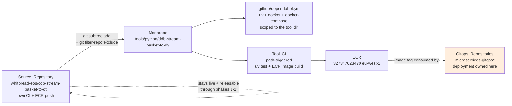
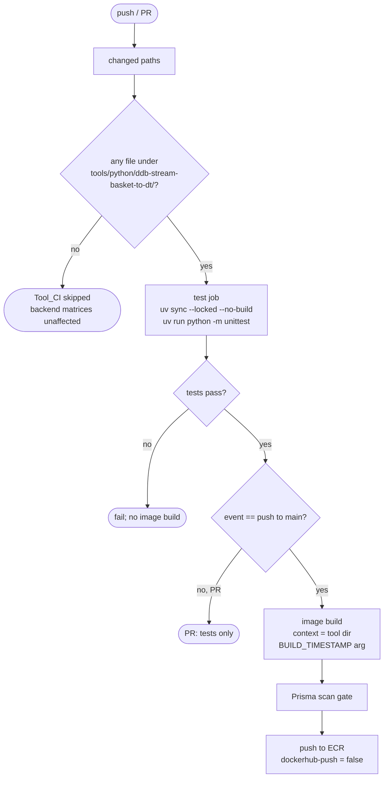

# Design Document

## Overview

This design moves the `ddb-stream-basket-to-dt` operational tool from its standalone repository into `digital-monorepo` under `tools/python/ddb-stream-basket-to-dt/`, and builds the monorepo-side CI it needs, so that the monorepo owns the tool's code and image build while the gitops repositories keep owning deployment.

The work is an **infrastructure and packaging change**, not an application-code change. The only edit to `basket_stream_to_dynatrace.py` is a single security fix folded in during review: the `else` branch of the summarise loop previously logged the entire raw DynamoDB record at WARNING when nothing matched the allow-list, bypassing the anonymisation the tool is built to guarantee (basket records carry guest data). It now logs only non-sensitive stream metadata (`eventID`, `eventName`, `SequenceNumber`). No other application logic changes. It coordinates three streams:

1. **History-preserving Git import** of the tool under `tools/python/ddb-stream-basket-to-dt/` using `git subtree` (with `git filter-repo` path exclusion for the standalone repo's local cruft).
2. **Repository hygiene and Dependabot**: drop the standalone `.github/` (CI, dependabot, copilot-instructions) on import, then add a monorepo-root `.github/dependabot.yml` scoped to the tool.
3. **Python CI in the monorepo**: a path-triggered test-and-image-build pipeline that mirrors what the standalone repo does today — `uv` test on PRs, ECR image build on merge — without touching the Java build.

The design is consumer-driven by `.kiro/specs/SRE-338-ddb-stream-basket-to-dt-monorepo-migration/requirements.md` and addresses Requirements 1–9. Phase 3 (prod automation) and the SRE-319 ECR prerequisite are covered only as sequenced follow-on in [Decisions and Open Questions](#decisions-and-open-questions).

The phase-4 steering already merged to `main` — `.kiro/steering/stacks/tools.md` and `.kiro/steering/tools/python/ddb-stream-basket-to-dt/{product,structure,tech}.md` — is the authoritative description of the Tool's behaviour, container, and deployment. This design cites those files rather than re-deriving the tool's semantics, and defers to them wherever they overlap.

This is the pilot for `tools/` CI: no Python toolchain exists anywhere in the monorepo today, and `tools/` (currently `opera-ohip-app` only) is built by nothing. The mechanisms chosen here are intended to be reusable by later tools.

## Architecture

### High-Level Workstreams



The Source_Repository keeps building and releasing until the monorepo pipeline has produced an image that has run in prod (a phase-3 event). Nothing here archives it.

### Tool CI Trigger and Flow



This mirrors the Source_Repository's `ci.yaml`: PRs run tests only; the image build is gated on `needs: test` and `if: github.event_name == 'push'`. Note the gate is `== 'push'`, **not** `!= 'pull_request'` — the negative form would also fire on `workflow_dispatch` and push an image from a manual run (Requirement 6.7: build only on push/merge to main). Keeping it to push events leaves `workflow_dispatch` as a test-only dry run, the same reasoning `build-service.yaml`'s docker-build gate uses.

### Why this tool, why now

`ddb-stream-basket-to-dt` has no Maven coupling, one module, a stdlib test suite, and an existing self-contained Dockerfile. It is the smallest possible pilot for `tools/` CI. The alternative — a code-only copy that leaves the standalone repo releasing — was rejected in the ticket because it produces two sources of truth. This design therefore treats the monorepo as the single source of truth for code and image build from the moment phase 2 lands, which is why phases 1 and 2 must ship together (Requirement 9.3).

## Components and Interfaces

### 1. Tool Import (Requirements 1, 2)

**Approach**: `git subtree add` without `--squash`, from a dedicated remote, using `git filter-repo` to drop the standalone repo's local cruft before import. This matches the Monorepo's existing service/library import convention (a 2-parent merge commit carrying `git-subtree-*` trailers).

**Sequence (executed once, by a maintainer)**:

1. **Pre-flight** (Requirement 1.7): verify `tools/python/ddb-stream-basket-to-dt/` does not already exist with tracked content; abort if it does.
2. **Fetch and capture the Upstream_SHA**: clone/fetch the target branch of `https://github.com/whitbread-eos/ddb-stream-basket-to-dt.git` (confirm reachability with `git ls-remote` first) and record its tip as the **Upstream_SHA**. This SHA is for traceability only — it will not exist in the filtered history (step 3 rewrites SHAs), so it is not the SHA passed to `git subtree add`.
3. **Path exclusion** (Requirement 1.5): run, against the scratch clone,
   ```
   git filter-repo --invert-paths \
     --path .github --path .vscode --path .venv \
     --path-glob '**/__pycache__/**' --path-glob '**/*.pyc' \
     --path-glob 'build*.log'
   ```
   producing a rewritten source whose new tip is the **Imported_SHA**. `.github/` is the standalone repo's CI/Dependabot/copilot config and must not be imported (Requirement 2.1, 2.2); `.vscode/` is editor-local; `.venv/`, `__pycache__/`, and `build*.log` are development artifacts (typically gitignored, excluded here only if tracked). Note `__pycache__` uses a `--path-glob` (not `--path`) because `--path` only matches a top-level entry, whereas `__pycache__` directories are nested throughout; `--path .venv` is fine as a plain prefix since `.venv/` is top-level. Everything else — `Dockerfile`, `compose.yaml`, `test-data/`, `.pylintrc`, `pyproject.toml`, `uv.lock`, `.python-version`, `README.md`, both `.py` files, and the tool's `.gitignore` — is kept (Requirement 1.6, 2.4). `git filter-repo` rewrites commit SHAs and drops commits that touched only the excluded paths; author/committer identity, message text, and timestamps are preserved (Requirement 1.3).
4. **Subtree import**:
   ```
   git subtree add --prefix=tools/python/ddb-stream-basket-to-dt <rewritten-source> <Imported_SHA>
   ```
   No `--squash` (Requirement 1.2). `git subtree` records the **Imported_SHA** in the merge commit's `git-subtree-split` trailer automatically (Requirement 1.4). Amend the merge commit body to also record the upstream provenance — the `https://github.com/whitbread-eos/ddb-stream-basket-to-dt` URL and the **Upstream_SHA** — since neither is reachable from the imported history after filtering.

**Standalone `.github/` is not imported** (Requirement 2.1, 2.2). The standalone `.github/workflows/ci.yaml`, `.github/dependabot.yml`, and `.github/copilot-instructions.md` are repository-level config for the *standalone* repo. `.github/` is always tracked upstream, so it is excluded unconditionally by the `--path .github` exclusion in step 3 above, because:

- The monorepo has its own CI (built in this spec) — importing the standalone `ci.yaml` into a tool subdirectory would do nothing useful and would confuse readers.
- Dependabot is configured monorepo-root, not per-tool-dir (see §2).
- `copilot-instructions.md` is already folded into `.kiro/steering/tools/python/ddb-stream-basket-to-dt/` on `main`.

**Build config is untouched** (Requirement 2.3): the Dockerfile, `compose.yaml`, `pyproject.toml`, `uv.lock`, `.python-version`, and `.pylintrc` land byte-for-byte from the imported SHA and this migration adds no edits to them; the SRE-336 Dockerfile ECR-base-image work is a separate ticket and, if it lands after this import, targets `tools/python/ddb-stream-basket-to-dt/Dockerfile`. The only application-code change is the single security fix noted above (the raw-record WARNING log); no other line of `basket_stream_to_dynatrace.py` is edited, and no other imported file changes.

**Verifying history**: `git log <imported-SHA>` walks the upstream graph with original authors/messages/timestamps; `git log -- tools/python/ddb-stream-basket-to-dt/` may show only the merge commit due to path simplification — expected, and identical to existing imports.

### 2. Dependabot (Requirement 3)

The Monorepo has **no `.github/dependabot.yml` today**. This is a new file, deliberately scoped to the tool directory so it does not silently enable Dependabot across the Java estate (Requirement 3.2).

`.github/dependabot.yml`:

```yaml
version: 2
updates:
  - package-ecosystem: "uv"
    directory: "/tools/python/ddb-stream-basket-to-dt"
    schedule:
      interval: "weekly"
  - package-ecosystem: "docker"
    directory: "/tools/python/ddb-stream-basket-to-dt"
    schedule:
      interval: "weekly"
  # Conditional (Requirement 3.5): include only where the target GitHub
  # instance's Dependabot supports the docker-compose ecosystem; omit
  # otherwise so the file stays schema-valid (Requirement 3.7).
  - package-ecosystem: "docker-compose"
    directory: "/tools/python/ddb-stream-basket-to-dt"
    schedule:
      interval: "weekly"
```

This is the Source_Repository's `dependabot.yml` with `directory` re-pointed from `/` to `/tools/python/ddb-stream-basket-to-dt` (Requirements 3.3–3.6). The `uv` and `docker` entries (mapping to `pyproject.toml`/`uv.lock` and `Dockerfile`) are always present; the `docker-compose` entry (for `compose.yaml`) is **conditional** — included only where the target GitHub instance's Dependabot supports that ecosystem, and omitted otherwise so the config stays valid (Requirements 3.5, 3.7). The Source_Repository ships all three today, so on GitHub.com they all apply. If a future tool wants Dependabot, it appends its entries here rather than creating a second file.

### 3. Tool CI (Requirements 4, 5, 6)

The current monorepo CI reality, confirmed on `main`:

- The backend orchestrator is **`ci-be.yaml`** (not `ci.yaml`). It dispatches via `detect-changed-eph.sh` (PR path) and `detect-all.sh` (main-line). `detect-changed-modules.sh` still exists but is only sourced by the eph detector.
- The backend layout is **squad-based**: `backend/<squad>/services/<svc>`, `backend/<squad>/libs/<lib>` — independently corroborated by `.kiro/steering/tools/python/ddb-stream-basket-to-dt/product.md`, which places the upstream `basket-service` at `backend/book-pay/services/basket-service`.
- `detect-all.sh` currently emits `all_services=[]` on main-line ("Currently Building 0 Services in Main"); the `build-libraries` job in `ci-be.yaml` is commented out.
- **No Python toolchain exists** anywhere; `tools/` is built by nothing.

Given that, the two candidate trigger mechanisms (Requirement 4.4):

| Option | Mechanism | Pros | Cons |
|---|---|---|---|
| **(a) Extend Change_Detection** | Add a `tools=<json array>` output from `^tools/[^/]+/` and a matrix job in `ci-be.yaml` | Consistent with the documented model; reusable by `opera-ohip-app` later; one orchestrator | Touches the Java estate's live orchestrator; `ci-be.yaml` is backend-shaped (Maven cache seeding, squad paths) and mixing a Python matrix in adds conditional weight; higher blast radius on a busy workflow |
| **(b) Standalone workflow** | New `.github/workflows/ci-tools-ddb-stream-basket-to-dt.yaml` with `on.<event>.paths: tools/python/ddb-stream-basket-to-dt/**` | Zero risk to the Java orchestrator; self-contained; mirrors how the FE pipeline path-triggers; trivial to read and revert | One workflow per tool until generalised; not yet the shared `tools/` matrix the steering envisions |

**Chosen: a generic `tools/python/**` matrix workflow** (a refinement of option (b) toward the shared-matrix idea in option (a)). Rather than one workflow per tool, a single `ci-python-tools.yaml` serves every Python tool under `tools/python/<name>/`: a detect step (`detect-changed-python-tools.sh`) emits a matrix of changed tools, and a matrix job derives each tool's details from its own files (Python version from `.python-version`, image name `whitbreaddigital/<pyproject name>`, tests via `uv run python -m unittest`). This still keeps all risk off `ci-be.yaml` (nothing about backend detection changes, so Requirements 4.2/4.3/4.5 hold trivially — satisfying Requirement 4.4), while meaning a *second* Python tool needs no workflow edit at all — just drop it under `tools/python/<name>/`. The tool was moved from `tools/ddb-stream-basket-to-dt/` to `tools/python/ddb-stream-basket-to-dt/` to namespace Python tools under this generic trigger.

> Note: an earlier revision of this design chose a per-tool standalone workflow (`ci-tools-ddb-stream-basket-to-dt.yaml`) as the pilot, deferring the shared matrix to "when a second tool needs CI". That was superseded during implementation by the generic workflow above, which is strictly more reusable and carries the same low blast radius.

**Implemented workflow:** `.github/workflows/ci-python-tools.yaml` (generic, serving all `tools/python/<name>/` tools) plus `.github/workflows/scripts/detect-changed-python-tools.sh`. See those files for the authoritative structure rather than a copy here; the shape is: a `detect` job that emits a matrix of changed tools, then a per-tool `ci` matrix job that installs uv, runs `uv run --locked --no-build python -m unittest`, and — on push to main, if the tool ships a `Dockerfile` — configures AWS/ECR, resolves the tag via `resolve-image-tag.sh`, builds with `BUILD_TIMESTAMP`, pushes to ECR, and runs the `prisma-image-scan` composite. All actions are pinned to commit SHAs.
The `test` job pins the working directory to the tool dir (Requirements 5.1, 5.2), installs Python 3.14 via `uv` (Requirement 5.3), and runs only tests on PRs (Requirement 5.5). The `build` job is gated on `needs: test` and non-PR events (Requirements 5.4, 6.7).

**The image-build context problem (Requirement 6.6), and why the build is inline.** The shared Image_Build_Template hard-codes its build context:

```yaml
docker build -t "whitbreaddigital/${{ inputs.app-name }}:${IMAGE_TAG}" --rm=true ./
```

and checks out at repo root. From the standalone repo, `./` is the tool. From the monorepo, `./` is the monorepo root and the Dockerfile lives at `tools/python/ddb-stream-basket-to-dt/`, so calling the template as-is would build the wrong context. The template offers no input to change it.

**Chosen: build inline in the monorepo** (the `build` job above), not via the shared template. Two reasons:

- **It matches the monorepo's own convention.** `build-service.yaml` — the backend service pipeline, the busiest build path in the repo — already builds and pushes images inline with exactly this shape: `actions/checkout@v7` → `aws-actions/configure-aws-credentials@v6` (role `arn:aws:iam::327347623470:role/GitHubActionsECRPushRole`, `eu-west-1`) → `aws-actions/amazon-ecr-login@v2` → `docker build` → tag → push. The tool CI reuses that pattern rather than being the odd one out that reaches into `wbd-workflows-templates`.
- **It keeps PR 2 self-contained.** The alternative — adding a `build-context` input to the template — is a change in a *second* repo (`wbd-workflows-templates`) that PR 2 would depend on, coupling two PRs across two repos. Building inline removes that dependency entirely.

The job reuses existing repo building blocks rather than reinventing them: tagging goes through `.github/workflows/scripts/resolve-image-tag.sh` (the same script `build-service.yaml` uses, giving `pr-<n>-<sha>` on PRs and `<version>-<ref>-<sha>-<ts>` on main-line), and the Prisma gate runs via the repo's SHA-pinned `./.github/actions/prisma-image-scan` composite action. Note the composite action does **not** set `ACTIONS_ALLOW_USE_UNSECURE_NODE_VERSION`; that env var appeared only in the Python template and no other Prisma usage in the repo carries it, so it is dropped. The one tool-specific carry-over is the `BUILD_TIMESTAMP` build arg (Requirement 6.4 — it surfaces on every Dynatrace event as `build.timestamp`). The image name stays `whitbreaddigital/ddb-stream-basket-to-dt`, the push is ECR-only (Requirements 6.2, 6.3), the Prisma gate is preserved (Requirement 6.5), and nothing writes to the gitops repos (Requirement 6.8).

Only the AWS-creds / ECR-login / `docker build` / push steps remain in common with `build-service.yaml` (they are cheap and self-explanatory). When a second `tools/` image appears, those can be lifted into a shared composite action too — a follow-up, not a prerequisite here.

### 4. What this design explicitly does NOT do

- It does not touch `ci-be.yaml`, `detect-all.sh`, `detect-changed-eph.sh`, or `detect-changed-modules.sh`. The tool trigger is a separate workflow (§3).
- It does not add any `pom.xml`, `<module>`, or Maven wiring (Requirement 8.2).
- It does not edit the tool's application code, Dockerfile, or dependency manifests (Requirement 2.3).
- It does not modify any gitops repo, does not switch the prod image ref, and does not archive the standalone repo (Requirement 9.4).

## Verification Approach

Property-based testing is not applicable to a packaging/CI migration. Verification is by explicit build/test assertions and CI observation.

| Validation | Command / observation | Expectation | Requirement |
|---|---|---|---|
| Dependencies resolve from lock | `uv sync --locked --no-build` in tool dir | exit 0; `uv.lock` unchanged | 7.1 |
| Unit tests pass in new location | `uv run --locked --no-build python -m unittest` (auto-discovery) | exit 0; 0 failures/errors | 7.2 |
| Image builds from tool context | `docker build tools/python/ddb-stream-basket-to-dt` (from repo root; or `docker build .` from within the tool dir) | exit 0; runs as uid/gid 9001 (per `tech.md`/`structure.md`) | 7.3 |
| Lint clean | `uv run --with pylint pylint --rcfile=.pylintrc --fail-on=E,F --fail-under=0 basket_stream_to_dynatrace.py` | no fatal/error from the move | 7.4 |
| Java build untouched | Inspect backend detection outputs on a tool-only diff | `services=[]`, `libraries=[]` | 4.3, 7.5 |
| Dependabot config valid | GitHub "Dependabot" tab / schema check | no config error; three ecosystems on the tool dir | 3.7 |
| History preserved | `git log <imported-SHA>` | upstream commits with original metadata | 1.3, 1.4 |
| Trigger isolation | PR touching only backend | Tool_CI does not run | 4.2 |

The `docker compose up --build` integration harness (DynamoDB Local) is available from the imported `compose.yaml` for manual end-to-end verification but is not wired into CI by this spec — the standalone repo did not run it in CI either. (Compose v2 syntax `docker compose`, matching `.kiro/steering/tools/python/ddb-stream-basket-to-dt/tech.md`, not the legacy `docker-compose`.)

## Decisions and Open Questions

1. **Spec location.** This spec lives under `.kiro/specs/`, matching the closest precedent in this repo (`commons-cdh-lib-monorepo-migration`, itself a monorepo-migration spec). The root `CLAUDE.md` that mandated OpenSpec is **not present on `main`** — the commit that added it (`d737b80657e`) was dropped when the phase-4 branch was rebased before merge. Steering is unambiguously `.kiro/steering`; specs follow the `.kiro/specs` precedent here.

2. **Trigger mechanism.** A generic `ci-python-tools.yaml` triggered on `tools/python/**`, discovering changed tools via `detect-changed-python-tools.sh` — not an extension of `ci-be.yaml`. Zero blast radius on the Java orchestrator, and a new Python tool needs no workflow edit. (Superseded the earlier per-tool-workflow plan; see §3.)

3. **Image build: inline, not via the shared template.** The `build` job builds and pushes inline, matching `build-service.yaml`'s container build/push steps — the language-agnostic AWS/ECR/docker mechanics, not its Maven build (this tool has no Java) — which is the dominant convention in this repo, rather than calling `wbd-workflows-templates/ci-image-build-python.yaml` — whose hard-coded `./` build context can't reach a subdirectory and which would couple PR 2 to a second-repo change. `BUILD_TIMESTAMP` and the Prisma scan gate are carried over from the tool's prior template-based build. Trade-off: ~40 lines of AWS/ECR/build/scan logic are duplicated with `build-service.yaml`; extract into a shared composite action when a second `tools/` image appears.

4. **Steering wording (Requirement 8.4).** `.kiro/steering/stacks/tools.md` (merged in phase 4) names `detect-changed-modules.sh` as the change-detection classifier and says tools are built by nothing. Both statements are substantively correct: tools are indeed built by nothing today, and `detect-changed-modules.sh` remains part of the detection chain — `ci-be.yaml` calls `detect-changed-eph.sh`, which in turn sources `detect-changed-modules.sh`. The only imprecision is that `ci-be.yaml` does not invoke `detect-changed-modules.sh` *directly* (its direct entry points are `detect-all.sh` and `detect-changed-eph.sh`), so a reader could infer a more direct wiring than exists. This is a wording nuance, not a stale reference; a light clarification to the steering could note the sourcing relationship, but doing so is **out of scope** for this spec's implementation.

5. **Phase 3 / SRE-319 (out of scope).** Prod still points at `whitbreaddigital/ddb-stream-basket-to-dt` on Docker Hub (`microservices-gitops-prod/ms-deployment/ddb-stream-basket-to-dt/deployment.yaml`). The Docker Hub → ECR switch (SRE-319) is the hard prerequisite for any automated prod bump. Phase 3 options (CI raises a prod PR / Flux ImageUpdateAutomation in prod / `workflow_dispatch` promote) are recorded in the ticket and are not designed here. The steering makes the shape of the answer clear even though the design is deferred: `.kiro/steering/tools/python/ddb-stream-basket-to-dt/product.md` documents that on restart existing shards resume at `LATEST`, so a deploy drops the records written during the gap — which is why that file states automated prod rollouts "want a gate rather than a fully automatic image bump". Phase 3 should therefore favour the gated CI-raises-a-PR option over hands-off Flux ImageUpdateAutomation in prod.

6. **Archive timing (out of scope).** The standalone repo is archived (not deleted) only after a monorepo-built image has run in prod. Sweep docs/dashboards/runbooks for links before archiving. Not part of this spec's implementation (Requirement 9.2, 9.4).

7. **`uv` base-image stage (SRE-336).** The Dockerfile's `ghcr.io/astral-sh/uv` stage has no ECR-public equivalent and is an open question in SRE-336. This spec imports the Dockerfile unchanged and does not resolve that; whichever ticket lands first owns the edit.
