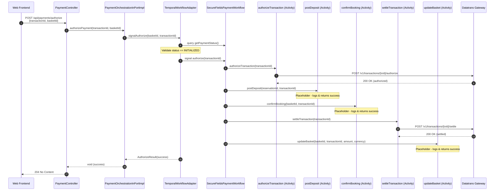
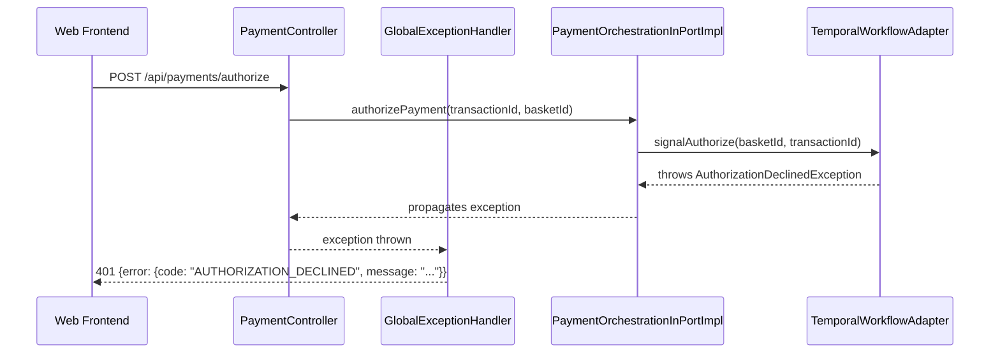

# Design Document: Authorize Payment API

## Overview

This design implements the `POST /api/payments/authorize` endpoint for the web Secure Fields flow. The endpoint is called by the Premier Inn web frontend after the user completes card entry and 3-D Secure authentication. It signals the existing Temporal workflow to execute a sequential activity chain: authorize → postDeposit → confirmBooking → settle → updateBasket.

The implementation follows the existing hexagonal architecture pattern established by the Secure Fields init and Mobile SDK init flows, extending the existing `SecureFieldsPaymentWorkflow` with an authorize signal, adding new activities to `PaymentActivities`, and introducing new domain exceptions for authorize-specific error codes.

### Design Decisions

| Decision | Rationale |
|----------|-----------|
| Extend existing `SecureFieldsPaymentWorkflow` with an `authorize` signal | Maintains the signal-with-start pattern; the workflow is already open per basket, so signaling authorize avoids starting a new workflow |
| Track `PaymentStatus` as workflow state, exposed via `@QueryMethod` | Enables the controller to validate workflow state before signaling and allows the `PaymentOrchestrationInPortImpl` to detect already-authorized transactions |
| Sequential Temporal activities for the orchestration chain | Each step depends on the previous step's success; Temporal provides retry, timeout, and failure handling automatically |
| New domain exceptions for authorize-specific errors | `AuthorizationDeclinedException`, `TransactionNotFoundException`, `TransactionAlreadyAuthorizedException`, `ThreeDsAuthenticationFailedException` — mapped in `GlobalExceptionHandler` to the required HTTP status codes |
| `DatatransOutPort.settleTransaction(transactionId)` as a new method | Settlement is a distinct Datatrans API call (`POST /v1/transactions/{transactionId}/settle`) requiring its own out-port method |
| Placeholder activities log at INFO and return success | OPERA, basket confirmation, and basket update are out-of-scope for real integration; placeholders enable end-to-end flow testing |
| Controller returns `204 No Content` on success | No response body is needed; the frontend knows the payment succeeded by the status code |

---

## Architecture



### Error Flow



---

## Components and Interfaces

### 1. Controller Layer Changes

**`PaymentController`** — Replace the 501 stub with a real implementation:

```java
@PostMapping(value = "/authorize",
    consumes = MediaType.APPLICATION_JSON_VALUE)
@Operation(summary = "Authorize payment")
@ApiResponse(responseCode = "204", description = "Payment authorized")
public ResponseEntity<Void> authorizePayment(
    @Valid @RequestBody AuthorizePaymentRequest request) {
  paymentOrchestrationInPort.authorizePayment(
      request.transactionId(), request.basketId());
  return ResponseEntity.noContent().build();
}
```

The return type changes from `ResponseEntity<ErrorResponse>` to `ResponseEntity<Void>`. Errors propagate as exceptions caught by `GlobalExceptionHandler`.

### 2. Domain Logic Layer

**`PaymentOrchestrationInPortImpl.authorizePayment()`** — Replaces the `UnsupportedOperationException`:

```java
@Override
public void authorizePayment(String transactionId, String basketId) {
  log.info("authorizePayment called for transactionId={}, basketId={}",
      transactionId, basketId);
  AuthorizeResult result = paymentWorkflowPort.signalAuthorize(basketId, transactionId);
  if (!result.success()) {
    throw mapAuthorizeErrorToException(result.errorCode(), result.errorMessage());
  }
}
```

The `mapAuthorizeErrorToException` method maps workflow error codes to domain exceptions:
- `AUTHORIZATION_DECLINED` → `AuthorizationDeclinedException`
- `TRANSACTION_NOT_FOUND` → `TransactionNotFoundException`
- `TRANSACTION_ALREADY_AUTHORIZED` → `TransactionAlreadyAuthorizedException`
- `3DS_AUTHENTICATION_FAILED` → `ThreeDsAuthenticationFailedException`
- `GATEWAY_ERROR` → `DatatransGatewayException`

### 3. PaymentWorkflowPort Extension

**New method on `PaymentWorkflowPort`:**

```java
/**
 * Signal the existing workflow to authorize the given transaction.
 *
 * @param basketId      the basket identifier (workflow ID prefix)
 * @param transactionId the Datatrans transaction identifier
 * @return the authorize result
 */
AuthorizeResult signalAuthorize(String basketId, String transactionId);
```

### 4. TemporalWorkflowAdapter Extension

**`TemporalWorkflowAdapter.signalAuthorize()`:**

1. Derive workflow ID: `"payment-" + basketId`
2. Create an untyped workflow stub for the existing workflow
3. Query `getPaymentStatus()` to validate the workflow exists and is in `INITIALIZED` state
4. If no workflow found → return `AuthorizeResult` with `TRANSACTION_NOT_FOUND`
5. If status is `AUTHORIZED` or `SETTLED` → return with `TRANSACTION_ALREADY_AUTHORIZED`
6. If status is `FAILED` → return with `TRANSACTION_NOT_FOUND`
7. Signal `authorize(transactionId)` on the workflow
8. Poll `getAuthorizeResult()` query until non-null (same polling pattern as init)
9. Return the `AuthorizeResult`

### 5. SecureFieldsPaymentWorkflow Interface Extension

```java
@SignalMethod
void authorize(String transactionId);

@QueryMethod
PaymentStatus getPaymentStatus();

@QueryMethod
AuthorizeResult getAuthorizeResult();
```

### 6. SecureFieldsPaymentWorkflowImpl Extension

New workflow state:
```java
private PaymentStatus paymentStatus = PaymentStatus.INITIALIZED;
private AuthorizeResult authorizeResult;
```

The `authorize` signal handler:
```java
@Override
public void authorize(String transactionId) {
  try {
    // Step 1: Authorize with Datatrans
    activities.authorizeTransaction(transactionId);
    paymentStatus = PaymentStatus.AUTHORIZED;

    // Step 2: Post deposit to OPERA (placeholder)
    activities.postDeposit(/* reservationId from workflow state */, transactionId);

    // Step 3: Confirm booking (placeholder)
    activities.confirmBooking(basketId, transactionId);

    // Step 4: Settle with Datatrans
    activities.settleTransaction(transactionId);
    paymentStatus = PaymentStatus.SETTLED;

    // Step 5: Update basket (placeholder)
    activities.updateBasket(basketId, transactionId, amount, currency);

    authorizeResult = new AuthorizeResult(true, null, null);
  } catch (Exception e) {
    paymentStatus = PaymentStatus.FAILED;
    authorizeResult = new AuthorizeResult(false, mapErrorCode(e), e.getMessage());
  }
}
```

### 7. PaymentActivities Interface Extension

New activity methods:

```java
@ActivityMethod
void confirmBooking(String basketId, String transactionId);

@ActivityMethod
void settleTransaction(String transactionId);

@ActivityMethod
void updateBasket(String basketId, String transactionId, long amount, String currency);
```

### 8. PaymentActivitiesImpl Extension

| Activity | Implementation |
|----------|----------------|
| `authorizeTransaction` | Real — calls `DatatransOutPort.authorizeTransaction()` (already exists, needs real implementation) |
| `postDeposit` | Placeholder — logs at INFO, returns success. Includes TODO comment. |
| `confirmBooking` | Placeholder — logs at INFO, returns success. Includes TODO comment. |
| `settleTransaction` | Real — calls `DatatransOutPort.settleTransaction()` (new method) |
| `updateBasket` | Placeholder — logs at INFO, returns success. Includes TODO comment. |

### 9. DatatransOutPort Extension

```java
/**
 * Settle a previously authorized transaction (deferred settlement).
 *
 * @param transactionId the Datatrans transaction identifier
 * @throws DatatransGatewayException if Datatrans returns a non-2xx response
 * @throws ServiceUnavailableException if Datatrans is unreachable
 */
void settleTransaction(String transactionId);
```

### 10. DatatransRestAdapter Extension

**`authorizeTransaction` — real implementation:**
```java
@Override
public void authorizeTransaction(String transactionId) {
  datatransWebClient.post()
      .uri("/v1/transactions/{transactionId}/authorize", transactionId)
      .headers(h -> h.setBasicAuth(properties.getMerchantId(), properties.getMerchantPassword()))
      .retrieve()
      .onStatus(status -> status.value() == 401 || status.value() == 403,
          response -> Mono.error(new AuthorizationDeclinedException("Card issuer declined")))
      .onStatus(status -> status.value() == 404,
          response -> Mono.error(new TransactionNotFoundException("Transaction not found or expired")))
      .onStatus(HttpStatusCode::isError,
          response -> Mono.error(new DatatransGatewayException("Datatrans returned " + response.statusCode())))
      .bodyToMono(DatatransAuthorizeResponse.class)
      .block(properties.getReadTimeout());
}
```

**`settleTransaction` — new method:**
```java
@Override
public void settleTransaction(String transactionId) {
  datatransWebClient.post()
      .uri("/v1/transactions/{transactionId}/settle", transactionId)
      .headers(h -> h.setBasicAuth(properties.getMerchantId(), properties.getMerchantPassword()))
      .bodyValue(Map.of("amount", /* from workflow context */, "currency", /* from workflow context */))
      .retrieve()
      .onStatus(HttpStatusCode::isError,
          response -> Mono.error(new DatatransGatewayException("Settlement failed: " + response.statusCode())))
      .bodyToMono(Void.class)
      .block(properties.getReadTimeout());
}
```

### 11. New Domain Exceptions

| Exception Class | HTTP Status | Error Code |
|----------------|-------------|------------|
| `AuthorizationDeclinedException` | 401 | `AUTHORIZATION_DECLINED` |
| `TransactionNotFoundException` | 404 | `TRANSACTION_NOT_FOUND` |
| `TransactionAlreadyAuthorizedException` | 409 | `TRANSACTION_ALREADY_AUTHORIZED` |
| `ThreeDsAuthenticationFailedException` | 422 | `3DS_AUTHENTICATION_FAILED` |

All extend `RuntimeException` with a message constructor, following the existing pattern (e.g., `BasketNotFoundException`).

### 12. GlobalExceptionHandler Extension

New handlers for the four authorize-specific exceptions:

```java
@ExceptionHandler(AuthorizationDeclinedException.class)
public ResponseEntity<GlobalErrorResponse> handleAuthorizationDeclined(...) {
  return ResponseEntity.status(HttpStatus.UNAUTHORIZED)
      .body(new GlobalErrorResponse(new ErrorDetail("AUTHORIZATION_DECLINED", ex.getMessage())));
}

@ExceptionHandler(TransactionNotFoundException.class)
public ResponseEntity<GlobalErrorResponse> handleTransactionNotFound(...) {
  return ResponseEntity.status(HttpStatus.NOT_FOUND)
      .body(new GlobalErrorResponse(new ErrorDetail("TRANSACTION_NOT_FOUND", ex.getMessage())));
}

@ExceptionHandler(TransactionAlreadyAuthorizedException.class)
public ResponseEntity<GlobalErrorResponse> handleTransactionAlreadyAuthorized(...) {
  return ResponseEntity.status(HttpStatus.CONFLICT)
      .body(new GlobalErrorResponse(new ErrorDetail("TRANSACTION_ALREADY_AUTHORIZED", ex.getMessage())));
}

@ExceptionHandler(ThreeDsAuthenticationFailedException.class)
public ResponseEntity<GlobalErrorResponse> handleThreeDsAuthFailed(...) {
  return ResponseEntity.status(422)
      .body(new GlobalErrorResponse(new ErrorDetail("3DS_AUTHENTICATION_FAILED", ex.getMessage())));
}
```

---

## Data Models

### New Records

```java
/**
 * Signal payload for the authorize step.
 */
public record AuthorizeSignal(String transactionId) {}

/**
 * Result of the authorize workflow signal, returned via query.
 */
public record AuthorizeResult(
    boolean success,
    String errorCode,
    String errorMessage
) {}

/**
 * Datatrans authorize response (subset of fields we need).
 */
public record DatatransAuthorizeResponse(
    String transactionId,
    String status,
    String acquirerAuthorizationCode,
    DatatransCardInfo card
) {}

/**
 * Card info from Datatrans authorize response.
 */
public record DatatransCardInfo(
    String alias,
    String masked,
    String expiryMonth,
    String expiryYear
) {}

/**
 * Datatrans settle response (minimal).
 */
public record DatatransSettleResponse(
    String transactionId,
    String status
) {}
```

### Workflow Internal State

The `SecureFieldsPaymentWorkflowImpl` gains:
- `paymentStatus: PaymentStatus` — tracks lifecycle (`INITIALIZED` → `AUTHORIZED` → `SETTLED` or `FAILED`)
- `authorizeResult: AuthorizeResult` — stores the outcome of the authorize signal for query retrieval
- `transactionId: String` — stored after init for use during authorize/settle
- `amount: long` — stored from the init phase for use during settlement
- `currency: String` — stored from the init phase for use during settlement
- `reservationId: String` — stored from the reservation lookup for OPERA deposit posting

### Temporal Activity Options (Authorize Activities)

```java
private final PaymentActivities authorizeActivities = Workflow.newActivityStub(
    PaymentActivities.class,
    ActivityOptions.newBuilder()
        .setStartToCloseTimeout(Duration.ofSeconds(30))
        .setRetryOptions(RetryOptions.newBuilder()
            .setMaximumAttempts(3)
            .setDoNotRetry(
                AuthorizationDeclinedException.class.getName(),
                TransactionNotFoundException.class.getName(),
                TransactionAlreadyAuthorizedException.class.getName(),
                ThreeDsAuthenticationFailedException.class.getName()
            )
            .build())
        .build()
);
```

The `doNotRetry` list ensures non-transient failures (4xx from Datatrans) are not retried, while transient failures (5xx, timeouts) are retried up to 3 times.

---

## Error Handling

### Error Propagation Chain

```
Datatrans 4xx/5xx → DatatransRestAdapter (maps to domain exception)
  → PaymentActivitiesImpl (propagates)
    → Temporal Activity (fails, retries if transient)
      → SecureFieldsPaymentWorkflowImpl (catches, sets FAILED status + error code)
        → AuthorizeResult (via query method)
          → TemporalWorkflowAdapter (polls query, returns AuthorizeResult)
            → PaymentOrchestrationInPortImpl (maps error code to exception)
              → GlobalExceptionHandler (maps exception to HTTP response)
```

### Error Code Mapping

| Datatrans Response | Domain Exception | HTTP Status | Error Code |
|-------------------|-----------------|-------------|------------|
| 401/403 (issuer declined) | `AuthorizationDeclinedException` | 401 | `AUTHORIZATION_DECLINED` |
| 404 (transaction not found) | `TransactionNotFoundException` | 404 | `TRANSACTION_NOT_FOUND` |
| 422 (3DS failed) | `ThreeDsAuthenticationFailedException` | 422 | `3DS_AUTHENTICATION_FAILED` |
| Other 4xx/5xx | `DatatransGatewayException` | 502 | `GATEWAY_ERROR` |
| Connection timeout/refused | `ServiceUnavailableException` → after retries → `DatatransGatewayException` | 502 | `GATEWAY_ERROR` |
| Temporal unreachable | `DatatransGatewayException` | 502 | `GATEWAY_ERROR` |
| No workflow found | `TransactionNotFoundException` | 404 | `TRANSACTION_NOT_FOUND` |
| Workflow already authorized | `TransactionAlreadyAuthorizedException` | 409 | `TRANSACTION_ALREADY_AUTHORIZED` |

### Non-Transient vs Transient Classification

| Classification | Conditions | Retry? |
|---------------|-----------|--------|
| Non-transient | HTTP 400, 401, 403, 404, 422 from Datatrans | No — fail immediately |
| Transient | HTTP 500, 502, 503, 504 from Datatrans; connection timeout; connection refused | Yes — up to 3 attempts |

---

## Correctness Properties

*A property is a characteristic or behavior that should hold true across all valid executions of a system — essentially, a formal statement about what the system should do.*

PBT (property-based testing) is **not applicable** for this feature. The authorize flow is primarily an orchestration layer that coordinates sequential calls to external services (Datatrans, OPERA, Basket), maps HTTP response codes to domain exceptions, and manages workflow state transitions via Temporal signals. There are no pure functions with large input spaces, no parsers/serializers, and no algorithmic transformations. Example-based unit tests with mocked dependencies provide full coverage.

### Property 1: Orchestration determinism

*For any* authorize request with valid transactionId and basketId, the HTTP response status is fully determined by the downstream service response (authorize success → 204, declined → 401, not found → 404, already authorized → 409, 3DS failed → 422, gateway error → 502), with no additional input variation affecting the outcome.

**Validates: Requirements 1.2, 1.7, 1.8, 1.9**

---

## Testing Strategy

### Approach

Unit tests only (no integration tests, no property-based tests). Minimum 80% line coverage enforced by JaCoCo.

### Test Libraries

- **JUnit 5** — test framework
- **Mockito** — mocking external dependencies
- **Temporal Testing SDK** (`temporal-testing`) — in-process workflow testing
- **MockWebServer** (OkHttp) — HTTP client testing for `DatatransRestAdapter`
- **Spring Boot Test** — `@WebFluxTest` for controller layer

### Test Layers

#### Controller Layer (`PaymentControllerAuthorizeTest`)

| Test Case | Assertion |
|-----------|-----------|
| Valid request → authorize succeeds | HTTP 204, no body |
| Missing `transactionId` | HTTP 400, code `INVALID_REQUEST` |
| Missing `basketId` | HTTP 400, code `INVALID_REQUEST` |
| Blank `transactionId` (whitespace only) | HTTP 400, code `INVALID_REQUEST` |
| Empty request body | HTTP 400, code `INVALID_REQUEST` |
| Authorization declined | HTTP 401, code `AUTHORIZATION_DECLINED` |
| Transaction not found | HTTP 404, code `TRANSACTION_NOT_FOUND` |
| Transaction already authorized | HTTP 409, code `TRANSACTION_ALREADY_AUTHORIZED` |
| 3DS authentication failed | HTTP 422, code `3DS_AUTHENTICATION_FAILED` |
| Gateway error | HTTP 502, code `GATEWAY_ERROR` |

Uses `@WebFluxTest(PaymentController.class)` with `@MockitoBean` for `PaymentOrchestrationInPort`.

#### Domain Logic Layer (`PaymentOrchestrationInPortImplAuthorizeTest`)

| Test Case | Assertion |
|-----------|-----------|
| Happy path — `signalAuthorize` returns success | No exception thrown |
| Error code `AUTHORIZATION_DECLINED` | Throws `AuthorizationDeclinedException` |
| Error code `TRANSACTION_NOT_FOUND` | Throws `TransactionNotFoundException` |
| Error code `TRANSACTION_ALREADY_AUTHORIZED` | Throws `TransactionAlreadyAuthorizedException` |
| Error code `3DS_AUTHENTICATION_FAILED` | Throws `ThreeDsAuthenticationFailedException` |
| Error code `GATEWAY_ERROR` | Throws `DatatransGatewayException` |
| Unknown error code | Throws `RuntimeException` |

Uses Mockito to mock `PaymentWorkflowPort`.

#### Workflow Layer (`SecureFieldsPaymentWorkflowAuthorizeTest`)

| Test Case | Assertion |
|-----------|-----------|
| Happy path — all activities succeed | `paymentStatus` transitions to `SETTLED`, `authorizeResult.success()` is true |
| Authorize activity fails (declined) | `paymentStatus` transitions to `FAILED`, error code set |
| Post deposit fails | `paymentStatus` stays at `AUTHORIZED`, propagates error |
| Settle activity fails | `paymentStatus` transitions to `FAILED`, error code set |
| Sequential execution order | Activities called in order: authorize → postDeposit → confirmBooking → settle → updateBasket |

Uses `temporal-testing` `TestWorkflowEnvironment` with mocked activities.

#### Activity Layer (`PaymentActivitiesImplAuthorizeTest`)

| Test Case | Assertion |
|-----------|-----------|
| `authorizeTransaction` — delegates to `DatatransOutPort` | Verify `authorizeTransaction` called with correct transactionId |
| `settleTransaction` — delegates to `DatatransOutPort` | Verify `settleTransaction` called with correct transactionId |
| `postDeposit` — placeholder logs and returns | No exception, verify log output |
| `confirmBooking` — placeholder logs and returns | No exception, verify log output |
| `updateBasket` — placeholder logs and returns | No exception, verify log output |

Uses Mockito to mock `DatatransOutPort`, `OperaOutPort`, `BasketOutPort`.

#### Adapter Layer (`DatatransRestAdapterAuthorizeTest`)

| Test Case | Assertion |
|-----------|-----------|
| `authorizeTransaction` — 200 OK | No exception, response parsed |
| `authorizeTransaction` — 401 (declined) | Throws `AuthorizationDeclinedException` |
| `authorizeTransaction` — 404 (not found) | Throws `TransactionNotFoundException` |
| `authorizeTransaction` — 500 (server error) | Throws `DatatransGatewayException` |
| `authorizeTransaction` — connection timeout | Throws `ServiceUnavailableException` |
| `settleTransaction` — 200 OK | No exception |
| `settleTransaction` — 4xx/5xx | Throws `DatatransGatewayException` |

Uses MockWebServer to simulate Datatrans responses.

#### Temporal Adapter Layer (`TemporalWorkflowAdapterAuthorizeTest`)

| Test Case | Assertion |
|-----------|-----------|
| Workflow exists, status INITIALIZED → signal succeeds | Returns successful `AuthorizeResult` |
| No workflow found | Returns `AuthorizeResult` with `TRANSACTION_NOT_FOUND` |
| Workflow status AUTHORIZED | Returns `AuthorizeResult` with `TRANSACTION_ALREADY_AUTHORIZED` |
| Workflow status FAILED | Returns `AuthorizeResult` with `TRANSACTION_NOT_FOUND` |
| Temporal client unreachable | Throws exception mapped to `GATEWAY_ERROR` |

Uses Mockito to mock `WorkflowClient`.

### Coverage Target

- **Minimum**: 80% line coverage (JaCoCo)
- **Exclusions** (already configured in `pom.xml`): models, config, mappers, exceptions, generated code
- **Focus areas**: Controller validation logic, domain orchestration, workflow state transitions, adapter error mapping
