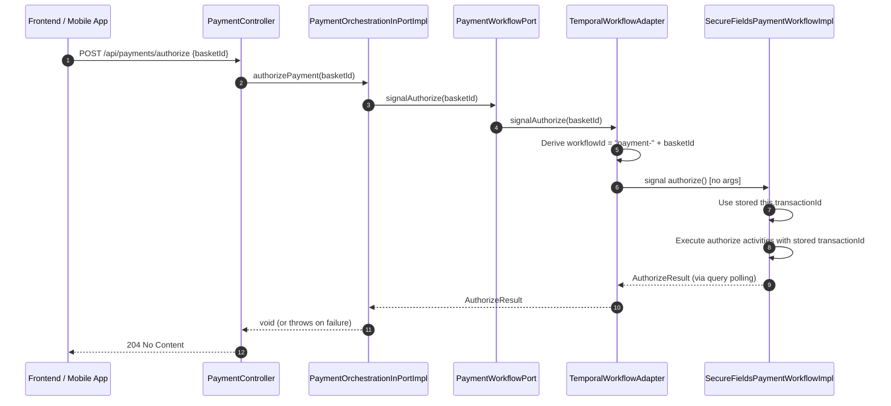

# Design Document

## Overview

This design covers the removal of `transactionId` from the `POST /api/payments/authorize` request in the Payment Orchestration Service. The workflow already stores the `transactionId` during Secure Fields initialization, making the external parameter redundant.

**Key design decisions:**
- The `authorize()` signal on the Temporal workflow becomes a no-argument signal (previously accepted `transactionId`)
- The workflow uses its internally stored `this.transactionId` for all downstream activity calls
- All intermediate layers (port interfaces, adapters, service implementations) drop the `transactionId` parameter from their authorize method signatures
- The `AuthorizePaymentRequest` DTO becomes a single-field record containing only `basketId`
- Unknown fields in the request body are ignored (Jackson default) to allow a graceful client migration period

## Architecture

### Updated Authorize Flow



### Before vs After: Signal Parameter

**Before:**
```
authorize(String transactionId)  ← externally provided
```

**After:**
```
authorize()  ← uses this.transactionId from workflow state
```

The `transactionId` stored at step 6 of `initSecureFields` (`this.transactionId = txnId`) is the same value that was previously passed in from the frontend. The workflow is the source of truth for the transaction.

## Components and Interfaces

### Changes Summary

| Component | Before | After |
|-----------|--------|-------|
| `AuthorizePaymentRequest` | `record(transactionId, basketId)` | `record(basketId)` |
| `PaymentController.authorizePayment()` | Passes `request.transactionId(), request.basketId()` | Passes `request.basketId()` |
| `PaymentOrchestrationInPort.authorizePayment()` | `void authorizePayment(String transactionId, String basketId)` | `void authorizePayment(String basketId)` |
| `PaymentOrchestrationInPortImpl.authorizePayment()` | Calls `signalAuthorize(basketId, transactionId)` | Calls `signalAuthorize(basketId)` |
| `PaymentWorkflowPort.signalAuthorize()` | `AuthorizeResult signalAuthorize(String basketId, String transactionId)` | `AuthorizeResult signalAuthorize(String basketId)` |
| `TemporalWorkflowAdapter.signalAuthorize()` | Passes `transactionId` to workflow signal | Signals `authorize()` with no args |
| `PaymentWorkflowPortStub.signalAuthorize()` | `signalAuthorize(String basketId, String transactionId)` | `signalAuthorize(String basketId)` |
| `SecureFieldsPaymentWorkflow.authorize()` | `@SignalMethod void authorize(String transactionId)` | `@SignalMethod void authorize()` |
| `SecureFieldsPaymentWorkflowImpl.authorize()` | Uses parameter `transactionId` | Uses `this.transactionId` |

### Updated DTO

```java
/**
 * Request to finalize a payment authorization (post-3DS, web only).
 *
 * @param basketId the basket/reservation identifier
 */
@Schema(description = "Request to finalize payment authorization after 3-D Secure")
public record AuthorizePaymentRequest(
    @Schema(description = "The basket/reservation identifier",
        example = "AQN-147756bb-bb71-4842-959a-2efe87e378ed")
    @NotBlank(message = "basketId is required")
    @Pattern(regexp = "^[A-Z]{3}-[0-9a-f]{8}-[0-9a-f]{4}-[0-9a-f]{4}-[0-9a-f]{4}-[0-9a-f]{12}$",
        message = "basketId must match format XXX-xxxxxxxx-xxxx-xxxx-xxxx-xxxxxxxxxxxx")
    String basketId
) {}
```

### Updated Workflow Signal

```java
@WorkflowInterface
public interface SecureFieldsPaymentWorkflow {

  @WorkflowMethod
  void run(String basketId);

  @UpdateMethod
  SecureFieldsInitResult initSecureFields(InitSecureFieldsCommand command);

  /**
   * Signal to authorize the payment using the workflow's stored transactionId.
   */
  @SignalMethod
  void authorize();

  @QueryMethod
  PaymentStatus getPaymentStatus();

  @QueryMethod
  AuthorizeResult getAuthorizeResult();
}
```

### Updated Workflow Implementation (authorize method)

```java
@Override
public void authorize() {
    // Guard: fail fast if initSecureFields didn't complete successfully
    if (transactionId == null) {
        authorizeResult = new AuthorizeResult(false, "GATEWAY_ERROR",
            "Workflow not initialized: missing transaction state");
        paymentStatus = PaymentStatus.FAILED;
        return;
    }
    if (bookingReference == null || reservationId == null || currency == null) {
        authorizeResult = new AuthorizeResult(false, "GATEWAY_ERROR",
            "Workflow not initialized: missing reservation state");
        paymentStatus = PaymentStatus.FAILED;
        return;
    }

    try {
        // Step 1: Authorize with Datatrans (use stored transactionId and bookingReference)
        authorizeActivities.authorizeTransaction(this.transactionId, this.bookingReference);
        paymentStatus = PaymentStatus.AUTHORIZED;

        // Step 2: Post deposit to OPERA
        authorizeActivities.postDeposit(reservationId, this.transactionId);

        // Step 3: Confirm booking
        authorizeActivities.confirmBooking(basketId, this.transactionId);

        // Step 4: Settle with Datatrans
        authorizeActivities.settleTransaction(
            this.transactionId, amount, currency, this.bookingReference);

        // Step 5: Update basket
        authorizeActivities.updateBasket(basketId, this.transactionId, amount, currency);

        authorizeResult = new AuthorizeResult(true, null, null);
        paymentStatus = PaymentStatus.SETTLED;
    } catch (Exception e) {
        authorizeResult = new AuthorizeResult(false, mapErrorCode(e), e.getMessage());
        paymentStatus = PaymentStatus.FAILED;
    }
}
```

### Updated TemporalWorkflowAdapter

```java
@Override
public AuthorizeResult signalAuthorize(String basketId) {
    String workflowId = "payment-" + basketId;
    log.info("Signaling authorize on Temporal workflow [workflowId={}]", workflowId);

    try {
        SecureFieldsPaymentWorkflow workflowStub = workflowClient.newWorkflowStub(
            SecureFieldsPaymentWorkflow.class, workflowId);

        PaymentStatus status;
        try {
            status = workflowStub.getPaymentStatus();
        } catch (WorkflowNotFoundException e) {
            return new AuthorizeResult(false, "TRANSACTION_NOT_FOUND",
                "No payment workflow found for basket " + basketId);
        }

        if (status == PaymentStatus.AUTHORIZED || status == PaymentStatus.SETTLED) {
            return new AuthorizeResult(false, "TRANSACTION_ALREADY_AUTHORIZED",
                "Payment has already been authorized for basket " + basketId);
        }
        if (status == PaymentStatus.FAILED) {
            return new AuthorizeResult(false, "TRANSACTION_NOT_FOUND",
                "Payment workflow has failed for basket " + basketId);
        }

        // Signal with no transactionId — workflow uses its stored value
        workflowStub.authorize();

        return pollForAuthorizeResult(workflowStub, workflowId);
    } catch (WorkflowNotFoundException e) {
        return new AuthorizeResult(false, "TRANSACTION_NOT_FOUND",
            "No payment workflow found for basket " + basketId);
    } catch (Exception e) {
        return new AuthorizeResult(false, "GATEWAY_ERROR",
            "Failed to communicate with payment workflow: " + e.getMessage());
    }
}
```

## Error Handling

No new error codes are introduced. The existing error handling remains unchanged:

| Scenario | Error Code | HTTP Response |
|----------|-----------|---------------|
| Workflow not found for basketId | `TRANSACTION_NOT_FOUND` | 404 |
| Workflow already authorized/settled | `TRANSACTION_ALREADY_AUTHORIZED` | 409 |
| Workflow in FAILED state | `TRANSACTION_NOT_FOUND` | 404 |
| Workflow missing stored transactionId | `GATEWAY_ERROR` | 502 |
| Temporal communication failure | `GATEWAY_ERROR` | 502 |

## Testing Strategy

### Unit Tests to Update

| Test Class | Changes Required |
|-----------|-----------------|
| `PaymentControllerAuthorizeTest` | Update request body to contain only `basketId`; remove `transactionId` from test fixtures |
| `PaymentOrchestrationInPortImplAuthorizeTest` | Update `authorizePayment()` call to single param; update mock setup for `signalAuthorize(basketId)` |
| `TemporalWorkflowAdapterAuthorizeTest` | Update `signalAuthorize()` call to single param; verify `workflowStub.authorize()` is called with no args |
| `SecureFieldsPaymentWorkflowImplTest` (authorize scenarios) | Signal `authorize()` with no args; verify workflow uses stored `transactionId`; add test for null `transactionId` guard |

### New Test Case

- **Authorize with null stored transactionId**: Signal `authorize()` on a workflow that has not completed `initSecureFields`. Expect `AuthorizeResult(false, "GATEWAY_ERROR", "Workflow not initialized: missing transaction state")`.

## Migration Notes

- **Frontend impact**: Clients must stop sending `transactionId` in the authorize request body. The field will be ignored if sent (Jackson ignores unknown fields by default with records).
- **No database migration**: This is a pure code change with no persistence impact.
- **No Temporal workflow versioning needed**: The signal signature change means in-flight workflows (started before deployment) that expect `authorize(String transactionId)` will not match the new `authorize()` signal. If there are in-flight workflows at deployment time, Temporal versioning (`Workflow.getVersion`) should be used. If not (clean deploy), no versioning is needed.
