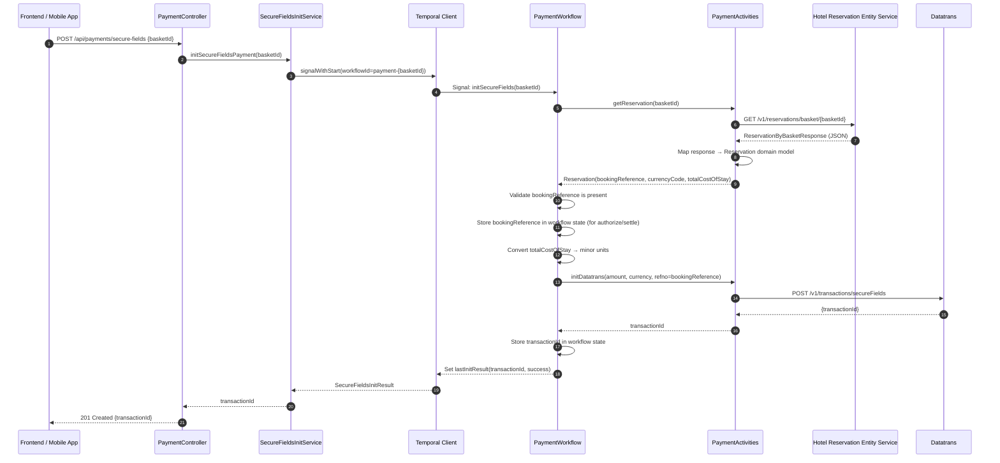
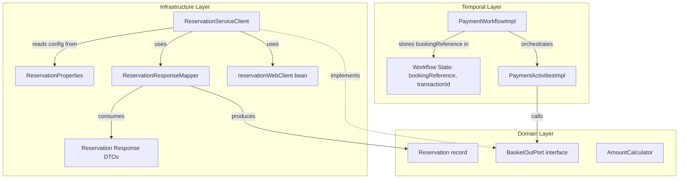

# Design Document

## Overview

This design covers the replacement of the `BasketStubAdapter` in the Payment Orchestration Service with a real REST client that calls the **Hotel Reservation Entity Service** at `GET /v1/reservations/basket/{basketReference}`.

The frontend passes a `basketId` when initiating payment. The orchestrator uses this as the `{basketReference}` path parameter to retrieve reservation data. From the response, it extracts:
- **`bookingReference`** — used as `refno` for all Datatrans calls and tracked in the Temporal workflow state
- **`currencyCode`** — from `rateInfo.summary.currencyCode`
- **`totalCostOfStay`** — from `rateInfo.summary.totalCostOfStay`, used as the payment amount

**Key design decisions:**
- The existing `BasketStubAdapter` is **removed entirely** — no profile-gated stub
- The `Reservation` domain model is updated: `baseAmount` + `donationAmount` replaced by a single `totalCostOfStay` field
- The `refno` field on `Reservation` is set to `bookingReference` (previously it was set to `basketId`)
- The new `ReservationServiceClient` is the sole implementation of `BasketOutPort`
- Uses the same `WebClient`-based approach as `DatatransRestAdapter` for consistency
- The Temporal workflow stores `bookingReference` in its state, making it available across the full payment lifecycle (init → authorize → settle)

## Architecture

### Integration Flow (within Temporal Workflow)



### Temporal Workflow State Changes

The `PaymentWorkflowImpl` maintains state across the payment lifecycle. This integration adds `bookingReference` to the workflow state:

```mermaid
stateDiagram-v2
    [*] --> WaitingForSignal: Workflow started (basketId)
    WaitingForSignal --> FetchingReservation: Signal: initSecureFields
    FetchingReservation --> ValidatingReservation: Activity: getReservation
    ValidatingReservation --> CalculatingAmount: bookingReference present, fields valid
    ValidatingReservation --> Failed: Missing bookingReference/amount/currency
    CalculatingAmount --> CallingDatatrans: totalCostOfStay → minor units
    CallingDatatrans --> Initialized: transactionId received
    CallingDatatrans --> Failed: Datatrans error
    Initialized --> WaitingForAuthorize: State stored (bookingRef, transactionId)
    
    Note right of Initialized: Workflow state now holds:<br/>- bookingReference (refno)<br/>- transactionId<br/>- amount, currency<br/>Available for authorize/settle signals
    
    WaitingForAuthorize --> Authorizing: Signal: authorize
    Authorizing --> Authorized: Datatrans authorize (refno=bookingReference)
    Authorized --> Settling: Signal: settle
    Settling --> Settled: Datatrans settle (refno=bookingReference)
    Failed --> WaitingForSignal: Ready for retry
```

### Hexagonal Architecture Layer Map



## Components and Interfaces

### Domain Layer Changes

| Component | Change | Purpose |
|-----------|--------|---------|
| `BasketOutPort` | Remove `getBasket(String)` method | Only `getReservation(String)` remains |
| `Reservation` | Record fields changed | Replace `baseAmount`+`donationAmount` with `totalCostOfStay`; `refno` = `bookingReference` |
| `AmountCalculator` | Remove `calculateTotal` | Only `toMinorUnits(BigDecimal, String)` needed |

### Infrastructure Layer (New)

| Component | Type | Purpose |
|-----------|------|---------|
| `ReservationServiceClient` | `@Component` | REST client calling Hotel Reservation Entity Service, sole `BasketOutPort` impl |
| `ReservationProperties` | `@ConfigurationProperties` | Externalised config: host, endpoint path, timeouts |
| `ReservationWebClientConfig` | `@Configuration` | Creates `reservationWebClient` bean with base URL and timeouts |
| `ReservationResponseMapper` | MapStruct mapper | Maps raw JSON response DTOs to `Reservation` domain model |

### Infrastructure Layer (Response DTOs)

| DTO | Purpose |
|-----|---------|
| `ReservationByBasketResponse` | Top-level response: `reservationByIdList`, `bookingReference`, `hotelId`, `currencyCode`, etc. |
| `ReservationByIdDto` | Individual reservation within `reservationByIdList` |
| `RateInfoDto` | Wrapper for `summary` |
| `RateInfoSummaryDto` | Contains `totalCostOfStay`, `currencyCode` |

### Removed Components

| Component | Reason |
|-----------|--------|
| `BasketStubAdapter` | Replaced by `ReservationServiceClient` |
| `BasketClient` (basket-real profile) | Replaced by `ReservationServiceClient` |

### Temporal Layer Changes

| Component | Change | Purpose |
|-----------|--------|---------|
| `PaymentWorkflowImpl` | Store `bookingReference` in workflow state | Available for authorize and settle signals |
| `PaymentWorkflowImpl` | Use `toMinorUnits(totalCostOfStay)` | Amount calculation from single field |
| `PaymentWorkflowImpl` | Pass `bookingReference` as `refno` to Datatrans | Correlates payment with booking |
| `PaymentActivitiesImpl` | No structural change | Delegates to `BasketOutPort` which now calls real service |

## Data Models

### Updated Domain Model

```java
/**
 * Reservation data retrieved from Hotel Reservation Entity Service.
 *
 * @param basketId         the basket/reservation identifier (from frontend request)
 * @param hotelId          the hotel identifier
 * @param totalCostOfStay  the total payment amount in major currency units (e.g. 89.00)
 * @param currencyCode     ISO 4217 currency code (e.g. GBP, EUR)
 * @param bookingReference the booking reference — used as refno for Datatrans
 * @param refno            reference number for Datatrans (set to bookingReference)
 */
public record Reservation(
    String basketId,
    String hotelId,
    BigDecimal totalCostOfStay,
    String currencyCode,
    String bookingReference,
    String refno
) {}
```

**Changes from current model:**
- Removed `baseAmount` and `donationAmount` — replaced by `totalCostOfStay`
- Removed `paymentCompleted` boolean — no longer needed
- `refno` is now set to `bookingReference` (not `basketId`)

### Response DTOs (from Hotel Reservation Entity Service)

```java
@JsonIgnoreProperties(ignoreUnknown = true)
public record ReservationByBasketResponse(
    List<ReservationByIdDto> reservationByIdList,
    String bookingReference,
    String basketReference,
    String hotelId,
    String currencyCode,
    BigDecimal totalCost,
    String basketStatus,
    String paymentOption
) {}

@JsonIgnoreProperties(ignoreUnknown = true)
public record ReservationByIdDto(
    String reservationId,
    RateInfoDto rateInfo,
    String reservationStatus
) {}

@JsonIgnoreProperties(ignoreUnknown = true)
public record RateInfoDto(
    RateInfoSummaryDto summary
) {}

@JsonIgnoreProperties(ignoreUnknown = true)
public record RateInfoSummaryDto(
    BigDecimal totalCostOfStay,
    String currencyCode,
    BigDecimal gross,
    BigDecimal net,
    BigDecimal deposit,
    BigDecimal outStandingCostOfStay,
    BigDecimal guestPay
) {}
```

### Mapping Logic

```java
@Mapper(componentModel = "spring")
public interface ReservationResponseMapper {

  default Reservation toDomain(String basketId, ReservationByBasketResponse response) {
    if (response.reservationByIdList() == null || response.reservationByIdList().isEmpty()) {
      throw new BasketNotFoundException("No reservations found for basket " + basketId);
    }

    ReservationByIdDto firstReservation = response.reservationByIdList().get(0);
    RateInfoSummaryDto summary = firstReservation.rateInfo().summary();

    return new Reservation(
        basketId,
        response.hotelId(),
        summary.totalCostOfStay(),
        summary.currencyCode(),
        response.bookingReference(),
        response.bookingReference()  // refno = bookingReference
    );
  }
}
```

## REST Client Implementation

### `ReservationServiceClient`

```java
@Slf4j
@Component
@RequiredArgsConstructor
public class ReservationServiceClient implements BasketOutPort {

  @Qualifier("reservationWebClient")
  private final WebClient reservationWebClient;
  private final ReservationProperties properties;
  private final ReservationResponseMapper mapper;

  @Override
  public Reservation getReservation(String basketId) {
    log.info("Fetching reservation for basketId={}", basketId);

    if (basketId == null || basketId.isBlank()) {
      throw new BasketNotFoundException("No basket found for ID " + basketId);
    }

    try {
      ReservationByBasketResponse response = reservationWebClient.get()
          .uri(properties.getReservationEndpoint(), basketId)
          .accept(MediaType.APPLICATION_JSON)
          .retrieve()
          .onStatus(status -> status.value() == 404,
              clientResponse -> Mono.error(new BasketNotFoundException(
                  "No basket found for ID " + basketId)))
          .onStatus(HttpStatusCode::isError, clientResponse ->
              clientResponse.bodyToMono(String.class)
                  .defaultIfEmpty("(no body)")
                  .flatMap(body -> {
                    log.error("Reservation service error: status={}, body={}",
                        clientResponse.statusCode(), body);
                    return Mono.error(new ServiceUnavailableException(
                        "Reservation service returned " + clientResponse.statusCode()));
                  }))
          .bodyToMono(ReservationByBasketResponse.class)
          .block(properties.getReadTimeout());

      if (response == null) {
        throw new ServiceUnavailableException("Reservation service returned empty response");
      }

      Reservation reservation = mapper.toDomain(basketId, response);

      // Validate required fields for payment
      if (reservation.bookingReference() == null || reservation.bookingReference().isBlank()) {
        throw new DatatransGatewayException(
            "Reservation response missing bookingReference for basket " + basketId);
      }
      if (reservation.totalCostOfStay() == null) {
        throw new DatatransGatewayException(
            "Reservation response missing totalCostOfStay for basket " + basketId);
      }
      if (reservation.currencyCode() == null || reservation.currencyCode().isBlank()) {
        throw new DatatransGatewayException(
            "Reservation response missing currencyCode for basket " + basketId);
      }

      log.info("Reservation retrieved: basketId={}, bookingRef={}, amount={} {}",
          basketId, reservation.bookingReference(),
          reservation.totalCostOfStay(), reservation.currencyCode());

      return reservation;

    } catch (WebClientRequestException e) {
      log.error("Reservation service unreachable for basketId={}: {}",
          basketId, e.getMessage(), e);
      throw new ServiceUnavailableException(
          "Hotel Reservation Entity Service is unreachable: " + e.getMessage());
    }
  }
}
```

### Configuration

```java
@Data
@Configuration
@ConfigurationProperties(prefix = "integrations.reservation")
public class ReservationProperties {

  /** Base URL for the Hotel Reservation Entity Service. */
  private String host = "http://localhost:9103";

  /** Endpoint path template with {basketReference} placeholder. */
  private String reservationEndpoint = "/v1/reservations/basket/{basketReference}";

  /** HTTP connection timeout. */
  private Duration connectTimeout = Duration.ofSeconds(5);

  /** HTTP read timeout. */
  private Duration readTimeout = Duration.ofSeconds(10);
}
```

### WebClient Bean Configuration

```java
@Configuration
@RequiredArgsConstructor
public class ReservationWebClientConfig {

  private final ReservationProperties properties;

  @Bean("reservationWebClient")
  public WebClient reservationWebClient() {
    HttpClient httpClient = HttpClient.create()
        .option(ChannelOption.CONNECT_TIMEOUT_MILLIS,
            (int) properties.getConnectTimeout().toMillis())
        .responseTimeout(properties.getReadTimeout());

    return WebClient.builder()
        .baseUrl(properties.getHost())
        .clientConnector(new ReactorClientHttpConnector(httpClient))
        .build();
  }
}
```

### Application Configuration (application.yml addition)

```yaml
integrations:
  reservation:
    host: http://${RESERVATION_HOST:localhost:9103}
    reservationEndpoint: "/v1/reservations/basket/{basketReference}"
    connect-timeout: 5s
    read-timeout: 10s
```

## Impact on Temporal Workflow

### Workflow State (before and after)

**Before (with stub):**
```java
public class PaymentWorkflowImpl implements PaymentWorkflow {
  private SecureFieldsInitResult lastInitResult;
  // No bookingReference stored — refno was basketId
}
```

**After (with real service):**
```java
public class PaymentWorkflowImpl implements PaymentWorkflow {
  private SecureFieldsInitResult lastInitResult;
  private String bookingReference;  // Stored for use in authorize/settle
  private String transactionId;     // Stored for correlation
}
```

### Signal Handler Changes

**Before:**
```java
@Override
public void initSecureFields(InitSecureFieldsSignal signal) {
  Reservation reservation = activities.getReservation(signal.basketId());
  if (reservation.paymentCompleted()) { /* reject */ }
  if (reservation.bookingReference() != null) { /* reject */ }

  long totalMinorUnits = calc.calculateTotal(
      reservation.baseAmount(), reservation.donationAmount(), reservation.currencyCode());

  DatatransSecureFieldsRequest dtRequest = new DatatransSecureFieldsRequest(
      totalMinorUnits, reservation.currencyCode(), returnUrl, false);
  // refno was basketId
}
```

**After:**
```java
@Override
public void initSecureFields(InitSecureFieldsSignal signal) {
  Reservation reservation = activities.getReservation(signal.basketId());
  // bookingReference is now always present (validated in ReservationServiceClient)
  // No paymentCompleted check — field removed

  // Store in workflow state for authorize/settle
  this.bookingReference = reservation.bookingReference();

  long totalMinorUnits = calc.toMinorUnits(
      reservation.totalCostOfStay(), reservation.currencyCode());

  DatatransSecureFieldsRequest dtRequest = new DatatransSecureFieldsRequest(
      properties.getMerchantId(),
      totalMinorUnits,
      reservation.currencyCode(),
      returnUrl,
      false);
  // refno = bookingReference, passed to Datatrans
  String transactionId = activities.initDatatransSecureFields(dtRequest);
  this.transactionId = transactionId;

  lastInitResult = new SecureFieldsInitResult(transactionId, true, null, null);
}
```

### Authorize and Settle (future signals use stored bookingReference)

The `bookingReference` stored in workflow state is used in subsequent lifecycle steps:

```java
// In authorize signal handler (existing/future)
activities.authorizeTransaction(this.transactionId, this.bookingReference);

// In settle signal handler (existing/future)
activities.settleTransaction(this.transactionId, amount, currency, this.bookingReference);
```

This ensures `refno` consistency across the entire payment lifecycle without re-fetching from the reservation service.

## Error Handling

### Exception Mapping from Reservation Service

| Reservation Service Response | Domain Exception | HTTP Response to Frontend |
|------------------------------|-----------------|---------------------------|
| 404 Not Found | `BasketNotFoundException` | 404 `BASKET_NOT_FOUND` |
| Empty `reservationByIdList` | `BasketNotFoundException` | 404 `BASKET_NOT_FOUND` |
| Missing `bookingReference` | `DatatransGatewayException` | 502 `GATEWAY_ERROR` |
| Missing `totalCostOfStay` | `DatatransGatewayException` | 502 `GATEWAY_ERROR` |
| Missing `currencyCode` | `DatatransGatewayException` | 502 `GATEWAY_ERROR` |
| 5xx Server Error | `ServiceUnavailableException` | 503 `SERVICE_UNAVAILABLE` |
| Connection refused / timeout | `ServiceUnavailableException` | 503 `SERVICE_UNAVAILABLE` |

### Temporal Error Propagation

Errors thrown in `PaymentActivitiesImpl.getReservation()` propagate through the Temporal activity mechanism:

1. Activity throws exception (e.g. `BasketNotFoundException`)
2. Temporal retries up to configured max attempts (3)
3. If all retries fail, exception propagates to workflow signal handler
4. Workflow catches and sets `SecureFieldsInitResult` with appropriate error code
5. `SecureFieldsInitService` reads result via Temporal query, throws matching domain exception
6. `GlobalExceptionHandler` maps to HTTP response

### Logging Rules (PII protection)

- **DO log**: basketId, bookingReference, hotelId, currencyCode, totalCostOfStay, HTTP status codes
- **DO NOT log**: guest names, email addresses, phone numbers, postal addresses, payment card details

## Testing Strategy (Unit Tests Only)

### Coverage Requirement

All new and modified classes must achieve at least **80% line coverage** as measured by JaCoCo.

### Unit Tests

| Test Class | Purpose | Mocking Approach |
|-----------|---------|------------------|
| `ReservationServiceClientTest` | Verify REST client behaviour (happy path, 404, 5xx, timeouts, missing fields) | MockWebServer |
| `ReservationResponseMapperTest` | Verify DTO → domain model mapping, edge cases | Direct method calls |
| `ReservationPropertiesTest` | Verify default config values | Spring `@ConfigurationProperties` test |
| `PaymentWorkflowImplTest` (updates) | Verify workflow uses bookingReference as refno, totalCostOfStay for amount | Temporal TestWorkflowExtension with mocked activities |
| `AmountCalculatorTest` (updates) | Verify `toMinorUnits` with totalCostOfStay values | Direct method calls |

### Test Data

Example response for MockWebServer stubs:

```json
{
  "reservationByIdList": [
    {
      "reservationId": "RES-001",
      "rateInfo": {
        "summary": {
          "totalCostOfStay": 89.00,
          "currencyCode": "GBP",
          "gross": 89.00,
          "net": 74.17
        }
      },
      "reservationStatus": "RESERVED"
    }
  ],
  "bookingReference": "PI-123456789",
  "basketReference": "bsk-a1b2c3d4",
  "hotelId": "LONWAT",
  "currencyCode": "GBP",
  "totalCost": 89.00
}
```

## Configuration Summary

### Full application.yml section

```yaml
integrations:
  datatrans:
    base-url: ${DATATRANS_BASE_URL:https://api.sandbox.datatrans.com}
    merchant-id: ${DATATRANS_MERCHANT_ID:}
    merchant-password: ${DATATRANS_MERCHANT_PASSWORD:}
    connect-timeout: 5s
    read-timeout: 10s
  reservation:
    host: http://${RESERVATION_HOST:localhost:9103}
    reservationEndpoint: "/v1/reservations/basket/{basketReference}"
    connect-timeout: 5s
    read-timeout: 10s
  opera:
    base-url: ${OPERA_BASE_URL:http://opera-adapter:8080}
```

Note: The previous `integrations.basket` section is removed and replaced by `integrations.reservation`.
