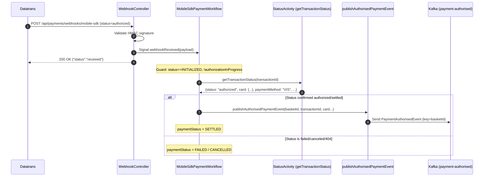
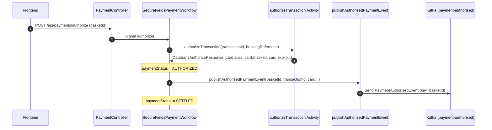

# Design Document

## Overview

This design replaces the `publishAuthorisedPaymentEvent` no-op seam (CTECH-12098) with a real
Kafka producer that publishes a `PaymentAuthorisedEvent` to the `payment-authorised` topic.
It also adds a **webhook status validation** step to the Mobile SDK flow and wires the event
publication into the Secure Fields flow (which currently skips it).

After this work, both payment channels publish the same event on successful authorisation,
enabling the Basket Service to consume it and drive the booking-confirmation choreography
identically regardless of channel.

### Key design decisions

- **Single activity, both channels.** The extended `publishAuthorisedPaymentEvent` activity is
  the only event publication point. Both workflows call it at the same logical position (after
  `AUTHORIZED`). This keeps the Kafka concern in infrastructure and out of workflow determinism.
- **Activity signature extension with Temporal versioning.** The activity gains new parameters
  (paymentMethod, last4Digits, expiry). A `Workflow.getVersion` marker ensures in-flight
  workflows replay correctly with the old signature while new executions use the full signature.
- **Webhook status validation before authorisation.** The Mobile SDK webhook handler gains a
  `getTransactionStatus` call after receiving `status=authorized`. The workflow only transitions
  to `AUTHORIZED` if the backend-confirmed status agrees. This closes the gap where HMAC
  validation alone guards authorisation.
- **Event data from status response, not webhook.** For Mobile SDK, card data in the event comes
  from the `getTransactionStatus` response (backend-confirmed), not the webhook payload. This is
  the authoritative source. For Secure Fields, data comes from the `DatatransAuthorizeResponse`.
- **Reconciliation poller unchanged.** The existing reconciliation path already calls
  `getTransactionStatus` and authorises on `authorized`/`settled`. It will naturally call the
  extended activity with the same data. No change needed to the poller logic itself.
- **`cardHolderName` is omitted.** Datatrans does not return cardholder name in either the
  webhook, the authorize response, or the status response. Downstream consumers
  (BasketOrderEvent) treat it as optional. The event schema does not include it.
- **No postDeposit or settlement chain.** The workflow's responsibility ends after publishing
  the event. There is no postDeposit, confirmBooking, settle, or updateBasket step in this
  workflow. The downstream choreography (Basket Service → BAOP → OPERA) handles confirmation
  and settlement independently.

### In scope

- `PaymentAuthorisedEvent` domain model and JSON schema.
- Spring Kafka producer configuration and `KafkaPaymentEventPublisher` adapter.
- `PaymentActivities.publishAuthorisedPaymentEvent` signature extension.
- `PaymentActivitiesImpl` wired to the Kafka publisher.
- Mobile SDK workflow: webhook status validation step.
- Secure Fields workflow: call `publishAuthorisedPaymentEvent` after authorisation.
- Docker-compose: Kafka broker and `payment-authorised` topic.
- Application configuration: Kafka bootstrap servers, topic name, producer settings.

### Out of scope

- Basket Service consumer implementation (separate ticket).
- postDeposit, confirmBooking, settle, updateBasket activities (not part of this workflow).
- `bookingCompleted` event consumption and settlement trigger.
- Cardholder name propagation (not available from Datatrans).

---

## Architecture

### Component Diagram

```
┌─────────────────────────────────────────────────────────────────┐
│                 Payment Orchestration Service                    │
│                                                                 │
│  ┌──────────────────────┐    ┌─────────────────────────────┐   │
│  │ SecureFieldsWorkflow │    │  MobileSdkPaymentWorkflow   │   │
│  │                      │    │                             │   │
│  │ authorize():         │    │ webhookReceived():          │   │
│  │  1. authorizeTransaction  │  1. validate webhook        │   │
│  │  2. publishAuthorisedPay… │     (existing HMAC)         │   │
│  │  3. SETTLED               │  2. getTransactionStatus    │   │
│  └──────────────────────┘    │     (status validation)     │   │
│                              │  3. publishAuthorisedPay…   │   │
│                              │  4. SETTLED                 │   │
│                              └─────────────────────────────┘   │
│                                                                 │
│  ┌─────────────────────────────────────────────────────────┐   │
│  │              PaymentActivitiesImpl                       │   │
│  │                                                         │   │
│  │  publishAuthorisedPaymentEvent(...)                     │   │
│  │    → KafkaPaymentEventPublisher.publish(event)          │   │
│  └─────────────────────────────────────────────────────────┘   │
│                              │                                  │
│                              ▼                                  │
│  ┌─────────────────────────────────────────────────────────┐   │
│  │         KafkaPaymentEventPublisher                      │   │
│  │         (KafkaTemplate<String, PaymentAuthorisedEvent>) │   │
│  └──────────────────────────┬──────────────────────────────┘   │
│                              │                                  │
└──────────────────────────────┼──────────────────────────────────┘
                               │ Kafka send
                               ▼
                    ┌──────────────────────┐
                    │  payment-authorised  │  (Kafka topic)
                    └──────────┬───────────┘
                               │
                               ▼
                    ┌──────────────────────┐
                    │   Basket Service     │  (consumer — out of scope)
                    └──────────────────────┘
```

### Mobile SDK Webhook Flow (with status validation)



### Secure Fields Authorize Flow (with event publication)



---

## Data Model

### PaymentAuthorisedEvent (Kafka message value)

```json
{
  "basketId": "AQN-147756bb-bb71-4842-959a-2efe87e378ed",
  "transactionId": "190410112056083383",
  "paymentProvider": "datatrans",
  "paymentMethod": "VIS",
  "cardAlias": "424242SKMPRI4242",
  "last4Digits": "4242",
  "expiry": "12/28",
  "authorizedAmount": 8600,
  "currency": "GBP"
}
```

**Kafka message key:** `basketId` (string)

### Domain record

```java
package uk.co.whitbread.payment.orchestrator.domain.model;

public record PaymentAuthorisedEvent(
    String basketId,
    String transactionId,
    String paymentProvider,
    String paymentMethod,
    String cardAlias,
    String last4Digits,
    String expiry,
    Integer authorizedAmount,
    String currency
) {}
```

### Deriving `last4Digits` and `expiry`

- **`last4Digits`**: Extracted from `DatatransCardInfo.masked()` — take the last 4 characters
  (e.g. `"424242xxxxxx4242"` → `"4242"`). If masked is null, `last4Digits` is null.
- **`expiry`**: Formatted as `"MM/YY"` from `DatatransCardInfo.expiryMonth()` and
  `DatatransCardInfo.expiryYear()` (e.g. `"12"` + `"28"` → `"12/28"`). If either is null,
  `expiry` is null.

---

## Activity Signature Change

### Current signature (CTECH-12098)

```java
void publishAuthorisedPaymentEvent(
    String basketId,
    String transactionId,
    String cardAlias,
    Integer authorizedAmount,
    String currency
);
```

### New signature (this ticket)

```java
void publishAuthorisedPaymentEvent(
    String basketId,
    String transactionId,
    String cardAlias,
    Integer authorizedAmount,
    String currency,
    String paymentMethod,
    String last4Digits,
    String expiry
);
```

### Temporal versioning

A `Workflow.getVersion("CTECH-11615-payment-authorised-event", Workflow.DEFAULT_VERSION, 1)`
marker in both workflows ensures:
- In-flight workflows replaying old history use the old 5-parameter call (no-op).
- New executions use the full 8-parameter call with real Kafka publication.

---

## Webhook Status Validation — Mobile SDK

### Current flow (before this ticket)

```
webhookReceived(payload)
  → guard (INITIALIZED, !authorizationInProgress)
  → if status=="authorized" → authorize(outcome from webhook payload)
```

### New flow (this ticket)

```
webhookReceived(payload)
  → guard (INITIALIZED, !authorizationInProgress)
  → if webhook status=="authorized":
      → set authorizationInProgress = true
      → call statusActivities.getTransactionStatus(transactionId)
      → if confirmed status is authorized/settled:
          → authorize(outcome from STATUS RESPONSE, not webhook)
      → else if confirmed status is failed/canceled:
          → paymentStatus = FAILED / CANCELLED
      → else (transient error after retries):
          → paymentStatus = FAILED
      → finally: authorizationInProgress = false
  → else (webhook status is canceled/failed):
      → paymentStatus = CANCELLED / FAILED (unchanged from current behavior)
```

Key points:
- The status validation uses the existing `statusActivities` stub (5s timeout, max 2 attempts,
  non-retryable on `TransactionNotFoundException`).
- Card data for the event comes from the status response, not the webhook.
- The reconciliation poller already calls `getTransactionStatus` and uses the response data for
  authorisation — it is unchanged by this work.
- The `authorizationInProgress` flag prevents the reconciliation poller from racing with the
  webhook status validation.

---

## Secure Fields Workflow Change

### Current authorize() flow

```
authorize():
  1. authorizeTransaction(transactionId, bookingReference)
  2. paymentStatus = AUTHORIZED
  3. postDeposit(...)
  4. confirmBooking(...)
  5. settleTransaction(...)
  6. updateBasket(...)
  → paymentStatus = SETTLED
```

### New authorize() flow

```
authorize():
  1. authorizeTransaction(transactionId, bookingReference)
  2. paymentStatus = AUTHORIZED
  3. publishAuthorisedPaymentEvent(basketId, transactionId, card...)
  → paymentStatus = SETTLED
```

The `authorizeTransaction` activity already returns `DatatransAuthorizeResponse` with
`card.alias`, `card.masked`, `card.expiryMonth`, `card.expiryYear`. However, the current
implementation discards the return value. This change:
1. Makes `authorizeTransaction` return `DatatransAuthorizeResponse` to the workflow.
2. Extracts card data from the response for the event.
3. Removes the postDeposit, confirmBooking, settleTransaction, and updateBasket calls.

Note: `DatatransAuthorizeResponse` currently lacks `paymentMethod`. We extend it (or the
activity return type) to include the payment method from the response.

---

## Infrastructure

### Kafka Configuration

```yaml
# application.yml additions
spring:
  kafka:
    bootstrap-servers: ${KAFKA_BOOTSTRAP_SERVERS:localhost:9092}
    producer:
      acks: all
      key-serializer: org.apache.kafka.common.serialization.StringSerializer
      value-serializer: org.springframework.kafka.support.serializer.JsonSerializer

payment:
  events:
    topics:
      payment-authorised: ${PAYMENT_AUTHORISED_TOPIC:payment-authorised}
```

### KafkaPaymentEventPublisher (secondary port adapter)

```java
package uk.co.whitbread.payment.orchestrator.infrastructure.kafka;

@Component
@Slf4j
@RequiredArgsConstructor
public class KafkaPaymentEventPublisher implements PaymentEventPublisherPort {

  private final KafkaTemplate<String, PaymentAuthorisedEvent> kafkaTemplate;

  @Value("${payment.events.topics.payment-authorised}")
  private String topic;

  @Override
  public void publish(PaymentAuthorisedEvent event) {
    kafkaTemplate.send(topic, event.basketId(), event)
        .whenComplete((result, ex) -> {
          if (ex != null) {
            log.error("Failed to publish PaymentAuthorisedEvent "
                + "[basketId={}, transactionId={}]",
                event.basketId(), event.transactionId(), ex);
          } else {
            log.info("Published PaymentAuthorisedEvent "
                + "[basketId={}, transactionId={}]",
                event.basketId(), event.transactionId());
          }
        });
  }
}
```

### Secondary Port Interface

```java
package uk.co.whitbread.payment.orchestrator.domain.ports.secondary;

public interface PaymentEventPublisherPort {
  void publish(PaymentAuthorisedEvent event);
}
```

### Docker Compose Additions

Kafka broker (KRaft mode) and topic initializer added to the existing docker-compose:

```yaml
  kafka:
    image: quay.io/strimzi/kafka:latest-kafka-3.4.0
    command:
      - sh
      - -c
      - >-
        bin/kafka-storage.sh format --ignore-formatted -t $${KAFKA_CLUSTER_ID}
        -c config/kraft/server.properties &&
        exec bin/kafka-server-start.sh config/kraft/server.properties
        --override advertised.listeners=$${KAFKA_ADVERTISED_LISTENERS}
        --override listener.security.protocol.map=$${KAFKA_LISTENER_SECURITY_PROTOCOL_MAP}
        --override listeners=$${KAFKA_LISTENERS}
    ports:
      - "9092:9092"
    environment:
      LOG_DIR: /tmp/logs
      KAFKA_CLUSTER_ID: MkU3OEVBNTcwNTJENDM2Qk
      KAFKA_LISTENER_SECURITY_PROTOCOL_MAP: CONTROLLER:PLAINTEXT,PLAINTEXT:PLAINTEXT,PLAINTEXT_HOST:PLAINTEXT
      KAFKA_LISTENERS: PLAINTEXT://:29092,PLAINTEXT_HOST://:9092,CONTROLLER://:9093
      KAFKA_ADVERTISED_LISTENERS: PLAINTEXT://kafka:29092,PLAINTEXT_HOST://localhost:9092
    healthcheck:
      test: ["CMD-SHELL", "bin/kafka-topics.sh --bootstrap-server localhost:9092 --list >/dev/null 2>&1"]
      interval: 10s
      timeout: 5s
      retries: 12
      start_period: 20s

  kafka-init:
    image: quay.io/strimzi/kafka:latest-kafka-3.4.0
    command:
      - sh
      - -c
      - |
        bin/kafka-topics.sh --bootstrap-server kafka:29092 --create --if-not-exists \
          --topic payment-authorised --partitions 1 --replication-factor 1
    depends_on:
      kafka:
        condition: service_healthy
```

---

## File Changes Summary

| File | Change |
|------|--------|
| `domain/model/PaymentAuthorisedEvent.java` | New record |
| `domain/ports/secondary/PaymentEventPublisherPort.java` | New interface |
| `domain/workflow/PaymentActivities.java` | Extended signature (8 params) |
| `domain/workflow/MobileSdkPaymentWorkflowImpl.java` | Status validation in webhook handler; remove postDeposit/settle chain; version marker |
| `domain/workflow/SecureFieldsPaymentWorkflowImpl.java` | Add publishAuthorisedPaymentEvent call; remove postDeposit/settle chain; version marker |
| `domain/model/DatatransAuthorizeResponse.java` | Add `paymentMethod` field |
| `domain/model/DatatransTransactionStatus.java` | Add `paymentMethod` field |
| `infrastructure/kafka/KafkaPaymentEventPublisher.java` | New Kafka adapter |
| `infrastructure/kafka/KafkaProducerConfig.java` | New Spring Kafka config |
| `infrastructure/temporal/PaymentActivitiesImpl.java` | Wire publisher, replace no-op |
| `src/main/resources/application.yml` | Add Kafka config |
| `src/main/resources/application-local.yml` | Add Kafka bootstrap for local |
| `infrastructure/docker-local/docker-compose.yml` | Add Kafka + kafka-init |
| `pom.xml` | Add `spring-kafka` dependency |

---

## Risks and Mitigations

| Risk | Mitigation |
|------|-----------|
| Status validation adds latency to webhook processing | Activity timeout is 5s with 2 attempts max; signal is already async so latency doesn't affect the 200 OK response to Datatrans |
| Kafka unavailable blocks authorisation | Activity retries (max 3); on exhaustion workflow moves to FAILED. Kafka `acks=all` ensures durability when available. |
| In-flight workflows break on activity signature change | Temporal versioning ensures replay safety; old workflows use old no-op path |
| Reconciliation poller races with webhook status validation | `authorizationInProgress` flag already guards this; status validation sets it before calling the activity |
