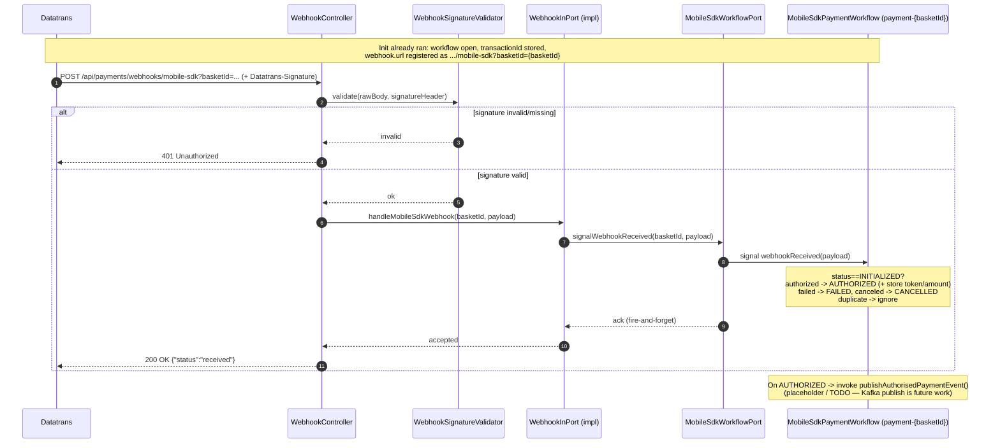
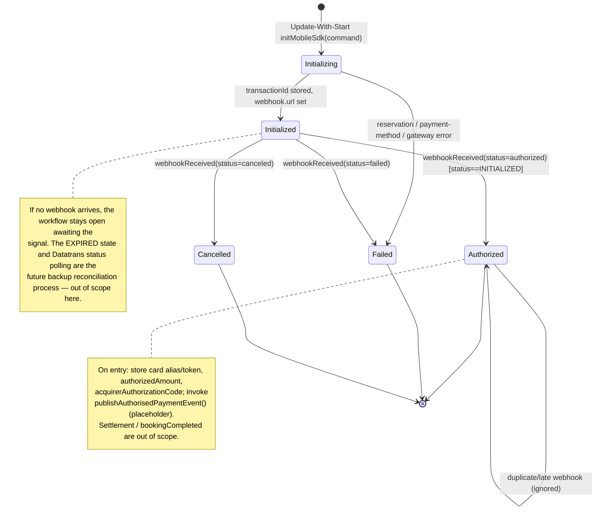
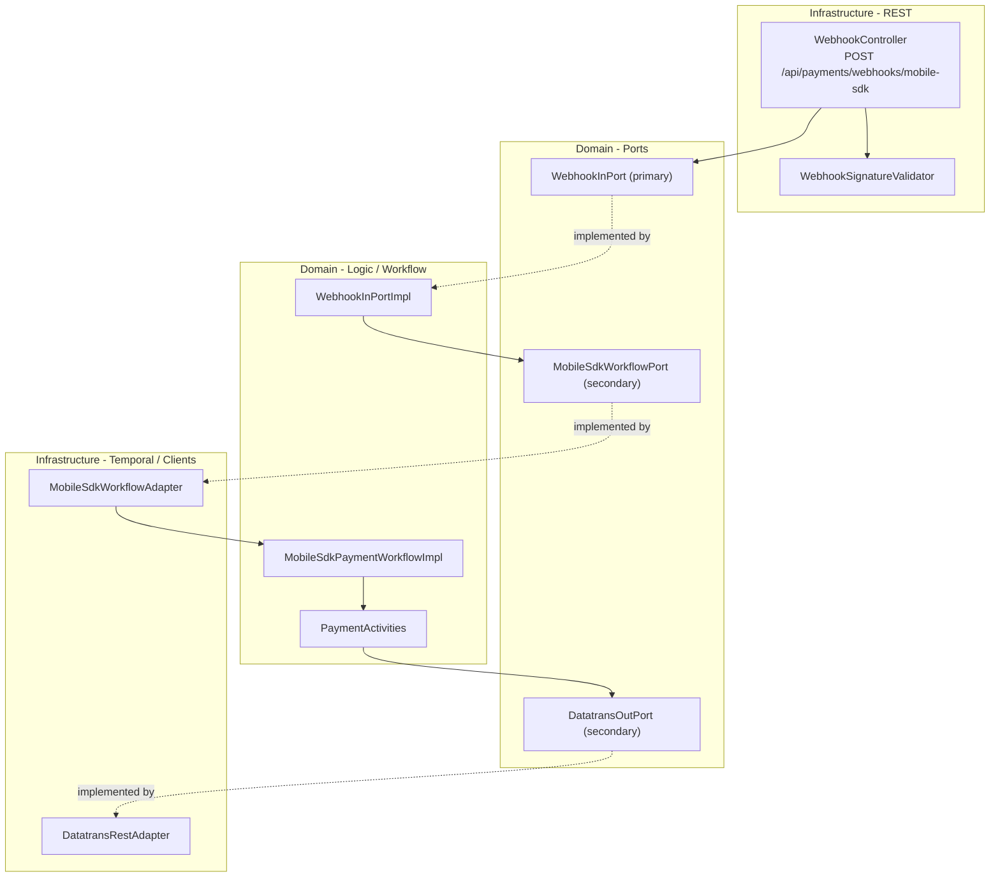

# Design Document

## Overview

This design implements the **Datatrans Mobile SDK webhook API** in the Payment Orchestration
Service and reshapes the Mobile SDK Temporal workflow so it can consume that webhook.

In the web (Secure Fields) flow the frontend triggers authorisation by calling
`POST /api/payments/authorize`. The Mobile SDK flow has no such client call: the Datatrans
Mobile SDK Version 4 completes the card entry and 3-D Secure challenge natively in-app, then
Datatrans notifies the backend server-to-server through
`POST /api/payments/webhooks/mobile-sdk`. This webhook is the authorisation trigger for mobile.

Two things must change:

1. **The webhook endpoint** (currently a `501` placeholder in `WebhookController`) becomes a real
   endpoint: validate authenticity, correlate to the payment workflow, signal it, and return
   `200 OK` fast (Datatrans does not retry on non-2xx).
2. **The `MobileSdkPaymentWorkflow`** (currently short-lived — it completes right after returning
   a `transactionId`) becomes a long-lived workflow that mirrors the Secure Fields workflow:
   it stays open after init, stores payment state, receives the webhook as a signal, and
   transitions `INITIALIZED → AUTHORIZED` (with `FAILED`/`CANCELLED` terminal paths).

On reaching `AUTHORIZED`, the workflow invokes a single extension point that will later publish
the **AuthorisedPaymentEvent** to Kafka. **That publication is explicitly out of scope for this
ticket** — the extension point is a documented no-op/logging placeholder here, so the follow-up
work can wire Kafka without reshaping this change.

### Key design decisions

- **One workflow per basket.** The Mobile SDK workflow ID is aligned to `payment-{basketId}`
  (matching the Secure Fields workflow and the end-to-end design), replacing the current
  `mobile-sdk-{basketId}`. A basket is paid through exactly one channel, so a single workflow ID
  per basket is correct and lets the webhook address the workflow deterministically.
- **Init via Update-With-Start.** Mobile SDK init switches from a short-lived
  `processPayment(basketId)` execution to the same Update-With-Start pattern the Secure Fields
  workflow uses (`run` awaits a terminal state; an `initMobileSdk` update returns the init
  result). This keeps the workflow open to receive the webhook signal.
- **Correlation via webhook URL query parameter.** When the Mobile SDK transaction is created,
  the Datatrans `webhook.url` is set to the service webhook endpoint with `?basketId={basketId}`
  appended. Datatrans echoes the full URL on callback, so the controller reads `basketId` from
  the query string and derives `payment-{basketId}`. This avoids maintaining a separate
  transactionId→basketId store. (See Open Questions for confirmation of v2 webhook config.)
- **Authenticity via HMAC.** The `Datatrans-Signature` header is verified with HMAC-SHA256 over
  `timestamp + rawBody`, keyed with a configured hex sign key, before any processing.
- **Signal, don't block.** The controller validates then sends a Temporal **signal** (fire-and-
  forget) and returns `200` immediately. The workflow processes the signal on its own thread.
- **Guarded, idempotent transition.** Authorisation only happens when `PaymentStatus ==
  INITIALIZED`, so a duplicate/late webhook (or, in future, the backup reconciliation process)
  cannot double-authorise.

### In scope

- Webhook endpoint implementation, request model, signature validation, correlation.
- Mobile SDK workflow reshaped to long-lived; webhook signal handler; `INITIALIZED → AUTHORIZED`
  (and `FAILED`/`CANCELLED`) transitions.
- Mobile SDK init sets the Datatrans `webhook.url` with the `basketId` correlation key.

### Out of scope (future work)

- Publishing `AuthorisedPaymentEvent` to Kafka (only a documented seam is added here).
- **Backup reconciliation for stuck `INITIALIZED` payments** (the case where a webhook is lost —
  Datatrans does not retry). No in-workflow timer, Datatrans status polling, or `EXPIRED`
  transition is built here; a workflow with no webhook simply stays open awaiting the signal. The
  follow-up work decides the mechanism (in-workflow Temporal timer vs. external scanner).
- Consuming `bookingCompleted` and the settlement path for mobile.
- OPERA deposit posting and basket update choreography (already stubbed activities).

## Architecture

### Webhook Sequence (this ticket)



### Mobile SDK Workflow State (after this change)



### Hexagonal Layer Map



## Components and Interfaces

### New Components

| Component | Type | Purpose |
|-----------|------|---------|
| `WebhookInPort` | Primary port (interface) | Inbound use case: `handleMobileSdkWebhook(String basketId, MobileSdkWebhookRequest payload)` |
| `WebhookInPortImpl` | Domain logic (no Spring annotations, wired in `InfrastructureBeanConfig`) | Correlates to the workflow and signals it; maps unresolved-workflow to a warning |
| `WebhookSignatureValidator` | `@Component` (infrastructure) | Verifies the `Datatrans-Signature` HMAC over `timestamp + rawBody` |
| `DatatransWebhookProperties` | `@ConfigurationProperties(prefix="integrations.datatrans.webhook")` | Holds the HMAC sign key, `validation-enabled` flag, and the public callback base URL |

### Modified Components

| Component | Change |
|-----------|--------|
| `WebhookController` | Replace `501` placeholder with real handling: capture raw body, validate signature, read `basketId` query param, delegate to `WebhookInPort`, return `200 {"status":"received"}` |
| `MobileSdkWebhookRequest` | Extend to include `refno`, `paymentMethod`, `card` (alias, masked, expiry, `info`), and acquirer authorization code from `attempts` |
| `MobileSdkPaymentWorkflow` | Replace short-lived `processPayment(String)` with `run(String)` (await terminal) + `initMobileSdk(command)` update; keep `webhookReceived(...)` signal; add `getPaymentStatus()` query and `getMobileSdkInitResult()` query |
| `MobileSdkPaymentWorkflowImpl` | Long-lived implementation: store state at init, implement `webhookReceived` transition logic, and the `publishAuthorisedPaymentEvent()` placeholder. `run(...)` awaits a terminal state; no backup timer is added (future work) |
| `MobileSdkWorkflowPort` | Change workflow ID to `payment-{basketId}`; init via Update-With-Start; add `signalWebhookReceived(String basketId, MobileSdkWebhookRequest payload)` |
| `MobileSdkWorkflowAdapter` | Implement the new port methods against Temporal (Update-With-Start for init, typed stub + signal for webhook), with `payment-{basketId}` and no 30s execution timeout |
| `MobileSdkWorkflowPortStub` | Update to the new port signature (integration profile) |
| `PaymentActivities` / `PaymentActivitiesImpl` | Add the `publishAuthorisedPaymentEvent(...)` placeholder activity |
| `PaymentOrchestrationInPortImpl` init for mobile | Pass the webhook callback URL (`.../mobile-sdk?basketId={basketId}`) into the Datatrans v2 init request |
| `DatatransMobileSdkRequest` | Add a `webhookUrl` field so the v2 init sets `webhook.url` |
| `TemporalConfig` | No structural change — both impls already registered on `payment-workflows`; verify the reshaped `MobileSdkPaymentWorkflowImpl` still registers cleanly |

## Data Models

### Extended webhook request model

```java
@Schema(description = "Datatrans webhook payload received after a Mobile SDK payment event")
public record MobileSdkWebhookRequest(
    String transactionId,
    String merchantId,
    String type,
    String status,          // authorized | failed | canceled | ...
    String currency,
    String refno,           // = bookingReference set at init
    String paymentMethod,   // e.g. VIS, ECA
    Integer authorizedAmount,
    CardDetails card,
    List<Attempt> attempts  // acquirerAuthorizationCode lives here
) {
  public record CardDetails(
      String alias, String masked, String expiryMonth, String expiryYear, CardInfo info) {}
  public record CardInfo(
      String brand, String type, String usage, String country, String issuer) {}
  public record Attempt(
      String attemptId, String type, Integer amount,
      String acquirerAuthorizationCode, String status, String paymentMethod) {}
}
```

> All records use `@JsonIgnoreProperties(ignoreUnknown = true)` behaviour (Jackson default for
> records) so unknown Datatrans fields are ignored. Card fields are never logged.

### Workflow state additions (`MobileSdkPaymentWorkflowImpl`)

Mirrors `SecureFieldsPaymentWorkflowImpl`:

```java
private PaymentStatus paymentStatus = PaymentStatus.INITIALIZED;
private MobileSdkInitResult initResult;
private boolean initializationInProgress;
private long amount;
private String currency;
private String reservationId;
private String bookingReference;
private String transactionId;
// Authorisation outcome captured from the webhook (for the future event):
private String cardAlias;
private Integer authorizedAmount;
private String acquirerAuthorizationCode;
```

## Webhook Signature Validation

Datatrans signs webhook requests with an HMAC. The `Datatrans-Signature` header has the form
`t=<timestampMillis>,s0=<hex-hmac-sha256>`. The signed content is the timestamp value
concatenated with the exact raw request body bytes; the HMAC key is the merchant's configured
hex sign key.

```java
@Component
@RequiredArgsConstructor
public class WebhookSignatureValidator {

  private final DatatransWebhookProperties properties;

  /** @return true if the signature is valid (or validation is explicitly disabled). */
  public boolean isValid(String rawBody, String signatureHeader) {
    if (!properties.isValidationEnabled()) {
      return true; // documented, non-prod escape hatch only
    }
    if (signatureHeader == null || properties.getHmacKey() == null) {
      return false;
    }
    Map<String, String> parts = parse(signatureHeader); // t=..., s0=...
    String timestamp = parts.get("t");
    String provided = parts.get("s0");
    if (timestamp == null || provided == null) {
      return false;
    }
    byte[] key = HexFormat.of().parseHex(properties.getHmacKey());
    String computed = hmacSha256Hex(key, timestamp + rawBody);
    return MessageDigest.isEqual(
        computed.getBytes(StandardCharsets.UTF_8),
        provided.getBytes(StandardCharsets.UTF_8)); // constant-time compare
  }
}
```

The controller must read the **raw** body for HMAC verification (e.g. via a
`ContentCachingRequestWrapper`/filter or by accepting `@RequestBody byte[]` and deserializing
after validation) because re-serialising the parsed model would not reproduce the exact bytes
Datatrans signed.

## Controller

```java
@RestController
@RequestMapping("/api/payments/webhooks")
@RequiredArgsConstructor
@Slf4j
public class WebhookController {

  private final WebhookSignatureValidator signatureValidator;
  private final WebhookInPort webhookInPort;
  private final ObjectMapper objectMapper;

  @PostMapping(value = "/mobile-sdk", consumes = MediaType.APPLICATION_JSON_VALUE,
      produces = MediaType.APPLICATION_JSON_VALUE)
  public ResponseEntity<Map<String, String>> handleMobileSdkWebhook(
      @RequestParam(name = "basketId", required = false) String basketId,
      @RequestHeader(name = "Datatrans-Signature", required = false) String signature,
      @RequestBody byte[] rawBody) {

    String body = new String(rawBody, StandardCharsets.UTF_8);
    if (!signatureValidator.isValid(body, signature)) {
      log.warn("Rejected Datatrans webhook: invalid signature");
      return ResponseEntity.status(HttpStatus.UNAUTHORIZED)
          .body(Map.of("status", "unauthorized"));
    }

    MobileSdkWebhookRequest payload = objectMapper.readValue(body, MobileSdkWebhookRequest.class);
    log.info("Mobile SDK webhook received [transactionId={}, status={}, refno={}]",
        payload.transactionId(), payload.status(), payload.refno());

    webhookInPort.handleMobileSdkWebhook(basketId, payload);
    return ResponseEntity.ok(Map.of("status", "received"));
  }
}
```

> Malformed JSON / missing required fields surface as `400` via `GlobalExceptionHandler`
> (Jackson parse failure or explicit validation). Unresolved workflow is handled inside
> `WebhookInPortImpl` and still returns `200`.

## WebhookInPort

```java
public interface WebhookInPort {
  void handleMobileSdkWebhook(String basketId, MobileSdkWebhookRequest payload);
}
```

```java
@Slf4j
@RequiredArgsConstructor
public class WebhookInPortImpl implements WebhookInPort {

  private final MobileSdkWorkflowPort mobileSdkWorkflowPort;

  @Override
  public void handleMobileSdkWebhook(String basketId, MobileSdkWebhookRequest payload) {
    if (basketId == null || basketId.isBlank()) {
      log.warn("Webhook without basketId correlation key [transactionId={}] — ignoring",
          payload.transactionId());
      return; // controller still returns 200
    }
    mobileSdkWorkflowPort.signalWebhookReceived(basketId, payload);
  }
}
```

Unresolved-workflow handling (`WorkflowNotFoundException`) is caught in the adapter, logged as a
warning, and swallowed so the endpoint returns `200` (Requirement 4.3).

## Workflow (interface excerpt)

```java
@WorkflowInterface
public interface MobileSdkPaymentWorkflow {

  @WorkflowMethod
  void run(String basketId);

  @UpdateMethod
  MobileSdkInitResult initMobileSdk(InitMobileSdkCommand command);

  @SignalMethod
  void webhookReceived(MobileSdkWebhookRequest payload);

  @QueryMethod
  PaymentStatus getPaymentStatus();

  @QueryMethod
  MobileSdkInitResult getMobileSdkInitResult();
}
```

### `webhookReceived` transition logic (implementation sketch)

```java
@Override
public void webhookReceived(MobileSdkWebhookRequest payload) {
  // Idempotency / race guard: only act while awaiting authorisation
  if (paymentStatus != PaymentStatus.INITIALIZED) {
    return; // duplicate or late webhook — ignore
  }
  // Correlation safety: transactionId must match the one stored at init
  if (transactionId == null || !transactionId.equals(payload.transactionId())) {
    return; // logged by adapter/activity; do not authorise
  }
  switch (normalise(payload.status())) {
    case "authorized" -> {
      this.cardAlias = payload.card() != null ? payload.card().alias() : null;
      this.authorizedAmount = payload.authorizedAmount();
      this.acquirerAuthorizationCode = firstAcquirerCode(payload.attempts());
      this.paymentStatus = PaymentStatus.AUTHORIZED;
      // Future work (CTECH-xxxxx): publish AuthorisedPaymentEvent to Kafka.
      activities.publishAuthorisedPaymentEvent(basketId, transactionId, cardAlias,
          authorizedAmount, currency); // placeholder / no-op today
    }
    case "canceled" -> this.paymentStatus = PaymentStatus.CANCELLED;
    default -> this.paymentStatus = PaymentStatus.FAILED;
  }
}
```

### `run` / init orchestration (implementation sketch)

```java
// run(...) keeps the workflow open until it reaches a terminal state:
@Override
public void run(String basketId) {
  Workflow.await(() -> paymentStatus == PaymentStatus.AUTHORIZED
      || paymentStatus == PaymentStatus.FAILED
      || paymentStatus == PaymentStatus.CANCELLED);
  // AUTHORIZED is treated as terminal for this ticket; settlement is future work.
}
```

> The orchestration of `run`/`initMobileSdk` follows the Secure Fields pattern (`@WorkflowInit`
> constructor stores `basketId`; `initMobileSdk` update returns the init result; `run` awaits a
> terminal state). **No backup timer is added here** — if the webhook never arrives the workflow
> stays open awaiting the signal, and the future backup reconciliation process handles stuck
> `INITIALIZED` payments (see the Out of scope note and Requirement 8).

## Configuration (application.yml additions)

```yaml
integrations:
  datatrans:
    # existing base-url, merchant-id, merchant-password, timeouts ...
    webhook:
      # Public base URL Datatrans calls back on; basketId is appended as a query param at init
      callback-base-url: ${DATATRANS_WEBHOOK_BASE_URL:}
      # Hex HMAC sign key from the Datatrans merchant config; verifies Datatrans-Signature
      hmac-key: ${DATATRANS_WEBHOOK_HMAC_KEY:}
      # Escape hatch for local/integration only; MUST be true in deployed environments
      validation-enabled: ${DATATRANS_WEBHOOK_VALIDATION_ENABLED:true}
```

## Error Handling

| Condition | Endpoint result | Workflow effect |
|-----------|------------------|-----------------|
| Invalid / missing `Datatrans-Signature` | `401 Unauthorized` | none |
| Malformed JSON / missing `transactionId`/`status` | `400 Bad Request` | none |
| Valid webhook, no `basketId` / workflow not found | `200 OK` (warn logged) | none |
| Valid `authorized`, `status == INITIALIZED` | `200 OK` | `INITIALIZED → AUTHORIZED` |
| Valid `authorized`, already `AUTHORIZED`/`SETTLED` | `200 OK` | ignored (idempotent) |
| Valid `failed` | `200 OK` | `INITIALIZED → FAILED` |
| Valid `canceled` | `200 OK` | `INITIALIZED → CANCELLED` |
| transactionId mismatch | `200 OK` (warn logged) | none |

Logging rules: log `transactionId`, `refno`, `status`, workflow ID, and outcome. Never log card
alias/PAN/expiry or other PII.

## Testing Strategy (Unit Tests Only)

| Test class | Focus | Approach |
|-----------|-------|----------|
| `WebhookControllerTest` | 200 on valid, 401 on bad/missing signature, 400 on malformed body, 200 on unresolved workflow | MockMvc + mocked validator/port |
| `WebhookSignatureValidatorTest` | valid / invalid / missing signature, disabled flag, constant-time compare | Direct calls with known key + precomputed HMAC |
| `WebhookInPortImplTest` | delegates to workflow port; blank basketId ignored | Mockito |
| `MobileSdkPaymentWorkflowImplTest` | init keeps workflow open; `authorized` → AUTHORIZED; duplicate/late ignored; `failed` → FAILED; `canceled` → CANCELLED; `transactionId` mismatch → no authorisation; publish placeholder invoked once | Temporal `TestWorkflowExtension` with mocked activities |
| `MobileSdkWorkflowAdapterTest` | init via Update-With-Start on `payment-{basketId}`; webhook signal; `WorkflowNotFoundException` swallowed | Mocked `WorkflowClient` |

Coverage: >= 80% line coverage (JaCoCo) on new/modified non-excluded classes. Models, config,
and mappers remain excluded per the existing POM/Sonar exclusions.

## Resolved Decisions

- **Workflow ID → `payment-{basketId}`.** Confirmed: the Mobile SDK workflow uses the same
  `payment-{basketId}` ID as Secure Fields (one workflow per basket). Because a basket is paid
  through a single channel, in-flight collisions are not a concern; no ID migration is planned.
- **`AuthorisedPaymentEvent` publication → later.** Confirmed out of scope. This design only adds
  the `publishAuthorisedPaymentEvent(...)` placeholder invocation point; the event schema, topic,
  and Kafka wiring are a separate follow-up ticket.
- **Backup / reconciliation → later.** Confirmed out of scope. A separate future process will
  reconcile payments stuck in `INITIALIZED` when a webhook is lost. This ticket builds no timer,
  no Datatrans status polling, and no `EXPIRED` transition; a workflow with no webhook stays open.
- **Unresolved webhook behaviour.** A webhook with no `basketId`, no matching workflow, or a
  `transactionId` that does not match the workflow's stored transaction is acknowledged with
  `200 OK`, logged, and otherwise ignored (no workflow created, no authorisation). See the Error
  Handling table.

## Open Questions

- **Datatrans v2 webhook configuration.** Confirm the Mobile SDK v2 `POST /v2/transactions`
  request accepts a `webhook.url` (with query params) and that Datatrans echoes it on callback.
  If not, correlate via `refno` (= bookingReference) and add a bookingReference→basketId lookup,
  or use a transactionId→workflow index.
- **Signature scheme details.** Confirm the exact `Datatrans-Signature` format for Mobile SDK v4
  webhooks (header name, `t`/`s0` fields, timestamp+body signing, hex key) against the current
  Datatrans documentation and merchant configuration.
