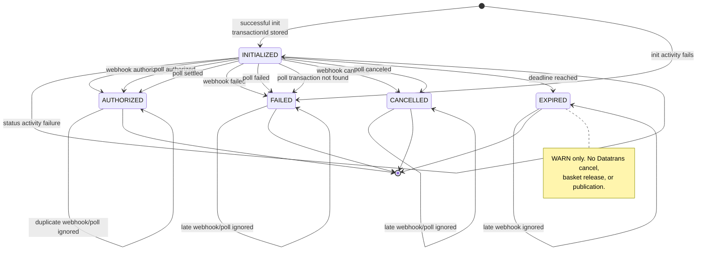

# Design Document

## Overview

This design adds a durable, in-workflow reconciliation poller to the **Datatrans Mobile SDK
Version 4** payment journey. It addresses the failure mode in which Datatrans completes a native
payment but the server-to-server webhook is delayed or lost. The poller is part of
`MobileSdkPaymentWorkflowImpl.run(...)`; it is not a Spring scheduler, external scanner, or a
second workflow.

After a successful Mobile SDK initialisation produces a non-blank transaction identifier, the
workflow records the Temporal time of that completion. If reconciliation is enabled, it waits two
minutes by default, then reads `GET /v1/transactions/{transactionId}` every 30 seconds until the
payment becomes terminal or the 30-minute reconciliation deadline is reached. A successful
`authorized` or `settled` response uses the existing `authorize(...)` transition path, including
`authorizationInProgress`, publication-before-terminal-state ordering, and the existing
`PaymentActivities.publishAuthorisedPaymentEvent(...)` seam. `canceled`, `failed`, and
`TransactionNotFoundException` become terminal non-authorised outcomes. An in-flight or unknown
status keeps the payment `INITIALIZED` and allows the next poll. Expiry sets `EXPIRED`, logs a
warning, performs no Datatrans cancellation, releases no basket, and completes `run(...)`.

The Secure Fields channel is deliberately out of scope. Its existing workflow and authorisation
path are not changed by this design.

### Design research and findings

The repository and the payment architecture guidance establish the following constraints that
inform the design:

- `TemporalConfig` already registers `MobileSdkPaymentWorkflowImpl` and
  `PaymentActivitiesImpl` on the `payment-workflows` task queue. The new status activity is added to
the existing activity interface and implementation; no second worker or task queue is needed.
- `InfrastructureBeanConfig` is the existing construction seam for framework-free domain classes.
  The new reconciliation properties remain infrastructure configuration and are mapped to
  workflow input by `MobileSdkWorkflowAdapter`.
- `DatatransRestAdapter` already uses the configured `RestClient`, Basic Auth, timeout settings,
  and the existing gateway exception conventions. Mobile initialisation is already `/v2`, and
  authorisation is already `/v1/transactions/{transactionId}/authorize`; this design uses the
  confirmed status path `GET /v1/transactions/{transactionId}`.
- The Datatrans API documentation describes transaction endpoints and post-payment status
  retrieval ([API endpoints](https://docs.datatrans.ch/docs/api-endpoints),
  [After the payment](https://docs.datatrans.ch/docs/after-the-payment)). The exact response
  fields for amount, status variants, and the acquirer code remain a sandbox confirmation gate;
  the response mapper is isolated so that fixture changes do not affect workflow logic.
- Temporal timers and workflow time are the only time sources. The workflow uses
  `Workflow.await(Duration, condition)` and `Workflow.currentTimeMillis()`; it never reads the
  JVM wall clock or performs HTTP directly.

## Architecture

### Component diagram

```mermaid
graph TB
    APP[Mobile SDK app]
    WEBHOOK[Datatrans webhook endpoint]
    ADAPTER[MobileSdkWorkflowAdapter]
    PROPS[DatatransReconciliationProperties]
    CMD[InitMobileSdkCommand<br/>+ reconciliation settings]

    subgraph Temporal[Temporal payment-workflows task queue]
        WF[MobileSdkPaymentWorkflowImpl<br/>run / init update / webhook signal]
        ACT[PaymentActivities<br/>status activity + existing publication activity]
        ACTIMPL[PaymentActivitiesImpl]
    end

    PORT[DatatransOutPort]
    REST[DatatransRestAdapter]
    DT[Datatrans<br/>GET /v1/transactions/{id}]
    EVENT[AuthorisedPaymentEvent seam]

    APP --> ADAPTER
    DT --> WEBHOOK
    WEBHOOK --> ADAPTER
    PROPS --> ADAPTER
    ADAPTER --> CMD
    CMD --> WF
    WF --> ACT
    ACT --> ACTIMPL
    ACTIMPL --> PORT
    PORT --> REST
    REST --> DT
    WF --> EVENT
```

`MobileSdkWorkflowAdapter` remains the infrastructure boundary for Temporal client operations.
It injects the typed reconciliation properties and converts `Duration` values to a workflow-safe
input representation. The workflow sees no Spring class and no `DatatransProperties` instance.

### Workflow state diagram



`SETTLED` remains part of the shared `PaymentStatus` model for the broader payment lifecycle, but
it is not produced by this reconciliation process. A Datatrans `settled` status is treated as a
completed authorisation and enters the shared `authorize(...)` path, producing `AUTHORIZED` for
this workflow scope.

### Reconciliation sequence and webhook race

```mermaid
sequenceDiagram
    autonumber
    participant APP as Mobile SDK app
    participant AD as MobileSdkWorkflowAdapter
    participant WF as MobileSdkPaymentWorkflow
    participant TIMER as Temporal timer
    participant ACT as Status_Activity
    participant DT as Datatrans
    participant PUB as publishAuthorisedPaymentEvent

    APP->>AD: initMobileSdkPayment(basketId)
    AD->>WF: Update-With-Start initMobileSdk(command + settings)
    WF->>WF: successful init; store transactionId and initCompletedAt
    AD-->>APP: transactionId

    Note over WF,TIMER: Wait initial delay; no status call while no transactionId,<br/>while terminal, or before the initial delay.
    TIMER-->>WF: initial delay elapsed
    WF->>ACT: getTransactionStatus(transactionId)
    ACT->>DT: GET /v1/transactions/{transactionId} + Basic Auth
    DT-->>ACT: status result or activity failure

    alt webhook arrives while status activity is in flight
        DT->>AD: POST mobile-sdk webhook(status=authorized)
        AD->>WF: webhookReceived(payload) signal
        WF->>WF: shared authorize(payload); guard; publish first
        WF->>PUB: publish once
        PUB-->>WF: success
        WF->>WF: set AUTHORIZED
        ACT-->>WF: delayed poll result returns
        WF->>WF: check current status and transactionId
        Note over WF: discard poll result; do not mutate state or publish
    else poll returns authorized/settled first
        ACT-->>WF: matching authorized result
        WF->>WF: shared authorize(status result); guard; store fields
        WF->>PUB: publish once
        PUB-->>WF: success
        WF->>WF: set AUTHORIZED
    else poll returns non-terminal or failure
        ACT-->>WF: in-flight/unknown or retryable failure
        WF->>TIMER: schedule next fixed poll interval
    end
```

Temporal serializes workflow callbacks on deterministic workflow threads, so this is a logical
interleaving rather than a Java data race. The activity result is still stale if a webhook signal
is applied while the activity is outstanding. The workflow therefore checks both
`paymentStatus == INITIALIZED` and equality between the returned transaction identifier and the
currently stored transaction identifier after every status activity returns, before applying any
result.

## Components and Interfaces

| Component | Layer/type | Design change and responsibility |
|---|---|---|
| `MobileSdkPaymentWorkflow` | Domain workflow interface | Keep `run`, `initMobileSdk`, `webhookReceived`, and query methods. The update command gains optional reconciliation settings without changing the update method name. |
| `MobileSdkPaymentWorkflowImpl` | Domain workflow implementation | Own `initCompletedAtMillis`, reconciliation settings, poll attempt count, fixed timer loop, status classification, stale-result checks, `EXPIRED`, and the shared authorisation transition. No Spring imports. |
| `InitMobileSdkCommand` | Domain input record | Preserve `webhookUrl`; add nullable `MobileSdkReconciliationSettings`. Keep a one-argument source-compatible constructor for existing callers and treat absent settings as legacy/no-poller input. |
| `MobileSdkReconciliationSettings` | Domain value record | Carry `enabled` plus `initialDelayMillis`, `pollIntervalMillis`, and `maxDurationMillis`. Milliseconds avoid relying on a Java `Duration` serializer in the Temporal payload; infrastructure remains responsible for `Duration` binding. |
| `DatatransTransactionStatus` | Domain result record | Carry transaction ID, normalized-at-use status string, currency, authorized amount, acquirer authorization code, and `DatatransCardInfo`/card alias. It is the channel-neutral activity result. |
| `PaymentStatus` | Domain enum | Add `EXPIRED`; all terminal checks used by `run` include `AUTHORIZED`, `FAILED`, `CANCELLED`, and `EXPIRED`. |
| `PaymentActivities` | Domain activity interface | Add `getTransactionStatus(String transactionId)` returning `DatatransTransactionStatus`. Retain `publishAuthorisedPaymentEvent(...)` as the single publication seam. |
| `PaymentActivitiesImpl` | Infrastructure Temporal activity | Delegate `getTransactionStatus` to `DatatransOutPort`. Preserve existing activity bean registration and exception types. Do not log the response body or card object. |
| `DatatransOutPort` | Domain secondary port | Add status retrieval operation accepting a transaction ID and returning `DatatransTransactionStatus`. |
| `DatatransRestAdapter` | Infrastructure REST adapter | Issue Basic Auth `GET /v1/transactions/{transactionId}` using the existing `RestClient`; map responses and errors using the existing exception conventions. |
| `DatatransReconciliationProperties` | Infrastructure configuration | Bind `integrations.datatrans.reconciliation` with `Duration` fields, defaults, enablement, and startup validation with full property keys in messages. |
| `MobileSdkWorkflowAdapter` | Infrastructure Temporal adapter | Inject reconciliation properties, convert them into `MobileSdkReconciliationSettings`, and include them in `InitMobileSdkCommand` for Update-With-Start. |
| `InfrastructureBeanConfig` | Infrastructure Spring configuration | No new domain annotations. Continue constructing framework-free classes; only add a properties bean if the chosen registration style requires it. |
| `TemporalConfig` | Infrastructure Temporal configuration | Keep the existing worker/task queue and workflow registrations. `PaymentActivitiesImpl` automatically exposes the new activity method through the existing registration. |
| `application.yml` | Infrastructure configuration | Add the four environment-backed reconciliation settings with the confirmed defaults. |

### Activity contracts

```java
// Domain secondary port and Temporal activity contract
DatatransTransactionStatus getTransactionStatus(String transactionId);
```

The status activity is the only workflow-to-Datatrans status read. The workflow must never inject or
call `RestClient`, `DatatransRestAdapter`, or a secondary port directly.

The status activity uses a dedicated activity stub/options configuration rather than changing the
existing 30-second options used by initialization and publication activities:

- start-to-close timeout: **5 seconds** per attempt;
- maximum attempts: **2**;
- retry interval/backoff: **1 second**, fixed (`backoffCoefficient = 1.0`);
- `TransactionNotFoundException`: do not retry; it is immediately classified as `FAILED`;
- retryable `ServiceUnavailableException` and `DatatransGatewayException`: retry within the
  activity, then return control to the workflow loop.

The worst-case planned status activity budget is approximately 5 seconds + 1-second backoff + 5
seconds = **11 seconds**, below the 30-second poll interval. This prevents consecutive scheduled
polls from overlapping. The workflow nevertheless calculates the next poll time and checks the
deadline after the activity returns, so an unexpected delay cannot cause a poll after expiry.

## Detailed workflow and control-flow design

### Workflow input and initialisation timing

`InitMobileSdkCommand` becomes conceptually:

```java
public record InitMobileSdkCommand(
    String webhookUrl,
    MobileSdkReconciliationSettings reconciliation
) {
  public InitMobileSdkCommand(String webhookUrl) {
    this(webhookUrl, null);
  }
}

public record MobileSdkReconciliationSettings(
    boolean enabled,
    long initialDelayMillis,
    long pollIntervalMillis,
    long maxDurationMillis
) {}
```

The adapter converts the infrastructure `Duration` values to milliseconds before creating the
command. The workflow validates that supplied values are positive and that max duration is at
least the initial delay as a defensive check; invalid infrastructure configuration should already
have failed application startup.

In `initMobileSdk(...)`:

1. Retain the existing initialization-in-progress guard and idempotent transaction handling.
2. For a new transaction, perform the existing reservation, payment-method, amount, and Datatrans
   init activities.
3. Reject a blank transaction ID as an initialization failure; do not activate reconciliation.
4. Store the transaction ID and init result.
5. Immediately after the successful transaction activity completes, set
   `initCompletedAtMillis = Workflow.currentTimeMillis()` and persist the reconciliation settings
   in workflow fields. This timestamp is the beginning of both the initial delay and the maximum
   duration.
6. On an idempotent re-init where a transaction already exists, return the stored result. If the
   workflow is a pre-feature execution with no settings and a later explicit init update carries
   settings, attach those settings without reinitialising Datatrans. This is the controlled opt-in
   migration path for an already-open execution; it is not an automatic change to old workflows.

A null settings object means legacy/no-poller behavior. New adapters always send a non-null object,
including `enabled=false`, so disabled reconciliation is distinguishable from an old history.

### `run(...)` control flow

The following pseudocode is intentionally concrete; names can be adapted to the final Java style.
The `awaitFor` helper uses `Workflow.await(Duration, condition)` and returns whether the condition
was satisfied before the timeout.

```text
run(basketId):
    changeVersion = Workflow.getVersion(
        "CTECH-12128-mobile-sdk-reconciliation",
        Workflow.DEFAULT_VERSION,
        1)

    await until:
        paymentStatus is terminal
        OR transactionId is non-blank AND initCompletedAtMillis exists
        OR a post-deployment explicit init update supplies settings

    if paymentStatus is terminal:
        return

    if transactionId is blank OR reconciliationSettings is null:
        // Legacy CTECH-12098 execution. Preserve webhook-only behavior.
        await until paymentStatus is terminal
        return

    if reconciliationSettings.enabled is false:
        // No initial delay and no max-duration deadline apply in this branch.
        await until paymentStatus is terminal
        return

    initCompletedAt = initCompletedAtMillis
    deadline = initCompletedAt + maxDurationMillis
    firstPollAt = initCompletedAt + initialDelayMillis
    nextPollAt = firstPollAt

    while paymentStatus == INITIALIZED:
        now = Workflow.currentTimeMillis()
        if now >= deadline:
            expireIfStillInitialized()
            return

        waitMillis = max(0, nextPollAt - now)
        if waitMillis > 0:
            awaitFor(waitMillis, condition = paymentStatus is terminal)
            if paymentStatus is terminal:
                return

        now = Workflow.currentTimeMillis()
        if paymentStatus is terminal:
            return
        if now >= deadline:
            expireIfStillInitialized()
            return
        if transactionId is blank:
            // Defensive invariant: never call the activity without an ID.
            await until paymentStatus is terminal OR transactionId is present
            continue

        pollAttemptCount += 1
        pollTransactionId = transactionId
        log.info("Mobile SDK reconciliation poll [basketId={}, transactionId={}, attempt={}]",
                 basketId, pollTransactionId, pollAttemptCount)

        try:
            result = statusActivities.getTransactionStatus(pollTransactionId)
        catch ActivityFailure as failure:
            if failure represents TransactionNotFoundException:
                paymentStatus = FAILED
                return
            log.warn("Mobile SDK reconciliation poll failed [transactionId={}, type={}]",
                     pollTransactionId, failure type)
            // ServiceUnavailable, DatatransGateway, and unexpected activity failures are
            // handled as this poll's failure; run(...) is not failed.
            nextPollAt = nextPollAt + pollIntervalMillis
            continue

        // This check is mandatory after the activity yields to Temporal. A webhook signal may
        // have transitioned the workflow while the external read was in flight.
        if paymentStatus != INITIALIZED:
            log.info("Discarding stale reconciliation result [basketId={}, transactionId={}]",
                     basketId, pollTransactionId)
            return
        if result is null OR result.transactionId != transactionId:
            log.warn("Discarding reconciliation transaction mismatch [basketId={}, expected={}, received={}]",
                     basketId, transactionId, result == null ? null : result.transactionId)
            nextPollAt = nextPollAt + pollIntervalMillis
            continue

        outcome = classify(result.status)
        switch outcome:
            case AUTHORIZED, SETTLED:
                authorize(result)          // the only authorisation transition path
                return                     // authorize sets terminal state after publication
            case CANCELLED:
                paymentStatus = CANCELLED
                return
            case FAILED:
                paymentStatus = FAILED
                return
            case IN_FLIGHT, UNKNOWN:
                log.info("Mobile SDK reconciliation result [status={}, paymentStatus={}]",
                         result.status, paymentStatus)
                nextPollAt = nextPollAt + pollIntervalMillis

    // A signal can make the loop terminal while the activity/timer is yielding.
    return
```

`expireIfStillInitialized()` performs only:

```text
if paymentStatus == INITIALIZED:
    paymentStatus = EXPIRED
    log.warn("Mobile SDK reconciliation expired [basketId={}, transactionId={}, attempts={}]",
             basketId, transactionId, pollAttemptCount)
```

It does not call Datatrans cancel, release the basket, publish an authorisation event, or throw a
workflow failure. If a webhook or terminal poll outcome wins immediately before expiry, the
current-state check prevents `EXPIRED` from overwriting that outcome.

### Status classification

Status values are normalized with trim and locale-independent lowercase. The classifier is pure
workflow logic:

| Datatrans status | Workflow outcome |
|---|---|
| `authorized` | `authorize(statusResult)` |
| `settled` | `authorize(statusResult)` because settlement implies completed authorisation |
| `canceled` | `CANCELLED` |
| `failed` | `FAILED` |
| Confirmed in-flight values such as `initialized`, `pending`, `processing`, or equivalent sandbox values | Keep `INITIALIZED`; poll again |
| Any other non-blank value | Log the unrecognized value, keep `INITIALIZED`, and poll again |

The exact in-flight set and response field paths must be confirmed with a Datatrans sandbox capture
before implementation is merged. Unknown values intentionally fail open to continued
reconciliation rather than incorrectly authorising or failing a payment.

### Shared exactly-once authorisation path

The existing private `authorize(...)` method is generalized to accept a common authorization
outcome value, with small adapters for webhook and status results:

```text
webhookReceived(payload):
    if payload is null OR paymentStatus != INITIALIZED OR authorizationInProgress:
        return
    if stored transactionId does not equal payload.transactionId:
        log mismatch and return
    if normalized status == authorized:
        authorize(AuthorizationOutcome.fromWebhook(payload))
    else if status == canceled:
        paymentStatus = CANCELLED
    else:
        paymentStatus = FAILED

authorize(outcome):
    if paymentStatus != INITIALIZED OR authorizationInProgress:
        return
    authorizationInProgress = true
    try:
        // Set workflow fields needed for the publication arguments, but do not set the
        // terminal status yet.
        cardAlias = outcome.cardAlias
        authorizedAmount = outcome.authorizedAmount
        acquirerAuthorizationCode = outcome.acquirerAuthorizationCode
        currency = outcome.currency if supplied, otherwise stored init currency

        activities.publishAuthorisedPaymentEvent(
            basketId, transactionId, cardAlias, authorizedAmount, currency)

        // Publication must complete before run(...) is released and the execution can finish.
        paymentStatus = AUTHORIZED
    finally:
        authorizationInProgress = false
```

The poll result adapter calls this same method; it must not contain a second copy of the webhook
transition. The guard is set before the publication activity is scheduled and remains set until
that activity returns. Temporal may process a webhook signal while an activity is outstanding, but
the signal handler observes either `authorizationInProgress` or the now-terminal status and does
nothing. If a poll result returns after the webhook has completed, the post-activity status and
transaction-ID checks discard it. If a status result returns first, the later webhook observes
`AUTHORIZED` and is ignored. The workflow-level transition is therefore at most once per execution.

Temporal activity retries are execution attempts of the same activity command, not separate
workflow authorisation transitions. When the publication seam becomes a real Kafka producer, it
must also be idempotent on `(basketId, transactionId)` because no distributed system can guarantee
that a side effect is physically observed exactly once across an activity timeout boundary. The
current no-op activity and the requested workflow tests verify one logical publication invocation
across webhook/poll interleavings.

## Data models and configuration

### Datatrans status result

Add a domain result shaped to the existing `DatatransAuthorizeResponse` where fields overlap:

```java
public record DatatransTransactionStatus(
    String transactionId,
    String status,
    String currency,
    Integer authorizedAmount,
    String acquirerAuthorizationCode,
    DatatransCardInfo card
) {}
```

`DatatransCardInfo` continues to supply `alias` without introducing a second card model. The REST
adapter may deserialize directly into a response record or use a small infrastructure response
record and map to this domain result; the choice must follow the confirmed sandbox JSON. Do not
modify `DatatransAuthorizeResponse` merely to fit an unconfirmed status response, and do not add a
Jackson 2 `ObjectMapper`. Spring Boot 4’s Jackson 3 (`tools.jackson.databind`) and the existing
`RestClient` conversion path are sufficient if custom handling is required.

The response mapper must:

- reject a missing body or null/blank `status` with `DatatransGatewayException`;
- preserve the Datatrans transaction ID for the workflow stale-result check;
- map `card.alias`, authorized amount, currency, and acquirer authorization code;
- keep all unknown gateway fields ignored; and
- never expose or log the card object, masked number, expiry, merchant password, or guest data.

### Typed reconciliation properties

Create `DatatransReconciliationProperties` under `infrastructure/config`, following the existing
`DatatransWebhookProperties`/`DatatransProperties` binding style:

```yaml
integrations:
  datatrans:
    reconciliation:
      initial-delay: ${DATATRANS_RECONCILIATION_INITIAL_DELAY:2m}
      poll-interval: ${DATATRANS_RECONCILIATION_POLL_INTERVAL:30s}
      max-duration: ${DATATRANS_RECONCILIATION_MAX_DURATION:30m}
      enabled: ${DATATRANS_RECONCILIATION_ENABLED:true}
```

The class has `Duration initialDelay`, `Duration pollInterval`, `Duration maxDuration`, and
`boolean enabled` fields. It is a Spring configuration bean, not a domain dependency. Startup
validation must run after binding and before the application is usable:

- `integrations.datatrans.reconciliation.initial-delay` must be positive;
- `integrations.datatrans.reconciliation.poll-interval` must be positive;
- `integrations.datatrans.reconciliation.max-duration` must be positive; and
- `integrations.datatrans.reconciliation.max-duration` must be greater than or equal to
  `integrations.datatrans.reconciliation.initial-delay`.

Use typed binding plus explicit validation (Bean Validation annotations where sufficient and a
cross-field validator for the ordering rule). Validation exceptions must include the complete
configuration key, for example
`integrations.datatrans.reconciliation.max-duration must be >= integrations.datatrans.reconciliation.initial-delay`.
A zero/negative or ordering violation therefore fails startup rather than producing an invalid
workflow timer.

`MobileSdkWorkflowAdapter` maps the properties to `MobileSdkReconciliationSettings` and includes
them in `InitMobileSdkCommand`. The workflow receives primitive timing input and remains free of
Spring annotations, `Duration` property beans, and environment lookups. The `enabled=false` branch
is explicit: it awaits the webhook indefinitely, performs no status activity, and does not apply
the max-duration deadline.

## Error handling and observability

### REST and activity errors

| Condition | Adapter result | Workflow effect |
|---|---|---|
| 2xx with absent body or blank status | `DatatransGatewayException` | Log WARN for the failed poll; keep `INITIALIZED`; next fixed poll |
| HTTP 404 | `TransactionNotFoundException` | Do not retry the activity; set `FAILED`; stop polling |
| Other HTTP error | `DatatransGatewayException` carrying status | Retry within the 5s/2-attempt activity budget, then keep `INITIALIZED` and continue |
| Host unreachable/read timeout | `ServiceUnavailableException` | Retry within the activity budget, then keep `INITIALIZED` and continue |
| Unknown/unexpected activity failure | Logged WARN and treated as failed poll | Keep `INITIALIZED` and continue until terminal/deadline; `run(...)` is not failed by a poll error |
| Matching `authorized` or `settled` result | Domain status result | Shared `authorize(...)`; publication before `AUTHORIZED` |
| Matching `canceled`/`failed` result | Domain status result | `CANCELLED`/`FAILED`; stop polling |
| Transaction ID mismatch | Domain result discarded | Status and authorisation fields unchanged; WARN mismatch log |
| Deadline while `INITIALIZED` | No external call | `EXPIRED`; WARN only; complete `run(...)` |

`DatatransRestAdapter` uses the existing configured `datatransRestClient` and Basic Auth with
`DatatransProperties.merchantId` and `merchantPassword`. The new status adapter must not log
`ErrorBodyReader.read(response)` because the response can include a card object. It logs only safe
HTTP status and transaction correlation data, never the password or raw response body.

### Workflow logging

All reconciliation workflow logs use `Workflow.getLogger(MobileSdkPaymentWorkflowImpl.class)`:

- INFO when a poll starts: `basketId`, `transactionId`, and attempt number;
- INFO when a result is classified: gateway status and resulting `PaymentStatus`;
- WARN on a poll failure: safe failure type and transaction ID;
- WARN on expiry: basket ID, transaction ID, and total poll attempts;
- WARN on transaction mismatch or unknown status; and
- no card alias, masked PAN, expiry, CVV, card object, merchant password, or guest PII.

The activity implementation follows the same exclusion rule. Workflow logging through Temporal’s
logger prevents replay from emitting duplicate production logs. Identifiers are logged only where
already permitted by the requirements; no payment data is added to log messages.

## Correctness Properties

A property is a characteristic or behavior that should hold true across all valid executions of a
system—essentially, a formal statement about what the system should do. Properties serve as the
bridge between human-readable specifications and machine-verifiable correctness guarantees.

### Property 1: Polling never precedes a valid initialisation window

For any valid reconciliation settings and any workflow execution that has not completed a
successful Mobile SDK initialisation, or whose initial delay has not elapsed, the workflow SHALL
perform zero status-activity calls; a terminal webhook before the delay SHALL also prevent the next
poll.

**Validates: Requirements 1.1, 1.2, 1.3, 1.5, 1.6, 9.1**

### Property 2: Polling follows a fixed cadence and bounded deadline

For any valid positive initial delay, poll interval, and max duration where max duration is at least
the initial delay, a non-terminal workflow SHALL issue status polls only at the configured fixed
cadence and SHALL issue no poll at or after the reconciliation deadline, transitioning to
`EXPIRED` when still `INITIALIZED`.

**Validates: Requirements 1.4, 5.2, 7.3, 9.4**

### Property 3: Authorisation is path-independent and idempotent

For any matching transaction and any sequence of equivalent authorized/settled webhook and poll
outcomes, applying the outcomes through either path SHALL produce the same stored authorisation
state and SHALL invoke `publishAuthorisedPaymentEvent` at most once.

**Validates: Requirements 3.1, 3.2, 3.3, 3.4, 3.5, 3.6, 3.7, 4.3**

### Property 4: Stale or mismatched poll results cannot mutate workflow state

For any status result returned after the workflow is no longer `INITIALIZED`, or whose transaction
identifier differs from the identifier held in workflow state, the workflow SHALL leave
`PaymentStatus`, stored authorisation data, and publication count unchanged.

**Validates: Requirements 3.8, 7.6**

### Property 5: Status classification preserves the intended terminal semantics

For any matching status result, `authorized` and `settled` SHALL use the shared authorisation path,
`canceled` SHALL produce `CANCELLED`, `failed` SHALL produce `FAILED`, and any in-flight or unknown
status SHALL preserve `INITIALIZED` and permit another poll.

**Validates: Requirements 4.1, 4.2, 4.3, 4.4, 4.5, 4.6**

### Property 6: Expiry is terminal and has no authorisation side effect

For any sequence of non-terminal status results or retryable poll failures that reaches the
configured deadline while `INITIALIZED`, the workflow SHALL set `EXPIRED`, complete `run(...)`
without failure, invoke publication zero times, and ignore all later webhook outcomes.

**Validates: Requirements 5.2, 5.3, 5.4, 5.6, 7.1, 7.2, 7.5**

### Property 7: Poll failures are contained within reconciliation

For any sequence of `ServiceUnavailableException`, `DatatransGatewayException`, or unexpected
status-activity failures, the workflow SHALL keep `INITIALIZED`, schedule the next fixed poll when
the deadline has not been reached, and never propagate the poll failure out of `run(...)`.

**Validates: Requirements 7.1, 7.2, 7.3, 7.5**

### Property reflection

The prework identified several overlapping candidates. The initial-delay/no-transaction/terminal
checks are consolidated into Property 1; the fixed cadence and deadline candidates are combined in
Property 2; all webhook/poll authorization ordering and shared-path candidates are combined in
Property 3; and expiry/no-publication/late-webhook behavior is consolidated in Property 6. The
remaining properties provide unique coverage for stale results, status classification, and failure
containment. HTTP method/authentication, Spring binding, logging, worker registration, coverage,
and Checkstyle are intentionally not represented as PBT properties because they are integration,
example, or smoke concerns.

Property tests will use **jqwik**, already present in the backend testing ecosystem, with a minimum
of 100 tries per property. Each implementation will contain one property-based test for the
corresponding design property and a tag comment in the required form:

```text
Feature: CTECH-12128-webhook-backup-process, Property N: <property text>
```

Temporal time-skipping and external adapter tests remain complementary example/integration tests;
PBT will use controllable activity doubles or a pure status/transition model rather than making
100 real Datatrans calls.

## Temporal determinism, idempotency, and versioning strategy

### Determinism

- All waits are Temporal timers through `Workflow.await(Duration, condition)`; no
  `System.currentTimeMillis`, `Instant.now`, `Thread.sleep`, executors, futures, or blocking HTTP
  occurs in workflow code.
- `Workflow.currentTimeMillis()` is used only for deterministic elapsed-time calculations.
- Datatrans status retrieval is always an activity invocation.
- Poll attempt count, transaction ID, init completion time, reconciliation settings, payment status,
  and authorisation fields are workflow instance fields and therefore replay from history.
- The next poll is based on a deterministic scheduled timestamp (`nextPollAt`), not on an
  activity-completion wall-clock measurement. Because the activity budget is below the interval,
  calls do not overlap; if a delay exceeds the interval, the loop skips missed slots rather than
  issuing a burst of calls.

### Exactly-once and retry semantics

The workflow guarantees one logical authorization transition per execution through the current
status check and `authorizationInProgress`. Publication happens before `AUTHORIZED` is written so
`run(...)` cannot complete while publication is pending. Activity retries are bounded and are not
additional workflow transitions; the eventual Kafka implementation must deduplicate by basket and
transaction identifiers.

### Deployment and history compatibility

Adding `EXPIRED` to `PaymentStatus` is additive. Existing history values continue to deserialize and
existing query clients can observe the new value after this deployment. No external persisted
payment-status representation is introduced by this feature.

The workflow code uses:

```java
Workflow.getVersion(
    "CTECH-12128-mobile-sdk-reconciliation",
    Workflow.DEFAULT_VERSION,
    1);
```

The rollout rules are:

1. Deploy a worker version that understands both the old webhook-only history and the new polling
   branch before enabling new clients.
2. For a new execution, the version marker is `1` and the new adapter sends the non-null settings
   object. The poller is enabled only when that input says `enabled=true`.
3. For an already-running CTECH-12098 execution whose history has no version marker and whose old
   init payload has no settings, `getVersion` returns `DEFAULT_VERSION`; it remains webhook-only.
   No timer is silently introduced into old history.
4. A later explicit init update carrying reconciliation settings may opt an existing open workflow
   into reconciliation without creating a new Datatrans transaction. The new code reconstructs
   `initCompletedAtMillis` at the original activity-completion point during replay, so the original
   deadline remains authoritative. If no explicit update is made, the old execution keeps its
   previous behavior and is handled by normal operational retention/cleanup.
5. Do not remove the default-version branch until all pre-feature executions have completed or a
   separately approved migration has run. Never change the version marker or silently reinterpret a
   missing settings field as enabled.
6. If the workflow interface or payload shape later requires a non-optional change, introduce a
   new update name/version rather than changing the meaning of the existing update payload.

This strategy avoids replaying a pre-feature history with newly scheduled timers while still
providing a controlled path for operators to opt in an abandoned open execution.

## Testing strategy

Testing is divided into workflow unit/property tests, adapter integration tests, and Spring/build
smoke tests. The existing `TestWorkflowExtension` and activity stub conventions in the service are
retained.

### Temporal workflow tests

Use `TestWorkflowExtension`/`TestWorkflowEnvironment` with a controllable `PaymentActivities`
double and virtual time; do not wait 30 real minutes.

| Test | Verification |
|---|---|
| No poll before delay | Initialise successfully, advance virtual time to just before two minutes, send an authorized webhook, and assert zero status calls. Include the no-init case to prove no blank transaction ID reaches the activity. |
| Authorized poll | Return a matching `authorized` status after the initial delay; assert `AUTHORIZED`, stored outcome fields, one publication, and completed `run(...)`. |
| Settled poll | Return `settled`; assert it uses the same publication arguments and terminal path as `authorized`. |
| Webhook wins before first poll | Send a terminal webhook before the initial delay; advance beyond the delay and assert zero status calls. |
| Fixed interval | Return in-flight statuses and advance virtual time across multiple slots; assert one call per configured interval, no burst, and no call after deadline. |
| Webhook/poll race | Block `getTransactionStatus`, deliver an authorized webhook, allow the activity to return an authorized or conflicting result, and assert one publication, webhook-owned state, and discarded result. Test both orderings. |
| Mismatch | Return a status result with a different transaction ID; assert status, stored authorization data, and publication count are unchanged. |
| Failure resilience | Return `ServiceUnavailableException` and `DatatransGatewayException` through the activity stub; assert the workflow remains initialized and continues polling. Return `TransactionNotFoundException` and assert immediate `FAILED` with no next poll. |
| 30-minute deadline | Configure the production durations or equivalent virtual values, return repeated failures/in-flight statuses, time-skip through the 30-minute deadline, assert `EXPIRED`, successful workflow completion, zero publication, and no external side effect. |
| Late webhook after expiry | Query `EXPIRED`, signal authorized/failed/canceled payloads, and assert the query remains `EXPIRED` and publication remains zero. |
| Disabled configuration | Set `enabled=false`, advance beyond max duration, assert no poll and an open workflow until a webhook arrives. |
| Replay/version behavior | Replay a pre-feature webhook-only history and assert no poll timer is introduced; replay a version-1 history and assert scheduled timers/results reproduce the same state. |

The race tests must use a latch/controllable activity double only at the test boundary. No Java
thread or non-deterministic synchronization is introduced into workflow production code.

### Property-based tests

Use jqwik with at least 100 tries for Properties 1–7. Generate valid duration tuples, transaction
IDs, gateway status values, authorization fields, and sequences of webhook/poll/failure outcomes.
Use mocked activities or a pure transition model for the generated runs; retain the focused Temporal
examples above for actual SDK timer and signal semantics. Every test references its design property
with the required feature/property tag.

### Datatrans adapter tests

Use Datatrans `MockWebServer` fixtures and the service’s real `RestClient` construction:

- assert `GET /v1/transactions/{transactionId}` and the Basic Auth header;
- map a complete authorized/settled response into transaction ID, status, alias, amount, currency,
  and acquirer authorization code;
- verify absent body and blank status map to `DatatransGatewayException`;
- verify HTTP 404 maps to `TransactionNotFoundException`;
- verify representative 4xx/5xx responses map to `DatatransGatewayException` containing the HTTP
  status; and
- shut down/delay the server to verify connection/read failures map to `ServiceUnavailableException`.

Capture adapter logs with sentinel merchant/card values and assert neither the merchant password,
raw response body, nor card object is emitted.

The adapter fixtures must be updated after sandbox confirmation of the exact status response. The
production endpoint remains `/v1/transactions/{transactionId}` unless that confirmation changes the
contract through an explicitly approved design update.

### Spring context and startup validation tests

Add a Spring context test that:

1. binds the four values from `application.yml` and verifies `2m`, `30s`, `30m`, and `true`;
2. verifies environment/property overrides;
3. creates `DatatransReconciliationProperties` and `MobileSdkWorkflowAdapter` with the same
   properties; and
4. verifies the worker registration path exposes `getTransactionStatus` through the existing
   `PaymentActivitiesImpl` registration on `payment-workflows`.

Because a real Temporal server is not required for this test, replace service stubs/worker factory
with test doubles or use a focused `TemporalConfig` test configuration that records workflow and
activity registrations. Keep the normal integration-profile exclusion behavior intact.

Add parameterized startup tests for zero/negative initial delay, poll interval, and max duration,
plus max duration shorter than initial delay. Each failed context must assert that the exception
message contains the offending full property key. This catches the configuration defect class that
unit tests alone cannot detect.

### Quality gates

- Run `./mvnw` from `backend/` for the affected service and dependencies.
- Run the service’s unit/integration tests and the targeted workflow/adapter/Spring test classes.
- Enforce JaCoCo line coverage of at least 80 percent for each new non-excluded class.
- Run `checkstyle:check`; Google Checkstyle warnings are failures.
- Keep configuration, records, exceptions, and other existing Sonar/coverage exclusions aligned
  with the module’s current POM rather than excluding workflow logic.

## Requirements traceability

| Requirements | Design coverage |
|---|---|
| 1.1–1.6 Reconciliation activation | `run(...)` pseudocode, init completion timestamp, timer/state diagram, Properties 1–2, Temporal time-skipping tests. |
| 2.1–2.9 Status retrieval boundary | Components table, `PaymentActivities`/`DatatransOutPort` contracts, REST error table, MockWebServer tests, Spring activity registration test. |
| 3.1–3.8 Authorised reconciliation and races | Shared `authorize(...)` pseudocode, in-flight result checks, `authorizationInProgress`, Properties 3–4, webhook/poll race tests. |
| 4.1–4.6 Non-authorised outcomes | Status classifier table, terminal state diagram, Property 5, status/error workflow tests. |
| 5.1–5.6 Deadline and expiry | `EXPIRED` state, `expireIfStillInitialized`, no-side-effect rule, Property 6, 30-minute time-skipping and late-webhook tests. |
| 6.1–6.9 Externalised timing configuration | YAML snippet, typed `Duration` properties, startup validation, command mapping, disabled branch, Spring binding/validation tests. |
| 7.1–7.6 Polling resilience | Dedicated 5s/2-attempt activity options and 11s budget, failure handling pseudocode, stale-result sequence, failure/race tests. |
| 8.1–8.7 Observability without sensitive data | Workflow logger rules, adapter logging restrictions, error handling table, log-capture/static checks. |
| 9.1–9.5 Determinism and replay safety | Temporal timer/time rules, workflow fields, fixed schedule, activity-only HTTP, version/replay strategy, replay tests. |
| 10.1–10.9 Testing and coverage | Temporal, MockWebServer, Spring context, startup validation, JaCoCo, and Checkstyle strategy above. |

## Implementation boundaries and unresolved confirmation gates

The implementation must remain Mobile SDK-only. It must not add Secure Fields polling, a Datatrans
cancel call, basket release, a Spring scheduler, a new Temporal workflow, or a Jackson 2 mapper.

Before implementation is finalized, obtain a sandbox response capture confirming:

1. whether a v2-initialized transaction is read through the required v1 status endpoint;
2. the exact status values representing in-flight, authorized, settled, canceled, and failed;
3. the JSON paths and numeric types for authorized amount, currency, card alias, and acquirer
authorization code; and
4. that the configured read timeout and the selected status endpoint behave as expected.

These are adapter-contract confirmations only. They do not alter the workflow invariants,
fixed-timer design, exactly-once transition path, expiry behavior, or Temporal versioning strategy.
