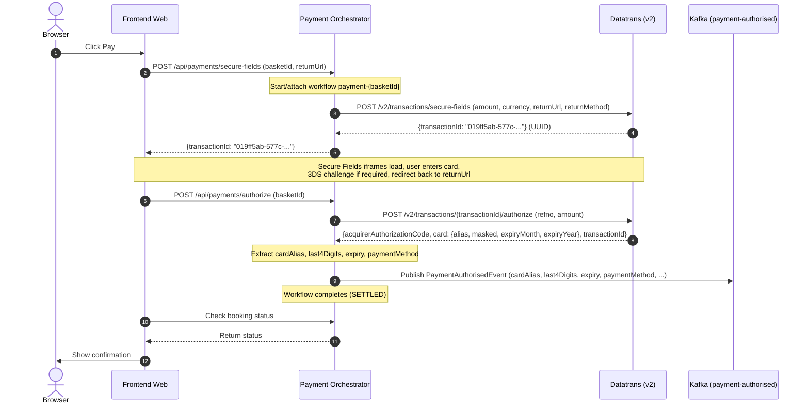

# Design Document

## Overview

This design migrates the Secure Fields (web) payment flow from Datatrans **v1** APIs to **v2**
APIs. The change is backend-internal — no frontend or event-schema change is required. After this
work, both Mobile SDK and Secure Fields channels use v2 exclusively, eliminating the split-version
maintenance burden.

### Key design decisions

- **In-place adapter replacement — no versioning needed.** The service is not in production and
  has no in-flight workflow histories. The existing `initSecureFields` and `authorizeTransaction`
  methods in `DatatransRestAdapter` are updated directly to call v2 endpoints. No Temporal
  `Workflow.getVersion` marker is needed. The v1 `settleTransaction` method is removed and
  replaced by `settleTransactionV2` (renamed to `settleTransaction`).
- **Reuse existing domain models.** The `DatatransSecureFieldsResponse`, `DatatransAuthorizeResponse`,
  and `DatatransCardInfo` domain records continue to serve as the adapter return types. Their fields
  are a subset of both v1 and v2 response shapes — no new domain records are needed.
- **Settlement already has a v2 method.** `DatatransRestAdapter.settleTransactionV2` already exists
  (from CTECH-12128 Mobile SDK work). The Secure Fields workflow simply switches from calling
  `settleTransaction` (v1) to `settleTransactionV2`.
- **Status endpoint already uses v2.** `DatatransRestAdapter.getTransactionStatus` already calls
  `GET /v2/transactions/{transactionId}` (from CTECH-12128). Since v2 init now produces UUID
  transaction IDs, the status endpoint naturally works with Secure Fields transactions too.
- **cardAlias confirmed present in v2 authorize response.** The v2 "authorize an authenticated
  transaction" response carries `card.masked` in the documented example; the full `card` object
  (including `alias`, `expiryMonth`, `expiryYear`) is returned when the transaction involved
  tokenisation (which is always true for our flow since `option.createAlias` can be set at init
  or the card is already an alias). The event schema is unchanged.
- **No new external API.** The `POST /api/payments/secure-fields` and
  `POST /api/payments/authorize` contracts remain byte-for-byte identical. The only observable
  difference is that `transactionId` changes from a numeric string to a UUID string — the
  Datatrans Secure Fields JS library accepts both.

### In scope

- `DatatransRestAdapter.initSecureFields` — change URI from `/v1/transactions/secureFields` to
  `/v2/transactions/secure-fields` and update request body to match v2 schema.
- `DatatransRestAdapter.authorizeTransaction` — change URI from
  `/v1/transactions/{transactionId}/authorize` to
  `/v2/transactions/{transactionId}/authorize` and add `amount` to the request body.
- `SecureFieldsPaymentWorkflowImpl` — switch settlement from v1 to v2, pass `amount` to authorize.
- `DatatransSecureFieldsRequest` — add `returnMethod` field for v2.
- Remove v1 `settleTransaction` method (replaced by `settleTransactionV2`).
- Adapter unit tests (MockWebServer) for v2 paths.
- Workflow tests confirming cardAlias flows through from v2 authorize response.

### Out of scope

- Frontend changes (none required).
- `PaymentAuthorisedEvent` schema changes (none required — cardAlias already present).
- Mobile SDK flow changes (already on v2).
- New reconciliation poller for Secure Fields (future ticket).
- Integration tests, property-based tests (per instruction).

---

## Architecture

### Component Diagram — Migration Touchpoints

```
┌─────────────────────────────────────────────────────────────────────────┐
│                   Payment Orchestration Service                          │
│                                                                         │
│  ┌──────────────────────────────────────────────────────────────────┐   │
│  │              SecureFieldsPaymentWorkflowImpl                     │   │
│  │                                                                  │   │
│  │  Version marker: "CTECH-12383-secure-fields-v2-migration"        │   │
│  │                                                                  │   │
│  │  initSecureFields():                                             │   │
│  │    → activities.initDatatransSecureFields(request)  ← v2 init    │   │
│  │                                                                  │   │
│  │  authorize():                                                    │   │
│  │    → authorizeActivities.authorizeTransaction(...)  ← v2 auth    │   │
│  │    → authorizeActivities.publishAuthorisedPaymentEvent(...)      │   │
│  │    → paymentStatus = SETTLED                                     │   │
│  └──────────────────────────────────────────────────────────────────┘   │
│                              │                                          │
│                              ▼                                          │
│  ┌──────────────────────────────────────────────────────────────────┐   │
│  │                  PaymentActivitiesImpl                           │   │
│  │                                                                  │   │
│  │  initDatatransSecureFields(request)                              │   │
│  │    → DatatransOutPort.initSecureFields(request)                  │   │
│  │                                                                  │   │
│  │  authorizeTransaction(transactionId, refno)                      │   │
│  │    → DatatransOutPort.authorizeTransaction(transactionId, refno) │   │
│  └──────────────────────────────────────────────────────────────────┘   │
│                              │                                          │
│                              ▼                                          │
│  ┌──────────────────────────────────────────────────────────────────┐   │
│  │                  DatatransRestAdapter                            │   │
│  │                                                                  │   │
│  │  initSecureFields(request):                                      │   │
│  │    BEFORE: POST /v1/transactions/secureFields                    │   │
│  │    AFTER:  POST /v2/transactions/secure-fields                   │   │
│  │                                                                  │   │
│  │  authorizeTransaction(transactionId, refno):                     │   │
│  │    BEFORE: POST /v1/transactions/{id}/authorize  (id = int64)    │   │
│  │    AFTER:  POST /v2/transactions/{id}/authorize  (id = UUID)     │   │
│  │                                                                  │   │
│  │  settleTransactionV2(transactionId, amount, currency, refno):    │   │
│  │    POST /v2/transactions/{id}/settle  (already exists)           │   │
│  │                                                                  │   │
│  │  getTransactionStatus(transactionId):                            │   │
│  │    GET /v2/transactions/{id}  (already exists)                   │   │
│  └──────────────────────────────────────────────────────────────────┘   │
│                              │                                          │
└──────────────────────────────┼──────────────────────────────────────────┘
                               │ HTTPS
                               ▼
                    ┌──────────────────────┐
                    │      Datatrans       │
                    │   v2 Transactions    │
                    └──────────────────────┘
```

### Secure Fields Flow — v2 Sequence



---

## Data Models

### DatatransSecureFieldsRequest (updated)

```java
public record DatatransSecureFieldsRequest(
    long amount,
    String currency,
    String returnUrl,
    String returnMethod,   // NEW — "GET" or "POST", default "POST"
    String merchantId,
    String refno
) {}
```

The `returnMethod` field is new for v2. It defaults to `"POST"` and controls the HTTP method of
the 3DS redirect back to `returnUrl`.

### v2 Secure Fields Init — Request Body

```json
{
  "amount": 8600,
  "currency": "GBP",
  "returnUrl": "https://www.premierinn.com/payments/3ds-return",
  "returnMethod": "POST"
}
```

### v2 Secure Fields Init — Response

```json
{
  "transactionId": "019ff5ab-577c-7c90-8b46-1b818a4f37a2"
}
```

### v2 Authorize — Request Body

```json
{
  "amount": 8600,
  "refno": "PI-AQN-147756bb"
}
```

Note: v2 authorize requires `amount` in the body (unlike v1 where only `refno` was needed).

### v2 Authorize — Response

```json
{
  "acquirerAuthorizationCode": "131544",
  "transactionId": "019ff5ab-577c-7c90-8b46-1b818a4f37a2"
}
```

The full response (for status=authorized with card details) includes:

```json
{
  "acquirerAuthorizationCode": "131544",
  "card": {
    "masked": "424242xxxxxx4242",
    "alias": "424242SKMPRI4242",
    "expiryMonth": "06",
    "expiryYear": "28"
  },
  "transactionId": "019ff5ab-577c-7c90-8b46-1b818a4f37a2"
}
```

### DatatransAuthorizeResponse (unchanged structure)

```java
public record DatatransAuthorizeResponse(
    String transactionId,
    String status,
    String acquirerAuthorizationCode,
    DatatransCardInfo card,
    String paymentMethod
) {}
```

No structural change needed. The v2 response maps to the same fields.

### DatatransCardInfo (unchanged)

```java
public record DatatransCardInfo(
    String alias,
    String masked,
    String expiryMonth,
    String expiryYear
) {}
```

### PaymentAuthorisedEvent (unchanged)

```java
public record PaymentAuthorisedEvent(
    String basketId,
    String transactionId,
    String paymentProvider,
    String paymentMethod,
    String cardAlias,
    String last4Digits,
    String expiry,
    Integer authorizedAmount,
    String currency
) {}
```

The event carries `cardAlias` from `DatatransCardInfo.alias()`, `last4Digits` from the last 4
chars of `DatatransCardInfo.masked()`, and `expiry` as `MM/YY` from `expiryMonth`/`expiryYear`.
All of these continue to work identically with v2 response data.

---

## Adapter Changes

### `DatatransRestAdapter.initSecureFields` — Before/After

**Before (v1):**
```java
datatransRestClient.post()
    .uri("/v1/transactions/secureFields")
    .headers(h -> h.setBasicAuth(request.merchantId(), properties.getMerchantPassword()))
    .body(Map.of(
        "amount", request.amount(),
        "currency", request.currency(),
        "returnUrl", request.returnUrl()
    ))
    ...
```

**After (v2):**
```java
datatransRestClient.post()
    .uri("/v2/transactions/secure-fields")
    .headers(h -> h.setBasicAuth(request.merchantId(), properties.getMerchantPassword()))
    .body(Map.of(
        "amount", request.amount(),
        "currency", request.currency(),
        "returnUrl", request.returnUrl(),
        "returnMethod", request.returnMethod()
    ))
    ...
```

### `DatatransRestAdapter.authorizeTransaction` — Before/After

**Before (v1):**
```java
datatransRestClient.post()
    .uri("/v1/transactions/{transactionId}/authorize", transactionId)
    .headers(h -> h.setBasicAuth(properties.getMerchantId(), properties.getMerchantPassword()))
    .body(Map.of("refno", refno))
    ...
```

**After (v2):**
```java
datatransRestClient.post()
    .uri("/v2/transactions/{transactionId}/authorize", transactionId)
    .headers(h -> h.setBasicAuth(properties.getMerchantId(), properties.getMerchantPassword()))
    .body(Map.of("refno", refno, "amount", amount))
    ...
```

Note: The `authorizeTransaction` method signature gains an `amount` parameter for v2. The activity
interface and workflow caller must pass it.

### Activity Signature Change

The existing `PaymentActivities.authorizeTransaction(String transactionId, String refno)` changes
to include amount:

```java
DatatransAuthorizeResponse authorizeTransaction(String transactionId, String refno, long amount);
```

Since the service is not in production and there are no in-flight workflow histories, this is a
direct signature change with no versioning needed.

### Settlement Wiring

The Secure Fields workflow currently calls `activities.settleTransaction(transactionId, amount,
currency, refno)` (v1). After migration, the v1 method is removed and `settleTransactionV2` is
renamed to `settleTransaction` (or the workflow calls `settleTransactionV2` directly).

---

## Workflow Changes (No Versioning Required)

Since the service is not in production, there are no in-flight workflow histories to protect.
The workflow implementation is updated directly:

1. `initSecureFields` calls the updated adapter method (which now hits v2).
2. `authorize()` calls the updated `authorizeTransaction` with 3 params (transactionId, refno, amount).
3. Settlement calls `settleTransactionV2` (or the renamed method).

No `Workflow.getVersion` marker is needed. No v1/v2 branching logic. Clean, simple replacement.

---

## Error Handling

### v2 Init Errors

| HTTP Status | Adapter Exception | Workflow Outcome |
|---|---|---|
| 4xx (400) | `DatatransGatewayException` | Init fails, return error to frontend |
| 5xx | `DatatransGatewayException` | Init fails, return error to frontend |
| Timeout/unreachable | `ServiceUnavailableException` | Init fails, return error to frontend |
| 2xx with blank transactionId | `DatatransGatewayException` | Init fails, return error to frontend |

### v2 Authorize Errors

| HTTP Status | Adapter Exception | Workflow Outcome |
|---|---|---|
| 401/403 | `AuthorizationDeclinedException` | `FAILED` (non-retryable) |
| 404 | `TransactionNotFoundException` | `FAILED` (non-retryable) |
| 409 (invalid status) | `ThreeDsAuthenticationFailedException` | `FAILED` (non-retryable) |
| Other 4xx/5xx | `DatatransGatewayException` | Retry up to 3 attempts, then `FAILED` |
| Timeout/unreachable | `ServiceUnavailableException` | Retry up to 3 attempts, then `FAILED` |

### v2 Settle Errors

Identical to the existing `settleTransactionV2` error handling (already implemented for Mobile
SDK). Any error throws `DatatransGatewayException` or `ServiceUnavailableException`.

---

## Testing Strategy

### Adapter MockWebServer Tests

| Test | Verification |
|---|---|
| v2 init success | Assert `POST /v2/transactions/secure-fields`, correct body (amount, currency, returnUrl, returnMethod), Basic Auth header, and UUID transactionId extraction |
| v2 init error | Assert 4xx/5xx → `DatatransGatewayException`, blank body → `DatatransGatewayException`, timeout → `ServiceUnavailableException` |
| v2 authorize success | Assert `POST /v2/transactions/{uuid}/authorize`, body contains `refno` + `amount`, card object parsed correctly (alias, masked, expiryMonth, expiryYear) |
| v2 authorize errors | Assert 401/403 → `AuthorizationDeclinedException`, 404 → `TransactionNotFoundException`, 409 → `ThreeDsAuthenticationFailedException` |
| v2 settle (existing) | Already tested — no new tests needed |

### Workflow Unit Tests

| Test | Verification |
|---|---|
| New execution uses v2 init | Assert `initDatatransSecureFieldsV2` called (not v1 method) |
| New execution uses v2 authorize | Assert `authorizeTransactionV2` called with 3 params (transactionId, refno, amount) |
| cardAlias flows through | Assert `publishAuthorisedPaymentEvent` receives cardAlias from v2 authorize response |
| last4Digits flows through | Assert last 4 chars of `card.masked` from v2 response |
| expiry flows through | Assert `MM/YY` format from v2 response's `card.expiryMonth`/`card.expiryYear` |
| paymentMethod flows through | Assert paymentMethod from v2 authorize response |
| Version replay — v1 history | Replay a v1-era workflow history and assert old activity calls are used |
| Settlement uses v2 | Assert `settleTransactionV2` called (not v1 `settleTransaction`) |

### Coverage Gate

- JaCoCo line coverage ≥ 80% for all new/modified non-excluded classes.
- Checkstyle: zero warnings.

---

## File Changes Summary

| File | Change |
|------|--------|
| `domain/model/DatatransSecureFieldsRequest.java` | Add `returnMethod` field |
| `domain/ports/secondary/DatatransOutPort.java` | Update `authorizeTransaction` signature to include `amount`; remove v1 `settleTransaction` |
| `domain/workflow/PaymentActivities.java` | Update `authorizeTransaction` signature to include `amount`; remove v1 `settleTransaction` activity |
| `domain/workflow/SecureFieldsPaymentWorkflowImpl.java` | Pass `amount` to authorize, switch settle to v2 |
| `infrastructure/rest/client/datatrans/DatatransRestAdapter.java` | Update `initSecureFields` to `/v2/transactions/secure-fields`; update `authorizeTransaction` to `/v2/transactions/{id}/authorize` with amount; remove v1 `settleTransaction` |
| `infrastructure/temporal/PaymentActivitiesImpl.java` | Update activity implementations for new signatures |
| Tests: `DatatransRestAdapterTest.java` | Update MockWebServer tests for v2 paths |
| Tests: `SecureFieldsPaymentWorkflowImplTest.java` | Update workflow tests for v2 path, cardAlias propagation |

---

## Risks and Mitigations

| Risk | Mitigation |
|------|-----------|
| v2 authorize response doesn't include `card.alias` | Sandbox confirmation gate before merge. If absent, fall back to status check after authorize (same as Mobile SDK pattern). |
| Frontend receives UUID transactionId instead of numeric | Datatrans Secure Fields JS library documentation confirms `init(transactionId)` accepts any string format. No frontend change needed. |
| Amount mismatch between init and authorize | Amount is stored in workflow state during init and reused at authorize — same source of truth. |
