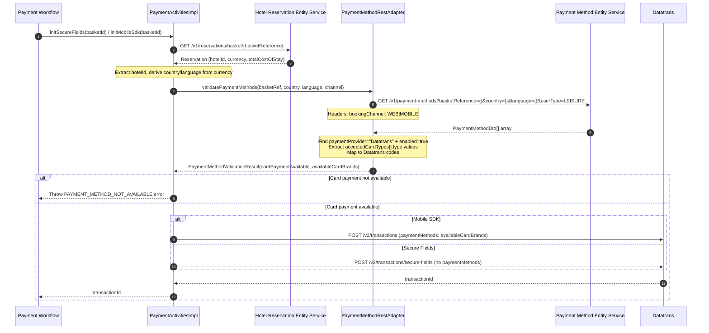

# Design Document

## Overview

This design replaces the stub `PaymentMethodStubAdapter` with a real REST client integration to the **Payment Method Entity Service**. The service validates that card payment is available for a specific hotel and extracts the supported card brand codes before proceeding with Datatrans transaction initialization.

### Key design decisions

- **Consolidate payment method calls.** The existing separate `validatePaymentMethods` and `getPaymentMethods` activities are merged into a single call to the Payment Method Entity Service, reducing network overhead and eliminating duplicate logic.
- **Profile-based adapter selection.** The real adapter is activated via the `pmes-real` profile, allowing the stub to remain available for local development scenarios where the Payment Method Entity Service isn't running.
- **Reuse existing domain models.** The `PaymentMethodValidationResult` record already contains both availability flag and card brands list, so no new domain models are needed.
- **Follow established REST adapter patterns.** The new adapter follows the same structure as `DatatransRestAdapter` with RestClient, error handling, and timeout configuration.
- **Parameter derivation from reservation.** The country/language parameters are derived from the reservation currency (GBP→GB/en, EUR→DE/de) rather than requiring frontend input, simplifying the API surface.

---

## Architecture

### Component Diagram

```
┌─────────────────────────────────────────────────────────────────────────┐
│                   Payment Orchestration Service                          │
│                                                                         │
│  ┌──────────────────────────────────────────────────────────────────┐   │
│  │          SecureFieldsPaymentWorkflowImpl                         │   │
│  │          MobileSdkPaymentWorkflowImpl                           │   │
│  │                                                                  │   │
│  │  After getReservation(basketId):                                │   │
│  │    1. Extract hotelId from reservation                          │   │
│  │    2. Call activities.validatePaymentMethods(hotelId, currency)  │   │
│  │    3. Check result.cardPaymentAvailable → fail if false         │   │
│  │    4. Extract result.availableCardBrands                        │   │
│  │    5. For Mobile SDK: pass brands to Datatrans init             │   │
│  │    6. For Secure Fields: proceed without brands                 │   │
│  └──────────────────────────────────────────────────────────────────┘   │
│                              │                                          │
│                              ▼                                          │
│  ┌──────────────────────────────────────────────────────────────────┐   │
│  │                  PaymentActivitiesImpl                           │   │
│  │                                                                  │   │
│  │  validatePaymentMethods(hotelId, currency):                     │   │
│  │    → PaymentMethodOutPort.validatePaymentMethods(               │   │
│  │         basketReference, country, language, bookingChannel)     │   │
│  │                                                                  │   │
│  │  Consolidates former separate validatePaymentMethods() and      │   │
│  │  getPaymentMethods() activities into single call                │   │
│  └──────────────────────────────────────────────────────────────────┘   │
│                              │                                          │
│                              ▼                                          │
│  ┌──────────────────────────────────────────────────────────────────┐   │
│  │               PaymentMethodRestAdapter                           │   │
│  │                (@Profile("pmes-real"))                          │   │
│  │                                                                  │   │
│  │  validatePaymentMethods(basketReference, country, language,     │   │
│  │                        bookingChannel):                         │   │
│  │    1. Call GET /v1/payment-methods with query params            │   │
│  │    2. Parse JSON response → PaymentMethodDto[]                  │   │
│  │    3. Find entry: paymentProvider="Datatrans" AND enabled=true  │   │
│  │    4. Extract acceptedCardTypes[].type values                   │   │
│  │    5. Map to Datatrans codes (ECA, VIS, AMX, DIN)              │   │
│  │    6. Return PaymentMethodValidationResult(available, brands)    │   │
│  └──────────────────────────────────────────────────────────────────┘   │
│                              │                                          │
│  ┌──────────────────────────────────────────────────────────────────┐   │
│  │            PaymentMethodStubAdapter                              │   │
│  │              (@Profile("!pmes-real"))                           │   │
│  │                                                                  │   │
│  │  validatePaymentMethods(...):                                   │   │
│  │    → return new PaymentMethodValidationResult(true,             │   │
│  │           List.of("VIS", "ECA", "AMX"))                        │   │
│  └──────────────────────────────────────────────────────────────────┘   │
└─────────────────────────────────┼───────────────────────────────────────┘
                                  │ HTTPS
                                  ▼
                       ┌──────────────────────┐
                       │ Payment Method Entity │
                       │      Service         │
                       │  (port 9107)         │
                       └──────────────────────┘
```

### Integration Sequence



---

## Components and Interfaces

### PaymentMethodOutPort (updated interface)

The existing interface signature is updated to accept more parameters needed for the Payment Method Entity Service call:

```java
public interface PaymentMethodOutPort {
  /**
   * Validate that card payment is available for the given hotel and return supported card brands.
   *
   * @param basketReference the basket identifier
   * @param country the country code (e.g. "GB", "DE") 
   * @param language the language code (e.g. "en", "de")
   * @param bookingChannel the booking channel ("WEB" or "MOBILE")
   * @return validation result with card availability and supported brands
   */
  PaymentMethodValidationResult validatePaymentMethods(
      String basketReference, String country, String language, String bookingChannel);
}
```

### PaymentMethodRestAdapter

New REST client adapter implementing the real integration:

```java
@Component
@Profile("pmes-real")
@RequiredArgsConstructor
public class PaymentMethodRestAdapter implements PaymentMethodOutPort {

  @Qualifier("paymentMethodRestClient")
  private final RestClient paymentMethodRestClient;

  @Override
  public PaymentMethodValidationResult validatePaymentMethods(
      String basketReference, String country, String language, String bookingChannel) {
    
    // Call GET /v1/payment-methods with query parameters
    PaymentMethodDto[] response = paymentMethodRestClient.get()
        .uri(uriBuilder -> uriBuilder
            .path("/v1/payment-methods")
            .queryParam("basketReference", basketReference)
            .queryParam("country", country)
            .queryParam("language", language)
            .queryParam("userType", "LEISURE")
            .build())
        .header("bookingChannel", bookingChannel)
        .retrieve()
        .onStatus(HttpStatusCode::isError, (req, res) -> {
          throw new ServiceUnavailableException("Payment Method Entity Service error");
        })
        .body(PaymentMethodDto[].class);

    // Find enabled Datatrans payment method
    Optional<PaymentMethodDto> datatransMethod = Arrays.stream(response)
        .filter(pm -> "Datatrans".equals(pm.paymentProvider()) && pm.enabled())
        .findFirst();

    if (datatransMethod.isEmpty()) {
      return new PaymentMethodValidationResult(false, List.of());
    }

    // Extract and map card types
    List<String> cardBrands = datatransMethod.get().acceptedCardTypes().stream()
        .map(AcceptedCardTypeDto::type)
        .map(this::mapToDatatransCode)
        .filter(Objects::nonNull)
        .distinct()
        .toList();

    return new PaymentMethodValidationResult(true, cardBrands);
  }

  private String mapToDatatransCode(String paymentMethodType) {
    return switch (paymentMethodType) {
      case "ECA" -> "ECA";  // Mastercard
      case "VIS" -> "VIS";  // Visa  
      case "AMX" -> "AMX";  // Amex
      case "DIN" -> "DIN";  // Diners
      // Add other mappings as needed
      default -> null;
    };
  }
}
```

### PaymentMethodStubAdapter (updated)

The stub is updated to match the new interface signature:

```java
@Component
@Profile("!pmes-real")
public class PaymentMethodStubAdapter implements PaymentMethodOutPort {

  @Override
  public PaymentMethodValidationResult validatePaymentMethods(
      String basketReference, String country, String language, String bookingChannel) {
    log.info("Stub: validatePaymentMethods called for basketReference={}, country={}, channel={}",
        basketReference, country, bookingChannel);
    return new PaymentMethodValidationResult(true, List.of("VIS", "ECA", "AMX"));
  }
}
```

---

## Data Models

### PaymentMethodDto (external API response model)

```java
public record PaymentMethodDto(
    String paymentProvider,    // "3CP" | "Datatrans"
    boolean enabled,
    List<AcceptedCardTypeDto> acceptedCardTypes
) {}

public record AcceptedCardTypeDto(
    String type    // "ECA" | "VIS" | "AMX" | "DIN" | etc.
) {}
```

### PaymentMethodValidationResult (existing domain model, unchanged)

```java
public record PaymentMethodValidationResult(
    boolean cardPaymentAvailable,
    List<String> availableCardBrands
) {}
```

---

## API Contracts

### GET `/v1/payment-methods` (Payment Method Entity Service)

**Query Parameters:**

| Parameter | Type | Required | Example | Description |
|-----------|------|----------|---------|-------------|
| `basketReference` | string | Yes | `"AQN-147756bb-bb71-4842-959a-2efe87e378ed"` | Basket identifier |
| `country` | string | Yes | `"GB"` | Country code (derived from currency) |
| `language` | string | Yes | `"en"` | Language code (derived from currency) |
| `userType` | string | No | `"LEISURE"` | User type (defaults to LEISURE) |

**Headers:**

| Header | Type | Required | Example | Description |
|--------|------|----------|---------|-------------|
| `bookingChannel` | string | No | `"WEB"` | Booking channel ("WEB" or "MOBILE") |

**Response:** `200 OK`

```json
[
  {
    "paymentProvider": "Datatrans",
    "enabled": true,
    "acceptedCardTypes": [
      {"type": "VIS"},
      {"type": "ECA"}, 
      {"type": "AMX"}
    ]
  },
  {
    "paymentProvider": "3CP",
    "enabled": false,
    "acceptedCardTypes": []
  }
]
```

**Currency-to-Country/Language Mapping:**

| Currency | Country | Language |
|----------|---------|----------|
| `GBP` | `GB` | `en` |
| `EUR` | `DE` | `de` |

---

## Error Handling

### Payment Method Entity Service Errors

| HTTP Status | Adapter Exception | Workflow Outcome |
|-------------|------------------|------------------|
| 4xx (400-499) | `ServiceUnavailableException` | Init fails with error code `SERVICE_UNAVAILABLE` |
| 5xx (500-599) | `ServiceUnavailableException` | Init fails with error code `SERVICE_UNAVAILABLE` |
| Timeout/unreachable | `ServiceUnavailableException` | Init fails with error code `SERVICE_UNAVAILABLE` |
| 2xx with no Datatrans method | Return `PaymentMethodValidationResult(false, [])` | Init fails with error code `PAYMENT_METHOD_NOT_AVAILABLE` |
| 2xx with Datatrans disabled | Return `PaymentMethodValidationResult(false, [])` | Init fails with error code `PAYMENT_METHOD_NOT_AVAILABLE` |

### Workflow Error Responses

When payment method validation returns `cardPaymentAvailable = false`, the workflow returns:

```json
{
  "error": {
    "code": "PAYMENT_METHOD_NOT_AVAILABLE", 
    "message": "Card payment is not available for this hotel"
  }
}
```

HTTP Status: `422 Unprocessable Entity`

---

## Configuration

### PaymentMethodProperties

```java
@ConfigurationProperties(prefix = "integrations.payment-method-service")
@Validated
public class PaymentMethodProperties {
  private String baseUrl = "http://localhost:9107";
  
  @PositiveDuration
  private Duration connectTimeout = Duration.ofSeconds(5);
  
  @PositiveDuration  
  private Duration readTimeout = Duration.ofSeconds(10);
  
  // getters...
}
```

### Application Configuration

```yaml
integrations:
  payment-method-service:
    base-url: http://localhost:9107
    connect-timeout: 5s
    read-timeout: 10s
```

### RestClient Bean Configuration

Added to `InfrastructureBeanConfig`:

```java
@Bean(name = "paymentMethodRestClient")
public RestClient paymentMethodRestClient(RestClient.Builder builder,
    PaymentMethodProperties properties) {
  return restClient(builder, properties.getBaseUrl(),
      properties.getConnectTimeout(), properties.getReadTimeout());
}
```

---

## Workflow Integration Changes

### Activity Signature Update

The `PaymentActivities` interface is updated to consolidate the payment method activities:

```java
// REMOVE these separate activities:
// PaymentMethodValidationResult validatePaymentMethods(String hotelId);
// List<String> getPaymentMethods(String hotelId);

// REPLACE with single consolidated activity:
/**
 * Validate payment methods and get available card brands for a hotel.
 *
 * @param basketReference the basket identifier
 * @param hotelId the hotel identifier (for logging/tracing)
 * @param currency the reservation currency (used to derive country/language)
 * @param bookingChannel the booking channel ("WEB" or "MOBILE")
 * @return validation result with availability and card brands
 */
PaymentMethodValidationResult validatePaymentMethods(
    String basketReference, String hotelId, String currency, String bookingChannel);
```

### Workflow Implementation Changes

Both `SecureFieldsPaymentWorkflowImpl` and `MobileSdkPaymentWorkflowImpl` are updated to:

1. Call the consolidated `validatePaymentMethods` activity after getting the reservation
2. Check `result.cardPaymentAvailable()` and fail if false
3. For Mobile SDK: pass `result.availableCardBrands()` to Datatrans init
4. For Secure Fields: proceed without passing card brands (endpoint doesn't support them)

**Before:**
```java
// Separate calls
PaymentMethodValidationResult validation = activities.validatePaymentMethods(hotelId);
List<String> paymentMethods = activities.getPaymentMethods(hotelId);

if (!validation.cardPaymentAvailable()) {
  // fail
}
```

**After:**
```java
// Single consolidated call
String country = currencyToCountry(reservation.currency());
String language = currencyToLanguage(reservation.currency()); 
PaymentMethodValidationResult validation = activities.validatePaymentMethods(
    basketId, reservation.hotelId(), reservation.currency(), "WEB"); // or "MOBILE"

if (!validation.cardPaymentAvailable()) {
  // fail with PAYMENT_METHOD_NOT_AVAILABLE
}

List<String> cardBrands = validation.availableCardBrands();
// Use cardBrands for Mobile SDK Datatrans init
```

---

## Testing Strategy

### Adapter MockWebServer Tests

| Test | Verification |
|------|-------------|
| Successful validation | Mock 200 response with enabled Datatrans method, assert correct URI, query params, headers, and returned result |
| No Datatrans method | Mock 200 response with no Datatrans entry, assert `PaymentMethodValidationResult(false, [])` |
| Datatrans disabled | Mock 200 response with Datatrans `enabled: false`, assert `PaymentMethodValidationResult(false, [])` |
| Service error | Mock 500 response, assert `ServiceUnavailableException` |
| Service unreachable | Mock timeout, assert `ServiceUnavailableException` |
| Card type mapping | Assert ECA→ECA, VIS→VIS, AMX→AMX, DIN→DIN, unknown→filtered out |

### Workflow Unit Tests

| Test | Verification |
|------|-------------|
| Payment method check gates init | Assert payment method validation called before Datatrans init |
| Unavailable payment method fails workflow | Mock `cardPaymentAvailable: false`, assert workflow returns `PAYMENT_METHOD_NOT_AVAILABLE` |
| Mobile SDK passes card brands | Assert card brands from validation result passed to Datatrans Mobile SDK init |
| Secure Fields doesn't pass card brands | Assert Secure Fields init doesn't include paymentMethods parameter |
| Currency mapping | Assert GBP→GB/en, EUR→DE/de parameter derivation |

### Coverage Goals

- JaCoCo line coverage ≥ 80% for all new/modified classes
- All new adapter methods covered by MockWebServer tests
- All workflow integration points covered by unit tests

---

## Migration Notes

- The stub adapter remains available via profile for local development
- Both workflows are updated simultaneously to maintain consistency
- The `PaymentMethodValidationResult` domain model is reused without changes
- Configuration follows existing patterns established by other service integrations
- Error handling is consistent with existing adapter implementations
