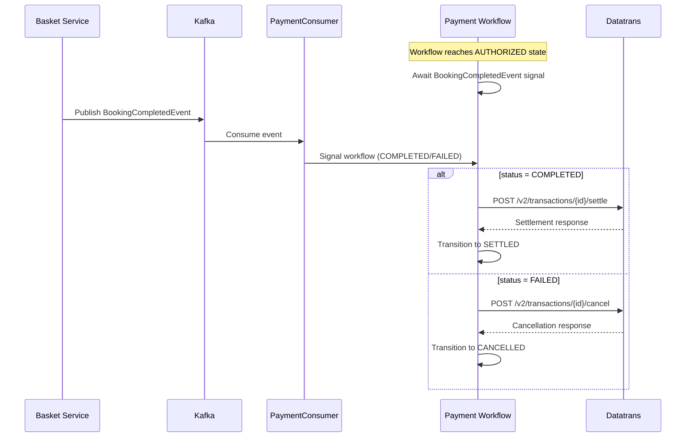

# Design Document

## Overview
This design implements deferred payment settlement by consuming BookingCompletedEvents from Kafka. The current immediate settlement (after PaymentAuthorisedEvent) changes to conditional settlement based on downstream booking confirmation success or failure. The Kafka consumer signals Temporal workflows which then settle or cancel payments accordingly.

## Architecture

### Settlement Flow Changes

**Current Flow:**
```
Payment Workflow: INITIALIZED → AUTHORIZED → (settle immediately) → SETTLED
```

**New Flow:**
```
Payment Workflow: INITIALIZED → AUTHORIZED → (await BookingCompletedEvent) → SETTLED/CANCELLED/FAILED
Kafka Consumer: BookingCompletedEvent → signal workflow → settlement/cancellation
```

### Component Interaction



## Components and Interfaces

### New Components

#### BookingCompletedEventConsumer
```java
@Component
@KafkaListener(topics = "${payment.events.topics.booking-completed}")
public class BookingCompletedEventConsumer {
    public void handleBookingCompleted(BookingCompletedEvent event);
}
```

#### BookingCompletedEvent (Domain Model)
```java
public record BookingCompletedEvent(
    String basketReference,
    String status  // "COMPLETED" or "FAILED"
) {}
```

#### PaymentWorkflowSignaler (Infrastructure)
```java
@Component 
public class PaymentWorkflowSignaler {
    public void signalBookingCompleted(String basketId, BookingCompletedEvent event);
}
```

### Updated Interfaces

#### PaymentActivities (Domain)
```java
@ActivityMethod
void cancelTransaction(String transactionId, String merchantId);
```

#### DatatransOutPort (Domain)
```java
void cancelTransaction(String transactionId, String merchantId);
```

#### Payment Workflows (Domain)
Both `SecureFieldsPaymentWorkflow` and `MobileSdkPaymentWorkflow` gain:
```java
@SignalMethod
void bookingCompleted(BookingCompletedEvent event);
```

## Data Models

### BookingCompletedEvent Schema
```json
{
  "basketReference": "AQN-147756bb-bb71-4842-959a-2efe87e378ed",
  "status": "COMPLETED"  // or "FAILED"
}
```

### Workflow State Transitions
- `AUTHORIZED` → `SETTLED` (on successful settlement after COMPLETED event)
- `AUTHORIZED` → `CANCELLED` (on successful cancellation after FAILED event)  
- `AUTHORIZED` → `FAILED` (on settlement/cancellation errors)

## API Contracts

### Datatrans Cancellation API
**Endpoint:** `POST /v2/transactions/{transactionId}/cancel`
**Authentication:** HTTP Basic Auth (merchantId:password)
**Request Body:** Empty
**Success Response:** `204 No Content`
**Error Responses:** 
- `404 Not Found` - Transaction not found or already settled
- `400 Bad Request` - Transaction cannot be cancelled (wrong state)

## Error Handling

### Consumer Error Scenarios
1. **Invalid JSON**: Log error, skip message, continue processing
2. **Workflow not found**: Log warning (payment may have already completed), continue
3. **Unknown status**: Treat as FAILED and cancel payment
4. **Datatrans API errors**: Log error, transition workflow to FAILED

### Workflow Error Scenarios  
1. **Settlement failure**: Retry via Temporal activity retry policy, eventually transition to FAILED
2. **Cancellation failure**: Log error, transition to FAILED (payment remains authorized)
3. **Duplicate signals**: Idempotent - ignore if already in terminal state

## Testing Strategy

### Unit Tests
- `BookingCompletedEventConsumerTest`: Message deserialization, workflow signaling
- `PaymentWorkflowSignalerTest`: Temporal client interaction, error handling
- `SecureFieldsPaymentWorkflowImplTest`: Signal handling, state transitions
- `MobileSdkPaymentWorkflowImplTest`: Signal handling, state transitions
- `DatatransAdapterTest`: Cancel API integration, error mapping

### Temporal Workflow Tests
- Test signal handling in different workflow states
- Test settlement vs cancellation paths
- Test error scenarios and state transitions
- Use `TestWorkflowRule` for deterministic workflow testing

## Configuration Changes

### application.yml Updates
```yaml
spring:
  kafka:
    consumer:
      group-id: payment-orchestration-service
      enable-auto-commit: true
      auto-commit-interval: 1000ms

payment:
  events:
    topics:
      booking-completed: ${BOOKING_COMPLETED_TOPIC:booking-completed}

integrations:
  datatrans:
    merchant-id:
      provisioned-hotels:
        - HARHOR
        - GRESOU  
        - HAVFOR  # New hotel added
```

### Temporal Configuration
No changes required - existing workflow client handles signaling.

## Migration Considerations

### Backwards Compatibility
- Existing workflows in AUTHORIZED state will timeout waiting for signals
- Deploy includes migration script to signal existing workflows with synthetic COMPLETED events
- Feature flag to enable/disable new settlement behavior during rollout

### Rollback Plan
- Revert to immediate settlement by disabling Kafka consumer
- Update workflows to settle immediately after PaymentAuthorisedEvent again
- No data corruption risk - payments remain in safe AUTHORIZED state

## Performance Impact

### Kafka Consumer Overhead
- Single consumer thread processing booking-completed topic
- Expected throughput: ~100 events/minute peak
- Memory impact: Minimal (stateless event processing)

### Workflow Signal Latency
- Additional ~10-50ms per payment for Kafka → Temporal signal path
- No impact on customer-facing payment APIs (already async after authorization)

## Security Considerations

### Kafka Security
- Consumer uses existing cluster authentication
- No sensitive data in BookingCompletedEvent (only basketReference + status)

### Temporal Security  
- Workflow signaling uses existing Temporal client authentication
- Signal payloads logged at INFO level (contain only status, no PCI data)