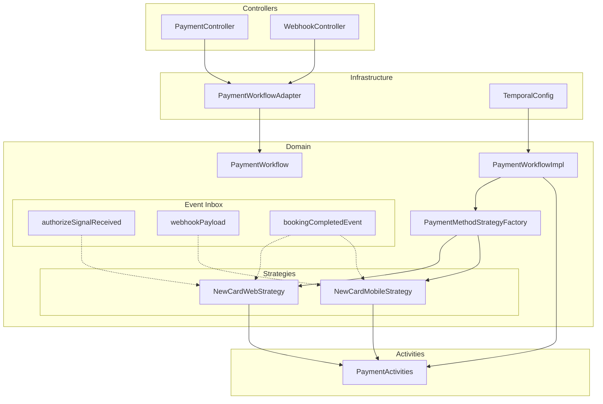
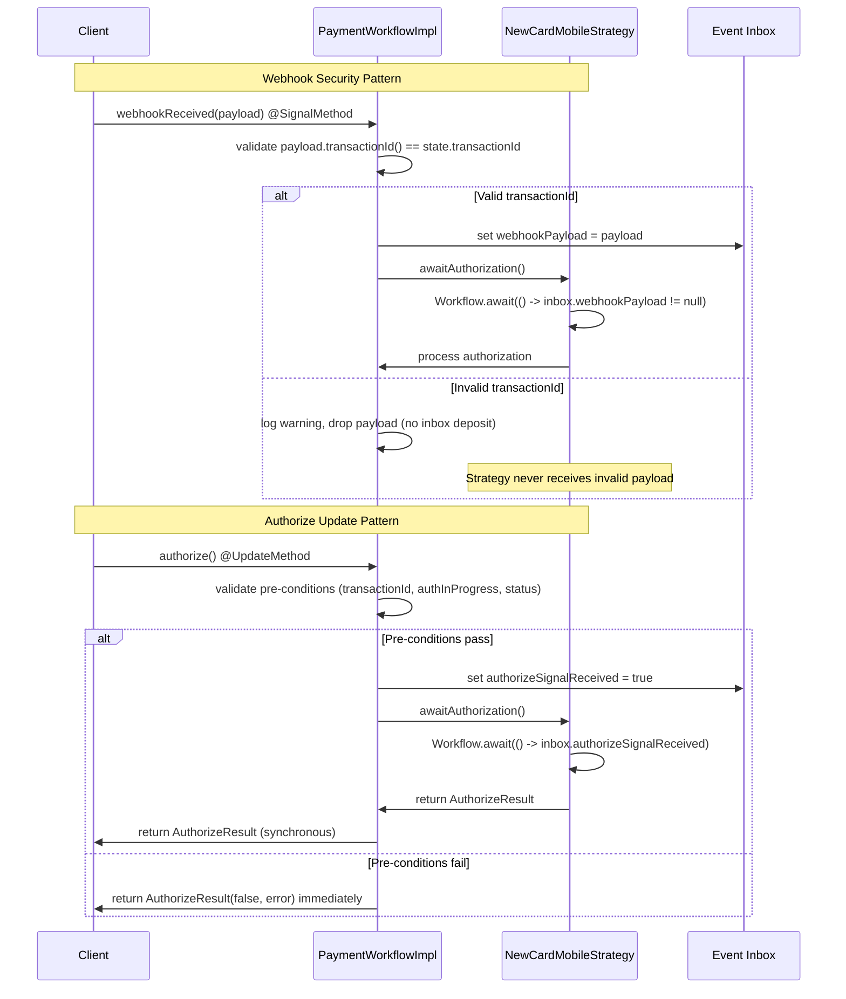
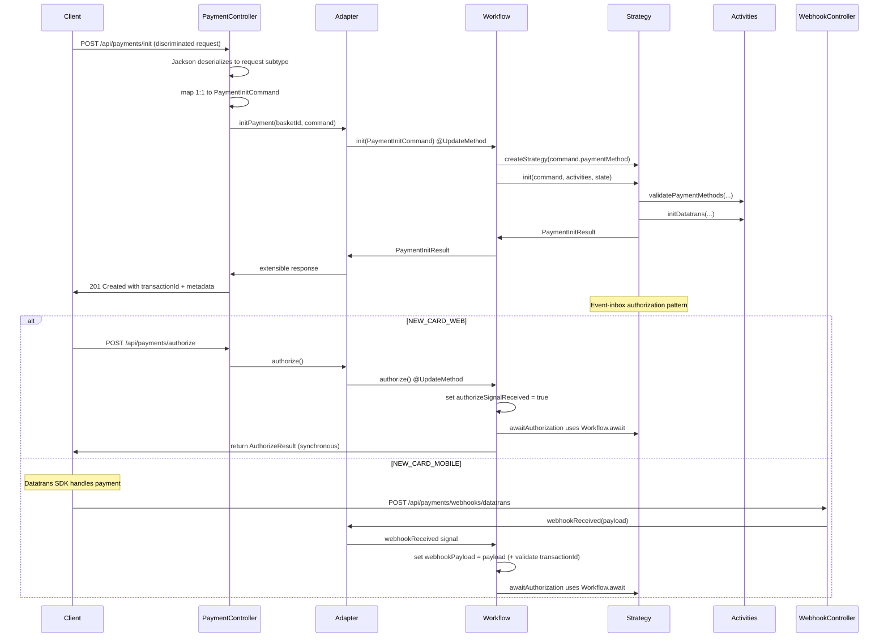

# Design Document

## Overview

The unified payment workflow design consolidates two separate Temporal workflow implementations into a single `PaymentWorkflow` using the Strategy pattern with event-inbox signal handling. The design introduces a new unified payment initialization API (`POST /api/payments/init`) using polymorphic request discrimination that replaces method-specific endpoints. Key architectural fixes include: converting authorize to @UpdateMethod for synchronous responses, implementing event-inbox pattern for signal handling with webhook security validation, using class-level validation, proper activity exception unwrapping with FQCN mapping, and authorization timeout guards to prevent expiry during in-flight authorization.

## Architecture

### High-Level Structure



### Event-Inbox Signal Pattern with Webhook Security


### API Flow with Unified Polymorphic Endpoint



## Components and Interfaces

### Authorize Update Semantics

The authorize @UpdateMethod implements blocking semantics with comprehensive pre-condition validation:

```java
public class PaymentWorkflowImpl implements PaymentWorkflow {
    
    @UpdateMethod
    public AuthorizeResult authorize() {
        // Pre-condition checks - fail fast before awaiting strategy
        if (workflowState.getTransactionId() == null) {
            return new AuthorizeResult(false, "INVALID_TRANSACTION_STATE", 
                "Payment not initialized - no transaction ID");
        }
        
        if (workflowState.isAuthorizationInProgress()) {
            return new AuthorizeResult(false, "AUTHORIZATION_IN_PROGRESS", 
                "Authorization already in progress for this payment");
        }
        
        if (workflowState.getPaymentStatus() != PaymentStatus.INITIALIZED) {
            return new AuthorizeResult(false, "INVALID_TRANSACTION_STATE", 
                String.format("Payment status %s not valid for authorization", 
                    workflowState.getPaymentStatus()));
        }
        
        // Pre-conditions passed - set signal and await strategy completion
        workflowState.setAuthorizationInProgress(true);
        workflowState.setAuthorizeSignalReceived(true);
        
        // Block until strategy completes or fails
        Workflow.await(() -> 
            workflowState.getAuthorizeResult() != null || 
            workflowState.isAttemptFailed());
        
        workflowState.setAuthorizationInProgress(false);
        
        return workflowState.getAuthorizeResult() != null 
            ? workflowState.getAuthorizeResult()
            : new AuthorizeResult(false, "GATEWAY_ERROR", "Authorization attempt failed");
    }
}
```

**Timeout Handling:** The TemporalWorkflowAdapter bounds the authorize() Update wait with a configurable timeout (`integrations.payment.workflow.authorize-wait`, default 30 seconds — kept under typical 60-second load-balancer idle timeouts). The update is durably accepted before the wait starts, so if the wait elapses the client receives HTTP 202 with AUTHORIZATION_PENDING and polls the status endpoint; the workflow continues processing and completes the authorization regardless.

### Unified Payment Initialization API

#### POST /api/payments/init

**Polymorphic Request Hierarchy (Jackson @JsonTypeInfo):**
```json
// NEW_CARD_WEB request
{
  "paymentMethod": "NEW_CARD_WEB",
  "basketId": "ARH-...",
  "returnUrl": "https://...",
  "country": "gb", 
  "language": "en",
  "userType": "LEISURE",
  "clientChannel": "PI"
}

// NEW_CARD_MOBILE request  
{
  "paymentMethod": "NEW_CARD_MOBILE",
  "basketId": "ARH-...",
  "country": "gb", 
  "language": "en",
  "userType": "LEISURE",
  "clientChannel": "PI"
}
```

**Extensible Response Schema:**
```json
{
  "paymentMethod": "NEW_CARD_WEB",
  "transactionId": "dt-12345...",
  "methodConfig": null
}
```

### Updated PaymentWorkflow Interface

```java
@WorkflowInterface
public interface PaymentWorkflow {
    @WorkflowMethod
    void run(String basketId);
    
    @UpdateMethod
    PaymentInitResult init(PaymentInitCommand command);
    
    @UpdateMethod  // Changed from @SignalMethod for synchronous response
    AuthorizeResult authorize();
    
    @SignalMethod
    void webhookReceived(WebhookPayload payload);
    
    @SignalMethod
    void bookingCompleted(BookingCompletedEvent event);
    
    @QueryMethod
    PaymentStatus getPaymentStatus();
    
    @QueryMethod  // Optional - kept for status checks only
    AuthorizeResult getAuthorizeResult();
}
```
### PaymentMethodStrategy Interface with Event-Inbox Pattern

```java
public interface PaymentMethodStrategy {
    PaymentInitResult init(
        PaymentInitCommand command, 
        PaymentActivities activities, 
        WorkflowState state);
    
    // Uses Workflow.await(predicate) to consume inbox events
    void awaitAuthorization(
        PaymentActivities activities, 
        WorkflowState state);
    
    PaymentMethod getSupportedMethod();
}
```

### Polymorphic PaymentInitRequest Hierarchy with Security Validation

```java
@JsonTypeInfo(use = JsonTypeInfo.Id.NAME, property = "paymentMethod")
@JsonSubTypes({
    @JsonSubTypes.Type(value = NewCardWebInitRequest.class, name = "NEW_CARD_WEB"),
    @JsonSubTypes.Type(value = NewCardMobileInitRequest.class, name = "NEW_CARD_MOBILE")
})
@ConditionalValidation  // Class-level constraint, not field-level
public sealed interface PaymentInitRequest 
    permits NewCardWebInitRequest, NewCardMobileInitRequest {
    PaymentMethod paymentMethod();
    @NotBlank String basketId();
    @NotBlank String country();
    @NotBlank String language();
    @NotBlank String userType();
    @NotBlank String clientChannel();
}

public record NewCardWebInitRequest(
    @NotBlank String basketId,
    @NotBlank String returnUrl,  // Required for NEW_CARD_WEB - validated for HTTPS + allowlist
    @NotBlank String country,
    @NotBlank String language,
    @NotBlank String userType,
    @NotBlank String clientChannel
) implements PaymentInitRequest {
    @Override
    public PaymentMethod paymentMethod() {
        return PaymentMethod.NEW_CARD_WEB;
    }
}

public record NewCardMobileInitRequest(
    @NotBlank String basketId,
    @NotBlank String country,
    @NotBlank String language,
    @NotBlank String userType,
    @NotBlank String clientChannel
) implements PaymentInitRequest {
    @Override
    public PaymentMethod paymentMethod() {
        return PaymentMethod.NEW_CARD_MOBILE;
    }
}
```

### ReturnUrl Security Validator

```java
@Component
public class ReturnUrlValidator {
    
    @Value("${payment.security.allowed-return-url-hosts}")
    private List<String> allowedHosts;
    
    public boolean isValidReturnUrl(String returnUrl) {
        if (returnUrl == null || returnUrl.isBlank()) {
            return false;
        }
        
        try {
            URI uri = new URI(returnUrl);
            
            // Must be HTTPS
            if (!"https".equals(uri.getScheme())) {
                return false;
            }
            
            // Must be in allowlist
            String host = uri.getHost();
            return allowedHosts.contains(host);
            
        } catch (URISyntaxException e) {
            return false;
        }
    }
}
```

### Updated PaymentMethod Enum (Integration Type)

```java
/**
 * Each value represents a distinct Datatrans integration type, not a payment instrument.
 */
public enum PaymentMethod {
    NEW_CARD_WEB,     // Secure Fields integration (init + explicit authorize)
    NEW_CARD_MOBILE;  // Mobile SDK integration (init + webhook)
    // Future: GOOGLE_PAY, APPLE_PAY, SAVED_CARD
}
```

### Class-Level Validation Annotation with ReturnUrl Security (Fixed)

```java
@Target(ElementType.TYPE)  // Class-level, NOT field-level
@Retention(RetentionPolicy.RUNTIME)
@Constraint(validatedBy = ConditionalValidationValidator.class)
public @interface ConditionalValidation {
    String message() default "Request validation failed";
    Class<?>[] groups() default {};
    Class<? extends Payload>[] payload() default {};
}

public class ConditionalValidationValidator 
        implements ConstraintValidator<ConditionalValidation, PaymentInitRequest> {
    
    @Autowired
    private ReturnUrlValidator returnUrlValidator;
    
    @Override
    public boolean isValid(PaymentInitRequest request, ConstraintValidatorContext context) {
        boolean isValid = true;
        context.disableDefaultConstraintViolation();
        
        if (request instanceof NewCardWebInitRequest webRequest) {
            String returnUrl = webRequest.returnUrl();
            
            if (returnUrl == null || returnUrl.isBlank()) {
                context.buildConstraintViolationWithTemplate("returnUrl is required for NEW_CARD_WEB")
                    .addPropertyNode("returnUrl")
                    .addConstraintViolation();
                isValid = false;
            } else if (!returnUrlValidator.isValidReturnUrl(returnUrl)) {
                context.buildConstraintViolationWithTemplate("returnUrl must be HTTPS and from allowed hosts")
                    .addPropertyNode("returnUrl")
                    .addConstraintViolation();
                isValid = false;
            }
        }
        
        return isValid;
    }
}
```
### Strategy Factory

```java
public class PaymentMethodStrategyFactory {
    public static PaymentMethodStrategy create(PaymentMethod method) {
        return switch (method) {
            case NEW_CARD_WEB -> new NewCardWebStrategy();
            case NEW_CARD_MOBILE -> new NewCardMobileStrategy();
            // Future cases will be added here
        };
    }
}
```

## Data Models

### WorkflowState with Event-Inbox Fields

```java
public class WorkflowState {
    private PaymentStatus paymentStatus;
    private String transactionId;
    private String merchantId;
    private long amount;  // Standardized as long (not Integer)
    private String currency;
    private String reservationId;
    private String bookingReference;
    private AuthorizeResult authorizeResult;
    
    // Strategy-specific state
    private PaymentMethod currentMethod;
    private boolean authorizationInProgress;
    
    // Event-Inbox Fields (consumed by strategies via Workflow.await)
    private boolean authorizeSignalReceived;
    private WebhookPayload webhookPayload;
    private BookingCompletedEvent bookingCompletedEvent;
    
    // NEW_CARD_MOBILE specific
    private MobileSdkReconciliationSettings reconciliationSettings;
    private long initCompletedAtMillis;
    private int pollAttemptCount;
    
    // Authorization outcome fields
    private String cardAlias;
    private long authorizedAmount;  // Standardized as long (not Integer)
    private String acquirerAuthorizationCode;
}
```

### Framework-Free PaymentErrorCode System

```java
/**
 * Framework-free error codes for payment processing.
 * HTTP status mapping is handled in @ControllerAdvice, not in this enum.
 */
public enum PaymentErrorCode {
    BASKET_NOT_FOUND,
    PAYMENT_METHOD_NOT_AVAILABLE,
    TRANSACTION_ALREADY_AUTHORIZED,
    BOOKING_ALREADY_PAID,
    GATEWAY_ERROR,
    VALIDATION_FAILED,
    AUTHORIZATION_IN_PROGRESS,
    TRANSACTION_EXPIRED,
    INVALID_TRANSACTION_STATE,
    EXPIRED;  // Terminal state for expired workflows
    
    public String getErrorMessage() {
        return switch (this) {
            case BASKET_NOT_FOUND -> "No basket found for the given basketId";
            case PAYMENT_METHOD_NOT_AVAILABLE -> "Card payment not available for this hotel";
            case EXPIRED -> "Payment session has expired";
            // ... other mappings
        };
    }
}

public record PaymentInitResult(
    boolean success,
    String transactionId,
    PaymentErrorCode errorCode,  // Typed instead of String
    String errorMessage
) {}
```

### HTTP Status Mapping in @ControllerAdvice

```java
@ControllerAdvice
public class PaymentExceptionHandler {
    
    private static final Map<PaymentErrorCode, HttpStatus> ERROR_STATUS_MAP = Map.of(
        PaymentErrorCode.BASKET_NOT_FOUND, HttpStatus.NOT_FOUND,
        PaymentErrorCode.PAYMENT_METHOD_NOT_AVAILABLE, HttpStatus.UNPROCESSABLE_ENTITY,
        PaymentErrorCode.TRANSACTION_ALREADY_AUTHORIZED, HttpStatus.CONFLICT,
        PaymentErrorCode.BOOKING_ALREADY_PAID, HttpStatus.CONFLICT,
        PaymentErrorCode.VALIDATION_FAILED, HttpStatus.BAD_REQUEST,
        PaymentErrorCode.AUTHORIZATION_IN_PROGRESS, HttpStatus.CONFLICT,
        PaymentErrorCode.EXPIRED, HttpStatus.GONE
        // ... other mappings
    );
    
    @ExceptionHandler(PaymentInitializationException.class)
    public ResponseEntity<ErrorResponse> handlePaymentInit(PaymentInitializationException ex) {
        PaymentErrorCode errorCode = ex.getErrorCode();
        HttpStatus status = ERROR_STATUS_MAP.getOrDefault(errorCode, HttpStatus.INTERNAL_SERVER_ERROR);
        return ResponseEntity
            .status(status)
            .body(new ErrorResponse(errorCode.name(), errorCode.getErrorMessage()));
    }
}
```
```

### Generic WebhookPayload (Gateway-Scoped)

```java
@JsonTypeInfo(use = JsonTypeInfo.Id.NAME, property = "gateway")
@JsonSubTypes({
    @JsonSubTypes.Type(value = DatatransWebhookPayload.class, name = "DATATRANS")
})
public sealed interface WebhookPayload permits DatatransWebhookPayload {
    String transactionId();  // Used for correlation + replay-attack guard
    // NO paymentMethod() - webhooks don't know which method the workflow runs
}

public record DatatransWebhookPayload(
    String transactionId,
    String merchantId,
    String status,
    String currency,
    String refno,
    Integer authorizedAmount,
    // ... other Datatrans specific fields
) implements WebhookPayload {}
```
### Extensible PaymentInitResponse with Typed MethodConfig

```java
/**
 * Sealed marker interface for payment method configuration.
 * Currently empty implementations - extended when specific methods need config.
 */
public sealed interface MethodConfig 
    permits SecureFieldsConfig, MobileSdkConfig {
}

public record SecureFieldsConfig() implements MethodConfig {
    // Future: returnUrl validation rules, styling config, etc.
}

public record MobileSdkConfig() implements MethodConfig {
    // Future: SDK version requirements, theme config, etc.
}

@JsonPropertyOrder({"paymentMethod", "transactionId", "methodConfig"})
public record PaymentInitResponse(
    PaymentMethod paymentMethod,
    String transactionId,
    MethodConfig methodConfig  // Sealed interface for typed config, initially null
) {}
```

## API Contracts

### New Unified Endpoint

#### POST `/api/payments/init`
**Purpose:** Initialize payment for any payment method using polymorphic requests  
**HTTP Status:** `201 Created` (resource creation)

**Request (Jackson discriminated):**
Uses `@JsonTypeInfo(property = "paymentMethod")` for automatic subtype routing.

**Response:**
```json
{
  "paymentMethod": "NEW_CARD_WEB",
  "transactionId": "dt-67890",
  "methodConfig": null
}
```

**Validation:** Class-level `@ConditionalValidation` + per-subtype `@NotBlank` annotations

### Updated Authorization Endpoint

#### POST `/api/payments/authorize`
- **Changed:** Now calls `@UpdateMethod AuthorizeResult authorize()` for synchronous response
- **Eliminated:** Signal+polling pattern - HTTP thread gets immediate response
- Returns `AuthorizeResult` directly (no more Thread.sleep(500) query loops)

#### POST `/api/payments/webhooks/datatrans` (renamed)
- **Previously:** `/api/payments/webhooks/mobile-sdk`
- **Verification Required:** Check no Datatrans dashboard config pins old path
- Creates `DatatransWebhookPayload` and signals unified workflow
- Validates `payload.transactionId()` matches `state.transactionId` (replay-attack guard)

### Controller Implementation

```java
@RestController
@RequestMapping("/api/payments")
public class PaymentController {
    
    @PostMapping("/init")
    public ResponseEntity<PaymentInitResponse> initPayment(
            @Valid @RequestBody PaymentInitRequest request) {
        
        // 1:1 mapping to command (trivial with polymorphic requests)
        PaymentInitCommand command = switch (request.paymentMethod()) {
            case NEW_CARD_WEB -> {
                var webRequest = (NewCardWebInitRequest) request;
                yield new NewCardWebInitCommand(
                    webRequest.basketId(),
                    webRequest.returnUrl(),
                    webRequest.country(),
                    webRequest.language(),
                    webRequest.userType(),
                    webRequest.clientChannel()
                );
            }
            case NEW_CARD_MOBILE -> {
                var mobileRequest = (NewCardMobileInitRequest) request;
                yield new NewCardMobileInitCommand(
                    mobileRequest.basketId(),
                    mobileRequest.country(),
                    mobileRequest.language(),
                    mobileRequest.userType(),
                    mobileRequest.clientChannel()
                );
            }
        };
        
        PaymentInitResult result = paymentWorkflowAdapter.initPayment(
            request.basketId(), command);
            
        if (!result.success()) {
            throw new PaymentInitializationException(result.errorCode());
        }
        
        var response = new PaymentInitResponse(
            request.paymentMethod(),
            result.transactionId(),
            null  // methodConfig - reserved for future
        );
        
        return ResponseEntity.status(HttpStatus.CREATED).body(response);
    }
    
    @PostMapping("/authorize")
    public ResponseEntity<AuthorizeResult> authorize(@RequestBody AuthorizeRequest request) {
        // Synchronous response - no more polling!
        AuthorizeResult result = paymentWorkflowAdapter.authorize(request.basketId());
        return ResponseEntity.ok(result);
    }
}
```
## Error Handling

### Activity Exception Unwrapping Pattern with FQCN Mapping (Fixed)

```java
public class NewCardWebStrategy implements PaymentMethodStrategy {
    
    // FQCN constants for reliable exception mapping
    private static final String BASKET_NOT_FOUND = 
        uk.co.whitbread.payment.orchestrator.domain.exceptions.BasketNotFoundException.class.getName();
    private static final String PAYMENT_METHOD_NOT_AVAILABLE = 
        uk.co.whitbread.payment.orchestrator.domain.exceptions.PaymentMethodNotAvailableException.class.getName();
    private static final String AUTHORIZATION_DECLINED = 
        uk.co.whitbread.payment.orchestrator.domain.exceptions.AuthorizationDeclinedException.class.getName();
    // ... other FQCN constants
    
    @Override
    public PaymentInitResult init(PaymentInitCommand command, PaymentActivities activities, WorkflowState state) {
        try {
            var webCommand = (NewCardWebInitCommand) command;
            var reservation = activities.getReservation(webCommand.basketId());
            // ... existing Secure Fields initialization logic
            return new PaymentInitResult(true, transactionId, null, null);
        } catch (Exception e) {
            PaymentErrorCode errorCode = extractFailureType(e);
            return new PaymentInitResult(false, null, errorCode, errorCode.getErrorMessage());
        }
    }
    
    // Correct pattern: activities throw ActivityFailure wrapping ApplicationFailure
    private PaymentErrorCode extractFailureType(Throwable throwable) {
        Throwable cause = throwable;
        while (cause != null) {
            if (cause instanceof ApplicationFailure appFailure) {
                String type = appFailure.getType(); // Returns FQCN
                return switch (type) {
                    case BASKET_NOT_FOUND -> PaymentErrorCode.BASKET_NOT_FOUND;
                    case PAYMENT_METHOD_NOT_AVAILABLE -> PaymentErrorCode.PAYMENT_METHOD_NOT_AVAILABLE;
                    case AUTHORIZATION_DECLINED -> PaymentErrorCode.GATEWAY_ERROR;
                    // ... other FQCN mappings
                    default -> PaymentErrorCode.GATEWAY_ERROR;
                };
            }
            cause = cause.getCause();
        }
        return PaymentErrorCode.GATEWAY_ERROR;
    }
}
```

### Exception Handler with Typed Errors

```java
@ControllerAdvice
public class PaymentExceptionHandler {
    
    @ExceptionHandler(PaymentInitializationException.class)
    public ResponseEntity<ErrorResponse> handlePaymentInit(PaymentInitializationException ex) {
        PaymentErrorCode errorCode = ex.getErrorCode();
        return ResponseEntity
            .status(errorCode.getHttpStatus())
            .body(new ErrorResponse(errorCode.name(), errorCode.getErrorMessage()));
    }
}
```

### Event-Inbox Authorization Pattern with Webhook Security

```java
public class PaymentWorkflowImpl implements PaymentWorkflow {
    
    @SignalMethod
    public void webhookReceived(WebhookPayload payload) {
        // CRITICAL FIX: Validate transactionId BEFORE depositing to inbox
        if (payload.transactionId() != null && 
            payload.transactionId().equals(workflowState.getTransactionId())) {
            workflowState.setWebhookPayload(payload);
        } else {
            // Log and drop mismatched payloads - never deposit invalid webhooks
            Workflow.getLogger(PaymentWorkflowImpl.class)
                .warn("Webhook transactionId mismatch: expected={}, received={}", 
                    workflowState.getTransactionId(), payload.transactionId());
        }
    }
}

public class NewCardWebStrategy implements PaymentMethodStrategy {
    
    @Override
    public void awaitAuthorization(PaymentActivities activities, WorkflowState state) {
        // Wait for authorize signal via event-inbox (NOT direct routing)
        Workflow.await(() -> state.isAuthorizeSignalReceived());
        
        // Process the authorization
        var result = activities.authorizeTransaction(state.getTransactionId());
        state.setAuthorizeResult(result);
        
        // Clear the inbox event
        state.setAuthorizeSignalReceived(false);
    }
}

public class NewCardMobileStrategy implements PaymentMethodStrategy {
    
    @Override
    public void awaitAuthorization(PaymentActivities activities, WorkflowState state) {
        // Real reconciliation loop with polling (CTECH-12128)
        long deadline = Workflow.currentTimeMillis() + 
            Duration.ofMinutes(state.getReconciliationSettings().getMaxDurationMinutes()).toMillis();
        
        // Initial delay before first poll
        Workflow.await(
            Duration.ofMinutes(state.getReconciliationSettings().getInitialDelayMinutes()), 
            () -> state.getWebhookPayload() != null || state.isTerminal()
        );
        
        // Reconciliation polling loop
        while (!state.isTerminal() && state.getWebhookPayload() == null) {
            if (Workflow.currentTimeMillis() >= deadline) {
                state.setPaymentStatus(PaymentStatus.EXPIRED);
                return;
            }
            
            // Poll Datatrans for transaction status
            TransactionStatusResult pollResult = activities.getTransactionStatus(
                state.getTransactionId(), state.getMerchantId());
                
            if ("authorized".equals(pollResult.status()) || "settled".equals(pollResult.status())) {
                // Self-authorize via polling
                AuthorizeResult result = activities.processTransactionStatus(pollResult);
                state.setAuthorizeResult(result);
                state.setPaymentStatus(PaymentStatus.AUTHORIZED);
                return;
            } else if ("failed".equals(pollResult.status()) || "canceled".equals(pollResult.status())) {
                state.setPaymentStatus(PaymentStatus.FAILED);
                return;
            }
            
            // Wait for next poll interval
            Workflow.await(
                Duration.ofSeconds(state.getReconciliationSettings().getPollIntervalSeconds()), 
                () -> state.getWebhookPayload() != null || state.isTerminal()
            );
        }
        
        // Process webhook if it arrived while polling
        if (state.getWebhookPayload() != null) {
            // Webhook already validated by signal handler - safe to process
            var result = activities.processWebhook(state.getWebhookPayload());
            state.setAuthorizeResult(result);
            
            // Clear the inbox event  
            state.setWebhookPayload(null);
        }
    }
}
```
### Re-initialization Policy Matrix

```java
public class PaymentWorkflowImpl implements PaymentWorkflow {
    
    @UpdateMethod
    public PaymentInitResult init(PaymentInitCommand command) {
        // Re-init policy matrix implementation
        PaymentStatus currentStatus = workflowState.getPaymentStatus();
        
        return switch (currentStatus) {
            case INITIALIZED -> {
                // Same-method or cross-method re-init: cancel prior, create new
                if (workflowState.getTransactionId() != null) {
                    paymentActivities.cancelTransaction(workflowState.getTransactionId());
                }
                workflowState.reset();  // Clear prior state
                yield performInit(command);
            }
            case AUTHORIZATION_IN_PROGRESS -> {
                // Reject with conflict
                yield new PaymentInitResult(false, null, 
                    PaymentErrorCode.AUTHORIZATION_IN_PROGRESS, 
                    "Authorization in progress, cannot re-initialize");
            }
            case AUTHORIZED, SETTLED, CANCELLED -> {
                // Terminal for this attempt
                yield new PaymentInitResult(false, null, 
                    PaymentErrorCode.TRANSACTION_ALREADY_AUTHORIZED, 
                    "Payment already completed for this basket");
            }
            case FAILED -> {
                // Workflow stays alive, new attempt allowed (potentially different method)
                workflowState.reset();
                yield performInit(command);
            }
            case EXPIRED -> {
                // Should not reach here - expired workflows don't accept updates
                yield new PaymentInitResult(false, null, 
                    PaymentErrorCode.TRANSACTION_EXPIRED, 
                    "Payment session has expired");
            }
        };
    }
}
```

### Workflow Expiry Management with Authorization Safety Guard

```java
public class PaymentWorkflowImpl implements PaymentWorkflow {
    
    @WorkflowMethod
    public void run(String basketId) {
        Duration expiryTimeout = Duration.ofMinutes(30);  // Configurable via properties
        
        // Initial timeout check
        boolean completed = Workflow.await(expiryTimeout, () -> 
            workflowState.getPaymentStatus().isTerminal()
        );
        
        if (!completed) {
            // Timeout fired - but don't expire while authorization is in flight
            Workflow.await(() -> !workflowState.isAuthorizationInProgress());
            
            // Double-check terminal status after waiting for authorization
            if (!workflowState.getPaymentStatus().isTerminal()) {
                // Still not terminal after auth completed - safe to expire
                workflowState.setPaymentStatus(PaymentStatus.EXPIRED);
                
                // Clean up any active transaction
                if (workflowState.getTransactionId() != null) {
                    try {
                        paymentActivities.cancelTransaction(workflowState.getTransactionId());
                    } catch (Exception e) {
                        // Log but don't fail workflow termination
                        Workflow.getLogger(PaymentWorkflowImpl.class)
                            .warn("Failed to cancel expired transaction: {}", e.getMessage());
                    }
                }
            }
        }
    }
}

public enum PaymentStatus {
    INITIALIZED,
    AUTHORIZATION_IN_PROGRESS,
    AUTHORIZED,
    SETTLED,
    FAILED,
    CANCELLED,
    EXPIRED;  // Terminal state for expired workflows
    
    public boolean isTerminal() {
        return switch (this) {
            case AUTHORIZED, SETTLED, FAILED, CANCELLED, EXPIRED -> true;
            case INITIALIZED, AUTHORIZATION_IN_PROGRESS -> false;
        };
    }
}
```

**Key Safety Feature:** Once `run()` returns (`isTerminal() == true`), the workflow completes. A subsequent update-with-start for the same basketId creates a fresh workflow execution — this is the intended behavior for post-expiry retry.
```

## Testing Strategy

### Replay Testing with WorkflowReplayer (Fixed API Usage)

```java
class PaymentWorkflowReplayTest {
    
    @Test
    void replayRecordedWorkflowHistory() {
        // Load recorded history from test resources
        File historyFile = new File("src/test/resources/workflow-histories/payment-new-card-web.json");
        
        // Static method usage - replayer validates deterministic behavior
        WorkflowReplayer.replayWorkflowExecution(
            Files.readString(historyFile.toPath()), 
            PaymentWorkflowImpl.class
        );
    }
    
    @Test
    void validateStrategyFactoryDeterminism() {
        // Verify factory produces consistent results for replay
        PaymentMethodStrategy strategy1 = PaymentMethodStrategyFactory.create(PaymentMethod.NEW_CARD_WEB);
        PaymentMethodStrategy strategy2 = PaymentMethodStrategyFactory.create(PaymentMethod.NEW_CARD_WEB);
        
        assertThat(strategy1.getClass()).isEqualTo(strategy2.getClass());
        assertThat(strategy1.getSupportedMethod()).isEqualTo(strategy2.getSupportedMethod());
    }
}
```
### Strategy Unit Tests (Thin - Helper Methods Only)

```java
class PaymentErrorMappingTest {
    
    @Test
    void extractFailureTypeMapsBasketNotFoundUsingFQCN() {
        String basketNotFoundFQCN = BasketNotFoundException.class.getName();
        ApplicationFailure appFailure = ApplicationFailure.newFailure(basketNotFoundFQCN, "");
        
        PaymentErrorCode result = NewCardWebStrategy.extractFailureType(appFailure);
        
        assertThat(result).isEqualTo(PaymentErrorCode.BASKET_NOT_FOUND);
    }
    
    @Test
    void extractFailureTypeHandlesUnknownFQCN() {
        ApplicationFailure appFailure = ApplicationFailure.newFailure("com.unknown.Exception", "");
        
        PaymentErrorCode result = NewCardWebStrategy.extractFailureType(appFailure);
        
        assertThat(result).isEqualTo(PaymentErrorCode.GATEWAY_ERROR);
    }
}

class AmountCalculatorTest {
    
    @Test
    void convertsTotalCostToMinorUnits() {
        BigDecimal totalCost = new BigDecimal("123.45");
        
        long result = AmountCalculator.toMinorUnits(totalCost);
        
        assertThat(result).isEqualTo(12345L);
    }
}

class ReturnUrlValidatorTest {
    
    @Test
    void rejectsHttpUrls() {
        ReturnUrlValidator validator = new ReturnUrlValidator(List.of("premierinn.com"));
        
        boolean result = validator.isValidReturnUrl("http://premierinn.com/return");
        
        assertThat(result).isFalse();
    }
    
    @Test
    void acceptsHttpsFromAllowedHost() {
        ReturnUrlValidator validator = new ReturnUrlValidator(List.of("premierinn.com"));
        
        boolean result = validator.isValidReturnUrl("https://premierinn.com/return");
        
        assertThat(result).isTrue();
    }
    
    @Test
    void rejectsDisallowedHost() {
        ReturnUrlValidator validator = new ReturnUrlValidator(List.of("premierinn.com"));
        
        boolean result = validator.isValidReturnUrl("https://malicious.com/return");
        
        assertThat(result).isFalse();
    }
}
```

### Workflow Integration Tests via TestWorkflowEnvironment

```java
class PaymentWorkflowIntegrationTest {
    
    @Test
    void newCardWebInitAndAuthorizeFlow() {
        try (TestWorkflowEnvironment testEnv = TestWorkflowEnvironment.newInstance()) {
            PaymentActivities mockActivities = mock(PaymentActivities.class);
            testEnv.registerActivitiesImplementations(mockActivities);
            
            PaymentWorkflow workflow = testEnv.getWorkflowClient()
                .newWorkflowStub(PaymentWorkflow.class, 
                    WorkflowOptions.newBuilder().setTaskQueue("test-queue").build());
                    
            // Test strategy behavior via workflow
            var initCommand = new NewCardWebInitCommand("ARH-123", "https://return.url", 
                "gb", "en", "LEISURE", "PI");
            var initResult = workflow.init(initCommand);
            
            assertThat(initResult.success()).isTrue();
            
            // Test synchronous authorize update
            var authorizeResult = workflow.authorize();
            assertThat(authorizeResult.status()).isEqualTo(AuthorizeStatus.SUCCESS);
        }
    }
    
    @Test
    void reInitPolicyMatrix() {
        // Test same-method re-init while INITIALIZED
        var result1 = workflow.init(newCardWebCommand);
        var result2 = workflow.init(newCardWebCommand);
        assertThat(result2.success()).isTrue();  // Allowed
        
        // Test cross-method re-init while INITIALIZED
        var result3 = workflow.init(newCardMobileCommand);
        assertThat(result3.success()).isTrue();  // Allowed
        
        // Test re-init after AUTHORIZED
        workflow.authorize();
        var result4 = workflow.init(newCardWebCommand);
        assertThat(result4.success()).isFalse();  // Terminal
        assertThat(result4.errorCode()).isEqualTo(PaymentErrorCode.TRANSACTION_ALREADY_AUTHORIZED);
    }
}
```

## Migration Strategy

### Implementation Approach
Since the service is not in production, this is a clean replacement with full deletion of old implementations.

### Key Architectural Changes Summary

| Old Design | New Design | Rationale |
|---|---|---|
| `@SignalMethod void authorize()` + polling | `@UpdateMethod AuthorizeResult authorize()` | Synchronous responses eliminate signal+query polling defect |
| Direct signal routing to strategies | Event-inbox pattern with `Workflow.await()` | Prevents hardcoded method assumptions (Google Pay on web, Apple Pay on mobile) |
| Field-level `@ConditionalNotNull` | Class-level validation with `addPropertyNode()` | Fixes Bean Validation `UnexpectedTypeException` |
| Direct domain exception catch | `extractFailureType(Throwable)` unwrapping | Activities throw `ActivityFailure` wrapping `ApplicationFailure` |
| `WebhookPayload.paymentMethod()` | Gateway-scoped discrimination | Webhooks don't know workflow's payment method |
| String error codes | `PaymentErrorCode` enum | Type safety and consistent HTTP status mapping |
| Flat request + custom validator | Polymorphic request hierarchy | SpringDoc `oneOf`, per-subtype validation, trivial controller mapping |

### Performance Considerations

**Synchronous Authorization Benefits:**
- **Eliminates polling overhead** - No more Thread.sleep(500) query loops in adapter
- **Immediate client response** - HTTP thread gets result directly from @UpdateMethod
- **Reduced Temporal queries** - One update call instead of signal + multiple queries

**Event-Inbox Pattern:**
- **Deterministic signal handling** - All events deposited to workflow state for strategy consumption
- **Strategy flexibility** - Any strategy can await any event type without hardcoded routing
- **Replay safety** - Event-inbox state is fully captured in workflow history

## Security Considerations

### Webhook Replay-Attack Protection
- **TransactionId validation** - `payload.transactionId()` must match `state.transactionId`
- **HMAC validation preserved** - Existing security measures maintained from old implementation
- **Generic endpoint security** - `/webhooks/datatrans` supports multiple integrations securely
- **Signal-level validation** - Invalid webhooks are logged and dropped before reaching strategies

### ReturnUrl Security (Open Redirect Prevention)
- **HTTPS enforcement** - Only HTTPS returnUrl values accepted (HTTP rejected)
- **Host allowlisting** - Configurable list of permitted return URL hosts
- **Configuration property** - `payment.security.allowed-return-url-hosts` in application.yml
- **Example configuration:**
```yaml
payment:
  security:
    allowed-return-url-hosts:
      - "premierinn.com"
      - "premierinn.digital"
      - "www.premierinn.com"
```

### Workflow Safety Guards
- **Authorization timeout protection** - Prevents transaction cancellation during in-flight authorization
- **Pre-condition validation** - Invalid authorize states fail fast before awaiting strategy
- **Temporal Update timeouts** - configurable bounded authorize wait (default 30s) prevents indefinite HTTP blocking; on elapse the caller gets 202 AUTHORIZATION_PENDING and polls