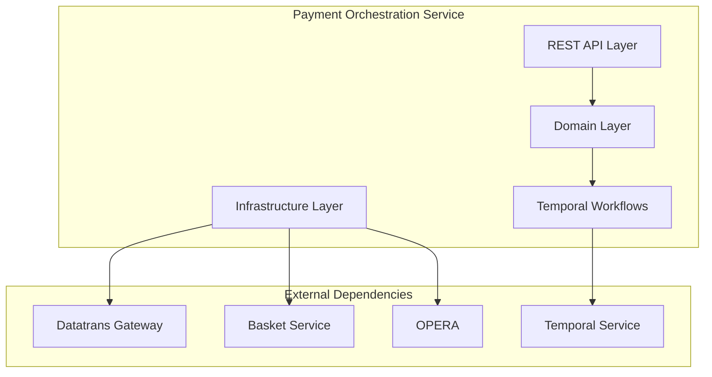
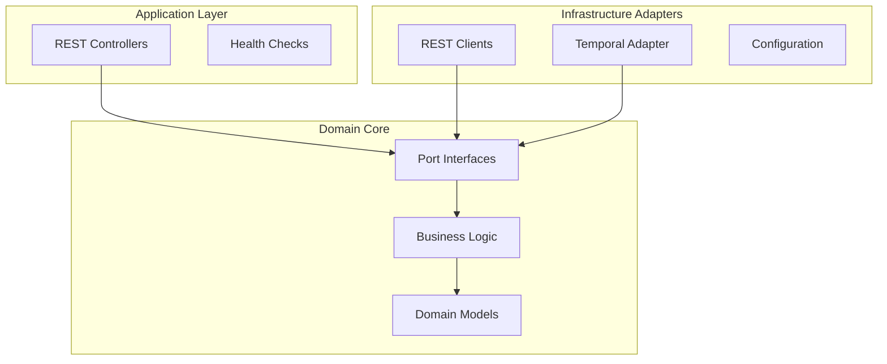

# Design Document

## Overview
The Payment Orchestration Service is the central coordination point for the new card payment journey, serving both web (Secure Fields) and mobile (SDK version 4) channels. This Phase 1 implementation focuses on service infrastructure, Temporal integration, and API endpoint structure, establishing the foundation for full payment orchestration capabilities.

## Architecture

### High-Level Service Architecture


### Hexagonal Architecture Structure


## Components and Interfaces

### REST API Controllers
| Controller | Path Prefix | Purpose |
|------------|-------------|---------|
| `PaymentController` | `/api/payments` | Main payment operations |
| `WebhookController` | `/api/payments/webhooks` | Datatrans webhooks |

### Domain Ports
| Port Interface | Type | Purpose |
|----------------|------|---------|
| `PaymentOrchestrationPort` | Primary | Coordinate payment flows |
| `TemporalWorkflowPort` | Primary | Workflow management |
| `DatatransPort` | Secondary | Payment gateway integration |
| `BasketPort` | Secondary | Reservation data access |
| `OperaPort` | Secondary | Deposit/folio posting |

### Temporal Workflows
| Workflow | Purpose |
|----------|---------|
| `SecureFieldsPaymentWorkflow` | Web payment orchestration |
| `MobileSdkPaymentWorkflow` | Mobile payment orchestration |

## Data Models

### Request/Response DTOs
```java
// Secure Fields initialization
public record SecureFieldsInitRequest(String basketId) {}
public record SecureFieldsInitResponse(String transactionId) {}

// Mobile SDK initialization  
public record MobileSdkInitRequest(String basketId) {}
public record MobileSdkInitResponse(String transactionId) {}

// Authorization request
public record AuthorizePaymentRequest(String transactionId, String basketId) {}

// Webhook payload
public record MobileSdkWebhookRequest(
    String transactionId,
    String merchantId,
    String type,
    String status,
    String currency,
    Integer authorizedAmount,
    // Additional Datatrans fields...
) {}
```

### Domain Models
```java
// Payment session context
public record PaymentSession(
    String sessionId,
    String basketId,
    PaymentChannel channel,
    PaymentStatus status,
    String transactionId,
    // Temporal workflow context
) {}

public enum PaymentChannel { WEB_SECURE_FIELDS, MOBILE_SDK }
public enum PaymentStatus { INITIALIZED, AUTHORIZED, SETTLED, FAILED }
```

## API Contracts

### POST `/api/payments/secure-fields`
**Purpose**: Initialize Secure Fields payment session for web

**Request**:
```json
{
  "basketId": "bsk-a1b2c3d4-e5f6-7890"
}
```

**Response** (201 Created):
```json
{
  "transactionId": "190410112056083383"
}
```

**Phase 1 Implementation**: Returns 501 Not Implemented with placeholder structure

### POST `/api/payments/mobile-sdk`
**Purpose**: Initialize Mobile SDK payment session for native apps

**Request**:
```json
{
  "basketId": "bsk-a1b2c3d4-e5f6-7890"
}
```

**Response** (201 Created):
```json
{
  "transactionId": "2d49fde3-3f03-4b45-8b3e-a5c1e2f7d8e9"
}
```

**Phase 1 Implementation**: Returns 501 Not Implemented with placeholder structure

### POST `/api/payments/authorize`
**Purpose**: Finalize authorization post-3DS (web only)

**Request**:
```json
{
  "transactionId": "190410112056083383",
  "basketId": "bsk-a1b2c3d4-e5f6-7890"
}
```

**Response**: 204 No Content

**Phase 1 Implementation**: Returns 501 Not Implemented

### POST `/api/payments/webhooks/mobile-sdk`
**Purpose**: Datatrans webhook callback after SDK payment

**Request**: Datatrans webhook payload (complex structure)
**Response**: 200 OK with acknowledgment

**Phase 1 Implementation**: Returns 501 Not Implemented

## Error Handling

### Standard Error Response Format
```json
{
  "error": {
    "code": "ERROR_CODE",
    "message": "Human readable message",
    "details": "Additional technical details"
  }
}
```

### Phase 1 Error Codes
| HTTP Status | Error Code | Description |
|-------------|------------|-------------|
| 501 | NOT_IMPLEMENTED | Feature not yet implemented |
| 400 | INVALID_REQUEST | Malformed request |
| 500 | INTERNAL_ERROR | Unexpected server error |

## Testing Strategy

### Unit Tests
- Domain logic validation
- Port interface mocking
- DTO serialization/deserialization
- Configuration validation

### Integration Tests
- REST endpoint behavior
- Temporal workflow execution
- Health check functionality
- OpenAPI documentation generation

### Contract Tests
- API contract verification using Spring Cloud Contract
- Request/response schema validation

### Test Data Management
- Use TestContainers for integration tests requiring external dependencies
- Mock external service responses for unit tests
- Faker library for generating test data

## Configuration Properties

### Application Configuration
```yaml
server:
  port: 9112
  servlet:
    context-path: /payment-orchestrator

spring:
  application:
    name: payment-orchestration-service

# Temporal configuration
temporal:
  connection:
    target: localhost:7233  # Default for local development
    namespace: default
  workflow:
    task-queue: payment-workflows
    
# External service endpoints  
integrations:
  datatrans:
    base-url: https://sandbox.datatrans.com  # Sandbox for development
  basket:
    base-url: http://basket-service:8080
  opera:
    base-url: http://opera-adapter:8080

# Monitoring
management:
  endpoints:
    web:
      exposure:
        include: health,info,metrics,prometheus
  endpoint:
    health:
      show-details: always
```

### Profile-Specific Overrides
- **local**: Embedded/mock dependencies
- **opera-dev**: Development environment endpoints  
- **opera-qa**: QA environment endpoints
- **opera-perf**: Performance testing environment