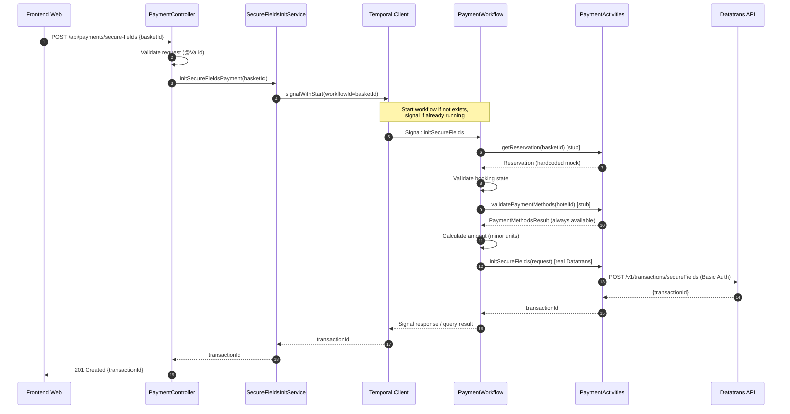
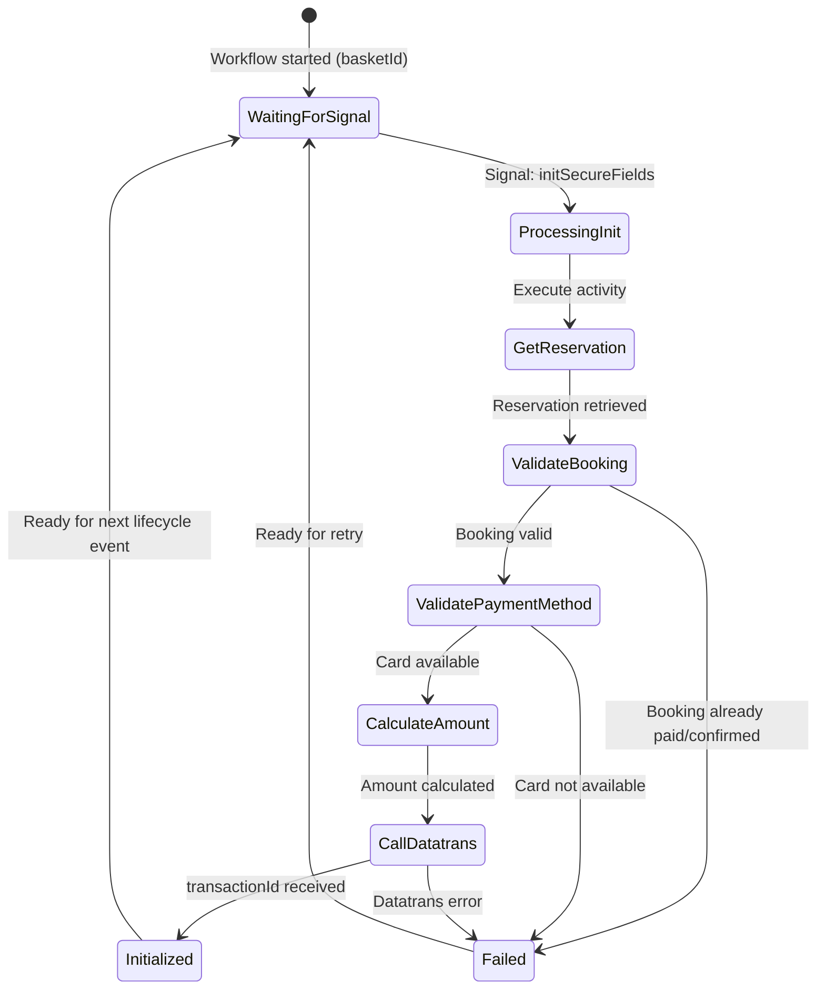

# Design Document

## Overview

This design covers the implementation of the `POST /api/payments/secure-fields` endpoint in the Payment Orchestration Service, backed by a **Temporal workflow per booking**. The endpoint replaces the Phase 1 stub (501 Not Implemented) with a complete Secure Fields payment session initialization flow that integrates with Datatrans v1 APIs.

The endpoint accepts a `basketId`, delegates to a Temporal `PaymentWorkflow` (using the `basketId` as the workflow ID for natural idempotency), and returns a `transactionId` that the web frontend uses to render card input iframes.

**Key design decisions:**
- **Temporal workflow per booking** — one `PaymentWorkflow` instance per `basketId` tracks all payment attempts, failures, and successes for a given booking
- **Signal-with-start pattern** — if a workflow already exists for the `basketId`, signal it; otherwise start a new one
- Hexagonal architecture — domain logic is framework-agnostic; Spring/Temporal concerns live in infrastructure adapters
- `autoSettle = false` — deferred settlement per the e2e architecture
- No card data touches our system — only amounts, currency, cardholder name/address, and the returned transactionId

**Scope for this ticket (CTECH-11215):**
- ✅ **Real integration**: Datatrans REST adapter with Basic Auth (`POST /v1/transactions/secureFields`)
- ✅ **Real integration**: Temporal workflow + activities
- ⬜ **Stub**: Basket Service — returns hardcoded/mock reservation data
- ⬜ **Stub**: Payment Method Entity Service — always returns "card available"
- ⬜ **Not in scope**: OPERA deposit/folio posting (future ticket)

## Architecture

### Request Flow (Temporal Workflow)


### Hexagonal Architecture Layer Map

```mermaid
graph TB
    subgraph "Infrastructure Layer"
        CTRL[PaymentController]
        TEMPORAL_CLIENT[TemporalWorkflowAdapter]
        DT_ADAPTER["DatatransRestAdapter [REAL]"]
        BASKET_STUB["BasketStubAdapter [STUB]"]
        PMES_STUB["PaymentMethodStubAdapter [STUB]"]
        ERROR_HANDLER[GlobalExceptionHandler]
    end

    subgraph "Domain Layer"
        IN_PORT[PaymentOrchestrationInPort]
        SERVICE[SecureFieldsInitService]
        WORKFLOW_PORT[PaymentWorkflowPort]
        BASKET_PORT[BasketOutPort]
        PMES_PORT[PaymentMethodOutPort]
        DT_PORT[DatatransOutPort]
        AMOUNT_CALC[AmountCalculator]
        MODELS[Domain Models]
    end

    subgraph "Temporal Layer"
        WF[PaymentWorkflow]
        WF_IMPL[PaymentWorkflowImpl]
        ACTIVITIES[PaymentActivities]
        ACT_IMPL[PaymentActivitiesImpl]
    end

    CTRL -->|calls| IN_PORT
    SERVICE -.->|implements| IN_PORT
    SERVICE -->|uses| WORKFLOW_PORT
    TEMPORAL_CLIENT -.->|implements| WORKFLOW_PORT
    WF_IMPL -.->|implements| WF
    ACT_IMPL -.->|implements| ACTIVITIES
    ACT_IMPL -->|uses| BASKET_PORT
    ACT_IMPL -->|uses| PMES_PORT
    ACT_IMPL -->|uses| DT_PORT
    ACT_IMPL -->|uses| AMOUNT_CALC
    BASKET_STUB -.->|implements| BASKET_PORT
    PMES_STUB -.->|implements| PMES_PORT
    DT_ADAPTER -.->|implements| DT_PORT
```


### Temporal Workflow Design



**Workflow ID**: `payment-{basketId}` — guarantees one workflow per booking (Temporal enforces uniqueness).

**Signal-with-start**: The `SecureFieldsInitService` uses Temporal's `signalWithStart` to atomically:
1. Start the workflow if it doesn't exist
2. Send the `initSecureFields` signal

**Synchronous response**: The API uses a Temporal query or update to wait for the activity result and return the `transactionId` synchronously within the HTTP request/response cycle.

**Workflow remains open**: After returning the transactionId, the workflow stays alive to handle subsequent payment lifecycle events (authorize, settle — future tickets).

## Components and Interfaces

### Domain Layer

| Component | Type | Purpose |
|-----------|------|---------|
| `PaymentOrchestrationInPort` | Primary Port (interface) | Inbound use-case: `initSecureFieldsPayment(basketId)` |
| `SecureFieldsInitService` | Domain Service | Delegates to Temporal workflow via `PaymentWorkflowPort` |
| `PaymentWorkflowPort` | Secondary Port (interface) | Abstraction over Temporal client operations |
| `AmountCalculator` | Domain Utility | Converts major-unit amounts to minor-unit integers for a given currency |
| `BasketOutPort` | Secondary Port (interface) | Retrieves reservation details |
| `PaymentMethodOutPort` | Secondary Port (interface) | Validates payment method availability for a hotel |
| `DatatransOutPort` | Secondary Port (interface) | Calls Datatrans secureFields API |

### Temporal Layer

| Component | Type | Purpose |
|-----------|------|---------|
| `PaymentWorkflow` | Workflow Interface | Defines workflow signals, queries, and lifecycle |
| `PaymentWorkflowImpl` | Workflow Implementation | Orchestrates activities for payment initialization |
| `PaymentActivities` | Activity Interface | Declares activities for external calls |
| `PaymentActivitiesImpl` | Activity Implementation | Executes external calls (Datatrans, Basket, PMES) |

### Infrastructure Layer

| Component | Type | Scope | Purpose |
|-----------|------|-------|---------|
| `PaymentController` | REST Controller | — | HTTP layer; delegates to primary port |
| `GlobalExceptionHandler` | `@ControllerAdvice` | — | Maps domain exceptions to HTTP error responses |
| `TemporalWorkflowAdapter` | Adapter | REAL | Implements `PaymentWorkflowPort` using Temporal SDK client |
| `DatatransRestAdapter` | Adapter | REAL | WebClient-based Datatrans integration with Basic Auth |
| `BasketStubAdapter` | Adapter | STUB | Returns hardcoded mock reservation data (TODO: integrate with real Basket Service) |
| `PaymentMethodStubAdapter` | Adapter | STUB | Always returns "card available" (TODO: integrate with real PMES) |
| `DatatransProperties` | Configuration | — | Externalised Datatrans config (base URL, merchantId, credentials, returnUrl) |
| `TemporalProperties` | Configuration | — | Temporal connection, namespace, task queue config |

### Domain Exceptions

| Exception | Mapped HTTP Status | Error Code |
|-----------|-------------------|------------|
| `BasketNotFoundException` | 404 Not Found | `BASKET_NOT_FOUND` |
| `BookingAlreadyPaidException` | 409 Conflict | `BOOKING_ALREADY_PAID` |
| `BookingAlreadyConfirmedException` | 409 Conflict | `BOOKING_ALREADY_CONFIRMED` |
| `PaymentMethodNotAvailableException` | 422 Unprocessable Entity | `PAYMENT_METHOD_NOT_AVAILABLE` |
| `DatatransGatewayException` | 502 Bad Gateway | `GATEWAY_ERROR` |
| `ServiceUnavailableException` | 503 Service Unavailable | `SERVICE_UNAVAILABLE` |
| `MethodArgumentNotValidException` (Spring) | 400 Bad Request | `INVALID_REQUEST` |

## Data Models

### API DTOs

```java
// Request
public record SecureFieldsInitRequest(
    @NotBlank(message = "basketId is required") String basketId
) {}

// Response
public record SecureFieldsInitResponse(String transactionId) {}

// Error wrapper
public record ErrorResponseWrapper(ErrorBody error) {
  public record ErrorBody(String code, String message) {}
}
```

### Domain Models

```java
/**
 * Reservation data retrieved from Basket Service (stubbed for this ticket).
 */
public record Reservation(
    String basketId,
    String hotelId,
    BigDecimal baseAmount,
    BigDecimal donationAmount,
    String currencyCode,       // ISO 4217 (GBP, EUR, USD)
    String bookingReference,   // null if not yet confirmed
    boolean paymentCompleted
) {}

/**
 * Result of payment method validation (stubbed for this ticket).
 */
public record PaymentMethodValidationResult(
    boolean cardPaymentAvailable,
    List<String> availableCardBrands // e.g., ["VIS", "ECA", "AMX"]
) {}

/**
 * Request sent to Datatrans POST /v1/transactions/secureFields.
 */
public record DatatransSecureFieldsRequest(
    long amount,            // total in minor currency units
    String currency,        // ISO 4217
    String returnUrl,       // 3DS redirect URL
    boolean autoSettle      // always false
) {}

/**
 * Response from Datatrans POST /v1/transactions/secureFields.
 */
public record DatatransSecureFieldsResponse(
    String transactionId    // valid for 30 minutes
) {}
```

### Temporal Workflow Models

```java
/**
 * Signal payload for initiating a Secure Fields payment attempt.
 */
public record InitSecureFieldsSignal(
    String basketId
) {}

/**
 * Result returned from the workflow after processing the init signal.
 */
public record SecureFieldsInitResult(
    String transactionId,
    boolean success,
    String errorCode,      // null on success
    String errorMessage    // null on success
) {}
```

### Amount Calculation Logic

```java
/**
 * Converts a monetary amount from major units to minor units based on currency.
 * GBP/EUR/USD: multiply by 100 (2 decimal places).
 * JPY/KRW: no conversion (0 decimal places).
 */
public class AmountCalculator {

  private static final Map<String, Integer> CURRENCY_EXPONENTS = Map.of(
      "GBP", 2, "EUR", 2, "USD", 2, "CHF", 2,
      "JPY", 0, "KRW", 0
  );

  public long toMinorUnits(BigDecimal amount, String currencyCode) {
    int exponent = CURRENCY_EXPONENTS.getOrDefault(currencyCode.toUpperCase(), 2);
    return amount.movePointRight(exponent).longValueExact();
  }

  public long calculateTotal(BigDecimal baseAmount, BigDecimal donationAmount, String currencyCode) {
    BigDecimal total = baseAmount.add(donationAmount);
    return toMinorUnits(total, currencyCode);
  }
}
```

## Port Interface Definitions

### `PaymentWorkflowPort` (new — abstracts Temporal client)

```java
public interface PaymentWorkflowPort {

  /**
   * Start or signal a PaymentWorkflow for the given basketId.
   * Uses signal-with-start: starts the workflow if not running, signals if already running.
   * Waits synchronously for the result.
   *
   * @param basketId the basket/booking identifier (used as workflow ID)
   * @return the Secure Fields initialization result (transactionId or error)
   */
  SecureFieldsInitResult initSecureFieldsPayment(String basketId);
}
```

### `DatatransOutPort` (real implementation)

```java
public interface DatatransOutPort {

  /**
   * Initialize a Secure Fields transaction with Datatrans.
   *
   * @param request the Datatrans request (amount, currency, returnUrl, autoSettle)
   * @return the Datatrans transaction identifier (valid for 30 minutes)
   * @throws DatatransGatewayException if Datatrans returns a non-2xx response
   * @throws ServiceUnavailableException if Datatrans is unreachable
   */
  String initSecureFields(DatatransSecureFieldsRequest request);
}
```

### `BasketOutPort` (stub implementation for this ticket)

```java
public interface BasketOutPort {

  /**
   * Retrieve reservation details for the given basket.
   *
   * @param basketId the basket identifier
   * @return the reservation details
   * @throws BasketNotFoundException if no basket exists for the given ID
   */
  Reservation getReservation(String basketId);
}
```

### `PaymentMethodOutPort` (stub implementation for this ticket)

```java
public interface PaymentMethodOutPort {

  /**
   * Validate that card payment is available for the given hotel.
   *
   * @param hotelId the hotel identifier
   * @return validation result with card availability and supported brands
   */
  PaymentMethodValidationResult validatePaymentMethods(String hotelId);
}
```

## Temporal Workflow & Activity Interfaces

### `PaymentWorkflow` (Workflow Interface)

```java
@WorkflowInterface
public interface PaymentWorkflow {

  @WorkflowMethod
  void run(String basketId);

  /**
   * Signal to initiate a Secure Fields payment attempt.
   * The workflow executes activities and stores the result for query.
   */
  @SignalMethod
  void initSecureFields(InitSecureFieldsSignal signal);

  /**
   * Query the latest Secure Fields initialization result.
   * Returns null if no init has been processed yet.
   */
  @QueryMethod
  SecureFieldsInitResult getLastInitResult();
}
```

### `PaymentActivities` (Activity Interface)

```java
@ActivityInterface
public interface PaymentActivities {

  /**
   * Retrieve reservation from Basket Service.
   * STUB for this ticket — returns hardcoded data.
   */
  @ActivityMethod
  Reservation getReservation(String basketId);

  /**
   * Validate payment methods for a hotel.
   * STUB for this ticket — always returns card available.
   */
  @ActivityMethod
  PaymentMethodValidationResult validatePaymentMethods(String hotelId);

  /**
   * Call Datatrans POST /v1/transactions/secureFields.
   * REAL integration for this ticket.
   */
  @ActivityMethod
  String initDatatransSecureFields(DatatransSecureFieldsRequest request);
}
```

### `PaymentWorkflowImpl` (Workflow Implementation)

```java
public class PaymentWorkflowImpl implements PaymentWorkflow {

  private final PaymentActivities activities = Workflow.newActivityStub(
      PaymentActivities.class,
      ActivityOptions.newBuilder()
          .setStartToCloseTimeout(Duration.ofSeconds(30))
          .setRetryOptions(RetryOptions.newBuilder()
              .setMaximumAttempts(3)
              .build())
          .build()
  );

  private SecureFieldsInitResult lastInitResult;

  @Override
  public void run(String basketId) {
    // Workflow stays open, waiting for signals
    Workflow.await(() -> false); // Block indefinitely until cancelled
  }

  @Override
  public void initSecureFields(InitSecureFieldsSignal signal) {
    try {
      // 1. Get reservation (stub)
      Reservation reservation = activities.getReservation(signal.basketId());

      // 2. Validate booking state
      if (reservation.paymentCompleted()) {
        lastInitResult = new SecureFieldsInitResult(null, false,
            "BOOKING_ALREADY_PAID", "Reservation already has a completed payment");
        return;
      }
      if (reservation.bookingReference() != null) {
        lastInitResult = new SecureFieldsInitResult(null, false,
            "BOOKING_ALREADY_CONFIRMED", "Reservation already has a booking confirmation");
        return;
      }

      // 3. Validate payment methods (stub)
      PaymentMethodValidationResult pmResult =
          activities.validatePaymentMethods(reservation.hotelId());
      if (!pmResult.cardPaymentAvailable()) {
        lastInitResult = new SecureFieldsInitResult(null, false,
            "PAYMENT_METHOD_NOT_AVAILABLE", "Card payment not available for this hotel");
        return;
      }

      // 4. Calculate amount
      AmountCalculator calc = new AmountCalculator();
      long totalMinorUnits = calc.calculateTotal(
          reservation.baseAmount(), reservation.donationAmount(), reservation.currencyCode());

      // 5. Call Datatrans (real)
      DatatransSecureFieldsRequest dtRequest = new DatatransSecureFieldsRequest(
          totalMinorUnits, reservation.currencyCode(), returnUrl, false);
      String transactionId = activities.initDatatransSecureFields(dtRequest);

      lastInitResult = new SecureFieldsInitResult(transactionId, true, null, null);
    } catch (Exception e) {
      lastInitResult = new SecureFieldsInitResult(null, false,
          "GATEWAY_ERROR", e.getMessage());
    }
  }

  @Override
  public SecureFieldsInitResult getLastInitResult() {
    return lastInitResult;
  }
}
```

## Stub Adapter Implementations

### `BasketStubAdapter` (STUB — TODO: replace with real Basket Service integration)

```java
@Component
@Profile("!basket-real") // Switch to real implementation via profile
public class BasketStubAdapter implements BasketOutPort {

  @Override
  public Reservation getReservation(String basketId) {
    // TODO: Replace with real REST call to Basket Service
    if (basketId == null || basketId.isBlank()) {
      throw new BasketNotFoundException("No basket found for ID " + basketId);
    }
    return new Reservation(
        basketId,
        "HOTEL-001",
        new BigDecimal("86.00"),
        new BigDecimal("0.00"),
        "GBP",
        null,   // no booking reference
        false   // payment not completed
    );
  }
}
```

### `PaymentMethodStubAdapter` (STUB — TODO: replace with real PMES integration)

```java
@Component
@Profile("!pmes-real") // Switch to real implementation via profile
public class PaymentMethodStubAdapter implements PaymentMethodOutPort {

  @Override
  public PaymentMethodValidationResult validatePaymentMethods(String hotelId) {
    // TODO: Replace with real REST call to Payment Method Entity Service
    return new PaymentMethodValidationResult(
        true,
        List.of("VIS", "ECA", "AMX")
    );
  }
}
```

## Datatrans Integration Details (REAL)

### Outgoing Request to Datatrans

**Endpoint:** `POST {datatrans.base-url}/v1/transactions/secureFields`

**Authentication:** HTTP Basic Auth
- Username: `merchantId` (from configuration)
- Password: `merchantPassword` (from configuration / secrets manager)

**Request Body:**
```json
{
  "amount": 8600,
  "currency": "GBP",
  "returnUrl": "https://www.premierinn.com/payments/3ds-return",
  "autoSettle": false
}
```

**Success Response (201 Created from Datatrans):**
```json
{
  "transactionId": "190410112056083383"
}
```

**Error Response (4xx/5xx):** Mapped to `DatatransGatewayException` → 502 to the frontend.

### `DatatransRestAdapter` (REAL implementation)

```java
@Component
@RequiredArgsConstructor
public class DatatransRestAdapter implements DatatransOutPort {

  private final WebClient datatransWebClient;
  private final DatatransProperties properties;

  @Override
  public String initSecureFields(DatatransSecureFieldsRequest request) {
    try {
      DatatransSecureFieldsResponse response = datatransWebClient.post()
          .uri("/v1/transactions/secureFields")
          .headers(h -> h.setBasicAuth(properties.getMerchantId(), properties.getMerchantPassword()))
          .bodyValue(Map.of(
              "amount", request.amount(),
              "currency", request.currency(),
              "returnUrl", request.returnUrl(),
              "autoSettle", request.autoSettle()
          ))
          .retrieve()
          .onStatus(HttpStatusCode::isError, clientResponse ->
              Mono.error(new DatatransGatewayException(
                  "Datatrans returned " + clientResponse.statusCode())))
          .bodyToMono(DatatransSecureFieldsResponse.class)
          .block(Duration.ofSeconds(properties.getReadTimeout()));

      if (response == null || response.transactionId() == null) {
        throw new DatatransGatewayException("Datatrans returned empty response");
      }
      return response.transactionId();
    } catch (WebClientRequestException e) {
      throw new ServiceUnavailableException("Datatrans is unreachable: " + e.getMessage());
    }
  }
}
```

### Security Configuration

```yaml
integrations:
  datatrans:
    base-url: ${DATATRANS_BASE_URL:https://api.sandbox.datatrans.com}
    merchant-id: ${DATATRANS_MERCHANT_ID}
    merchant-password: ${DATATRANS_MERCHANT_PASSWORD}
    return-url: ${DATATRANS_RETURN_URL:https://www.premierinn.com/payments/3ds-return}
    connect-timeout: 5s
    read-timeout: 10s
```

Credentials are injected via environment variables (sourced from AWS Secrets Manager in deployed environments).

## Error Handling

### Exception Mapping Strategy

The `GlobalExceptionHandler` (`@ControllerAdvice`) centralises exception-to-HTTP mapping:

```java
@RestControllerAdvice
@Slf4j
public class GlobalExceptionHandler {

  @ExceptionHandler(MethodArgumentNotValidException.class)
  public ResponseEntity<ErrorResponseWrapper> handleValidation(MethodArgumentNotValidException ex) {
    // 400 INVALID_REQUEST
  }

  @ExceptionHandler(BasketNotFoundException.class)
  public ResponseEntity<ErrorResponseWrapper> handleBasketNotFound(BasketNotFoundException ex) {
    // 404 BASKET_NOT_FOUND
  }

  @ExceptionHandler(BookingAlreadyPaidException.class)
  public ResponseEntity<ErrorResponseWrapper> handleAlreadyPaid(BookingAlreadyPaidException ex) {
    // 409 BOOKING_ALREADY_PAID
  }

  @ExceptionHandler(BookingAlreadyConfirmedException.class)
  public ResponseEntity<ErrorResponseWrapper> handleAlreadyConfirmed(BookingAlreadyConfirmedException ex) {
    // 409 BOOKING_ALREADY_CONFIRMED
  }

  @ExceptionHandler(PaymentMethodNotAvailableException.class)
  public ResponseEntity<ErrorResponseWrapper> handlePaymentMethodUnavailable(...) {
    // 422 PAYMENT_METHOD_NOT_AVAILABLE
  }

  @ExceptionHandler(DatatransGatewayException.class)
  public ResponseEntity<ErrorResponseWrapper> handleGatewayError(DatatransGatewayException ex) {
    // 502 GATEWAY_ERROR
  }

  @ExceptionHandler(ServiceUnavailableException.class)
  public ResponseEntity<ErrorResponseWrapper> handleServiceUnavailable(ServiceUnavailableException ex) {
    // 503 SERVICE_UNAVAILABLE
  }
}
```

### Temporal Error Propagation

Errors that occur inside the workflow (from activities) are propagated back to the API layer:

| Workflow Error | Propagation | API Response |
|----------------|-------------|--------------|
| `BasketNotFoundException` from activity | Activity throws → workflow catches → sets `SecureFieldsInitResult.errorCode` | Service reads result, throws domain exception → 404 |
| `BookingAlreadyPaidException` | Workflow sets result with error code | Service throws → 409 |
| `BookingAlreadyConfirmedException` | Workflow sets result with error code | Service throws → 409 |
| `PaymentMethodNotAvailableException` | Workflow sets result with error code | Service throws → 422 |
| `DatatransGatewayException` from activity | Activity throws → workflow catches → sets result | Service throws → 502 |
| Activity timeout | Temporal retries (max 3), then workflow sets error result | Service throws → 503 |

The `SecureFieldsInitService` reads the `SecureFieldsInitResult` from the workflow query, checks `success`, and throws the appropriate domain exception based on `errorCode`.

### Resilience Patterns

| Concern | Strategy |
|---------|----------|
| Datatrans timeout | Activity `startToCloseTimeout` = 30s; Temporal retries up to 3 attempts |
| Datatrans 4xx/5xx | Caught in activity; mapped to `DatatransGatewayException` |
| Workflow already exists | `signalWithStart` handles idempotently — signals existing workflow |
| Temporal service down | `ServiceUnavailableException` propagated to API → 503 |
| Connection refused (Datatrans) | Caught in adapter; mapped to `ServiceUnavailableException` |
| Unexpected errors | Caught by global handler; returns 500 `INTERNAL_ERROR` |

## Correctness Properties

*A property is a characteristic or behavior that should hold true across all valid executions of a system — essentially, a formal statement about what the system should do. Properties serve as the bridge between human-readable specifications and machine-verifiable correctness guarantees.*

### Property 1: Input validation rejects invalid basket IDs

*For any* string that is blank, null, or purely whitespace, submitting it as `basketId` to the secure-fields endpoint SHALL result in a 400 Bad Request response with error code `INVALID_REQUEST`, and no workflow shall be started or signaled.

**Validates: Requirements 1.2, 5.1, 6.1, 6.4**

### Property 2: Booking state validation prevents duplicate payments

*For any* reservation that has either a completed payment or a booking confirmation, calling `initSecureFieldsPayment` SHALL result in a 409 Conflict error (either `BOOKING_ALREADY_PAID` or `BOOKING_ALREADY_CONFIRMED`) and no Datatrans activity shall be executed.

**Validates: Requirements 1.4, 4.1, 4.2, 4.3**

### Property 3: Payment method validation gates Datatrans calls

*For any* hotel where card payment is not available, calling `initSecureFieldsPayment` SHALL result in a 422 Unprocessable Entity error with code `PAYMENT_METHOD_NOT_AVAILABLE`, and no Datatrans activity shall be executed.

**Validates: Requirements 2.1, 2.4, 5.3**

### Property 4: Amount calculation correctness

*For any* pair of non-negative monetary amounts (baseAmount, donationAmount) and a valid ISO 4217 currency code, the amount sent to Datatrans SHALL equal `(baseAmount + donationAmount)` converted to minor currency units using the currency's standard exponent (e.g., ×100 for GBP/EUR/USD, ×1 for JPY).

**Validates: Requirements 3.3, 8.2, 8.3**

### Property 5: TransactionId passthrough integrity

*For any* transactionId string returned by the Datatrans secureFields API, the value returned to the frontend in the 201 response SHALL be identical (character-for-character) to the value received from Datatrans.

**Validates: Requirements 3.5, 6.2, 7.5**

### Property 6: Error response format consistency

*For any* error condition that occurs during secure-fields initialization, the HTTP response body SHALL contain an `error` object with non-null `code` (string) and `message` (string) fields.

**Validates: Requirements 5.6**

### Property 7: Downstream error mapping

*For any* non-2xx response from the Datatrans API, the service SHALL return 502 Bad Gateway with error code `GATEWAY_ERROR`. *For any* connection timeout or refusal from any downstream service (Datatrans), the service SHALL return 503 Service Unavailable with error code `SERVICE_UNAVAILABLE`.

**Validates: Requirements 3.6, 5.4, 5.5**

### Property 8: Temporal workflow idempotency

*For any* basketId, invoking `initSecureFieldsPayment` multiple times SHALL always interact with exactly one Temporal workflow instance for that basketId. Concurrent calls SHALL not create duplicate workflows.

**Validates: Requirements 1.5**

## Testing Strategy

### Property-Based Tests (jqwik)

The project uses `net.jqwik:jqwik:1.9.3` as a test dependency. Each correctness property maps to one jqwik property test with minimum 100 iterations.

| Property | Test Class | Generator Strategy |
|----------|-----------|-------------------|
| Property 1 | `InputValidationPropertyTest` | Generate blank/whitespace/null strings |
| Property 2 | `BookingStateValidationPropertyTest` | Generate `Reservation` records with random booking states |
| Property 3 | `PaymentMethodValidationPropertyTest` | Generate hotel configs with random card availability |
| Property 4 | `AmountCalculationPropertyTest` | Generate random `BigDecimal` amounts + currency codes |
| Property 5 | `TransactionIdPassthroughPropertyTest` | Generate random alphanumeric transactionId strings |
| Property 6 | `ErrorResponseFormatPropertyTest` | Generate all error conditions, verify response shape |
| Property 7 | `DownstreamErrorMappingPropertyTest` | Generate various HTTP error codes and timeout scenarios |
| Property 8 | `WorkflowIdempotencyPropertyTest` | Generate random basketIds, invoke multiple times, verify single workflow |

**Tag format:** `Feature: secure-fields-datatrans-integration, Property {N}: {title}`

**Configuration:** Each property test annotated with `@Property(tries = 100)`.

### Unit Tests (JUnit 5 + Mockito)

- `SecureFieldsInitServiceTest` — happy path, each exception branch, workflow result mapping
- `AmountCalculatorTest` — specific examples: `86.00 GBP → 8600`, `0.00 → 0`, `1000 JPY → 1000`
- `DatatransRestAdapterTest` — verify Basic Auth header, request body structure, error handling
- `PaymentWorkflowImplTest` — workflow logic with mocked activities (booking state, payment method, amount calc)
- `GlobalExceptionHandlerTest` — verify each exception → HTTP status mapping
- `BasketStubAdapterTest` — verify stub returns expected hardcoded data
- `PaymentMethodStubAdapterTest` — verify stub always returns card available

### Integration Tests (Temporal Test Framework + Spring)

- `PaymentWorkflowIntegrationTest` — uses Temporal's `TestWorkflowEnvironment` to test full workflow execution with real activity implementations
- `PaymentControllerIntegrationTest` — full request/response cycle via `@SpringBootTest` with Temporal test server
- `DatatransRestAdapterIntegrationTest` — WireMock for Datatrans API (verifying Basic Auth, request format, error handling)
- `TemporalWorkflowAdapterTest` — verifies signal-with-start, query, and idempotency behavior

### Test Data

- **Basket stub:** returns hardcoded valid reservation (amount=86.00, currency=GBP, no booking ref)
- **PMES stub:** always returns card available with brands ["VIS", "ECA", "AMX"]
- **Datatrans WireMock:** successful transactionId, 4xx errors, 5xx errors, timeouts
- **Temporal test server:** in-memory Temporal for workflow integration tests

## Configuration

### Application Configuration

```yaml
server:
  port: 9112
  servlet:
    context-path: /payment-orchestrator

spring:
  application:
    name: payment-orchestration-service

# Temporal configuration
temporal:
  connection:
    target: ${TEMPORAL_TARGET:localhost:7233}
    namespace: ${TEMPORAL_NAMESPACE:default}
  workflow:
    task-queue: payment-workflows
    execution-timeout: 24h    # Workflow stays open for full booking lifecycle
  activity:
    start-to-close-timeout: 30s
    retry:
      maximum-attempts: 3

# Datatrans (REAL integration)
integrations:
  datatrans:
    base-url: ${DATATRANS_BASE_URL:https://api.sandbox.datatrans.com}
    merchant-id: ${DATATRANS_MERCHANT_ID:1100012345}
    merchant-password: ${DATATRANS_MERCHANT_PASSWORD:}
    return-url: ${DATATRANS_RETURN_URL:https://www.premierinn.com/payments/3ds-return}
    connect-timeout: 5s
    read-timeout: 10s

# Monitoring
management:
  endpoints:
    web:
      exposure:
        include: health,info,metrics,prometheus
  endpoint:
    health:
      show-details: always
```

### Profile Overrides

| Profile | Datatrans URL | Temporal Target | Notes |
|---------|---------------|-----------------|-------|
| `local` | `https://api.sandbox.datatrans.com` | `localhost:7233` | Local Temporal dev server |
| `opera-dev` | `https://api.sandbox.datatrans.com` | Temporal Cloud (dev) | Dev environment |
| `opera-qa` | `https://api.sandbox.datatrans.com` | Temporal Cloud (qa) | QA environment |
| `opera-perf` | `https://api.sandbox.datatrans.com` | Temporal Cloud (perf) | Perf environment |
| Production | `https://api.datatrans.com` | Temporal Cloud (prod) | Live gateway + real credentials |

### Adapter Scope Summary

| Adapter | This Ticket | Future Ticket |
|---------|-------------|---------------|
| `DatatransRestAdapter` | ✅ REAL — Basic Auth, full REST integration | — |
| `TemporalWorkflowAdapter` | ✅ REAL — signal-with-start, query | — |
| `BasketStubAdapter` | ⬜ STUB — hardcoded mock data | Replace with `BasketRestAdapter` calling real Basket Service |
| `PaymentMethodStubAdapter` | ⬜ STUB — always returns card available | Replace with `PaymentMethodRestAdapter` calling real PMES |
| OPERA adapter | ❌ NOT IN SCOPE | Separate ticket for deposit/folio posting |
