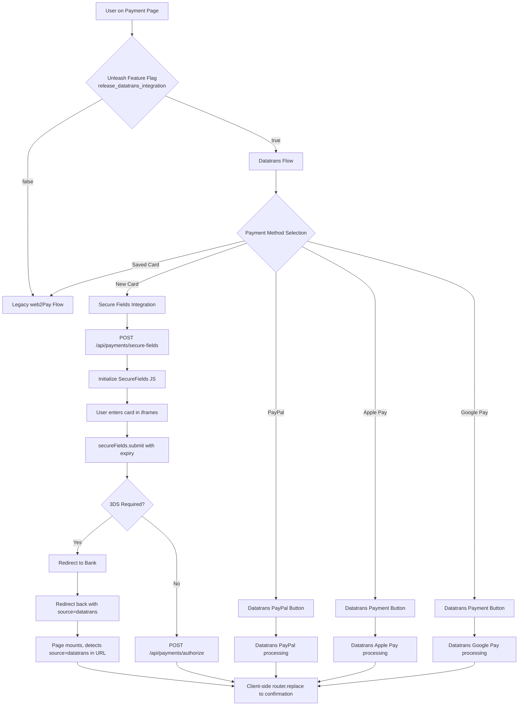

# Design Document

## Overview

This design covers the integration of Datatrans payment services into the Premier Inn frontend payment page (`frontend/pi-front-end-applications/apps/next-apps/premier-inn`), migrating from the legacy web2Pay system to Datatrans for New Card (Secure Fields), PayPal, Apple Pay, and Google Pay payment methods. The integration is controlled by the Unleash feature flag `release_datatrans_integration` with hotel-based rollout.

The design follows the end-to-end architecture defined in `.kiro/steering/designs/payments/design-e2e.md` and integrates seamlessly with existing Premier Inn payment page patterns using Next.js 15.5, TypeScript 5.5, React 19, and Chakra UI 2.8.

## Architecture



## Components and Interfaces

### Feature Toggle Integration

#### New Feature Flag Constant
Add to `@whitbread-eos/api` package:
```typescript
export const FT_PI_DATATRANS_INTEGRATION = 'release_datatrans_integration';
```

#### Updated Payment Constants
Extend `src/utils/pi-all-pages-constants.ts`:
```typescript
import { 
  FT_PI_DATATRANS_INTEGRATION,
  // ... existing imports
} from '@whitbread-eos/api';

export const PAGE = {
  PAYMENT: {
    featureToggles: {
      appPage: 'PI | Payment Page',
      flagsWithFallback: {
        // ... existing flags
        [FT_PI_DATATRANS_INTEGRATION]: false,
      },
    },
  },
};
```

#### Server-Side Props: No-op for source=datatrans
When Datatrans redirects the browser back to `returnUrl` after 3DS, the request arrives from the Datatrans domain and does **not** carry the Premier Inn session cookie. A server-side redirect via `getServerSideProps` would therefore fail or be unsafe because it cannot access authenticated session data.

Instead, `getServerSideProps` must **skip all authenticated data loading** when `source=datatrans` is present — returning only the minimal props needed for the page to mount — and let the client handle the redirect.

Update `src/page-helper/payment/data.pi.ts` at the very start of the function:
```typescript
// When source=datatrans, skip all data loading — the client will redirect immediately on mount
if (query.source === 'datatrans') {
  return {
    dehydratedState: dehydrate(new QueryClient()),
    pcksQueryInput: null,
    hiQueryInput: null,
    basketReference: (query.reservationId as string) ?? null,
    isDatatransReturn: true,
  };
}
```

#### Client-Side Redirect on source=datatrans
Update `src/page-helper/payment/page.pi.tsx` to detect `source=datatrans` on mount and redirect before rendering any UI. This must run **before** any other effect or render logic, using a dedicated early-return render path.

```typescript
export function PIPageContent({ basketReference, isDatatransReturn }: Props) {
  const router = useRouter();
  const { language, country } = useCustomLocale();

  // Detect 3DS return from Datatrans and redirect immediately — no UI is rendered.
  // We cannot do this server-side because the request from the Datatrans domain
  // does not carry the Premier Inn session cookie.
  useEffect(() => {
    if (isDatatransReturn && basketReference) {
      // bookingFlowId is stored in sessionStorage from the original payment page load
      const bookingFlowId = sessionStorage.getItem('bookingFlowId') ?? '';
      router.replace(
        `/${country}/${language}/${bookingFlowId}/confirmation?reservationId=${basketReference}`
      );
    }
  }, [isDatatransReturn, basketReference, country, language, router]);

  // Render nothing while redirecting — avoids any authenticated data calls or layout flash
  if (isDatatransReturn) {
    return null;
  }

  // ... existing page content
}
```

The `bookingFlowId` must be saved to `sessionStorage` when the payment page first loads (before the 3DS redirect), so it is available on the return trip:
```typescript
// In the payment page on initial load (not on datatrans return):
useEffect(() => {
  if (!isDatatransReturn && bookingFlowId) {
    sessionStorage.setItem('bookingFlowId', bookingFlowId);
  }
}, [isDatatransReturn, bookingFlowId]);
```

### Custom Hook: useDatatransSecureFields

Location: `src/hooks/useDatatransSecureFields.ts`

```typescript
interface SecureFieldsState {
  isScriptLoaded: boolean;
  isScriptLoading: boolean;
  scriptError: Error | null;
  secureFields: any | null;
  isInitialized: boolean;
  isReady: boolean;
  isValid: boolean;
  errors: Record<string, string>;
  transactionId: string | null;
}

interface SecureFieldsConfig {
  basketId: string;
  returnUrl: string;
}

export const useDatatransSecureFields = (config: SecureFieldsConfig) => {
  // State management for script loading, SecureFields instance, validation
  // Event handlers for ready, validate, change, success, error
  // Methods: initializeSecureFields, submitPayment, cleanup
};
```

Key responsibilities:
- Load Datatrans Secure Fields script conditionally based on environment
- Manage SecureFields instance lifecycle
- Handle all SecureFields events (ready, validate, change, success, error)
- Provide validation state and error handling
- Submit payment with expiry month/year
- Clean up on unmount

### Component: DatatransSecureFieldsForm

Location: `src/components/DatatransSecureFieldsForm.tsx`

```typescript
interface DatatransSecureFieldsFormProps {
  onSuccess: (data: { transactionId: string; redirect?: string }) => void;
  onError: (error: Error) => void;
  basketId: string;
  isVisible: boolean;
}

export const DatatransSecureFieldsForm: React.FC<DatatransSecureFieldsFormProps> = ({
  onSuccess,
  onError,
  basketId,
  isVisible,
}) => {
  // Uses useDatatransSecureFields hook
  // Renders PAN iframe container, CVV iframe container
  // Renders merchant-owned expiry month/year inputs
  // Handles form submission via secureFields.submit()
  // Applies Chakra UI styling consistent with existing payment forms
};
```

Structure:
- Conditional rendering based on `isVisible` prop
- Two iframe containers: `#cardNumber` and `#cvv`
- Merchant-owned form fields for expiry month/year using Chakra UI components
- Form validation and error display
- Loading states during script loading and initialization

### API Route Handler: Secure Fields Initialization

Location: `src/pages/api/payments/secure-fields.ts`

The Payment Orchestrator base URL is read from `NEXT_PUBLIC_PAYMENT_ORCHESTRATION_API` (server-only; configured in `serverRuntimeConfig`). This keeps the backend URL out of client bundles.

```typescript
import { serverRuntimeConfig } from 'next/config';

export default async function handler(
  req: NextApiRequest,
  res: NextApiResponse
) {
  if (req.method !== 'POST') {
    return res.status(405).json({ error: 'Method not allowed' });
  }

  const { basketId } = req.body;
  
  if (!basketId) {
    return res.status(400).json({ error: 'basketId is required' });
  }

  const orchestratorBaseUrl = serverRuntimeConfig().NEXT_PUBLIC_PAYMENT_ORCHESTRATION_API;

  if (!orchestratorBaseUrl) {
    return res.status(500).json({ error: 'Payment orchestrator URL not configured' });
  }

  try {
    const response = await fetch(`${orchestratorBaseUrl}/api/payments/secure-fields`, {
      method: 'POST',
      headers: {
        'Content-Type': 'application/json',
        // Forward relevant headers (session, auth, etc.)
      },
      body: JSON.stringify({
        basketId,
        returnUrl: `${req.headers.origin}${req.headers.referer?.replace(req.headers.origin as string, '')}${req.url.includes('?') ? '&' : '?'}source=datatrans`
      })
    });

    if (!response.ok) {
      throw new Error(`Backend API error: ${response.status}`);
    }

    const data = await response.json();
    res.status(201).json(data);
  } catch (error) {
    console.error('Secure Fields API error:', error);
    res.status(502).json({ error: 'Failed to initialize payment session' });
  }
}
```

### API Route Handler: Payment Authorization

Location: `src/pages/api/payments/authorize.ts`

The same `NEXT_PUBLIC_PAYMENT_ORCHESTRATION_API` env var is used here, read from `serverRuntimeConfig`.

```typescript
export default async function handler(
  req: NextApiRequest,
  res: NextApiResponse
) {
  if (req.method !== 'POST') {
    return res.status(405).json({ error: 'Method not allowed' });
  }

  const { transactionId, basketId } = req.body;

  const orchestratorBaseUrl = serverRuntimeConfig().NEXT_PUBLIC_PAYMENT_ORCHESTRATION_API;

  if (!orchestratorBaseUrl) {
    return res.status(500).json({ error: 'Payment orchestrator URL not configured' });
  }
  
  try {
    const response = await fetch(`${orchestratorBaseUrl}/api/payments/authorize`, {
      method: 'POST',
      headers: {
        'Content-Type': 'application/json',
        // Forward relevant headers
      },
      body: JSON.stringify({ transactionId, basketId })
    });

    if (!response.ok) {
      throw new Error(`Authorization failed: ${response.status}`);
    }

    res.status(204).end();
  } catch (error) {
    console.error('Payment authorization error:', error);
    res.status(502).json({ error: 'Payment authorization failed' });
  }
}
```

### Enhanced Payment Page Component

Update `src/page-helper/payment/page.pi.tsx` to integrate Datatrans functionality:

```typescript
export function PIPageContent({ /* existing props */ }: Props) {
  const {
    [FT_PI_DATATRANS_INTEGRATION]: isDatatransEnabled,
    // ... existing feature toggles
  } = useFeatureToggle();

  // New state for Datatrans integration
  const [datatransTransactionId, setDatatransTransactionId] = useState<string | null>(null);
  const [secureFieldsReady, setSecureFieldsReady] = useState(false);
  const [secureFieldsError, setSecureFieldsError] = useState<Error | null>(null);

  // Existing state and logic...

  const handleSecureFieldsSuccess = async (data: { transactionId: string; redirect?: string }) => {
    if (data.redirect) {
      // 3DS redirect
      window.location.href = data.redirect;
    } else {
      // Direct authorization
      try {
        await fetch('/api/payments/authorize', {
          method: 'POST',
          headers: { 'Content-Type': 'application/json' },
          body: JSON.stringify({
            transactionId: data.transactionId,
            basketId: basketReference
          })
        });
        
        // Navigate to confirmation
        router.push(`/${country}/${language}/${bookingFlowId}/confirmation?reservationId=${basketReference}`);
      } catch (error) {
        setSecureFieldsError(error as Error);
      }
    }
  };

  // Continue button logic override
  const handleContinueClick = async () => {
    if (isDatatransEnabled && selectedPaymentType?.type === 'NEW_CARD') {
      // Trigger Secure Fields submission
      // This will be handled by the DatatransSecureFieldsForm component
      return;
    }
    
    // Other payment methods or legacy flow
    // ... existing continue logic
  };

  return (
    <>
      {/* Existing payment page content */}
      
      {isDatatransEnabled && selectedPaymentType?.type === 'NEW_CARD' && (
        <DatatransSecureFieldsForm
          basketId={basketReference}
          isVisible={paymentStepState === paymentSteps.CARD_DETAILS}
          onSuccess={handleSecureFieldsSuccess}
          onError={setSecureFieldsError}
        />
      )}
      
      {/* Error handling for Datatrans */}
      {secureFieldsError && (
        <Alert status="error" mb={4}>
          <AlertIcon />
          {t('errors.payment.datatrans.generic')}
        </Alert>
      )}
    </>
  );
}
```

## Data Models

### SecureFields Configuration
```typescript
interface SecureFieldsConfig {
  cardNumber: {
    element: string; // '#cardNumber'
    placeholder: string;
  };
  cvv: {
    element: string; // '#cvv'
    placeholder: string;
  };
  styles: {
    base: {
      fontSize: string;
      color: string;
      // Chakra UI compatible styling
    };
    invalid: {
      color: string;
    };
  };
  paymentMethods: string[]; // ['VIS', 'ECA', 'AMX', 'MAU']
}
```

### Payment State Extension
```typescript
interface PaymentState {
  // Existing state...
  isDatatransEnabled: boolean;
  datatransTransactionId: string | null;
  secureFieldsReady: boolean;
  secureFieldsError: Error | null;
}
```

## API Contracts

### Frontend to Backend Integration

#### POST /api/payments/secure-fields
**Request:**
```typescript
{
  basketId: string; // Reservation ID from URL
}
```

**Response:**
```typescript
{
  transactionId: string; // For SecureFields initialization
}
```

#### POST /api/payments/authorize
**Request:**
```typescript
{
  transactionId: string;
  basketId: string;
}
```

**Response:** `204 No Content`

### Return URL Pattern
Current URL + `source=datatrans` parameter:
- If URL has existing params: `&source=datatrans`
- If URL has no params: `?source=datatrans`

Example: `https://premierinn.com/gb/en/book-pay-12345/payment?reservationId=12345&source=datatrans`

## Error Handling

### Error Categories

1. **Script Loading Errors**
   - Failed to load Datatrans JS library
   - Network timeout during script fetch
   - Script execution errors

2. **API Errors**
   - `/secure-fields` initialization failure
   - `/authorize` call failure
   - Backend service unavailable

3. **SecureFields Errors**
   - Invalid card data
   - 3DS authentication failure
   - Payment declined by issuer

4. **Feature Flag Errors**
   - Unleash service unavailable (fallback to legacy)
   - Hotel not configured for Datatrans

### Error Handling Strategy

```typescript
const ErrorBoundary = {
  // Script loading: Show fallback UI or legacy form
  scriptLoadError: () => {
    // Log error, fallback to legacy web2Pay
    analytics.track('datatrans_script_load_failed');
    setUseLegacyFlow(true);
  },

  // API errors: Show user-friendly message, allow retry
  apiError: (error: Error) => {
    // Display error alert
    // Enable retry button
    // Log for monitoring
  },

  // SecureFields errors: Show validation feedback
  secureFieldsError: (error: { type: string; message: string }) => {
    // Update form validation state
    // Show inline error messages
  },

  // Feature flag unavailable: Default to legacy
  featureFlagError: () => {
    setUseLegacyFlow(true);
  }
};
```

## Testing Strategy

### Unit Tests

1. **useDatatransSecureFields Hook**
   - Mock SecureFields global object
   - Test state transitions during script loading
   - Test event handler registration and cleanup
   - Test error scenarios (script load failure, API errors)

2. **DatatransSecureFieldsForm Component**
   - Render with different visibility states
   - Test form field interactions
   - Test success/error callback invocation
   - Accessibility testing

3. **API Route Handlers**
   - Mock backend responses
   - Test request validation
   - Test error handling and status codes

### Integration Tests

1. **Full Secure Fields Flow**
   - Mock SecureFields library
   - Test complete payment journey from card entry to authorization
   - Test 3DS redirect flow
   - Test error recovery

2. **Feature Toggle Integration**
   - Test behavior when flag is enabled/disabled
   - Test fallback to legacy flow

3. **Source=datatrans Redirect**
   - Test client-side redirect fires on mount when `isDatatransReturn=true`
   - Test that no authenticated data calls are made when `source=datatrans` is present
   - Test URL construction for confirmation page
   - Test that `bookingFlowId` is read from `sessionStorage` correctly

### E2E Tests (Playwright)

1. **Payment Method Selection**
   - Test switching between Datatrans and legacy flows
   - Test payment method visibility based on feature flag

2. **Card Payment Journey**
   - Test complete new card payment flow
   - Test form validation and error states
   - Test success redirect to confirmation

## Script Loading

### Next.js Script Integration

The Datatrans Secure Fields script URL is driven by `NEXT_PUBLIC_DATATRANS_SECURE_FIELDS_URL`, exposed through `publicRuntimeConfig` so it is available client-side. This allows each environment (local, DIT, UAT, prod) to point at the correct Datatrans endpoint (sandbox vs production) without code changes.

```typescript
import Script from 'next/script';
import getConfig from 'next/config';

const DatatransScript = ({ onLoad, onError }: { onLoad: () => void; onError: (e: Error) => void }) => {
  const { publicRuntimeConfig = {} } = getConfig() || {};
  const scriptSrc = publicRuntimeConfig.NEXT_PUBLIC_DATATRANS_SECURE_FIELDS_URL;

  if (!scriptSrc) {
    // URL not configured — treat as load error so the hook can fall back gracefully
    onError(new Error('NEXT_PUBLIC_DATATRANS_SECURE_FIELDS_URL is not configured'));
    return null;
  }

  return (
    <Script
      src={scriptSrc}
      strategy="afterInteractive"
      onLoad={onLoad}
      onError={onError}
    />
  );
};
```

### Environment Variables

All Datatrans-related URLs are externalised to environment variables following the existing `next.config.js` pattern. Both variables must be added to `serverRuntimeConfig` and `publicRuntimeConfig` in `next.config.js`:

```javascript
// next.config.js — add to both serverRuntimeConfig and publicRuntimeConfig:
NEXT_PUBLIC_PAYMENT_ORCHESTRATION_API: process.env.NEXT_PUBLIC_PAYMENT_ORCHESTRATION_API,
NEXT_PUBLIC_DATATRANS_SECURE_FIELDS_URL: process.env.NEXT_PUBLIC_DATATRANS_SECURE_FIELDS_URL,
```

> Note: `NEXT_PUBLIC_PAYMENT_ORCHESTRATION_API` is used only in server-side API route handlers, so it only strictly needs to be in `serverRuntimeConfig`. However, registering it in both mirrors the convention used by all other vars in this app and keeps configuration consistent.

Sample `.env.local` entries (match the commented-out block already present in the file):

```dotenv
# Payment Orchestrator base URL (server-side API routes only)
NEXT_PUBLIC_PAYMENT_ORCHESTRATION_API="http://localhost:9200"

# Datatrans Secure Fields JS library URL
# Sandbox: https://pay.sandbox.datatrans.com/upp/payment/js/secure-fields-2.0.0.min.js
# Production: https://pay.datatrans.com/upp/payment/js/secure-fields-2.0.0.min.js
NEXT_PUBLIC_DATATRANS_SECURE_FIELDS_URL="https://pay.sandbox.datatrans.com/upp/payment/js/secure-fields-2.0.0.min.js"
```

The `.env.local.sample` file must be updated with these two entries so new developers know what to configure.

## State Management

### Payment State Extensions

Add to existing payment state in `page.pi.tsx`:

```typescript
const [paymentState, setPaymentState] = useState({
  // Existing state...
  isDatatransEnabled: false,
  datatransTransactionId: null,
  secureFieldsReady: false,
  secureFieldsError: null,
  isProcessingPayment: false,
});

// State update functions
const updateDatatransState = (updates: Partial<PaymentState>) => {
  setPaymentState(prev => ({ ...prev, ...updates }));
};
```

### Continue Button State Logic

```typescript
const getContinueButtonProps = () => {
  const isNewCardDatatrans = isDatatransEnabled && 
    selectedPaymentType?.type === 'NEW_CARD' && 
    paymentStepState === paymentSteps.CARD_DETAILS;

  return {
    disabled: isNewCardDatatrans ? !secureFieldsReady : /* existing logic */,
    onClick: isNewCardDatatrans ? handleDatatransSubmit : /* existing handler */,
    loading: isNewCardDatatrans ? paymentState.isProcessingPayment : /* existing loading */,
    text: isNewCardDatatrans ? t('payment.continue.secure') : /* existing text */
  };
};
```

## Alternative Payment Methods Integration

### PayPal Button Replacement

```typescript
const PaymentMethodButton = ({ method }: { method: PaymentMethod }) => {
  if (isDatatransEnabled && method.type === 'PAYPAL') {
    return (
      <DatatransPayPalButton
        transactionId={datatransTransactionId}
        onSuccess={handlePaymentSuccess}
        onError={handlePaymentError}
      />
    );
  }

  // Existing PayPal button (legacy)
  return <PaypalWBButton {...existingProps} />;
};
```

### Apple Pay / Google Pay Integration

```typescript
const DigitalWalletButton = ({ type }: { type: 'APPLE_PAY' | 'GOOGLE_PAY' }) => {
  if (isDatatransEnabled) {
    return (
      <DatatransPaymentButton
        type={type.toLowerCase()}
        transactionId={datatransTransactionId}
        onSuccess={handlePaymentSuccess}
        onError={handlePaymentError}
      />
    );
  }

  // Existing implementation
  return <LegacyWalletButton type={type} />;
};
```

## Correctness Properties

### Property 1: Feature flag false always uses legacy web2Pay flow
**Validates: Requirements 1.2, 1.4**

When the `release_datatrans_integration` feature flag is false for any hotel, the payment page must always use the legacy web2Pay flow regardless of payment method selection.

```typescript
test('feature flag false always uses legacy flow', async () => {
  fc.assert(fc.asyncProperty(
    fc.record({ hotelId: fc.string(), basketId: fc.string() }),
    async (input) => {
      // Given: feature flag is false for any hotel
      mockFeatureFlag(FT_PI_DATATRANS_INTEGRATION, false);
      
      // When: payment page loads
      const result = await renderPaymentPage(input);
      
      // Then: legacy web2Pay flow is always used
      expect(result.paymentProvider).toBe('web2Pay');
      expect(result.secureFieldsVisible).toBe(false);
    }
  ));
});
```

### Property 2: Feature flag true always uses Datatrans Secure Fields flow
**Validates: Requirements 1.3, 3.1**

When the `release_datatrans_integration` feature flag is true for any hotel and New Card is selected, the payment page must always use the Datatrans Secure Fields flow.

```typescript
test('feature flag true always uses Datatrans flow', async () => {
  fc.assert(fc.asyncProperty(
    fc.record({ hotelId: fc.string(), basketId: fc.string() }),
    async (input) => {
      // Given: feature flag is true for any hotel
      mockFeatureFlag(FT_PI_DATATRANS_INTEGRATION, true);
      
      // When: payment page loads with New Card selected
      const result = await renderPaymentPageWithNewCard(input);
      
      // Then: Datatrans flow is always used
      expect(result.paymentProvider).toBe('datatrans');
      expect(result.secureFieldsVisible).toBe(true);
    }
  ));
});
```

### Property 3: source=datatrans URL param always triggers client-side redirect without rendering
**Validates: Requirements 6.1, 6.2, 6.3**

When a URL contains the `source=datatrans` parameter, the page component must always redirect to the confirmation page on mount and must never render any UI or make authenticated API calls. The redirect is client-side because the request arrives from the Datatrans domain without the Premier Inn session cookie.

```typescript
test('source=datatrans always triggers client-side redirect, never renders UI', async () => {
  fc.assert(fc.asyncProperty(
    fc.record({
      country: fc.constantFrom('gb', 'de'),
      language: fc.constantFrom('en', 'de'),
      bookingFlowId: fc.string({ minLength: 1 }),
      reservationId: fc.string({ minLength: 1 }),
    }),
    async (input) => {
      // Given: URL contains source=datatrans and bookingFlowId is in sessionStorage
      sessionStorage.setItem('bookingFlowId', input.bookingFlowId);
      const mockRouter = { replace: jest.fn() };

      // When: PIPageContent mounts with isDatatransReturn=true
      render(
        <PIPageContent
          isDatatransReturn={true}
          basketReference={input.reservationId}
          // ... other props (minimal, no data loaders called)
        />
      );

      // Then: page renders nothing and router.replace is always called
      expect(screen.queryByRole('main')).not.toBeInTheDocument();
      expect(mockRouter.replace).toHaveBeenCalledWith(
        `/${input.country}/${input.language}/${input.bookingFlowId}/confirmation?reservationId=${input.reservationId}`
      );
    }
  ));
});
```

### Property 4: SecureFields success event always leads to authorize API call
**Validates: Requirements 3.6, 7.4**

When SecureFields emits a success event with a transaction ID, the system must always make an authorize API call and never skip this step.

```typescript
test('SecureFields success always leads to authorize call', async () => {
  fc.assert(fc.asyncProperty(
    fc.record({ transactionId: fc.string(), basketId: fc.string() }),
    async (input) => {
      // Given: SecureFields emits success event
      const mockSecureFields = createMockSecureFields();
      
      // When: success event is triggered
      await mockSecureFields.triggerSuccess(input.transactionId);
      
      // Then: authorize call is always made
      expect(mockApiCall).toHaveBeenCalledWith('/api/payments/authorize', {
        transactionId: input.transactionId,
        basketId: input.basketId
      });
    }
  ));
});
```

### Property 5: returnUrl always equals current URL plus source=datatrans parameter
**Validates: Requirements 3.5**

The returnUrl constructed for Datatrans must always equal the current URL with the `source=datatrans` parameter correctly appended, using the appropriate separator based on existing parameters.

```typescript
test('returnUrl always equals current URL plus source=datatrans', async () => {
  fc.assert(fc.asyncProperty(
    fc.record({ 
      path: fc.string(),
      existingParams: fc.dictionary(fc.string(), fc.string())
    }),
    async (input) => {
      // Given: any current URL with any existing parameters
      const currentUrl = buildUrl(input.path, input.existingParams);
      
      // When: returnUrl is constructed
      const returnUrl = buildReturnUrl(currentUrl);
      
      // Then: it always contains the original URL plus source=datatrans
      expect(returnUrl).toContain(currentUrl);
      expect(returnUrl).toContain('source=datatrans');
      
      // And the parameter is correctly appended
      const expectedSeparator = Object.keys(input.existingParams).length > 0 ? '&' : '?';
      expect(returnUrl).toBe(`${currentUrl}${expectedSeparator}source=datatrans`);
    }
  ));
});
```

## Notes

### Key Design Decisions

1. **Conditional Script Loading**: The Datatrans script is loaded only when the feature flag is enabled and New Card is selected, reducing bundle size for hotels not using Datatrans. The script URL is driven by `NEXT_PUBLIC_DATATRANS_SECURE_FIELDS_URL` in `publicRuntimeConfig`, so sandbox vs production is controlled by the deployment environment without code changes.

2. **Client-Side Redirect for source=datatrans**: The `source=datatrans` redirect is handled client-side on mount, not server-side. When Datatrans redirects the browser back after 3DS, the request arrives from the Datatrans domain without the Premier Inn session cookie. A server-side `getServerSideProps` redirect is not safe here. Instead, `getServerSideProps` returns minimal props (skipping all authenticated data loading) and the page component redirects immediately via `router.replace()` before rendering any UI.

3. **Graceful Fallback**: Any failure in the Datatrans flow (script loading, API errors, feature flag issues) defaults to the existing web2Pay legacy flow.

4. **Existing Patterns**: The integration follows established Premier Inn patterns for feature toggles, API routing, component structure, and error handling.

5. **State Isolation**: Datatrans state is cleanly separated from existing payment state while integrating seamlessly with the continue button and form flow.

### Implementation Priorities

1. **Phase 1**: Feature flag integration, client-side redirect handling for source=datatrans
2. **Phase 2**: SecureFields hook and component development
3. **Phase 3**: API route handlers and backend integration
4. **Phase 4**: Alternative payment methods (PayPal, Apple Pay, Google Pay)
5. **Phase 5**: Comprehensive testing and error handling refinement

### Testing Notes

- Mock the global `SecureFields` object in tests to avoid external dependencies
- Use property-based testing to verify critical invariants around feature flags and redirects  
- Test both happy path and error scenarios for each integration point
- Verify accessibility compliance for all new UI components using jest-axe