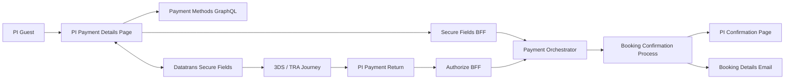
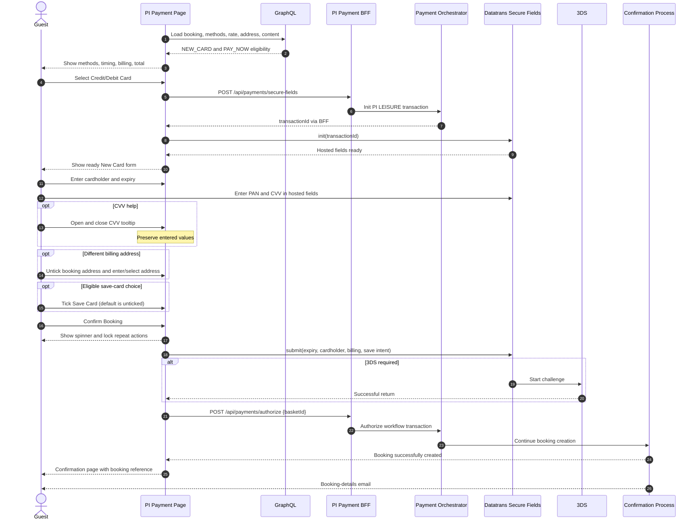

# Design Document

## Overview

CTECH-12090, **[FE][PI] Payment details page - PN - new card**, delivers a same-page Premier Inn New Card experience for a Pay Now booking. The guest selects Credit/Debit Card, enters cardholder and billing information alongside Datatrans-hosted PAN/CVV fields, confirms the booking, completes 3DS where required, and reaches booking confirmation without selecting a saved card.

This design is reconciled against the Jira content supplied by the user and the existing `frontend/pi-front-end-applications/apps/next-apps/premier-inn` implementation. It deliberately excludes system exceptions, payment failures, and alternative error flows because the ticket assigns those to another story.

### Scope

| In scope | Context only | Out of scope |
|---|---|---|
| PI web users | Other payment methods displayed on the page | Other payment-method implementations |
| New Card (`NEW_CARD`) | Flex POA default before switching to PN | Pay on arrival transaction flow |
| Pay Now (`PAY_NOW`) | Payment Orchestrator and Datatrans contracts | Backend workflow implementation |
| Same-page Secure Fields | Fraud-before-TRA platform behavior | Error/system-exception/alternative flows |
| CVV tooltip and Save Card preference | Confirmation email/platform processing | Business Booker, CCUI, mobile |
| Booking/alternative billing address | OPERA validity assumption | Front desk, no-show, cancel, refund |
| Back clearing, localization, responsiveness | Donations selected in prior step | Donation implementation |

## Architecture



The browser uses normal PI frontend routing and same-origin BFF endpoints. PAN and CVV are entered directly into Datatrans iframes. Merchant-owned fields contain cardholder name, expiry, save preference, and billing-address selection. The Payment Orchestrator owns the transaction workflow and resolves authorization by basket reference.

### Happy-Path Sequence



The exact placement of init before form readiness is implementation-driven: the current hook initializes the Datatrans session when New Card becomes visible, while Confirm Booking triggers submission.

## Ticket-to-Implementation Assessment

| Ticket behavior | Current implementation evidence | Status |
|---|---|---|
| PI-only Datatrans gate | `PaymentPagePiGate` checks feature flag and hotel `isDataTransEnabled` | Implemented |
| Credit/Debit Card method and timing options | `PaymentMethodSelector` and `PaymentOptionToggle` | Implemented; rate defaults require explicit verification |
| Same-page card form | `DatatransSecureFieldsForm` rendered within `DatatransPage` | Implemented |
| Cardholder, PAN, expiry, CVV | Merchant controls plus Secure Fields host elements | Implemented |
| CVV tooltip | No matching scoped implementation found | Missing |
| Save Card checkbox, unticked | No matching scoped implementation found | Missing |
| Booking address default | `DatatransBillingAddress` defaults checked | Implemented |
| Alternative address search/manual entry | Shared `BillingAddress` shown when unchecked | Present; ticket behavior requires verification |
| Back keeps booking but clears payment/new address | Back routing exists; complete clearing contract requires verification | Partial |
| Confirm spinner and 3DS | Secure Fields loading/submission and return wrapper | Implemented; happy path requires end-to-end proof |
| English/German | Localization infrastructure exists | Partial: scoped components contain hardcoded English copy |
| Responsive presentation | Chakra responsive styles exist | Requires breakpoint acceptance evidence |

## Components and Interfaces

| Component | Location | CTECH-12090 responsibility |
|---|---|---|
| `PaymentPagePiGate` | `src/page-helper/payment/index.tsx` | Gate Datatrans by feature and hotel capability. |
| `createPaymentPiDataLoaderFn` | `src/page-helper/payment/data.pi.ts` | Load basket, booking, rate, methods, terms, content, and route context. |
| `DatatransPage` | `src/components/payment/datatrans/DatatransPage/DatatransPage.tsx` | Own selected method/timing, billing, submit/loading state, Back, and confirmation handoff. |
| `PaymentMethodSelector` | `.../PaymentMethodSelector/PaymentMethodSelector.tsx` | Display enabled methods and emit `NEW_CARD`. |
| `PaymentOptionToggle` | `.../PaymentOptionToggle/PaymentOptionToggle.tsx` | Display Flex timing choice and emit `PAY_NOW`. |
| `DatatransSecureFieldsForm` | `.../DatatransSecureFieldsForm/DatatransSecureFieldsForm.tsx` | Render New Card fields and coordinate validation/submission. |
| `useDatatransSecureFields` | `src/hooks/use-datatrans-secure-fields.ts` | Initialize SDK, process field events, and submit cardholder context. |
| CVV help component | New scoped/reusable accessible component | Display dismissible localized CVV guidance without resetting form state. |
| Save Card control | New form control integrated with payment options | Capture explicit, default-off consent for reusable token persistence. |
| `DatatransBillingAddress` | `.../DatatransBillingAddress/DatatransBillingAddress.tsx` | Default to booking address and toggle alternative address entry. |
| Shared `BillingAddress` | `@whitbread-eos/organisms` | Provide postcode selection and manual entry. |
| `PaymentConfirmSection` | `.../PaymentConfirmSection/PaymentConfirmSection.tsx` | Show terms, total, Confirm Booking spinner, and Back. |
| PI payment BFF routes | `src/pages/api/payments/*` | Proxy secure-fields init and basket-owned authorization. |
| 3DS return wrapper | `src/page-helper/payment/page.pi.datatrans.tsx` | Resume the successful 3DS path and continue to confirmation. |

## Data Models

### Scoped Payment Selection

```typescript
interface NewCardPayNowSelection {
  methodType: 'NEW_CARD';
  paymentOption: 'PAY_NOW';
  basketReference: string;
  country: string;
  language: string;
}
```

### Merchant-Owned Form State

```typescript
interface NewCardFormValues {
  cardholderName: string;
  expiry: string; // MM / YY
  saveCard: boolean; // false by default
  useBookingAddress: boolean; // true by default
  alternativeBillingAddress?: BillingAddressInput;
}
```

PAN and CVV are intentionally absent because Datatrans owns those values.

### Billing Address

```typescript
interface BillingAddressInput {
  addressLine1: string;
  addressLine2?: string;
  addressLine3?: string;
  cityName: string;
  postalCode: string;
  countryCode: string;
}
```

### Secure Fields Submission Context

```typescript
interface SecureFieldsCardholderContext {
  cardholderName: string;
  email?: string;
  billAddrLine1?: string;
  billAddrCity?: string;
  billAddrPostCode?: string;
  billAddrCountry?: string;
}
```

The reusable save-card intent must travel through an approved frontend/backend contract. It must not be represented by storing card data in the browser.

## UI and Interaction Design

### Payment Page Composition

The responsive page contains:

1. Booking summary.
2. Payment methods, including Credit/Debit Card.
3. Pay on Arrival / Pay Now selector only when both are enabled.
4. New Card form on the same page.
5. CVV information control and tooltip.
6. Save Card checkbox when eligible, unticked initially.
7. Booking Billing Address checkbox, ticked initially.
8. Alternative address finder/manual-entry form when the checkbox is unticked.
9. Terms, booking total, Confirm Booking, and Back.

### Payment Timing

- **Flex:** POA is the default; the guest may switch to PN.
- **All other rates:** PN is selected and no timing choice is required.
- CTECH-12090 proceeds only when PN is active.

### CVV Tooltip

Use the existing accessible tooltip/popover primitive if available. The trigger is associated with CVV, supports pointer and keyboard activation, exposes `aria-expanded` and `aria-controls`, moves focus only when required by the selected primitive, and dismisses by close action, Escape, or outside interaction. Tooltip state is independent of form values and Secure Fields lifecycle.

### Save Card

The control appears only when the payment-options/allowed-to-save decision permits it. It is unchecked by default. Checking it records explicit reusable-storage intent; it never causes card details to be retained locally.

The ticket says both “Save card tick box (unticked by default)” and, after Pay Now, “the card is stored.” This design resolves the apparent conflict as follows:

- Datatrans may tokenize the card as part of transaction processing regardless of the checkbox.
- Persisting that alias as a reusable saved card occurs only when the guest has opted in and is eligible.
- Product/payment ownership must confirm this interpretation before acceptance if “stored” was intended to mean unconditional reusable storage.

### Back Navigation

Back routes to the previous booking step while retaining basket/session identity. Cardholder name, expiry, hosted-field values, save preference, and alternative billing address are component/page state only and are reset when the payment page is left. They must not be restored from browser storage on return.

## API Contracts

### Payment Methods

The payment-method dependency supplies enabled methods/options and save-card eligibility for the current PI basket, locale, and leisure user. The scoped path requires:

```json
{
  "method": { "type": "NEW_CARD", "enabled": true },
  "paymentOption": { "type": "PAY_NOW", "enabled": true }
}
```

### POST `/api/payments/secure-fields`

Browser request:

```json
{
  "basketId": "<basket-reference>",
  "country": "gb",
  "language": "en"
}
```

BFF-to-orchestrator context adds the return URL, `userType=LEISURE`, and `clientChannel=PI`. Success returns HTTP 201 with the Datatrans transaction ID used only to initialize Secure Fields.

### Secure Fields SDK

```typescript
secureFields.init(transactionId, {
  cardNumber: 'datatrans-cardNumber',
  cvv: 'datatrans-cvv',
});

secureFields.submit({
  expm,
  expy,
  '3D': { cardholder: cardholderContext },
});
```

A backend contract extension may be required to carry `saveCard` if it is not already represented by payment options/workflow state. That contract must carry consent, not raw card data.

### POST `/api/payments/authorize`

```json
{ "basketId": "<basket-reference>" }
```

The transaction ID remains in Payment Orchestrator workflow state. On the successful direct or 3DS-return path, authorization continues booking creation and confirmation.

## Error Handling

System exceptions, payment failures, declined cards, failed 3DS, and alternative error flows are explicitly outside CTECH-12090. Existing defensive behavior must not be removed, but new error acceptance criteria and remediation work belong to the separate error-handling story.

Field validity for accepting the ticket's valid-input scenario remains in scope. Security controls that prevent sensitive-data exposure also remain mandatory non-alternative behavior.

## Platform Assumptions

- Fraud checking occurs before TRA/3DS decisions in the Datatrans platform flow.
- The payment platform controls which journeys and guests receive TRA; PI does not implement that policy.
- Donations are selected in the preceding step.
- POA front-desk, no-show, cancellation, and refund behavior is owned elsewhere.
- A successfully completed PN booking that displays a confirmation reference and sends a booking email is treated as valid in OPERA.

## Testing Strategy

### Unit and Component Tests

- Gate the PI Datatrans page by feature flag and hotel capability.
- Verify Flex defaults to POA and permits PN; verify other rates use PN without a toggle.
- Render same-page cardholder, hosted PAN, expiry, CVV, CVV help, save preference, billing controls, total, and actions.
- Accept valid numeric PAN/CVV through mocked Secure Fields events and valid expiry/cardholder values without displaying validation errors.
- Open and dismiss the CVV tooltip with pointer, keyboard, Escape, and outside interaction while preserving form values.
- Verify Save Card is eligible-only and false by default, and that opt-in is propagated without local card storage.
- Verify booking address is selected by default and alternative address supports postcode selection/manual entry.
- Verify Back retains basket/session context but clears all payment and alternative-address state.
- Verify Confirm Booking locks repeat actions and shows a spinner through Secure Fields/3DS handoff.
- Verify English/German translation keys and responsive layout at supported breakpoints.
- Run automated accessibility checks and targeted keyboard/screen-reader assertions.

### Integration Tests

- Mock Payment Orchestrator and Datatrans boundaries for the successful New Card Pay Now journey.
- Verify basket-only authorization after direct success and successful 3DS return.
- Verify confirmation handoff includes the reservation ID and displays the booking reference using confirmation-process test data.

### End-to-End Test

Use the PI page-object structure and typed non-production hotel, guest, and card data to cover:

`New Card → Pay Now → valid same-page details → optional 3DS → loading → booking created → confirmation reference`.

The E2E suite must also verify responsive layouts and the English/German content variants where the environment supports deterministic data. Error-path E2E scenarios are not part of this ticket.
