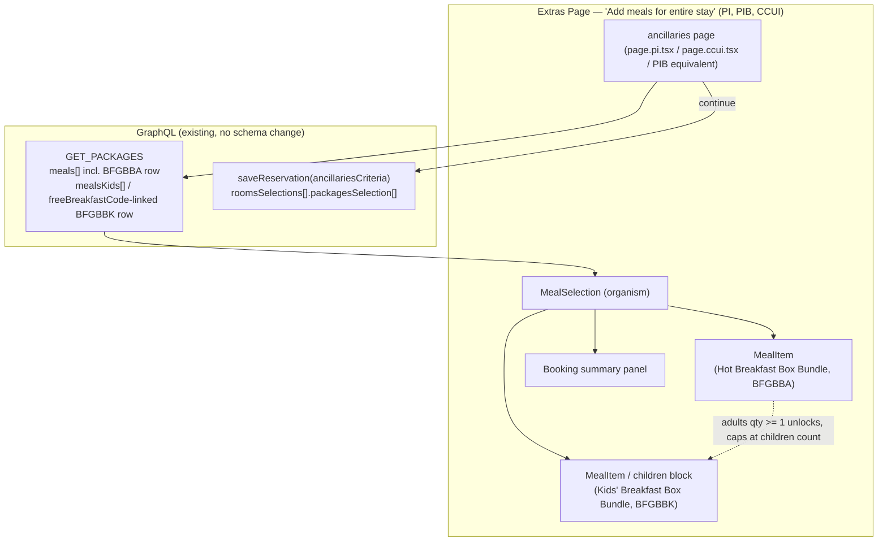
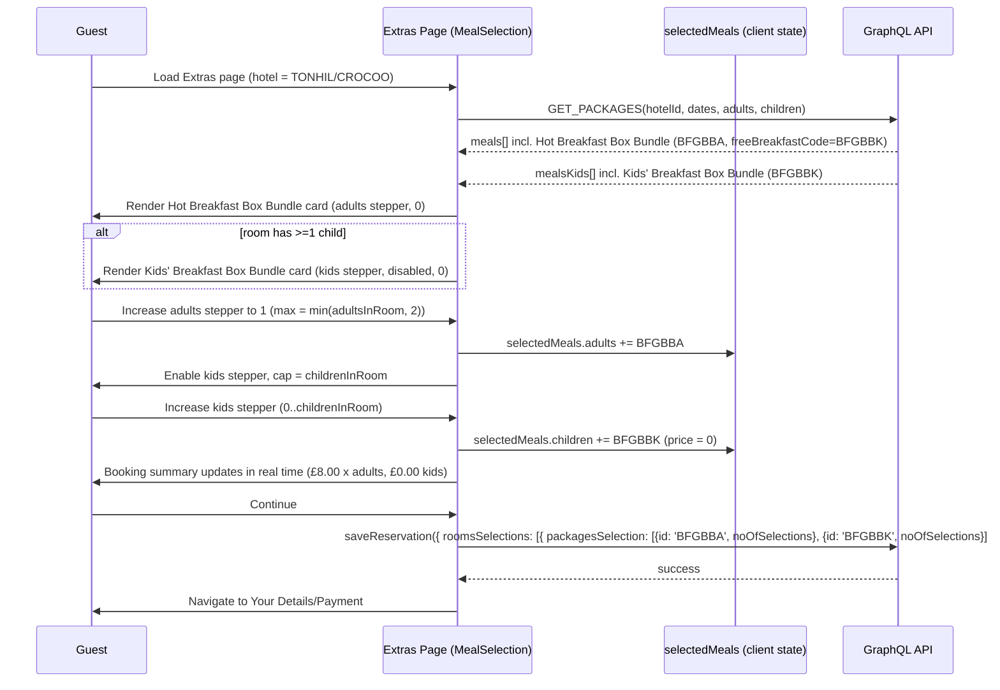

# Design Document

## Overview

This spec covers the frontend implementation of two new purchasable meal bundles — the **Hot
Breakfast Box Bundle** (`BFGBBA`) and the **Kids' Breakfast Box Bundle** (`BFGBBK`) — on the
Extras page ("Add meals for entire stay" section) of the **PI** (`premier-inn`), **PIB**
(`business-booker`), and **CCUI** (`ccui`) apps in `frontend/pi-front-end-applications`, for
hotels that have both codes configured in the Opera pre-payment table (currently TONHIL and
CROCOO only, per OCB-2582).

No parent design steering document exists for this feature; this design is derived from the
full verbatim CTECH-12472 ticket text and grounded in the codebase's **existing meal-bundle
card mechanism** — the same one already used for the Breakfast Roll Bundle, Lighter Bundle,
and Continental Bundle:

- The **`MealSelection`** organism
  (`pi-components-catalog/organisms/src/ancillaries/MealSelection`), which renders adult meal
  cards and a separate children's-meals block for the same page, and already implements a
  "buy an eligible adult meal, unlock a linked/capped kids' meal" mechanism via the
  `freeBreakfastOption` / `freeBreakfastCode` / `freeBreakfastMaxPerMeal` fields already
  returned on `meals[]` by `GET_PACKAGES`.
- The **`MealItem`** molecule
  (`pi-components-catalog/molecules/src/ancillaries/MealItem`), which already renders exactly
  the card shape this ticket describes: title, description, price formatted as
  `"<price> per adult/day (<total> for <nights> night(s))"` (see `renderPrice` in
  `MealItem.component.tsx`), an "Allergy & Nutrition info"-style link (`allergyInfo()`), a
  `controller` slot for the quantity stepper, and the exact condition-note copy key the ticket
  specifies, `upsell.label.promoText.freeKidsMeal`.
- The **`AddSubtract`** atom (`@whitbread-eos/atoms`), already used by `MealSelection` as the
  adult/kids quantity stepper, with externally-supplied `isPlusDisable`/`isSubtractDisable`
  booleans — i.e. min/max/cap logic already lives in the calling organism, not the atom.

### Design approach

This design leverages the existing meal-bundle pattern and makes minimal assumptions about
new infrastructure:

1. **No new Unleash feature flags.** The ticket specifies that enabling/disabling the feature
   per hotel is managed via the **Opera pre-payment table** (`BFGBBA`/`BFGBBK` configured or
   not), which already flows through the existing `GET_PACKAGES` response — a hotel without
   both codes configured simply never returns the two bundles. Feature flags are unnecessary.
2. **CCUI is in scope**, with its own acceptance criterion (scenario 4.1) for the agent-facing
   "Add" interaction. The feature is not PI-only.
3. **No new GraphQL fields are required.** `meals[]` already carries `freeBreakfastOption`,
   `freeBreakfastCode`, `freeBreakfastMaxPerMeal`, and `upsellType` in the current
   `GET_PACKAGES` query (`pi-components-catalog/api/src/queries/ancillaries/getPackages.ts`)
   — the two bundles are new **data rows** sourced from the pre-payment table, not a schema
   change. This directly aligns with the ticket's requirement: "Packages are retrieved via
   the existing meals/extras API... no new API needed."
4. **Real Opera package codes are used** (`BFGBBA` adult, `BFGBBK` kids) per the ticket's
   specification.
5. **The component family is `MealSelection`/`MealItem`** — the ticket's card shape (adult
   quantity stepper, "per adult/day" pricing, linked free kids' item) matches the existing
   meal-bundle pattern already used for Breakfast Roll Bundle/Lighter Bundle/Continental
   Bundle, not the simpler toggle-style extras used for early check-in/late check-out/Wi-Fi.

## Architecture





## Components and Interfaces

### Reused components (`pi-components-catalog`) — no structural rewrite

| Component | Tier | Role for this feature |
|---|---|---|
| `MealSelection` | organism (`organisms/src/ancillaries/MealSelection`) | Orchestrates the adult meal list and the separate children's-meals block. Extended to recognise `BFGBBA`/`BFGBBK` and to apply this feature's specific bounds (adult max `min(adultsInRoom, 2)`; kids max = children in room, not the generic `freeBreakfastMaxPerMeal` value used by other bundles). |
| `MealItem` | molecule (`molecules/src/ancillaries/MealItem`) | Renders the Hot Breakfast Box Bundle card as-is: title, `renderPrice`-formatted price, description, `controller` (AddSubtract), allergy link, and the `upsell.label.promoText.freeKidsMeal` condition note via `freeBreakfastOption`. No code change expected to this component itself. |
| Children's meal card (existing block in `MealSelection`, lines rendering `childrenMeals`) | organism-internal | Renders the Kids' Breakfast Box Bundle card: product image, title, price rendering (free, matching other free breakfast meals), kids stepper, allergy link. Already gated on `childrenMeals.length > 0` (Requirement 2.1/2.2) and already links kids items to a qualifying adult item via `freeBreakfastCode`. |
| `AddSubtract` | atom (`@whitbread-eos/atoms`) | Quantity stepper for both bundles. `isPlusDisable`/`isSubtractDisable` are computed by `MealSelection` per this feature's bounds (Requirements 3, 4, 5), not by the atom itself. |

### New logic in `MealSelection` (no new component files expected)

1. **Adult stepper cap** (Requirement 5): today's adult meal steppers are generally bounded by
   room occupancy/inventory; this bundle additionally hard-caps at 2 regardless of how many
   adults are in the room (`min(adultsInRoom, 2)`). This is bundle-specific and needs an
   explicit cap check keyed off the `BFGBBA` id, alongside the existing availability checks.
2. **Kids stepper gating and cap** (Requirements 3, 4): the kids stepper's
   `isSubtractDisable`/`isPlusDisable` are derived from (a) whether the linked adult bundle
   (`freeBreakfastCode === 'BFGBBK'` on the `BFGBBA` row) has quantity >= 1, and (b) the number
   of children in the room — reusing the existing `freeBreakfastCode` linkage and the existing
   `kidsPerRoom`/children-count plumbing already in `MealSelection`, but overriding the generic
   `freeBreakfastMaxPerMeal` cap with "children in room" per this ticket (see Open Question 3
   below on how this interacts with the multi-adult edge case).
3. **CCUI variant** (Requirement 4, scenario 4.1): CCUI already renders `MealSelection` for its
   own ancillaries page (`apps/next-apps/ccui/src/page-helper/ancillaries/page.ccui.tsx`) and
   already branches some copy/behaviour for the agent view (e.g.
   `t('ccui.amend.updateMealSelection')`). This ticket requires an agent-facing "Add"/"Remove"
   style control for the Kids' Breakfast Box Bundle that adds/removes it for **all** children
   in the room at once, rather than an incrementing stepper — see Open Questions for the exact
   control styling to confirm with design.
4. **Cascading removal**: if the adult (`BFGBBA`) quantity is reduced to 0 after kids' bundles
   were selected, the room's `BFGBBK` selections are removed, mirroring the existing
   adult-meal-removal cascade already present in `MealSelection` for other free-linked meals.

### App-level wiring

- **PI** (`apps/next-apps/premier-inn/src/page-helper/ancillaries/page.pi.tsx`): no new
  feature-flag reads (see Key Changes above); the two bundles render automatically once
  `GET_PACKAGES` returns them for the hotel. The `roomsSelections` builder feeding
  `saveReservation` needs no shape change — see API Contracts.
- **CCUI** (`apps/next-apps/ccui/src/page-helper/ancillaries/page.ccui.tsx`): same data path;
  the agent-facing interaction difference (scenario 4.1) is a `MealSelection`-level
  presentation branch, not a separate query/mutation.
- **PIB** (`apps/next-apps/business-booker/src/page-helper/guest-details/page.bb.tsx`): the
  current booking flow already renders the shared `MealSelection` at the guest-details step,
  so wire the bundles through that component and trace its existing `selectedMeals`/submission
  path; no separate ancillaries integration point is needed.

## Data Models

### GraphQL: `GET_PACKAGES` — no schema change

The existing query (`pi-components-catalog/api/src/queries/ancillaries/getPackages.ts`)
already requests everything needed on `meals[]`:

```graphql
meals {
  allergyInfoLabel
  allergyInfoSrc
  currency
  description
  freeBreakfastCode       # expected: 'BFGBBK' on the BFGBBA row
  freeBreakfastMaxPerMeal
  freeBreakfastOption      # expected: true on the BFGBBA row
  id                       # expected: 'BFGBBA' for the Hot Breakfast Box Bundle
  imageSrc
  name
  order
  price
  basePrice
  isFree
  upsellType              # expected: 'breakfast' on the BFGBBA row;
}
mealsKids {
  allergyInfoLabel
  allergyInfoSrc
  currency
  description
  id                       # expected: 'BFGBBK' for the Kids' Breakfast Box Bundle
  imageSrc
  name
  order
  price
  totalPrice
}
```

For participating hotels (TONHIL, CROCOO), the backend/pre-payment-table data is expected to
return one new `meals[]` entry (`id: 'BFGBBA'`) and one new `mealsKids[]` entry
(`id: 'BFGBBK'`), consistent with how other meal bundles (Breakfast Roll Bundle, etc.) are
already returned. **No new fields, no new query, and no client-visible schema change are
required** — this is a data-only change on the backend/Opera side (OCB-2582 already covers the
pre-payment table; any `meals[]`/`mealsKids[]` population work is backend/`book-pay` scope, not
covered by this frontend spec).

### Client-side selection state

No new state container. Selections use the existing per-room adult/children selection model
already used for other meal bundles in `MealSelection` (`SelectedMealsPerRoom.adults` /
`.children`, both `string[]` of selected meal ids), with `BFGBBA` and `BFGBBK` ids appended
like any other meal.

### Bundle-specific bounds (new, not derived from generic fields)

```typescript
// Conceptual — not necessarily a new named export; may be inline constants in MealSelection.
const HOT_BREAKFAST_BOX_BUNDLE_ID = 'BFGBBA';
const KIDS_BREAKFAST_BOX_BUNDLE_ID = 'BFGBBK';
const HOT_BREAKFAST_BOX_BUNDLE_MAX_ADULTS = 2; // min(adultsInRoom, 2) — Requirement 5.2
// Kids' cap = number of children in the room (not the generic freeBreakfastMaxPerMeal value)
// BFGBBA.upsellType = 'breakfast' (required for children availability calculation)
// BFGBBA.freeBreakfastOption = true (unlocks linked kids meal)
// BFGBBA.freeBreakfastCode = 'BFGBBK' (links to kids meal)
```

## API Contracts

### `GET_PACKAGES` (query) — unchanged

No variable or shape changes. The two bundles are additive rows in `meals[]`/`mealsKids[]`,
present only for hotels with both `BFGBBA` and `BFGBBK` configured (Requirement 7).

### `saveReservation` (mutation) — unchanged shape, new package codes in the payload

```graphql
mutation saveBookingInformation($ancillariesCriteria: AncillariesCriteria!) {
  saveReservation(ancillariesCriteria: $ancillariesCriteria)
}
```

`AncillariesCriteria.roomsSelections` is `[RoomPackageSelectionInput]`, each with
`packagesSelection: [PackageSelectionInput]` (`{ id, noOfSelections }`). On submission
(Requirement 8):

```typescript
// Per room, appended alongside other selected meals/extras:
{ id: 'BFGBBA', noOfSelections: <adultQty> }
{ id: 'BFGBBK', noOfSelections: <kidsQty> }
```

The package/mutation flow calculates the corresponding prices; no `price` field is sent in this input.

No mutation contract change is required — this is additive data within the existing
`packagesSelection` shape used by every other meal/extra today.

## Error Handling

- **Hotel not configured (`BFGBBA`/`BFGBBK` absent from `GET_PACKAGES` response)**: cards
  simply do not render — same "absence = not offered" convention as every other meal/extra
  (Requirement 7).
- **Adult quantity reduced to 0 after kids' bundles selected**: cascade-remove the room's
  `BFGBBK` selections client-side before the guest can continue, mirroring `MealSelection`'s
  existing cascading removal for other free-linked children's meals.
- **Multi-adult free-kids edge case (Open Question 3)**: not resolved by this design;
  implementation must not silently allow the kids stepper to exceed the per-room children
  count without a product decision (see Open Questions).
- **`saveReservation` failure**: reuse the Extras page's existing mutation-error/notification
  handling; no bundle-specific error path is introduced.
- **CCUI agent interaction (Open Question 1)**: until the exact control styling is confirmed
  with design, implementation of the CCUI-specific control should default to the safest
  interpretation (explicit confirmation before adding/removing for all children) and be
  revisited once that confirmation is available.

## Testing Strategy

- **Unit/component tests** (Jest + Testing Library, co-located under `pi-components-catalog`):
  - `MealSelection.test.tsx`: add cases for — Hot Breakfast Box Bundle card renders with
    correct title/description/price format/stepper label/allergy link/condition note
    (Requirement 1); Kids' Breakfast Box Bundle card shown only when children > 0 and the
    linked adult meal (BFGBBA) has truthy `upsellType`, `freeBreakfastOption`, and
    `freeBreakfastCode` (Requirement 2.1 contract verification); kids stepper disabled
    while adults = 0 (Requirement 3); kids stepper enabled and capped at children count
    once adults >= 1 (Requirement 4.1, 4.2); adult stepper capped at `min(adultsInRoom, 2)`
    (Requirement 5); cascading removal when adult quantity returns to 0; existing Breakfast
    Roll Bundle/Lighter Bundle/Continental Bundle behaviour unaffected (regression).
  - `MealItem.test.tsx`: extend only if any new prop/variant is introduced to support the
    "kids" stepper label or "FREE*" price text; otherwise no change expected since the
    component already supports this shape generically.
  - `jest-axe` accessibility checks on the new/extended card states (adult card, kids card
    disabled, kids card enabled).
- **Page-level tests**: extend `page.pi.test.tsx` and `page.ccui.test.tsx` (and the PIB
  equivalent, once its integration point is confirmed) for booking-summary updates
  (Requirement 6) and the `saveReservation` payload mapping to `BFGBBA`/`BFGBBK`
  (Requirement 8).
- **Non-participating hotel regression**: a test fixture without `BFGBBA`/`BFGBBK` in the
  `GET_PACKAGES` response confirms neither card renders and other bundles/extras are
  unaffected (Requirement 7).
- **Localisation**: snapshot/text-assertion tests for both `en` and `de` locales once German
  copy is supplied (Requirement 9); until then, tests should assert the i18n **keys** are used
  rather than hard-coded English strings, so German copy can land without a test rewrite.
- **Responsive layout**: no new automated viewport tests are proposed beyond what already
  exists for `MealItem`/`MealSelection`, since the bundles reuse that component's existing
  responsive styles (Requirement 10).
- **E2E (Playwright, `qa/`)**: out of scope for this FE component spec; recommended as a
  follow-up `QA` spec once the CCUI interaction and German copy are confirmed.
- No new property-based or performance/security testing is warranted — this is UI/state logic
  layered on an existing, already-tested meal-selection data flow.

## Open Questions

These are carried forward explicitly and are **not** resolved by this spec:

1. **CCUI agent interaction (scenario 4.1) is unconfirmed.** The exact agent-facing
   interaction/UI for adding or removing the Kids' Breakfast Box Bundle for all children in a
   room (button vs. stepper vs. confirmation step) has not been finalised with design and
   must be confirmed before implementation of Requirement 4.3 can be completed.
2. **German translations are pending.** The ticket confirms both English and German copy must
   be correct (Requirement 9), but exact German strings for the new bundle titles,
   descriptions, stepper labels, and condition note have not yet been supplied by the
   localisation/content team. Implementation should land the English copy behind i18next keys
   now and add the German values once translated, without further code changes.
3. **Multi-adult free-kids-breakfast interaction is unresolved.** If 2 adults in a room each
   purchase a bundle offering a free kids breakfast, this could yield up to 4 free kids
   breakfasts (2 per qualifying adult purchase per the ticket's assumption), which may conflict
   with the per-room children-count cap in Requirement 4.2. Whether the aggregate entitlement
   should override, add to, or be capped by the per-room children count needs explicit
   product/business clarification. This design deliberately does not pick an interpretation —
   implementation should not proceed on this specific interaction until it is resolved.
4. **Allergy/nutrition content and product imagery are pending.** The ticket confirms these
   will be supplied by the F&B/design team but are not yet available. The "Allergy & Nutrition
   info" link (Requirements 1.5, 2.7) and the Kids' Breakfast Box Bundle product image
   (Requirement 2.3) should be wired to real content sources as soon as they are supplied;
   placeholder/staging content should not ship to production.
5. **PIB integration point.** `business-booker` has no `page-helper/ancillaries/` equivalent
   to PI/CCUI; its extras/meals surfaces are `ExtrasForm`/`SelectExtrasForm`. The exact
   integration point for the two bundles in the PIB booking journey should be confirmed with
   the PIB team during implementation planning.
