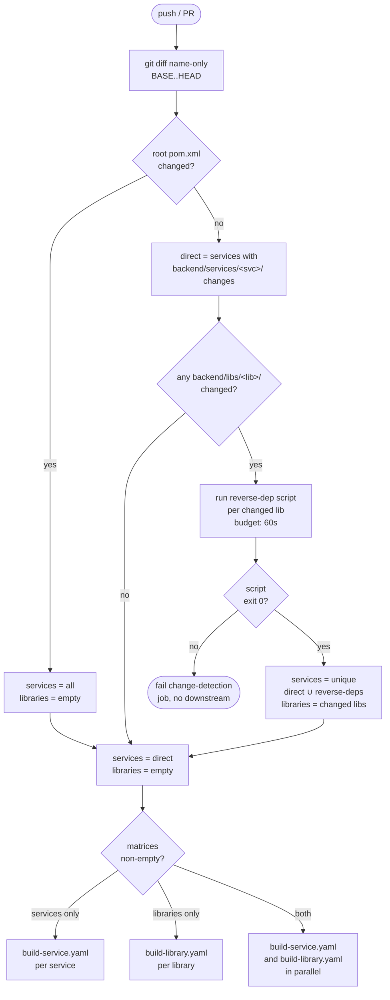

# Design Document

## Overview

This design migrates the standalone library `uk.co.whitbread.shared:commons-cdh-lib` into the `digital-backend-monorepo` as the Maven module `backend/libs/commons-cdh-lib/`, while preserving full Git history, keeping the upstream repository operational for external consumers, and extending CI so that library changes only rebuild services that actually depend on the library.

The migration is fundamentally an **infrastructure and build-system change**. It coordinates four independent work streams:

1. **History-preserving Git import** of the source tree under `backend/libs/commons-cdh-lib/` using `git subtree` (with optional `git filter-repo` path exclusion).
2. **Maven reactor wiring** so `commons-cdh-lib` builds locally and consuming services resolve it from the reactor instead of Nexus.
3. **Selective CI rebuild** driven by a runtime-computed reverse-dependency map parsed from `backend/services/*/pom.xml` files.
4. **Documentation and coexistence**: steering files for the library, no `<distributionManagement>` (so the monorepo cannot publish), and the standalone Nexus pipeline left untouched.

The design is consumer-driven by the requirements document at `.kiro/specs/commons-cdh-lib-monorepo-migration/requirements.md` and addresses all nine numbered requirements.

The Source_Repository URL is intentionally not yet fixed — see [Decisions and Open Questions](#decisions-and-open-questions).

## Architecture

### High-Level Workstreams

```mermaid
flowchart LR
    A[Source_Repository<br/>standalone Git repo<br/>+ Nexus publish] -->|git subtree add<br/>+ optional filter-repo| B[Monorepo<br/>backend/libs/commons-cdh-lib/]
    B --> C[Root pom.xml<br/>+ &lt;module&gt; entry<br/>+ &lt;dependencyManagement&gt; v=&#36;{revision}]
    C --> D[Consumer Service POMs<br/>piba-account-service-opera<br/>spending-entity-service]
    C --> E[CI: ci.yaml<br/>reverse-dep map<br/>matrix dispatch]
    B --> F[.kiro/steering/<br/>commons-cdh-lib/]
    A -.continues to publish.-> G[Nexus<br/>External_Consumers]
    style A fill:#eef
    style G fill:#fed
```

The Source_Repository continues to publish to Nexus during the transition; the monorepo never deploys the library.

### Selective CI Rebuild — Change-Detection Flow



The `services` and `libraries` matrices are emitted independently. When the library changes and has consumers, both matrices are non-empty and `build-services` and `build-libraries` run in parallel. New consumer services are picked up automatically by re-running the reverse-dep script against every `backend/services/*/pom.xml` (Requirement 4.5).

### Build Order Inside the Reactor

The Maven reactor build order is determined by Maven itself from `<dependency>` graphs. Because two services declare a `<dependency>` on `uk.co.whitbread.shared:commons-cdh-lib`, the library is scheduled before those services automatically (Requirement 2.4). With `-pl <service> -am`, Maven includes the library transitively (Requirement 4.6, 7.2, 7.4).

### Build Composition Semantics

Three properties of the build flow are worth stating plainly so future readers understand exactly what runs where, and why.

1. **Within a single Maven invocation, each module compiles exactly once.** When CI runs `./mvnw verify -pl backend/services/<svc> -am`, the JVM starts once, the reactor sorts its modules in dependency order, and each module's `compile`/`test`/`package` lifecycle runs once. The library is built before the service in the same session — there is no second pass for the library inside the consumer's reactor.

2. **When the library changes, CI dispatches both a library-dedicated job AND consumer-service jobs.** The `detect-changes` job emits a matrix that contains the changed library plus every consumer service identified by the Reverse_Dependency_Map. The library-dedicated job runs `mvn verify -pl backend/libs/<lib>` against the library's own quality gate (its own tests, its own SonarCloud project, its own coverage threshold). Each consumer-service job runs `mvn verify -pl backend/services/<svc> -am` to validate the integration end-to-end. Both are needed: the library job evaluates the library against its own gate; the consumer jobs evaluate that consumers still pass with the library's new state. This is also why the library is never demoted to "implicit dependency" simply because services depend on it.

3. **The build redundancy across these jobs is intentional shift-left.** When the library changes, its tests run inside the dedicated lib runner AND inside each consumer runner's `-am` pass. The library is also compiled in each runner's container because GitHub Actions matrix jobs run in independent containers with no shared state. This duplicate work is the cost of horizontal parallelism and gives faster feedback: if a library regression breaks a consumer, both jobs surface it independently. The escape hatch when this stops being acceptable (heavy library tests, large consumer count) is to have the library job upload the built artifact via `actions/cache` or `actions/upload-artifact` and have consumer jobs declare `needs: [library-job]` and download the cached artifact, avoiding the rebuild. That trades parallelism for serial dependency and is not adopted at this stage.

The "library-only" case — where only `build-library.yaml` runs and `build-service.yaml` is skipped — applies only when the library has no consumer services yet (the empty-Reverse_Dependency_Map case, Requirement 4.9). In every other scenario when the library changes, the library job and the consumer-service jobs run together in parallel matrices.

## Components and Interfaces

### 1. Library Import (Requirements 1, 9)

**Approach**: `git subtree add` without `--squash`, using a dedicated remote `commons-cdh-lib-upstream`. If any upstream paths must be dropped (Requirement 1.6), `git filter-repo --invert-paths` is used to produce a rewritten temporary clone that is then pulled in via subtree.

**Sequence (executed once, by a maintainer)**:

1. **Pre-flight checks** (Requirement 1.7, 9.4, 9.5):
   - Verify `backend/libs/commons-cdh-lib/` is empty (only `.gitkeep` permitted) — otherwise abort.
   - `git ls-remote <SOURCE_URL>` — must succeed (URL reachable).
   - `git ls-remote <SOURCE_URL> <SHA>` or fetch + `git cat-file -e <SHA>^{commit}` against the upstream remote — must resolve.
   - If either check fails, halt before any commit is created and surface a message naming the failing value (URL or SHA).
2. **Add remote**: `git remote add commons-cdh-lib-upstream <SOURCE_URL>`. Per Requirement 9.1, this remote is the canonical record of the upstream URL — there is no separate URL stored in the merge commit message.
3. **(Optional) Path exclusion** (Requirement 1.6): If exclusions are required, clone the upstream into a scratch directory, run `git filter-repo --invert-paths --path <excluded-path-1> --path <excluded-path-2> ...`, and use the rewritten repo as the subtree source. Otherwise skip this step.
4. **Subtree import**:
   ```
   git fetch commons-cdh-lib-upstream <BRANCH>
   git subtree add --prefix=backend/libs/commons-cdh-lib commons-cdh-lib-upstream <SHA>
   ```
   (No `--squash` — Requirement 1.3.)
5. **Use the merge commit produced by `git subtree add` unmodified.** `git subtree` automatically generates a merge commit with structured trailers (`git-subtree-dir`, `git-subtree-mainline`, `git-subtree-split`) that capture the imported path, the mainline parent, and the upstream source SHA. No manual amendment is required, matching the convention used for previously imported services in this monorepo.

**Merge commit format produced by `git subtree add`** (matches `backend/services/<svc>/` import commits already in the repo):

```
Add 'backend/libs/commons-cdh-lib/' from commit '<40-char-hex-SHA>'

git-subtree-dir: backend/libs/commons-cdh-lib
git-subtree-mainline: <mainline-parent-SHA>
git-subtree-split: <40-char-hex-SHA>
```

The `git-subtree-split` trailer holds the upstream source SHA (Requirement 9.2). The upstream URL is preserved by the configured `commons-cdh-lib-upstream` Git remote rather than embedded in the commit message (Requirement 9.1) — identical to how the existing service imports record their provenance.

**Verifying upstream history is preserved**: `git log <imported-SHA>` walks back through the upstream commit graph with original authors, messages, and timestamps intact. Note that `git log -- backend/libs/commons-cdh-lib/` applies path-based history simplification and may show only the merge commit; this is expected behaviour and matches what `git log -- backend/services/<svc>/` shows for previously imported services.

**Forward-syncs** after the initial import use the standard `git subtree pull --prefix=backend/libs/commons-cdh-lib commons-cdh-lib-upstream <branch>` workflow already familiar to the team — not documented further here.

**Why not `--squash`**: Requirement 1.2 mandates per-commit history preservation under `backend/libs/commons-cdh-lib/`; squashing collapses that into one synthetic commit and would fail an audit by `git log -- backend/libs/commons-cdh-lib/`.

**Why a dedicated remote**: Requirement 9.2 requires `commons-cdh-lib-upstream` to remain configured in the monorepo so future `git subtree pull` invocations resolve identically.

### 2. Maven Module Wiring (Requirement 2)

**Root POM changes** (`pom.xml`):

- Add `<module>backend/libs/commons-cdh-lib</module>` to `<modules>`.
- Update the existing `<dependencyManagement>` entry for `commons-cdh-lib` to use `${revision}`:

  ```xml
  <dependency>
      <groupId>uk.co.whitbread.shared</groupId>
      <artifactId>commons-cdh-lib</artifactId>
      <version>${revision}</version>
  </dependency>
  ```

  (Replacing the current `<version>${wb.commons-cdh.version}</version>`. The `wb.commons-cdh.version` property is removed.)
- If the imported library declares dependencies not yet present in the root `<dependencyManagement>`, add explicit-version entries (Requirement 2.11). The library POM then omits versions for those (Requirement 2.10).

**Library POM skeleton** (`backend/libs/commons-cdh-lib/pom.xml`):

```xml
<?xml version="1.0" encoding="UTF-8"?>
<project xmlns="http://maven.apache.org/POM/4.0.0">
    <modelVersion>4.0.0</modelVersion>

    <parent>
        <groupId>uk.co.whitbread</groupId>
        <artifactId>digital-backend-monorepo</artifactId>
        <version>${revision}</version>
        <relativePath>../../pom.xml</relativePath>
    </parent>

    <groupId>uk.co.whitbread.shared</groupId>
    <artifactId>commons-cdh-lib</artifactId>
    <version>${revision}</version>
    <packaging>jar</packaging>

    <name>commons-cdh-lib</name>
    <description>Whitbread CDH integration library (migrated from standalone repo)</description>

    <!-- NO <distributionManagement> — Requirement 5.2 -->

    <dependencies>
        <!-- inherited versions only — Requirement 2.10/2.11 -->
        <!-- e.g. -->
        <!--
        <dependency>
            <groupId>org.springframework.boot</groupId>
            <artifactId>spring-boot-starter-web</artifactId>
        </dependency>
        -->
    </dependencies>
</project>
```

The library inherits compiler config (Java 25), Lombok/MapStruct annotation processors, JaCoCo, Checkstyle, and `flatten-maven-plugin` from the Parent_POM `pluginManagement`. No plugin block is needed in the library POM unless library-specific overrides are required (Requirement 8.2).

**flatten-maven-plugin** is already configured at the parent in `<build><plugins>`. Because `<flattenMode>resolveCiFriendliesOnly</flattenMode>` is set, `${revision}` in the library's `<version>` and in the root `<dependencyManagement>` entry both flatten to the literal version on install/deploy (Requirement 2.6).

**Reactor resolution**: With the `<module>` entry plus an in-reactor `${revision}` match between the library version and the dependencyManagement entry, Maven resolves the dependency from the local reactor and skips remote fetch (Requirement 2.7). Without the `<module>` entry, Maven falls back to Nexus (Requirement 2.8).

### 3. Consumer Service POM Updates (Requirement 3)

#### `backend/services/piba-account-service-opera/pom.xml`

**Current state** (excerpt — already version-less):

```xml
<dependency>
    <groupId>uk.co.whitbread.shared</groupId>
    <artifactId>commons-cdh-lib</artifactId>
</dependency>
```

**No diff required**. The dependency is already version-less and will inherit `${revision}` from the updated root `<dependencyManagement>`. No changes are needed in this consumer POM beyond what the root POM update implies.

#### `backend/services/spending-entity-service/pom.xml`

**Current state** (excerpt):

```xml
<dependency>
    <groupId>uk.co.whitbread.shared</groupId>
    <artifactId>commons-cdh-lib</artifactId>
    <exclusions>
        <exclusion>
            <groupId>uk.co.whitbread.shared</groupId>
            <artifactId>commons-exceptions</artifactId>
        </exclusion>
        <exclusion>
            <groupId>commons-fileupload</groupId>
            <artifactId>commons-fileupload</artifactId>
        </exclusion>
    </exclusions>
</dependency>
```

**No diff required**. The dependency is already version-less, and the two existing exclusions are preserved verbatim (Requirement 3.3). The version is sourced from the updated root `<dependencyManagement>`.

**Net consumer-POM change-set**: zero textual edits to either consumer POM. The migration's behavioural change is delivered entirely by (a) the root POM update and (b) the new `backend/libs/commons-cdh-lib/` module. This is an explicit design choice — minimising consumer-POM churn reduces the per-service blast radius of the migration.

### 4. Selective CI Rebuild (Requirement 4)

#### 4.1 Reverse-Dependency Script

**Recommended approach**: a small Bash + `xmllint` (or `yq`) script at `.github/workflows/scripts/reverse-deps.sh` that parses every `backend/services/*/pom.xml` and emits a JSON array of services that declare a direct `<dependency>` matching a given `groupId:artifactId`.

**Interface**:

```
reverse-deps.sh <groupId> <artifactId>
  → stdout: JSON array, e.g. ["piba-account-service-opera","spending-entity-service"]
  → exit 0  on success (including empty array)
  → exit 1  on malformed POM or any unrecoverable error (with stderr message naming the file)
  → exit 124 if internal timeout exceeded (matches GNU `timeout` convention)
```

**Parsing strategy** (per service POM):

```
xmllint --xpath "//*[local-name()='dependency'][\
   *[local-name()='groupId' and normalize-space(text())='${GROUP}'] and \
   *[local-name()='artifactId' and normalize-space(text())='${ARTIFACT}']]" \
  backend/services/<svc>/pom.xml
```

A non-empty XPath result means the service declares the dependency. Namespace-agnostic `local-name()` matching tolerates the default Maven POM namespace.

**Why a script over `mvn dependency:tree` / `mvn -pl <lib> -amd help:evaluate`**:

| Aspect | Bash + xmllint | Maven-based |
|---|---|---|
| Cold-cache runtime | <2s on a 3-service repo, ~10s at 30 services | 30-60s (JVM + plugin warm-up) |
| Transitive accuracy | Direct deps only | Direct + transitive |
| Setup | None (xmllint is preinstalled on runners) | Requires Maven cache priming |
| Failure modes | XML parse errors are explicit | Maven errors are mixed with build errors |
| 60-second budget (Req 4.1) | Comfortable headroom | Tight, may exceed |

Requirement 4.2 explicitly says **"excluding transitive dependencies"** — so direct-only inspection is what's required. Script-based parsing is the recommendation; it is faster, simpler, and exactly matches the requirement scope.

**Trade-off accepted**: if a future service uses `<dependencyManagement>` BOM imports to pull in `commons-cdh-lib` indirectly (no direct `<dependency>`), the script will not detect it. This is consistent with Requirement 4.2's "directly declared" wording and is documented in the script header.

#### 4.2 `ci.yaml` Changes

The existing `detect-changes` job is extended to emit two separate matrix outputs: one for services and one for libraries. The script logic is extracted to a standalone file `.github/workflows/scripts/detect-changed-modules.sh` so it can be unit-tested with `bats` and re-used outside CI (e.g., in pre-commit hooks). The orchestrator workflow then has two parallel matrix branches: one calling the reusable `build-service.yaml`, and one calling the new reusable `build-library.yaml`.

```yaml
jobs:
  detect-changes:
    name: Detect Changed Modules
    runs-on: tooling-default-runner-scale-set
    outputs:
      services: ${{ steps.changes.outputs.services }}
      libraries: ${{ steps.changes.outputs.libraries }}
    steps:
      - name: Checkout code
        uses: actions/checkout@v4
        with:
          fetch-depth: 0

      - name: Detect changed modules
        id: changes
        run: .github/workflows/scripts/detect-changed-modules.sh

  build-services:
    needs: detect-changes
    if: ${{ needs.detect-changes.outputs.services != '[]' }}
    strategy:
      fail-fast: false
      matrix:
        service: ${{ fromJson(needs.detect-changes.outputs.services) }}
    uses: ./.github/workflows/build-service.yaml
    with:
      service-name: ${{ matrix.service }}
    secrets: inherit

  build-libraries:
    needs: detect-changes
    if: ${{ needs.detect-changes.outputs.libraries != '[]' }}
    strategy:
      fail-fast: false
      matrix:
        library: ${{ fromJson(needs.detect-changes.outputs.libraries) }}
    uses: ./.github/workflows/build-library.yaml
    with:
      library-name: ${{ matrix.library }}
    secrets: inherit
```

`.github/workflows/scripts/detect-changed-modules.sh` (sketch — full bash script, kept under ~80 lines for readability):

```bash
#!/usr/bin/env bash
set -euo pipefail

ALL_SERVICES=$(find services -maxdepth 2 -name pom.xml -exec dirname {} \; \
  | xargs -I{} basename {} | jq -R -s -c 'split("\n") | map(select(length>0))')

# 1. compute changed files between BASE_SHA and HEAD_SHA (existing logic)
CHANGED_FILES=$(git diff --name-only "$BASE_SHA" "$HEAD_SHA")

# 2. root pom.xml → all services, no libraries (Requirement 4.8)
if echo "$CHANGED_FILES" | grep -q "^pom.xml$"; then
  echo "services=$ALL_SERVICES" >> "$GITHUB_OUTPUT"
  echo "libraries=[]"             >> "$GITHUB_OUTPUT"
  exit 0
fi

# 3. direct service path changes
DIRECT_SERVICES=$(echo "$CHANGED_FILES" | grep -oE '^backend/services/[^/]+/' \
  | sort -u | sed 's:^backend/services/::; s:/$::' \
  | jq -R -s -c 'split("\n") | map(select(length>0))')

# 4. changed libraries
CHANGED_LIBS=$(echo "$CHANGED_FILES" | grep -oE '^backend/libs/[^/]+/' \
  | sort -u | sed 's:^backend/libs/::; s:/$::' \
  | jq -R -s -c 'split("\n") | map(select(length>0))')

# 5. for each changed library, find services that consume it
REVERSE_DEPS="[]"
for LIB in $(echo "$CHANGED_LIBS" | jq -r '.[]'); do
  GROUP=$(xmllint --xpath "string(/*[local-name()='project']/*[local-name()='groupId'])" \
    "backend/libs/$LIB/pom.xml")
  ARTIFACT=$(xmllint --xpath "string(/*[local-name()='project']/*[local-name()='artifactId'])" \
    "backend/libs/$LIB/pom.xml")
  REV=$(timeout 60 .github/workflows/scripts/reverse-deps.sh "$GROUP" "$ARTIFACT")
  REVERSE_DEPS=$(echo "$REVERSE_DEPS $REV" | jq -c -s 'add | unique')
done

# 6. emit deduplicated outputs
SERVICES=$(echo "$DIRECT_SERVICES $REVERSE_DEPS" | jq -c -s 'add | unique')
echo "services=$SERVICES"  >> "$GITHUB_OUTPUT"
echo "libraries=$CHANGED_LIBS" >> "$GITHUB_OUTPUT"
```

**Notes**:

- The script is deliberately small and linear. Each step has one job: compute changed files, classify them, map libraries to reverse-deps, emit two matrix outputs.
- `services` and `libraries` are independent matrix outputs. When the library changes and has consumers, both matrices are non-empty and the two `build-*` jobs run in parallel.
- `timeout 60` enforces the Requirement 4.1 budget; an exit code of 124 (timeout) or 1 (parse error) propagates to the change-detection job and prevents any downstream dispatch.
- `jq ... | unique` deduplicates the service union (Requirement 4.4 — "each service appearing at most once").
- A bats test suite under `.github/workflows/scripts/test/` exercises the script against fixture POMs (matching service, non-matching service, malformed POM, missing coordinates, empty result). See [Verification Approach](#verification-approach).

#### 4.3 Reusable Workflows: `build-service.yaml` and `build-library.yaml`

The single `build-service.yaml` is split into two reusable workflows. Each owns its own concerns (Maven module path, Sonar project key, artifact upload behaviour) without conditional branching inside one file.

**`build-service.yaml`** (existing, with one change — add `-Dsonar.exclusions=backend/libs/**` so library code is not attributed to the service Sonar project):

```yaml
- name: Maven build
  run: mvn $MAVEN_CLI_OPTS verify -pl "backend/services/$SERVICE_NAME" -am

- name: Sonar scan
  run: |
    mvn $MAVEN_CLI_OPTS sonar:sonar \
      -pl "backend/services/$SERVICE_NAME" -am \
      -Dsonar.exclusions=backend/libs/** \
      -Dsonar.projectKey="whitbread-eos_digital-monorepo_$SERVICE_NAME" \
      -Dsonar.projectName="digital-monorepo :: $SERVICE_NAME" \
      -Dsonar.host.url=https://sonarcloud.io \
      -Dsonar.organization=whitbread-eos
```

The `-Dsonar.exclusions=backend/libs/**` exclusion (or equivalently `<sonar.exclusions>backend/libs/**</sonar.exclusions>` in the root POM `<properties>`) prevents library code from being reported under the service's Sonar project. Without it, every library file would be attributed to whichever service triggered the scan. The root-POM property is preferred long-term because it applies uniformly to every service and avoids per-service YAML drift.

**`build-library.yaml`** (new):

```yaml
name: Build Library

on:
  workflow_call:
    inputs:
      library-name:
        description: 'Name of the library to build (e.g. commons-cdh-lib)'
        required: true
        type: string

jobs:
  build:
    name: Build ${{ inputs.library-name }}
    runs-on: tooling-default-runner-scale-set
    permissions:
      actions: read
      contents: read
    env:
      LIBRARY_NAME: ${{ inputs.library-name }}
    steps:
      - name: Checkout code
        uses: actions/checkout@v6
        with:
          fetch-depth: 0

      - name: Set up JDK 25
        uses: actions/setup-java@v5
        with:
          distribution: 'temurin'
          java-version: '25'

      - name: Write settings.xml
        env:
          SETTINGS_XML: ${{ vars.SETTINGS_XML }}
        run: echo "$SETTINGS_XML" | base64 -d > settings.xml

      - name: Cache SonarCloud packages
        uses: actions/cache@v5
        with:
          path: ~/.sonar/cache
          key: ${{ runner.os }}-sonar
          restore-keys: ${{ runner.os }}-sonar

      - name: Cache Maven packages
        uses: actions/cache@v5
        with:
          path: ~/.m2
          key: ${{ runner.os }}-m2-${{ inputs.library-name }}-${{ hashFiles(format('backend/libs/{0}/pom.xml', inputs.library-name), 'pom.xml') }}
          restore-keys: |
            ${{ runner.os }}-m2-${{ inputs.library-name }}-
            ${{ runner.os }}-m2-

      - name: Maven build
        env:
          MAVEN_CLI_OPTS: ${{ vars.MAVEN_CLI_OPTS }}
        run: mvn $MAVEN_CLI_OPTS verify -pl "backend/libs/$LIBRARY_NAME"

      - name: Sonar scan
        env:
          GITHUB_TOKEN: ${{ secrets.GITHUB_TOKEN }}
          SONAR_TOKEN: ${{ secrets.SONAR_TOKEN }}
          MAVEN_CLI_OPTS: ${{ vars.MAVEN_CLI_OPTS }}
        run: |
          mvn $MAVEN_CLI_OPTS sonar:sonar \
            -pl "backend/libs/$LIBRARY_NAME" \
            -Dsonar.projectKey="whitbread-eos_digital-monorepo_$LIBRARY_NAME" \
            -Dsonar.projectName="digital-monorepo :: $LIBRARY_NAME" \
            -Dsonar.host.url=https://sonarcloud.io \
            -Dsonar.organization=whitbread-eos
```

Key differences from `build-service.yaml`:

- No Docker build, container push, Helm release, DIT sync, or release-checks (libraries do not deploy as services).
- Sonar project key uses the `$LIBRARY_NAME` rather than `$SERVICE_NAME`. Each library has its own SonarCloud project (per §8).
- No `-am` flag on `mvn verify`: the library has no upstream reactor dependencies inside the monorepo. If a library ever depends on another library (lib-on-lib), `-am` will be added at that point.
- No `-Dsonar.exclusions=backend/libs/**`: the library scan **wants** to include its own files.
- No artifact upload: services upload their JAR (the deployable). Libraries are consumed via the local Maven reactor, not via uploaded artifacts.

**Optional composite action for shared setup** — both reusable workflows share the first ~30 lines of setup steps (Java, Maven cache, Sonar cache, settings.xml). When a third workflow appears (e.g., `build-tool.yaml`), extract those steps into `.github/actions/setup-maven-build/action.yaml` and reference it from both workflows. This is a follow-up cleanup, not a prerequisite for the library migration.

#### 4.4 New consumer pickup

A new service that declares a `<dependency>` on `commons-cdh-lib` is picked up automatically: the next CI run that touches `backend/libs/commons-cdh-lib/**` re-runs `detect-changed-modules.sh`, which re-reads every `backend/services/*/pom.xml` and includes the new service in the `services` matrix output (Requirement 4.5). No YAML edit is needed.

#### 4.5 Error paths (Requirement 4.7)

| Failure | Detection | CI behaviour |
|---|---|---|
| Malformed POM | `xmllint` non-zero exit | `reverse-deps.sh` exit 1 → `detect-changed-modules.sh` propagates → change-detection job fails with stderr naming the file |
| Script timeout | `timeout 60` returns 124 | Change-detection job fails with `::error::reverse-dep script timed out` |
| Library POM missing groupId/artifactId | `xmllint` returns empty | Script exit 1 with explicit "missing coordinates" message |
| Empty `services` matrix when a library changed | `services == "[]"` and `libraries != "[]"` | `build-libraries` runs alone; `build-services` is skipped via the `if:` guard. Equivalent to the Requirement 4.9 "library-only" behaviour, but without a sentinel object — the second matrix is the natural mechanism. |

All failure paths halt before any `build-*` matrix dispatch.

### 5. Build Verification Flow (Requirement 7)

| Validation | Command | Expectation |
|---|---|---|
| Full reactor | `./mvnw clean install` | Exit 0; library + 3 services built (Req 7.1) |
| Library only | `./mvnw clean install -pl backend/libs/commons-cdh-lib` | Exit 0; jar produced; JaCoCo report at `backend/libs/commons-cdh-lib/target/site/jacoco/` (Req 7.6, 7.7) |
| `piba-account-service-opera` | `./mvnw clean install -pl backend/services/piba-account-service-opera -am` | Exit 0; library built first; zero unit/contract/Checkstyle failures (Req 7.2) |
| `spending-entity-service` | `./mvnw clean install -pl backend/services/spending-entity-service -am` | Exit 0; library built first; zero unit/Checkstyle failures (Req 7.4) |
| Resolution origin | `./mvnw -pl backend/services/<svc> -am dependency:tree -Dverbose` | Library entry shows `(reactor)` rather than a Nexus URL (Req 2.7, 7.10) |
| Checkstyle on library | `./mvnw checkstyle:check -pl backend/libs/commons-cdh-lib` | Zero violations against `google-checkstyle.xml` (Req 7.8) |

The library inherits its JaCoCo configuration from the parent's `<pluginManagement>`. No service-specific JaCoCo merge executions are needed for the library because it has no integration tests by default; if upstream provides them, they are preserved as-is.

### 6. Steering Files (Requirement 6)

Three files under `.kiro/steering/commons-cdh-lib/`, each with `fileMatchPattern` matching the library source path so they activate when the agent works inside `backend/libs/commons-cdh-lib/`:

```
.kiro/steering/commons-cdh-lib/
├── product.md     # responsibilities, intended consumer services, integration points
├── tech.md        # Java 25 / Spring Boot 4.0.6 BOM / Maven build commands
└── structure.md   # package layout and architectural conventions
```

**Front-matter pattern** (mirrors `backend/services/spending-entity-service/`):

```markdown
---
inclusion: fileMatch
fileMatchPattern: "backend/libs/commons-cdh-lib/**"
---

# Tech Stack
...
```

The files are tracked in Git and committed with the migration PR (Requirement 6.6). They are documentation-only and have no effect on Maven (Requirement 6.7).

### 7. Coexistence with Nexus (Requirement 5)

| Concern | Design response |
|---|---|
| Monorepo cannot publish | Library POM omits `<distributionManagement>` entirely. `mvn deploy -pl backend/libs/commons-cdh-lib` then fails with Maven's standard "no DistributionManagement" error rather than silently succeeding (Req 5.2). |
| CI cannot publish | `build-service.yaml` runs `mvn verify`, never `mvn deploy`. No code path writes to Nexus. The `Sonar scan` step uses `sonar:sonar`, which does not deploy artifacts (Req 5.1). |
| Source repo unaffected | The migration is implemented entirely inside `digital-backend-monorepo`. No file in the Source_Repository is touched, no CI/CD config changed, no release cadence altered (Req 5.3). |
| Identical GAV | Library_Coordinates remain `uk.co.whitbread.shared:commons-cdh-lib`; only the version differs between the monorepo's `${revision}` and Nexus's release versions (Req 5.4, 5.5). |
| Consumer resolution | With both `<module>` entry and `<dependencyManagement>` version `${revision}` in the root POM, reactor resolution always wins; if the module is removed, Maven falls back to Nexus (Req 5.6, 2.8). |

### 8. SonarCloud Static Analysis for the Library (Requirement 8.4)

#### 8.1 Current state

The upstream `commons-cdh-lib` repository's CI calls a reusable workflow (`whitbread-eos/wbd-workflows-templates/.github/workflows/be-library-build.yaml`) that performs `mvn clean verify` and `mvn deploy`, but **does not** run `sonar:sonar`. The upstream POM declares a `<sonar.coverage.exclusions>` property but no scan is invoked, and there is no `sonar-project.properties` file in the repo. As a result, the library's source has no static-analysis coverage today.

Today's services consume `commons-cdh-lib` as a precompiled JAR from Nexus, and SonarCloud only analyses source files in `src/main/java/**`. So library issues are not surfaced anywhere — neither in a library project (none exists) nor in service projects (the JAR is opaque to Sonar).

#### 8.2 Risk introduced by the migration

After migration, `mvn sonar:sonar -pl backend/services/<svc> -am` includes `backend/libs/commons-cdh-lib` in the reactor as **source**. Without explicit configuration, Sonar's Maven plugin scans every reactor module and reports them under whichever project key the command line specifies (e.g., `whitbread-eos_digital-monorepo_<svc>`). This means:

- Library code would be attributed to consuming-service Sonar projects.
- The same library code would appear in both `piba-account-service-opera` and `spending-entity-service` reports, with parallel runners producing duplicate analysis events.
- The library would still have no project of its own — closing one gap and opening another.

#### 8.3 Design response

A dedicated SonarCloud project for the library, paired with explicit exclusions on service scans:

1. **Provision a SonarCloud project** keyed `whitbread-eos_digital-backend-monorepo_commons-cdh-lib` under the `whitbread-eos` organisation. This matches the convention for service projects (Requirement 8.4) and gives the library its own quality gate. Provisioning is a one-time platform-team action and is captured in [Decisions and Open Questions](#decisions-and-open-questions).

2. **Add a Sonar scan step for the library** in the new reusable `build-library.yaml` workflow (per §4.3). The library is dispatched to its own job whenever it changes, in parallel with consumer-service jobs, so its Sonar scan runs on every PR that touches the library. The scan is scoped to the library module via `-pl backend/libs/commons-cdh-lib` and uses the library's own project key:

   ```yaml
   - name: Sonar scan
     env:
       GITHUB_TOKEN: ${{ secrets.GITHUB_TOKEN }}
       SONAR_TOKEN: ${{ secrets.SONAR_TOKEN }}
       MAVEN_CLI_OPTS: ${{ vars.MAVEN_CLI_OPTS }}
     run: |
       mvn $MAVEN_CLI_OPTS sonar:sonar \
         -pl backend/libs/commons-cdh-lib \
         -Dsonar.projectKey=whitbread-eos_digital-monorepo_commons-cdh-lib \
         -Dsonar.projectName="digital-monorepo :: commons-cdh-lib" \
         -Dsonar.host.url=https://sonarcloud.io \
         -Dsonar.organization=whitbread-eos
   ```

3. **Exclude library code from service Sonar scans.** Add `<sonar.exclusions>backend/libs/**</sonar.exclusions>` to the root POM `<properties>` (or pass `-Dsonar.exclusions=backend/libs/**` per service Sonar invocation in `build-service.yaml`). Without this exclusion, library code would be reported under each service's project key in addition to the library's own project. The root-POM property is preferred because it applies to every service uniformly without per-service YAML drift.

4. **Coverage exclusions remain at module level.** The library's own `<sonar.coverage.exclusions>` (preserved from upstream — `**/config/**`) continues to scope which library packages contribute to its coverage metric.

#### 8.4 Trigger conditions

The library Sonar scan runs whenever the library changes, regardless of consumer count:

- The `detect-changes` job emits the library in the `libraries` matrix output as soon as any file under `backend/libs/<lib>/**` changes.
- `build-libraries` dispatches to `build-library.yaml`, which performs the library-scoped Sonar scan.
- Consumer-service Sonar scans run in parallel (via `build-services`) under their own project keys, with `backend/libs/**` excluded so they only report on service code.

Both gates run on every PR that touches the library: the library's own quality gate (its own tests, its own coverage threshold, its own Sonar issues) and each consumer's integration gate (consumer unchanged, library bumped). This closes the upstream coverage gap as part of the migration.

### 9. Standards Alignment & Jakarta Migration (Requirement 8)

The imported source must be brought to monorepo standards as part of the same PR:

| Standard | Action |
|---|---|
| Java 25 | Library inherits `<java.version>25</java.version>` from parent. If upstream POM hard-coded a lower version, remove the override (Req 8.1). |
| Jakarta EE namespace | Mass replace `javax.persistence` → `jakarta.persistence`, `javax.servlet` → `jakarta.servlet`, `javax.validation` → `jakarta.validation`, `javax.ws.rs` → `jakarta.ws.rs`, `javax.annotation` → `jakarta.annotation` (preserving `javax.annotation.processing` which stays `javax.*`), `javax.inject` → `jakarta.inject`, `javax.transaction` → `jakarta.transaction`. The replacement is verified by a final `grep -r 'javax\\.' backend/libs/commons-cdh-lib/src` returning only Java SE imports — zero Java EE `javax.*` imports remain (Req 8.6). |
| Spring Boot 4.0.6 BOM | Library declares Spring Boot deps without `<version>`, inheriting from `spring-boot-starter-parent:4.0.6` via the monorepo parent (Req 8.3). |
| Annotation processors | Library does NOT redefine `<annotationProcessorPaths>`; inherits from parent `pluginManagement` (Req 8.2). |
| SonarQube key | A dedicated SonarCloud project keyed `whitbread-eos_digital-monorepo_commons-cdh-lib` is provisioned and scanned per §8 (Req 8.4). |
| Hard-coded versions audit | Before merging, scan the library POM for any `<version>` element on a managed dependency. Each match must be either (a) removed (inheriting from parent) or (b) the parent's `<dependencyManagement>` extended (Req 2.10/2.11/8.7). The migration halts if a required version cannot be inherited and the parent does not define it. |

### 10. Source Repo URL Validation (Requirement 9)

The pre-flight checks in §1 (Library Import) directly implement Requirement 9.4 and 9.5. Concretely:

```
# 9.4 — URL reachable
git ls-remote "$SOURCE_URL" >/dev/null \
  || { echo "ERROR: SOURCE_URL not reachable: $SOURCE_URL"; exit 1; }

# 9.4 — SHA resolves on the configured remote
git fetch commons-cdh-lib-upstream "$BRANCH"
git cat-file -e "$SHA^{commit}" \
  || { echo "ERROR: SHA $SHA not found on $SOURCE_URL@$BRANCH"; exit 1; }

# 9.1 — placeholder check
case "$SOURCE_URL" in
  ""|"TBD"|"TODO"|"<url>") echo "ERROR: SOURCE_URL is a placeholder"; exit 1 ;;
esac
```

Failure → halt before any subtree commit is created and before any file appears under `backend/libs/commons-cdh-lib/` (Req 9.5).

## Data Models

### Reverse_Dependency_Map

In-memory model emitted by `reverse-deps.sh`:

```json
["piba-account-service-opera", "spending-entity-service"]
```

- **Element shape**: bare service directory name under `backend/services/` (matches `ALL_SERVICES` shape in `ci.yaml`).
- **Empty case**: `[]`.
- **Order**: sorted ascending; sort is stable so retries are deterministic.

### CI Build Matrices

The `detect-changes` job emits two independent matrix outputs:

- **`services`** — a JSON array of service directory names to build via `build-service.yaml`:
  ```json
  ["piba-account-service-opera", "spending-entity-service"]
  ```
- **`libraries`** — a JSON array of library directory names to build via `build-library.yaml`:
  ```json
  ["commons-cdh-lib"]
  ```

Either may be empty (`[]`). The `build-services` and `build-libraries` jobs each guard with `if: ... != '[]'` so they are skipped cleanly when their matrix is empty. When both matrices are non-empty, the two jobs run in parallel.

This two-matrix model replaces the earlier sentinel-object approach (`{"lib": "..."}` mixed into a single matrix); separating the matrices is cleaner because each reusable workflow accepts only its own input type and the `build-*.yaml` files do not need conditional branching on entry shape.

### Merge Commit Format

See [§1 Library Import — Merge commit format produced by `git subtree add`](#1-library-import-requirements-1-9). The `git-subtree-split` trailer is machine-parseable for future audit tooling, and the configured `commons-cdh-lib-upstream` remote provides the upstream URL.

## Error Handling

| Scenario | Requirement | Handling |
|---|---|---|
| Target path `backend/libs/commons-cdh-lib/` already populated | 1.7 | Pre-flight check fails fast; no commits created; error names the path. |
| Source URL unreachable | 9.4, 9.5 | `git ls-remote` exits non-zero; halt before subtree add; error names URL. |
| Source SHA does not resolve | 9.4, 9.5 | `git cat-file -e` exits non-zero; halt; error names SHA. |
| Source URL is a placeholder ("TBD", empty) | 9.1 | Pre-flight regex match; halt; error names placeholder. |
| Library build fails during reactor | 2.5 | Maven's natural fail-fast; consumer services never built; non-zero exit propagated to CI. |
| Reactor cannot resolve library | 3.8, 5.6, 7.10 | Maven dependency resolution error; CI fails the affected service. |
| Reverse-dep script: malformed POM | 4.7 | `xmllint` non-zero; script exit 1; CI change-detection job fails; downstream not started. |
| Reverse-dep script: timeout | 4.7 | GNU `timeout` exit 124; CI change-detection job fails with explicit timeout message. |
| Reverse-dep result empty after lib change | 4.9 | `services` matrix is empty; `libraries` matrix contains the changed library; `build-libraries` runs alone and `build-services` is skipped via the `if:` guard. No sentinel object needed. |
| Parent POM missing required version | 8.7 | Migration halts; error names the missing parent element; no silent hard-coding. |
| `mvn deploy` attempted against library | 5.1, 5.2 | Maven errors with "no DistributionManagement"; no Nexus side-effect. |
| Consumer resolves library from Nexus instead of reactor | 7.10 | Use `dependency:tree -Dverbose` output to assert `(reactor)` source; build verification step fails the migration if a Nexus URL appears. |

## Correctness Properties

**Not applicable — see [Testing Strategy](#testing-strategy) for the full rationale.**

This feature is a build-system and infrastructure migration: history-preserving Git import via `git subtree`, Maven reactor wiring in `pom.xml` files, GitHub Actions YAML changes, and steering-file documentation. None of these components is a pure function over a universally quantified input domain, so there is no "for all inputs X, property P(X) holds" statement that would yield meaningful coverage from property-based testing. The most function-like component (`reverse-deps.sh`) is a thin XPath query over a small, finite set of POM shapes whose behaviour is exhaustively specified by a handful of curated example inputs; randomised generation would not reveal additional bugs. Per the workflow's PBT applicability guidance, no correctness properties are declared for this feature, and verification relies on Maven build assertions, example-based `bats` tests for the script, and a CI smoke test, all detailed in the Testing Strategy section below.

### Property 1: Not Applicable (Build-System / Infrastructure Migration)

No universally quantified property is asserted for this feature. The migration is purely build-system / Git / Maven / CI configuration, with no pure function over a generated input domain to validate. Verification is performed via Maven reactor build assertions, example-based unit tests for `reverse-deps.sh`, and a CI smoke test on a feature branch — see the Testing Strategy section.

**Validates: Requirements 7.1, 7.2, 7.4, 7.6** (verified via deterministic Maven build assertions rather than property-based tests)

## Testing Strategy

### Property-Based Testing — Not Applicable

Property-based testing is **not appropriate** for this feature. Per the workflow's PBT applicability guidance:

- The work is **build-system / infrastructure migration**: Git operations, Maven module wiring, GitHub Actions YAML, and steering files. None of it is a pure function with universally quantified inputs and outputs.
- The `reverse-deps.sh` script is the most function-like component, but its behaviour is exhaustively specified by a small, finite set of POM shapes. Generating 100 random POMs would mostly produce inputs that are either trivially valid or invalid in known ways, and would not reveal more bugs than a handful of curated example inputs.
- Configuration validation (POM well-formedness), CI workflow wiring, and side-effect-only operations (`git subtree add`, `mvn deploy` rejection) are explicitly listed as PBT-NOT-appropriate.

The Correctness Properties section above documents this non-applicability rather than declaring properties, consistent with the workflow rules.

### Verification Approach

**Maven build verification** — already required by the requirements (§7); covered by the [Build Verification Flow](#5-build-verification-flow-requirement-7) table. These commands are run locally as a pre-merge gate and again in CI.

**`reverse-deps.sh` unit tests** — a small `bats` (Bash Automated Testing System) suite under `.github/workflows/scripts/test/`:

- Service POM declares the dependency → service appears in the output.
- Service POM does not declare the dependency → service absent.
- Multiple services, mixed → output sorted, deduplicated.
- POM is malformed XML → exit 1, error names the file.
- POM is missing both groupId and artifactId in a `<dependency>` block → that block ignored, service absent.
- Zero matching services → empty `[]` returned with exit 0.
- Run inside `timeout 60` → completes well under 60s on `backend/services/` of size ≤30.

These are example-based tests (5-10 cases) executed in CI as a separate job that runs only when files under `.github/workflows/scripts/` change.

**CI workflow verification** — a one-shot smoke test on a feature branch:

- Make a no-op change under `backend/libs/commons-cdh-lib/` and a no-op change under one consumer service in the same PR.
- Confirm matrix contains the deduplicated union.
- Confirm a service NOT depending on `commons-cdh-lib` is absent from the matrix.
- Confirm the `-am` flag is present in the Maven command line in the build log.

**Consumer-test verification** (Requirement 7.9) — confirm that each consumer service has at least one existing test that exercises a public type from `commons-cdh-lib`. This is a one-time audit, not an automated check; if a consumer has no such test, add one as part of the migration PR.

**Rollback dry-run** — practise the rollback (see [Risks and Rollback](#risks-and-rollback)) on a throwaway branch before merging the import PR, to confirm `git revert -m 1 <merge-sha>` plus a clean `./mvnw -pl <consumer> -am verify` returns to the pre-migration state.

## Risks and Rollback

### Risks

| Risk | Likelihood | Impact | Mitigation |
|---|---|---|---|
| Imported library's transitive dependencies conflict with monorepo `<dependencyManagement>` | Medium | High | Run `./mvnw dependency:tree` against each consumer pre- and post-migration; diff the output to confirm identical GAVs (Req 3.7). |
| Hidden hard-coded versions in upstream library POM | Medium | Medium | Audit before merging (Req 8.7); halt and remediate rather than silently shadow. |
| Forward-sync conflicts after upstream divergence | Medium | Low | `git subtree pull` is the standard tool; conflicts surface as merge conflicts and are resolved by maintainers per existing convention. |
| External_Consumer accidentally bumps to a `${revision}` version that does not exist in Nexus | Low | High | Library_Coordinates and the version both flatten to literal values; the standalone repo continues releasing on its own cadence. Nothing in the monorepo affects what External_Consumers see (Req 5.3). |
| Reverse-dep script silently misses a service | Low | Medium | Bats tests cover the parse cases; CI fails closed (exit 1) on any parse error rather than producing a partial map. |
| 60-second budget breached as `backend/services/` grows | Low (today) | Medium | At 30 services, current xmllint approach completes in <10s. Headroom is ample. If exceeded later, parallelise with `xargs -P` or precompute a cache. |

### Rollback

If the migration must be reverted after merge:

1. **Revert the merge commit**: `git revert -m 1 <subtree-merge-sha>` removes `backend/libs/commons-cdh-lib/` along with its history under that path.
2. **Revert the root POM change**: a separate revert (or single revert if combined in one merge commit) restores `<wb.commons-cdh.version>` and removes the `<module>` entry.
3. **Consumer POMs**: no textual edits were made (see §3), so no consumer POM revert is required. Consumers will resume resolving from Nexus on the next build.
4. **Optional remote cleanup**: `git remote remove commons-cdh-lib-upstream` if no longer needed.
5. **Verify**: `./mvnw -pl backend/services/piba-account-service-opera -am verify` and `./mvnw -pl backend/services/spending-entity-service -am verify` should both pass against the Nexus-published `commons-cdh-lib`.

The standalone repository continues publishing throughout, so the Nexus artifact remains resolvable at all times. Rollback is safe and reversible (Req 5.3, 5.4).

### CI rollback

The `ci.yaml` and `build-service.yaml` changes are additive (new branches in existing logic) and can be reverted independently of the library import. If the reverse-dep script misbehaves but the library is sound, revert only the workflow commit.

## Decisions and Open Questions

### Open Questions (must be resolved during implementation)

1. **Source_Repository URL** — resolved: `https://github.com/whitbread-eos/commons-cdh-lib`. The URL is configured as the `commons-cdh-lib-upstream` Git remote (no separate copy in the commit message, matching the existing service-import convention).
2. **Source branch name** — resolved: `develop` (the upstream repo's default branch, confirmed via `gh api repos/whitbread-eos/commons-cdh-lib`).
3. **Source commit SHA** — captured automatically by `git subtree add` in the `git-subtree-split` trailer of the import merge commit (Requirement 9.2). At import time this is the tip of `develop`.
4. **Path exclusions (Req 1.6)** — once the import script is staged on a feature branch, audit the upstream tree for paths that should not enter the monorepo (e.g., generated sources, IDE settings, binary release artifacts). If any are found, run `git filter-repo --invert-paths` against a scratch clone before the subtree add. Initial inspection of the upstream `pom.xml` shows no obviously excluded paths, but `target/` and any `*.class` or `*.jar` artifacts must be excluded if present.
5. **`${revision}` divergence from Nexus version** — the upstream Nexus version is currently `17.1.0` (per the upstream POM). The monorepo's resolved `${revision}` is currently `1.0.0`. This divergence is intentional (Req 5.5) but worth flagging to anyone reading both POMs side-by-side. The upstream Nexus pipeline continues independently.
6. **SonarCloud project provisioning for the library** — the platform team must create the SonarCloud project `whitbread-eos_digital-backend-monorepo_commons-cdh-lib` under the `whitbread-eos` organisation before the library Sonar scan in CI can succeed. The migration PR can land first; the Sonar step will fail soft (or be gated behind a flag) until provisioning completes.

### Decisions Made

| Decision | Rationale |
|---|---|
| `git subtree add` (no `--squash`) over `git filter-repo` rewrite into the monorepo history | Subtree preserves per-commit history scoped to the new path and is the standard tool already used by the team for forward-syncs. `filter-repo` is reserved for path-exclusion preprocessing only (Req 1.3, 1.6). |
| Bash + `xmllint` reverse-dep script over Maven-based discovery | Faster (<10s vs 30-60s), simpler, exactly matches Req 4.2's "directly declared" scope. |
| Zero textual edits to consumer POMs | Both consumer POMs are already version-less for `commons-cdh-lib`; the existing exclusions are preserved untouched, which is the safest possible consumer-side change. |
| Two independent matrix outputs (`services`, `libraries`) over one mixed matrix with sentinel objects | Each reusable workflow (`build-service.yaml`, `build-library.yaml`) accepts only one input type. No conditional branching on entry shape inside the build workflow. Cleanest mapping to GitHub Actions' typed `workflow_call` inputs. |
| Split `build-library.yaml` from `build-service.yaml` instead of conditional branches in one file | Service builds and library builds diverge meaningfully (Docker, Helm, DIT sync apply only to services; Sonar exclusions and project keys differ). Splitting prevents conditional sprawl as more libraries are added. Future extraction of shared setup steps into a composite action is noted in §4.3. |
| Library always dispatched on its own change, in parallel with consumer-service jobs | The library has its own quality gate (own tests, own Sonar project, own coverage threshold). Demoting it to "implicit dependency of services" would skip its gate. Cost: each consumer job rebuilds the library inside its own runner; this is intentional shift-left and acceptable at this scale. |
| Extract change-detection script to `.github/workflows/scripts/detect-changed-modules.sh` | The inline shell in the workflow YAML grew unwieldy. A standalone script is unit-testable with `bats`, reusable outside CI, and easier to read. |
| No `<distributionManagement>` in library POM | Strongest possible guarantee that the monorepo cannot accidentally publish (Req 5.2). Belt and braces with the CI never-runs-deploy guarantee (Req 5.1). |
