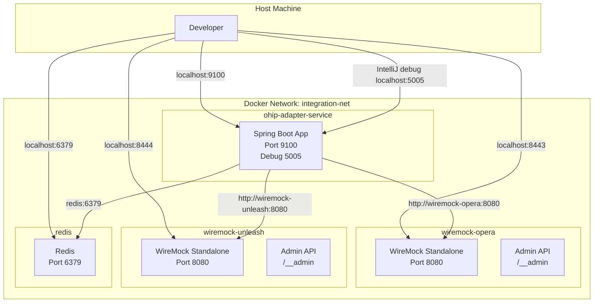
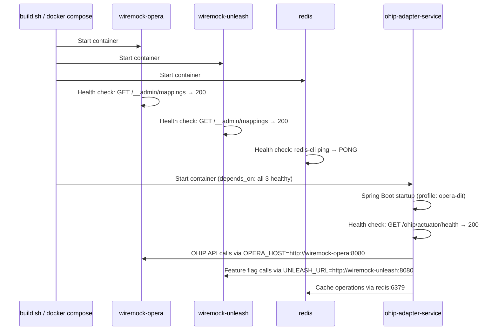

# Design Document

## Overview

This design describes a fully self-contained Docker Compose local development environment for the ohip-adapter-service. The environment lives at `backend/integration-env/` and orchestrates four containers:

1. **ohip-adapter-service** — the Spring Boot application under development
2. **wiremock-opera** — simulates the Oracle Opera OHIP APIs
3. **wiremock-unleash** — serves a file-backed copy of the DIT Unleash feature flag API response
4. **redis** — provides the caching layer (`redis:7-alpine`)

This compose environment does not reference or depend on the existing `docker-local` compose file. A developer starts the full stack through `build.sh`, which fetches the DIT Unleash client feature response, installs it into WireMock files, and then starts the mocked Opera, mocked Unleash, and Redis dependencies.

### Design Decisions

1. **Single compose environment** — All local infrastructure the service needs (Opera mock, Unleash WireMock, Redis) lives in this single compose file. No dependency on the separate `docker-local` compose for Redis or Unleash.

2. **File-backed Unleash mappings** — The large DIT `/client/features` response is written to a generated WireMock body file and mounted into `wiremock-unleash`. This avoids shell-escaping a large JSON payload through the Admin API and preserves the exact Unleash client API response.

3. **Two WireMock instances** — Separate containers for Opera and Unleash provide clear isolation. Each has its own Admin API endpoint for stub management and its own request log for debugging.

4. **Multi-service extensibility via `integration-env/`** — The folder structure uses per-service Dockerfiles (`dockerfiles/<service>.Dockerfile`) and per-service env files (`<service>.env`) so that other teams can add their services without conflicts.

5. **WireMock 3.x standalone** — Chosen over embedded WireMock because it provides a persistent mock server that supports the Admin API for programmatic stub management and matches the production-like HTTP boundary the service operates against.

6. **Host Maven build, runtime Docker image** — The service depends on private Nexus artifacts that require the developer's VPN/proxy setup. Maven therefore runs on the host via `build.sh`, and the Dockerfile packages the already-built fat JAR into a JRE-only runtime image.

7. **redis:7-alpine** — Uses the currently available Redis image for local caching. The previous Bitnami Redis Cluster image is not used in this integration environment.

8. **Single committed env file (no template)** — Since service credentials target local WireMock mocks and Redis, there are no real sensitive credentials in the service env file. The env file (`ohip-adapter-service.env`) is committed directly to version control with mock-friendly values (WireMock URLs, Redis address, dummy placeholder strings). Runtime startup still uses `build.sh` because the DIT Unleash feature response must be fetched before WireMock starts.

## Architecture



### Startup Sequence



## Components and Interfaces

### File Layout

```
backend/integration-env/
├── docker-compose.yml                    # Compose file (4 services)
├── build.sh                              # Build script (Maven + Docker)
├── ohip-adapter-service.env              # Committed env file (mock-friendly values)
├── scripts/
│   └── seed-unleash-wiremock.sh          # Fetches DIT Unleash flags into WireMock files
├── wiremock/
│   └── unleash/
│       ├── mappings/
│       │   ├── client-features.json      # GET /client/features mapping
│       │   └── client-metrics.json       # POST /client/metrics mapping
│       └── __files/
│           └── client-features.json      # Generated, git-ignored DIT Unleash response
└── dockerfiles/
    └── ohip-adapter-service.Dockerfile   # Runtime image packaging the host-built JAR
```

### Component: docker-compose.yml

**Location:** `backend/integration-env/docker-compose.yml`

Defines four services on a shared Docker network:

| Service | Image | Host Port | Container Port | Memory Limit | Health Check |
|---------|-------|-----------|----------------|--------------|--------------|
| `ohip-adapter-service` | Built from `dockerfiles/ohip-adapter-service.Dockerfile` | 9100, 5005 | 9100, 5005 | 750 MB | `curl -fsS /ohip/actuator/health` every 10s, 30s timeout, 6 retries, 30s start_period |
| `wiremock-opera` | `wiremock/wiremock:3.12.1` | 8443 | 8080 | 750 MB | `curl -fsS /__admin/mappings` every 10s, 5s timeout, 3 retries |
| `wiremock-unleash` | `wiremock/wiremock:3.12.1` | 8444 | 8080 | 750 MB | `curl -fsS /__admin/mappings` every 10s, 5s timeout, 3 retries |
| `redis` | `redis:7-alpine` | 6379 | 6379 | 750 MB | `redis-cli ping` every 10s, 5s timeout, 3 retries |

**Key configuration:**
- `ohip-adapter-service` uses `depends_on` with `condition: service_healthy` for all three infrastructure services
- `ohip-adapter-service` uses `env_file: ./ohip-adapter-service.env`
- Both WireMock instances start with `--verbose` flag
- `wiremock-unleash` mounts `./wiremock/unleash:/home/wiremock` so WireMock loads `GET /client/features` and `POST /client/metrics` mappings at startup
- Every service sets `mem_limit: 750m` so local containers are capped at 750 MB RAM each
- All services share a custom bridge network (`integration-net`)

**Port choice rationale:**
- Host port 8443 for wiremock-opera avoids conflicts with common local services
- Host port 8444 for wiremock-unleash is the next available port
- Port 9100 matches the service's configured server port
- Port 5005 exposes the JVM debug socket for IntelliJ Remote JVM Debug
- Port 6379 is the standard Redis port

### Component: ohip-adapter-service.Dockerfile

**Location:** `backend/integration-env/dockerfiles/ohip-adapter-service.Dockerfile`

Runtime image build:

| Stage | Base Image | Purpose |
|-------|-----------|---------|
| `runtime` | `eclipse-temurin:25-jre` | Minimal runtime with host-built fat JAR and healthcheck HTTP client |

**Runtime stage steps:**
1. Install `curl` for the Compose actuator health check
2. Create non-root user (`appuser`)
3. Copy the prebuilt fat JAR from `backend/discover-search/services/ohip-adapter-service/target/`
4. Expose ports 9100 and 5005
5. Set entrypoint: `java $JAVA_OPTS -jar /app/app.jar`

### Component: build.sh

**Location:** `backend/integration-env/build.sh`

Shell script that:
1. Determines monorepo root (relative to script location)
2. Runs `backend/integration-env/scripts/seed-unleash-wiremock.sh` to fetch the DIT Unleash `/client/features` response into `wiremock/unleash/__files/client-features.json`
3. Runs Maven build: `./mvnw clean package -pl backend/discover-search/services/ohip-adapter-service -am -DskipTests`
4. On Maven success, builds Docker image using `docker` or `podman`: `<container-cli> build -f backend/integration-env/dockerfiles/ohip-adapter-service.Dockerfile -t ohip-adapter-service:local .`
5. Validates Docker Compose configuration
6. Starts the stack with Docker Compose: `<compose-cli> -f backend/integration-env/docker-compose.yml up -d --build`
7. Waits for `ohip-adapter-service` to report healthy
8. On any failure, exits with non-zero code and error message
9. On success, prints completion message and local endpoint URLs

### Component: seed-unleash-wiremock.sh

**Location:** `backend/integration-env/scripts/seed-unleash-wiremock.sh`

Shell script that:
1. Requires `REAL_UNLEASH_TOKEN` to be exported before it runs
2. Uses `REAL_UNLEASH_URL` when provided, otherwise defaults to `https://eu.app.unleash-hosted.com/eukk0023/api`
3. Fetches `GET $REAL_UNLEASH_URL/client/features` with the provided client token
4. Writes the raw response to `backend/integration-env/wiremock/unleash/__files/client-features.json`
5. Exits non-zero if the token is missing or the fetch fails, so the compose stack does not start with missing or synthetic feature flags

### Component: ohip-adapter-service.env

**Location:** `backend/integration-env/ohip-adapter-service.env` (committed to version control)

Contains the full set of environment variables the service needs to boot, derived from the production Kustomization/HelmRelease manifest. Mock placeholder values are used for secrets (which WireMock does not validate), while non-sensitive production configuration values are carried over directly to ensure behavioural parity.

| Variable | Value | Notes |
|----------|-------|-------|
| `SPRING_PROFILES_ACTIVE` | `opera-dit` | Activates the Opera DIT Spring profile |
| `JAVA_OPTS` | `-XX:InitialRAMPercentage=10 -XX:MaxRAMPercentage=80 -agentlib:jdwp=transport=dt_socket,server=y,suspend=n,address=*:5005` | JVM tuning plus always-on remote debugging |
| `OPERA_HOST` | `http://wiremock-opera:8080` | Points to WireMock Opera container |
| `OPERA_APP_KEY` | `mock-app-key` | Dummy — not validated by WireMock |
| `OPERA_CLIENT_ID` | `mock-client-id` | Dummy — not validated by WireMock |
| `OPERA_CLIENT_SECRET` | `mock-client-secret` | Dummy — not validated by WireMock |
| `OPERA_USERNAME` | `mock-username` | Dummy — not validated by WireMock |
| `OPERA_PASSWORD` | `mock-password` | Dummy — not validated by WireMock |
| `OPERA_AUTH_ENDPOINT` | `oauth/v1/tokens` | From production config |
| `OPERA_SCOPE` | `urn:opc:hgbu:ws:__myscopes__` | From production config |
| `OPERA_TOKEN_REFRESH_SKEW` | `15` | From production config |
| `ENABLE_CLIENT_CREDENTIALS` | `true` | From production config |
| `ENTERPRISE_ID` | `WHBPI` | From production config |
| `REDIS_ENDPOINT` | `redis:6379` | Points to Redis container |
| `CACHE_TYPE` | `redis` | From production config |
| `UNLEASH_URL` | `http://wiremock-unleash:8080` | Points to WireMock Unleash container |
| `UNLEASH_TOKEN` | `mock-unleash-token` | Dummy — not validated by WireMock |
| `UNLEASH_ENVIRONMENT` | `dit` | DIT feature flag evaluation environment |
| `RULES_AGENT_HOST` | `rules-agent-entity-service` | Future compose service dependency hostname |
| `TOKEN_SERVICE_HOST` | `opera-token-service` | Future compose service dependency hostname |
| `WIRE_TAP_ACCESS_TOKEN` | `false` | From production config |
| `OVERRIDE_INSUFFICIENT_CC` | `true` | From production config |
| `NON_DIGITAL_PAYMENT_HOTELS` | `BANBRI,GATGAT,LONSTM,LONKIN,FRESUD,FRAMTI` | From production config |
| `PROMOTIONAL_RATE` | `PROBRKST` | From production config |
| `PROMOTIONAL_PACKAGE` | `OBFPRO` | From production config |
| `RESTRICTIONS_PARALLEL_THREADS` | `5` | From production config |

## Data Models

This feature does not introduce application-level data models. The configuration artifacts are:

### Docker Compose Service Definition (YAML)

```yaml
services:
  ohip-adapter-service:
    image: ohip-adapter-service:local
    build:
      context: ../../                    # Monorepo root
      dockerfile: backend/integration-env/dockerfiles/ohip-adapter-service.Dockerfile
    mem_limit: 750m
    ports:
      - "9100:9100"
      - "5005:5005"
    env_file:
      - ./ohip-adapter-service.env
    depends_on:
      wiremock-opera:
        condition: service_healthy
      wiremock-unleash:
        condition: service_healthy
      redis:
        condition: service_healthy
    healthcheck:
      test: ["CMD", "curl", "-fsS", "http://localhost:9100/ohip/actuator/health"]
      interval: 10s
      timeout: 30s
      retries: 6
      start_period: 30s
    networks:
      - integration-net

  wiremock-opera:
    image: wiremock/wiremock:3.12.1
    mem_limit: 750m
    command: ["--verbose"]
    ports:
      - "8443:8080"
    healthcheck:
      test: ["CMD", "curl", "-fsS", "http://localhost:8080/__admin/mappings"]
      interval: 10s
      timeout: 5s
      retries: 3
    networks:
      - integration-net

  wiremock-unleash:
    image: wiremock/wiremock:3.12.1
    mem_limit: 750m
    command: ["--verbose"]
    ports:
      - "8444:8080"
    volumes:
      - ./wiremock/unleash:/home/wiremock
    healthcheck:
      test: ["CMD", "curl", "-fsS", "http://localhost:8080/__admin/mappings"]
      interval: 10s
      timeout: 5s
      retries: 3
    networks:
      - integration-net

  redis:
    image: redis:7-alpine
    mem_limit: 750m
    ports:
      - "6379:6379"
    healthcheck:
      test: ["CMD", "redis-cli", "ping"]
      interval: 10s
      timeout: 5s
      retries: 3
    networks:
      - integration-net

networks:
  integration-net:
    driver: bridge
```

### Environment File Schema

```env
# Spring / JVM
SPRING_PROFILES_ACTIVE=opera-dit
JAVA_OPTS=-XX:InitialRAMPercentage=10 -XX:MaxRAMPercentage=80 -agentlib:jdwp=transport=dt_socket,server=y,suspend=n,address=*:5005

# Opera OHIP connection (routed to WireMock Opera container)
OPERA_HOST=http://wiremock-opera:8080
OPERA_APP_KEY=<string>
OPERA_CLIENT_ID=<string>
OPERA_CLIENT_SECRET=<string>
OPERA_USERNAME=<string>
OPERA_PASSWORD=<string>
OPERA_AUTH_ENDPOINT=<path>
OPERA_SCOPE=<string>
OPERA_TOKEN_REFRESH_SKEW=<integer>
ENABLE_CLIENT_CREDENTIALS=<boolean>
ENTERPRISE_ID=<string>

# Redis (routed to Redis container within Docker network)
REDIS_ENDPOINT=redis:6379
CACHE_TYPE=<string>

# Unleash (routed to WireMock Unleash container)
UNLEASH_URL=http://wiremock-unleash:8080
UNLEASH_TOKEN=<string>
UNLEASH_ENVIRONMENT=<string>

# Service dependencies (routed within Docker network)
RULES_AGENT_HOST=<hostname>
TOKEN_SERVICE_HOST=<hostname>

# Application config (from production Kustomization/HelmRelease)
WIRE_TAP_ACCESS_TOKEN=<boolean>
OVERRIDE_INSUFFICIENT_CC=<boolean>
NON_DIGITAL_PAYMENT_HOTELS=<comma-separated-hotel-codes>
PROMOTIONAL_RATE=<string>
PROMOTIONAL_PACKAGE=<string>
RESTRICTIONS_PARALLEL_THREADS=<integer>
```

## Error Handling

| Scenario | Behaviour | User Action |
|----------|-----------|-------------|
| Maven build fails in `build.sh` | Script exits with code 1, prints error | Fix compilation errors, re-run |
| Docker build fails in `build.sh` | Script exits with code 1, prints error | Check Dockerfile syntax, disk space |
| WireMock Opera fails health check | `ohip-adapter-service` never starts (depends_on blocks) | Check WireMock logs: `docker compose logs wiremock-opera` |
| WireMock Unleash fails health check | `ohip-adapter-service` never starts (depends_on blocks) | Check WireMock logs: `docker compose logs wiremock-unleash` |
| Redis fails health check | `ohip-adapter-service` never starts (depends_on blocks) | Check Redis logs: `docker compose logs redis` |
| Service fails health check within 60s | Container marked unhealthy | Check service logs: `docker compose logs ohip-adapter-service` |
| Port 9100 already in use | Container fails to bind | Stop conflicting process or change host port |
| Port 5005 already in use | Container fails to bind | Stop the process using 5005 or change the debug port mapping |
| Port 8443 already in use | WireMock Opera container fails to bind | Stop conflicting process or change host port |
| Port 8444 already in use | WireMock Unleash container fails to bind | Stop conflicting process or change host port |
| Port 6379 already in use | Redis container fails to bind | Stop conflicting process or change host port |

## Testing Strategy

### Approach

This feature consists entirely of infrastructure configuration (Docker Compose, Dockerfiles, shell scripts, environment files). Property-based testing is **not applicable** here because:
- These are declarative configuration files, not functions with inputs/outputs
- The "correctness" of this feature is verified by whether containers start and communicate successfully
- There is no meaningful input space to randomize over

### Test Categories

**1. Smoke Tests (Manual / CI Integration)**

| Test | Verification |
|------|-------------|
| `docker compose config` validates | Compose file parses without errors |
| `build.sh` starts all four containers through Docker Compose | All containers reach "healthy" status within 60s |
| Service responds on `localhost:9100/ohip/actuator/health` | Returns 200 with health status |
| WireMock Opera responds on `localhost:8443/__admin/mappings` | Returns 200 with empty mappings list |
| WireMock Unleash responds on `localhost:8444/__admin/mappings` | Returns 200 with file-backed Unleash mappings loaded |
| Redis responds on `localhost:6379` | `redis-cli ping` returns PONG |
| POST stub to WireMock Opera, call service → hits WireMock | Request appears in WireMock Opera request log |
| POST stub to WireMock Unleash → returns 201 | Stub accepted via Admin API |

**2. Build Script Tests**

| Test | Verification |
|------|-------------|
| `build.sh` succeeds with clean repo | Exits 0, image `ohip-adapter-service:local` exists |
| `build.sh` fails when `REAL_UNLEASH_TOKEN` is missing | Exits non-zero before Maven, Docker build, or Compose startup |
| `build.sh` fails on Maven error after Unleash seed succeeds | Exits non-zero, no Docker build attempted |
| `build.sh` is executable | `stat` confirms executable bit |

**3. Dockerfile Validation**

| Test | Verification |
|------|-------------|
| Final image has no build tools | `docker run --rm ohip-adapter-service:local which mvn` returns not found |
| Final image runs as non-root | `docker run --rm ohip-adapter-service:local whoami` returns `appuser` |
| Final image exposes ports 9100 and 5005 | `docker inspect` confirms exposed ports |

**4. Configuration Validation**

| Test | Verification |
|------|-------------|
| `ohip-adapter-service.env` contains all required variables | Script checks for all 25 expected keys |
| `ohip-adapter-service.env` is tracked by git | `git ls-files` confirms the file is committed |
| OPERA_HOST points to `http://wiremock-opera:8080` | grep confirms value |
| UNLEASH_URL points to `http://wiremock-unleash:8080` | grep confirms value |
| REDIS_ENDPOINT points to `redis:6379` | grep confirms value |

**5. Connectivity Tests**

| Test | Verification |
|------|-------------|
| ohip-adapter-service can reach wiremock-opera | Service sends request, appears in `/__admin/requests` |
| ohip-adapter-service can reach wiremock-unleash | Feature flag evaluation succeeds (or stub responds) |
| ohip-adapter-service can reach redis | Cache put/get operations succeed |

### Recommended CI Integration

A lightweight CI job can validate the compose file parses correctly:
```bash
docker compose -f backend/integration-env/docker-compose.yml config --quiet
```

Full container startup tests should be run on-demand rather than on every PR due to build time (Maven compile + Docker build).
