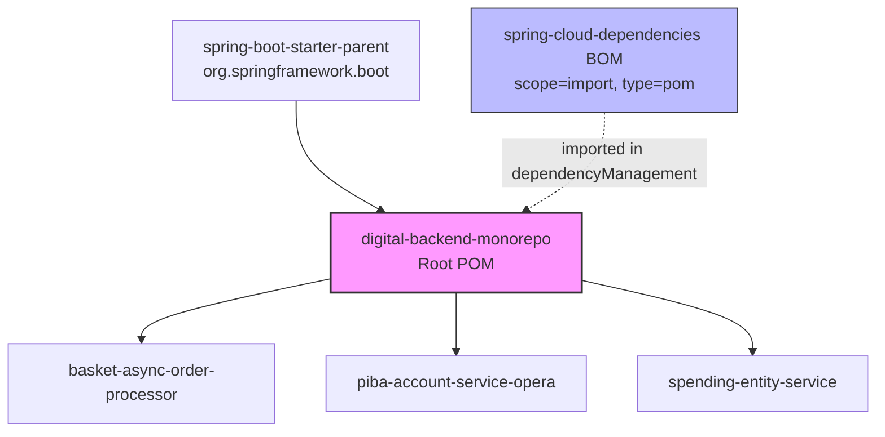
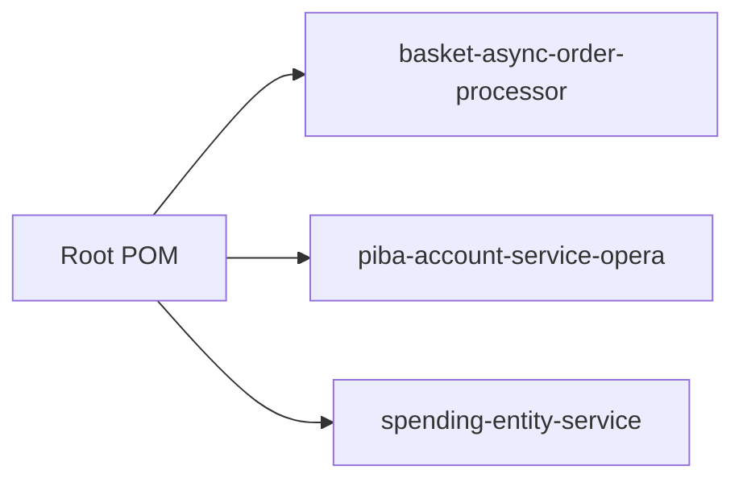
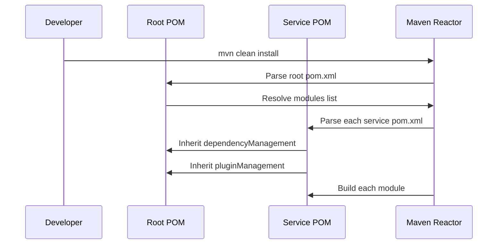

# Design Document: Monorepo BOM Restructure

## Overview

This design transforms the digital-backend-monorepo from three independent services each parented by `spring-cloud-microservice-parent` into a proper Maven multi-module project with centralized dependency and plugin management.

The restructure introduces a root POM that:
1. Inherits from `spring-boot-starter-parent` (replacing `spring-cloud-microservice-parent`)
2. Imports the Spring Cloud BOM for cloud dependency management
3. Centralizes all dependency versions via `<dependencyManagement>` with Maven properties
4. Centralizes shared plugin versions and configurations via `<pluginManagement>`
5. Declares all three services as reactor modules

Each service POM is simplified to inherit from the root, declare dependencies without versions, and retain only service-specific build configuration.

### Design Rationale

**Why `spring-boot-starter-parent` instead of `spring-cloud-microservice-parent`?**
- `spring-boot-starter-parent` is the canonical Spring Boot parent providing dependency management, plugin defaults, and resource filtering
- `spring-cloud-microservice-parent` was a Whitbread-internal parent that bundled both Spring Boot and Spring Cloud concerns — this coupling made upgrades difficult and version alignment opaque
- Spring Cloud dependencies are better managed via BOM import (`scope=import`, `type=pom`), which is the approach recommended by the Spring Cloud documentation

**Why centralize versions as Maven properties?**
- A single `<properties>` section makes version upgrades a one-line change
- Eliminates version drift between services (e.g., basket uses commons-logging 4.0.4 while spending uses 4.0.4 — today they match, but without central management they can diverge)
- Maven enforcer plugin can validate upper-bound dependency rules from one place

## Architecture



### Maven Reactor Build Order



Since no service depends on another, the reactor order is simply root → modules (alphabetical or as declared). All three services build independently in parallel when using `-T` threads.

## Components and Interfaces

### Component 1: Root POM (`pom.xml` at repository root)

**Responsibilities:**
- Declare `spring-boot-starter-parent` as parent
- Define all Maven properties for dependency versions
- Provide `<dependencyManagement>` with all managed dependencies
- Import Spring Cloud BOM
- Provide `<pluginManagement>` with shared plugin versions and configurations
- Declare `<modules>` listing all services

**Key Sections:**

| Section | Purpose |
|---------|---------|
| `<parent>` | Inherits `spring-boot-starter-parent` |
| `<properties>` | All version properties |
| `<dependencyManagement>` | Version-pinned entries for all dependencies |
| `<pluginManagement>` | Shared plugin versions + compiler config |
| `<modules>` | Lists the 3 service directories |

### Component 2: Service POMs (one per service)

**Responsibilities:**
- Declare root POM as parent with `<relativePath>../pom.xml</relativePath>`
- Declare dependencies without `<version>` elements
- Retain service-specific properties (application.port, sonar exclusions)
- Retain service-specific plugin configurations (executions, custom config)
- Remove all version properties
- Remove all local `<dependencyManagement>` sections

### Interaction Pattern



## Data Models

### Root POM Properties (Version Catalog)

All dependency versions are defined as Maven properties in the root POM. The naming convention follows `<artifact-short-name>.version`:

```xml
<properties>
    <!-- Java -->
    <java.version>25</java.version>
    
    <!-- Spring Cloud -->
    <spring-cloud.version>2024.0.1</spring-cloud.version>
    
    <!-- Whitbread Shared Libraries -->
    <wb.commons-logging.version>4.0.4</wb.commons-logging.version>
    <wb.commons-entity-exceptions.version>3.0.0</wb.commons-entity-exceptions.version>
    <wb.commons-exceptions.version>3.0.1</wb.commons-exceptions.version>
    <wb.commons-cdh.version>17.0.1</wb.commons-cdh.version>
    <wb.common-auth0.version>8.0.4</wb.common-auth0.version>
    <wb.worldline-ba-api-lib.version>3.0.0</wb.worldline-ba-api-lib.version>
    <wb.coding-convention-rules.version>2.0.1</wb.coding-convention-rules.version>
    
    <!-- Third-party Libraries -->
    <commons-validator.version>1.7</commons-validator.version>
    <springdoc-openapi-starter.version>2.7.0</springdoc-openapi-starter.version>
    <jackson-databind-nullable.version>0.2.6</jackson-databind-nullable.version>
    <brave-kafka-clients.version>5.14.1</brave-kafka-clients.version>
    <opencsv.version>5.9</opencsv.version>
    <mapstruct.version>1.6.3</mapstruct.version>
    <poi.version>5.4.1</poi.version>
    <micrometer-registry-prometheus.version>1.16.3</micrometer-registry-prometheus.version>
    <random-beans.version>3.6.0</random-beans.version>
    <springdoc-openapi-maven-plugin.version>1.4</springdoc-openapi-maven-plugin.version>
    <openapi-generator.version>6.4.0</openapi-generator.version>
    
    <!-- Transitive Dependency Overrides -->
    <lombok.version>1.18.44</lombok.version>
    <nimbus-jose-jwt.version>10.4</nimbus-jose-jwt.version>
    <angus-activation.version>2.0.3</angus-activation.version>
    <commons-lang3.version>3.20.0</commons-lang3.version>
    <commons-text.version>1.13.0</commons-text.version>
    <spring-mock-mvc.version>6.0.0</spring-mock-mvc.version>
    <lombok-mapstruct-binding.version>0.2.0</lombok-mapstruct-binding.version>
    
    <!-- Plugin Versions -->
    <maven-compiler-plugin.version>3.13.0</maven-compiler-plugin.version>
    <maven-checkstyle-plugin.version>3.1.2</maven-checkstyle-plugin.version>
    <checkstyle.version>9.2</checkstyle.version>
    <jacoco-maven-plugin.version>0.8.12</jacoco-maven-plugin.version>
    <pitest-maven.version>1.16.1</pitest-maven.version>
    <pitest-junit5-plugin.version>1.2.1</pitest-junit5-plugin.version>
    <spring-cloud-contract-maven-plugin.version>4.2.1</spring-cloud-contract-maven-plugin.version>
</properties>
```

### Root POM dependencyManagement Structure

The `<dependencyManagement>` section contains:

1. **Spring Cloud BOM import** — provides all `spring-cloud-*` artifact versions
2. **Whitbread shared libraries** — internal libraries with `uk.co.whitbread.shared` groupId
3. **Third-party libraries** — external dependencies with explicit versions in current service POMs
4. **Transitive overrides** — dependencies pinned to satisfy RequireUpperBoundDeps

### Root POM pluginManagement Structure

The `<pluginManagement>` section defines:

| Plugin | Version Source | Shared Configuration |
|--------|---------------|---------------------|
| `maven-compiler-plugin` | `${maven-compiler-plugin.version}` | source/target=25, annotation processors (Lombok, MapStruct, lombok-mapstruct-binding) |
| `spring-boot-maven-plugin` | Inherited from spring-boot-starter-parent | None (services configure individually) |
| `jacoco-maven-plugin` | `${jacoco-maven-plugin.version}` | None (services configure excludes individually) |
| `maven-checkstyle-plugin` | `${maven-checkstyle-plugin.version}` | Checkstyle dependency version |
| `pitest-maven` | `${pitest-maven.version}` | pitest-junit5-plugin dependency |
| `springdoc-openapi-maven-plugin` | `${springdoc-openapi-maven-plugin.version}` | None |
| `openapi-generator-maven-plugin` | `${openapi-generator.version}` | None |
| `spring-cloud-contract-maven-plugin` | `${spring-cloud-contract-maven-plugin.version}` | None |

### Service POM Transformation Rules

For each service POM, the following transformations apply:

| Before | After |
|--------|-------|
| `<parent>spring-cloud-microservice-parent</parent>` | `<parent>digital-backend-monorepo</parent>` with `<relativePath>../pom.xml</relativePath>` |
| `<version>X.Y.Z</version>` on managed dependencies | Removed entirely |
| Version properties (e.g., `<commons-validator.version>`) | Removed from service `<properties>` |
| Local `<dependencyManagement>` section | Removed entirely |
| Plugin `<version>` elements | Removed (inherited from pluginManagement) |
| Plugin `<configuration>` and `<executions>` | Retained as-is |
| `application.port`, `sonar.coverage.exclusions` | Retained in service `<properties>` |

### Version Conflict Resolution

Where services currently use different versions of the same dependency, the root POM picks the **highest version** to satisfy RequireUpperBoundDeps:

| Dependency | basket-async | piba-account | spending-entity | Root Version |
|-----------|-------------|-------------|----------------|-------------|
| `commons-entity-exceptions` | 2.0.4 | — | 3.0.0 | **3.0.0** |
| `common-auth0` | — | 8.0.4 | 8.0.2 | **8.0.4** |
| `coding-convention-rules` | 1.0.6 | — | 2.0.1 | **2.0.1** |

> **Note:** The basket-async-order-processor service currently uses `commons-entity-exceptions:2.0.4`. Upgrading to 3.0.0 in the root BOM may require code changes if there are breaking API differences between 2.x and 3.x. This should be validated during implementation.

## Correctness Properties

*A property is a characteristic or behavior that should hold true across all valid executions of a system — essentially, a formal statement about what the system should do. Properties serve as the bridge between human-readable specifications and machine-verifiable correctness guarantees.*

This feature involves Maven POM restructuring — declarative XML configuration rather than code with variable input/output behavior. Traditional property-based testing (randomized input generation over 100+ iterations) is **not applicable** because there are no pure functions or variable input spaces. However, the following structural invariants must hold and are verifiable via scripted checks (XPath queries on POM XML, `mvn dependency:tree` diff).

### Property 1: No version elements in service POMs for managed dependencies

*For any* service POM and *for any* dependency declared in that service POM which has a corresponding entry in the root POM `<dependencyManagement>` section, the service POM dependency declaration shall not contain a `<version>` element.

**Validates: Requirements 2.5, 3.1**

### Property 2: No spring-cloud-microservice-parent references

*For any* POM file in the repository (root or service), the POM shall not reference `spring-cloud-microservice-parent` as a `<parent>` artifactId or as an imported BOM.

**Validates: Requirements 1.6, 3.7**

### Property 3: All service modules declared in root

*For any* service directory in the repository (basket-async-order-processor, piba-account-service-opera, spending-entity-service), the root POM `<modules>` section shall contain a `<module>` entry matching that directory name.

**Validates: Requirements 1.3**

### Property 4: Dependency tree equivalence before and after restructuring

*For any* service module, the effective dependency tree after restructuring shall contain the same set of artifacts, versions, and scopes as the dependency tree before restructuring — preserving all exclusions and scope assignments.

**Validates: Requirements 5.3, 5.4**

## Error Handling

### Build Failures

| Scenario | Cause | Resolution |
|----------|-------|------------|
| Missing version in service POM | Dependency not in root `<dependencyManagement>` | Add entry to root POM |
| RequireUpperBoundDeps failure | Transitive dependency version lower than direct | Add override entry in root `<dependencyManagement>` |
| Plugin version conflict | Service specifies version that conflicts with pluginManagement | Remove version from service POM |
| Module not found | Service directory not listed in `<modules>` | Add module entry to root POM |
| Relative path resolution failure | Incorrect `<relativePath>` in service POM | Ensure `../pom.xml` is correct |

### Rollback Strategy

If the restructure causes build failures that cannot be resolved:
1. Each service retains its own `.git` history (git submodule or subtree merge)
2. The transformation is reversible by restoring original `<parent>` declarations and re-adding version properties
3. CI pipeline should validate the full reactor build before merging

## Testing Strategy

### Why Property-Based Testing Does NOT Apply

This feature is a **Maven POM restructuring** — it involves declarative XML configuration, not code with input/output behavior. The acceptance criteria test:
- XML structure correctness (static configuration)
- Build tool behavior (`mvn clean install` succeeds or fails)
- Dependency tree equivalence (deterministic given the same POM)

There are no pure functions, no variable input spaces, and no universal properties that benefit from randomized testing. The correct testing approaches are integration tests and structural validation.

### Testing Approach

**1. Structural Validation (Pre-build checks)**
- Validate root POM XML schema compliance
- Verify all three modules are declared
- Verify no service POM contains `<dependencyManagement>`
- Verify no service POM contains version properties for managed dependencies
- Verify no service POM references `spring-cloud-microservice-parent`

**2. Build Integration Tests**
- `mvn clean install` from root succeeds (Requirement 5.1)
- `mvn clean install -pl <service>` succeeds for each service individually (Requirement 5.2)
- Each service produces a JAR in its `target/` directory (Requirement 5.5)

**3. Dependency Tree Comparison**
- Capture `mvn dependency:tree` output for each service before restructuring
- Capture `mvn dependency:tree` output after restructuring
- Compare effective dependencies: same artifacts, same versions, same scopes (Requirements 5.3, 5.4)
- Verify exclusions are preserved (Requirement 5.3)

**4. Plugin Execution Verification**
- Verify checkstyle runs during validate phase for each service (Requirement 5.6)
- Verify jacoco runs and produces coverage reports (Requirement 5.6)
- Verify spring-boot-maven-plugin produces executable JARs (Requirement 5.6)

**5. Effective POM Validation**
- Run `mvn help:effective-pom` for each service
- Verify compiler source/target is 25
- Verify annotation processor paths include Lombok and MapStruct
- Verify Spring Cloud dependencies resolve correctly

### Test Execution Order

1. Create root POM
2. Transform service POMs
3. Run `mvn clean install` from root (primary validation)
4. Compare dependency trees (regression check)
5. Verify individual module builds (`-pl` flag)
