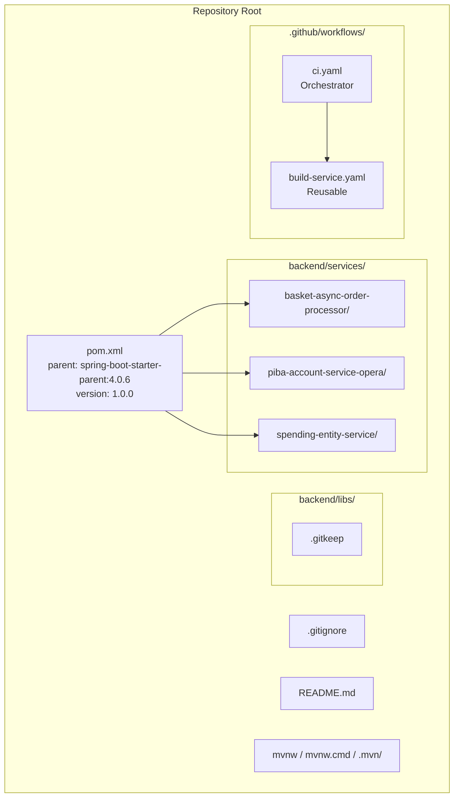

# Design Document

## Overview

This design covers the finalization of the `digital-backend-monorepo` after the BOM restructure is complete. The work involves six coordinated changes:

1. **Directory restructure** — Move services into `services/` and create `libs/` placeholder
2. **Git history import** — Use `git subtree add` to graft original repo histories into the new paths
3. **Lock-step versioning** — Remove per-service `<version>` elements so all modules inherit from the root POM
4. **Configuration consolidation** — Single root `.gitignore` and Maven Wrapper; remove per-service duplicates
5. **Documentation** — Root README covering structure, build, versioning, and CI
6. **CI pipeline** — Self-contained GitHub Actions workflows for change detection, parallel builds, Sonar, and CodeQL

The design prioritizes a clean, repeatable sequence of operations that can be executed as discrete commits, making each step independently verifiable.

## Architecture



### Execution Order

The restructuring must follow this sequence to avoid broken intermediate states:

1. Import git history via subtree (creates `services/<name>/` paths with history)
2. Remove old root-level service directories (now replaced by subtree imports)
3. Clean up per-service artifacts (`.git/`, `.github/`, `.gitignore`, `.mvn/`, `mvnw`, `mvnw.cmd`, `CODEOWNERS`)
4. Update root POM module paths to `services/<name>`
5. Update service POMs (`<relativePath>`, remove `<version>`)
6. Set root POM version to `1.0.0` (drop `-SNAPSHOT`)
7. Create `libs/.gitkeep`
8. Create consolidated root `.gitignore`
9. Install root Maven Wrapper
10. Create root README
11. Create CI workflows
12. Validate full build

## Components and Interfaces

### Component 1: Directory Layout

**Current state:**
```
digital-backend-monorepo/
├── pom.xml (root, version 1.0.0-SNAPSHOT)
├── basket-async-order-processor/   (with .git, .github, .mvn, mvnw, .gitignore)
├── piba-account-service-opera/     (with .git, .github, .gitignore)
└── spending-entity-service/        (with .git, .github, .mvn, mvnw, .gitignore, CODEOWNERS)
```

**Target state:**
```
digital-backend-monorepo/
├── pom.xml (root, version 1.0.0)
├── .gitignore (consolidated)
├── README.md
├── mvnw / mvnw.cmd / .mvn/
├── .github/workflows/
│   ├── ci.yaml
│   └── build-service.yaml
├── services/
│   ├── basket-async-order-processor/
│   ├── piba-account-service-opera/
│   └── spending-entity-service/
└── libs/
    └── .gitkeep
```

### Component 2: Root POM Changes

The root POM requires these modifications:

| Element | Current | Target |
|---------|---------|--------|
| `<version>` | `1.0.0-SNAPSHOT` | `1.0.0` |
| `<modules>` | `basket-async-order-processor`, etc. | `services/basket-async-order-processor`, etc. |

### Component 3: Service POM Changes

Each service POM requires:

| Element | Current | Target |
|---------|---------|--------|
| `<version>` | Per-service (e.g., `2.0.0`, `1.0.0`, `3.0.0`) | **Removed** (inherited from parent) |
| `<parent><relativePath>` | `../pom.xml` | `../../pom.xml` |
| `<parent><version>` | `1.0.0-SNAPSHOT` | `1.0.0` |

### Component 4: Git History Import

For each service, the import uses:

```bash
git remote add <service-name> <remote-url>
git fetch <service-name>
git subtree add --prefix=services/<service-name> <service-name> <branch>
git remote remove <service-name>
```

Services and their remotes:
- `basket-async-order-processor` → `https://github.com/whitbread-eos/basket-async-order-processor.git` (branch: `develop`)
- `piba-account-service-opera` → `https://github.com/whitbread-eos/piba-account-service-opera.git` (branch: `develop`)
- `spending-entity-service` → `https://github.com/whitbread-eos/spending-entity-service.git` (branch: `develop`)

After subtree import, the following must be removed from each `services/<name>/`:
- `.git/` directory (nested git repo)
- `.github/` directory (per-service workflows)
- `.gitignore` (replaced by root)
- `.mvn/` directory (replaced by root wrapper)
- `mvnw`, `mvnw.cmd` (replaced by root wrapper)
- `CODEOWNERS` (if present)

### Component 5: CI Orchestrator Workflow (`.github/workflows/ci.yaml`)

**Design decisions:**
- Self-contained in the monorepo — does NOT call `wbd-workflows-templates`
- Uses `dorny/paths-filter` or native `git diff` for change detection
- Matrix strategy for parallel service builds
- `fail-fast: false` so one service failure doesn't cancel others

```yaml
# Trigger configuration
on:
  push:
    branches: [develop, 'release/*', 'hotfix/*']
  pull_request:
    branches: [develop]

# Job structure:
# 1. detect-changes: Determines which services changed
# 2. build-services: Matrix job calling build-service.yaml for each changed service
```

**Change detection logic:**
- Compare changed files against `services/<name>/` paths
- If `pom.xml` (root) changed → all services are marked as changed
- Output: JSON array of changed service names

### Component 6: Build Service Workflow (`.github/workflows/build-service.yaml`)

**Reusable workflow** accepting `service-name` as input.

Steps:
1. Checkout code
2. Set up JDK 25
3. Restore Maven cache (`~/.m2`, key from `hashFiles('**/pom.xml')`)
4. Decode `SETTINGS_XML` variable and write to `~/.m2/settings.xml`
5. Run `mvn verify -pl services/<service-name> -am ${{ vars.MAVEN_CLI_OPTS }}`
6. Run SonarQube scan with project key `whitbread-eos_<service-name>`
7. Run CodeQL analysis (Java)
8. Upload JAR artifact from `services/<service-name>/target/*.jar`

**Explicitly excluded** (per requirements): Docker build, container push, Helm deploy, DIT sync, release-checks.

### Component 7: Consolidated `.gitignore`

Merged from the existing per-service `.gitignore` files (they are identical):

```gitignore
# OS
*.DS_Store

# Maven
target/
pom.xml.tag
pom.xml.releaseBackup
pom.xml.versionsBackup
pom.xml.next
release.properties
dependency-reduced-pom.xml
buildNumber.properties
.mvn/timing.properties
!.mvn/wrapper/maven-wrapper.jar

# Java
*.class

# IntelliJ IDEA
.idea/
*.iws
*.iml
*.ipr
```

### Component 8: Root README

Sections:
1. Project title and description
2. Directory structure diagram
3. Services list with descriptions
4. Build instructions (full build, single service, skip tests)
5. Versioning strategy explanation
6. CI pipeline overview
7. Prerequisites (JDK 25, Maven via wrapper)

## Data Models

No runtime data models are introduced. The relevant "data" is the POM XML structure:

### Root POM Module Declaration

```xml
<modules>
    <module>services/basket-async-order-processor</module>
    <module>services/piba-account-service-opera</module>
    <module>services/spending-entity-service</module>
</modules>
```

### Service POM Parent Reference

```xml
<parent>
    <groupId>uk.co.whitbread</groupId>
    <artifactId>digital-backend-monorepo</artifactId>
    <version>1.0.0</version>
    <relativePath>../../pom.xml</relativePath>
</parent>
<!-- No <version> element in the service POM -->
```

### CI Matrix Data Structure

The orchestrator outputs a JSON array for the matrix:

```json
{
  "service": ["basket-async-order-processor", "piba-account-service-opera", "spending-entity-service"]
}
```

When only a subset changed:

```json
{
  "service": ["spending-entity-service"]
}
```

## Error Handling

| Scenario | Handling |
|----------|----------|
| `git subtree add` fails (network/auth) | Retry with credentials; document that GitHub token with read access to `whitbread-eos` org is required |
| Maven build fails after restructure | Check `<relativePath>` correctness; verify no residual `<version>` in service POMs |
| CI change detection finds no changes | Skip the matrix job (use `if: needs.detect-changes.outputs.services != '[]'`) |
| Sonar scan fails (project not found) | Verify project key matches `whitbread-eos_<service-name>` pattern in SonarQube |
| Maven cache miss in CI | Build still works, just slower; cache is populated for next run |
| CodeQL analysis timeout | CodeQL runs independently; failure doesn't block artifact upload |

## Correctness Properties

*These are structural invariants that must hold after the monorepo finalization is complete. Because this feature is infrastructure/configuration work (file moves, XML edits, YAML workflows, git operations), traditional property-based testing does not apply. Instead, these properties are verified via scripted structural checks.*

### Property 1: No nested .git directories under services/

*For any* service directory under `services/`, there SHALL NOT exist a `.git/` subdirectory. Nested git repositories break the monorepo model and cause unpredictable behavior with `git status`, `git add`, and CI checkouts.

**Validates: Requirements 1.3, 3.1**

### Property 2: All service POMs inherit version from parent

*For any* service POM file under `services/`, the POM SHALL NOT contain a `<version>` element at the project level. All services inherit their version from their respective parent POM (service-parent or library-parent), enforcing lock-step versioning across the monorepo.

**Validates: Requirements 2.1, 2.2**

### Property 3: All service POMs reference correct relativePath

*For any* service POM file under `services/`, the `<parent><relativePath>` element SHALL equal `../../pom.xml`. This ensures Maven correctly resolves the parent POM from the `services/<name>/` directory structure.

**Validates: Requirements 2.1**

### Property 4: Root POM modules match actual service directories

*For any* `<module>` entry in the root POM, there SHALL exist a corresponding directory at that path containing a `pom.xml`. Conversely, every directory under `services/` containing a `pom.xml` SHALL be listed as a module in the root POM.

**Validates: Requirements 1.1, 2.1**

### Property 5: CI workflow detects changes correctly

*For any* commit that modifies the root `pom.xml`, the CI change detection SHALL mark ALL services as changed (triggering a full build). For commits that only modify files under `services/<name>/`, only that specific service SHALL be marked as changed.

**Validates: Requirements 5.1, 5.2**

## Testing Strategy

### Why Property-Based Testing Does Not Apply

This feature is entirely infrastructure and configuration work:
- File/directory moves
- XML configuration changes (POM files)
- YAML workflow definitions
- Git operations
- Documentation

There are no pure functions with varying inputs, no algorithmic logic, and no data transformations that would benefit from property-based testing. The correctness of this work is validated through build execution and structural verification.

### Validation Approach

**Smoke tests (manual/scripted verification):**
- `mvn clean install` from root exits with BUILD SUCCESS
- JAR artifacts have correct names (`<service>-1.0.0.jar`)
- `git log --oneline services/<name>/` shows imported history
- `git log --all --oneline | wc -l` confirms history was preserved (not squashed)

**Structural checks (can be scripted):**
- No nested `.git/` directories exist under `services/`
- No nested `.github/` directories exist under `services/`
- No per-service `.gitignore`, `mvnw`, `mvnw.cmd`, `.mvn/`, `CODEOWNERS` files exist
- Root `.gitignore` exists
- Root `mvnw` is executable
- `libs/.gitkeep` exists
- Service POMs have no `<version>` element
- Service POMs have `<relativePath>../../pom.xml</relativePath>`

**CI workflow validation:**
- Push to a feature branch and verify the orchestrator triggers
- Verify change detection correctly identifies affected services
- Verify parallel matrix execution
- Verify Sonar and CodeQL steps execute (may require secrets to be configured)

**Integration test:**
- Full `mvn clean install` with all unit/integration tests passing
- Build individual service: `./mvnw clean install -pl services/basket-async-order-processor -am`
