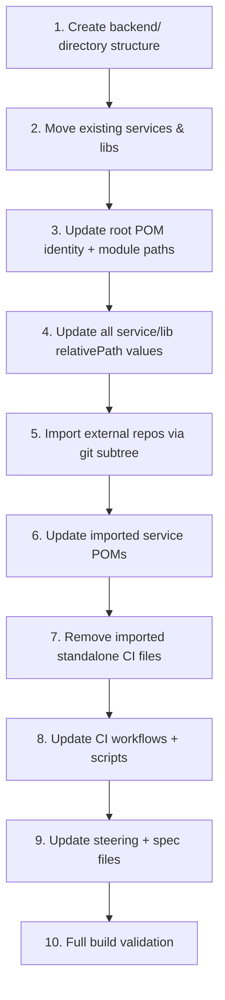

# Design Document: Monorepo Restructure

## Overview

This design covers the restructuring of `digital-backend-monorepo` into `digital-monorepo` — a broader-scoped multi-module Maven monorepo. The restructuring introduces a `backend/` top-level namespace directory, renames the repository identity in Maven and SonarCloud, imports three external repositories via git subtree preserving full history, updates all CI/CD pipelines to work with the new directory layout, and updates all Kiro steering and spec files to reflect the new paths.

### Goals

1. Rename POM identity from `digital-backend-monorepo` to `digital-monorepo`
2. Move all services and libraries under `backend/services/` and `backend/libs/`
3. Import ohip-adapter-service, hotel-entity-service, and content-entity-service with full git history
4. Update all GitHub Actions workflows and shell scripts for new paths
5. Validate the full build passes end-to-end
6. Update steering files and spec files to reflect the new `backend/` directory structure

### Non-Goals

- Frontend, infrastructure, or other non-backend modules (future work that the structure enables)
- Docker build, Helm, or deployment pipeline changes
- Dependency version upgrades or code refactoring within services
- GitHub repository rename (only internal Maven/Sonar identity changes)

## Architecture

### Target Repository Layout

```
digital-monorepo/
├── pom.xml                                    # Root-level pointer (legacy)
├── mvnw / .mvn/                               # Maven Wrapper
├── .github/workflows/                         # CI (updated paths)
│   ├── ci.yaml
│   ├── build-service.yaml
│   ├── build-library.yaml
│   └── scripts/
│       ├── detect-changed-modules.sh
│       └── reverse-deps.sh
├── backend/
│   ├── pom.xml                                # Aggregator (module list + flatten plugin)
│   ├── parents/
│   │   ├── service-parent/                    # Parent for SB4 services
│   │   ├── library-parent/                    # Parent for libraries
│   │   └── spring-boot-3-parent/              # Transitional SB3 parent
│   ├── services/
│   │   ├── basket-async-order-processor/      # Existing (moved)
│   │   ├── piba-account-service-opera/        # Existing (moved)
│   │   ├── spending-entity-service/           # Existing (moved)
│   │   ├── ohip-adapter-service/              # Imported via subtree
│   │   ├── hotel-entity-service/              # Imported via subtree
│   │   └── content-entity-service/            # Imported via subtree
│   └── libs/
│       └── commons-cdh-lib/                   # Existing (moved)
├── .kiro/
│   ├── steering/
│   │   ├── monorepo.md                        # Updated: backend/ paths
│   │   ├── basket-async-order-processor/      # Updated: fileMatchPattern
│   │   ├── piba-account-service-opera/        # Updated: fileMatchPattern
│   │   ├── spending-entity-service/           # Updated: fileMatchPattern
│   │   ├── commons-cdh-lib/                   # Updated: fileMatchPattern
│   │   ├── ohip-adapter-service/              # New: product.md, structure.md, tech.md
│   │   ├── hotel-entity-service/              # New: product.md, structure.md, tech.md
│   │   └── content-entity-service/            # New: product.md, structure.md, tech.md
│   └── specs/
│       └── commons-cdh-lib-monorepo-migration/ # Updated: backend/ paths
└── ...
```

### Migration Strategy

The migration is performed as a sequence of atomic, ordered operations on a feature branch:



### Design Decisions

| Decision | Choice | Rationale |
|----------|--------|-----------|
| Root POM location | Stays at repo root `/pom.xml` | Minimises disruption; Maven wrapper expects root-level POM |
| Module path format | `backend/services/<name>` | Direct relative path from root POM to module directory |
| relativePath depth | `../../../pom.xml` | 3 levels up: `backend/services/<svc>/pom.xml` → root |
| Subtree strategy | `git subtree add --prefix` (no squash) | Preserves full commit history per requirement |
| CI path detection | Prefix-based grep patterns | Consistent with existing approach, just updated prefixes |
| Sonar key pattern | `whitbread-eos_digital-monorepo_<name>` | Follows existing convention with new repo identity |
| Steering file pattern | `backend/services/<name>/**` | Matches new directory structure for file-match activation |

## Components and Interfaces

### Component 1: Root POM (`pom.xml`)

**Changes:**
- `<artifactId>` → `digital-monorepo`
- `<name>` → `digital-monorepo`
- `<description>` → `Whitbread Digital Monorepo`
- `<modules>` section updated to `backend/` prefixed paths

**Updated modules section:**
```xml
<modules>
    <!-- Libraries -->
    <module>backend/libs/commons-cdh-lib</module>

    <!-- Services (existing) -->
    <module>backend/services/basket-async-order-processor</module>
    <module>backend/services/piba-account-service-opera</module>
    <module>backend/services/spending-entity-service</module>

    <!-- Services (imported) -->
    <module>backend/services/ohip-adapter-service</module>
    <module>backend/services/hotel-entity-service</module>
    <module>backend/services/content-entity-service</module>
</modules>
```

### Component 2: Service POMs (`backend/services/*/pom.xml`)

**Changes for all service POMs (existing + imported):**
```xml
<parent>
    <groupId>uk.co.whitbread</groupId>
    <artifactId>digital-monorepo-service-parent</artifactId>
    <version>${revision}</version>
    <relativePath>../../../parents/service-parent/pom.xml</relativePath>
</parent>
```

The `relativePath` changes from `../../pom.xml` (current 2-level depth: `services/<svc>/`) to `../../../parents/service-parent/pom.xml` (new 3-level depth: `backend/<squad>/services/<svc>/`).

### Component 3: Library POMs (`backend/libs/*/pom.xml`)

**Changes for all library POMs:**
```xml
<parent>
    <groupId>uk.co.whitbread</groupId>
    <artifactId>digital-monorepo-library-parent</artifactId>
    <version>${revision}</version>
    <relativePath>../../../parents/library-parent/pom.xml</relativePath>
</parent>
```

Same 3-level relative path: `backend/libs/<lib>/pom.xml` → root.

### Component 4: Change Detection Script (`detect-changed-modules.sh`)

**Path updates:**

| Current | New |
|---------|-----|
| `find services -maxdepth 2 ...` | `find backend/services -maxdepth 2 ...` |
| `find libs -maxdepth 2 ...` | `find backend/libs -maxdepth 2 ...` |
| `grep -oE '^services/[^/]+/'` | `grep -oE '^backend/services/[^/]+/'` |
| `grep -oE '^libs/[^/]+/'` | `grep -oE '^backend/libs/[^/]+/'` |
| `sed 's:^services/::; s:/$::'` | `sed 's:^backend/services/::; s:/$::'` |
| `sed 's:^libs/::; s:/$::'` | `sed 's:^backend/libs/::; s:/$::'` |
| `libs/$LIB/pom.xml` | `backend/libs/$LIB/pom.xml` |

**Logic preserved:** The output format remains `services=["svc1","svc2"]` and `libraries=["lib1"]` — only the directory names, not full paths. Downstream workflows receive service/library names and construct paths themselves.

### Component 5: Reverse Dependencies Script (`reverse-deps.sh`)

**Path update:**
```bash
# Current
SERVICES_DIR="$REPO_ROOT/services"

# New
SERVICES_DIR="$REPO_ROOT/backend/services"
```

All other logic (POM parsing, awk matching, JSON output) remains unchanged since it operates on `$SERVICES_DIR/*/pom.xml` already.

### Component 6: Build Service Workflow (`build-service.yaml`)

**Path updates:**

| Step | Current | New |
|------|---------|-----|
| Maven build | `-pl "services/$SERVICE_NAME"` | `-pl "backend/services/$SERVICE_NAME"` |
| Sonar scan | `-pl "services/$SERVICE_NAME"` | `-pl "backend/services/$SERVICE_NAME"` |
| Sonar scan | `-Dsonar.exclusions=libs/**` | `-Dsonar.exclusions=backend/libs/**` |
| Sonar scan | `projectKey=whitbread-eos_digital-backend-monorepo_$SERVICE_NAME` | `projectKey=whitbread-eos_digital-monorepo_$SERVICE_NAME` |
| Sonar scan | `projectName="digital-backend-monorepo :: $SERVICE_NAME"` | `projectName="digital-monorepo :: $SERVICE_NAME"` |
| Upload artifact | `services/${{ inputs.service-name }}/target/*.jar` | `backend/services/${{ inputs.service-name }}/target/*.jar` |
| Cache key | `services/{0}/pom.xml` | `backend/services/{0}/pom.xml` |

### Component 7: Build Library Workflow (`build-library.yaml`)

**Path updates:**

| Step | Current | New |
|------|---------|-----|
| Maven build | `-pl "libs/$LIBRARY_NAME"` | `-pl "backend/libs/$LIBRARY_NAME"` |
| Cache key | `libs/{0}/pom.xml` | `backend/libs/{0}/pom.xml` |

### Component 8: Git Subtree Import Operations

Three `git subtree add` commands executed sequentially:

```bash
git subtree add --prefix=backend/services/ohip-adapter-service \
    <ohip-adapter-service-remote-url> <branch>

git subtree add --prefix=backend/services/hotel-entity-service \
    <hotel-entity-service-remote-url> <branch>

git subtree add --prefix=backend/services/content-entity-service \
    <content-entity-service-remote-url> <branch>
```

**Post-import cleanup per service:**
- Remove `Jenkinsfile` if present
- Remove `.github/workflows/` directory if present
- Remove `.gitlab-ci.yml` if present
- Update `pom.xml` parent reference to use monorepo root

### Component 9: Steering and Spec File Updates

This component covers all Kiro configuration file changes required to align IDE guidance with the new directory layout.

#### 9.1 Monorepo Steering File (`.kiro/steering/monorepo.md`)

**Changes:**
- Update all build command examples from `services/<name>` to `backend/services/<name>`
- Update repository layout diagram to show `backend/` top-level directory with `services/` and `libs/` subdirectories
- Update "When Adding a New Service" instructions:
  - Create directory under `backend/<squad>/services/` (not `services/`)
  - Module path: `<squad>/services/<service-name>`
  - `<relativePath>../../../parents/service-parent/pom.xml</relativePath>` (service parent)
  - Steering file `fileMatchPattern: "backend/<squad>/services/<service-name>/**"`
- Update SonarQube project key pattern to `whitbread-eos_digital-monorepo_<service-name>`

#### 9.2 Existing Service Steering Files — `fileMatchPattern` Updates

Each existing service steering directory has `product.md`, `structure.md`, and `tech.md` files. All must update their `fileMatchPattern` from `services/<name>/**` to `backend/services/<name>/**`.

| Steering Directory | Old Pattern | New Pattern |
|-------------------|-------------|-------------|
| `basket-async-order-processor/` | `services/basket-async-order-processor/**` | `backend/services/basket-async-order-processor/**` |
| `piba-account-service-opera/` | `services/piba-account-service-opera/**` | `backend/services/piba-account-service-opera/**` |
| `spending-entity-service/` | `services/spending-entity-service/**` | `backend/services/spending-entity-service/**` |
| `commons-cdh-lib/` | `libs/commons-cdh-lib/**` | `backend/libs/commons-cdh-lib/**` |

Additionally, any build commands or paths referenced within these files (e.g., `./mvnw clean install -pl services/<name> -am`) must be updated to use the `backend/` prefix.

#### 9.3 New Steering Files for Imported Services

Create steering files for each imported service following the existing pattern:

**ohip-adapter-service** — `.kiro/steering/ohip-adapter-service/`
- `product.md` — Product context, API contracts, domain model overview
- `structure.md` — Module/package layout, key directories
- `tech.md` — Tech stack, build commands, testing tools

All files use frontmatter:
```yaml
---
inclusion: fileMatch
fileMatchPattern: "backend/services/ohip-adapter-service/**"
---
```

**hotel-entity-service** — `.kiro/steering/hotel-entity-service/`
- `product.md`, `structure.md`, `tech.md`

All files use frontmatter:
```yaml
---
inclusion: fileMatch
fileMatchPattern: "backend/services/hotel-entity-service/**"
---
```

**content-entity-service** — `.kiro/steering/content-entity-service/`
- `product.md`, `structure.md`, `tech.md`

All files use frontmatter:
```yaml
---
inclusion: fileMatch
fileMatchPattern: "backend/services/content-entity-service/**"
---
```

Content for each steering file should be derived from the imported service's existing documentation (README, POM dependencies, package structure) after subtree import.

#### 9.4 Existing Spec File Updates (`commons-cdh-lib-monorepo-migration`)

Update all path references in `.kiro/specs/commons-cdh-lib-monorepo-migration/` files:

| Old Path Reference | New Path Reference |
|-------------------|-------------------|
| `libs/commons-cdh-lib` | `backend/libs/commons-cdh-lib` |
| `services/<name>` | `backend/services/<name>` |
| `-pl libs/commons-cdh-lib` | `-pl backend/libs/commons-cdh-lib` |
| `-pl services/<name>` | `-pl backend/services/<name>` |

This ensures the existing migration spec remains accurate when its tasks are executed against the restructured repository.

## Data Models

### Maven Module Coordinate Model

| Field | Before | After |
|-------|--------|-------|
| Root groupId | `uk.co.whitbread` | `uk.co.whitbread` (unchanged) |
| Root artifactId | `digital-backend-monorepo` | `digital-monorepo` |
| Root version | `${revision}` | `${revision}` (unchanged) |
| Service module path | `services/<name>` | `backend/services/<name>` |
| Library module path | `libs/<name>` | `backend/libs/<name>` |
| Service relativePath | `../../pom.xml` | `../../../pom.xml` |
| Library relativePath | `../../pom.xml` | `../../../pom.xml` |

### CI Output Contract

The `detect-changed-modules.sh` output contract remains unchanged:

```
services=["basket-async-order-processor","ohip-adapter-service","hotel-entity-service"]
libraries=["commons-cdh-lib"]
```

Output values are directory names only (not full paths). Downstream workflows construct full paths using the `backend/services/` and `backend/libs/` prefixes.

### SonarCloud Project Identity Model

| Field | Before | After |
|-------|--------|-------|
| Project key | `whitbread-eos_digital-backend-monorepo_<service>` | `whitbread-eos_digital-monorepo_<service>` |
| Project name | `digital-backend-monorepo :: <service>` | `digital-monorepo :: <service>` |
| Organization | `whitbread-eos` | `whitbread-eos` (unchanged) |

### Steering File Pattern Model

| Scope | Old `fileMatchPattern` | New `fileMatchPattern` |
|-------|----------------------|----------------------|
| Service | `services/<name>/**` | `backend/services/<name>/**` |
| Library | `libs/<name>/**` | `backend/libs/<name>/**` |

## Error Handling

### Git Subtree Import Failures

- **Merge conflicts during subtree add**: If an imported repo has files that conflict with existing monorepo files (e.g., root-level `.gitignore`), resolve manually by preferring the monorepo's version for shared config and the imported repo's version for service-specific files.
- **Remote unavailable**: Ensure all three remote URLs are accessible before starting imports. Each subtree add is atomic — failure rolls back that single import.

### Build Failures After Restructuring

- **Module not found**: Indicates a `<module>` path in root POM doesn't match actual directory. Fix by verifying directory exists at `backend/services/<name>/` or `backend/libs/<name>/`.
- **Parent POM not found**: Indicates `<relativePath>` is wrong. Must be `../../../pom.xml` for all modules at depth 3.
- **Dependency resolution failure for imported services**: Imported services may reference dependencies not declared in the monorepo root POM's `<dependencyManagement>`. Add missing dependency declarations to root POM.

### CI Detection Failures

- **Empty matrix**: If `detect-changed-modules.sh` outputs `[]` for both services and libraries when changes exist, verify the grep patterns match the new `backend/` prefix.
- **reverse-deps.sh timeout**: The 60-second timeout per library is unchanged. If imported libraries have many consumers, this remains adequate since the scan scope (number of service POMs) grows only by 3.

### Steering File Activation Failures

- **File match not activating**: If a steering file isn't triggered when editing a service file, verify the `fileMatchPattern` uses the full `backend/services/<name>/**` path (not the old `services/<name>/**`).
- **Stale spec references**: If the `commons-cdh-lib-monorepo-migration` tasks reference old paths, the build commands will fail. All path references must be updated before executing those tasks.

## Testing Strategy

### Why Property-Based Testing Does Not Apply

This feature involves:
- Declarative configuration changes (Maven POM XML, GitHub Actions YAML)
- File and directory moves (infrastructure restructuring)
- Shell script path prefix updates
- Git operations (subtree imports)
- Markdown/YAML steering file updates

None of these produce functions with meaningful input variation suitable for property-based testing. The correctness of this restructuring is validated through **build verification** and **integration testing** — confirming that the build tool and CI system accept the new paths.

### Validation Approach

**1. Full Build Smoke Test (highest priority)**
```bash
./mvnw clean install
```
Must pass with zero compilation errors and zero test failures across all modules.

**2. Per-Module Build Tests**
```bash
# Each existing service
./mvnw clean install -pl backend/services/basket-async-order-processor -am
./mvnw clean install -pl backend/services/piba-account-service-opera -am
./mvnw clean install -pl backend/services/spending-entity-service -am

# Each imported service
./mvnw clean install -pl backend/services/ohip-adapter-service -am
./mvnw clean install -pl backend/services/hotel-entity-service -am
./mvnw clean install -pl backend/services/content-entity-service -am

# Each library
./mvnw clean install -pl backend/libs/commons-cdh-lib -am
```

**3. CI Script Dry-Run Verification**

Simulate change detection by running the script with known SHA ranges:
```bash
# Verify service detection
BASE_SHA=<before-commit> HEAD_SHA=<after-commit> \
  GITHUB_OUTPUT=/tmp/gh-output \
  bash .github/workflows/scripts/detect-changed-modules.sh

# Verify output contains expected service/library names
```

**4. Path Resolution Checks**
- Verify no `services/` or `libs/` directories exist at repository root after migration
- Verify all `<relativePath>` values resolve correctly (`../../../pom.xml`)
- Verify all `<module>` entries in root POM correspond to existing directories

**5. SonarCloud Key Verification**
- Confirm `build-service.yaml` produces correct project key format
- Verify no references to old `digital-backend-monorepo` identity remain in workflow files

**6. Git History Verification**
- After subtree imports, verify `git log -- backend/services/ohip-adapter-service` shows the original repository's commit history
- Repeat for hotel-entity-service and content-entity-service

**7. Steering File Verification**
- Verify all existing service steering files use `fileMatchPattern: "backend/services/<name>/**"` (no old `services/<name>/**` patterns remain)
- Verify `.kiro/steering/monorepo.md` references `backend/` paths in all examples and instructions
- Verify new steering directories exist for ohip-adapter-service, hotel-entity-service, and content-entity-service, each containing `product.md`, `structure.md`, and `tech.md`
- Verify the `commons-cdh-lib-monorepo-migration` spec files contain no references to unprefixed `libs/` or `services/` paths

**8. Grep-Based Stale Reference Scan**
```bash
# Find any remaining old-style path references across all config/doc files
grep -rn '"services/' .github/ .kiro/ --include="*.yaml" --include="*.yml" --include="*.md" --include="*.sh"
grep -rn '"libs/' .github/ .kiro/ --include="*.yaml" --include="*.yml" --include="*.md" --include="*.sh"
```
Expected output: zero matches (all should use `backend/services/` or `backend/libs/` prefix).
