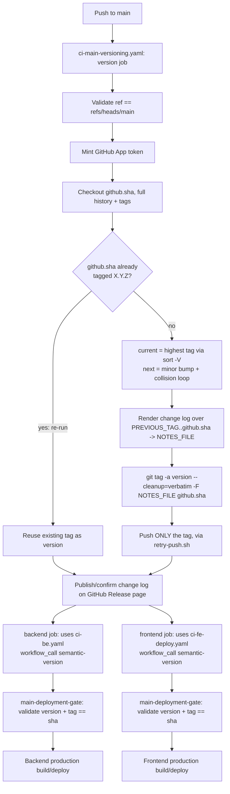
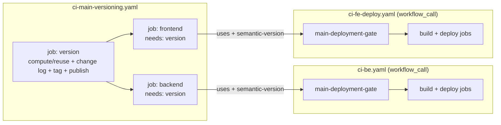

# Design Document: Main Branch Versioning

## Tag-Only Versioning (Current Implementation)

After PR review, this design replaced an earlier two-phase, marker-driven model (root `VERSION`
file + `CHANGELOG.md`, a bot commit back to `main`, and a commit-message loop guard) with a
**tag-only** model. There is no version file, no changelog file, and nothing is ever committed
back to `main`. The version lives exclusively in git tags; the change log lives exclusively in the
annotated tag message and the body on the tag's GitHub Release page (the GitHub Releases REST API
calls that object a "release", but it carries nothing beyond the tag and its change log).



The activation is deliberately narrow in scope but complete in mechanism: `ci-main-versioning.yaml`
owns tag/change-log/deployment-gate computation and orchestration; `ci-be.yaml` / `ci-fe-deploy.yaml`
keep owning build and deploy, invoked as reusable workflows rather than via their own `push` trigger
for `main`. No broader classifier, tag validator beyond `main-deployment-gate`, atomic batch
updater, branch-protection mutation, remote-tag cleanup tool, or extra helper file was introduced.

## Overview

This design implements automatic repo-wide semantic versioning, annotated git tagging, change log
generation, change log publication on GitHub, and reusable-workflow-driven production deployment
builds for backend and frontend, triggered for every versioning run on `main` in the Whitbread
digital-monorepo (see "Coalescing contract" below for how a burst of pushes maps to runs).

The atomic rule from the source proposal, as actually implemented:

> **Every versioning run on main = compute the version from tags → render the change log over
> (PREVIOUS_TAG, github.sha] → tag the pushed commit → publish the change log on the tag's GitHub
> Release page → build and deploy via the existing pipelines, called as reusable workflows with
> that version.**

### Single-run model (no second push)

Unlike an earlier design (see "Migration note" below), everything happens in **one** triggered
workflow run:

- **Phase 1 — version job.** `ci-main-versioning.yaml`'s `version` job computes (or reuses) the
  version, renders the change log, tags `github.sha` directly, and publishes the change log on the
  tag's GitHub Release page. It writes nothing to `main` — there is no second commit and therefore
  nothing to guard against re-triggering.
- **Phase 2 — reusable-workflow calls.** The same workflow run then calls `ci-be.yaml` and
  `ci-fe-deploy.yaml` as **reusable workflows** (`workflow_call`, `secrets: inherit`), passing the
  version as `semantic-version`. Because these are direct job-to-workflow calls (`needs: version`
  → `uses: ./.github/workflows/...`), not a second `push` event, there is no race and no loop to
  guard against.

`main` has been removed from the `push` trigger `branches` of both `ci-be.yaml` and
`ci-fe-deploy.yaml`, so a raw push to `main` no longer independently triggers their production
path — it is reachable only via the `workflow_call` from `ci-main-versioning.yaml`. Each of those
workflows re-validates the version and commit itself via a `main-deployment-gate` job before doing
any production work, so they never trust the caller blindly.

The feature reuses the monorepo's existing building blocks:

- The existing **GitHub App identity** (`vars.PIPELINE_APP_ID` / `secrets.PIPELINE_APP_PRIVATE_KEY`)
  via `actions/create-github-app-token@v3`, already used elsewhere in the pipeline.
- The existing production build/deploy logic in **`ci-be.yaml`** (→ `build-service.yaml`) and
  **`ci-fe-deploy.yaml`** — these keep ownership of building and deploying; this feature changes
  only *how* their production path is reached (reusable-workflow call, not their own push trigger)
  and *what version* it builds with.
- `resolve-image-tag.sh`'s existing main-line branch, extended to emit `SEMANTIC_VERSION` verbatim.

### Design principles

1. **Compute-first ordering.** The next version is computed (or reused) before the change log is
   rendered, because the change log is headed by the version. Enforced by step order within the
   `version` job.
2. **Tag directly on the pushed commit.** There is no intermediate marker commit: the annotated
   tag points at `github.sha` itself. This removes the need for any commit-message marker or loop
   guard, because there is no second, automation-authored push to distinguish from a human one.
3. **Idempotent by construction.** A re-run on an already-tagged `github.sha` reuses that version,
   skips change-log/tag creation, and still confirms the change log's GitHub Release page
   (accepting `422 already_exists` as success) and still calls the backend/frontend workflows — a
   retried run converges rather than double-tagging or getting stuck.
4. **No trust across the `workflow_call` boundary.** `ci-be.yaml` / `ci-fe-deploy.yaml` do not
   simply consume the `semantic-version` input; `main-deployment-gate` re-derives ground truth by
   checking that the git tag for that version actually resolves to `github.sha`.
5. **Reuse, don't rebuild.** Build and deploy logic, and the dev GitOps deployment mechanism, stay
   entirely owned by the existing `ci-be.yaml` / `ci-fe-deploy.yaml` / `build-service.yaml`
   pipelines. This feature is orchestration plus a small set of pure shell helpers, not a new build
   system.
6. **Pin the change log range explicitly.** `generate-changelog.sh` never lets
   `conventional-changelog-cli` pick its own "latest tag"; the workflow passes `PREVIOUS_TAG` and
   `TO_REF` (`github.sha`) and the script pins the exact range via a generated `--config` file,
   refusing to run if `PREVIOUS_TAG` is not an ancestor of `TO_REF`.
7. **Coalescing, not loss.** The workflow-level concurrency group coalesces a burst of pushes to
   `main` into the newest pending run; that run's change log covers every commit since the previous
   tag, so no commit's changes are dropped even though intermediate runs are replaced (see
   "Concurrency Control" under Architecture).

## Architecture

### End-to-end flow

```mermaid
sequenceDiagram
    participant Dev as Human push to main
    participant MV as ci-main-versioning.yaml (version job)
    participant Git as git tags / GitHub
    participant BE as ci-be.yaml
    participant FE as ci-fe-deploy.yaml

    Dev->>MV: push to main
    MV->>MV: validate ref == refs/heads/main
    MV->>Git: mint App token; checkout github.sha (full history + tags)
    MV->>Git: PREVIOUS_TAG = highest tag in github.sha's history, excluding github.sha itself (git tag --merged --no-contains)
    MV->>Git: git tag --points-at github.sha (semver only)
    alt github.sha already tagged
        Git-->>MV: existing tag X.Y.Z
        MV->>MV: reuse version, skip change log + tag creation (PREVIOUS_TAG already output)
    else not yet tagged
        MV->>Git: CURRENT_VERSION = highest tag via sort -V (or INITIAL_VERSION 1.3.0 if none)
        MV->>MV: compute-next-version.sh (minor bump + collision loop)
        MV->>MV: generate-changelog.sh (PREVIOUS_TAG, TO_REF=github.sha) -> NOTES_FILE
        MV->>Git: git tag -a <version> --cleanup=verbatim -F NOTES_FILE github.sha
        MV->>Git: retry-push.sh git push origin refs/tags/<version>
    end
    MV->>Git: POST /releases (tag_name, name, body) — 422 already_exists = success
    MV->>BE: uses ci-be.yaml (workflow_call semantic-version=<version>, secrets: inherit)
    MV->>FE: uses ci-fe-deploy.yaml (workflow_call semantic-version=<version>, secrets: inherit)
    BE->>BE: main-deployment-gate validates version + refs/tags/<v>^{commit} == github.sha
    FE->>FE: main-deployment-gate validates version + refs/tags/<v>^{commit} == github.sha
    BE->>BE: production build/deploy (image tag = version)
    FE->>FE: production build/deploy (image tag = version)
```

Key properties visible in this diagram:

- There is exactly **one** push involved *per versioning run* — a burst of pushes coalesces to the
  newest pending run (see "Concurrency Control" below). The version job and the two
  reusable-workflow calls all happen within that single run.
- The re-run branch (already-tagged) and the fresh-version branch converge at "publish/confirm
  change log", so both paths call the backend/frontend workflows identically.
- `main-deployment-gate` in each downstream workflow is the only place those workflows trust the
  version — and it re-derives trust from the tag/commit relationship in git, not from the
  `workflow_call` input alone.

### Workflow topology



`ci-main-versioning.yaml` has exactly three jobs:

- `version` (displayed as "Compute version, tag and publish change log") — the only job that
  touches git tags and the GitHub Release API. Outputs `version`.
- `backend` — `needs: version`; calls `ci-be.yaml` with `semantic-version:
  ${{ needs.version.outputs.version }}` and `secrets: inherit`; declares the union of permissions
  `ci-be.yaml`'s own jobs need (`actions: read`, `contents: read`, `security-events: write`,
  `id-token: write`, `pull-requests: write`, `issues: write`).
- `frontend` — `needs: version`; calls `ci-fe-deploy.yaml` the same way; declares the union of
  permissions `ci-fe-deploy.yaml`'s own jobs need (`actions: read`, `checks: read`,
  `contents: read`, `id-token: write`).

There is **no** build or deploy job inside `ci-main-versioning.yaml` itself — that responsibility
stays fully inside the called workflows.

### Relationship to existing CI

`ci-be.yaml` and `ci-fe-deploy.yaml` previously triggered their production path directly `on:
push: branches: [main]`. That branch has been removed from both workflows' `push` triggers.
Instead:

- Their production path is reachable **only** via `workflow_call` from `ci-main-versioning.yaml`.
- `main-deployment-gate` (`if: github.event_name == 'push' && github.ref == 'refs/heads/main'`) is
  the first job on that path. Because a called reusable workflow inherits the caller's event
  context (except `github.workflow`/`github.job`), `github.event_name` and `github.ref` inside the
  called workflow reflect the `push`-to-`main` event that triggered `ci-main-versioning.yaml`.
- `main-deployment-gate`'s `version-tag` step validates the `semantic-version` input and confirms
  `refs/tags/<semantic-version>^{commit}` resolves to `github.sha`, then outputs `semantic-version`
  and `checkout-sha` for downstream jobs.
- Downstream production jobs gate on `needs.main-deployment-gate.result == 'success'` (with an
  `always()` guard so non-main-push triggers, where the gate's `if` makes it skip rather than fail,
  are unaffected).
- PR / release / hotfix / perf triggers are completely untouched: `main-deployment-gate`'s own `if`
  condition means it does not even run for those events, and downstream jobs' gating conditions
  explicitly bypass the check when `github.event_name != 'push' || github.ref !=
  'refs/heads/main'`.

## Components and Interfaces

### 1. Version computation — `compute-next-version.sh`

**Location:** `.github/workflows/scripts/compute-next-version.sh` (pure, script-tested).

**Responsibility:** Produce the next semantic version from the current highest tag and the full
set of existing semantic-version tags (Requirements 2.2, 2.3, 3.1–3.9).

**Interface:**

| Input (env)         | Description                                                          |
| ------------------- | --------------------------------------------------------------------- |
| `CURRENT_VERSION`   | Highest existing `X.Y.Z` tag in the whole repo (from `sort -V`); empty ⇒ first version |
| `EXISTING_TAGS`     | Newline list of existing tags already filtered to `^[0-9]+\.[0-9]+\.[0-9]+$` |
| `INITIAL_VERSION`   | Initialisation value; the workflow sets `1.3.0`                       |

**Output:** `version=<X.Y.Z>` on `$GITHUB_OUTPUT`.

**Algorithm:**

```
1. If CURRENT_VERSION is empty -> candidate = INITIAL_VERSION
   Else validate CURRENT_VERSION against ^[0-9]+\.[0-9]+\.[0-9]+$ (hard failure if malformed);
        candidate = bump_minor(CURRENT_VERSION)   # X.(Y+1).0, minor parsed with 10# (base 10)
2. While candidate is present in EXISTING_TAGS:      # collision avoidance
       candidate = bump_minor(candidate)
3. Emit candidate
```

The caller (the `version` job) is responsible for computing `CURRENT_VERSION` and `EXISTING_TAGS`
from git tags before invoking this script — the script itself never inspects git.

### 2. Change log generation — `generate-changelog.sh`

**Location:** `.github/workflows/scripts/generate-changelog.sh` (thin wrapper, script-tested).

**Responsibility:** Render the change log headed by the already-computed version, from
conventional-commit history over exactly `(PREVIOUS_TAG, TO_REF]`, and write it to a runner-temp
file (Requirements 5, 5.2, 5.3, 5.6, 5.7).

**Interface:**

| Input (env)             | Description                                                         |
| ------------------------ | -------------------------------------------------------------------- |
| `VERSION` / `CHANGELOG_VERSION` | The already-computed version (required; either name accepted) |
| `PREVIOUS_TAG`           | Exclusive lower bound of the range; empty ⇒ first version           |
| `TO_REF`                 | Inclusive upper bound of the range (default `HEAD`); the workflow passes `github.sha` |
| `NOTES_FILE`             | Output path (default `changelog.md` in the CWD); the workflow sets it to `${{ runner.temp }}/changelog.md` |
| `CHANGELOG_CLI_VERSION`  | Exact pinned version of `conventional-changelog-cli` (default `5.0.0`) |
| `CHANGELOG_PRESET`       | Preset name (default `conventionalcommits`)                          |

**Mechanism:**

1. If `PREVIOUS_TAG` is non-empty, first verify `git merge-base --is-ancestor "$PREVIOUS_TAG"
   "$TO_REF"`; if that check fails the script exits `2` with an `::error::` line rather than
   rendering a change log over an unrelated range (Requirement 5.10).
2. Build a temp `--context` file containing only `{"version": "<VERSION>"}`, so the
   `conventionalcommits` writer's heading is the already-computed version rather than one derived
   from any `package.json` (Requirement 5.3).
3. Build a temp `--config` file (`config.cjs`) exporting `gitRawCommitsOpts: { from:
   process.env.CHANGELOG_FROM, to: process.env.CHANGELOG_TO }` — the range values are read from
   the environment at runtime, never interpolated into the generated JavaScript (Requirement 5.11).
4. Invoke, with `CHANGELOG_FROM="$PREVIOUS_TAG"` and `CHANGELOG_TO="$TO_REF"` exported:
   `npx --yes --package=conventional-changelog-cli@<exact> conventional-changelog --preset
   conventionalcommits --config <config.cjs> --context <context.json> --release-count 1 --outfile
   $NOTES_FILE`. `--config` pins the exact commit range so the tool never falls back to selecting
   its own "latest tag" as the range start (Requirement 5.9, 5.11). The tool is fetched on demand
   (no root `package.json` required) and is **not** reimplemented.

Two fallbacks are built in, unaffected by the range-pinning above (Requirement 5.12):

- No `PREVIOUS_TAG` (first version): writes `## <version> (<date>)\n\nFirst versioned change log
  of the monorepo.\n` directly, without invoking the tool or generating a config file.
- Tool produces an empty file even though a previous tag exists: writes a minimal
  `## <version> (<date>)` heading so the tag/release page still has a body.

### 3. Tag + change log publication — `version` job steps in `ci-main-versioning.yaml`

**Responsibility:** Determine whether `github.sha` is already tagged (re-run safety); if not,
compute the version, render the change log, tag `github.sha`, and push only the tag; then publish
(or re-confirm) the change log on the tag's GitHub Release page (Requirements 3, 4, 5.8, 5.9, 6, 7).

**Mechanism, in order:**

1. `actions/checkout` at `ref: github.sha`, `fetch-depth: 0`, `fetch-tags: true`, using the App
   token — needed so the full tag set and history are available locally.
2. Compute `PREVIOUS_TAG="$(git tag --merged "$GITHUB_SHA" --no-contains "$GITHUB_SHA" | grep -E
   "$semver_re" | sort -V | tail -n1)"` — the highest tag in **`github.sha`'s own history,
   excluding any tag on `github.sha` itself** (`--no-contains`) — and emit it as the
   `previous-tag` output. This runs **before** the re-run check so it is emitted on both the
   fresh and already-tagged paths (fixes review comment 4098436723: the already-tagged path
   previously never wrote `previous-tag`, so the step summary always reported `<none>` on a
   re-run). `PREVIOUS_TAG` normally equals `CURRENT_VERSION`; it differs only if a higher tag sits
   on a commit outside `main`'s history, whose commits must not be counted in the change log
   (Requirement 5.8).
3. Re-run check: `git tag --points-at "$GITHUB_SHA" | grep -E "$semver_re" | sort -V | tail -n1`.
   If non-empty, emit that as `version`, set `already-tagged=true`, and exit the compute step
   early (skip change log + tag on later steps) — `PREVIOUS_TAG` was already emitted in step 2.
4. Otherwise: `CURRENT_VERSION="$(git tag --list | grep -E "$semver_re" | sort -V | tail -n1)"`
   (highest tag in the **whole repo**), export it and `EXISTING_TAGS`, and run
   `compute-next-version.sh`.
5. `generate-changelog.sh` (gated `if: steps.compute.outputs.already-tagged != 'true'`), with
   `PREVIOUS_TAG` and `TO_REF: ${{ github.sha }}` — the change log covers exactly
   `(PREVIOUS_TAG, github.sha]` (Requirement 5.9).
6. Tag creation (same gate): derive `bot_actor="${APP_SLUG}[bot]"` from the app-token step's
   `app-slug` output (hard failure if empty), `git config --local user.name/user.email` to that
   identity, `git tag -a "$VERSION" --cleanup=verbatim -F "$NOTES_FILE" "$GITHUB_SHA"`, then
   `retry-push.sh git push origin "refs/tags/${VERSION}"`.
7. Change log publication (always runs, both branches, step "Publish change log on GitHub"): if
   `NOTES_FILE` is missing/empty (the re-run path never created it), reconstitute the change log
   from `git tag --list --format='%(contents)' "$VERSION"`. POST to the GitHub Releases API; `201`
   and `422 already_exists` are both treated as success.
8. Step "Report versioning summary": version, previous tag, tagged commit SHA, and the tag's
   GitHub Release page URL, written to `$GITHUB_STEP_SUMMARY`. Since `PREVIOUS_TAG` is now emitted
   on both paths (step 2), this reports the correct previous tag on a re-run too, not `<none>`.

### 4. Retry helper — `retry-push.sh`

**Location:** `.github/workflows/scripts/retry-push.sh` (generic, script-tested).

**Responsibility:** Wrap an arbitrary command (here, the tag push) in up to 3 attempts with
exponential backoff, then hard failure (Requirement 13.3).

**Interface:** `retry-push.sh <command> [args...]`; `RETRY_MAX_ATTEMPTS` (default 3),
`RETRY_BASE_DELAY` (default 2s). Backoff schedule: attempt 1 fails → sleep 2s; attempt 2 fails →
sleep 4s; attempt 3 fails → hard failure (no sleep after the last attempt). Used in this workflow
only for the tag push (`git push origin refs/tags/<version>`) — there is no branch push to retry.

### 5. Reusable-workflow calls — `backend` / `frontend` jobs in `ci-main-versioning.yaml`

**Responsibility:** Hand the computed/reused version to the existing pipelines and let them build
and deploy (Requirement 8).

**Mechanism:** `needs: version`; `uses: ./.github/workflows/ci-be.yaml` /
`./.github/workflows/ci-fe-deploy.yaml`; `with: semantic-version:
${{ needs.version.outputs.version }}`; `secrets: inherit`. Each job's `permissions:` block declares
the union of what the called workflow's own jobs need, since a called workflow cannot exceed the
calling job's permission grant.

### 6. `main-deployment-gate` — `ci-be.yaml` and `ci-fe-deploy.yaml`

**Responsibility:** Independently re-verify the `semantic-version` input and the commit before any
production job runs (Requirement 9).

**Mechanism (identical shape in both workflows):**

- `if: github.event_name == 'push' && github.ref == 'refs/heads/main'`.
- Checkout `github.sha` with `fetch-depth: 0`, `fetch-tags: true`, `persist-credentials: false`
  (no write access needed here).
- Step "Validate semantic version and tag" (`id: version-tag`) validates, in order:
  `semantic-version` non-empty → matches `^[0-9]+\.[0-9]+\.[0-9]+$` → `github.sha` matches
  `^[0-9a-f]{40}$` → `git rev-parse -q --verify "refs/tags/${SEMANTIC_VERSION}^{commit}"` equals
  `github.sha`.
- Outputs (from the `version-tag` step): `semantic-version`, `checkout-sha`.
- Downstream jobs depend on `main-deployment-gate` and gate with an `always() && (github.event_name
  != 'push' || github.ref != 'refs/heads/main' || needs.main-deployment-gate.result == 'success')`
  pattern, so non-main-push triggers bypass the gate entirely while `main` pushes require it to
  succeed. Those jobs also thread `checkout-sha` through as their checkout `ref` (falling back to
  `github.sha`) and `semantic-version` through to image tagging.

### 7. Production-deployment input validation — `build-service.yaml`

**Responsibility:** Defence in depth at the lowest-level reusable workflow: reject a
`semantic-version` that is malformed or supplied outside a `push`-to-`main` context, and require an
immutable 40-hex `checkout-ref` alongside it (Requirement 9, indirectly).

**Mechanism:** step "Validate main production deployment inputs" (`if: inputs.semantic-version !=
''`): fails unless `semantic-version` matches `^[0-9]+\.[0-9]+\.[0-9]+$`, unless
`github.event_name == 'push' && github.ref == 'refs/heads/main'`, and unless `checkout-ref` matches
`^[0-9a-f]{40}$`. A separate, unconditional step validates `checkout-ref`'s format whenever it is
supplied at all (used by other callers too, e.g. ephemeral rebuilds).

**Note (Known Limitation):** the Maven build still produces `${SERVICE_NAME}-1.0.0.jar` and the
Docker build still passes `--build-arg APP_VERSION=1.0.0` — both hardcoded. Only the **image tag**
(via `resolve-image-tag.sh`, Component 8) carries the real semantic version.

### 8. Main-line image tag — `resolve-image-tag.sh`

**Responsibility:** On the main-line path, emit the supplied semantic version verbatim as the
image tag (Requirement 10).

**Mechanism:** when `SEMANTIC_VERSION` is set and matches `^[0-9]+\.[0-9]+\.[0-9]+$`, the tag is
that value verbatim — no ref/sha/timestamp appended. The PR/ephemeral branch (`pr-<number>-<sha7>`)
and the non-semantic main-line fallback (`<app-version>-<ref>-<sha>-<timestamp>`, used by callers
that never pass `SEMANTIC_VERSION`) are both unchanged.

## Data Models

There is no version file and no changelog file. The durable state this feature produces is:

### Git tag

- **Name:** exactly the version string, unprefixed, e.g. `1.4.0` (Requirement 6.2).
- **Type:** annotated (`git tag -a`), created with `--cleanup=verbatim` so the message's Markdown
  headings are preserved (Requirement 6.4).
- **Target:** `github.sha` directly — the pushed commit itself (Requirement 6.3).
- **Tagger:** `<app-slug>[bot]` derived from the App token's `app-slug` output (Requirement 6.5).
- **Message:** the rendered change log (same content as the tag's GitHub Release page body).

### Change log file (ephemeral)

- **Path:** `${{ runner.temp }}/changelog.md` — exists only for the duration of the job run,
  never committed.
- **Content:** either the tool-rendered conventional-changelog entry over `(PREVIOUS_TAG,
  github.sha]`, the first-version fallback text, or the minimal dated-heading fallback
  (Requirements 5.5, 5.6, 5.9).

### GitHub Release (the tag's release page)

- **`tag_name` / `name`:** the version string.
- **`body`:** the change log (read from `NOTES_FILE`, or reconstituted from the tag's own
  contents on a re-run where change log generation was skipped).
- **Idempotency:** a `422 already_exists` response from the create call is treated as success.

### Workflow contracts

| Producer | Output/Input | Consumer | Meaning |
| --- | --- | --- | --- |
| `version` job | `outputs.version` | `backend`, `frontend` jobs | The computed/reused semantic version |
| `version` job (`compute` step) | `outputs.previous-tag` | `generate-changelog.sh` step (`PREVIOUS_TAG`), step summary | The change log's lower bound: the highest tag in `github.sha`'s own history, excluding `github.sha` itself; emitted on both the fresh and already-tagged paths |
| `backend`/`frontend` job | `with.semantic-version` | `ci-be.yaml` / `ci-fe-deploy.yaml` (`inputs.semantic-version`) | Version handed across the `workflow_call` boundary |
| `main-deployment-gate` (`version-tag` step) | `outputs.semantic-version`, `outputs.checkout-sha` | downstream build/deploy jobs in the same workflow | Re-verified version and commit, safe to build with |
| `git tag <version>` | — | `main-deployment-gate` (`git rev-parse refs/tags/<v>^{commit}`) | Ground truth the gate checks the `workflow_call` input against |

Unlike the superseded two-phase design, there is no cross-run contract carried by a commit-message
marker or a version file — the tag itself (checked live by `main-deployment-gate`) is the entire
cross-workflow contract, and it exists within a single triggered run.

## Correctness Properties

*A property is a characteristic or behavior that should hold true across all valid executions of a
system — essentially, a formal statement about what the system should do. Properties serve as the
bridge between human-readable specifications and machine-verifiable correctness guarantees.*

The great majority of this feature's acceptance criteria are CI/CD orchestration, git side effects,
authentication, and reusable-workflow wiring — verified by integration and example tests (see
Testing Strategy), not by property-based testing. The three properties below cover the feature's
genuinely pure, input-varying logic: version computation, collision avoidance, and the main-line
tag format. (A fourth property, the loop-guard predicate from the superseded two-phase design, has
been removed along with `version-should-run.sh` — there is no second push to guard against, so the
properties are renumbered 1–3 below with no gap.)

### Property 1: Minor-bump invariant

*For any* valid semantic version `X.Y.Z`, `compute-next-version.sh` (when the computed candidate
does not collide with an existing tag) produces a version that preserves the major `X`, sets the
minor to `Y+1`, and resets the patch to `0` — regardless of any commit content, because the
function takes only the current version as input.

**Validates: Requirements 3.1, 3.2, 3.3, 3.4, 3.6**

### Property 2: Next-available version avoids existing tags

*For any* current version and *any* set of already-existing version tags, the version chosen by
`compute-next-version.sh` is never a member of that existing-tag set, and is reachable by one or
more minor bumps from the current version (monotonic minor progression).

**Validates: Requirements 3.8**

### Property 3: Main-line image tag equals the semantic version

*For any* valid semantic version supplied on the merge-to-main path, `resolve-image-tag.sh` returns
exactly that version string, with no branch, SHA, or timestamp components appended.

**Validates: Requirements 2.5, 10.1**

## API Contracts

### GitHub Releases — create a release

The only external HTTP contract this feature owns.

**Request**

```
POST {GITHUB_API_URL}/repos/{GITHUB_REPOSITORY}/releases
Authorization: Bearer <GitHub App token>
Accept: application/vnd.github+json

{
  "tag_name": "<version>",
  "name": "<version>",
  "body": "<change log>"
}
```

**Response handling**

| HTTP status | Body condition | Outcome |
| --- | --- | --- |
| `201` | — | Success; change log published on the tag's GitHub Release page |
| `422` | `.errors[].code == "already_exists"` | Treated as success (idempotent re-run) |
| any other | — | Hard failure; response body logged to stderr, job fails |

The tag itself (`refs/tags/<version>`) must already exist and point at `github.sha` before this
call is made on the fresh-tag path; on the re-run path the tag already existed from a prior run.

## Error Handling

| Scenario | Requirement | Handling |
| --- | --- | --- |
| Checked-out ref is not `refs/heads/main` | 1.3 | "Validate fixed production target" step fails immediately, before any token or tag work |
| Malformed current-version tag (defensive check) | 3.7 | `compute-next-version.sh` fails fast with an actionable message; no silent reset to `INITIAL_VERSION` |
| Computed candidate collides with an existing tag | 3.8 | Collision loop bumps the minor again before selecting |
| `github.sha` already tagged (re-run) | 4.1–4.3 | Reuse the existing tag's version; skip change log generation and tag creation; still publish/confirm the change log on the tag's GitHub Release page and still call backend/frontend |
| `PREVIOUS_TAG` is non-empty but not an ancestor of `TO_REF` | 5.10 | `generate-changelog.sh` exits `2` with an `::error::` line before invoking the changelog tool; the job fails rather than rendering a change log over an unrelated range |
| App-slug output empty | 6.5 | Tag-creation step fails fast before attempting `git config`/`git tag` |
| Tag creation or tag push fails | 6.8, 13.3 | `retry-push.sh` retries the push up to 3 times with backoff; persistent failure fails the job; no change log is published for an untagged version and the backend/frontend jobs (which `need: version`) never run |
| Change log's GitHub Release already exists (`422 already_exists`) | 7.4 | Treated as success, not failure |
| Change log publication API call fails otherwise | 7.5 | Job fails; response body logged |
| GitHub App token generation fails | 11.4 | Standard actionable error from `create-github-app-token`; job fails before any git/API work |
| `main-deployment-gate` validation fails (empty/malformed version, malformed SHA, tag ≠ sha) | 9.2–9.5 | `main-deployment-gate` job fails; downstream production jobs are skipped via the `needs`/`if` gate |
| Concurrent pushes to `main` | 12.1–12.2, 12.4 | `production-main-versioning` concurrency group (`cancel-in-progress: false`) coalesces a burst of pushes into the newest pending run (Coalescing contract); the queued run always computes from the previous run's tag and its change log covers every superseded commit |
| Workflow exceeds time budget | 13.1 | `timeout-minutes: 10` on the `version` job reports a timeout failure rather than hanging |
| Backend JAR / `APP_VERSION` still `1.0.0` | Known Limitation | Not an error condition — documented limitation; only the image tag carries the real version |
| Version component exceeds 64-bit bash arithmetic | Known Limitation | Not detected or guarded against; documented limitation |

Every step logs its outcome to the job log; the version job additionally writes a step summary
(Requirement 7.6). Failures surface as ordinary GitHub Actions status checks (Requirement 13.4).

## Testing Strategy

This feature is CI/CD orchestration with a thin core of pure logic. Testing is split between
**property-based tests** (the pure version/tag logic) and **example + integration tests** (workflow
wiring, git side effects, change log publication, reusable-workflow gating). Property-based testing is
deliberately **not** applied to workflow triggering, git/GitHub platform behaviour, the third-party
changelog tool, or the reusable-workflow call mechanism itself — those are external-service and
configuration concerns where randomisation adds no bug-finding power over a few representative
examples.

**Current status:** the bats-core test directory and shared generator harness are scaffolded
(`.github/workflows/scripts/tests/`, `helpers/generators.bash`), but the individual `.bats` files
have not yet been written. See `.github/workflows/scripts/tests/README.md` for the intended layout.

### Property-based tests (not yet implemented)

The pure shell helpers (`compute-next-version.sh` and the main-line branch of
`resolve-image-tag.sh`) are intended to be property-tested with **bats-core** driving a lightweight
generator harness (random valid semantic versions, random existing-tag sets), each test running a
**minimum of 100 generated iterations** and tagged with a comment referencing its design property,
format: **Feature: main-branch-versioning, Property {number}: {property_text}**.

| Property | Script under test | Generator | Test file (planned) |
| --- | --- | --- | --- |
| P1 Minor-bump invariant | `compute-next-version.sh` | random `X.Y.Z` incl. large components; empty input as an edge case | `compute-next-version.bats` |
| P2 Next-available avoids existing tags | `compute-next-version.sh` | random current version + random existing-tag sets incl. runs of consecutive minors | `compute-next-version.bats` |
| P3 Main-line tag == version | `resolve-image-tag.sh` (main path) | random valid semantic versions | `resolve-image-tag.bats` |

(If the team prefers Python for the harness, `hypothesis` driving the scripts via subprocess is an
acceptable substitute; either way the third-party changelog tool is a dependency, not a
from-scratch implementation.)

### Example / unit tests (not yet implemented)

- `compute-next-version("1.3.0") == "1.4.0"` (Req 3.5); empty `CURRENT_VERSION` ⇒
  `INITIAL_VERSION` (Req 2.3); malformed `CURRENT_VERSION` ⇒ error (Req 3.7) — `compute-next-version.bats`.
- Retry helper: at most 3 attempts with increasing backoff, then fails — `retry-push.bats`.
- Changelog wrapper: given a version and sample conventional commits, the entry heading contains
  the version and a date and groups by type; first-version and empty-output fallbacks produce the
  documented minimal text (Reqs 5.1, 5.3, 5.5, 5.6); a `PREVIOUS_TAG` that is not an ancestor of
  `TO_REF` exits `2` (Req 5.10); the rendered range matches the `CHANGELOG_FROM`/`CHANGELOG_TO`
  pinned via the generated `--config` file rather than the tool's own "latest tag" (Reqs 5.9, 5.11).

### Integration tests

Exercised via manual/sandbox verification during activation; formalising these as automated
integration tests remains open work:

- Trigger scope: the workflow runs on push to `main` only; not on PRs, other branches, or tag
  pushes (Reqs 1.1, 1.2); a mismatched checked-out ref fails fast (Req 1.3).
- Re-run safety: re-running the workflow on an already-tagged `github.sha` reuses the version,
  writes no new tag, and still succeeds at the change-log-publish and reusable-workflow-call steps
  (Reqs 4.1–4.3).
- Tag correctness: the tag points directly at `github.sha`, is annotated with `--cleanup=verbatim`,
  and its tagger identity is `<app-slug>[bot]` (Reqs 6.2–6.5).
- Change log idempotency: a second publish attempt for the same version returns `422
  already_exists` and is treated as success (Req 7.4); on that path the change log body is read
  back from the tag's own contents (Req 7.3).
- Reusable-workflow wiring: `ci-be.yaml` / `ci-fe-deploy.yaml` run their production path only when
  invoked via `workflow_call` from `ci-main-versioning.yaml`; a raw push to `main` alone does not
  trigger their production path directly (Req 1.5, 8.4, 8.5).
- `main-deployment-gate`: fails closed on an empty/malformed `semantic-version`, a malformed SHA,
  or a tag that does not point at `github.sha`; succeeds and outputs both values when everything is
  consistent (Reqs 9.2–9.6); downstream jobs are correctly skipped/gated in both cases (Req 9.7).
- Concurrency and coalescing: two near-simultaneous pushes to `main` serialise via the
  `production-main-versioning` group; if the second lands while the first is still running, it
  supersedes any further-queued run so only the newest is versioned (Req 12.4), and the two runs
  that do execute produce two distinct, non-colliding versions (Req 12.1, 12.2, 3.8).
- Main-line image tag: the built image tag equals the semantic version, not a SHA+timestamp
  composite (Req 10.1).

### Smoke / configuration checks

- No root `VERSION` or `CHANGELOG.md` file exists or is consulted (Req 2.1).
- Per-stack versioning (Changesets, Maven `${revision}`, package.json versions) is not consulted on
  this path (Req 2.4).
- The `version` job sets `timeout-minutes: 10`; an overrun reports a timeout failure (Req 13.1).
- Each step logs status; failures surface as GitHub Actions status checks (Reqs 13.2, 13.4).
- The tag and its change log are discoverable via `git tag`/`git describe` and the GitHub Releases
  UI (Req 14.3).

## Integration with Existing Workflows

`ci-be.yaml` and `ci-fe-deploy.yaml` previously ran their production path directly on `push` to
`main`. That coupling has been replaced with an explicit reusable-workflow call from
`ci-main-versioning.yaml`:

1. `main` was removed from the `push` trigger `branches` of both `ci-be.yaml` and
   `ci-fe-deploy.yaml`; both gained a `workflow_call` trigger with a required `semantic-version`
   string input.
2. Both workflows' concurrency groups were changed to literal names
   (`BE CI Orchestrator-${{ github.ref }}`, `CI FE Deploy-${{ github.ref }}`) instead of
   `${{ github.workflow }}-...`, because inside a called workflow `github.workflow` resolves to the
   **caller's** name and would otherwise merge the two pipelines' concurrency groups.
3. Both workflows gained a `main-deployment-gate` job that independently validates the
   `semantic-version` input and the tag/commit relationship before any production job runs;
   downstream jobs gate on its success while non-main-push triggers bypass it entirely.
4. `resolve-image-tag.sh`'s main-line branch was extended to accept `SEMANTIC_VERSION` and emit it
   verbatim; the PR/ephemeral and non-semantic main-line branches are untouched.
5. `build-service.yaml` gained input validation for `semantic-version` (format, push-to-main-only,
   paired 40-hex `checkout-ref`) as defence in depth at the lowest-level reusable workflow.
6. `generate-changelog.sh` gained `TO_REF`, the ancestor check against `PREVIOUS_TAG`, and the
   generated `--config` file that pins the rendered range, so the change log's commit range is
   never left to the changelog tool's own default.

PR / release / hotfix / perf behaviour in both workflows is untouched — the gate's own `if`
condition means it does not run at all for those events, and downstream jobs bypass the gate
requirement whenever the event is not a `push` to `main`.

> **Migration note.** An earlier iteration of this design used a two-phase, marker-driven model: a
> `VERSION` file and `CHANGELOG.md` were written and committed back to `main` by a bot commit whose
> message (`bumped minor version on main <version>`) doubled as a loop guard for the versioning
> workflow and a positive trigger for `ci-be.yaml` / `ci-fe.yaml`'s main-line build. That model, its
> `version-should-run.sh` loop guard, its property test, and the `main-test` canary trigger used
> while developing it have all been removed. The current design tags `github.sha` directly, never
> writes to `main`, and reaches the backend/frontend pipelines through a direct reusable-workflow
> call rather than a second push — eliminating the need for any loop guard entirely.
