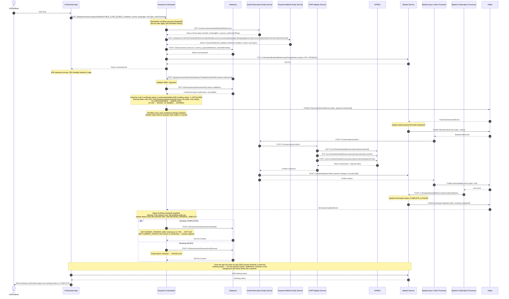
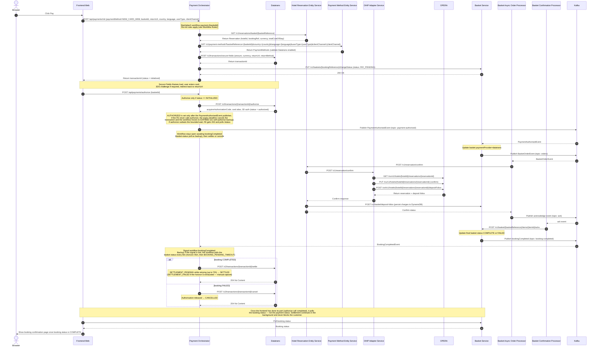

# New Card Payment: End-to-End Architecture

End-to-end design for the **new card payment** journey across both **Secure Fields (web)**
and **Mobile SDK Version 4 (https://docs.datatrans.ch/docs/mobile-sdk-4-whats-new) (native apps)**. Covers the full path from the customer surface
(Premier Inn web frontend and mobile apps) through the Payment Orchestrator, Datatrans,
Basket, OPERA, and booking confirmation.

Use this as the reference when working on any part of the new-card payment flow across
frontend, mobile, or backend. Stack- and module-specific detail still lives in the
relevant Tier 3 module steering.

## Scope

- **In scope:** Paying for a reservation with a **new card** via:
  - Secure Fields (hosted iframe) integration for web
  - Mobile SDK version 4 (native) integration for iOS/Android apps
  - Including 3-D Secure (TDS) challenge, tokenisation of the card for future use,
    deposit/folio posting to OPERA, and booking confirmation.
- **Out of scope:** Stored/wallet card payments (separate flow), Apple Pay, Google Pay,
  PayPal, refunds, and amend/cancel journeys.

## Participants

| Participant | Role |
|---|---|
| **Browser** | Customer surface (web). Renders the payment page and the Secure Fields card iframe. |
| **iOS/Android** | Customer surface (mobile). Renders the SDK payment UI natively. |
| **Frontend Web** | Web BFF layer. Orchestrates the client experience and initialises the Secure Fields JS library. |
| **Payment Orchestrator** | Backend service coordinating the payment. Talks to Hotel Reservation Entity Service, Datatrans, OPERA, and downstream services. |
| **Datatrans** | Payment gateway. Hosts Secure Fields iframe (web) and Mobile SDK version 4 (native). Performs authorization, 3DS, and returns reusable card tokens. |
| **Hotel Reservation Entity Service** | Holds the reservation/basket state for the booking being paid. Provides reservation details by basket reference. |
| **OPERA** | Property/hospitality platform (OHIP). Receives the deposit/folio posting. |
| **Basket Async Order Processor** | Processes booking confirmation events asynchronously. |
| **Basket Confirmation Processor** | Finalises and confirms the booking after payment succeeds. Listens to booking completion events. |
| **Payment Method Entity Service** | Provides and validates available payment methods per hotel. |
| **Content Entity Service** | Provides content/configuration data. |
| **AEM** | Content management — serves payment-related content/pages. |
| **OHIP Adapter Service** | Adapter in front of OPERA (OHIP). Confirms reservations and posts deposit folios to OPERA. |
| **Basket Service** | Owns basket/order state. Updates paymentProvider, persists deposit folios to DynamoDB, drives booking confirmation, and publishes booking lifecycle events. |
| **Kafka** | Event backbone for the async booking-confirmation choreography (payment-authorised, orders, ack, booking-completed events). |

## API Endpoints (Payment Orchestrator)

| Endpoint | Channel | Datatrans API | Purpose |
|---|---|---|---|
| `POST /api/payments/init` | Web + Mobile | `POST /v2/transactions/secure-fields` (web) / `POST /v2/transactions` (mobile) | Unified polymorphic init — the request's `paymentMethod` discriminator (`NEW_CARD_WEB` / `NEW_CARD_MOBILE`) selects the flow (CTECH-12559; replaces the old `/secure-fields` and `/mobile-sdk` endpoints) |
| `POST /api/payments/authorize` | Web | `POST /v2/transactions/{transactionId}/authorize` | Finalize authorization post-3DS. Returns `200` with the result, or `202` (`AUTHORIZATION_PENDING`) when the workflow is still processing after the bounded wait — the client then polls the status endpoint |
| `GET /api/payments/{basketId}/status` | Web | — (workflow queries) | Payment status and last authorize result. Used to resolve a `202 AUTHORIZATION_PENDING` from authorize (and by ops tooling) — the booking-confirmation screen polls the booking status via the basket/booking APIs instead |
| `POST /api/payments/webhooks/datatrans` | Mobile | — (called by Datatrans) | Webhook callback after SDK payment (`basketId` query param carries the correlation key) |

## Key Rules

- **Booking-ref check** — verify whether the reservation already has a booking reference
  at the point the payment is initiated.
- **Payment method validation** — get and validate available payment methods for the
  specific hotel before proceeding.
- **Auto-settle = false** — both flows use deferred settlement. Settlement happens
  *after* the BookingCompletedEvent is received indicating successful booking confirmation.
- **Tokenisation** — on successful authorization, Datatrans returns a card alias (token)
  that can be stored for future payments.
- **Status transitions** — the payment workflow moves through `INITIALIZED → AUTHORIZED → SETTLEMENT_PENDING → SETTLED`, with `FAILED` (retryable — the workflow stays open for re-initialisation), `EXPIRED` and `CANCELLED` (final), and two parked-for-operations final states: `SETTLEMENT_FAILED` (booking confirmed, capture exhausted its retry horizon) and `BOOKING_PENDING_TIMEOUT` (authorised, booking outcome never became knowable). Authorisation happens after 3DS (web) or the SDK webhook (mobile). Settlement is triggered by BookingCompletedEvent with status=COMPLETED (or the basket-status poll finding the booking complete); cancellation by status=FAILED. See "Payment Lifecycle & Workflow Rules".
- **Merchant ID resolution** — the Payment Orchestrator dynamically resolves Datatrans merchant IDs based on hotel codes from reservations. In production (`@Profile("opera-prod")`), merchant IDs are constructed directly as `"deWB-" + hotelCode` since all hotels have provisioned accounts. In sandbox environments (`@Profile("!opera-prod")`), only specific hotels (configurable list: HARHOR, GRESOU) have provisioned merchant accounts; all other hotels fall back to a default merchant ID (`"deWB-default"`) for testing purposes.

## Payment Lifecycle & Workflow Rules

The payment is modelled as a single long-running Temporal workflow per basket, with
workflow id `payment-{basketId}`. The workflow is the source of truth for payment state
and owns the timers that drive the backup/reconciliation paths.

### Settlement timing (CTECH-12506)

After a payment reaches `AUTHORIZED`, the workflow awaits a `BookingCompletedEvent` signal 
from the Kafka consumer. Based on the event status:
- `COMPLETED` → workflow calls `settleTransaction` and moves to `SETTLED`
- `FAILED` → workflow calls `cancelTransaction` and moves to `CANCELLED`

The BookingCompletedEvent is published by the Basket Service after the booking confirmation
choreography completes (OPERA deposit posting, basket finalization). This ensures payments
are only captured for successfully confirmed bookings.

The Kafka signal is the fast path, not the only one. Each poll interval (default 60 s) that
passes without a signal, the workflow asks the Basket Service for the basket status directly
and settles or cancels on that answer. If the polling horizon (default 45 min) is exhausted
with the booking still undecided, the workflow parks as `BOOKING_PENDING_TIMEOUT` — the
authorisation is deliberately neither cancelled (the booking may still complete — a free
stay) nor settled (it may not — a charge for nothing) and an operator reconciles manually.
Configuration: `integrations.payment.workflow.booking-poll.{interval, horizon}`.

Settlement itself is a long-horizon durable retry (`SETTLEMENT_PENDING` while it runs):
default 72 hours with exponential backoff capped at 15 minutes, because at that point the
guest has a confirmed booking and a gateway outage is not a reason for a free stay. If the
horizon is exhausted, the workflow parks as `SETTLEMENT_FAILED` with the authorisation left
intact for manual capture in the Datatrans dashboard. Configuration:
`integrations.payment.workflow.settlement.{retry-horizon, backoff-cap, attempt-timeout}`.

### Basket status transition (PAY_PENDING)

Before returning the Datatrans transaction ID to the frontend or mobile app, the workflow
transitions the basket to `PAY_PENDING` status via `PUT /v1/baskets/{bookingReference}/changeStatus`.
This is required because downstream services (Basket Service) expect the basket to be in
`PAY_PENDING` before processing the `PaymentAuthorisedEvent`. The `bookingReference` is the
3-letter + 7-digit identifier from the reservation (e.g. `ARH1234567`).

- **Timing:** After Datatrans init returns the transactionId, before returning it to the client.
- **Failure handling:** Fatal — if the status change fails, the init returns an error and no
  transactionId is provided to the client. The payment flow does not proceed.
- **Applies to:** Both Secure Fields and Mobile SDK flows.

### Workflow states

`INITIALIZED` → `AUTHORIZED` → `SETTLEMENT_PENDING` → `SETTLED`, plus `FAILED`, `EXPIRED`,
`CANCELLED`, `SETTLEMENT_FAILED`, and `BOOKING_PENDING_TIMEOUT`.

Two different cuts of the lifecycle matter and must not be confused (they are two distinct
predicates on the `PaymentStatus` enum):

- **Authorisation phase over** (`authorizationPhaseComplete()`): true for `AUTHORIZED` and
  every failure state — what the workflow's await loops use.
- **Workflow can close** (`isFinal()`): `SETTLED`, `CANCELLED`, `EXPIRED`,
  `SETTLEMENT_FAILED`, `BOOKING_PENDING_TIMEOUT`. `FAILED` is deliberately NOT final — it
  permits re-initialisation, so the workflow stays open for another attempt inside the
  expiry window. `SETTLEMENT_PENDING` is not final because the settle retry horizon has not
  resolved yet.

`EXPIRED` covers the whole pre-authorisation lifecycle: the expiry deadline (default 30 min)
starts when the workflow starts, so a session whose init keeps failing — or that never
successfully initialises at all — still expires rather than waiting forever. `CANCELLED`
means a re-init superseded the transaction, the gateway confirmed a cancellation, or booking
completion returned a failed status. `SETTLEMENT_FAILED` and `BOOKING_PENDING_TIMEOUT` are
final for the workflow but hold customer funds and need an operator; re-initialisation is
rejected in those states (a second attempt would hold the money twice). Both parked states
end the execution by FAILING it with a typed `ApplicationFailure` (type = the status name)
rather than returning — so parked payments show as Failed in the Temporal UI and in
workflow-failure metrics instead of hiding among Completed workflows. The payment status
remains queryable on the failed execution.

### Re-initialisation rules (both web and mobile)

When `POST /api/payments/init` is called and a workflow already exists for the basket:

1. **No transactionId yet, or previous attempt FAILED** — proceed normally within the same
   workflow: fetch the reservation, create the Datatrans transaction, store and return the
   new transactionId. Both strategies report an init failure as an error result and leave
   the payment `INITIALIZED`, so the customer's retry re-initialises the same workflow.
2. **transactionId exists AND not yet authorised/settled** — release the existing Datatrans
   transaction and create a fresh one, returning the new transactionId. "Release" means: ask
   the gateway for the transaction's status and cancel only if it reports `authorized`
   (Datatrans rejects cancels in any earlier state; an `initialized` transaction lapses at the
   gateway on its own). We deliberately do NOT reuse the existing transaction. Rationale: the customer may have changed the booking
   (e.g. added extras in another tab) between attempts; reusing a stale transaction could
   let them pay an out-of-date, lower amount. "At most one live transaction per basket,
   always reflecting the current amount" is the invariant.
3. **Already authorised or settled** — reject with `409 Conflict`
   (`TRANSACTION_ALREADY_AUTHORIZED` / `INVALID_TRANSACTION_STATE`).
4. **Funds held** (`SETTLEMENT_PENDING`, `SETTLEMENT_FAILED`, `BOOKING_PENDING_TIMEOUT`) —
   reject: an authorisation is outstanding, so a new attempt would hold the customer's money
   twice. Unlike `FAILED`, these are not the customer's to retry.
5. **EXPIRED** — reject with the `EXPIRED` error code; the customer starts a fresh session.

The frontend must always use the transactionId from the latest init response. The workflow's
`authorizationInProgress` guard rejects an init while an authorisation is running.

### Backup / reconciliation (Temporal timers)

Both backups are implemented as durable in-workflow Temporal timers, not an external scanner.

- **Authorisation backup (Mobile SDK).** After init completes, the workflow starts a
  fixed-cadence reconciliation poller that calls `GET /v2/transactions/{transactionId}`
  on a configurable interval (default: every 30 s, starting after a 2 min initial delay).
  If the transaction is `authorized` or `settled`, the workflow self-authorises via the
  shared `authorize()` path and runs the settlement chain. If `canceled` or `failed`, the
  workflow transitions to `CANCELLED` / `FAILED`. If `TransactionNotFoundException` (HTTP 404)
  is received, the transaction has expired or never existed and the workflow moves to `FAILED`.
  Gateway/availability errors are transient — the poller logs a warning and retries on the
  next cadence. If no terminal status is reached by the reconciliation deadline (default:
  30 min), the workflow expires (`EXPIRED`). The Datatrans webhook remains the primary path;
  the poller is the backup. Whichever wins first owns the authorisation — the other is
  discarded by the `INITIALIZED` state guard and `authorizationInProgress` flag.
  Configuration: `integrations.datatrans.reconciliation.{initial-delay, poll-interval,
  max-duration, enabled}`.
- **Authorisation backup (Secure Fields).** After init, the workflow awaits the frontend
  `POST /api/payments/authorize` call. There is NO self-authorising backup poller for the
  web flow today: if the frontend never calls authorize, the expiry deadline fires, the
  workflow cancels the Datatrans transaction (guarded so an in-flight authorisation is never
  cancelled underneath the caller) and moves to `EXPIRED`. A reconciliation poller in the
  mobile pattern remains a possible future addition.
- **Booking-completion backup (both flows).** After `AUTHORIZED`, the basket-status poll
  described under "Settlement timing" backs up the `bookingCompleted` Kafka signal.

### Timing windows

- **Pre-authorisation expiry window:** 30 minutes by default
  (`integrations.payment.workflow.timeout`), tied to Datatrans transaction-id validity and
  the 30-minute room-hold TTL on the booking. The deadline is absolute and starts when the
  workflow starts — it covers waiting for the first successful init too, so a session whose
  init keeps failing still expires. If no authorisation lands within the window the workflow
  cancels any live transaction (guarded against in-flight authorisations) and moves to
  `EXPIRED`. For Mobile SDK, the reconciliation poller runs within this window
  (configurable: initial delay 2 min, poll interval 30 s, max duration 30 min).
- **authorise → settle:** bounded by the booking-poll horizon (45 min to a decision or
  `BOOKING_PENDING_TIMEOUT`) plus the settlement retry horizon (72 h to `SETTLED` or
  `SETTLEMENT_FAILED`). See "Settlement timing".

### Concurrency / state guards

Temporal executes a workflow's signals, updates, and timer callbacks one at a time on a
single deterministic thread, so there are no true data races and no external locking is
needed. Each transition must still guard on current state to prevent logical
double-execution (e.g. the FE authorise call racing the authorisation-backup timer):

- authorise only if `status == INITIALIZED`;
- the init endpoint is guarded by the "initialisation in progress" flag.

---

## Flow 1: Mobile SDK version 4 (iOS/Android)

### Sequence Diagram



### Step Summary (Mobile SDK version 4)

1. **User clicks Pay** in the mobile app.
2. **App calls backend**: `POST /api/payments/init` with `paymentMethod: "NEW_CARD_MOBILE"`, `basketId`, `country`, `language`, `userType`, and `clientChannel`. The orchestrator starts or attaches to workflow `payment-{basketId}` (update-with-start) and applies the re-init rules.
3. **Get Reservation** from Hotel Reservation Entity Service (`GET /v1/reservations/basket/{basketReference}`).
4. **Validate payment methods** via Payment Method Entity Service (`GET /v1/payment-methods?basketReference={basketId}&country={country}&language={language}&userType={userType}&clientChannel={clientChannel}`). Confirm a Datatrans-backed card payment method is enabled for the hotel. Extract accepted card type codes (e.g. `["VIS", "ECA", "AMX"]`) to pass to Datatrans.
5. **Init Datatrans**: `POST /v2/transactions` with amount, currency, paymentMethods (from step 4). `autoSettle = false`.
6. **Change basket status to PAY_PENDING**: `PUT /v1/baskets/{bookingReference}/changeStatus` with body `{"status": "PAY_PENDING"}`. This ensures the basket is in the correct state before the mobile app begins the payment flow. Failure is fatal — the init returns an error.
7. **Return transactionId** to the app; the app starts the SDK and the user completes the payment natively (including 3DS).
7. **Datatrans calls the webhook**: `POST /api/payments/webhooks/datatrans?basketId={basketId}` (status = authorized). The orchestrator validates the HMAC signature (when enabled) and the workflow drops any payload whose transactionId does not match its own.
8. **Status validation (every status, not just authorized)**: the webhook's claimed status — positive or negative — is treated as a hint only. The workflow calls `GET /v2/transactions/{transactionId}` and lets the gateway's own answer resolve the payment: `authorized`/`settled` → `AUTHORIZED`, `failed` → `FAILED`, `canceled` → `CANCELLED`. If the gateway still reports the transaction in-flight, the webhook is dropped and the workflow keeps waiting/polling — an unverified claim (e.g. a forged "canceled") can never kill a live attempt. Card data for the event is sourced from the status response (not the webhook payload).
9. **Authorisation backup (reconciliation poller)**: after a 2-minute initial delay, the workflow polls `GET /v2/transactions/{transactionId}` every 30 seconds. If `authorized`/`settled`, it self-authorises and publishes the `PaymentAuthorisedEvent`. If the transaction returns 404 (expired/not found), the workflow moves to `FAILED`. If the 30-minute deadline passes with no terminal status, the workflow moves to `EXPIRED`. The webhook remains the primary path — whichever arrives first wins.
11. **Publish `PaymentAuthorisedEvent`** to the `payment-authorised` Kafka topic. `AUTHORIZED` is set only after the publish succeeds; if the event cannot be published within its horizon (default 3 min), the workflow compensates — cancels the authorisation and fails the attempt — so no money is held against a booking that never starts. The workflow then stays open awaiting the booking outcome (see "Settlement timing"). From here the booking-confirmation choreography is driven by downstream services: Basket sets `paymentProvider=datatrans` → `BasketOrderEvent` (orders) → Basket Async Order Processor → Hotel Reservation Entity Service → OHIP Adapter → OPERA (confirm reservation + deposit folios) → deposit folios persisted to Basket (DynamoDB) → ack event → Basket Confirmation Processor → final basket status `COMPLETE`/`FAILED` → `bookingCompleted` event → settlement with Datatrans.
11. **App polls the booking status** (basket/booking APIs) once the SDK journey is finished, and shows the booking confirmation page when the booking status is COMPLETE. The app never polls the payment status — settlement continues in the background and never blocks the customer.

---

## Flow 2: Secure Fields (Web)

### Sequence Diagram



### Step Summary (Secure Fields)

1. **User clicks Pay** in the browser.
2. **Frontend calls backend**: `POST /api/payments/init` with `paymentMethod: "NEW_CARD_WEB"`, `basketId`, `returnUrl`, `country`, `language`, `userType`, and `clientChannel`. The orchestrator starts or attaches to the workflow `payment-{basketId}` (update-with-start) and applies the re-init rules (see Payment Lifecycle & Workflow Rules).
3. **Get Reservation** from Hotel Reservation Entity Service (`GET /v1/reservations/basket/{basketReference}`) — provides hotelId, bookingReference, currencyCode, totalCostOfStay.
4. **Validate payment methods** via Payment Method Entity Service (`GET /v1/payment-methods?basketReference={basketId}&country={country}&language={language}&userType={userType}&clientChannel={clientChannel}`). Confirm a Datatrans-backed card payment method is enabled for the hotel. If not available, return `422 PAYMENT_METHOD_NOT_AVAILABLE`.
5. **Init Datatrans**: `POST /v2/transactions/secure-fields` with amount, currency, returnUrl, returnMethod. `autoSettle` not sent (deferred settlement is the default).
6. **Change basket status to PAY_PENDING**: `PUT /v1/baskets/{bookingReference}/changeStatus` with body `{"status": "PAY_PENDING"}`. This ensures the basket is in the correct state before the frontend begins the Secure Fields flow. Failure is fatal — the init returns an error.
7. **Return transactionId** to the frontend (status = initialized).
7. **Frontend renders Secure Fields**, user enters card, completes any 3DS challenge and is redirected back to `returnUrl`.
8. **Frontend calls authorize**: `POST /api/payments/authorize` with `basketId` only (transactionId is held in workflow state). The workflow authorises only if `status == INITIALIZED`.
9. **Orchestrator authorises with Datatrans**: `POST /v2/transactions/{transactionId}/authorize`; Datatrans returns `acquirerAuthorizationCode`, `card.alias`, 3DS result (status = authorized). The REST call waits a bounded time (default 30 s) for the workflow's result; if the handler is still running (activity retries, publish horizon), the endpoint returns `202` with `AUTHORIZATION_PENDING` and the frontend polls `GET /api/payments/{basketId}/status` for the outcome — the authorisation continues in the workflow either way.
10. **No self-authorise backup (web)**: if the frontend never calls authorize, the expiry deadline cancels the Datatrans transaction and the workflow moves to `EXPIRED`.
11. **Publish `PaymentAuthorisedEvent`** to the `payment-authorised` Kafka topic. `AUTHORIZED` is set only after the publish succeeds; a publish that exhausts its horizon compensates (cancel + `FAILED`) so the customer can retry. The workflow stays open awaiting the booking outcome (see "Settlement timing").
12. **Basket Service** consumes it, sets `paymentProvider=datatrans`, then publishes `BasketOrderEvent` to the `orders` topic.
13. **Basket Async Order Processor** consumes `orders` and calls `POST /v1/reservation/confirm` on Hotel Reservation Entity Service.
14. **Hotel Reservation Entity Service** calls `POST /v1/reservation/confirm` on the OHIP Adapter Service.
15. **OHIP Adapter Service** calls OPERA: `GET /rsv/v1/hotels/{hotelId}/reservations/{reservationId}`, `PUT .../reservations/{reservationId}` (confirm), and `POST /csh/v1/hotels/{hotelId}/reservations/{reservationId}/depositFolios`. OPERA returns the reservation and deposit folios.
16. **OHIP confirms** back to Hotel Reservation Entity Service, which calls `POST /v1/basket/deposit-folios` on Basket Service (charges persisted to DynamoDB) and confirms status back to the Basket Async Order Processor.
17. **Basket Async Order Processor publishes an acknowledge event** to the `ack` topic; **Basket Confirmation Processor** consumes it and calls `POST /v1/basket/{basketReference}/items/{itemId}/acks`.
18. **Basket Service sets the final basket status** to `COMPLETE`/`FAILED` and publishes a `bookingCompleted` event to Kafka (topic: `booking-completed`).
19. **Payment Orchestrator settles or cancels**: the Kafka consumer signals the workflow with the `BookingCompletedEvent`. On `COMPLETED` the workflow calls `POST /v2/transactions/{transactionId}/settle` (`SETTLEMENT_PENDING`, retried durably up to 72 h, then `SETTLED` — or parked `SETTLEMENT_FAILED` for manual capture). On `FAILED` it calls `POST /v2/transactions/{transactionId}/cancel` and moves to `CANCELLED`. If the signal never arrives, the basket-status poll (60 s / 45 min) resolves the same decision, or the workflow parks as `BOOKING_PENDING_TIMEOUT`.
20. **Frontend polls the booking status** (basket/booking APIs) once its part is done, and shows the booking confirmation (or failure) page when the booking status resolves. The frontend does not poll the payment status for this — the one payment-status poll in the journey is `GET /api/payments/{basketId}/status` after a `202 AUTHORIZATION_PENDING` from authorize (step 9). Settlement continues in the background and never blocks the customer.

### Frontend Tasks (Secure Fields — Web)

High-level frontend work for the web Secure Fields integration. Low-level detail
(component structure, state, styling tokens, error copy) lives in the spec's `design.md`.

1. **Load the Secure Fields library** — include the Datatrans Secure Fields JS script
   (`secure-fields-2.0.0.min.js`, sandbox vs prod host per environment) and render two
   empty container elements: one for the card number, one for the CVV.
2. **Init the payment session** — on Pay, call `POST /api/payments/init` with
   `paymentMethod: "NEW_CARD_WEB"` and `basketId` and receive the `transactionId`
   (status = `initialized`).
3. **Initialise Secure Fields** — construct `SecureFields`, call `init(transactionId, {cardNumber, cvv})`
   to inject the two iframes. Apply brand styling via the `styles` option and restrict
   `paymentMethods` to the card brands allowed for the hotel.
4. **Collect non-PCI fields** — capture expiry month/year (and cardholder name) in
   merchant-owned inputs; PAN and CVV stay inside the Datatrans iframes and never touch our frontend.
5. **Handle events** (`secureFields.on(...)`):
   - `ready` — set field placeholders once iframes load.
   - `validate` / `change` — drive inline validation and toggle valid/invalid styles; capture
     expiry from browser autofill via `autocomplete` change events.
   - `success` — on submit success, if `data.redirect` is present, redirect the browser to the
     ACS URL for the **3DS challenge**; Datatrans redirects back to `returnUrl` with `status_3d`.
   - `error` — surface a payment error state to the user.
6. **Submit card details** — call `secureFields.submit({ expm, expy })` to tokenise the entered card.
7. **Finalise authorization** — after card entry and any 3DS redirect completes, call
   `POST /api/payments/authorize` with `basketId` only (the workflow holds the
   transactionId). On a `202 AUTHORIZATION_PENDING` response, poll
   `GET /api/payments/{basketId}/status` for the outcome.
8. **Poll booking status** and render the confirmation (or failure) screen.

> References: [Secure Fields](https://docs.datatrans.ch/docs/secure-fields),
> [Styling & Initialization Options](https://docs.datatrans.ch/docs/secure-fields-options),
> [Events](https://docs.datatrans.ch/docs/secure-fields-events).

---

## Key Differences Between Flows

| Aspect | Secure Fields (Web) | Mobile SDK version 4 (Native) |
|---|---|---|
| Datatrans API version | v2 (`/v2/transactions/secure-fields`) | v2 (`/v2/transactions`) |
| Card data collection | Hosted iframes in browser | Native SDK UI in app |
| 3DS handling | Browser redirect to bank page | SDK handles natively in-app |
| Authorization trigger | Frontend calls `POST /api/payments/authorize` | Datatrans webhook `POST /api/payments/webhooks/datatrans` |
| Payment notification | Authorize response (sync) | Webhook (async) |
| `returnUrl` needed | Yes (for 3DS redirect back) | No (SDK handles internally) |
| `autoSettle` | Not sent (deferred settlement is default) | false |
| Settlement timing | After OPERA confirmation | After OPERA confirmation |
| Authorisation backup | None — expiry deadline cancels and expires | Reconciliation poller `GET /v2/transactions/{transactionId}` (CTECH-12128) |
| Settlement API | `POST /v2/transactions/{transactionId}/settle` | `POST /v2/transactions/{transactionId}/settle` |

---

## API Contracts

### POST `/api/payments/init`

Unified polymorphic initialization endpoint for both channels (CTECH-12559; replaces the
former `/api/payments/secure-fields` and `/api/payments/mobile-sdk` endpoints). The
`paymentMethod` field is a Jackson type discriminator selecting the request subtype and the
workflow strategy. Returns a Datatrans `transactionId` that the web frontend passes to the
Secure Fields JS library, or the app passes to the native SDK.

**Request Body (web — `NEW_CARD_WEB`):**

```json
{
  "paymentMethod": "NEW_CARD_WEB",
  "basketId": "AQN-147756bb-bb71-4842-959a-2efe87e378ed",
  "returnUrl": "https://www.premierinn.com/payments/3ds-return",
  "country": "gb",
  "language": "en",
  "userType": "LEISURE",
  "clientChannel": "PI"
}
```

**Request Body (mobile — `NEW_CARD_MOBILE`):**

```json
{
  "paymentMethod": "NEW_CARD_MOBILE",
  "basketId": "AQN-147756bb-bb71-4842-959a-2efe87e378ed",
  "country": "gb",
  "language": "en",
  "userType": "LEISURE",
  "clientChannel": "APPS_IOS"
}
```

| Field | Type | Required | Description |
|---|---|---|---|
| `paymentMethod` | string | Yes | Discriminator: `NEW_CARD_WEB` or `NEW_CARD_MOBILE`. Selects the workflow strategy. |
| `basketId` | string | Yes | Basket identifier. The backend retrieves amount, currency, and booking details from the Hotel Reservation Entity Service. |
| `returnUrl` | string | Web only | 3-D Secure return URL (HTTPS, allowlisted domain). After the 3DS bank challenge, the browser is redirected back to this URL. Not sent for mobile — the SDK handles 3DS natively. |
| `country` | string | Yes | Country code (e.g. "gb", "de"). Passed to Payment Method Entity Service. |
| `language` | string | Yes | Language code (e.g. "en", "de"). Passed to Payment Method Entity Service and published on the `PaymentAuthorisedEvent`. |
| `userType` | string | Yes | User type: LEISURE, BUSINESS, AGENT, or MANAGER. |
| `clientChannel` | string | Yes | Client channel: PI, BB, APPS_IOS, or APPS_ANDROID. Used to filter available payment methods. |

**Success Response:** `201 Created`

```json
{
  "paymentMethod": "NEW_CARD_WEB",
  "transactionId": "190410112056083383"
}
```

| Field | Type | Description |
|---|---|---|
| `paymentMethod` | string | Echo of the integration type this session was initialized with. |
| `transactionId` | string | Datatrans transaction ID. Web: pass to the Secure Fields JS library. Mobile: pass to the SDK. Valid for 30 minutes. |

**Error Responses:**

| HTTP Status | Error Code | Description |
|---|---|---|
| `400 Bad Request` | `INVALID_REQUEST` / `VALIDATION_FAILED` | Missing or malformed required fields |
| `404 Not Found` | `BASKET_NOT_FOUND` | No basket found for the given `basketId` |
| `409 Conflict` | `TRANSACTION_ALREADY_AUTHORIZED` / `INVALID_TRANSACTION_STATE` / `AUTHORIZATION_IN_PROGRESS` | Payment already authorised, funds held pending settlement/reconciliation, or an authorisation is in flight |
| `410 Gone` | `EXPIRED` / `TRANSACTION_EXPIRED` | The payment session expired |
| `422 Unprocessable Entity` | `PAYMENT_METHOD_NOT_AVAILABLE` | Card payment not available for this hotel |
| `502 Bad Gateway` | `GATEWAY_ERROR` / `GATEWAY_AUTHENTICATION_FAILED` | Datatrans returned an error, or rejected our merchant credentials (an operational fault on our side — never returned to clients as 401/403) |
| `503 Service Unavailable` | `SERVICE_UNAVAILABLE` | Downstream service (Hotel Reservation Entity Service, Datatrans) is unavailable — retry |

**Error Response Body:**

```json
{
  "error": {
    "code": "BASKET_NOT_FOUND",
    "message": "No basket found for ID bsk-a1b2c3d4-e5f6-7890"
  }
}
```

---

### POST `/api/payments/authorize` (Web only)

Called by the frontend after the user completes card entry and any 3DS challenge.
Finalizes the authorization with Datatrans.

**Request Body:**

```json
{
  "basketId": "bsk-a1b2c3d4-e5f6-7890"
}
```

| Field | Type | Required | Description |
|---|---|---|---|
| `basketId` | string | Yes | Basket identifier. The workflow holds the transactionId internally (from init), so it is no longer passed by the client. |

**Success Response:** `200 OK`

```json
{
  "success": true,
  "errorCode": null,
  "errorMessage": null
}
```

The workflow already holds the transactionId (stored during init), so the client sends only
`basketId`. The backend completes authorization with Datatrans server-to-server (CTECH-10339:
transactionId removed from the authorize API).

**Pending Response:** `202 Accepted`

The REST layer waits a bounded time (default 30 s, `integrations.payment.workflow.authorize-wait`)
for the workflow's update result. If the handler is still running — activity retries, the
event-publish horizon — the endpoint returns `202` with `errorCode: "AUTHORIZATION_PENDING"`.
The authorisation is durably admitted and continues in the workflow; the client polls
`GET /api/payments/{basketId}/status` for the outcome. A `202` is never a failure.

**Error Responses:**

| HTTP Status | Error Code | Description |
|---|---|---|
| `400 Bad Request` | `INVALID_REQUEST` | Missing or malformed required fields |
| `502 Bad Gateway` | `GATEWAY_AUTHENTICATION_FAILED` | Datatrans rejected our merchant credentials or permissions (it answered 401/403). An operational fault on our side, not a card decline — never returned to clients as 401/403 |
| `404 Not Found` | `TRANSACTION_NOT_FOUND` | No active transaction found in the workflow for this basket (or it expired). |
| `404 Not Found` | `BASKET_NOT_FOUND` | No basket found for the given `basketId` |
| `409 Conflict` | `TRANSACTION_ALREADY_AUTHORIZED` | Transaction was already authorized |
| `502 Bad Gateway` | `GATEWAY_ERROR` | 3-D Secure authentication failed (currently surfaced as a gateway error; the attempt moves to FAILED and the customer may retry) |
| `502 Bad Gateway` | `GATEWAY_ERROR` | Datatrans returned an error during authorization |

---

### GET `/api/payments/{basketId}/status`

Read-only poll endpoint backed by the workflow's `getPaymentStatus` and `getAuthorizeResult`
queries — polling costs the workflow nothing and cannot change its state. Used by the web
frontend to resolve a `202 AUTHORIZATION_PENDING` from authorize, and by operational tooling.
It is NOT the booking-confirmation poll: the confirmation screen keys off the booking status
from the basket/booking APIs.

**Success Response:** `200 OK`

```json
{
  "paymentStatus": "AUTHORIZED",
  "authorizeResult": {
    "success": true,
    "errorCode": null,
    "errorMessage": null
  }
}
```

| Field | Type | Description |
|---|---|---|
| `paymentStatus` | string | Current workflow payment status (see "Workflow states"). |
| `authorizeResult` | object | The last authorize outcome, `null` until one exists. |

**Error Responses:**

| HTTP Status | Error Code | Description |
|---|---|---|
| `404 Not Found` | `BASKET_NOT_FOUND` | No payment workflow found for the given `basketId` |

---

### POST `/api/payments/webhooks/datatrans` (Called by Datatrans)

Datatrans calls this endpoint server-to-server after the Mobile SDK payment completes.
Not called by the app directly.

**Request Body (from Datatrans):**

```json
{
  "transactionId": "2d49fde3-3f03-4b45-8b3e-a5c1e2f7d8e9",
  "merchantId": "1100012345",
  "type": "payment",
  "status": "authorized",
  "currency": "GBP",
  "refno": "PI-123456789",
  "paymentMethod": "VIS",
  "authorizedAmount": 8600,
  "card": {
    "alias": "424242SKMPRI4242",
    "masked": "424242xxxxxx4242",
    "expiryMonth": "12",
    "expiryYear": "28",
    "info": {
      "brand": "VISA CREDIT",
      "type": "credit",
      "usage": "consumer",
      "country": "GB",
      "issuer": "BARCLAYS"
    },
    "3D": {
      "authenticationResponse": "Y"
    }
  },
  "attempts": [
    {
      "attemptId": "260506160600177319",
      "type": "payment",
      "amount": 8600,
      "acquirerAuthorizationCode": "160600",
      "status": "authorized",
      "paymentMethod": "VIS"
    }
  ]
}
```

**Expected Response from Payment Orchestrator:** `200 OK`

```json
{
  "status": "received"
}
```

> Note: If the webhook returns a non-2xx status, Datatrans does **not** retry.
> The Payment Orchestrator must validate the webhook authenticity (Basic Auth or
> signature verification) before processing.

---

## PaymentAuthorisedEvent Schema

Published to the `payment-authorised` Kafka topic by the Payment Orchestrator after a payment
reaches `AUTHORIZED` in either flow. Consumed by the Basket Service to drive booking
confirmation.

**Topic:** `payment-authorised`
**Message key:** `basketId` (string)
**Serialization:** JSON

```json
{
  "basketId": "AQN-147756bb-bb71-4842-959a-2efe87e378ed",
  "transactionId": "190410112056083383",
  "paymentProvider": "datatrans",
  "paymentMethod": "VIS",
  "cardAlias": "424242SKMPRI4242",
  "last4Digits": "4242",
  "expiry": "12/28",
  "authorizedAmount": 8600,
  "currency": "GBP",
  "paymentOption": "PAY_NOW",
  "paymentStatus": "AUTHORIZED",
  "language": "en"
}
```

| Field | Type | Required | Description |
|---|---|---|---|
| `basketId` | string | Yes | Basket identifier (also the Kafka message key) |
| `transactionId` | string | Yes | Datatrans transaction identifier |
| `paymentProvider` | string | Yes | Always `"datatrans"` for new-card flows |
| `paymentMethod` | string | No | Datatrans payment method code (e.g. `"VIS"`, `"ECA"`) |
| `cardAlias` | string | No | Tokenised card alias from Datatrans (for future payments) |
| `last4Digits` | string | No | Last 4 digits of the card number (e.g. `"4242"`) |
| `expiry` | string | No | Card expiry in `"MM/YY"` format (e.g. `"12/28"`) |
| `authorizedAmount` | integer (64-bit) | Yes | Authorised amount in minor units (pence/cents); always present, never null |
| `currency` | string | No | ISO 4217 currency code (e.g. `"GBP"`) |
| `paymentOption` | string | No | Payment option (e.g. `"PAY_NOW"`) |
| `paymentStatus` | string | Yes | Always `"AUTHORIZED"` — the event is only published for that transition; the field states it explicitly for consumers |
| `language` | string | No | The customer's language as sent by the frontend on init (e.g. `"en"`, `"de"`) |

**Notes:**
- The authoritative cross-service contract lives in the root OpenSpec library:
  `openspec/specs/platform/payment-events/spec.md`. Keep the two in sync.
- `cardHolderName` is NOT included — Datatrans does not return it in the authorize response
  or webhook. Downstream consumers (BasketOrderEvent) treat it as optional.
- The event is forward-compatible: consumers MUST tolerate unknown fields.
- `cardAlias` is PCI-adjacent — it MUST NOT be logged by the producer or consumer.

---

## Security Notes

- Card data is entered into **Datatrans-hosted iframe fields** (web) or **native SDK** (mobile)
  and posted **directly to Datatrans**, so raw PAN never reaches Whitbread frontends or
  backends (PCI scope reduction).
- Save-for-future is gated by the **payment-options / allowed-to-save** validation; only
  then is the returned **token** (alias) persisted.
- 3-D Secure (TDS) is enforced via bank redirect (web) or native challenge (mobile) when
  required before authorization is finalised.
- Webhook HMAC signature verification is implemented and gated by
  `integrations.datatrans.webhook.validation-enabled` (with the sign key in
  `DATATRANS_WEBHOOK_HMAC_KEY`); it is not yet enabled while the Datatrans merchant
  configuration has no sign key provisioned. Until it is, the webhook surface is protected
  by defence in depth in the workflow instead: payloads whose transactionId does not match
  the workflow's own are dropped, and **every** claimed webhook status — positive or
  negative — is confirmed backend-to-backend (`GET /v2/transactions/{transactionId}`)
  before it can resolve the payment, so a forged webhook can neither authorise nor kill a
  live attempt. When HMAC is enabled, add the timestamp-freshness (anti-replay) check and
  verify the signature over the raw request bytes.
- Client traffic for this flow follows the standard ingress path (Akamai → Istio
  gateways).

---

## Open Questions

- ~~**Datatrans cancel capability.** The re-init rule (cancel the existing transaction and
  recreate) depends on Datatrans supporting cancellation of a *not-yet-authorised* Secure
  Fields / v2 transaction. Confirm the API before design.~~ **RESOLVED (confirmed against the
  Datatrans docs and observed in sandbox):** a cancel is only accepted for transactions in
  `authorized` (or `settled`) state — an `initialized` transaction returns an error and simply
  lapses at the gateway on its own. The workflow therefore checks the gateway status first and
  cancels only when it reports `authorized` (which also covers a mobile payment that completed
  before the webhook was processed); anything earlier is skipped and left to expire. The
  "at most one live transaction" invariant holds because an initialized transaction holds no
  money and dies by itself.
- ~~**Event and topic names / schemas.** Confirm the names and payloads for `PaymentAuthorisedEvent`,
  the `orders` `BasketOrderEvent`, the `ack` event, and the new `bookingCompleted` event, plus
  their Kafka topic names. (`PaymentAuthorisedEvent` and `bookingCompleted` are new and owned by
  this work / Basket respectively.)~~ **RESOLVED (CTECH-11615):** `PaymentAuthorisedEvent`
  schema confirmed — see "PaymentAuthorisedEvent Schema" section above. Topic:
  `payment-authorised`. `BasketOrderEvent` schema documented in the basket-service steering.
  `bookingCompleted` schema remains TBD (owned by Basket Service).
- ~~**Basket get-status API.** Confirm the contract used by the settlement backup to determine
  whether the booking completed when the `bookingCompleted` event is missing.~~
  **RESOLVED (CTECH-12559):** the workflow polls the Basket Service basket status each
  interval without a signal (default 60 s, horizon 45 min), then parks as
  `BOOKING_PENDING_TIMEOUT` — see "Settlement timing".
- ~~**Timeout durations.** Decide concrete values for the init→authorise window (~30 min) and the
  longer authorise→settle window.~~ **RESOLVED (CTECH-12559):** expiry 30 min from workflow
  start (`integrations.payment.workflow.timeout`); settlement retry horizon 72 h with 15 min
  backoff cap; event-publish horizon 3 min; booking poll 60 s / 45 min. All configurable and
  carried into the workflow as start memos.
- **Mobile parity.** Confirm the re-init rules apply identically to the Mobile SDK flow (the
  authorisation trigger differs: webhook vs FE call).

> These sequences were transcribed from the "BE Mobile SDK Flow" and "Secured-Fields Flow"
> design diagrams. If step labels, ordering, or participant names drift from the source of
> truth, update this file to match.

## Specs Delivered

| Title | Description | Jira | Spec files |
|---|---|---|---|
| CTECH-12715 PIB Payment Details — New Card Pay Now Structure | Complete spec for porting only the PIB New Card Pay Now journey to shared Datatrans Secure Fields components, with PI reuse, PIB adapters, BFF/config/CSP work, and legacy fallback | [CTECH-12715](https://whitbreadis.atlassian.net/browse/CTECH-12715) | #[[file:../../../../../specs/book-pay/frontend/CTECH-12715-business-booker-datatrans-payment-structure/requirements.md]] · #[[file:../../../../../specs/book-pay/frontend/CTECH-12715-business-booker-datatrans-payment-structure/design.md]] · #[[file:../../../../../specs/book-pay/frontend/CTECH-12715-business-booker-datatrans-payment-structure/tasks.md]] |
| CTECH-12559 Unified Payment Workflow | Unify separate payment workflow implementations into single PaymentWorkflow with strategy pattern and introduce unified /api/payments/init endpoint to replace method-specific endpoints; includes webhook security (gateway-confirmed statuses), authorization safety guards, HTTPS returnUrl validation, FQCN exception handling, bounded authorize wait with pollable status endpoint, and deferred-settlement hardening (complete spec: requirements, design, tasks) | CTECH-12559 | #[[file:../../../../../specs/book-pay/backend/CTECH-12559-unified-payment-workflow/requirements.md]] · #[[file:../../../../../specs/book-pay/backend/CTECH-12559-unified-payment-workflow/design.md]] · #[[file:../../../../../specs/book-pay/backend/CTECH-12559-unified-payment-workflow/tasks.md]] |
| CTECH-12090 PI Payment Details — New Card Pay Now | Ticket-aligned complete spec for the PI same-page New Card Pay Now journey, including CVV help, save preference, billing, 3DS, localization, and responsive behavior | [CTECH-12090](https://whitbreadis.atlassian.net/browse/CTECH-12090) | #[[file:../../../../../specs/book-pay/frontend/CTECH-12090-new-card-pay-now-premier-inn/requirements.md]] · #[[file:../../../../../specs/book-pay/frontend/CTECH-12090-new-card-pay-now-premier-inn/design.md]] · #[[file:../../../../../specs/book-pay/frontend/CTECH-12090-new-card-pay-now-premier-inn/tasks.md]] |
| CTECH-12506 BookingCompletedEvent Settlement | Deferred payment settlement via Kafka BookingCompletedEvent consumption with workflow signaling for settle/cancel operations (complete spec: requirements, design, tasks) | CTECH-12506 | #[[file:../../../../../specs/book-pay/backend/CTECH-12506-booking-completed-event-settlement/requirements.md]] · #[[file:../../../../../specs/book-pay/backend/CTECH-12506-booking-completed-event-settlement/design.md]] · #[[file:../../../../../specs/book-pay/backend/CTECH-12506-booking-completed-event-settlement/tasks.md]] |
| CTECH-12471 Dynamic Merchant ID Configuration | Implement dynamic Datatrans merchant ID resolution based on hotel codes with profile-based production vs sandbox strategies (complete spec: requirements, design, tasks) | CTECH-12471 | #[[file:../../../../../specs/book-pay/backend/CTECH-12471-merchant-id-configuration/requirements.md]] · #[[file:../../../../../specs/book-pay/backend/CTECH-12471-merchant-id-configuration/design.md]] · #[[file:../../../../../specs/book-pay/backend/CTECH-12471-merchant-id-configuration/tasks.md]] |
| CTECH-12423 Payment Method Service Integration | Replace stub PaymentMethodStubAdapter with real REST integration to Payment Method Entity Service for card availability validation and brand extraction (complete spec: requirements, design, tasks) | CTECH-12423 | #[[file:../../../../../specs/book-pay/backend/CTECH-12423-payment-method-service-integration/requirements.md]] · #[[file:../../../../../specs/book-pay/backend/CTECH-12423-payment-method-service-integration/design.md]] · #[[file:../../../../../specs/book-pay/backend/CTECH-12423-payment-method-service-integration/tasks.md]] |
| CTECH-11578 Datatrans Payment Integration | Premier Inn frontend migration from web2Pay to Datatrans for New Card, PayPal, Apple Pay, and Google Pay with Unleash feature toggle (requirements and design) | CTECH-11578 | #[[file:../../../../../specs/book-pay/frontend/CTECH-11578-datatrans-payment-integration/requirements.md]] · #[[file:../../../../../specs/book-pay/frontend/CTECH-11578-datatrans-payment-integration/design.md]] |
| CTECH-11215 Secure Fields Datatrans Backend | Payment Orchestration Service Secure Fields endpoint integration with Datatrans v1 APIs (requirements only) | CTECH-11215 | #[[file:../../../../../specs/book-pay/backend/secure-fields-datatrans-integration/requirements.md]] |
| Payment Orchestration Service Phase 1 | Barebone microservice scaffold with Temporal integration, Spring Boot setup, health checks, and basic project structure (complete spec: requirements, design, tasks) | — | #[[file:../../../../../specs/book-pay/backend/payment-orchestration-service/requirements.md]] · #[[file:../../../../../specs/book-pay/backend/payment-orchestration-service/design.md]] · #[[file:../../../../../specs/book-pay/backend/payment-orchestration-service/tasks.md]] |
| CTECH-11110 Secure Fields Frontend | Premier Inn web app Secure Fields payment integration (complete spec: requirements, design, tasks) | CTECH-11110 | #[[file:../../../../../specs/book-pay/frontend/CTECH-11110-secure-fields/requirements.md]] · #[[file:../../../../../specs/book-pay/frontend/CTECH-11110-secure-fields/design.md]] · #[[file:../../../../../specs/book-pay/frontend/CTECH-11110-secure-fields/tasks.md]] |
| CTECH-11518 Hotel Reservation Entity Service Integration | Replace the Basket stub adapter with real integration to Hotel Reservation Entity Service for retrieving reservation data (basket reference, booking reference, currency, totalCostOfStay) | CTECH-11518 | #[[file:../../../../../specs/book-pay/backend/CTECH-11518-reservation-service-integration/requirements.md]] · #[[file:../../../../../specs/book-pay/backend/CTECH-11518-reservation-service-integration/design.md]] · #[[file:../../../../../specs/book-pay/backend/CTECH-11518-reservation-service-integration/tasks.md]] |
| CTECH-11615 PaymentAuthorisedEvent & Webhook Status Validation | Publish PaymentAuthorisedEvent to Kafka after authorisation (both flows), add webhook status validation for Mobile SDK, wire Secure Fields event publication | CTECH-11615 | #[[file:../../../../../specs/book-pay/backend/CTECH-11615-payment-authorised-event/requirements.md]] · #[[file:../../../../../specs/book-pay/backend/CTECH-11615-payment-authorised-event/design.md]] · #[[file:../../../../../specs/book-pay/backend/CTECH-11615-payment-authorised-event/tasks.md]] |
| CTECH-12383 Secure Fields v1 → v2 Migration | Migrate the Secure Fields web flow from Datatrans v1 APIs to v2 (init, authorize, settle, status). Confirms cardAlias continuity in PaymentAuthorisedEvent. Both channels now use v2 exclusively. | CTECH-12383 | #[[file:../../../../../specs/book-pay/backend/CTECH-12383-secure-fields-v2-migration/requirements.md]] · #[[file:../../../../../specs/book-pay/backend/CTECH-12383-secure-fields-v2-migration/design.md]] · #[[file:../../../../../specs/book-pay/backend/CTECH-12383-secure-fields-v2-migration/tasks.md]] |