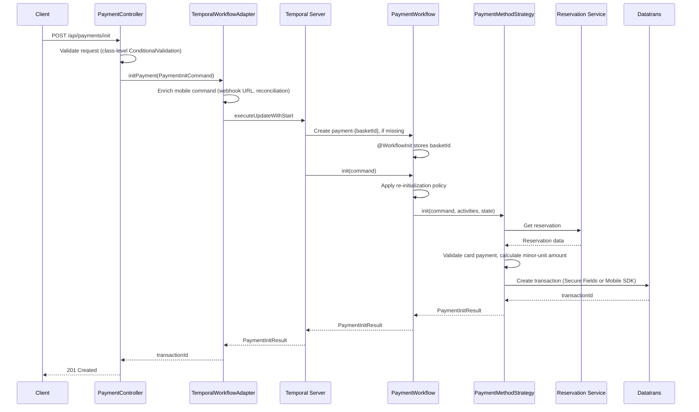

# Payment initialization with Temporal Update-With-Start

This document explains how `POST /api/payments/init` works.

It replaces the earlier Secure-Fields-only document. The two old initialization endpoints
(`/api/payments/secure-fields` and `/api/payments/mobile-sdk`) no longer exist.

---

## 1. Purpose

The endpoint creates a Datatrans transaction for one basket.

A single polymorphic request body selects the Datatrans integration through the
`paymentMethod` discriminator.

```http
POST /api/payments/init
Content-Type: application/json

{
  "paymentMethod": "NEW_CARD_WEB",
  "basketId": "AQN-147756bb-bb71-4842-959a-2efe87e378ed",
  "returnUrl": "https://www.premierinn.com/payments/3ds-return",
  "country": "gb",
  "language": "en",
  "userType": "LEISURE",
  "clientChannel": "PI"
}
```

`NEW_CARD_MOBILE` uses the same path and omits `returnUrl`.

A successful response uses HTTP `201 Created`.

```json
{
  "paymentMethod": "NEW_CARD_WEB",
  "transactionId": "240730123456789012",
  "methodConfig": null
}
```

---

## 2. Temporal terms

| Term | Meaning |
| --- | --- |
| **Workflow** | A durable process that Temporal stores. It can continue after a service restart. |
| **Activity** | A workflow step that calls another system. Temporal can retry it. |
| **Update** | A request to a workflow that can change workflow state and return a result. |
| **Update-With-Start** | An operation that starts a workflow when necessary and then sends an update. |
| **Signal** | A one-way message to a workflow. It cannot return a value. |

The workflow ID is:

```text
payment-{basketId}
```

One basket therefore uses one running payment workflow, whatever the payment method is.

---

## 3. Why Update-With-Start is used

A signal cannot return a value. The earlier implementation sent a signal and then polled a
query for the stored result, which could return a result from an older attempt.

The current implementation uses an update.

```text
send update
run the payment method strategy
return the result from the same update
```

The update result belongs to the request that executed the update. Neither initialization nor
authorization uses a result query or a polling loop.

---

## 4. Main components

| Component | Responsibility |
| --- | --- |
| `PaymentController` | Receives the HTTP request and returns HTTP `201` or an error. |
| `PaymentInitRequest` | Sealed request hierarchy discriminated by `paymentMethod`. |
| `PaymentOrchestrationInPortImpl` | Converts workflow error codes into domain exceptions. |
| `TemporalWorkflowAdapter` | Enriches mobile commands and calls Temporal with Update-With-Start. |
| `PaymentWorkflowImpl` | Applies the re-init policy and delegates to a strategy. |
| `NewCardWebStrategy` / `NewCardMobileStrategy` | Method-specific initialization and authorization. |
| `PaymentActivitiesImpl` | Calls the reservation service and Datatrans. |
| `PaymentExceptionHandler` | Maps `PaymentErrorCode` to HTTP status codes. |

---

## 5. Happy path



### Step-by-step description

1. The controller deserializes the body into the subtype named by `paymentMethod`.
2. The class-level `@ConditionalValidation` constraint requires a `returnUrl` for
   `NEW_CARD_WEB` and validates it for HTTPS and against the host allowlist.
3. The controller maps the request 1:1 to a `PaymentInitCommand`.
4. The adapter creates the workflow ID from the basket ID.
5. The options use the `USE_EXISTING` workflow conflict policy.
6. For `NEW_CARD_MOBILE`, the adapter enriches the command with the Datatrans webhook URL
   (`{callback-base-url}/datatrans?basketId=...`) and the reconciliation settings.
7. The adapter calls `WorkflowClient.executeUpdateWithStart(...)`.
8. Temporal creates the workflow if it does not exist and reuses it otherwise.
9. The `@WorkflowInit` constructor stores the basket ID.
10. The `init` update applies the re-initialization policy, then delegates to the strategy.
11. The strategy gets the reservation, checks card availability, and converts the amount.
12. The strategy asks Datatrans to create the transaction.
13. The update returns `PaymentInitResult`.
14. The controller returns HTTP `201 Created`.

The main `run()` method keeps the workflow open for authorization, webhooks, and settlement.

---

## 6. Workflow initialization order

Update-With-Start can run the update before `run()` starts, so the workflow must not depend on
`run()` to set its identity. It uses `@WorkflowInit` for that reason.

```java
@WorkflowInit
public PaymentWorkflowImpl(String basketId) {
  this.basketId = basketId;
}
```

The constructor arguments match the `@WorkflowMethod` arguments. The basket ID is final after
the constructor runs, and the command carries only the method-specific parameters.

---

## 7. Re-initialization policy

A client can repeat the request, including with a different payment method. The workflow
applies one explicit policy matrix instead of comparing return URLs.

| Current state | Outcome |
| --- | --- |
| `INITIALIZED`, same method | Allowed — the prior Datatrans transaction is cancelled, a new one is created. |
| `INITIALIZED`, different method | Allowed — the prior transaction is cancelled and the strategy switches. |
| `authorizationInProgress` | Rejected with `AUTHORIZATION_IN_PROGRESS` (HTTP `409`). |
| `AUTHORIZED` / `SETTLED` / `CANCELLED` | Rejected with `INVALID_TRANSACTION_STATE` (HTTP `409`). |
| `SETTLEMENT_PENDING` / `SETTLEMENT_FAILED` / `BOOKING_PENDING_TIMEOUT` | Rejected with `INVALID_TRANSACTION_STATE` (HTTP `409`) — an authorization is outstanding, so a second attempt would hold the card twice. |
| `EXPIRED` | Rejected with `EXPIRED` (HTTP `410`). |
| `FAILED` | Allowed — the workflow stays alive and a new attempt starts. |

`FAILED` and `SETTLEMENT_FAILED` look alike and are opposites. `FAILED` means nothing is held
and the customer should try again. `SETTLEMENT_FAILED` means the money *is* held, the booking
exists, and a second payment attempt would be a second charge.

---

## 8. Authorization

`POST /api/payments/authorize` calls the workflow's `authorize()` `@UpdateMethod` directly and
returns the result in the same HTTP response. There is no signal and no query polling loop.

The update handler validates three pre-conditions before it does any work:

- a `transactionId` exists,
- no authorization is already in progress,
- the payment status is `INITIALIZED`.

`NEW_CARD_MOBILE` does not use this endpoint. Its authorization is driven by the Datatrans
webhook, with a reconciliation polling loop as the fallback.

---

## 9. Initialization failure

The update returns a typed `PaymentErrorCode`; the `@ControllerAdvice` maps it to a status.

| Condition | Error code | HTTP |
| --- | --- | --- |
| Basket does not exist | `BASKET_NOT_FOUND` | `404` |
| Card payment is unavailable | `PAYMENT_METHOD_NOT_AVAILABLE` | `422` |
| Re-init while authorizing | `AUTHORIZATION_IN_PROGRESS` | `409` |
| Re-init in a terminal state | `INVALID_TRANSACTION_STATE` | `409` |
| Session expired | `EXPIRED` | `410` |
| Any other initialization failure | `GATEWAY_ERROR` | `502` |

Temporal reports the original domain exception through `ApplicationFailure.getType()` as a
fully qualified class name, so both the strategies and the adapter map failures using FQCN
constants derived from the exception classes.

---

## 10. Workflow state

`WorkflowState` holds one attempt's state plus the event inbox that the strategies consume.

| Field | Purpose |
| --- | --- |
| `transactionId` | The Datatrans transaction for the current attempt. |
| `merchantId` | Resolved per hotel; needed for cancel, settle, and status polling. |
| `currentMethod` | Selects the strategy on re-entry. |
| `paymentStatus` | Drives the re-init policy and the workflow lifecycle. |
| `authorizationInProgress` | Blocks re-init and guards the expiry timer. |
| `authorizeSignalReceived` | Event inbox — set by the `authorize()` update. |
| `webhookPayload` | Event inbox — set only after transaction-ID validation. |
| `bookingCompletedEvent` | Event inbox — consumed by `run()`, which settles or cancels. |
| `reconciliationSettings` | Mobile polling timings supplied by the adapter. |
| `amount` / `currency` / `bookingReference` | Support settlement. |

`reset()` clears the attempt state on an allowed re-initialization.

---

## 11. Temporal update ID

The API does not receive a payment attempt ID, and the adapter does not set an explicit
Temporal update ID, so the Java SDK generates a random one. Each HTTP request is therefore a
separate Temporal update, and the re-initialization policy — not update deduplication —
provides the repeated-request behavior.

---

## 12. Workflow expiry

`run()` bounds the **pre-authorization** part of the lifecycle with a configurable timeout
(`integrations.payment.workflow.timeout`, default 30 minutes). When the timeout fires the
workflow first awaits `!authorizationInProgress`, so an authorization that started just before
expiry is never cancelled underneath the caller. Only then, and only if the payment is still not
authorized or resolved, does it cancel the Datatrans transaction and set `EXPIRED`.

The timer stops there for a reason. Expiry *cancels* the transaction, and cancelling is only
unambiguously safe while no booking can exist. Once the payment is `AUTHORIZED` the
`PaymentAuthorisedEvent` may already have triggered a booking, so the expiry window closes and
the workflow moves to the booking phase — where a settlement can retry for 72 hours without a
30-minute timer voiding an authorization under a confirmed booking.

---

## 13. Settlement flow

After `AUTHORIZED`, one thread — `run()` — decides the booking outcome. The `bookingCompleted`
signal handler only deposits the event into the inbox, which is what lets the polling safety net
exist without racing it.

```
AUTHORIZED
  ├── bookingCompleted signal (fast path)          ─┐
  └── every booking-poll.interval without a signal: ├──> COMPLETED ──> SETTLEMENT_PENDING
        GET /v1/baskets/{basket-reference}          │                    └── settle (72h horizon)
                                                    │                         ├── ok ──> SETTLED
                                                    │                         └── exhausted /
                                                    │                             non-retryable
                                                    │                             ──> SETTLEMENT_FAILED
                                                    ├──> FAILED/CANCELLED ──> cancel ──> CANCELLED
                                                    └──> still pending at booking-poll.horizon
                                                             ──> BOOKING_PENDING_TIMEOUT
```

Basket statuses are read from the Basket Service's own enum: `COMPLETED`, `AMENDED`,
`PRE_CHECKED_IN`, and `PRE_CHECKED_OUT` mean the booking exists; `FAILED`, `CANCELLED`,
`AMEND_FAILED`, `CIOL_FAILED`, `CIOL_RC_FAILED`, and `SECURE_FAILED` mean it will not happen;
everything else — including a status this service has never seen — counts as still deciding,
because an unrecognised status is not evidence for voiding a hold.

A `bookingCompleted` signal that arrives after the poll already resolved the outcome is dropped
by the state guard (the payment is no longer `AUTHORIZED`) and logged. Even if one slipped
through, the settle converges rather than capturing twice.

`SETTLEMENT_FAILED` and `BOOKING_PENDING_TIMEOUT` both leave the authorization intact and log at
`ERROR` for operations. Neither is a state the customer can act on.

---

## 14. One-line summary

Update-With-Start starts or reuses the basket workflow, runs the `init` update against the
strategy chosen by `paymentMethod`, and returns the result directly to the HTTP caller.
