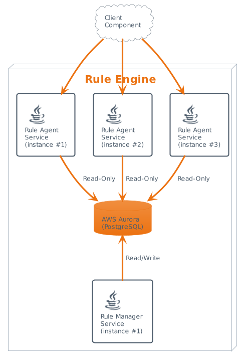

# Whitbread Rules Manager Entity Service

The Rules Service is a microservice component part of the Opera Digital platform that is going to
be responsible for hosting the key business configurable parameters that control the Whitbread
booking platform.

Most of the requests handled by the components that demand Rule service support are synchronous, so
it is critical that the component services each request in the shortest amount of time and is able
to scale effortlessly to large number of concurrent requests.

This led to a solution where we have a central, manager component and an agent component that can be
instantiated as many times as required by the load.

**Rules Manager Service** - activates and inactivates the rules defined by the service as per their
configurations. Does not communicate directly to any rule agent or other component. It is the only
component that is allowed to update the rule data in the database.

## How to run

### Run PostgreSQL locally

*Prerequisite:* installed Docker/Podman daemon with volume mount capabilities

Spin off a local
container: `<docker-compose/podman-compose> -f infrastructure/docker-local/docker-compose.yml up`

| Property       | Value                                     |
|----------------|-------------------------------------------|
| Username       | postgres                                  |
| Password       | postgres                                  |
| Connection URL | jdbc:postgresql://localhost:5438/postgres |

### Run as a Spring Boot local application

`mvn clean install spring-boot:run -Dspring.profiles.active=local`

A profile is necessary since the service is not design to fall back to any default profile. `local`
disables all integration tools like Eureka or Configservice making sure the project runs in
isolation.

## Hexagonal Architecture

`domain` - Models the domain of the API

`ports` - Defines any primary ports which act as input to the API and any secondary ports which are
external dependencies/resources

`adapters` - Implementations of ports

`config` - Package that contains any Spring Bean configuration

There is provided a 'sample', ready to use, workflow by starting the service.  
Added unit tests and contract tests compliant to this structure.

[Confluence: Sample-Service Description and project structure](https://whitbreadis.atlassian.net/wiki/spaces/DSA/pages/3420815378/Sample-Service+structure+description)

## Project Folder Structure

The arrangement below provides the structure within which the development effort will be
accomplished.

    .
    ├── docs                        # Documentation files
    ├── infrastructure              # Infrastucture related configuration
    │   └── docker-local            # Defining and running the systems on which the application depends
    ├── src                         # Application sources
    │   ├── main                    # Source files
    │   └── test                    # Test files
    ├── .gitignore                  # Files/folders to be ignored by Git
    ├── google-checkstyle.xml       # Checkstyle configuration
    ├── pom.xml                     # Configuration details used by Maven to build the project
    └── README.md                   # Brief description of underlying GitHub project

## Technologies

- [Spring cloud microservices parent v2.0.0](https://github.com/whitbread-eos/spring-cloud-microservice-parent/releases/tag/v2.0.0)
- Maven 3+
- Docker 17+
- Docker-compose v1+
- AWS Aurora PostgreSQL

