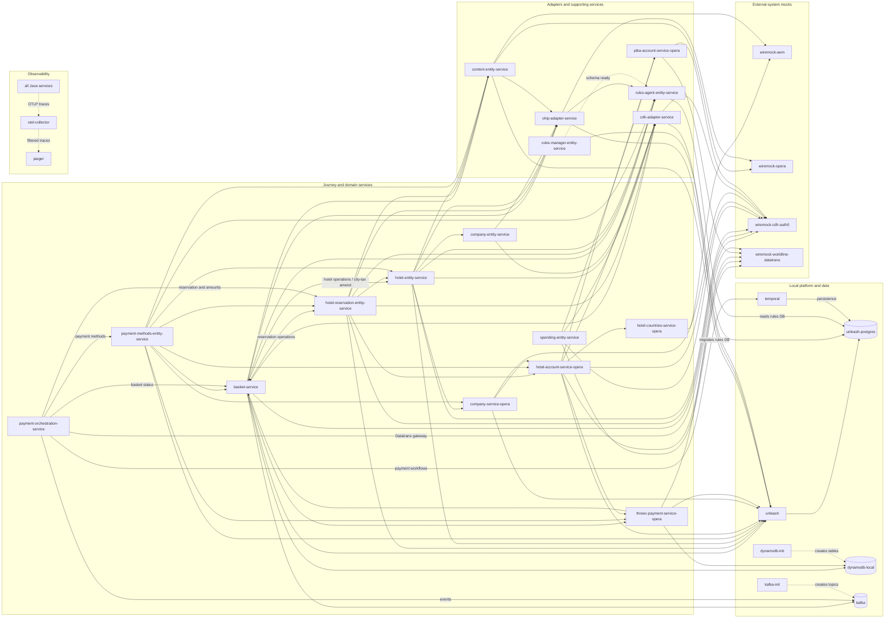

# Integration Environment Services

The arrows point from a client to its dependency. Solid arrows are runtime calls;
dashed arrows show initialization, startup ordering, or telemetry.

## Service catalog

Connections below are outbound connections within this Compose stack. A Compose
`depends_on` relationship is listed only when it represents meaningful startup ordering
rather than a runtime call.

### Application services

| Compose service | Monorepo location | Connects to |
| --- | --- | --- |
| `basket-service` | [`backend/book-pay/services/basket-service`](../book-pay/services/basket-service/) | `hotel-entity-service`, `content-entity-service`, `ohip-adapter-service`, `cdh-adapter-service`, `rules-agent-entity-service`, `hotel-reservation-entity-service`, `threec-payment-service-opera`, `unleash`, `wiremock-cdh-auth0` (JWKS), `kafka`, `dynamodb-local`, and `otel-collector`. Its Spring and Redis cache is disabled. |
| `hotel-reservation-entity-service` | [`backend/manage-modify/services/hotel-reservation-entity-service`](../manage-modify/services/hotel-reservation-entity-service/) | `hotel-entity-service`, `basket-service`, `ohip-adapter-service`, `content-entity-service`, `cdh-adapter-service`, `rules-agent-entity-service`, `hotel-account-service-opera`, `unleash`, `wiremock-cdh-auth0` (JWKS), and `otel-collector`. |
| `hotel-countries-service-opera` | [`backend/identity/services/hotel-countries-service-opera`](../identity/services/hotel-countries-service-opera/) | `wiremock-aem` and `otel-collector`. Its Spring and Redis cache is disabled. |
| `threec-payment-service-opera` | [`backend/book-pay/services/threec-payment-service-opera`](../book-pay/services/threec-payment-service-opera/) | `dynamodb-local`, `basket-service`, `unleash`, `wiremock-worldline-datatrans`, and `otel-collector`. The `threec-payment` table is created by `dynamodb-init`. |
| `hotel-account-service-opera` | [`backend/identity/services/hotel-account-service-opera`](../identity/services/hotel-account-service-opera/) | `hotel-countries-service-opera`, `threec-payment-service-opera`, `cdh-adapter-service`, `piba-account-service-opera`, `unleash`, `wiremock-cdh-auth0`, `wiremock-worldline-datatrans`, and `otel-collector`. Its Spring and Redis cache is disabled. |
| `company-service-opera` | [`backend/identity/services/company-service-opera`](../identity/services/company-service-opera/) | `hotel-account-service-opera`, `unleash`, `wiremock-cdh-auth0` (Auth0, JWKS, CDH, OAuth, and email endpoints), and `otel-collector`. Its Spring and Redis cache is disabled. |
| `payment-methods-entity-service` | [`backend/book-pay/services/payment-methods-entity-service`](../book-pay/services/payment-methods-entity-service/) | `hotel-reservation-entity-service`, `content-entity-service`, `basket-service`, `hotel-entity-service`, `rules-agent-entity-service`, `hotel-account-service-opera`, `company-service-opera`, `threec-payment-service-opera`, `unleash`, `wiremock-cdh-auth0` (JWKS), and `otel-collector`. Its Spring and Redis cache is disabled. |
| `payment-orchestration-service` | [`backend/book-pay/services/payment-orchestration-service`](../book-pay/services/payment-orchestration-service/) | `temporal`, `hotel-reservation-entity-service`, `payment-methods-entity-service`, `basket-service`, `kafka`, `wiremock-worldline-datatrans` (Datatrans), and `otel-collector`. The OPERA adapter is still a local stub. It has no Spring or Redis cache. It does not use Unleash or DynamoDB. |
| `hotel-entity-service` | [`backend/discover-search/services/hotel-entity-service`](../discover-search/services/hotel-entity-service/) | `ohip-adapter-service`, `content-entity-service`, `rules-agent-entity-service`, `cdh-adapter-service`, `company-entity-service`, `company-service-opera`, `basket-service` (city-tax amend flows), `unleash`, `wiremock-cdh-auth0` (JWKS), and `otel-collector`. Its Spring and Redis cache is disabled. Snowdrop, availability cache, promo, Dynamics 365, and Microsoft OAuth use explicit invalid hosts. The migration-status configuration is stale and decommissioned. |
| `ohip-adapter-service` | [`backend/discover-search/services/ohip-adapter-service`](../discover-search/services/ohip-adapter-service/) | `wiremock-opera` (OPERA), `rules-agent-entity-service`, `unleash`, and `otel-collector`. Its Spring and Redis cache is disabled. |
| `content-entity-service` | [`backend/discover-search/services/content-entity-service`](../discover-search/services/content-entity-service/) | `wiremock-aem` (AEM), `wiremock-opera` (Snowdrop and hotel reviews), `ohip-adapter-service`, `unleash`, and `otel-collector`. Its Spring and Redis cache is disabled. |
| `rules-manager-entity-service` | [`backend/discover-search/services/rules-manager-entity-service`](../discover-search/services/rules-manager-entity-service/) | `unleash-postgres` (owns Liquibase migrations for the `rulesmanager` database) and `otel-collector`. |
| `rules-agent-entity-service` | [`backend/discover-search/services/rules-agent-entity-service`](../discover-search/services/rules-agent-entity-service/) | `unleash-postgres` (reads the `rulesmanager` database) and `otel-collector`. It starts after `rules-manager-entity-service` so the schema is ready; it does not call Rules Manager over HTTP. |
| `cdh-adapter-service` | [`backend/identity/services/cdh-adapter-service`](../identity/services/cdh-adapter-service/) | `wiremock-cdh-auth0` (CDH API and OAuth), `unleash`, and `otel-collector`. |
| `company-entity-service` | [`backend/identity/services/company-entity-service`](../identity/services/company-entity-service/) | `ohip-adapter-service`, `cdh-adapter-service`, and `otel-collector`. |
| `piba-account-service-opera` | [`backend/identity/services/piba-account-service-opera`](../identity/services/piba-account-service-opera/) | `wiremock-worldline-datatrans` (Worldline and PIBA GUID), `wiremock-cdh-auth0` (CDH, OAuth, Auth0, and JWKS), and `otel-collector`. Its Spring and Redis cache is disabled. |
| `spending-entity-service` | [`backend/identity/services/spending-entity-service`](../identity/services/spending-entity-service/) | `cdh-adapter-service`, `piba-account-service-opera`, `wiremock-cdh-auth0` (CDH, OAuth, and JWKS), `wiremock-worldline-datatrans`, and `otel-collector`. Its Spring and Redis cache is disabled. |

### Infrastructure, mocks, and initialization jobs

| Compose service | Monorepo location | Connects to |
| --- | --- | --- |
| `jaeger` | Image and ports are defined in [`docker-compose.yml`](docker-compose.yml). | No outbound stack dependency; receives traces from `otel-collector` and provides the local trace UI. |
| `otel-collector` | [`otel-collector-config.yml`](otel-collector-config.yml) | `jaeger` (forwards filtered OTLP traces). |
| `unleash-postgres` | [`postgres/init`](postgres/init/) and its image configuration in [`docker-compose.yml`](docker-compose.yml) | No outbound stack dependency; stores the Unleash database and the separate `rulesmanager` database. |
| `unleash` | [`unleash`](unleash/) and its image configuration in [`docker-compose.yml`](docker-compose.yml) | `unleash-postgres`. |
| `temporal` | Image and configuration are defined in [`docker-compose.yml`](docker-compose.yml). | `unleash-postgres` (the `temporalio/auto-setup` image creates and owns its `temporal` and `temporal_visibility` databases there). Serves the Temporal frontend on gRPC `7233`. |
| `wiremock-opera` | Image and port are defined in [`docker-compose.yml`](docker-compose.yml). | No outbound stack dependency; mocks OPERA, Snowdrop, and hotel-review endpoints. |
| `wiremock-aem` | Image and port are defined in [`docker-compose.yml`](docker-compose.yml). | No outbound stack dependency; mocks AEM endpoints. |
| `wiremock-cdh-auth0` | Image and port are defined in [`docker-compose.yml`](docker-compose.yml). | No outbound stack dependency; mocks CDH, OAuth, and Auth0 JWKS endpoints. |
| `wiremock-worldline-datatrans` | Image and port are defined in [`docker-compose.yml`](docker-compose.yml). | No outbound stack dependency; mocks Worldline and PIBA GUID endpoints (for `piba-account-service-opera`/`spending-entity-service`) and, reusing the same instance, the Datatrans payment gateway (for `payment-orchestration-service`). |
| `dynamodb-local` | Image, volume, and port are defined in [`docker-compose.yml`](docker-compose.yml). | No outbound stack dependency. |
| `dynamodb-init` | [`dynamodb/init/create-tables.sh`](dynamodb/init/create-tables.sh) | `dynamodb-local`; creates the tables used by `basket-service` and `threec-payment-service-opera`, then exits. |
| `kafka` | Image, KRaft setup, and port are defined in [`docker-compose.yml`](docker-compose.yml). | No outbound stack dependency. |
| `kafka-init` | Its topic-creation command is defined in [`docker-compose.yml`](docker-compose.yml). | `kafka`; creates the Basket and payment-event topics, then exits. |

### Configured services outside this environment

Some code paths still reference downstream services that are intentionally absent from
this Compose stack:

- `payment-methods-entity-service`: `hotel-card-service-opera`.
- `threec-payment-service-opera`: `hotel-card-service-opera` and the legacy Hotel Booking
  dependency on port `9016`. No matching module exists in this repository.
- `basket-service`: `marketing-service-opera`,
  `refund-request-processor`, and `promo-service`.
- `hotel-reservation-entity-service`: `promo-service`.
- `hotel-entity-service`: Snowdrop, `availability-cache-service-opera`, `promo-service`,
  Dynamics 365, and Microsoft OAuth.
- `ohip-adapter-service`: `opera-token-service` remains configured for code paths that
  use the separate token service.

The absent HTTP services use `.not-in-integration-env.invalid` hostnames where supported,
so an accidental call fails clearly. `hotel-migration-status-service` is decommissioned.
Its remaining Hotel Entity configuration is stale.

Application framework caches are disabled across this environment. Redis is not part of
the Compose stack. Rules Agent keeps its required in-memory rules map.

## Local tracing

Jaeger is available at <http://localhost:16686> when the compose stack is running.
The Java services are instrumented with the OpenTelemetry Java agent and export traces to
the OpenTelemetry Collector over OTLP HTTP on `http://otel-collector:4318`.
The collector drops `/actuator` spans before forwarding traces to Jaeger.

WireMock containers are not instrumented. Jaeger will show outbound client spans from
the Java services to WireMock, and WireMock request payloads can still be inspected
through each WireMock admin API, for example `http://localhost:8443/__admin/requests`.

## Scripts

`scripts/build-images.sh` prepares the local Unleash import from DIT and builds the local service images.
`scripts/start-compose.sh` validates and starts the Docker Compose stack without rebuilding service images.
`scripts/build.sh` runs both scripts in order for the full local environment setup.
