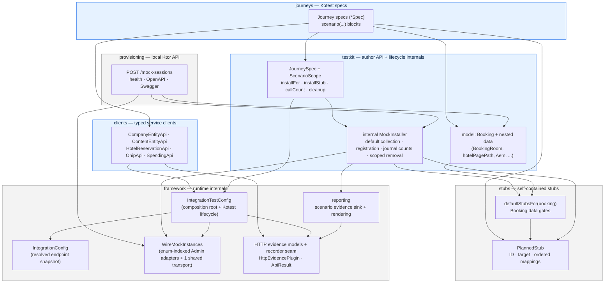
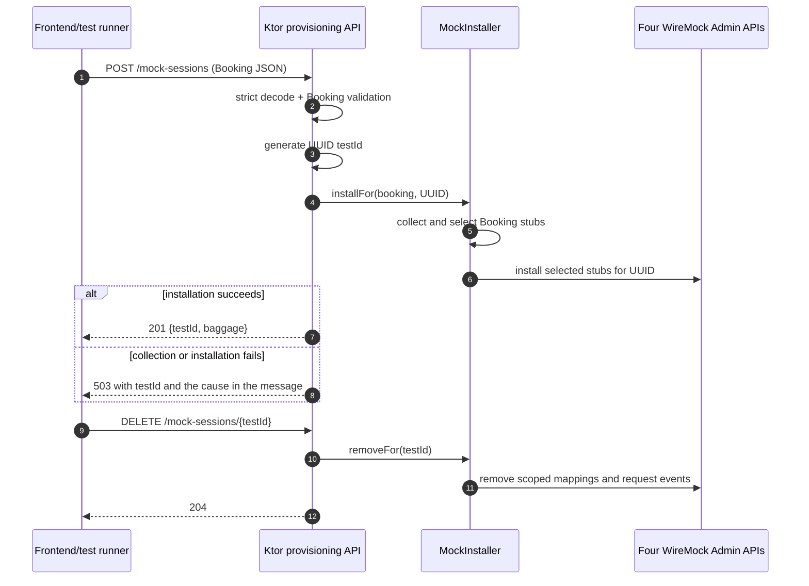
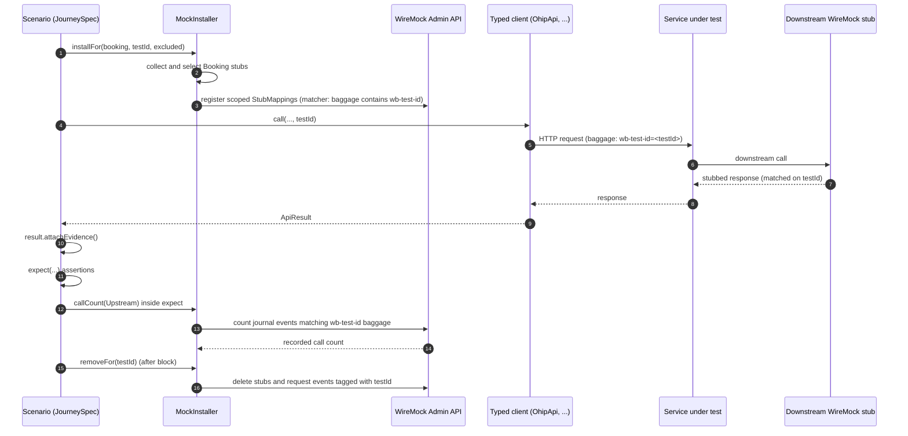
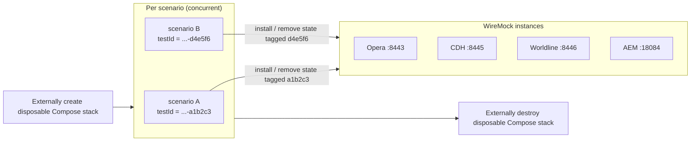

# Framework Architecture

High-level view of how the Kotlin/Kotest integration test framework is layered and what
happens at runtime. For authoring rules and detail, see
[TEST_FRAMEWORK_GUIDE.md](TEST_FRAMEWORK_GUIDE.md).

## Source boundary

`src/main` contains the reusable Booking-to-WireMock provisioning closure: Booking
models, the `defaultStubsFor` table and internal `MockInstaller`, upstream stub builders,
WireMock administration/model types, test-ID headers, strict
cleanup, endpoint configuration, preflight behavior, HTTP capture, scenario
lifecycle/evidence, and the local Ktor mock-provisioning entry point. Auth token and JWKS
support (`testkit.auth.AuthTokens`) also lives in `src/main`, but outside that closure: it
is called by journeys and hermetic tests only, never by provisioning. `src/test` contains
every Docker-free architecture,
framework, provisioning, server, serialization/encoding, and cleanup test.
`src/integrationTest` contains journeys, typed SUT clients, preset
`Hotels`/`Companies` catalogues, Kotest wiring, and the project preflight extension.

Provisioning reports optional installed-stub events through a small main-source sink
interface. The main-source scenario sink renders those events into evidence artifacts;
the local REST server omits journey evidence without changing provisioning behavior.
Malformed HTTP response decoding reports through an HTTP-owned recorder/context seam,
which the scenario sink implements. This keeps the dependency one-way from reporting to
HTTP while preserving automatic failure evidence.

Gradle's normal `build -> check -> test` lifecycle runs all hermetic tests and compiles
all `integrationTestClasses` without contacting the stack. The explicit
`integrationTest` task performs preflight and runs environment-backed journeys on every
invocation, with separate unit and integration reports.

## Architecture tests

Docker-free structural rules live under
`src/test/kotlin/uk/co/whitbread/integrationtests/architecture/` and run as part of
`./gradlew test`.

They enforce:

- inverted layer edges stay forbidden (`clients`/`stubs`/`framework`/`testkit` do not
  depend on `journeys`; `clients` do not depend on `stubs`; `framework` does not depend
  on `testkit`; HTTP and WireMock internals do not depend on reporting; and so on)
- source-set root packages stay intentional (`main` = `framework`/`provisioning`/
  `stubs`/`testkit`, `integrationTest` = `clients`/`framework`/`journeys`/`testkit`)
- service package segments under `clients` and `journeys` are all-lowercase and
  share keys where both layers exist
- journey primary classes are named `*Spec` and extend `JourneySpec`
- journey specs do not import `framework.*` or raw Ktor client request APIs. Journeys can import
  self-contained builders and ID constants from `stubs.*`
- main-source scenario models under `testkit.model` do not
  import WireMock admin or Ktor clients
- top-level typed-client classes outside model packages are named `*Api`, and
  `*Stubs*.kt` builder files stay under `stubs`
- public typed-client methods take `testId`
- client files import only from an explicit allowlist (the `parameter` and `header` Ktor
  request extensions, client models, `IntegrationTestConfig`, `ApiResult`,
  `ServiceApiClient`, feature flags, and testkit models), so every request goes through
  `ServiceApiClient`, which supplies the scenario baggage header and the `ApiResult`
  decoding — any new transport dependency fails the build by name
- only `testkit.featureflags` may import `BaggageFlag`, so the sealed `FeatureFlag`
  vocabulary stays the only flag implementation that can reach the wire
- main-source scenario model type names avoid endpoint-shaped suffixes such as `Request`
- `JourneySpec` owns the journey author interface and cleanup lifecycle

Package checks are path-based so the same package name can safely exist in more
than one source set.

Two limits are worth knowing before relying on a rule. The scanned roots are
`src/main/kotlin` and `src/integrationTest/kotlin` only, so nothing under `src/test/kotlin`
is checked. And most rules parse import statements as source text, so a fully qualified
reference written inline bypasses the import-based checks. Everything not in the list above
is a reviewer convention rather than an enforced invariant.

## Layers

Test authors work in `journeys`, `testkit`, `stubs`, and `clients`. The local `provisioning`
server is another entry point over the same testkit. `framework` contains runtime internals.

The arrows below show the principal control and planned-data flow. They are not an
exhaustive source-import graph; the architecture tests above define those boundaries.

Happy-path journeys depend on `testkit` and `clients`. Journeys can import `stubs` constants and
builders for exclusions and direct installation. Journeys never import
`framework` directly.

Author-facing scenario control lives in `testkit` for the same reason. `testkit.featureflags`
owns the sealed `FeatureFlag` vocabulary, while `framework.http` owns the baggage grammar —
the test-ID member, the matcher that finds it, and the override encoding. The encoding is
keyed by the framework's own `BaggageFlag` abstraction, which `FeatureFlag` implements. That
keeps the flag vocabulary reachable from journeys without a `framework` -> `testkit` edge,
and an architecture rule enforces that the edge stays absent.

`IntegrationTestConfig` is intentionally the integration suite's composition root:
it resolves one lazy `IntegrationConfig` snapshot, constructs the shared SUT client and
one WireMock transport used by four Admin adapters, supplies them to `JourneySpec` and
typed-client defaults, and closes initialized resources after the Kotest project. Typed
clients retain explicit constructor injection for isolated tests. The local provisioning
process is a separate entry point; it owns its WireMock transport and closes it when Ktor
stops, with `main` cleanup retained for startup failures.

## Local provisioning-server flow

`JourneySpec` owns the journey author interface and cleanup lifecycle.
The Ktor application uses one `MockInstaller` for all requests.
Both adapters pass the test ID into the installer.
`callCount` reads the scenario request journal and does not require an install.
Independent scenarios still run concurrently because the installer keeps no scenario state.

`GET /health` checks only that the local Ktor process is running. Generated
OpenAPI is served at `/openapi.json`, with Swagger UI at `/swagger`. Idempotent
`DELETE /mock-sessions/{testId}` removes the same scoped state as Kotlin journey
teardown; the disposable stack remains the recovery boundary for crashed clients
that never send DELETE. A failed POST is not undone either. Since a client that never
sends DELETE already leaks a whole session, undoing only the partial one bought a
mechanism the teardown boundary already covers.

The `503` therefore carries no retry or cleanup instruction, only the test ID and the
underlying failure message. Both failure kinds behind it — a Booking whose stubs cannot be
built, which throws before the first Admin call, and a WireMock Admin call that
failed — are told apart by reading that message rather than by a status code or a
flag, because the consumer is a developer rather than a retry loop.

## Per-scenario runtime flow

Each `scenario(...)` is one isolated test. Stubs are installed dynamically, matched by
the scenario `testId` (`baggage: wb-test-id=<testId>`), then cleaned up after the test.

## Test isolation model

Tests run concurrently with Kotest 6 limited spec and test concurrency of four. Kotlin
journeys use readable IDs with a random six-character suffix; REST sessions use
server-generated UUIDs. Both are isolated by `baggage` test-ID tagging rather than
by resetting WireMock between tests, so parallel scenarios never wipe each other's
stubs.

The framework performs no project-wide mapping or request-journal reset. Stack creation
supplies clean initial state — including the authentication mappings loaded from
`integration-env/wiremock/`, which belong to the stack and which no test installs — strict
per-scenario cleanup removes mappings and request events carrying the exact test ID, and stack
destruction removes background or crashed-process state. Cooperative scenario cancellation cannot interrupt
the suspending cleanup work; the original cancellation resumes propagating after cleanup.
