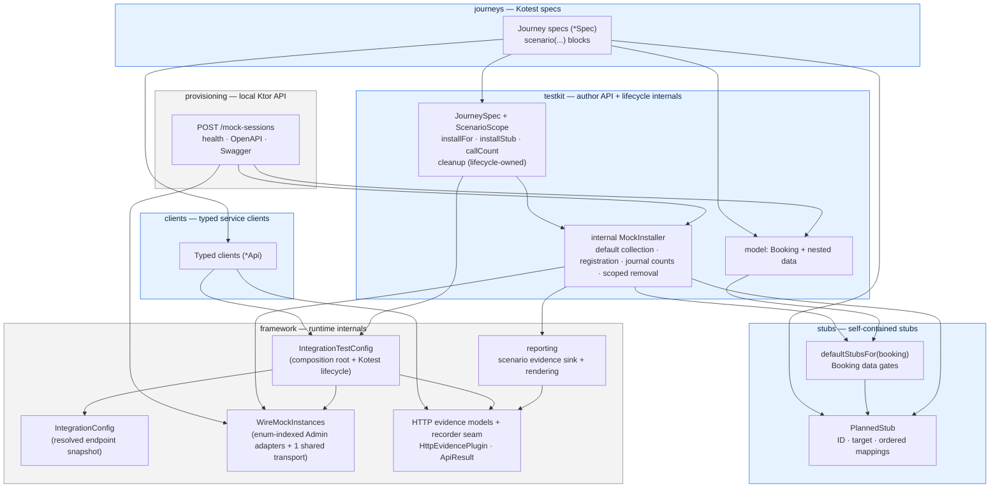
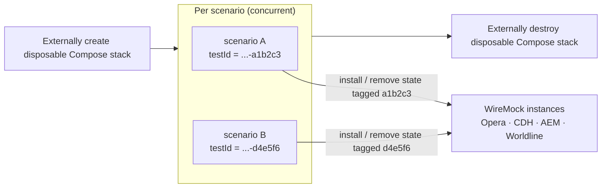
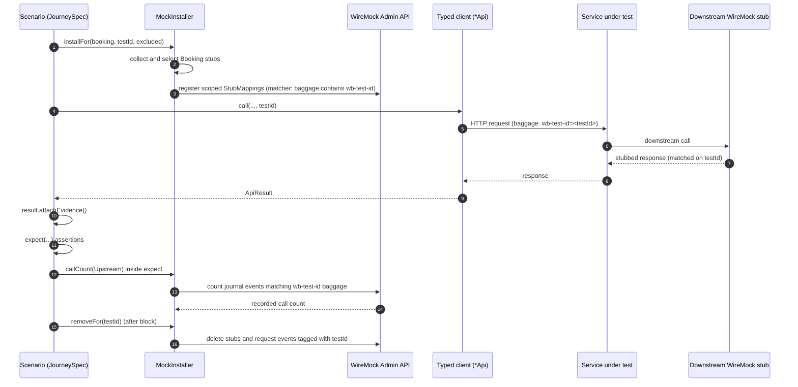
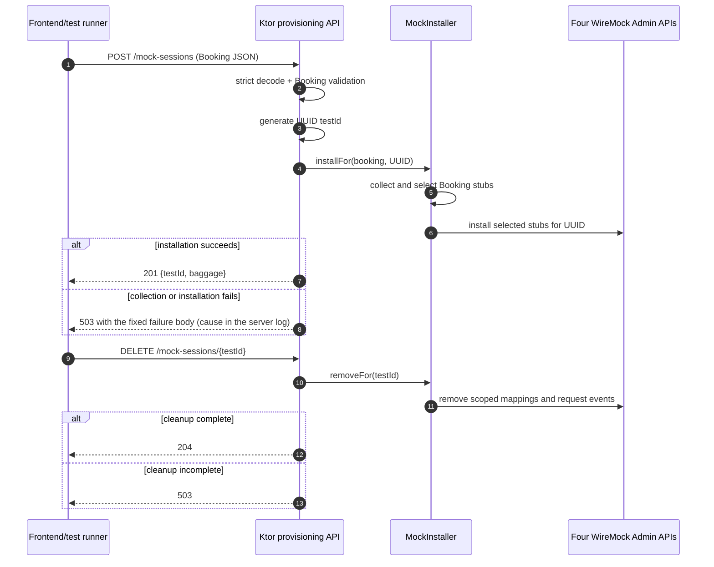

# Integration Test Framework

This is the self-contained, end-to-end reference for the Kotlin/Kotest integration test
framework in this module. It describes the framework design and the rules used to create
tests with it. It deliberately does not list the current stubs, journeys, or endpoint
coverage: the code is the source of truth for those, and `stubs/DefaultStubs.kt` holds the
complete Booking-to-stubs table.

## The Framework In One View

The framework runs Kotest journey specs against an externally managed integration
environment. It installs dynamic WireMock stubs through the WireMock Admin API. Every
scenario owns a test ID, and that ID isolates the scenario's stubs, requests, and evidence.

Every journey follows one shape:

```text
scenario data
  -> installFor(booking)
  -> client call with baggage: wb-test-id=<testId>
  -> attach evidence, then assert
  -> JourneySpec cleanup
```

The main rule for authors is: keep scenario facts explicit and let the testkit handle mock
choreography.

Six design commitments shape everything below:

1. **Scenario data drives provisioning.** A `Booking` describes the world under test. One
   installer turns it into WireMock stubs, for Kotlin journeys and for the local
   provisioning API alike.
2. **Isolation by test ID, not by reset.** Scenarios run concurrently. Stubs and request
   journals are tagged and reclaimed per test ID. The framework never resets WireMock
   globally.
3. **The environment is external and disposable.** The framework starts nothing. Stack
   creation provides the initial state, and stack destruction is the recovery boundary for
   crashed processes.
4. **Assertions define the scenario.** Default installation is deliberately wider than one
   endpoint's needs, so response assertions and request-journal counts carry the proof.
5. **Evidence is part of the contract.** Every scenario writes one ordered artifact with its
   installed stubs, attached HTTP exchanges, outcome, and cleanup result.
6. **Boundaries are enforced, not advisory.** Docker-free architecture tests fail the build
   when a layer edge inverts or an author-facing rule is bypassed.

## Choose The Right Test Coverage

Decide first whether a journey should exist at all.

- Name scenarios and write assertions from the caller's perspective. Downstream calls are
  supporting evidence, not the scenario's purpose.
- Add an environment-backed journey only when it proves a boundary that a faster test
  cannot: HTTP binding or validation, serialization or mapping, deployed-service
  orchestration, a downstream request/response contract, or critical error mapping.
- Imagine removing the integration behavior that the scenario claims to cover. If the test
  would still pass, make that behavior observable, add scoped request-journal verification,
  or cover it in a service or unit test. A fallback response alone does not prove that a
  call happened.
- Keep one representative journey per materially different cross-boundary path. Put input
  matrices, thresholds, and pure business-rule permutations in service or unit tests.
- Assert the minimum stable public response fields that prove the scenario. Do not
  repeatedly assert unrelated fields or implementation details.
- Control every input, including time, feature flags, and collaborator data. If the
  environment cannot keep that state deterministic, do not rely on it in a journey.
- Declare feature flags explicitly. Pin every flag that can change the path the scenario
  exercises; never depend on the environment's deployed default. See
  [Feature Flag Overrides](#feature-flag-overrides).

## Architecture

### Source Boundary

`src/main` contains the reusable Booking-to-WireMock provisioning closure: Booking models,
the `defaultStubsFor` table and internal `MockInstaller`, upstream stub builders, WireMock
administration and model types, test-ID headers, strict cleanup, endpoint configuration,
preflight behavior, HTTP capture, scenario lifecycle and evidence, and the local Ktor
mock-provisioning entry point. Auth token and JWKS support (`testkit.auth.AuthTokens`) also
lives in `src/main`, but outside that closure: journeys and hermetic tests call it;
provisioning never does, because the stack serves the JWKS and the REST server never mints
a token.

`src/test` contains every Docker-free architecture, framework, provisioning, server,
serialization, and cleanup test. `src/integrationTest` contains journeys, typed
service-under-test clients, preset fixture catalogues, Kotest wiring, and the project
preflight extension.

```text
integration-tests-kotlin/
  flows/            # Public endpoint flow documents; independent of journey coverage
  docs/             # Framework and process documentation
  src/main/kotlin/uk/co/whitbread/integrationtests/
    testkit/        # Reusable models, Booking installation, feature flags, scenario lifecycle
    stubs/          # Self-contained stub builders and the default-stub table
    framework/      # WireMock, endpoints, preflight, HTTP, and evidence internals
    provisioning/   # Local Ktor mock-provisioning API
  src/main/resources/
    keys/           # Checked-in test-only RSA signing key used by AuthTokens
    wiremock/       # Reusable provisioning templates
  src/test/kotlin/uk/co/whitbread/integrationtests/
    architecture/   # Docker-free package and layer architecture rules
    ...             # Framework, provisioning, support, and testkit tests
  src/integrationTest/kotlin/uk/co/whitbread/integrationtests/
    journeys/       # Environment-backed Kotest specs, one package per service key
    clients/        # Typed clients for services under test (same service keys)
    testkit/        # JourneySpec and preset fixtures
    framework/      # Kotest runtime config and project preflight extension
```

Evidence reporting is optional by design. The installer reports each installed stub
through a small interface (`StubInstallEvidenceSink`); the journey runtime plugs in the
scenario evidence sink that renders artifacts, while the local REST server passes no sink
and provisioning behaves identically. Malformed HTTP response decoding is recorded through
an interface owned by the HTTP layer, which the scenario sink implements. Reporting
therefore depends on HTTP, never the reverse, and failure evidence stays automatic.

Gradle's normal `build -> check -> test` lifecycle runs all hermetic tests and compiles all
`integrationTestClasses` without contacting the stack, so journey compilation failures
break a normal build. The explicit `integrationTest` task performs preflight and runs
environment-backed journeys on every invocation, and is deliberately never treated as up to
date.

### Layers

Test authors work in `journeys`, `testkit`, `stubs`, and `clients`. The local
`provisioning` server is another entry point over the same testkit. `framework` contains
runtime internals.

The arrows below show the principal control and planned-data flow. They are not an
exhaustive source-import graph; the enforced boundaries are defined by the architecture
tests described later in this chapter.



Happy-path journeys depend on `testkit` and `clients`. Journeys can import `stubs`
constants and builders for exclusions and direct installation. Journeys
never import `framework` directly.

Author-facing scenario control lives in `testkit` for the same reason. `testkit.featureflags`
owns the sealed `FeatureFlag` vocabulary, while `framework.http` owns the baggage grammar —
the test-ID member, the matcher that finds it, and the override encoding. The encoding is
keyed by the framework's own `BaggageFlag` abstraction, which `FeatureFlag` implements.
That keeps the flag vocabulary reachable from journeys without a `framework` -> `testkit`
edge, and an architecture rule enforces that the edge stays absent. Overrides travel in
the request's baggage header; the [Feature Flag Overrides](#feature-flag-overrides)
section defines that encoding.

### Composition Root

`IntegrationTestConfig` is both Kotest's project config and the suite's intentional
composition root. It wires:

- spec and test execution each use Kotest 6 limited concurrency of four;
- one lazily resolved `IntegrationConfig` endpoint snapshot;
- shared `WireMockInstances`, which owns one transport used by all four Admin adapters;
- one shared Ktor `httpClient`;
- `EnvironmentPreflightExtension` before project test execution;
- project shutdown that closes every initialized shared HTTP client.

Typed clients default their single `ServiceApiClient` constructor parameter from this
composition root's shared HTTP client and resolved base URL; tests that need isolated
dependencies pass their own. No separate runtime-container abstraction is used. The local
provisioning process is a separate entry point: it owns its own WireMock transport, and
its `main` closes that transport on the way out — whether the server stops normally or
never bound in the first place.

### Enforced Boundaries

Docker-free structural rules live under
`src/test/kotlin/uk/co/whitbread/integrationtests/architecture/` and run as part of
`./gradlew test`. They enforce:

- inverted layer edges stay forbidden (`clients`/`stubs`/`framework`/`testkit` do not
  depend on `journeys`; `clients` do not depend on `stubs`; `framework` does not depend on
  `testkit`; HTTP and WireMock internals do not depend on reporting; and so on)
- source-set root packages stay intentional (`main` = `framework`/`provisioning`/
  `stubs`/`testkit`, `integrationTest` = `clients`/`framework`/`journeys`/`testkit`)
- service package segments under `clients` and `journeys` are all-lowercase and share keys
  where both layers exist
- journey primary classes are named `*Spec` and extend `JourneySpec`
- journey specs do not import `framework.*` or raw Ktor client request APIs; journeys can
  import self-contained builders and ID constants from `stubs.*`
- main-source scenario models under `testkit.model` do not import WireMock admin or Ktor
  clients
- top-level typed-client classes outside model packages are named `*Api`, and `*Stubs*.kt`
  builder files stay under `stubs`
- public typed-client methods take `testId`
- client files import only from an explicit allowlist (the `parameter` and `header` Ktor
  request extensions, client models, `IntegrationTestConfig`, `ApiResult`,
  `ServiceApiClient`, feature flags, and testkit models), so every request goes through
  `ServiceApiClient`, which supplies the scenario baggage header and the `ApiResult`
  decoding — any new transport dependency fails the build by name
- only `testkit.featureflags` may import `BaggageFlag`, so the sealed `FeatureFlag`
  vocabulary stays the only flag implementation that can reach the wire
- main-source scenario model type names avoid endpoint-shaped suffixes such as `Request`
- `JourneySpec` owns the journey author interface and cleanup lifecycle

Package checks are path-based, so the same package name can safely exist in more than one
source set.

Two limits are worth knowing before relying on a rule. The scanned roots are
`src/main/kotlin` and `src/integrationTest/kotlin` only, so nothing under `src/test/kotlin`
is checked. And most rules parse import statements as source text, so a fully qualified
reference written inline bypasses the import-based checks. Everything not in the list above
is a reviewer convention rather than an enforced invariant.

## Test Isolation Model

Tests run concurrently, so isolation is not based on resetting WireMock before every test.
Data-bearing stubs match the current test ID as a W3C baggage member:

```text
service request header:          baggage: wb-test-id=<testId>
downstream WireMock stub header: BAGGAGE_HEADER to testIdHeaderMatcher(testId)
```

Kotlin journeys use readable IDs with a random six-character suffix; REST sessions use
server-generated UUIDs. Both are isolated by `baggage` test-ID tagging, so parallel
scenarios never wipe each other's stubs.



The four mocked upstreams are Opera (hotel property management and reservations), CDH
(customer and account data), AEM (content), and Worldline (payments). Each is one WireMock
instance.

Every stub the framework installs must match the exact scenario test ID, without exception.
The one class of unscoped mappings — authentication plumbing whose callers do not propagate
the baggage header, that is the JWKS and the two OAuth token endpoints — is served by the
stack's WireMock startup mappings rather than installed by any test, so there is no shared
case to exempt.

### Ownership Stamping

One operation stamps ownership. `PlannedStub.scopedTo(testId)` copies every mapping in the
stub and adds the test-ID matcher to each mapping request:

```kotlin
internal fun PlannedStub.scopedTo(testId: String): PlannedStub =
    copy(
        mappings =
            mappings.map { mapping ->
                mapping.copy(
                    request =
                        mapping.request.copy(
                            headers =
                                mapping.request.headers.orEmpty() +
                                    (BAGGAGE_HEADER to testIdHeaderMatcher(testId)),
                        ),
                )
            },
    )
```

The operation merges headers: it preserves business matchers such as `x-hotelid`, and it
overwrites a missing or foreign test-ID matcher. Default installation and direct
`installStub` calls pass through this one operation, and both record evidence with
`PlannedStub.id`. Stub builders never accept `testId`; they describe business request
matching only.

Cleanup does not depend on a local install record: it deletes by the matcher itself, so
any `removeFor(testId)` call can recover a partial install. The provisioning DELETE route
uses the same operation.

The framework performs no project-wide mapping or request-journal reset and exposes no
global reset operation. Stack creation supplies clean initial state, including the
authentication mappings loaded from `backend/integration-env/wiremock/`, which belong to
the stack. Strict per-scenario cleanup removes
mappings and request events carrying the exact test ID. Stack destruction removes
background or crashed-process state.

### Cleanup Rules

Cleanup happens after each scenario. `JourneySpec` calls `MockInstaller.removeFor(testId)`.
The installer lists stubs on every configured WireMock, removes only mappings whose
`baggage` matcher contains the scenario's `wb-test-id`, then removes request-journal events
matching the same exact baggage member.

- Cleanup is deterministic in every environment; there is no CI/local policy switch.
- Cleanup is strict: it attempts every reachable WireMock operation, then throws one
  aggregated `CleanupException` if anything remains incomplete. A scenario that otherwise
  passed fails on incomplete cleanup. If the scenario already failed or was cancelled, its
  original exception remains primary and the cleanup exception is attached as suppressed.
- Cleanup runs in a `NonCancellable` context, so a cooperative timeout or cancellation
  cannot interrupt its suspending WireMock calls; the original cancellation continues
  propagating afterward.
- A failed `installFor` is not rolled back: removal matches the `wb-test-id` baggage rather
  than a record of what was installed, so a partial attempt's mappings are reclaimed by
  normal scenario cleanup.
- No matching mappings, no matching request events, and DELETE responses indicating a
  mapping is already absent all count as idempotent success.
- Cleanup removes every scoped mapping and request event owned by the scenario, including
  installed mappings the scenario did not call, while leaving other test IDs and the
  stack's OAuth/JWKS startup mappings unchanged.
- Hard JVM, Gradle, or container termination is outside this guarantee and is recovered by
  destroying the disposable stack.

## Scenario Lifecycle

There is one base class for test authors: `JourneySpec`. Use it for everything, from a
single-action test to a multi-step business journey. Each `scenario(...)` is one test; a
spec can have one scenario for a single action or several scenarios for a longer journey.

`JourneySpec` creates a fresh scenario scope for each `scenario(...)`. That scope derives a
`testId` from the feature description, scenario name, and a random six-character suffix,
and exposes:

- `testId`: used in service calls and WireMock matchers.
- `installFor`, `installStub`, and `callCount`: scenario-owned mock operations.
- `expect(name) { ... }`: named assertion blocks for readable test code.
- `result.attachEvidence(prefix?)`: adds a bounded request/response exchange to the
  scenario artifact.

A simplified spec:

```kotlin
class GetLightweightReservationsByIdsSpec : JourneySpec(
    "HEAPTI lightweight reservations can be fetched by id",
    {
        val ohipApi = OhipApi()

        scenario("GET /ohip/v1/reservations/ids returns one lightweight reservation") {
            val booking = Booking(
                hotels = listOf(
                    Hotels.HEAPTI.copy(
                        availableRates = listOf(
                            Rate(ratePlan = "SEMIFLEX", roomType = "LOWDBL", adults = 2),
                        ),
                    ),
                ),
                arrival = LocalDate.now().plusDays(14),
                departure = LocalDate.now().plusDays(16),
                rooms = listOf(
                    BookingRoom(
                        reservationId = "6001001",
                        roomType = "LOWDBL",
                        adults = 2,
                        status = ReservationStatus.RESERVED,
                    ),
                ),
            )
            val room = booking.room

            installFor(booking)

            val result = ohipApi.getLightweightReservationsByIds(
                reservationId = requireNotNull(room.reservationId),
                hotelId = booking.hotel.hotelId,
                testId = testId,
            )

            result.attachEvidence("Get Reservations By Ids")

            expect("returns the requested reservation") {
                result.response.status.value shouldBe 200
                result.body.reservationByIdList.first().reservationId shouldBe room.reservationId
            }
        }
    },
)
```

The runtime flow of one scenario:



`JourneySpec` removes the scenario-owned WireMock state after each scenario and writes the
cleanup result into the same artifact. This makes the scenario, not the spec class, the
mock and evidence isolation unit. A scenario can install as often as it needs. Cleanup is
not part of the author interface, so a journey cannot purge the request journal before it
calls `callCount`.

A second install does not replace the first. Both sets of mappings stay registered, and
WireMock serves the most recently added match. A focused install must therefore come
*after* whatever it means to override — normally next to the call it serves rather than
grouped with the setup at the top of the scenario. Cleanup is unaffected: it reclaims
everything owned by the test ID regardless of how many installs produced it.

## Scenario Data

`Booking` is the primary scenario model. It is scenario data with lightweight validation:

```kotlin
data class Booking(
    val hotels: List<Hotel> = emptyList(),
    val companies: List<Company> = emptyList(),
    val arrival: LocalDate? = null,
    val departure: LocalDate? = null,
    val rooms: List<BookingRoom> = emptyList(),
    val aem: Aem? = null,
    val loggedUser: LoggedUser? = null,
    val cardPayment: CardPayment? = null,
)
```

The same `Booking` should drive:

- WireMock stubs through `installFor(booking)`;
- service requests through typed clients;
- assertions through expected values such as `booking.hotels` or `booking.hotel.hotelId`.

That keeps tests coherent. If a test changes dates, rate plan, room type, packages, guest
profile, reservation ID, or AEM content, the stubs and the request should move with that
data.

### Modeling Rules

- Scenario models describe reusable facts about the world under test. Do not name them
  after a specific endpoint, controller, or implementation branch.
- Use explicit named fixtures such as `Hotels.HEAPTI`; do not hide business data inside
  `Booking()` defaults.
- Put endpoint parameters such as offsets, limits, flags, and filters in the typed client
  call or a local request fixture. Put a value in the scenario model only when multiple
  mock builders or assertions use it as a domain fact.
- Keep data models focused on scenario facts. Lightweight validation is fine, but models
  must not know how to call services or install mocks.
- Author-facing helpers (for example `hotelPagePath`) live in `testkit.model`, not under
  `stubs`.

### Convenience Accessors And Reservation Semantics

`booking.hotel` returns the first hotel in `booking.hotels`; use it for single-hotel flows.
It fails only when a flow actually uses the accessor without providing hotel data.
`booking.room` is for single-room flows and fails unless `booking.rooms` contains exactly
one room. Leave `rooms` empty for scenarios that do not need Opera reservation mocks.

When a room represents an Opera reservation, specify `reservationId`; the framework does
not invent a default reservation ID. For reservation creation, the explicit
`reservationId` is the deterministic ID that mocked Opera will allocate, not a field sent
by the client, and each requestable room receives its own create response.

When rooms are identical, their create requests carry identical matchable data, and one
ordinary mapping would return the same reservation ID for every call. The create stub
therefore chains its mappings through a WireMock Scenario: each mapping is eligible only
in the state the previous one set, so identical POSTs return the IDs in `Booking.rooms`
order. WireMock owns and advances that state; the service's requests stay unchanged. The
scenario name embeds a fresh UUID per build, so concurrent builds and repeated installs
cannot share state — and the UUID is not an ownership token: cleanup still matches the
`wb-test-id` baggage. A single room needs no state and gets an ordinary mapping. The
final state has no matching create mapping, so an unexpected extra POST fails to match
instead of silently reusing the last ID; every requestable room must therefore have a
unique explicit `reservationId`.

This ordered chain relies on OHIP's checked-in reservation-create `maxConcurrency: 1`.
WireMock state transitions cannot coordinate concurrent identical POSTs, so if OHIP
starts creating rooms concurrently, the mock strategy must be reviewed.

### One Model, One JSON Contract

`Booking` and its complete model graph are also the direct JSON contract for the local
mock-provisioning API. The shared `bookingJson` format rejects unknown properties,
preserves Kotlin defaults for omitted values, and encodes `LocalDate` as ISO-8601
`YYYY-MM-DD` strings. There is no parallel transport DTO, mapping layer, endpoint version,
request-size limit, or collection-size limit. OpenAPI is generated from the implemented
Ktor route and serializers.

The framework intentionally has one production provisioning model. Extend `Booking` when
new scenario facts belong to the same provisioning contract. A genuinely different public
model requires an explicit architecture and REST-contract decision; do not reintroduce a
generic planner, registry, reflection scanner, or executable receiver DSL speculatively.

## Mock Installation

Mock installation uses self-contained stubs, one default-stub table, and one installer over
four WireMock Admin adapters. The important types:

- `JourneySpec.ScenarioScope`: the journey author interface for installation and call
  counting.
- `MockInstaller`: internal implementation for default collection, registration, evidence,
  and scoped removal.
- `WireMockTarget`: one enum shared by registration, cleanup, and target diagnostics. Each
  constant carries its display name, environment variable, default URL, and required
  startup mappings, so endpoint resolution and readiness derive from it rather than
  repeating the list.
- `PlannedStub`: immutable ID, target, and ordered mappings produced by each public stub
  builder.
- `defaultStubsFor(booking)` (`stubs/DefaultStubs.kt`): the entry point that owns every
  Booking gate. It sums one private function per upstream in the same file; together they
  are the complete Booking-to-stubs table.
- `Upstream`: the author-facing enum that names one mocked WireMock instance for
  `callCount`. It exists only for call counting and plays no part in installation.

The `JourneySpec` scenario methods delegate to the internal installer with the scenario
test ID. The Ktor routes use the same installer directly. The installer keeps no scenario
state, which is why one instance serves every concurrent scenario and REST session. It
calls `selectedStubs`, which calls `defaultStubsFor` and applies exclusions, and then
installs each selected stub through the same scoped operation as direct installation.

### Let Scenario Data Install Mocks

A normal journey declares `Booking` data, calls `installFor(booking)`, calls the typed
client with `testId`, attaches evidence, and asserts the response. It does not manually
install its low-level happy-path stubs.

`Booking` describes the world. One scenario exercises a slice of it, so default
installation normally installs more mappings than the call under test needs. That is
deliberate, and for a reason outside the test: `installFor` is also the local provisioning
API's only entry point, and a frontend posting a `Booking` cannot say which mappings its
session will need. The defaults must therefore be complete for the world the `Booking`
describes, not for one scenario's slice of it.

Journeys are what keep that path honest. They are the only real coverage the gates have,
so a scenario that hand-picks its mappings instead of calling `installFor` removes coverage
from the REST endpoint while still passing. Assemble a scenario from `Booking` data; use
`installStub` only for a mapping no gate covers, or for an override that must land partway
through a journey.

Because the defaults are wider than the slice, the assertions are what define the
scenario — not the install. Prove the slice with response assertions and `callCount(...)`.

A default install:

1. builds every default mapping enabled by the `Booking` fields before any WireMock Admin
   request;
2. applies the plain `excluded` input;
3. stamps test-ID ownership on each selected stub;
4. registers each resulting `StubMapping` through WireMock Admin;
5. records each successfully installed mapping in the scenario-owned evidence artifact.

### The Default-Stub Table

Each default stub is gated on `Booking` data: a stub is collected only when the fields it
represents are present. The complete gate table — which stub each `Booking` field enables,
per upstream — is the code itself; this document deliberately does not duplicate
`stubs/DefaultStubs.kt`. The design rules:

- `defaultStubsFor` owns every gate; there is no second collection path.
- Default collection finishes before the first WireMock Admin request. It is not strictly
  pure: mapping construction can read a classpath template, initialize process-scoped auth
  key material, or resolve time-derived response fields.
- When gated data is invalid rather than absent, collection fails fast and names the
  offending data instead of installing a mapping the upstream would never match.

### Plan Changes: `excluded`, `installStub`

Use an exclusion plus a direct install when a scenario needs different downstream
behavior. Journey specs use ID constants and builders from `stubs.*`; they must not
import `framework.*`.

```kotlin
installFor(booking, excluded = setOf(OPERA_RESERVATION_DEPOSITS_STUB_ID))
installStub(reservationDepositsOperaFailure(booking, booking.room))

installStub(allHotels(hotels))
```

- `excluded` removes a complete logical stub group. Use the ID constants from stub files.
- Selection input is the test developer's responsibility. `installFor` rejects an
  `excluded` ID that this Booking did not select, naming the IDs this Booking selected.
- `installStub(stub)` adds a self-contained stub at any point in the journey, outside the
  Booking defaults. Direct `installStub` calls do not validate the stub ID against the
  Booking defaults. An override for an excluded default declares its own unique stub ID
  (never the default's), so evidence and cleanup identify it unambiguously; install it
  right after `installFor`, or later when the change belongs to a later moment in the
  journey.

### Stub Builder Rules

Stubs live under `stubs/<upstream>`, with one-off custom stubs under
`stubs/<upstream>/custom`. Journey specs can import their public builders and ID constants.

```kotlin
const val OPERA_HOTEL_CONFIG_STUB_ID = "booking.opera.hotel-config"

fun hotelConfig(hotel: Hotel): PlannedStub =
    PlannedStub(
        id = OPERA_HOTEL_CONFIG_STUB_ID,
        target = WireMockTarget.OPERA,
        mappings = listOf(hotelConfigMapping(hotel)),
    )

private fun hotelConfigMapping(hotel: Hotel): StubMapping = ...
```

- Public stub builders return `PlannedStub`. Each stub file declares its own ID constant
  and WireMock target. One logical stub can contain several ordered mappings; private raw
  mapping helpers can support variants in the same file.
- Make a builder accept only the scenario facts its matcher or response depends on.
- Do not take a `testId` parameter and do not add an ownership header. The installer stamps
  every mapping: `scopedTo` adds the `wb-test-id` baggage matcher (see
  [Ownership Stamping](#ownership-stamping)). Never stamp ownership yourself.
- The builder supplies the evidence ID and WireMock target. `Upstream` is not part of
  direct installation; it exists only for `callCount` (see
  [Verifying Downstream Calls](#verifying-downstream-calls)).
- A stateful builder that chains mappings through a WireMock Scenario generates its own
  scenario name; callers supply no chain key.

### Return Downstream Failures From Stubs

To test a downstream failure, install a stub that returns the downstream error response:

```kotlin
installStub(getReservationBadRequest(hotelId = "HEAPTI", reservationId = "asd123"))
```

Never throw from mock setup to simulate a failure. That fails the test during mock setup,
before the service call is made, and bypasses the service under test. Plan a stub that
returns the downstream error response and then assert how the service handles it.

## Verifying Downstream Calls

Installing a mock does not mean the endpoint under test used it. `Booking` describes the
world rather than one endpoint, so a scenario normally installs more mappings than the call
it is exercising needs. The request journal is therefore the only evidence of what the
service actually did, and the scenario scope exposes it as one count per mocked upstream:

```kotlin
callCount(Upstream.AEM) shouldBe 0
```

It counts every request carrying this scenario's `wb-test-id` baggage to that WireMock,
regardless of method, path, or body. That breadth is deliberate: a regressed service often
sends a *malformed* request that no installed stub matches, and a matcher-derived query
would report zero for exactly the call the assertion exists to catch.

`callCount` is a read. It does not require an install to have happened, and it does not
disturb one. Read it before cleanup: cleanup deletes the journal events it reports on.
`JourneySpec` owns cleanup, so a journey cannot trigger it early.

To prove a call did *not* happen, install the mock that would have served it and assert
zero calls:

```kotlin
val booking = Booking(aem = Aem(cookiePolicies = cookiePoliciesAem))

installFor(booking)

val result = contentEntityApi.getCookiePolicies(country = null, /* ... */ testId = testId)
result.attachEvidence("Get Cookie Policies Missing Country")

expect("returns a validation error without calling AEM") {
    result.response.status.value shouldBe 422
    callCount(Upstream.AEM) shouldBe 0
}
```

Installing the working stub is what makes the assertion meaningful: the happy path was
available and the service still did not reach for it. Leaving the upstream unstubbed proves
nothing, because the service may have called it and mapped the resulting failure to the
same response the scenario expects. An excluded stub, an unmatched `404`, or a status code
alone does not prove that no call occurred either.

Know what the count does and does not prove:

- **It sees only requests carrying the scenario's baggage.** That is what keeps it correct
  under concurrency, but a downstream client that does not propagate the header is
  invisible. Some clients in this estate already behave that way, which is why the OAuth
  and JWKS mappings are served by the stack rather than installed per scenario. Treat a
  zero as "no scenario-owned request reached this WireMock", not as absolute proof of no
  call.
- **It names a WireMock instance, not an upstream system.** A WireMock serving both an
  upstream's data stubs and its OAuth plumbing counts both, so a token fetch can show up in
  the count.
- **It is read at one instant, with no synchronisation against the service.** A downstream
  call the service makes *after* returning its response — an async audit or cache warm —
  may not be recorded yet.
- **Per-mock counting and request-shape assertions do not exist.** Counting a single
  logical mock needs a matcher-derived query, which is ambiguous when one mock installs
  overlapping matchers. Add such a capability against a real scenario that needs it, not
  speculatively.
- **A disabled request journal cannot fake a zero.** WireMock answers a disabled journal
  with `count: 0` rather than an error, and a silent zero would satisfy every absence
  assertion in the suite, so the count operation rejects a response reporting
  `requestJournalDisabled`.

## Authenticated Service Calls

For services protected by `common-auth0` (the monorepo's shared JWT authentication
library), use one `LoggedUser` as both the JWT claims source and the authenticated
scenario fixture:

```kotlin
val loggedUser = LoggedUser(
    accessLevel = "SUPER",
    companyAccountId = "company-account-1",
    companyId = "company-1",
    employeeId = "employee-1",
    email = "integration.user@example.test",
)
val booking = Booking(loggedUser = loggedUser)

installFor(booking)

val result = SpendingApi().getCompanySpending(
    fromMonthYear = "2026-01",
    toMonthYear = "2026-02",
    testId = testId,
    wbAuthorization = AuthTokens.bearer(loggedUser),
)
```

The typed client's `wbAuthorization` parameter sends the complete `Bearer ...` value as
the `WB-Authorization` header. Setting `Booking.loggedUser` is essential for the
downstream fixtures; add the endpoint-specific CDH or Worldline fixtures to the same
`LoggedUser` when the successful response needs them. No test installs the JWKS: the stack
serves it. It has to be that way: the services' JWT decoders do not
propagate the scenario baggage header, so that mapping can carry no ownership matcher and
no cleanup could ever reclaim it. `AuthTokens` signs with a fixed, test-only RSA key
checked in at `src/main/resources/keys/integration-test-signing-key.json`; the matching
public key is a startup mapping owned by the Compose stack, and a hermetic test fails if
the two drift.

Keep the token's user and `Booking.loggedUser` aligned so JWT claims, downstream fixtures,
and assertions describe one coherent scenario. This alignment is a data-consistency rule,
not a cryptographic requirement. Omit `wbAuthorization` only when the scenario
deliberately exercises missing authentication or authorization. For a client that uses
standard `Authorization` instead, pass the same `AuthTokens.bearer(...)` value through that
client's header API.

## Feature Flag Overrides

A scenario must state the feature flags its path depends on explicitly, pinning each one on
or off for the duration of the call instead of depending on the environment's deployed
default:

```kotlin
val result = ohipApi.getHotelAvailability(
    request = availabilityRequest(booking, channel = "BB"),
    testId = testId,
    featureFlagOverrides = mapOf(OhipFeatureFlag.BB_FLEX_RATE_STRIKETHROUGH to false),
)
```

- Pin every flag the endpoint's flow doc lists whose state changes the path the scenario
  exercises — whether the scenario needs it on or off — so the scenario proves the same
  behavior after any environment default flips. When the flow doc lists no flags, there is
  nothing to pin.
- When both states matter, write one scenario per state rather than one scenario that
  trusts the default for the other.
- Typed-client methods gain a `featureFlagOverrides` parameter when their first
  flag-pinning journey needs it; add the parameter alongside the scenario rather than
  speculatively.
- An override can only reach a flag the service evaluates inside the scenario's request: it
  travels in the request's `baggage` header and is resolved per request. Infrastructure
  flags evaluated outside that context cannot be pinned this way; do not build a scenario
  on their state.

The override travels as a second W3C baggage member alongside the test ID, so one header
carries both scenario isolation and scenario flag state:

```text
baggage: wb-test-id=<testId>,wb-feature-overrides=release_bb_flex_rate_strikethrough:off
```

Flags live in `testkit.featureflags` as one enum per owning service, all implementing the
sealed `FeatureFlag` interface. `key` is the Unleash flag name exactly as the service
resolves it. Add a new constant to the enum of the service that owns the flag, and add a
new enum when a service gets its first one. Name the enum after the service that owns the
flag, not the client that sends it: a journey calling one service may need to override a
flag owned by a service further downstream. Because every enum shares the `FeatureFlag`
supertype, one call can override flags belonging to more than one service.

## HTTP Clients And Evidence

Clients live under `clients`. Each client takes a single `ServiceApiClient` constructor
parameter whose defaults use the composition root's shared HTTP client and the matching
resolved base URL. `ServiceApiClient` is the sole request entry point: its request verbs
require the scenario `testId`, send the baggage header, set the JSON negotiation headers,
and decode the response into `ApiResult`. Response decoding and request encoding share one
`ServiceJson` configuration. Two architecture rules keep this closed: one fails the build
for a public client method that does not take `testId`, and one fails the build for a
client file that imports raw Ktor request APIs instead of using `ServiceApiClient`.

Client methods return `ApiResult<T>`:

- `response`: raw Ktor response.
- `bodyText`: raw response text.
- `body`: decoded success body; fails if the response was not successful.
- `errorBody`: decoded common error model for non-2xx responses when possible.

### Evidence Rules

- Pass `testId` to every service-under-test client call.
- Call `attachEvidence(...)` immediately after every important response and before
  assertions that may fail.
- A malformed successful JSON response is recorded automatically before decoding throws,
  even though no `ApiResult` is returned.

`HttpEvidencePlugin` captures method, URL, all synthetic headers, supported textual or
byte-array request bodies, response status, response headers, and response body. Request
and response bodies are each limited to 64 KiB of UTF-8 data and carry an explicit
byte-count marker when truncated. The environment uses mocked integrations and synthetic
test data, so authorization and data fields are intentionally retained without redaction.

Every journey scenario writes one ordered artifact at:

```text
build/test-evidence/<testId>/evidence.txt
```

The artifact contains installed-stub entries, explicitly attached HTTP exchanges, the final
scenario outcome, and the complete strict cleanup result. Partial stub installation and
malformed success responses are retained on failure. Stdout and JUnit XML contain only a
`Scenario evidence: <path>` line rather than full payloads; with concurrent journeys that
line can be attributed to a different test case, so locate evidence by its `testId`. If
artifact writing fails, an otherwise successful scenario fails; when the journey or cleanup
already failed, the write failure is attached as suppressed.

## Runtime Wiring And Preflight

`IntegrationConfig` resolves one base-URL snapshot for services and WireMock Admin
endpoints. Every value has a host-local default and can be overridden independently
through its environment variable; `WireMockTarget` carries each WireMock's variable,
default, and required startup mappings, so endpoint resolution and readiness derive from
one definition. The environment-variable names and host-local defaults are:

```text
OHIP_INTERFACE_BASE_URL          = http://localhost:9100
HOTEL_RESERVATION_BASE_URL       = http://localhost:9103
RATE_MANAGEMENT_GATEWAY_BASE_URL = http://localhost:9105
CONTENT_BASE_URL                 = http://localhost:9106
SPENDING_ENTITY_BASE_URL         = http://localhost:9132
COMPANY_ENTITY_BASE_URL          = http://localhost:9118
CDH_ADAPTER_BASE_URL             = http://localhost:9119
PIBA_ACCOUNT_BASE_URL            = http://localhost:9064

WIREMOCK_OPERA_URL               = http://localhost:8443
WIREMOCK_CDH_URL                 = http://localhost:8445
WIREMOCK_AEM_URL                 = http://localhost:18084
WIREMOCK_WORLDLINE_URL           = http://localhost:8446
```

Host-run Gradle tests and the host-local provisioning server need no overrides. A
containerized test process can point the same variables at Compose service origins.

Endpoint values are loaded once on first suite use and validated before preflight as
HTTP(S) origins: a host is required, an optional port must be valid, one trailing slash is
normalized, and user info, paths, queries, and fragments are rejected. Invalid settings
surface during Kotest's before-project phase with an `IllegalArgumentException` cause
naming the setting; endpoint loading is deferred so that cause is not replaced by an
`ExceptionInInitializerError`.

Environment startup is external to this framework. The preflight polls every configured
application actuator endpoint and every WireMock Admin endpoint concurrently. Application
readiness requires HTTP 2xx with a JSON `status` of `UP`. WireMock readiness requires HTTP
2xx with a valid `mappings` array containing every startup mapping the stack bakes into
that container; a target that bakes in no startup mappings (currently AEM and Worldline)
is satisfied by any valid array. Without that name check, an unmounted or empty mappings
directory is
silent: Docker creates a missing bind-mount source as an empty directory, WireMock then
serves nothing while answering health checks successfully, and the first symptom would be
every authenticated journey failing at once with a 401.

Integration tests execute only after every dependency is ready in the same polling round.
If readiness times out, the project fails once with an aggregated list of unavailable
dependencies and no integration test executes.

Preflight defaults to a 120-second overall timeout, a two-second polling interval, and a
three-second per-request timeout. Environment variables are the normal controls for a
Gradle invocation. `PreflightSettings` checks test-worker JVM properties first, but Gradle
does not forward `./gradlew -D...` properties to its forked test worker automatically; if
needed, pass a JVM property to both processes with `JAVA_TOOL_OPTIONS`, and it then takes
precedence over the corresponding environment variable.

| Setting | Test-worker JVM property | Environment variable |
| --- | --- | --- |
| Overall timeout in seconds | `integration.preflight.timeoutSeconds` | `INTEGRATION_PREFLIGHT_TIMEOUT_SECONDS` |
| Poll interval in milliseconds | `integration.preflight.pollIntervalMillis` | `INTEGRATION_PREFLIGHT_POLL_INTERVAL_MILLIS` |
| Request timeout in milliseconds | `integration.preflight.requestTimeoutMillis` | `INTEGRATION_PREFLIGHT_REQUEST_TIMEOUT_MILLIS` |

All three values must be positive. The poll interval must be shorter than the overall
timeout, and the per-request timeout must not exceed the overall timeout.

## Local Mock-Provisioning Server

The same provisioning closure serves a local Ktor REST API for frontend-driven sessions.
With the disposable integration stack running, start it with `./gradlew run`. It binds to
`127.0.0.1:9190` by default (`MOCK_PROVISIONING_HOST` / `MOCK_PROVISIONING_PORT` override
it) and loads the same WireMock endpoint settings as Kotlin provisioning.

| Method and path | Purpose |
| --- | --- |
| `GET /health` | Local process health check; it does not probe WireMock. |
| `POST /mock-sessions` | Strictly decode a `Booking`, generate a UUID test ID, and install its mocks. |
| `DELETE /mock-sessions/{testId}` | Idempotently remove the session's scoped mappings and request events. Returns `204`, or `503` if any cleanup operation was incomplete. |
| `GET /openapi.json` | OpenAPI generated from the Ktor routes and serializers. |
| `GET /swagger` | Interactive Swagger UI. |



A successful POST returns `201` with `testId` and the complete `baggage` value the
frontend must propagate. **Every** failure — an undecodable body, a `Booking` whose stubs
cannot be built, a rejected WireMock Admin call — returns `503` with the same fixed
message body. The response deliberately does not classify the failure: nothing automated
branches on it, the consumer is a developer rather than a retry loop, and the server logs
the exception with its stack trace, so the log is where you look.

Nothing cleans up after a failed POST either. Every mapping is scoped by `wb-test-id` and
the Compose stack is disposable, so orphaned state costs nothing; a client that never sends
DELETE already leaks a whole session, so undoing a partial one would buy a mechanism the
teardown boundary already covers. The `Booking` request schema at `/swagger` is generated
from the model itself and is the reference for what the endpoint accepts. Restart
`./gradlew run` after code changes; the running JVM does not hot-reload. Running the server
inside Compose is not currently supported.

## Extending The Framework

### Adding A New Booking Mock

When the booking flow calls a new downstream endpoint:

1. Add a focused stub builder under `stubs/<upstream>`.
2. Make it take the scenario data its matcher or response depends on. Do not give it a
   `testId` parameter or an ownership header.
3. Declare the string ID constant and WireMock target in the same stub file.
4. Return one `PlannedStub` with at least one ordered mapping.
5. Add the Booking gate in `stubs/DefaultStubs.kt`, inside the function for its upstream.
6. Add or update a journey/error spec that proves the dependency behavior.
7. Add or update a Docker-free characterization test under `src/test` — the installer and
   provisioning-server tests that pin the exact mapping set a representative `Booking`
   produces — when the new gate changes that set.

Keep the journey spec focused on business data; it should not manually install every
low-level stub.

### Evolving Booking And Provisioning

The Kotlin journeys and the local REST server deliberately share the same `Booking` type
and `MockInstaller` implementation. Consequences:

- adding a serializable field with a default or nullable value requires no Ktor route
  change; strict JSON decoding and generated OpenAPI pick it up automatically;
- adding or changing a Booking-gated stub under the existing four WireMocks requires no
  server change; REST and Kotlin callers use the updated installer automatically;
- changing a field to be required changes the REST JSON contract and can break older
  request fixtures, so update the checked-in contract examples and tests together;
- a field type unsupported by kotlinx.serialization needs a serializer;
- a new WireMock target, a different public request model, or new HTTP behavior does
  require server/configuration work.

## Running The Suite

The code targets JVM 25, and the build requires a discoverable Java 25 toolchain. From this
module:

```bash
cd backend/integration-tests-kotlin

# Compile everything and run Docker-free tests
./gradlew build

# Run every Docker-free framework test
./gradlew test

# Run environment-backed journeys after project preflight
./gradlew integrationTest

# Run one spec
./gradlew integrationTest --tests "uk.co.whitbread.integrationtests.journeys.ohip.GetLightweightReservationsByIdsSpec"
```

Every explicit `integrationTest` invocation executes against current external state;
`--rerun-tasks` is not required. The integration environment must be started separately
through the externally managed workflow; Gradle does not invoke Docker, Podman, Compose, or
an environment startup script.

The disposable Compose stack itself is owned by `backend/integration-env/`; its README
documents how to create and destroy it.

The module uses ktlint with the official Kotlin style; `ktlintCheck` is part of the normal
`check` and `build` lifecycle. Formatting is explicit: run `./gradlew ktlintFormat`, then
run `build`, because ktlint's unused-import analysis has known extension-import edge cases
and compilation is the authoritative verification.

### Reports

The `integrationTest` task runs with JUnit Platform, shows standard streams, captures
concise evidence-path lines in JUnit XML output, and clears stale `build/test-evidence`
content before each executed run. Output lands at:

```text
build/reports/tests/integrationTest/index.html   # environment-backed journey report
build/reports/tests/test/index.html              # Docker-free suite report
build/test-results/integrationTest/              # JUnit XML results
build/test-evidence/<testId>/evidence.txt        # per-scenario evidence artifact
```

`integrationTest` is never treated as up to date, so its reports always describe the
latest explicit run. Kotest does not currently expose JUnit file-entry publication from a
running scenario, so the framework prints the explicit evidence path in report output
instead of relying on Gradle's `Attachments` rendering; that stays until Kotest provides a
supported publication API.

### Common Failures

- **`Environment preflight failed`.** The externally managed environment did not become
  completely ready before the configured timeout. The failure lists every application or
  WireMock endpoint that was unavailable in the final polling round, with its last HTTP,
  response-validation, or connection failure. Start or repair those dependencies and rerun
  the suite; no journey ran during the failed attempt.
- **`Connection refused` during `installFor(...)`.** The framework passed preflight but
  could no longer reach a WireMock Admin API while installing a stub. Open the scenario
  artifact and compare the latest successfully installed mock with the resolved endpoint
  settings. The Admin exception identifies the target base URL, but a logical mock name is
  recorded only after that mapping succeeds; for a failure before the first registration,
  use the stack trace to identify the failing stub builder.
- **`Connection refused` after stub installation.** If the artifact contains successful
  stub entries and the failure points at a typed client, the WireMock setup worked and the
  missing dependency is likely a service-under-test port.
- **Missing scenario evidence.** The artifact is finalized after scenario cleanup, so a
  JVM termination or a failure during spec construction cannot produce one. For an
  executed scenario, inspect `build/test-evidence/<testId>/` directly; concurrent
  standard-output capture can attribute the printed path to a different test case.
- **No HTTP evidence.** Normal HTTP evidence requires an `ApiResult` and an
  `attachEvidence(...)` call, so a test that fails before a response exists attaches no
  exchange. Malformed successful JSON is the exception: the raw exchange is captured
  automatically before decoding fails. For downstream error scenarios, install an
  error-returning stub and let the service call happen.

## Authoring Checklist

- Model the scenario with explicit data first.
- Install mocks from that data with `installFor(booking)`.
- Pass `testId` into every service-under-test client call.
- Pin every flag that changes the exercised path with `featureFlagOverrides`; check the
  endpoint's flow doc for the flag list and pin nothing when it lists none.
- Use `expect(...)` for meaningful assertions.
- Call `attachEvidence(...)` after each important client result.
- Prove "no downstream call" with an installed mock and `callCount(Upstream.X) shouldBe 0`,
  never by leaving the upstream unstubbed.
- Prefer an error-returning override stub over throwing during mock setup.
- Keep low-level WireMock builders out of normal journey specs.
- Override runtime hosts and ports through the documented endpoint environment variables.
- Open `build/test-evidence/<testId>/evidence.txt` from the path printed for the scenario.
