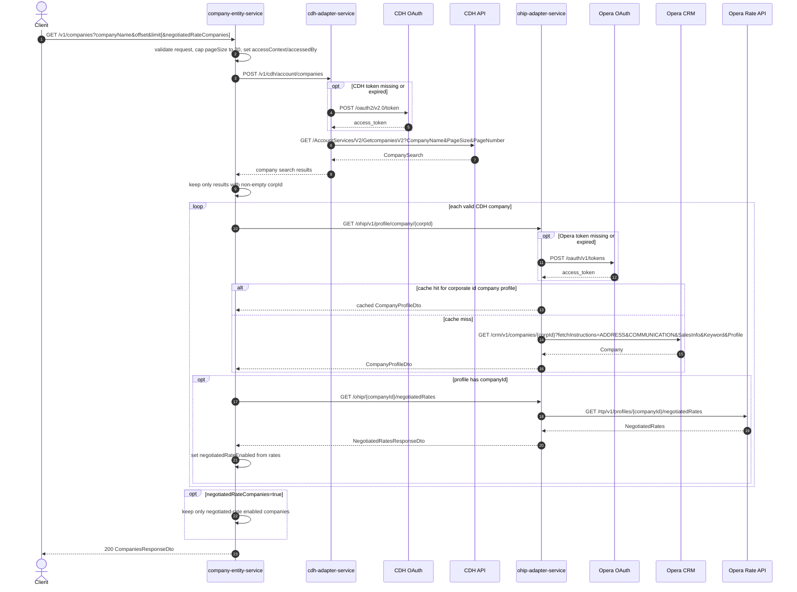

# Company Entity Service: getCompaniesFromCdh Flow

Searches companies by name through CDH, then enriches each result with Opera company profile and negotiated-rate data via ohip-adapter-service.

```http
GET /v1/companies?companyName={companyName}&offset={offset}&limit={limit}[&negotiatedRateCompanies={true|false}]
Host: company-entity-service:9118
Accept: application/json
```

## Flow

company-entity-service validates the query, maps `limit` to CDH `pageSize` and `offset` to CDH `pageNumber`, caps page size at 20, and sets `accessContext=OPERA` and `accessedBy=company-entity-service`.

It posts the search to cdh-adapter-service, which authenticates to CDH OAuth when needed and calls the CDH company search API. Results without a non-empty `globalCompanyId` / `corpId` are dropped.

For each remaining company, company-entity-service calls ohip-adapter-service for the Opera company profile by corporate id, then for negotiated rates by profile/company id. Missing Opera profiles are skipped; a missing negotiated-rates response leaves `negotiatedRateEnabled` unset/false but keeps the company.

When `negotiatedRateCompanies=true`, the response is filtered to companies with negotiated rates. `totalResults` is recalculated after enrichment and filtering.

## Mermaid Flow



## Features

- Company name search against CDH with paging (`offset` / `limit`)
- Hard page-size cap of 20 for the CDH search
- Filters out CDH rows without a corporate id before Opera enrichment
- Enriches each company with Opera profile fields (name, address, phone, company/profile ids, status)
- Marks `negotiatedRateEnabled` from Opera negotiated rates
- Optional filter to return only companies that have negotiated rates
- Recalculates `totalResults` after enrichment and optional filtering

## Feature Flags

None. This endpoint does not gate behavior on feature flags.

## Request

| Parameter | Location | Required | Notes |
| --- | --- | --- | --- |
| `companyName` | query | Yes | Non-empty company name search term |
| `offset` | query | Yes (`@Min(1)`) | Mapped to CDH `pageNumber`; omitted/zero fails validation |
| `limit` | query | Yes (`@Min(1)`) | Mapped to CDH `pageSize` and capped at 20 |
| `negotiatedRateCompanies` | query | No | Defaults to `false`; when `true`, response keeps only negotiated-rate companies |

Mapped CDH adapter body fields set by company-entity-service:

- `pageSize` = `min(limit, 20)`
- `pageNumber` = `offset`
- `accessContext` = `OPERA`
- `accessedBy` = `company-entity-service`

CDH API call uses `Authorization: Bearer`, `AccessContext`, `AccessedBy`, `Ocp-Apim-Subscription-Key`, and `X-Azure-FDID`. Opera CRM/rate calls use hub credentials via ohip-adapter-service (`x-hubid` on Opera).

## Branches

| Branch | Behavior |
| --- | --- |
| CDH result missing `corpId` | Dropped before OHIP calls |
| OHIP company profile 404 / not found | Company excluded from response |
| Negotiated rates 404 / empty | Company kept with `negotiatedRateEnabled=false` unless filtered out |
| `negotiatedRateCompanies=true` | Response filtered to negotiated-rate companies only |
| ohip-adapter cache enabled | Corporate-id company profile may be served from `OperaCompaniesCache` without calling Opera CRM |
