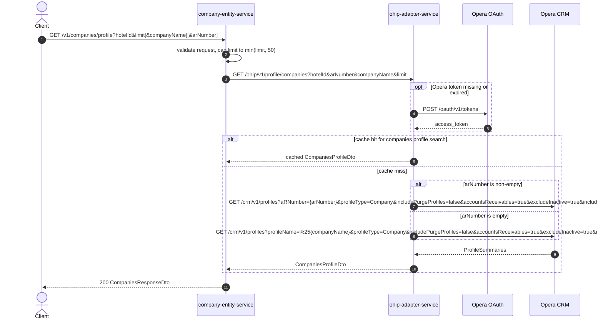

# Company Entity Service: getCompaniesProfile Flow

Searches company profiles in Opera for a hotel through ohip-adapter-service, by AR number or company name.

```http
GET /v1/companies/profile?hotelId={hotelId}&limit={limit}[&companyName={companyName}][&arNumber={arNumber}]
Host: company-entity-service:9118
Accept: application/json
```

## Flow

company-entity-service validates the request and caps `limit` at 50. It then calls ohip-adapter-service `GET /ohip/v1/profile/companies` with `hotelId`, optional `arNumber` and `companyName`, and the capped limit.

ohip-adapter-service authenticates to Opera when needed and searches Opera CRM profiles. If `arNumber` is non-empty it searches by AR number; otherwise it searches by company name with a `%` prefix. Results are mapped to company rows and returned as `CompaniesResponseDto`.

This path does not call CDH and does not load negotiated rates, so `negotiatedRateEnabled` remains false unless already present on the mapped model.

## Mermaid Flow



## Features

- Hotel-scoped company profile search via Opera CRM
- AR-number search takes precedence over company-name search when `arNumber` is non-empty
- Company-name search uses a leading `%` wildcard on `profileName`
- Hard result limit cap of 50
- Maps Opera profile summary fields to company response rows (ids, name, AR number, address, phone, restricted flags, active status)
- Does not enrich with negotiated rates or CDH data

## Feature Flags

None. This endpoint does not gate behavior on feature flags.

## Request

| Parameter | Location | Required | Notes |
| --- | --- | --- | --- |
| `hotelId` | query | Yes | Non-empty; forwarded to OHIP and sent to Opera as `x-hotelid` |
| `limit` | query | Yes (`@Min(1)`) | Capped to `min(limit, 50)` before the OHIP call |
| `companyName` | query | No | Used only when `arNumber` is empty |
| `arNumber` | query | No | When non-empty, OHIP searches Opera by `aRNumber` instead of `profileName` |

## Branches

| Branch | Behavior |
| --- | --- |
| `arNumber` present | Opera search uses `aRNumber` |
| `arNumber` empty | Opera search uses `profileName=%{companyName}` |
| `limit > 50` | OHIP/Opera receive `limit=50` |
| ohip-adapter cache enabled | Profile search may be served from `CompaniesProfileCache` without calling Opera CRM |
| Empty Opera `profileInfo` | Response returns empty `companies` with paging fields from the adapter mapping |
