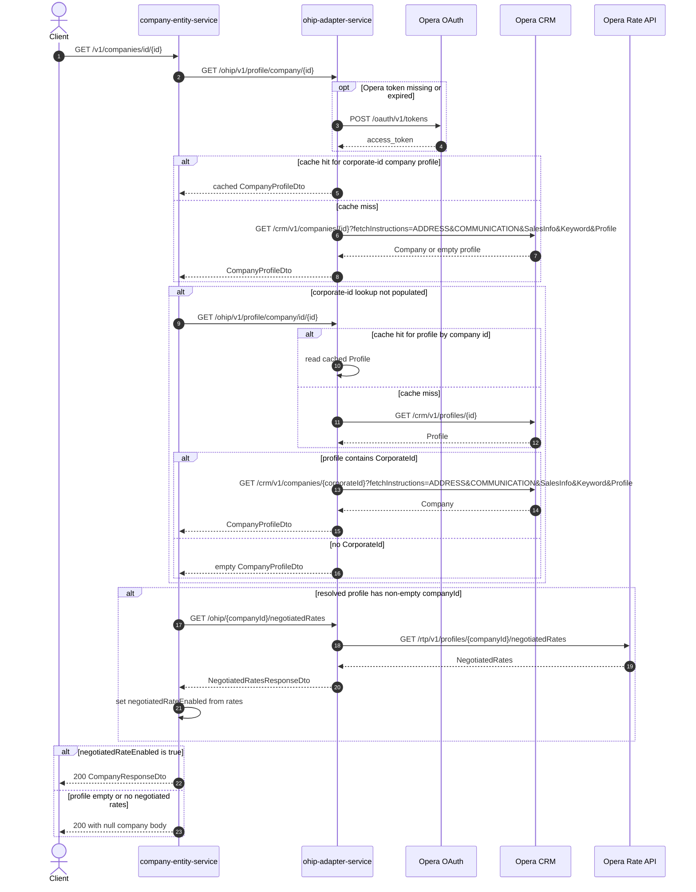

# Company Entity Service: getCompanyById Flow

Resolves a single company by corporate id or company/profile id and returns it only when the profile has negotiated rates.

```http
GET /v1/companies/id/{id}
Host: company-entity-service:9118
Accept: application/json
```

## Flow

company-entity-service treats `{id}` as either a corporate id or a company/profile id. It first asks ohip-adapter-service for a company profile by corporate id (`GET /ohip/v1/profile/company/{id}`).

If that profile is empty or has no `companyId`, it falls back to lookup by company id (`GET /ohip/v1/profile/company/id/{id}`). On that path, ohip-adapter-service loads the Opera profile, extracts a `CorporateId` when present, and reloads the full company profile by corporate id.

When a populated profile with a non-empty `companyId` is resolved, company-entity-service always requests negotiated rates. The endpoint returns the company only if `negotiatedRateEnabled` is true; otherwise the mapped body is null.

## Mermaid Flow



## Features

- Dual lookup: corporate id first, then company/profile id fallback
- Fallback resolves `CorporateId` from the Opera profile and reloads the full company
- Always attempts negotiated-rate enrichment for a populated profile with `companyId`
- Returns a company only when negotiated rates are present (`negotiatedRateEnabled=true`)
- No public option to skip negotiated rates on this endpoint

## Feature Flags

None. This endpoint does not gate behavior on feature flags.

## Request

| Parameter | Location | Required | Notes |
| --- | --- | --- | --- |
| `id` | path | Yes | Tried first as corporate id, then as company/profile id |

Downstream calls:

- `GET /ohip/v1/profile/company/{id}` then optional `GET /ohip/v1/profile/company/id/{id}`
- Opera CRM company/profile endpoints with `x-hubid`
- `GET /ohip/{companyId}/negotiatedRates` then Opera `GET /rtp/v1/profiles/{companyId}/negotiatedRates`

## Branches

| Branch | Behavior |
| --- | --- |
| Corporate-id profile populated | Skip company-id fallback |
| Corporate-id profile empty | Fall back to company-id profile lookup |
| Company-id profile has `CorporateId` | Load full company by that corporate id |
| Company-id profile lacks `CorporateId` | Empty profile; no negotiated-rate call |
| Negotiated rates present | Return company with `negotiatedRateEnabled=true` |
| Negotiated rates empty/missing or profile empty | Return null company body |
| ohip-adapter cache enabled | Corporate-id and company-id profile lookups may hit `OperaCompaniesCache` / `OperaCompaniesProfileCache` |
