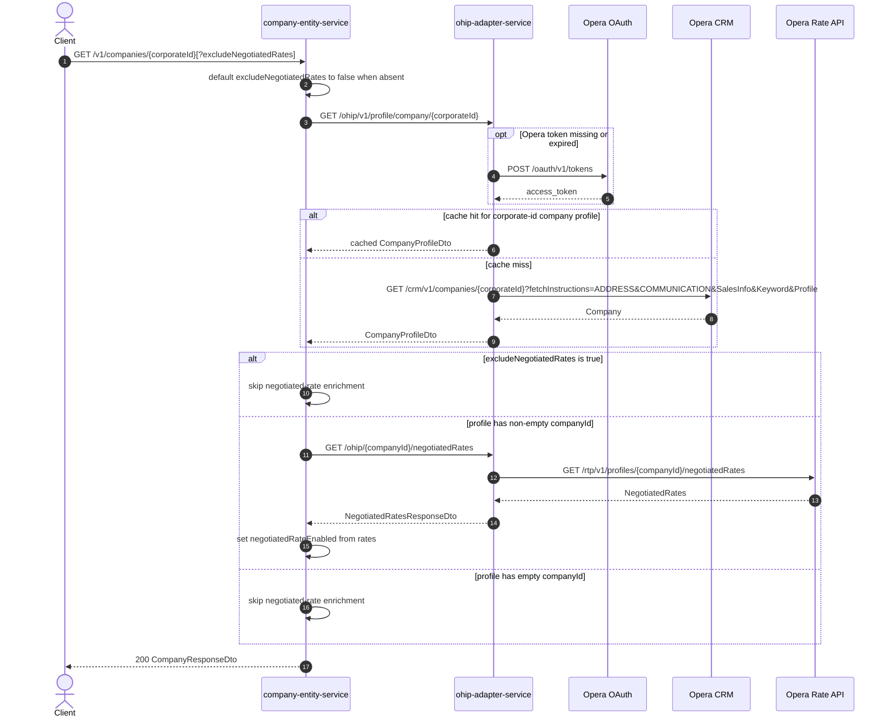

# Company Entity Service: getCompany Flow

Loads a single company profile by corporate id from Opera via ohip-adapter-service, optionally enriching with negotiated rates.

```http
GET /v1/companies/{corporateId}[?excludeNegotiatedRates={true|false}]
Host: company-entity-service:9118
Accept: application/json
```

## Flow

company-entity-service defaults `excludeNegotiatedRates` to false when the query param is absent. It requests the company profile from ohip-adapter-service by corporate id.

ohip-adapter-service authenticates to Opera when needed and loads the Opera CRM company, including address, communication, sales, keyword, and profile fetch instructions.

If negotiated rates are not excluded and the profile has a non-empty `companyId`, company-entity-service requests negotiated rates and sets `negotiatedRateEnabled` from whether any rates are returned. The mapped company is returned even when negotiated rates are empty.

## Mermaid Flow



## Features

- Corporate-id company profile lookup through ohip-adapter-service / Opera CRM
- Optional skip of negotiated-rate enrichment via `excludeNegotiatedRates=true`
- Sets `negotiatedRateEnabled` from presence of negotiated rates when enrichment runs
- Returns the company profile even when negotiated rates are empty (unlike `getCompanyById`)
- No CDH involvement on this path

## Feature Flags

None. This endpoint does not gate behavior on feature flags.

## Request

| Parameter | Location | Required | Notes |
| --- | --- | --- | --- |
| `corporateId` | path | Yes | Passed to OHIP company-profile lookup |
| `excludeNegotiatedRates` | query | No | Defaults to `false`; only `true` skips negotiated-rates lookup |

Downstream calls:

- `GET /ohip/v1/profile/company/{corporateId}`
- Opera CRM `GET /crm/v1/companies/{corporateId}` with `x-hubid`
- When enrichment runs: `GET /ohip/{companyId}/negotiatedRates` then Opera `GET /rtp/v1/profiles/{companyId}/negotiatedRates`

## Branches

| Branch | Behavior |
| --- | --- |
| `excludeNegotiatedRates` absent/false and `companyId` present | Load negotiated rates and set `negotiatedRateEnabled` |
| `excludeNegotiatedRates=true` | Return profile without negotiated-rate call |
| Empty `companyId` on profile | Skip negotiated-rate call |
| ohip-adapter cache enabled | Corporate-id company profile may be served from `OperaCompaniesCache` |
