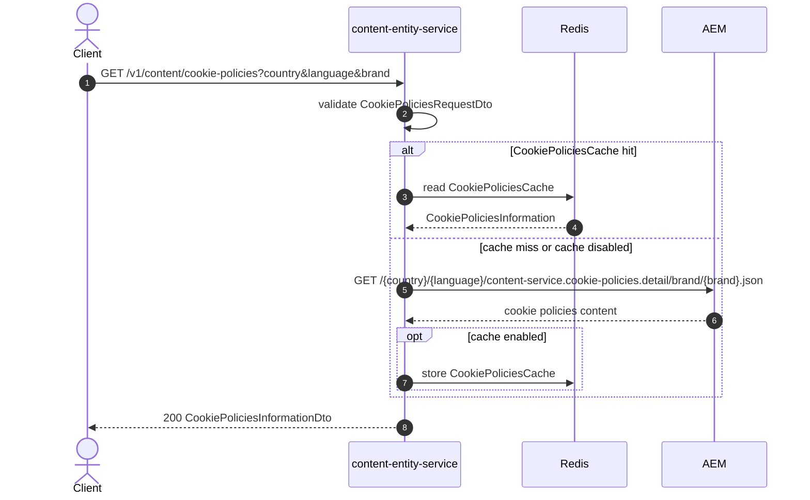

# Content Entity Service: getCookiePolicies Flow

Returns cookie policy content for a country, language, and brand from AEM.

```http
GET /v1/content/cookie-policies?country={country}&language={language}&brand={brand}
Host: content-entity-service
Accept: application/json
```

## Flow

`CookiePoliciesController` validates `country`, `language`, and `brand`, maps them to a domain request, and calls `CookiePoliciesInPort`.

The out port checks the `CookiePoliciesCache` when caching is enabled. On a miss (or when cache is disabled), content-entity-service calls AEM for cookie policies detail and maps the response to the public DTO.

## Mermaid Flow



## Features

- Query-only public API for cookie policy content
- Required `country`, `language`, and `brand` with no defaulting
- Optional Redis cache (`CookiePoliciesCache`) around the AEM fetch
- Pass-through mapping of AEM cookie policy fields to the public response

## Feature Flags

None. This endpoint does not gate behavior on feature flags.

## Request

| Parameter | Required | Notes |
| --- | --- | --- |
| `country` | Yes | Used in the AEM path as supplied |
| `language` | Yes | Used in the AEM path as supplied |
| `brand` | Yes | Used in the AEM path as supplied |

## Branches

| Trigger | Behavior |
| --- | --- |
| Missing or blank `country`, `language`, or `brand` | Validation rejects the request before AEM is called |
| Cache hit | AEM call is skipped |
| AEM error | Service fails with cookie-policies AEM error mapping |
