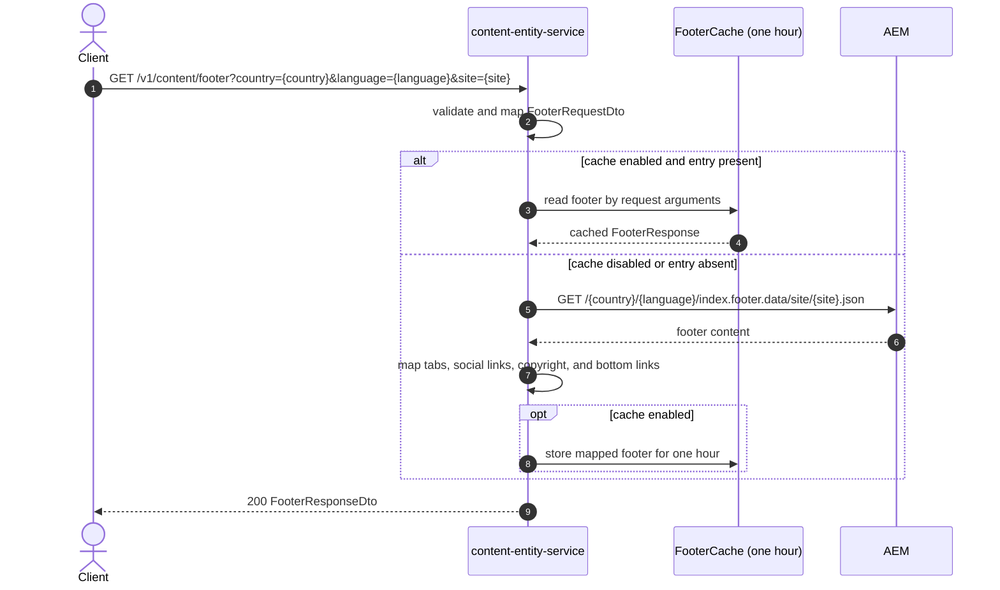

# Content Entity Service: getFooter Flow

Returns footer navigation, social links, copyright information, bottom links, and
newsletter content for a country, language, and site.

```http
GET /v1/content/footer?country={country}&language={language}&site={site}
Host: content-entity-service:9106
Accept: application/json
```

## Flow

Content entity validates that `country`, `language`, and `site` are present, maps
them into the footer domain request, and checks the one-hour `FooterCache` when
application caching is enabled.

On a cache miss, it calls AEM using the templated path
`/{country}/{language}/index.footer.data/site/{site}.json`. The AEM response is
mapped into the public footer response: link tabs become `tabs`, social links
become `socialMediaIcons`, and copyright becomes `copyrightInfo`. The mapped
response is returned with HTTP 200 and cached for subsequent equivalent requests.

## Mermaid Flow



## Features

- Footer selection by country, language, and site
- One-hour application cache when caching is enabled
- AEM footer lookup using the three request values as path components
- Response mapping for tabs, social icons, copyright, bottom links, and newsletter content
- Validation before any AEM call

## Feature Flags

None. This endpoint does not gate behavior on feature flags.

## Request

| Query parameter | Required | Purpose |
| --- | --- | --- |
| `country` | Yes | Country segment used in the AEM footer path, for example `gb` |
| `language` | Yes | Language segment used in the AEM footer path, for example `en` |
| `site` | Yes | Site variant used by AEM, for example `leisure` or `business-booker` |

## Branches

| Trigger | Behavior |
| --- | --- |
| Any required parameter missing or empty | Request validation fails before the AEM client is called |
| Cache enabled and matching entry present | Returns the cached mapped footer without calling AEM |
| Cache disabled or cache miss | Calls AEM and maps its response |
| AEM returns an error | Maps the downstream failure to `AEM_FOOTER_INFO_EXCEPTION` |
