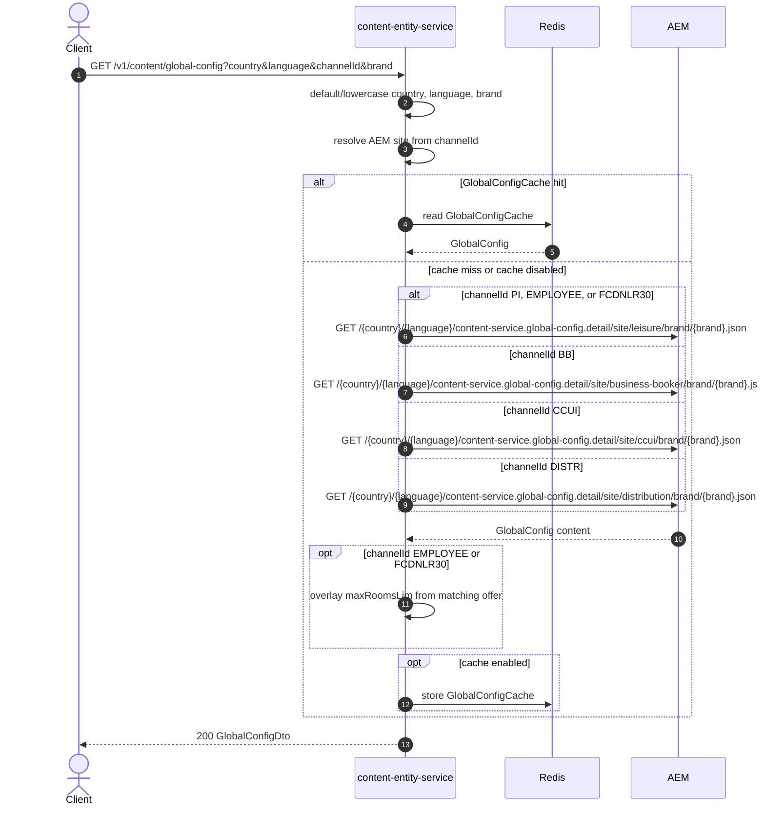

# Content Entity Service: getGlobalConfig Flow

Returns global booking configuration for a channel and brand from AEM, including search limits, room class order, upgrades, promotions, price-finder config, city-tax hotels, and upsell extras.

```http
GET /v1/content/global-config?country={country}&language={language}&channelId={channelId}&brand={brand}
Host: content-entity-service
Accept: application/json
```

## Flow

`GlobalConfigController` maps the request and calls `ContentInPort.getGlobalConfig`. Blank `country`, `language`, and `brand` are defaulted to `gb`, `en`, and `pi` and lowercased. `channelId` is required and selects the AEM site path.

content-entity-service reads `GlobalConfigCache` when caching is enabled. On a miss, it fetches the channel-specific AEM global-config document, maps booking-widget limits through `SearchRulesMapper`, and returns the assembled public DTO.

For `channelId=EMPLOYEE` or `channelId=FCDNLR30`, the service still uses the leisure AEM path, then overlays max rooms, nights, amend max rooms, max arrival date, and occupancies from the matching offer when present.

## Mermaid Flow



## Features

- Channel-specific AEM global-config sites: leisure, business-booker, ccui, distribution
- Defaults blank `country`/`language`/`brand` to `gb`/`en`/`pi`
- Builds search limits (`maxRoomsLim`) from booking widget config, with offer overrides for employee and travel-industry channels
- Returns room class config, room upgrade options, promotions config, price-finder config, hotels with city tax, and upsell extras
- Optional Redis cache (`GlobalConfigCache`)

## Feature Flags

None. This endpoint does not gate behavior on feature flags.

## Request

| Parameter | Required | Notes |
| --- | --- | --- |
| `country` | No | Blank or missing becomes `gb`; lowercased |
| `language` | No | Blank or missing becomes `en`; lowercased |
| `channelId` | Yes | Case-insensitive; selects AEM site path |
| `brand` | No by DTO validation | Blank or missing becomes `pi`; lowercased |

## Branches

| Trigger | Behavior |
| --- | --- |
| `channelId=PI` | Leisure AEM path |
| `channelId=EMPLOYEE` | Leisure AEM path; overlays `employee-offer` limits when present |
| `channelId=FCDNLR30` | Leisure AEM path; overlays `travel-industry-rate` limits when present |
| `channelId=BB` | Business-booker AEM path |
| `channelId=CCUI` | CCUI AEM path |
| `channelId=DISTR` | Distribution AEM path |
| Unsupported `channelId` | Fails before AEM with no channel mapping |
| Missing `channelId` | Validation rejects the request |
| Cache hit | AEM call is skipped |
