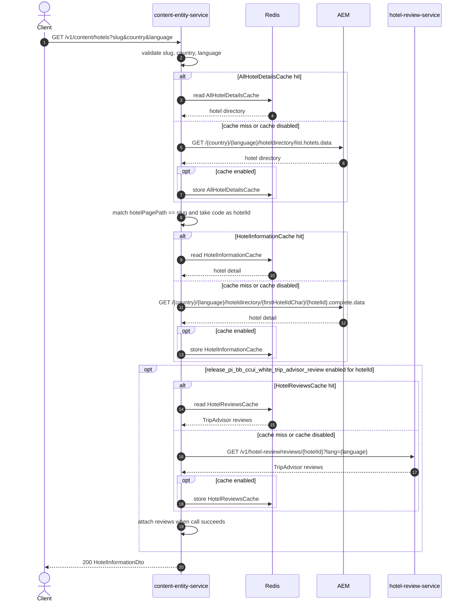

# Content Entity Service: getHotelInformationBySlug Flow

Resolves a hotel by page slug and returns hotel detail content from AEM, with optional TripAdvisor review enrichment.

```http
GET /v1/content/hotels?slug={slug}&country={country}&language={language}[&channel={channel}&subchannel={subchannel}]
Host: content-entity-service
Accept: application/json
```

## Flow

`HotelInformationController.getHotelInformationBySlug` requires `slug`, `country`, and `language`. It loads the AEM hotel directory for that locale, finds the entry whose `hotelPagePath` equals the slug, and uses that entry's hotel code as `hotelId`.

It then loads the AEM hotel complete-data document for the resolved hotel. When Unleash flag `release_pi_bb_ccui_white_trip_advisor_review` is enabled for that hotel code, content-entity-service also calls the hotel-review service and attaches TripAdvisor reviews. Review failures are logged and the AEM hotel response is still returned.

## Mermaid Flow



## Features

- Slug-to-hotel-id resolution via AEM hotel directory (`hotelPagePath`)
- Hotel complete-data fetch using the first character of the hotel id in the path
- Optional TripAdvisor enrichment gated by Unleash and hotel code context
- Optional Redis caches: `AllHotelDetailsCache`, `HotelInformationCache`, `HotelReviewsCache`
- Optional `channel` and `subchannel` are accepted but do not change this path

## Feature Flags

| Flag | Effect when enabled |
| --- | --- |
| `release_pi_bb_ccui_white_trip_advisor_review` | Evaluated with Unleash context property `hotelCode`; when enabled for the resolved hotel, content-entity-service calls hotel-review-service and maps TripAdvisor reviews into the response |

## Request

| Parameter | Required | Notes |
| --- | --- | --- |
| `slug` | Yes | Must exactly match `hotelPagePath` in the directory response |
| `country` | Yes | Used in AEM paths and directory cache key |
| `language` | Yes | Used in AEM paths, directory cache key, and review `lang` |
| `channel` | No | Mapped but not branched on |
| `subchannel` | No | Mapped but not branched on |

## Branches

| Trigger | Behavior |
| --- | --- |
| Slug not found in directory | Resource not found; hotel detail is not fetched |
| TripAdvisor flag disabled or not for hotel | Review service is not called |
| TripAdvisor call fails | Warning is logged; AEM hotel detail is still returned |
| Cache hits | Corresponding AEM or review calls are skipped |
