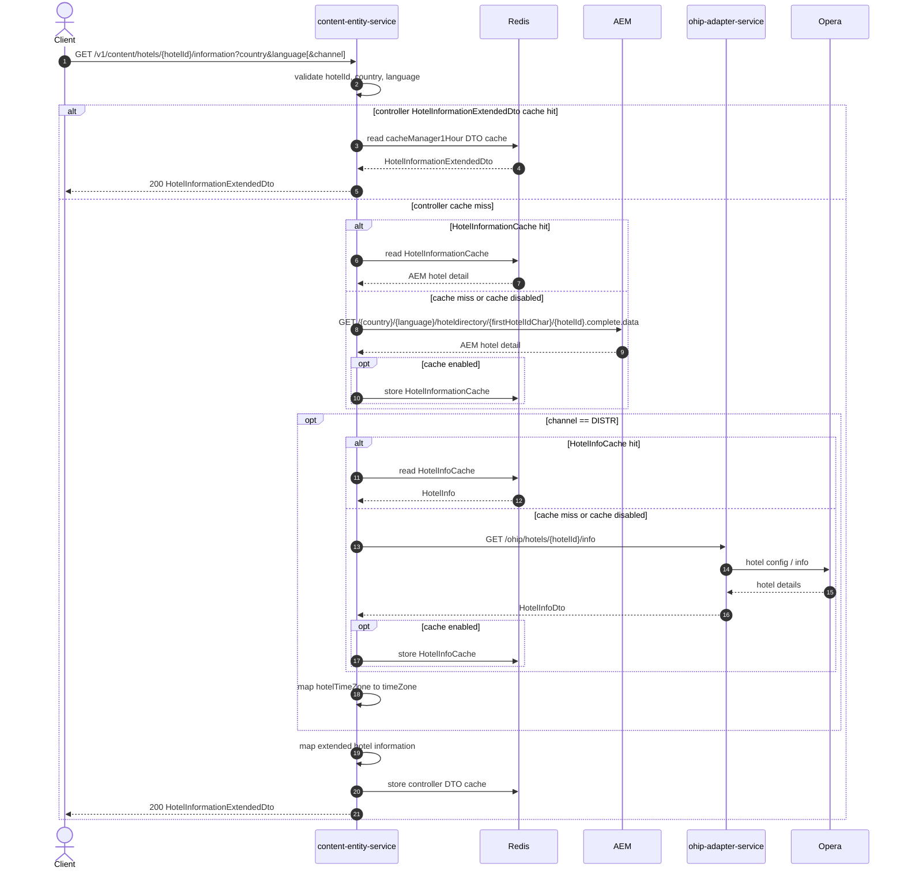

# Content Entity Service: getHotelInformation Flow

Returns extended hotel information for a hotel id from AEM, with optional OHIP timezone enrichment when `channel=DISTR`.

```http
GET /v1/content/hotels/{hotelId}/information?country={country}&language={language}[&channel={channel}&subchannel={subchannel}]
Host: content-entity-service
Accept: application/json
```

## Flow

`HotelInformationController.getHotelInformation` requires path `hotelId` plus query `country` and `language`. It first checks a one-hour controller-level DTO cache. On a hit, the cached `HotelInformationExtendedDto` is returned without further work.

On a miss, content-entity-service loads AEM hotel complete-data for the hotel. This path always requests hotel information with TripAdvisor data disabled. When `channel` is exactly `DISTR`, it also calls ohip-adapter-service for hotel info and maps `hotelTimeZone` into response `timeZone`. The assembled extended DTO is stored in the controller cache and returned.

## Mermaid Flow



## Features

- Path-based hotel lookup by `hotelId`
- AEM complete-data as the primary content source
- Controller-level DTO cache (`cacheManager1Hour`) before domain work
- Optional OHIP enrichment only when `channel=DISTR`, exposing hotel timezone
- Upsell package code enrichment from AEM ancillary/closeout mapping where present
- TripAdvisor is not requested on this endpoint (`tripAdvisorDataRequired=false`)

## Feature Flags

None. This endpoint does not gate behavior on feature flags.

## Request

| Parameter | Required | Notes |
| --- | --- | --- |
| `hotelId` | Yes (path) | Used in AEM path; first character becomes the hotel-directory segment |
| `country` | Yes | AEM path and cache key |
| `language` | Yes | AEM path and cache key |
| `channel` | No | Exact value `DISTR` enables OHIP hotel-info enrichment |
| `subchannel` | No | Mapped but not branched on |

## Branches

| Trigger | Behavior |
| --- | --- |
| Controller DTO cache hit | Returns immediately; no AEM or OHIP calls |
| `channel` missing or not `DISTR` | AEM only; `timeZone` is not filled from OHIP |
| `channel=DISTR` | Also calls ohip-adapter-service `/ohip/hotels/{hotelId}/info` |
| AEM hotel-detail cache hit | Skips AEM call |
| AEM 4xx / other error | Mapped hotel-information AEM exception |
