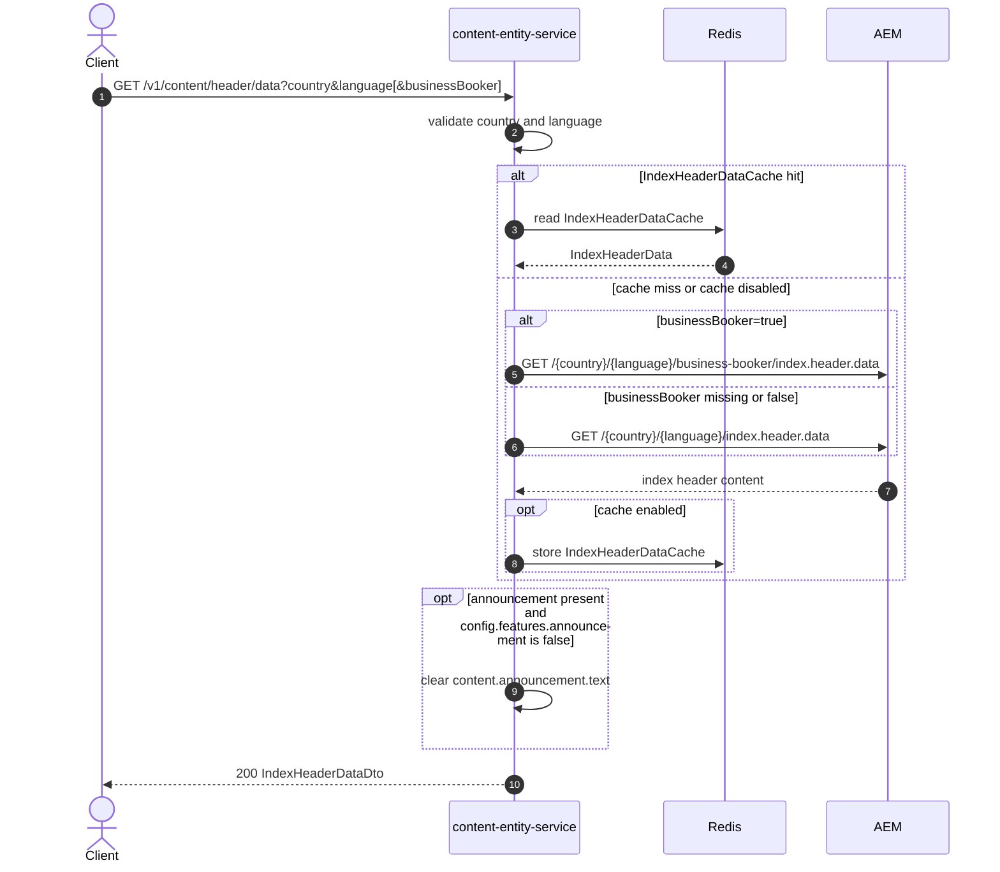

# Content Entity Service: getIndexHeaderData Flow

Returns index header content and config for a country and language, with an optional business-booker AEM path and announcement text gating.

```http
GET /v1/content/header/data?country={country}&language={language}[&businessBooker={businessBooker}]
Host: content-entity-service
Accept: application/json
```

## Flow

`IndexHeaderDataController` requires `country` and `language`. Optional `businessBooker=true` selects the business-booker AEM header endpoint; missing or false uses the standard index header endpoint.

content-entity-service checks `IndexHeaderDataCache` when caching is enabled. On a miss it fetches AEM, maps the payload, then applies announcement handling: if announcement content is present and `config.features.announcement` is false, announcement `text` is cleared before the public response is returned.

## Mermaid Flow



## Features

- Standard and business-booker AEM header data sources
- Required `country` and `language` with no defaulting or lowercasing
- Announcement text suppressed when the AEM features config disables announcements
- Response includes nested content (SEO, favicon, menus, forms) and config sections
- Optional Redis cache (`IndexHeaderDataCache`)

## Feature Flags

None. This endpoint does not gate behavior on Unleash feature flags. Announcement visibility is controlled by AEM `config.features.announcement` in the response payload.

## Request

| Parameter | Required | Notes |
| --- | --- | --- |
| `country` | Yes | Passed through to the AEM path as supplied |
| `language` | Yes | Passed through to the AEM path as supplied |
| `businessBooker` | No | Only `true` selects the business-booker AEM path |

## Branches

| Trigger | Behavior |
| --- | --- |
| `businessBooker=true` | Uses `/{country}/{language}/business-booker/index.header.data` |
| `businessBooker` missing or false | Uses `/{country}/{language}/index.header.data` |
| Missing `country` or `language` | Validation rejects the request before AEM |
| Announcement present and feature false | Public `announcement.text` is null; other announcement fields still map |
| Cache hit | AEM call is skipped |
