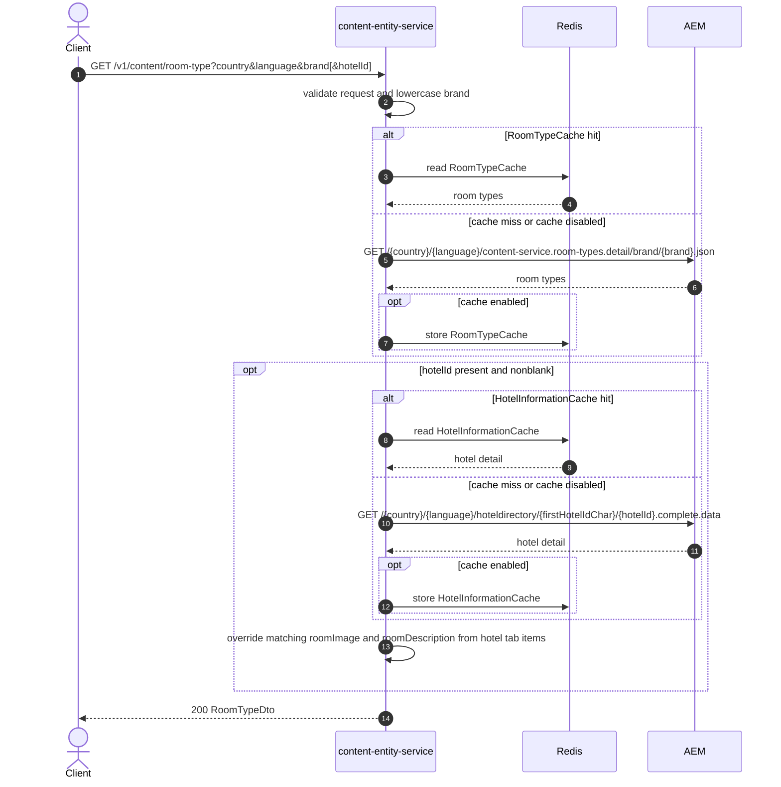

# Content Entity Service: getRoomTypeInformation Flow

Returns brand room-type content from AEM, optionally enriching images and descriptions from a hotel's room configuration when `hotelId` is supplied.

```http
GET /v1/content/room-type?country={country}&language={language}&brand={brand}[&hotelId={hotelId}]
Host: content-entity-service
Accept: application/json
```

## Flow

`RoomTypeController` requires `country`, `language`, and `brand`. `brand` is lowercased before the AEM room-types call. content-entity-service loads AEM room-types detail for the brand (via `RoomTypeCache` when caching is enabled).

If `hotelId` is present and non-blank, it also loads AEM hotel complete-data and, for matching room type codes, overrides `roomImage` from tab item `fileReference` and `roomDescription` from `rateGridRoomDescription` when those values are non-blank. Comma-delimited room codes are matched by any overlapping code after stripping spaces.

## Mermaid Flow



## Features

- Brand-level room type catalog from AEM
- Optional hotel-level image and description overrides via hotel complete-data
- Room type codes converted from comma-delimited strings to lists in the public response
- Optional Redis caches: `RoomTypeCache`, `HotelInformationCache`
- Runtime path is `/v1/content/room-type` (not the OpenAPI-documented `/roomType` spelling)

## Feature Flags

None. This endpoint does not gate behavior on feature flags.

## Request

| Parameter | Required | Notes |
| --- | --- | --- |
| `country` | Yes | Used in AEM paths as supplied |
| `language` | Yes | Used in AEM paths as supplied |
| `brand` | Yes | Lowercased before the room-types AEM path |
| `hotelId` | No | Enables hotel-detail enrichment when present and non-blank |

## Branches

| Trigger | Behavior |
| --- | --- |
| `hotelId` missing or blank | Room-types AEM only |
| `hotelId` present with matching room codes | Overrides image/description from hotel tab items when non-blank |
| `hotelId` present without matching room codes | Keeps brand room-type image and description |
| Missing `country`, `language`, or `brand` | Validation rejects the request before AEM |
| Cache hits | Corresponding AEM calls are skipped |
