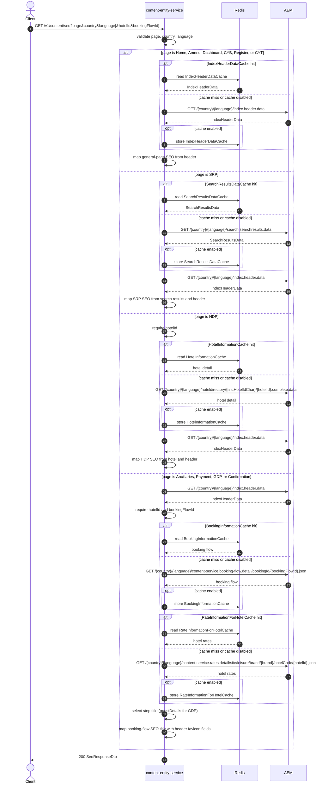

# Content Entity Service: getSeo Flow

Returns page SEO metadata (title, description, card image, favicon, and related fields) shaped by the requested page type.

```http
GET /v1/content/seo?page={page}&country={country}&language={language}[&hotelId={hotelId}&bookingFlowId={bookingFlowId}]
Host: content-entity-service
Accept: application/json
```

## Flow

`SeoController` requires `page`, `country`, and `language`. Supported pages are case-insensitive: `Home`, `SRP`, `HDP`, `Ancillaries`, `GDP`, `Payment`, `Confirmation`, `Amend`, `Dashboard`, `CYB`, `Register`, and `CYT`.

- General pages (`Home`, `Amend`, `Dashboard`, `CYB`, `Register`, `CYT`) load index header data and map SEO/favicon from it.
- `SRP` loads search results data and index header data; page title/description/card image/hreflangs come from search results, favicon from header data.
- `HDP` requires `hotelId`, loads hotel complete-data (without TripAdvisor) and index header data, and maps HDP SEO from both.
- Booking-flow pages (`Ancillaries`, `Payment`, `GDP`, `Confirmation`) require `hotelId` and `bookingFlowId`. They load index header data, booking-flow detail, and hotel rate information (brand from booking flow, channel `PI`). The page title is taken from the matching booking-flow step (`guestDetails` for `GDP`, otherwise the step id equal to `page`).

## Mermaid Flow



## Features

- Page-type routing for general, SRP, HDP, and booking-flow SEO
- Shared index header data for favicon and many SEO fields
- HDP uses hotel complete-data SEO plus header favicon; TripAdvisor is not requested
- Booking-flow title from booking-flow steps; GDP maps to `guestDetails`
- Booking-flow path also loads hotel rate information (side effect of booking out-port) and may filter packages when free F&B extras flag is disabled
- Optional Redis caches for header, search results, hotel detail, booking information, and hotel rates

## Feature Flags

| Flag | Effect when enabled |
| --- | --- |
| `release_pi_free_fnb_and_extras` | On booking-flow pages only: when enabled, package filtering against promotional package rules is skipped inside booking information assembly. SEO title mapping still comes from booking-flow steps. |

## Request

| Parameter | Required | Notes |
| --- | --- | --- |
| `page` | Yes | Case-insensitive allowed values listed above |
| `country` | Yes | Used in all AEM paths |
| `language` | Yes | Used in all AEM paths |
| `hotelId` | Domain-required for `HDP` and booking-flow pages | Not validated as required on the DTO |
| `bookingFlowId` | Domain-required for Ancillaries, Payment, GDP, Confirmation | Used in booking-flow AEM path |

## Branches

| Trigger | Behavior |
| --- | --- |
| General pages | Index header only |
| `page=SRP` | Search results data plus index header |
| `page=HDP` without `hotelId` | Missing required field before hotel fetch |
| Booking-flow page without `hotelId` or `bookingFlowId` | Index header may load first; then missing-field error |
| `page=GDP` | Title from booking step id `guestDetails` |
| Unsupported `page` | Validation or unsupported-page error |
| Cache hits | Corresponding AEM calls are skipped |
