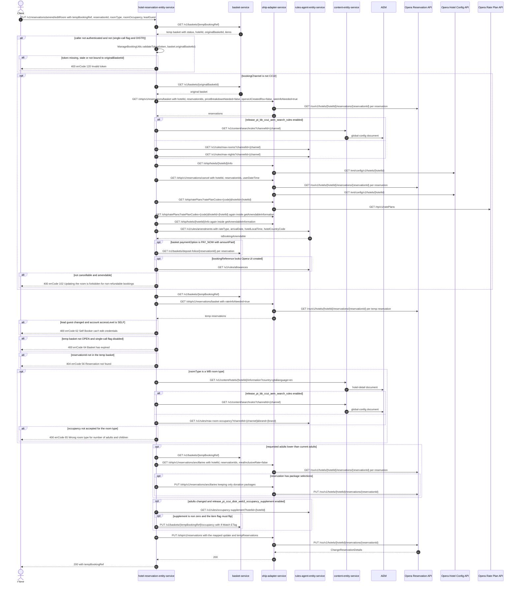

# Hotel Reservation Entity Service: amendEditRoom Flow

Applies a room-level edit (room type, occupancy, lead-guest details) to **one** Opera
reservation held by an amend basket, and returns that basket's reference. It is the "change
this room" step of the amend journey: it never confirms the amend, never touches payment, and
never creates or deletes a basket item.

```http
PUT /v1/reservations/amend/editRoom
Host: hotel-reservation-entity-service:9103
Content-Type: application/json
Accept: application/json
WB-Authorization: Bearer <JWT>   (optional; when absent the body's `token` is mandatory)
```

The service declares no servlet context path and `HotelReservationController` is mapped under
`/v1`, so the public path is `/v1/reservations/amend/editRoom`. The body is an
`EditRoomRequestDto` (extends `AddNewRoomRequestDto`): `tempBookingRef`, `reservationId`,
`roomType`, `roomOccupancy`, `leadGuest` are required; `bookingChannel`, `token`,
`ratePlanCode` and `specialRequests` are optional fields the flow does read.

## Flow

`HotelReservationController.amendEditRoom` maps the DTO into an `UpdateReservationsRequest`
holding exactly one `UpdateReservationRequest` (index `0` throughout the in-port), then calls
`HotelReservationInPortImpl.editRoom(request, tempBookingRef, bookingChannel, null, null)` -
the controller always passes `isNonRefundable = null` and `isOta = null`, so the two branches
those parameters short-circuit are unreachable from HTTP.

`editRoom` reads the **temp (amend) basket** from basket-service
(`GET /v1/baskets/{tempBookingRef}`), builds the Opera update through
`getEditRoomUpdateRequest`, and finally pushes it to ohip-adapter-service
(`PUT /ohip/v1/reservations`), which issues one Opera
`PUT /rsv/v1/hotels/{hotelId}/reservations/{reservationId}`. The response body is just
`{"tempBookingRef": <tempBookingRef>}`.

`getEditRoomUpdateRequest` is where the whole orchestration lives, in this order:

1. **Token / authentication gate.** Unless `release_amend_distribution_single_call` is enabled
   *and* the booking channel is `DISTR`, the request is checked with
   `ManageBookingUtils.validateToken(request.token, basket.originalBasketId)` whenever the
   caller is **not** authenticated. `TokenUtils.isValid` decrypts the token with `CipherUtils`
   and requires its first segment to equal the temp basket's `originalBasketId` and its
   timestamp to be under 30 minutes old. A temp basket without an `originalBasketId` - i.e.
   any basket not minted by the amend/copy flow - can never satisfy this check, so an
   unauthenticated call against a plain created basket always fails with `errCode` `120`.
2. **Non-refundable guard.** For any channel other than `CCUI` (and always, because the
   controller passes `isNonRefundable = null`), `isBookingNonRefundable` runs the **full
   manage-booking orchestration** through `ManageBookingInPortImpl.getManageBookingInformation`
   against the **original** basket (`basket.originalBasketId`; the temp basket ref is used
   instead when `release_amend_distribution_single_call` is on). A booking that is not
   cancellable but is amendable is rejected with `errCode` `102`. That leg alone reads the
   original basket, re-reads its reservations through ohip-adapter, hits
   rules-agent-entity-service (or AEM search rules) for max-rooms/max-nights, reads Opera hotel
   config and cancellation information, reads Opera rate plans twice, and asks
   rules-agent-entity-service whether the booking is amendable.
3. **Current amend state.** `getAllReservationsJustByBasketReference(tempBookingRef, false,
   true)` re-reads the temp basket and loads its reservations from ohip-adapter with
   `priceBreakdownNeeded=false`, `operaUiCreatedRsv=false`, `rateInfoNeeded=true`.
4. **Self-booker guard.** If the request changes the lead guest and the authenticated account's
   `accessLevel` is `SELF`, the edit is rejected with `errCode` `62`.
5. **Basket status guard.** Unless `release_amend_distribution_single_call` is enabled, a temp
   basket whose status is not `OPEN` is rejected with `errCode` `64`.
6. **Target selection.** The reservation named by `reservationId` must be among the temp
   basket's reservations, otherwise `errCode` `56` (HTTP `404`). Its Opera arrival and
   departure dates and the basket's `hotelId` are copied onto the update request.
7. **Room-occupancy rule.** When the requested `roomType` is one of the configured WB room
   types (`DB`, `SB`, `FAM`, `DIS`, `TWIN`), the adult/child combination is validated against
   the max-room-occupancy rule. The rule source is flag-dependent: AEM search rules through
   content-entity-service, or rules-agent-entity-service. Either way content-entity-service is
   first asked for the hotel's brand (`GET /v1/content/hotels/{hotelId}/information`, served
   from the AEM hotel-detail document). A violation is `errCode` `65`.
8. **Meal reset.** If the requested adult count is *lower* than Opera's current adult count,
   `updatePackagesToResetMeals` reads the temp basket's package selections
   (`GET /ohip/v1/reservations/ancillaries`) and, when the reservation has any, rewrites them
   keeping only donation packages (`PUT /ohip/v1/reservations/ancillaries`).
9. **Occupancy supplement.** If the adult count changed *and*
   `release_pi_ccui_distr_web3_occupancy_supplement` is enabled, the per-hotel supplement is
   read from rules-agent-entity-service and, when non-zero, the per-night price is adjusted in
   memory and the basket item's `hasOccupancySup` flag is written back with
   `PUT /v1/baskets/{basketReference}/occupancy` (If-Match on the basket ETag).
10. **Employee rate.** When the first temp reservation's rate plan is the employee rate plan,
    the request's `companyId` is overwritten with the configured Whitbread company id.

If the final ohip-adapter PUT fails, `HotelReservationOhipException` is logged (with a
`DISTR`-specific message) and rethrown unchanged - nothing is rolled back.

## Mermaid Flow



## Features

- Edits exactly one reservation per call: the mapper always builds a single-element
  `reservations` list and the in-port reads index `0` everywhere.
- Targets the **temp (amend) basket**; the reservation ids come from the temp basket's item
  `sourceId` values, and the request's `reservationId` must be one of them.
- Arrival and departure dates are never taken from the request - they are copied from Opera's
  current reservation, so this endpoint cannot move stay dates (that is `amendStayDates`).
- Lead-guest name is always mapped; email and address are mapped only when present.
- `roomType` and `roomOccupancy` become an Opera room-rate change; `marketCode` is reset to the
  ohip-adapter default and `sourceCode` is carried over from the current reservation.
- Occupancy-rule validation only applies to the five configured WB room types; any other room
  type skips both the content and rules lookups.
- Reducing the adult count strips meal packages from the reservation, keeping donation packages
  (`ZCHRY`, `CHRTY`, `ZCHR10`-`ZCHR13`).
- The employee rate plan on the first temp reservation forces the Whitbread `companyId` onto
  the Opera update.
- `distributionIATANumber` on the request is carried through to Opera as UDF `UDFC16` /
  `UDFN01` by ohip-adapter.
- No payment, no refund, no email and no basket-item creation or deletion on this path.

## Feature Flags

Every flag below is evaluated **inside** hotel-reservation-entity-service, which registers
`BaggageFeatureFlagOverrideResolver` and honours `integration-tests.feature-flag-overrides`,
so all of them are baggage-pinnable - except `mobile_accepts_ota_booking`, which is evaluated
in **both** services (see the note under the table).

| Flag | Effect when enabled |
| --- | --- |
| `release_amend_distribution_single_call` | Three effects on this path: (a) with a `DISTR` booking channel it **skips the token/authentication check** entirely; (b) it makes the non-refundable guard read the **temp** basket instead of `originalBasketId`; (c) it **disables** the "temp basket must be `OPEN`" rejection. |
| `release_pi_ccui_distr_web3_occupancy_supplement` | Enables the occupancy-supplement recalculation when the adult count changes: reads `GET /v1/rules/occupancy-supplement` and, when the supplement is non-zero and the basket item's `hasOccupancySup` must flip, writes `PUT /v1/baskets/{ref}/occupancy`. When disabled, neither call happens and prices are untouched. |
| `release_pi_bb_ccui_aem_search_rules` | Switches both rule lookups on this path from rules-agent-entity-service to content-entity-service' AEM search-rules document: `max-rooms`/`max-nights` inside the non-refundable guard, and `max-room-occupancy` inside the room-type validation. |
| `release_pi_bb_ccui_maxrooms_amend` | Only read inside the non-refundable guard, and only when `release_pi_bb_ccui_aem_search_rules` is **also** enabled: it makes the manage-booking orchestration compare the basket's room count against the AEM `maxRoomsAmend` limit and return a non-amendable response when exceeded. It is never read by `editRoom` itself. |
| `mobile_preRegistered_repurpose` | Evaluated in this service's `getReservationsByIds` out-port. When disabled, every reservation read on this path has `deRegCardCompleted` forced to `false`. Internal to the flow; not visible in `TempBookingRefResponseDto`. |
| `mobile_accepts_ota_booking` | Inside the non-refundable guard it classifies an OTA (`idContext`) booking, which forces `isAmendable`/`isCancellable` to `false` and changes whether `errCode` `102` fires. Also evaluated **inside ohip-adapter-service** during every `GET /ohip/v1/reservations/basket`, where it excuses non-unique deposit policy codes across a multi-room basket. |
| `mobile_ciol_piba`, `mobile_ciol_piba_cnp`, `mobile_ciol_prepaid_3rdparty`, `release_pi_bb_mobile_de_reg_card`, `release_pi_bb_mobile_check_out`, `mobile_digital_key` | Read inside the manage-booking orchestration (CIOL / COOL / digital-key availability). They shape fields of `ManageBookingResponse` that `isBookingNonRefundable` never reads, so they make no downstream call and change nothing observable on this endpoint. |

Opera token-service flags govern Opera OAuth acquisition inside ohip-adapter-service and are
not endpoint behavior.

## Request

| Body field | Required | Purpose |
| --- | --- | --- |
| `tempBookingRef` | Yes (`@NotEmpty`) | The temp (amend) basket. Read three times on the happy path, and returned as the response's `tempBookingRef`. |
| `reservationId` | Yes (`@NotEmpty`) | The Opera reservation to change. Must be one of the temp basket's item `sourceId` values, otherwise `errCode` `56`. |
| `roomType` | Yes (`@NotEmpty`) | New Opera room type. Triggers occupancy-rule validation only when it is a configured WB room type. |
| `roomOccupancy.adultsNumber` / `.childrenNumber` | Yes (object `@NotNull`) | New occupancy. A decrease in adults triggers the meal reset; any change triggers the occupancy-supplement branch. |
| `leadGuest` | Yes (`@NotNull`) | `title`/`firstName`/`lastName` always mapped; `emailAddress` and `address` mapped only when non-empty. Changing it is what the `SELF` access-level guard blocks. |
| `token` | Conditionally | Mandatory whenever the caller is unauthenticated (unless the single-call flag is on for a `DISTR` channel). Validated against the temp basket's `originalBasketId`, not against `tempBookingRef`. |
| `bookingChannel` | Effectively yes | `channel` selects the guard behavior: `CCUI` skips the entire non-refundable orchestration; `DISTR` changes the error message and pairs with the single-call flag; the channel is also the `channelId` on every rules/search-rules lookup. `bookingChannel.getChannel()` is dereferenced unconditionally in the occupancy-rule check. |
| `ratePlanCode` | No | Not read on this path (`AddNewRoomRequestDto` field reused by `addNewRoom`). |
| `specialRequests` | No | Not read by `EditRoomRequestMapper`. |

## Branches

| Trigger | Behavior |
| --- | --- |
| Unauthenticated caller, no/expired/mismatched `token` | `InvalidTokenException`, `errCode` `120`, HTTP `400`. Only the first basket read has happened. |
| Temp basket has no `originalBasketId` and caller is unauthenticated | Same `errCode` `120`: `TokenUtils.isValid` throws internally on the null reference and returns `false`. Only an amend/copy-minted basket carries `originalBasketId`. |
| `release_amend_distribution_single_call` on **and** channel `DISTR` | Token check skipped entirely. |
| Channel `CCUI` | The whole non-refundable manage-booking orchestration is skipped - roughly a dozen downstream calls disappear. |
| Manage-booking says not cancellable but amendable | `GenericBadRequestException`, `errCode` `102`, HTTP `400`, after the full guard orchestration has run. |
| Temp basket reservations not found | `HotelReservationNotFoundException` from ohip-adapter's 4xx mapping, propagated. |
| `reservationId` absent from the temp basket | `ReservationNotFoundException`, `errCode` `56`, HTTP `404`. |
| Lead guest changed by a `SELF` access-level account | `GenericBadRequestException`, `errCode` `62`, HTTP `400`. Requires an authenticated caller with an account. |
| Temp basket status not `OPEN`, single-call flag off | `GenericBadRequestException`, `errCode` `64`, HTTP `400`. |
| WB room type with an occupancy the rule rejects | `GenericBadRequestException`, `errCode` `65`, HTTP `400`. |
| Non-WB room type | Content hotel-information and the max-room-occupancy lookup are both skipped. |
| Adults decreased | Extra temp-basket read, `GET /ohip/v1/reservations/ancillaries`, and - only when the reservation actually has package selections - `PUT /ohip/v1/reservations/ancillaries` plus its Opera reservation PUT. |
| Adults changed and occupancy-supplement flag on | `GET /v1/rules/occupancy-supplement`; a non-zero supplement that flips the item flag adds `PUT /v1/baskets/{ref}/occupancy`. |
| Employee rate plan on the first temp reservation | `companyId` replaced with the configured Whitbread company id before the Opera update. |
| Opera `PUT /rsv/v1/hotels/{hotelId}/reservations/{reservationId}` fails | ohip-adapter maps it to `OHIP_CHANGE_RESERVATION_EXCEPTION`; hotel-reservation-entity-service rethrows unchanged after logging. Any basket occupancy or package write made in steps 8-9 is **not** rolled back. |

## Integration-test notes

- **Not stubbed anywhere:** basket-service, content-entity-service and
  rules-agent-entity-service are real services in the integration stack; only Opera (through
  ohip-adapter), CDH, AEM and the payment providers have WireMock targets. AEM *is* stubbed, so
  the content hops resolve against `AemHotelDetailStubs` (hotel-detail) and
  `AemGlobalConfigStubs` (global-config / search rules), but the rules-agent hops
  (`max-rooms`, `max-nights`, `max-room-occupancy`, `amendments`, `allowances`,
  `occupancy-supplement`) answer from the deployed rules service and cannot be shaped or
  counted.
- **The happy path needs an amend basket, or the DISTR + single-call escape hatch.**
  `originalBasketId` is populated only by `basketOutPort.createBasket(hotelId, originalBasketId,
  ...)`, reached on this service solely from the copy-booking flow (`POST /v1/reservations/copy`,
  matrix row 33, a hard blocker in this batch). A basket minted by the `createReservation` setup
  used in waves 3 and 4 has a null `originalBasketId`, and then:
  - an unauthenticated call fails with `errCode` `120` before any Opera call, because
    `TokenUtils.isValid(token, null)` throws inside its own `try`/`catch` and returns false;
  - **authenticating does not rescue it**: the token check is skipped, but the non-refundable
    guard still runs (the controller pins `isNonRefundable = null`) and calls
    `getManageBookingInformation(..., basketReference = basket.getOriginalBasketId(), ...)`,
    i.e. `basketOutPort.getBasketById(null)`.
  - The one path that avoids both is `release_amend_distribution_single_call` **enabled** with
    `bookingChannel.channel = "DISTR"`: the flag-and-DISTR pair skips the token check, and the
    same flag makes the non-refundable guard read `tempBookingRef` instead of
    `originalBasketId`. The guard still runs its full orchestration against the real basket.
  Note the flag is therefore **not** a free ON/OFF axis on this row - with a null
  `originalBasketId` the OFF state has no reachable happy path.
- Opera call counts on this endpoint are dominated by the non-refundable guard (two full
  reservation reads, two hotel-config reads, two rate-plan reads) rather than by the edit
  itself, which is a single Opera PUT.

### Verified at implement stage (2026-08-24, `AmendEditRoomSpec`)

- **The non-refundable guard fires on a plain created basket.** ohip-adapter's `isCancellable`
  returns `false` when the Opera reservation carries no
  `reservationPolicies.cancellationPolicies`, so a reservation without a cancellation policy is
  "not cancellable but amendable" and every amend fails with `errCode` `102`. A journey needs each
  reservation to carry a cancellation policy whose `absoluteDeadline` is still in the future.
- **`release_pi_bb_ccui_aem_search_rules` has no reachable OFF state here.** With the flag off,
  `fetchRules` calls `GET /v1/rules/max-rooms?channelId=DISTR` on rules-agent-entity-service, which
  answers `404` in the integration stack; the journey then returns HTTP `500` with `errCode` `0`.
  Since `DISTR` is the only channel this endpoint is reachable on, the OFF half of the pair cannot
  be exercised at all.
- **A room-type change costs two extra Opera calls.** When the request's `roomType` differs from the
  reservation's current one, ohip-adapter resolves it through
  `GET /inv/v1/hotels/{hotelId}/hotelInventory` (twice) before writing. An edit that keeps the
  current room type never makes that hop, and neither does an edit rejected before the Opera write.
- **Measured cost of one amend on a two-room basket, beyond its create setup:** 28 Opera calls —
  reservation reads 6, reservation-amounts 4, folios 4, hotel config 5, profiles 4, credit-card info
  2, rate plans 2, and exactly one reservation `PUT`. AEM is read once (the guard's search rules),
  three times for a WB room type (plus hotel-detail and the occupancy search rules). Lowering the
  adult count adds `GET /rtp/v1/packages`, `GET /rtp/v1/hotels/{hotelId}/packageGroups` and **two**
  further reservation `PUT`s for the meal-strip rewrite, none of which is rolled back if the edit
  then fails.
