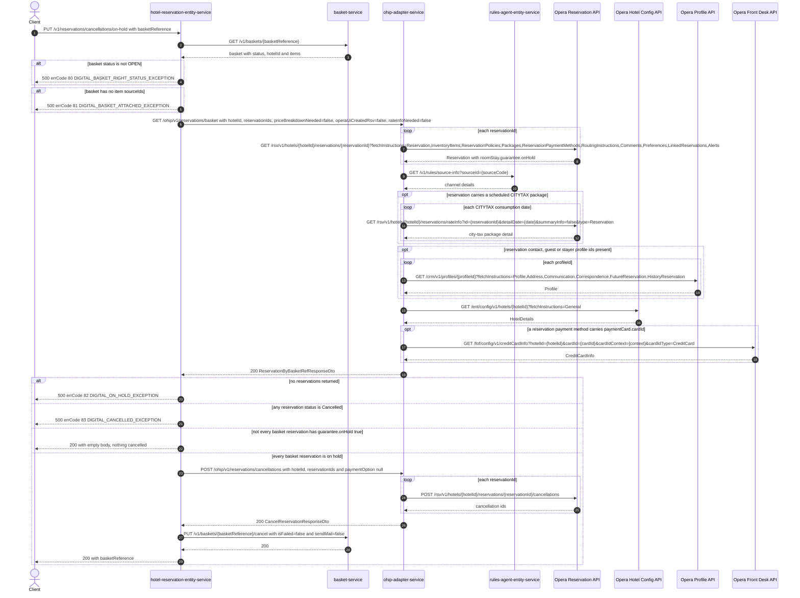

# Hotel Reservation Entity Service: cancelOnHoldReservation Flow

Cancels the Opera reservations held by an OPEN basket, but only when *every* one of them is
still on hold in Opera. It is the "abandon the hold" counterpart of
`POST /v1/reservations/cancellations`: no refund, no deposit reversal and no email are ever
triggered on this path.

```http
PUT /v1/reservations/cancellations/on-hold
Host: hotel-reservation-entity-service:9103
Content-Type: application/json
Accept: application/json
```

The service declares no servlet context path and `HotelReservationController` is mapped under
`/v1`, so the public path is `/v1/reservations/cancellations/on-hold`. No authentication or
authorization is applied at the controller. The body is a `CancelReservationRequestDto`
(`basketReference` is the only required field).

## Flow

`HotelReservationInPortImpl.cancelOnHoldReservation` reads the basket from basket-service
(`GET /v1/baskets/{basketReference}`) and rejects anything whose status is not `OPEN`
(`DIGITAL_BASKET_RIGHT_STATUS_EXCEPTION`, `errCode` `80`, HTTP `500`). It then collects the
`sourceId` of every basket item as the Opera reservation id set, rejecting an empty set with
`DIGITAL_BASKET_ATTACHED_EXCEPTION` (`errCode` `81`).

The OHIP out-port loads those reservations through ohip-adapter-service at
`GET /ohip/v1/reservations/basket` with `priceBreakdownNeeded=false`, `operaUiCreatedRsv=false`
and, critically, **`rateInfoNeeded=false`** - so the reservation-amount rate-info and cashiering
folio enrichment that the sibling basket reads perform never happens here. An empty result is
rejected with `DIGITAL_ON_HOLD_EXCEPTION` (`errCode` `82`); any reservation already in
`Cancelled` status is rejected with `DIGITAL_CANCELLED_EXCEPTION` (`errCode` `83`).

The gate is then the on-hold check: the in-port keeps only the reservations whose
`guarantee.onHold` is `true` (Opera `roomStay.guarantee.onHold`, carried through the
ohip-adapter DTO) and proceeds **only** when that list is non-empty *and* its size equals the
number of basket items. Otherwise the method returns `null`, which the controller still maps to
HTTP `200` with an empty body - no Opera cancellation and no basket write happen in that case.

When the gate passes, `processCancel` runs with `paymentOption` forced to `null` and
`prepaidDeposits` `null`. That drives ohip-adapter-service's `POST /ohip/v1/reservations/cancellations`
down its simple branch: one Opera cancellation POST per reservation id, with no reservation
re-read, no deposit-folio posting, no credit-card capture and no post-cancel payment-method PUT.
Finally the basket is closed with `PUT /v1/baskets/{basketReference}/cancel`, sending
`isFailed=false` and `sendMail=false`; basket-service sets the basket status to `CANCELLED`.
The response body carries only `basketReference`, and only when Opera returned at least one
cancellation id.

## Mermaid Flow



## Features

- Derives the reservation id set from the basket's item `sourceId` values, never from the request body.
- Requires an `OPEN` basket, at least one basket item, and at least one reservation returned by Opera.
- Cancels only when **all** basket reservations are still on hold in Opera; a partial hold is a silent no-op returning `200` with an empty body.
- Loads reservations with `rateInfoNeeded=false`, which skips reservation-amount rate-info and cashiering folio reads.
- Forces `paymentOption` to `null` before calling ohip-adapter, which pins the downstream cancel to its no-payment branch: no deposit-folio posting, no deposit reversal, no post-cancel payment-method PUT.
- **No refund leg.** Unlike `POST /v1/reservations/cancellations`, this endpoint never calls `processRefund`, so `PUT /v1/baskets/{basketReference}/refund` (and the payment orchestration and ThreeC hops behind it) is unreachable regardless of `amountPaid`.
- **No email leg.** `triggerEmailConfirmation` is never called, and the basket cancel is sent with `sendMail=false`; basket-service's `cancelBasket` ignores both `sendMail` and `deposits` and only updates the status.
- Basket state transition: `OPEN` -> `CANCELLED` (basket-service maps `isFailed=false` to `CANCELLED`).
- Response body is `{"basketReference": ...}`; `basketReference` is populated only when Opera returned at least one cancellation id.

## Feature Flags

Two flags are evaluated on this path. Neither changes the endpoint's observable response for a
single-room, all-on-hold basket.

| Flag | Effect when enabled |
| --- | --- |
| `mobile_preRegistered_repurpose` | Evaluated in hotel-reservation-entity-service's `getReservationsByIds` out-port. When **disabled**, every returned reservation has `deRegCardCompleted` forced to `false`. The field is internal to this flow and is not part of the `CancelReservationResponseDto`. |
| `mobile_accepts_ota_booking` | Evaluated in ohip-adapter-service's `getReservationsByIds` in-port. Changes the third-party-booking test used to excuse non-unique deposit policy codes across the basket reservations. It only matters when the basket holds two or more reservations whose policy codes differ; otherwise the branch is unreachable. |

Opera token-service flags (`release_ohip_use_token_service`, `release_ohip_use_token_refresh_skew`)
govern Opera OAuth acquisition inside ohip-adapter-service and are not endpoint behavior.

## Request

| Body field | Required | Purpose |
| --- | --- | --- |
| `basketReference` | Yes (`@NotEmpty`) | Basket to read, cancel against, and close. |
| `hotelId` | Effectively yes | Forwarded to ohip-adapter on the cancel call and used in the Opera cancellation path. The basket read uses `basket.hotelId`, so a mismatch sends the cancel to the wrong hotel. |
| `reservationIds` | No | Ignored: overwritten with the basket item `sourceId` values before the cancel call. |
| `paymentOption` | No | Ignored: overwritten with `null` by `processCancel`, which is what keeps the deposit and refund branches off this path. |
| `reservationOverrideReason` | No | Forwarded to ohip-adapter and replaces the default `CXL` / `Trip Cancelled` Opera cancellation reason. |
| `token` | No | Not read by this in-port. |

## Branches

| Trigger | Behavior |
| --- | --- |
| Basket status is not `OPEN` | `DIGITAL_BASKET_RIGHT_STATUS_EXCEPTION`, `errCode` `80`, HTTP `500`. No Opera call. |
| Basket has no items (no `sourceId`) | `DIGITAL_BASKET_ATTACHED_EXCEPTION`, `errCode` `81`, HTTP `500`. No Opera call. |
| ohip-adapter returns no reservations | `DIGITAL_ON_HOLD_EXCEPTION`, `errCode` `82`, HTTP `500`. Note ohip-adapter itself raises `DIGITAL_RESERVATION_NOT_FOUND` when Opera returns nothing, which surfaces as a downstream failure before this check is reached. |
| Any reservation is in Opera status `Cancelled` | `DIGITAL_CANCELLED_EXCEPTION`, `errCode` `83`, HTTP `500`. |
| No reservation has `guarantee.onHold` true | `200` with an empty body. Opera cancellation and basket cancel are both skipped. |
| Some but not all basket reservations are on hold | Same silent `200` with an empty body. |
| All basket reservations are on hold | One Opera cancellation POST per reservation id, then the basket cancel PUT. |
| Reservation payment method carries `paymentCard.cardId` | One `GET /fof/config/v1/creditCardInfo` during the reservations read. The captured card is unused on this path because the cancel runs with a null `paymentOption`. |
| Reservation carries a scheduled `CITYTAX` package | One Opera `rateInfo` call per consumption date during the reservations read. |
| Reservation carries contact, guest or stayer profile ids | One Opera CRM profile GET per id during the reservations read. |
| Basket reservations have non-unique deposit policy codes | ohip-adapter raises `DIGITAL_POLICY_CODE_NOT_UNIQUE_EXCEPTION` unless `mobile_accepts_ota_booking` classifies the booking as third party. |
| Opera cancellation POST fails | ohip-adapter maps it to `OHIP_CANCEL_RESERVATION_EXCEPTION` (`950`), which propagates as a downstream failure and leaves the basket **uncancelled**. |
| basket-service cancel PUT fails | Propagates after Opera has already cancelled, leaving Opera and the basket inconsistent. |

## Journey coverage

`src/integrationTest/kotlin/uk/co/whitbread/integrationtests/journeys/hotelreservation/CancelOnHoldReservationSpec.kt`
covers this endpoint over a real created basket. Measured Opera cost of the endpoint itself, on a
single-room basket, on top of the setup create: **five** calls on the cancelling path —
`GET .../reservations/{reservationId}`, `GET /ent/config/v1/hotels/{hotelId}`,
`GET /crm/v1/profiles/{profileId}`, `GET /fof/config/v1/creditCardInfo` and
`POST .../cancellations` — and **four** when the hold gate blocks (the read still runs in full).
The already-cancelled rejection costs the same four: ohip-adapter maps the cancelled reservation
in full, including the card lookup, before the in-port's status guard sees it.

Two documented branches carry no scenario:

- **`errCode` `82` (`DIGITAL_ON_HOLD_EXCEPTION`) is unreachable from a journey.** ohip-adapter
  raises `DIGITAL_RESERVATION_NOT_FOUND` when Opera returns nothing, which surfaces as that
  downstream error before the in-port's empty-list check runs.
- **`errCode` `81` (`DIGITAL_BASKET_ATTACHED_EXCEPTION`) is unreachable from a journey.** The real
  create endpoint always attaches at least one item to the basket it mints.

The request-body `hotelId` / `basket.hotelId` mismatch noted in the Request table is
validation-adjacent and gets no journey. So is the missing compensation after a failed basket
cancel; the Opera-rejection scenario proves the basket is *not* cancelled when Opera refuses, but
the reverse inconsistency (Opera cancelled, basket cancel failing) has no journey-observable
trigger and stays documented in the Branches table only.
