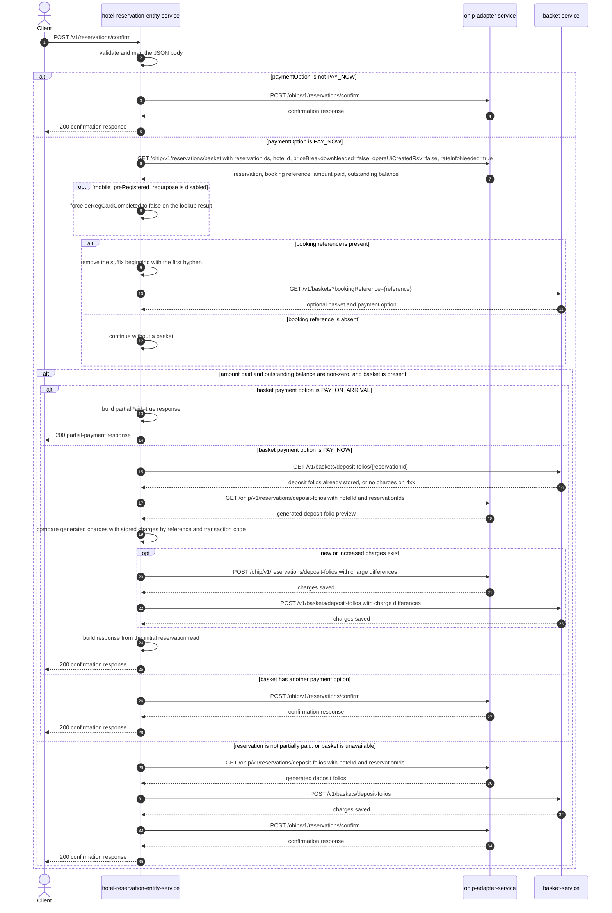

# Hotel Reservation Entity Service: confirmReservation Flow

Confirms one reservation, coordinating PAY_NOW deposit state between OHIP and the basket before delegating the final reservation change when required.

```http
POST /v1/reservations/confirm
Host: hotel-reservation-entity-service:9103
Content-Type: application/json
```

## Flow

The controller validates and maps the request. For payment options other than `PAY_NOW`, hotel-reservation-entity-service forwards the request directly to `ohip-adapter-service` and returns its confirmation response.

For `PAY_NOW`, the service first reads the reservation from OHIP with rate information enabled. When the response has a booking reference, the suffix beginning with the first hyphen is removed and the resulting reference is used to find the basket.

If the reservation has both a non-zero amount paid and a non-zero outstanding balance, the basket's payment option selects the partial-payment behavior. A `PAY_ON_ARRIVAL` basket returns immediately with `partialPaid=true` and does not confirm through OHIP. A `PAY_NOW` basket compares deposit folios already stored in basket-service with a fresh deposit-folio preview from OHIP. Any positive differences are posted to OHIP and then saved in basket-service, after which the response is built from the initial reservation read without calling OHIP's confirm endpoint.

For other `PAY_NOW` states, including a missing basket or booking reference, the service gets the generated deposit folios from OHIP, saves them to basket-service, and then calls OHIP's confirm endpoint. The downstream OHIP confirmation continues through the separate [OHIP confirmReservation flow](../ohip-adapter-service/ConfirmReservation.md).

## Mermaid Flow



## Features

- Direct OHIP confirmation for `PAY_ON_ARRIVAL`, `RESERVE_WITHOUT_CARD`, and `ACCOUNT_COMPANY`
- PAY_NOW reservation and rate-information lookup before confirmation
- Booking-reference normalization by removing a hyphenated suffix before basket lookup
- Detection of reservations that are both partially paid and still have an outstanding balance
- Early `partialPaid=true` response when a partially paid Opera reservation belongs to a `PAY_ON_ARRIVAL` basket
- Reconciliation of generated OHIP deposit folios against charges already stored in basket-service
- Delta-only charge posting to OHIP and basket-service for a partially paid `PAY_NOW` basket
- Confirmation response built either from OHIP's confirm response or from the initial reservation snapshot on the partial `PAY_NOW` path

## Feature Flags

| Flag | Effect when enabled |
| --- | --- |
| `mobile_preRegistered_repurpose` | Preserves `deRegCardCompleted` from the PAY_NOW OHIP reservation lookup. When disabled, hotel-reservation-entity-service forces that field to `false`. This endpoint does not otherwise consume the field when deciding or building its confirmation response. |

The downstream `POST /ohip/v1/reservations/confirm` evaluates its own flags independently; see the linked OHIP flow for those details.

## Request

Important JSON body fields:

| Field | Required | Effect |
| --- | --- | --- |
| `reservationId` | Yes | Reservation read, deposit-folio reconciliation, and OHIP confirmation target |
| `hotelId` | Yes | Hotel used on every OHIP request |
| `paymentOption` | Yes | `PAY_NOW` activates the reservation, basket, and deposit orchestration; other values delegate directly to OHIP |
| `paymentMethod` | No | Forwarded to OHIP and used as the default payment method when posting reconciled deposit-folio differences |
| `paymentType` | No | Forwarded to OHIP confirmation |
| `paymentCard` | No | Card details forwarded to OHIP confirmation: type, token, expiry, holder name, last four digits, and optional CIT id |
| `paymentId` | No | Payment reference forwarded to OHIP; reconciled partial-payment charges use the basket's stored payment ID |
| `pibaCardPresent` | No | Forwarded to OHIP confirmation |
| `ccAgentId` | No | Forwarded to OHIP confirmation |
| `threeDSIndicator` | No | Forwarded to OHIP confirmation |

## Branches

| Trigger | Behavior |
| --- | --- |
| `paymentOption` is not `PAY_NOW` | Skips the preliminary reservation and basket work and calls OHIP confirmation directly |
| PAY_NOW reservation has no booking reference | Generates and saves deposit folios, then calls OHIP confirmation without looking up a basket |
| Booking reference contains `-` | Uses only the text before the first hyphen for the basket lookup |
| Basket lookup returns `404` | Treats the basket as absent, generates and saves deposit folios, then calls OHIP confirmation |
| Amount paid is zero, outstanding balance is zero, or basket is absent | Generates deposit folios through OHIP, saves them to basket-service, then calls OHIP confirmation |
| Amount paid and outstanding balance are non-zero, basket payment option is `PAY_ON_ARRIVAL` | Returns `200` with `partialPaid=true`; no deposit-folio or OHIP confirmation call follows |
| Amount paid and outstanding balance are non-zero, basket payment option is `PAY_NOW` | Reconciles stored and generated deposit folios and returns a confirmation-shaped response from the initial reservation read; it does not call OHIP confirmation |
| Generated partial-payment charge is new or exceeds the stored amount | Posts only the difference to OHIP and basket-service |
| Basket charge lookup returns a client error | Treats that reservation as having no stored deposit folios and compares against an empty set |
| OHIP reservation lookup returns a client error | Propagates `HotelReservationNotFoundException`; a server error propagates `HotelReservationOhipException` |
| OHIP confirm or deposit-folio operation fails | Propagates `HotelReservationOhipException` |
| Basket lookup or charge persistence fails, except the handled not-found cases | Propagates the basket client exception |
