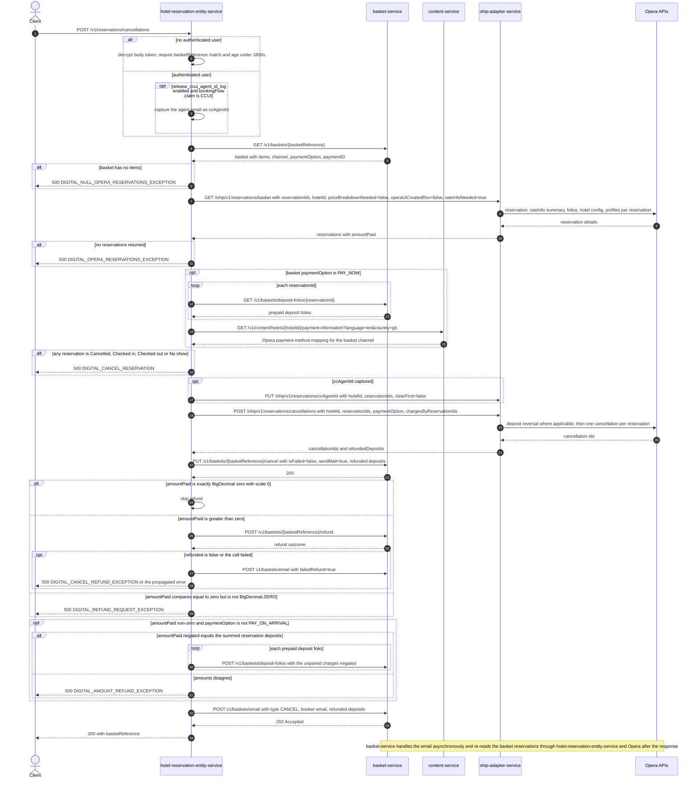

# Hotel Reservation Entity Service: cancelReservation Flow

Cancels every reservation held in a basket: validates the caller, reads the basket and its
Opera reservations, cancels them through `ohip-adapter-service`, cancels the basket, refunds
prepaid money when there is any, and always triggers a cancellation email.

```http
POST /v1/reservations/cancellations
Host: hotel-reservation-entity-service:9103
Content-Type: application/json
Accept: application/json
WB-Authorization: Bearer {token}   # optional; when absent the body's `token` is validated instead
```

`HotelReservationController` is mapped at `/v1` and the service has no servlet context path, so
the public path is `/v1/reservations/cancellations`. The controller method is `cancelReservation`.

## Flow

The controller maps `CancelReservationRequestDto` and calls `HotelReservationInPortImpl.cancelReservation`.

When no authenticated user is present, `ManageBookingUtils.validateToken` decrypts the body's
`token` and rejects the request unless it decodes to the same `basketReference` and is younger
than 1800 seconds. When a user *is* authenticated the token check is skipped entirely.

The service then reads the basket from `basket-service` and takes the reservation ids from the
basket items — the caller's `reservationIds` are overwritten by them. An empty item list is an
error. It reads those reservations back through `ohip-adapter-service`'s basket endpoint with
`priceBreakdownNeeded=false`, `operaUiCreatedRsv=false` and `rateInfoNeeded=true`, which makes
`ohip-adapter-service` load each Opera reservation, its rate-info summary, its cashiering folios,
hotel config and any attached profiles. An empty reservation list is an error, and a reservation
already `Cancelled`, `Checked in`, `Checked out` or `No show` is rejected.

Only when the basket's `paymentOption` is `PAY_NOW` does the service read prepaid charges per
reservation from `basket-service` and resolve a default Opera payment method from
`content-service`. The effective payment option sent downstream comes from `PaymentUtils`: the
basket's own value when set, `PAY_ON_ARRIVAL` for a `DISTR` basket with no payment option, and
otherwise `PAY_ON_ARRIVAL` when the reservations report nothing paid.

The cancellation itself is one `POST /ohip/v1/reservations/cancellations` carrying `hotelId`
(taken from the request body, never from the basket), the basket's reservation ids, the resolved
payment option and any prepaid charges; that call is described in
[the OHIP cancelReservation flow](../ohip-adapter-service/CancelReservation.md). The basket is
then cancelled with `sendNotification=true`.

Afterwards the service always runs the refund and charge-reconciliation steps and always posts a
cancellation email request to `basket-service`, whose handler is asynchronous and re-reads the
basket's reservations after the HTTP response has been returned.

## Mermaid Flow



## Features

- Basket-driven cancellation: the reservation ids acted on always come from the basket items, not from the request body.
- Token-based authorization for unauthenticated callers, using the encrypted `basketReference|epochSeconds` token that `GET /v1/reservations/find` returns; authenticated callers skip it.
- Opera state guard: rejects the cancellation if any reservation is already `Cancelled`, `Checked in`, `Checked out` or `No show`.
- Payment-option resolution from the basket, its channel and the reservations' paid amount.
- `PAY_NOW` only: prepaid deposit-folio lookup per reservation and Opera default-payment-method resolution from content-service, both forwarded to OHIP.
- Optional CCUI agent stamping on the Opera reservations before the cancellation.
- Basket cancellation with `sendMail=true` and the refunded deposits returned by OHIP.
- Refund through basket-service when the reservations report money paid, with a failure email and a dedicated error code when the refund is refused.
- Charge reconciliation: posts negated unpaired deposit-folio charges back to basket-service for non-`PAY_ON_ARRIVAL` bookings with money paid.
- Unconditional cancellation-email trigger; the response carries only `basketReference`.

## Feature Flags

| Flag | Effect when enabled |
| --- | --- |
| `release_ccui_agent_id_log` | Only evaluated for an authenticated caller. When the JWT's booking-flow claim is `CCUI`, the agent's account email is stamped on every Opera reservation via `PUT /ohip/v1/reservations/ccAgentId` before the cancellation. Unreachable on the unauthenticated token path. |
| `mobile_preRegistered_repurpose` | Evaluated inside `getReservationsByIds`. When disabled, `deRegCardCompleted` is forced to `false` on every reservation read here. This endpoint never reads that field afterwards, so the observable response and the downstream call set are identical in both states. |
| `mobile_accepts_ota_booking` | Consumed by `ohip-adapter-service` while validating deposit-policy codes across the basket during the reservation read; see [GetReservationsByIds.md](../ohip-adapter-service/GetReservationsByIds.md). |

Opera token-service flags are evaluated inside `ohip-adapter-service` outside the request context and are not part of this endpoint's behavior.

## Request

| Body field | Required | Purpose |
| --- | --- | --- |
| `basketReference` | Yes | Basket to read, cancel and email about; also the payload the `token` must decrypt to. |
| `hotelId` | Yes in practice | Passed straight through to OHIP, which uses it as the Opera `x-hotelid`. It is never defaulted from the basket, so omitting it fails the OHIP call. |
| `token` | Yes when unauthenticated | Encrypted `basketReference|epochSeconds` string, valid for 1800 seconds. Obtainable from `GET /v1/reservations/find`. |
| `reservationIds` | No | Overwritten with the basket's item source ids before the OHIP call. |
| `paymentOption` | No | Overwritten with the value `PaymentUtils.getPaymentOption` derives from the basket and the reservations. |
| `reservationOverrideReason` | No | Forwarded to OHIP, replacing the default `CXL` / `Trip Cancelled` Opera cancellation reason. |

## Branches

| Trigger | Behavior |
| --- | --- |
| Authenticated caller | Body `token` is not validated at all. |
| Unauthenticated caller with a missing, foreign or expired token | `InvalidTokenException` / `DIGITAL_INVALID_TOKEN2`, mapped to `400`. |
| Basket has no items | `DIGITAL_NULL_OPERA_RESERVATIONS_EXCEPTION` (`500`). |
| OHIP returns no reservations | `DIGITAL_OPERA_RESERVATIONS_EXCEPTION` (`500`). |
| Basket reservations report differing Opera deposit policy codes | `ohip-adapter-service` raises `DIGITAL_POLICY_CODE_NOT_UNIQUE_EXCEPTION` (errCode 19, `500`) inside the reservation read, before any Opera write, unless `mobile_accepts_ota_booking` classifies the basket as third-party. The guard fires on *differing* codes; identical codes across every reservation pass. |
| Any reservation in a non-cancellable Opera status | `DIGITAL_CANCEL_RESERVATION` (`500`), before any Opera write. |
| Basket `paymentOption` is `PAY_NOW` | Adds the per-reservation basket deposit-folio reads and the content-service payment-information lookup, and sends `chargesByReservationIds` to OHIP. |
| Basket `paymentOption` is null and channel is not `DISTR` and reservations report money paid | `DIGITAL_CANCEL_MIGRATED_EXCEPTION` (`500`) from `PaymentUtils`. |
| `amountPaid` is `BigDecimal.ZERO` | Refund skipped; no basket refund call. **The check is `BigDecimal.ZERO.equals(amountPaid)`, which is scale-sensitive: a zero that arrives as `0.0` is not equal to `BigDecimal.ZERO`.** |
| `amountPaid` compares equal to zero but is not `BigDecimal.ZERO` (e.g. `0.0`) | Falls past the early return, fails `ZERO.compareTo(amountPaid) < 0`, and throws `DIGITAL_REFUND_REQUEST_EXCEPTION` (`500`) after the reservations and basket have already been cancelled. |
| `amountPaid` greater than zero | `POST /v1/baskets/{basketReference}/refund`; a `refunded=false` answer or any thrown error sends a `failedRefund=true` cancellation email and rethrows (`DIGITAL_CANCEL_REFUND_EXCEPTION`). |
| Effective `paymentOption` is `PAY_ON_ARRIVAL`, or `amountPaid` is `BigDecimal.ZERO` | Charge reconciliation is skipped. |
| Charge reconciliation runs and the negated `amountPaid` does not match the summed reservation deposits | `DIGITAL_AMOUNT_REFUND_EXCEPTION` (`500`). |
| Always | `POST v1/baskets/email` runs even when nothing was refunded, and basket-service processes it asynchronously with a further reservation read. |
