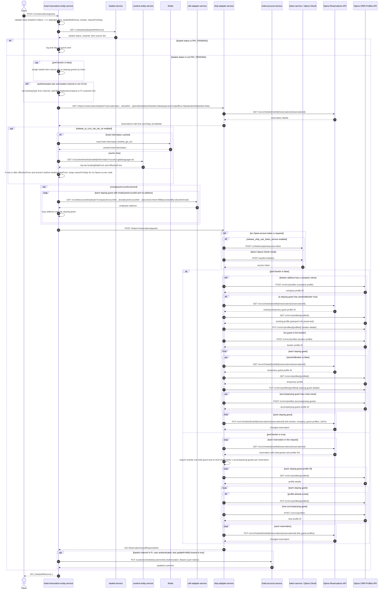

# Hotel Reservation Entity Service: createReservationGuest Flow

This endpoint saves guest details against the Opera reservations held in a basket: it creates or reuses the booker, company, staying-guest, and accompanying-guest profiles in Opera and links them to each reservation.

```http
POST /v1/reservations/guests
Host: hotel-reservation-entity-service:9103
Content-Type: application/json
Authorization: Bearer {token}   # optional; presence changes account enrichment and profile-consent behavior
```

## Flow

The controller validates and maps the body, then passes the basket reference plus the guest request into the domain logic. The first call is always to `basket-service` to load the basket by reference. If the basket status is `PAY_PENDING`, the service logs and does nothing else, still returning `201 Created` with the basket reference.

Otherwise the service takes the basket item source IDs as the Opera reservation IDs. When `preCheckIn` is `false`, it assigns those reservation IDs to the staying guests positionally (guest `i` gets reservation `i`). For an authenticated caller on a non-CCUI channel, it copies the basket channel into `bookingType` and adds the account identifiers from the token: employee plus company IDs for `BB`, customer ID for `PI`.

Before calling OHIP the service reads the reservations back from `ohip-adapter-service` to get the arrival date, then resolves the reason for stay. The reason-for-stay conversion is gated on `release_pi_ccui_city_tax_uk`; when enabled it loads hotel city-tax dates from `content-entity-service` (Redis-cached) and may replace the supplied code with its Opera no-tax equivalent based on the city-tax booking-from, effective-from, and arrival dates.

The guest request then goes to `ohip-adapter-service`. Before sending, the service fills in missing staying-guest addresses from `cdh-adapter-service` when the request carries a company account ID and a guest has an `employeeAccountId` but no address.

Inside `ohip-adapter-service`, the non-pre-check-in path posts a company profile when the booker address has a company name, reuses the temporary Opera profile of the guest flagged `sameAsBooker` (or posts a new booker profile when no such guest exists), updates each other staying guest's temporary profile, posts a profile for each accompanying guest with a last name, and finally issues one Opera change-reservation `PUT` per staying guest to link the profiles. The pre-check-in path instead reads the saved reservations, validates exactly one lead guest and the accompanying-guest count against the reservation's total guests, updates or creates the guest profiles, and links them with one change-reservation `PUT` per reservation.

After OHIP succeeds, a `PI` authenticated caller who sent `updateProfileConsent=true` also has the booker details pushed to `hotel-account-service`. The response is always just the basket reference.

## Mermaid Flow



## Features

- Saves booker, company, staying-guest, and accompanying-guest details onto the Opera reservations held in a basket
- Reuses Opera temporary profiles created at reservation time instead of always creating new ones, preserving existing passport IDs
- Positional mapping of basket item source IDs onto the submitted staying guests for the standard booking flow
- Separate pre-check-in mode that validates lead and accompanying guest counts against each reservation's occupancy
- Authenticated account enrichment: BB employee/company IDs, PI customer ID, and channel-derived booking type
- Business-booker address backfill from CDH for employees whose address is omitted
- Optional city-tax reason-for-stay conversion driven by content hotel information
- Optional customer profile update in hotel-account when the booker consents
- No-op (still `201`) when the basket is already in `PAY_PENDING`

## Feature Flags

| Flag | Effect when enabled |
| --- | --- |
| `release_pi_ccui_city_tax_uk` | Loads the hotel's city-tax dates from content and may replace the submitted `reasonForStay` with its Opera no-tax code when the stay arrives before the city-tax booking-from date. Disabled means the submitted code is forwarded unchanged and no content call happens |
| `mobile_preRegistered_repurpose` | Owned by ohip-adapter's reservations-by-ids read used here for the arrival date: when disabled, every returned reservation has `deRegCardCompleted` forced to `false` |
| `release_ohip_use_token_service` | ohip-adapter obtains Opera credentials through token-service instead of direct Opera OAuth |
| `release_ohip_use_token_refresh_skew` | ohip-adapter refreshes Opera access tokens early using the configured clock skew |

## Request

Important JSON body fields:

| Field | Required | Effect |
| --- | --- | --- |
| `basketReference` | Yes | Basket loaded from basket-service; its status, channel, and item source IDs drive the whole flow and it is echoed in the response |
| `hotelId` | Yes | Six alphabetic characters; used for the reservations read, the content city-tax lookup, and every Opera call |
| `booker` | Yes | Booker profile written to Opera; `booker.address.companyName` triggers an extra Opera company profile, `booker.language` sets the Opera language for booker and guests, `booker.emailAddress` is sent as `accessedBy` on the CDH employee lookup |
| `reasonForStay` | Yes | Opera purpose of stay; may be swapped for its no-tax code under the city-tax flag |
| `stayingGuests` | Yes | At least one; each entry maps to one Opera reservation |
| `stayingGuests[].sameAsBooker` | Yes | `true` marks the guest whose temporary Opera profile is reused as the booker profile; `false` guests get their own profile update |
| `stayingGuests[].reservationId` | No | Overwritten from the basket item source IDs when `preCheckIn` is `false`; used as supplied in pre-check-in mode |
| `stayingGuests[].isAccompanyingGuest` | No | Pre-check-in only: exactly one `false` (lead) guest is required per reservation, and accompanying guests must not exceed the reservation's total guests minus one |
| `stayingGuests[].accompanyingGuestDetails` | No | An accompanying guest with a last name gets its own Opera profile |
| `stayingGuests[].stayingGuestDetails.employeeAccountId` | No | With a company account ID and no address on the guest, triggers the CDH employee address lookup |
| `stayingGuests[].stayingGuestDetails.profileId` | No | Pre-check-in only: identifies which Opera profiles to read and update |
| `preCheckIn` | No | `false` runs the standard booker/guest profile creation and linking; `true` runs the pre-check-in guest update path with occupancy validation |
| `updateProfileConsent` | No | With an authenticated `PI` caller, pushes the booker details to hotel-account after OHIP succeeds |
| `companyId`, `bookerProfileId`, `companyProfileId` | No | Carried through to the OHIP guest request |
| `sendEmailConfirmation`, `sendEmailInvoice` | No | Carried through to the OHIP guest request |

## Branches

| Trigger | Behavior |
| --- | --- |
| Basket status `PAY_PENDING` | Skips reservation reads, OHIP, CDH, content, and hotel-account entirely; returns `201` with the basket reference |
| `preCheckIn=false` | Staying guests are re-keyed to the basket item source IDs by position, so guest count must match the basket item count |
| Authenticated caller, basket channel not `CCUI` | Booking type becomes the basket channel; `BB` adds employee and company IDs, `PI` adds the customer ID |
| Anonymous caller or `CCUI` channel | No account enrichment; the request goes to OHIP as submitted |
| Hotel information cache hit | Skips the content-entity-service call while resolving city-tax dates |
| `companyAccountId` set with employee guests missing addresses | One CDH employee lookup per such guest; a CDH error is swallowed and the address stays empty |
| Guest flagged `sameAsBooker` present | OHIP reuses that reservation's temporary profile as the booker profile instead of posting a new one |
| Pre-check-in lead or accompanying guest counts invalid | OHIP fails with `OHIP_PUT_RESERVATIONS_GUEST_EXCEPTION` ("A reservation must have exactly one lead guest" / "Max Accompanying Guests allowed is: N") |
| Invalid city-tax or arrival date format | The city-tax resolution throws a date parse error rather than falling back |
| `PI` + authenticated + `updateProfileConsent=true` | Extra authorized `PUT` to hotel-account with the booker details |
